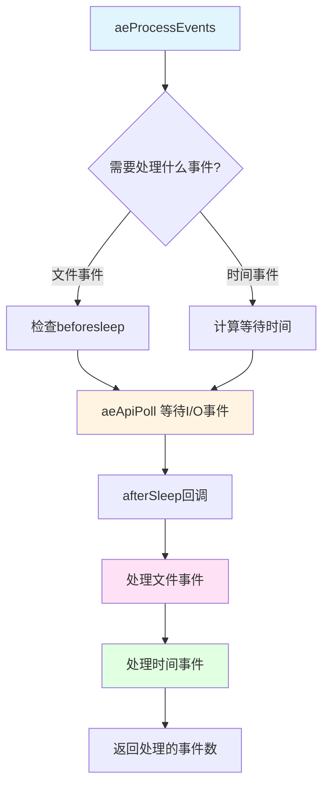

# Redis 事件循环 (AE) 学习文档

## 一、概述

Redis 使用了自研的简洁事件循环库 **AE (A Simple Event-Driven Programming Library)**。该库最初为 Tcl 解释器 Jim 编写，后移植为独立库供 Redis 使用。

### 核心特点

- **跨平台**：自动选择最佳多路复用 I/O API
  - Linux: epoll
  - macOS/BSD: kqueue
  - Burning: evport
  - 兜底: select
- **事件驱动**：文件事件 + 时间事件
- **非阻塞 I/O**：高效处理高并发连接
- **简洁设计**：代码量小，易于理解

## 二、架构设计

### 2.1 核心数据结构

```c
// 事件循环主体
typedef struct aeEventLoop {
    int maxfd;              // 当前注册的最大文件描述符
    int setsize;            // 最大支持的文件描述符数量
    long long timeEventNextId;  // 时间事件ID计数器
    aeFileEvent *events;    // 文件事件数组（以fd为索引）
    aeFiredEvent *fired;    // 已触发的事件数组
    aeTimeEvent *timeEventHead; // 时间事件链表头
    int stop;               // 停止标志
    void *apidata;          // 多路复用API特定数据
    aeBeforeSleepProc *beforesleep; // 睡眠前回调
    aeBeforeSleepProc *aftersleep;  // 睡眠后回调
    int flags;              // 事件循环标志
    void *privdata[2];      // 私有数据
} aeEventLoop;

// 文件事件
typedef struct aeFileEvent {
    int mask;               // AE_READABLE | AE_WRITABLE | AE_BARRIER
    aeFileProc *rfileProc;  // 读事件处理函数
    aeFileProc *wfileProc;  // Movie事件处理函数
    void *clientData;       // 客户端数据
} aeFileEvent;

// 时间事件
typedef struct aeTimeEvent {
    long long id;           // 事件ID
    monotime when;          // 触发时间（单调时间）
    aeTimeProc *timeProc;   // 时间事件处理函数
    aeEventFinalizerProc *finalizerProc; // 析构函数
    void *clientData;       // 客户端数据
    struct aeTimeEvent *prev;
    struct aeTimeEvent *next;
    int refcount;           // 引用计数（防止递归调用中释放）
} aeTimeEvent;
```

### 2.2 事件类型

| 事件类型 | 值 | 说明 |
|---------|-----|------|
| `AE_READABLE` | 1 | 文件描述符可读 |
| `AE_WRITABLE` | 2 | 文件描述符可写 |
| `AE_BARRIER` | 4 | 屏障标志（先写后读） |
| `AE_FILE_EVENTS` | (1<<0) | 处理文件事件 |
| `AE_TIME_EVENTS` | (1<<1) | 处理时间事件 |
| `AE_ALL_EVENTS` | 0x03 | 处理所有事件 |
| `AE_DONT_WAIT` | (1<<2) | 不等待（非阻塞） |

## 三、事件循环流程

### 3.1 主循环

```c
void aeMain(aeEventLoop *eventLoop) {
    eventLoop->stop = 0;
    while (!eventLoop->stop) {
        aeProcessEvents(eventLoop, 
                       AE_ALL_EVENTS |
                       AE_CALL_BEFORE_SLEEP |
                       AE_CALL_AFTER_SLEEP);
    }
}
```

### 3.2 事件处理核心函数



**详细代码流程**：

```c
int aeProcessEvents(aeEventLoop *eventLoop, int flags) {
    // 1. 计算超时时间
    if (需要等待 && 有时间事件) {
        timeout = 最早的时间事件 - 现在;
    }
    
    // 2. beforeSleep 钩子
    if (beforesleep) beforesleep(eventLoop);
    
    // 3. 多路复用 I/O - 等待事件
    numevents = aeApiPoll(eventLoop, timeout);
    
    // 4. afterSleep 钩子
    if (aftersleep) aftersleep(eventLoop);
    
    // 5. 处理文件事件
    for (j = 0; j < numevents; j++) {
        处理可读事件();
        处理可写事件();
    }
    
    // 6. 处理时间事件
    processTimeEvents(eventLoop);
    
    return processed;
}
```

### 3.3 beforeSleep 钩子

在Redis中，`beforeSleep` 执行关键的后台任务：

```c
void beforeSleep(struct aeEventLoop *eventLoop) {
    // 1. 更新内存峰值
    updatePeakMemory();
    
    // 2. 处理待处理的连接数据（如TLS）
    connTypeProcessPendingData();
    
    // 3. 集群相关检查
    if (server.cluster_enabled) clusterBeforeSleep();
    
    // 4. 处理阻塞的客户端
    blockedBeforeSleep();
    
    // 5. 活跃键过期
    activeExpireCycle(ACTIVE_EXPIRE_CYCLE_FAST);
    
    // 6. 模块钩子
    moduleFireServerEvent(..., REDISMODULE_SUBEVENT_EVENTLOOP_BEFORE_SLEEP);
    
    // 7. 发送WAIT命令的ACK请求
    sendGetackToReplicas();
    
    // 8. AOF文件刷新
    flushAppendOnlyFile(0);
    
    // 9. 处理客户端待写数据
    handleClientsWithPendingWrites();
    
    // 10. 处理IO线程的客户端
    processClientsOfAllIOThreads();
    
    // 11. 断开内存占用过大的客户端
    evictClients();
    
    // 12. 释放模块GIL
    moduleReleaseGIL();
}
```

### 3.4 afterSleep 钩子

```c
void afterSleep(struct aeEventLoop *eventLoop) {
    // 1. 获取模块GIL
    moduleAcquireGIL();
    
    // 2. 模块钩子
    moduleFireServerEvent(..., REDISMODULE_SUBEVENT_EVENTLOOP_AFTER_SLEEP);
}
```

## 四、多路复用 I/O API

### 4.1 自动选择机制

```c
// src/ae.c
#ifdef HAVE_EVPORT
    #include "ae_evport.c"  // Solaris
#else
    #ifdef HAVE_EPOLL
        #include "ae_epoll.c"  // Linux
    #else
        #ifdef HAVE_KQUEUE
            #include "ae_kqueue.c"  // macOS/BSD
        #else
            #include "ae_select.c"  // 兜底
        #endif
    #endif
#endif
```

### 4.2 API 接口

每个实现必须提供5个函数：

| 函数 | 作用 |
|------|------|
| `aeApiCreate()` | 创建多路复用实例 |
| `aeApiFree()` | 释放资源 |
| `aeApiAddEvent()` | 添加文件描述符 |
| `aeApiDelEvent()` | 删除文件描述符 |
| `aeApiPoll()` | 等待事件 |
| `aeApiName()` | 返回API名称 |

### 4.3 epoll 实现示例

```c
// Linux epoll实现
typedef struct aeApiState {
    int epfd;                           // epoll文件描述符
    struct epoll_event *events;         // epoll事件数组
} aeApiState;

static int aeApiCreate(aeEventLoop *eventLoop) {
    aeApiState *state = zmalloc(sizeof(aeApiState));
    state->events = zmalloc(sizeof(struct epoll_event) * eventLoop->setsize);
    state->epfd = epoll_create(1024);
    eventLoop->apidata = state;
    return 0;
}

static int aeApiPoll(aeEventLoop *eventLoop, struct timeval *tvp) {
    aeApiState *state = eventLoop->apidata;
    // 调用 epoll_wait
    retval = epoll_wait(state->epfd, state->events, 
                       eventLoop->setsize, timeout);
    
    // 转换为AE事件格式
    for (j = 0; j < retval; j++) {
        if (e->events & EPOLLIN) mask |= AE_READABLE;
        if (e->events & EPOLLOUT) mask |= AE_WRITABLE;
        eventLoop->fired[j].fd = e->data.fd;
        eventLoop->fired[j].mask = mask;
    }
    return retval;
}
```

### 4.4 性能对比

| API | 复杂度 | 最大并发 | 性能 |
|-----|--------|---------|------|
| **epoll** | O(1) | 数千 | 最佳 |
| **kqueue** | O(1) | 数千 | 优秀 |
| **evport** | O(1) | 数千 | 优秀 |
| **select** | O(n) | 1024 | 较差 |

## 五、文件事件编写的理

### 5.1 注册文件事件

```c
int aeCreateFileEvent(aeEventLoop *eventLoop, int fd, int mask,
                      aeFileProc *proc, void *clientData) {
    aeFileEvent *fe = &eventLoop->events[fd];
    
    // 添加到多路复用I/O
    if (aeApiAddEvent(eventLoop, fd, mask) == -1)
        return AE_ERR;
    
    // 注册回调
    fe->mask |= mask;
    if (mask & AE_READABLE) fe->rfileProc = proc;
    if (mask & AE_WRITABLE) fe->wfileProc = proc;
    fe->clientData = clientData;
    
    // 更新maxfd
    if (fd > eventLoop->maxfd)
        eventLoop->maxfd = fd;
    
    return AE_OK;
}
```

### 5.2 处理文件事件

```c
for (j = 0; j < numevents; j++) {
    int fd = eventLoop->fired[j].fd;
    aeFileEvent *fe = &eventLoop->events[fd];
    int mask = eventLoop->fired[j].mask;
    int invert = fe->mask & AE_BARRIER;
    
    // 正常情况下：先读后写
    if (!invert && (mask & AE_READABLE)) {
        fe->rfileProc(eventLoop, fd, fe->clientData, mask);
    }
    
    if (mask & AE_WRITABLE) {
        fe->wfileProc(eventLoop, fd, fe->clientData, mask);
    }
    
    // 屏障模式：先写后读
    if (invert && (mask & AE_READABLE)) {
        fe->rfileProc(eventLoop, fd, fe->clientData, mask);
    }
}
```

### 5.3 AE_BARRIER 模式

**用途**：确保在某些操作（如 fsync）完成后再读取数据。

**示例场景**：
```c
// 需要确保AOF文件已持久化后再回复客户端
// 1. 写事件：触发AOF fsync
// 2. 读事件：读取客户端数据（在fsync完成后）
```

## 六、时间事件处理

### 6.1 创建时间事件

```c
long long aeCreateTimeEvent(aeEventLoop *eventLoop, long long milliseconds,
                            aeTimeProc *proc, void *clientData,
                            aeEventFinalizerProc *finalizerProc) {
    aeTimeEvent *te = zmalloc(sizeof(*te));
    te->id = eventLoop->timeEventNextId++;
    te->when = getMonotonicUs() + milliseconds * 1000;
    te->timeProc = proc;
    te->finalizerProc = finalizerProc;
    te->clientData = clientData;
    
    // 插入到链表头部
    te->next = eventLoop->timeEventHead;
    eventLoop->timeEventHead = te;
    
    return te->id;
}
```

### 6.Store 处理时间事件

```c
static int processTimeEvents(aeEventLoop *eventLoop) {
    aeTimeEvent *te = eventLoop->timeEventHead;
    monotime now = getMonotonicUs();
    
    while (te) {
        // 检查是否需要触发
        if (te->when <= now) {
            // 增加引用计数
            te->refcount++;
            
            // 执行回调
            int retval = te->timeProc(eventLoop, te->id, te->clientData);
            
            // 减少引用计数
            te->refcount--;
            
            // 如果是周期性事件，更新时间
            if (retval != AE_NOMORE) {
                te->when = now + retval * 1000;
            } else {
                // 一次性事件，标记删除
                te->id = AE_DELETED_EVENT_ID;
            }
        }
        te = te->next;
    }
    
    // 删除标记为AE_DELETED_EVENT_ID的事件
    清理删除的事件();
}
```

### 6.3 serverCron - Redis的定时任务

```c
// 每秒执行多次（根据server.hz配置）
int serverCron(struct aeEventLoop *eventLoop, long long id, void *clientData) {
    // 1. 更新服务器时间
    updateCachedTime(1);
    
    // 2. 处理过期键
    databasesCbj();
    
    // 3. RDB/AOF持久化检查
    rdbSaveBackground();
    aofRewriteBackground();
    
    // 4. 复制检查
    replicationCron();
    
    // 5. 统计信息收集
    统计信息收集();
    
    // 6. 内存管理
    内存整理();
    
    // 返回下次执行间隔（毫秒）
    return 1000 / server.hz;
}
```

## 七、完整事件循环图

```mermaid
sequenceDiagram
    participant Main as 主线程
    participant Loop as 事件循环
    participant Api as I/O多路复用
    participant Client as 客户端
    participant Time as 时间事件
    
    Main->>Loop: aeMain()
    
    loop 事件循环
        Main->>Loop: aeProcessEvents()
        
        alt 非阻塞模式
            Loop->>Api: aeApiPoll(timeout=0)
        else 阻塞模式
            Loop->>Api: aeApiPoll(timeout)
        end
        
        Api-->>Loop: 返回就绪的文件描述符
        
        Loop->>Client: 处理文件事件
        Client-->>Loop: 回调执行
        
        Loop->>Time: 处理时间事件
        Time-->>Loop: 回调执行
        
        Loop-->>Main: 返回处理的事件数
    end
```

## 八、关键API使用示例

### 8.1 注册客户端连接事件

```c
// 在 accept 后创建文件事件
aeCreateFileEvent(server.el, fd, AE_READABLE, 
                  readQueryFromClient, c);
```

### 8.2 注册定时任务

```c
// 注册serverCron定时器（1毫秒间隔）
aeCreateTimeEvent(server.el, 1, serverCron, NULL, NULL);
```

### 8.3 删除文件事件

```c
// 客户端关闭时
aeDeleteFileEvent(server.el, fd, AE_READABLE | AE_WRITABLE);
```

### 8.4 停止事件循环

```c
// 优雅关闭
aeStop(server.el);  // 设置 stop = 1
// aeMain 在下次循环时会退出
```

## 九、性能优化技巧

### 9.1 事件循环标志位

```c
// 设置不等待标志（用于模块释放GIL后快速唤醒）
aeSetDontWait(eventLoop, 1);
```

### 9.2 动态调整大小

```c
// 增加事件循环容量
aeResizeSetSize(eventLoop, 10240);
```

### 9.3 批量文件事件处理

在 `beforeSleep` 中批量处理：
- 客户端写缓冲
- IO线程客户端
- 异步删除的客户端

## 十、调试技巧

### 10.1 查看使用的I/O API

```bash
redis-cli INFO server | grep executable
# 或者在代码中：
printf("%s\n", aeGetApiName());  // 输出: epoll
```

### 10.2 跟踪事件处理

```c
// 在 aeProcessEvents 中添加日志
printf("Processed %d events\n", processed);
```

### 10.3 监控事件循环延迟

```bash
redis-cli --latency-history
```

## 十一、常见问题

### Q1: 为什么Redis是单线程的？

A: **单线程执行命令**保证数据一致性，但使用多线程处理I/O和后台任务：
- 主线程：命令执行、事件循环
- BIO线程：AOF fsync、延迟删除
- IO线程：读写网络数据

### Q2: 如何理解AE_BARRIER？

A: 改变读写事件的处理顺序。常用于确保持久化操作完成后再响应客户端。

### Q3: 时间事件为什么使用链表而非优先队列？

A: Redis的时间事件通常很少，链表实现简单且O(N)遍历开销可忽略。若大量定时器，可改用heap/skiplist优化。

### Q4: 事件循环会阻塞吗？

A: 会短暂阻塞在 `aeApiPoll()`，但：
- 超时由最早的时间事件决定（通常很短）
- 有I/O事件时立即返回

## 十二、参考资料

- [ae.c源码](https://github.com/redis/redis/blob/unstable/src/ae.c)
- [ae.h头文件](https://github.com/redis/redis/blob/unstable/src/ae.h)
- [epoll手册](https://man7.org/linux/man-pages/man7/epoll.7.html)
- [Redis设计与实现](http://redisbook.com/)

