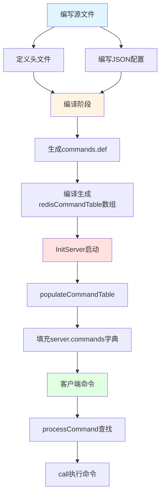

# Redis 自定义核心命令实现指南

## 概述

本文档详细说明如何在 Redis 源码中实现一个自定义核心命令 `GET_OR_SET`。这种方式需要修改 Redis 源码并重新编译。

### 命令功能

**命令:** `GET_OR_SET key default_value`

**行为:**
1. 当 key 存在时，返回 key 当前的值
2. 当 key 不存在时，将 `default_value` 设置为 key 的值，并返回新设置的值

**示例:**
```redis
> GET_OR_SET counter 0
"0"              # 键不存在，设置并返回 0

> GET_OR_SET counter 100
"0"              # 键存在，返回旧值

> INCR counter
(integer) 1

> GET_OR_SET counter 0
"1"              # 键存在，返回当前值
```

### 优点与缺点

**优点：**
- 性能最优
- 完全集成到 Redis
- 可以使用所有内部 API

**缺点：**
- 需要重新编译 Redis
- 维护成本高
- 升级需要重新适配

**适用场景：**
- 学习和研究 Redis 内部机制
- 需要最大性能的场景
- 对 Redis 进行深度定制

---

## 实现原理

### 整体流程

Redis 命令注册机制经历了以下几个阶段：



### 文件作用详解

#### 1. 源代码文件 (`t_getorset.c`)

**作用**: 实现命令的核心逻辑

- **函数实现**: `getOrSetCommand()` - 命令的实际处理逻辑
- **集群支持**: `getOrSetGetKeys()` - 用于 Redis Cluster 的键提取函数
- **功能**: 当键不存在时设置并返回，存在时返回当前值

```c
// 这些是实际的命令执行代码
void getOrSetCommand(client *c) { ... }
int getOrSetGetKeys(...) { ... }
```

#### 2. 头文件声明 (`server.h`)

**作用**: 声明函数签名，供编译器进行符号解析

- **函数声明**: 告诉编译器函数的参数和返回值类型
- **编译检查**: 在链接阶段确保函数定义与声明匹配
- **符号导出**: 使得其他文件可以调用这些函数

```c
// 在 server.h 中声明
void getOrSetCommand(client *c);
int getOrSetGetKeys(struct redisCommand *cmd, robj **argv, int argc, getKeysResult *result);
```

**工作原理**:
1. 编译时：`gcc` 看到函数声明，知道函数存在但可能在其他文件中定义
2. 链接时：`ld` 将所有 `.o` 文件链接在一起，匹配函数定义
3. 如果找不到定义 → 链接错误：`undefined reference`

#### 3. JSON 配置文件 (`commands/getorset.json`)

**作用**: 描述命令的元数据和行为规范

- **元数据**: 命令名、复杂度、版本、分组等
- **参数规格**: 参数数量、类型、键的位置
- **安全属性**: ACL 类别、命令标志（读写、阻塞等）
- **文档信息**: 命令说明、历史变更

```json
{
    "GET_OR_SET": {
        "function": "getOrSetCommand",  // ← 指向 .c 文件中的函数
        "command_flags": ["WRITE", "DENYOOM"],
        "acl_categories": ["STRING"],
        "arity": 3,
        ...
    }
}
```

**工作原理**:
1. 编译时：Python 脚本读取 JSON 文件
2. 自动生成：`generate-command-code.py` 生成 `commands.def`
3. 转换为 C 代码：生成 `redisCommandTable[]` 静态数组

**文件位置**：
- 源文件：`src/commands/getorset.json`
- 生成文件：`src/commands.def`
- 包含 GET_OR_SET 的部分：约第 10822-10845 行和第 11594 行

**生成的核心结构**:
```c
// commands.def (自动生成)
struct redisCommand redisCommandTable[] = {
    {
        .declared_name = "GET_OR_SET",
        .proc = getOrSetCommand,  // ← 函数指针
        .arity = 3,
        .flags = CMD_WRITE | CMD_DENYOOM,
        .acl_categories = ACL_CATEGORY_STRING,
        ...
    },
    ...
};
```

#### 4. 对象文件 (`t_getorset.o`)

**作用**: 编译后的二进制代码，包含函数实现

- **机器码**: 编译器将 C 源码转换为目标平台的机器指令
- **符号表**: 包含函数名和地址的映射关系
- **链接单元**: 最终会被链接器合并到 `redis-server` 可执行文件

**工作原理**:
```bash
# 编译过程
gcc -c t_getorset.c -o t_getorset.o
# ↓
# t_getorset.o 包含：
# - getOrSetCommand 的机器码
# - getOrSetGetKeys 的机器码
# - 符号表（函数名地址映射）

# 链接过程
ld -o redis-server ... *.o ...
# ↓
# 将所有 .o 文件合并成一个可执行文件
```

### 运行时注册流程

#### 1. 服务器启动 (`initServer`)

```c
// src/server.c:2328
void initServer(void) {
    // 创建命令字典
    server.commands = dictCreate(&commandTableDictType);
    server.orig_commands = dictCreate(&commandTableDictType);
    
    // 注册所有命令
    populateCommandTable();  // ← 关键！
}
```

#### 2. 命令表填充 (`populateCommandTable`)

```c
// src/server员工人员.c:3258
void populateCommandTable(void) {
    for (j = 0;; j++) {
        c = redisCommandTable + j;  // 遍历静态数组
        if (c->declared_name == NULL)
游戏 break;
        
        c->fullname = sdsnew(c->declared_name);
        
        // 填充命令结构
        if (populateCommandStructure(c) == C_ERR)
            continue;
        
        // 添加到命令字典
        dictAdd(server.commands, sdsdup(c->fullname), c);
        dictAdd(server.orig_commands, sdsdup(c->fullname), c);
    }
}
```

**关键数据结构**:
```c
// server.commands 是一个字典
// Key: "GET_OR_SET" (命令名字符串)
// Value: redisCommand* (命令结构体指针)
// 
// GET_OR_SET -> {proc: getOrSetCommand, arity: 3, ...}
```

#### 3. 命令查找和执行

```c
// 客户端发送: GET_OR_SET foo bar

// 1. 解析命令
processInputBuffer(c);  // argv[0]="GET_OR_SET", argv[1]="foo", ...

// 2. 查找命令
c->cmd = lookupCommand(c->argv, c->argc);
// dictFetchValue(server.commands, "GET_OR_SET")
// ↓ 返回 redisCommand 结构体指针

// 3. 执行命令
call(c, CMD_CALL_FULL);
// ↓
c->cmd->proc(c);  // 调用 getOrSetCommand(c)
```

### 各文件的协作关系

```
┌─────────────────────────────────────────────────┐
│  开发阶段                                       │
├─────────────────────────────────────────────────┤
│  t_getorset.c  → 提供函数实现                   │
│  server.h      → 提供函数声明                   │
│  getorset.json → 提供命令元数据                 │
└─────────────────────────────────────────────────┘
           ↓
┌─────────────────────────────────────────────────┐
│  编译阶段                                       │
├─────────────────────────────────────────────────┤
│  1. gcc -c t_getorset.c          → t_getorset.o│
│  2. python generate-command-code.py            │
│     read getorset.json           → commands.def │
│  3. gcc compile commands.def                   │
│     → redisCommandTable[] 静态数组              │
└─────────────────────────────────────────────────┘
           ↓
┌─────────────────────────────────────────────────┐
│  链接阶段                                       │
├─────────────────────────────────────────────────┤
│  ld -o redis-server *.o                         │
│  → 链接所有 .o 文件                             │
│  → 匹配函数定义和声明                           │
│  → 生成最终可执行文件                           │
└─────────────────────────────────────────────────┘
           ↓
┌─────────────────────────────────────────────────┐
│  运行时                                         │
├─────────────────────────────────────────────────┤
│  redis-server 启动                              │
│  → populateCommandTable()                      │
│  → 从 redisCommandTable[] 填充 server.commands │
│  → 客户端发送命令                                │
│  → lookupCommand() 查找命令                     │
│  → call() 执行命令                              │
└─────────────────────────────────────────────────┘
```

**关键理解**:

1. **`.c` + `.h`**: 代码实现层 - "命令做什么"
2. **`.json`**: 元数据层 - "命令是什么属性"  
3. **`.o`**: 机器码层 - 可执行的二进制代码
4. **`commands.def`**: 桥接层 - 将元数据转换为 C 代码
5. **`redisCommandTable`**: 注册层 - 命令的静态数组
6. **`server.commands`**: 运行时层 - 命令的动态字典

**这样设计的好处**：
- **解耦**: 代码实现与元数据分离
- **自动化**: JSON 自动生成 C 代码
- **类型安全**: 编译时检查函数签名
- **文档友好**: JSON 可自动生成文档

---

## 实现步骤

### 步骤1: 创建命令实现文件

**文件:** `src/t_getorset.c`

```c
#include "server.h"

/* GET_OR_SET key default_value
 * - 如果 key 存在：返回当前值
 * - 如果 key 不存在：设置 value 并返回
 */
void getOrSetCommand(client *c) {
    robj *key, *value;
    
    // 1. 获取参数
    key = c->argv[1];
    value = c->argv[2];
    
    // 2. 查找键
    robj *o = lookupKeyRead(c->db, key);
    
    if (o == NULL) {
        // 应对节点存在：设置新值
        value = tryObjectEncoding(value);  // 编码优化
        
        // 写入数据库 (使用setKey的新签名)
        setKey(c, c->db, key, &value, 0);
        
        // 增加引用计数
        incrRefCount(value);
        
        // 标记数据已修改
        server.dirty++;
        
        // 发送键空间通知
        notifyKeyspaceEvent(NOTIFY_STRING, "set", key, c->db->id);
        
        // 返回新设置的值
        addReplyBulk(c, value);
        
        serverLog(LL_DEBUG, "GET_OR_SET: created key %s", 
                  (char*)key->ptr);
    } else {
        // 键存在：返回当前值
        if (checkType(c, o, OBJ_STRING)) {
            return;
        }
        addReplyBulk(c, o);
        
        serverLog(LL_DEBUG, "GET_OR_SET: returned existing value for %s", 
                  (char*)key->ptr);
    }
}

// 获取键的函数（用于集群）
int getOrSetGetKeys(struct redisCommand *cmd, robj **argv, int argc, 
                    getKeysResult *result) {
    keyReference *keys;
    UNUSED(cmd);
    UNUSED(argv);
    
    if (argc >= 3) {
        keys = getKeysPrepareResult(result, 1);
        keys[0].pos = 1;  // key 在第 1 个位置 (argv[1])
        keys[0].flags = CMD_KEY_RW;
        result->numkeys = 1;
    }
    return C_OK;
}
```

**代码要点说明:**

1. **setKey 新签名**: `setKey(c, c->db, key, &value, 0)` - 第 5 个参数是 flags
2. **keyReference 结构**: 使用 `keys[0].pos` 和 `keys[0].flags` 设置键位置和属性
3. **参数验证**: 检查 `argc >= 3` 确保有 key 和 value

### 步骤2: 声明命令函数

**文件:** `src/server.h`

在函数声明部分（大约在第3900-4084行之间，与其他命令声明一起）添加：

```c
// 在 server.h 的适当位置添加
void getOrSetCommand(client读取命令文件。
int getOrSetGetKeys(struct redisCommand *cmd, robj **argv, int argc, getKeysResult *result);
```

**具体位置示例（在 setCommand 附近，约第3903行）：**

```c
// 文件：src/server.h
// 位置：约第3903行附近（在 setCommand 声明之后）

void setCommand(client *c);
void setnxCommand(client *c);
void setexCommand(client *c);
void psetexCommand(client *c);
void getCommand(client *c);
void getexCommand(client *c);
// ← 在这里添加新命令的声明
void getOrSetCommand(client *c);
int getOrSetGetKeys(struct redisCommand *cmd, robj **argv, int argc, getKeysResult *result);
```

**注意事项：** 
- 函数声明应该与其他命令函数声明保持一致的格式
- `getOrSetCommand` 是主要的命令处理函数
- `getOrSetGetKeys` 是用于 Redis Cluster 的键提取函数（Cluster 模式下必需）
- 所有命令函数声明都在 `/* Commands prototypes */` 注释区域

### 步骤3: 创建 JSON 定义文件

**文件:** `src/commands/getorset.json`

```json
{
    "GET_OR_SET": {
        "summary": "Interpretation: if the key exists, return the current cet return the new default value.",
        "complexity": "O(1)",
        "group": "string",
        "since": "8.5.0",
        "arity": 3,
        "function": "getOrSetCommand",
        "get_keys_function": "getOrSetGetKeys",
        "command_flags": [
            "WRITE",
            "DENYOOM"
        ],
        "acl_categories": [
            "STRING"
        ],
        "key_specs": [
            {
                "flags": [
                    "RW",
                    "UPDATE"
                ],
                "begin_search": {
                    "index": {
                        "pos": 1
                    }
                },
                "find_keys": {
                    "range": {
                        "lastkey": 0,
                        "step": 1,
                        "limit": 0
                    }
                }
            }
        ],
        "arguments": [
            {
                "name": "key",
                "type": "key",
                "key_spec_index": 0
            },
            {
                "name": "default-value",
                "type": "string"
            }
        ]
    }
}
```

**JSON 格式注意事项:**

1. **参数名使用连字符**: `default-value` 而不是 `default_value`（Redis 命令参数不支持下划线）
2. **文件末尾**: 必须有两个闭合括号 `}`（嵌套对象的闭合）
3. **编码**: 使用 UTF-8 编码

### 步骤4: 修改 Makefile

**文件:** `src/Makefile`

有两种方式添加 `t_getorset.o`：

**方式A：直接修改（推荐，简单直接）**

在 `REDIS_SERVER_OBJ` 列表中添加 `t_getorset.o`：

```makefile
REDIS_SERVER_OBJ=threads_mngr.o memory_prefetch.o adlist.o quicklist.o ... t_string.o t_getorset.o t_list.o ...
```

**具体位置**: 约第 385 行，在 `t_string.o` 和 `t_list.o` 之间添加 `t_getorset.o`。

**方式B：使用 += 追加（便于维护扩展）**

在 Makefile 中（约第 385 行）添加：

```makefile
GET_OR_SET_OBJ=t_getorset.o
REDIS_SERVER_OBJ=... (原有的长列表保持不变)
REDIS_SERVER_OBJ+=$(GET_OR_SET_OBJ)
```

**完整示例（约第 385-387 行）：**

```makefile
REDIS_SENTINEL_NAME=redis-sentinel$(PROG_SUFFIX)
GET_OR_SET_OBJ=t_getorset.o
REDIS_SERVER_OBJ=threads_mngr.o memory_prefetch.o adlist.o quicklist.o ... t_string.o t_list.o t_set.o ... (原有完整列表)
REDIS_SERVER_OBJ+=$(GET_OR_SET_OBJ)
REDIS_CLI_NAME=redis-cli$(PROG_SUFFIX)
```

这种方式的好处：
- ✅ **不需要修改长列表**：保持原有列表完整
- ✅ **便于添加多个自定义命令**：每个命令定义自己的变量
- ✅ **修改更清晰**：集中在文件开头，一目了然
- ✅ **维护友好**：更新或删除自定义命令时只需修改对应变量

**建议**: 
- 如果只有一个自定义命令，两种方式都可以
- 如果要添加多个自定义命令，强烈推荐使用方式B

### 步骤5: 编译与测试

```bash
cd github/redis-unstable

# 清理旧编译
make clean

# 编译（使用编译数据库生成工具）
make OPTIMIZATION=-O0 BUILD_WITH_MODULES=no

# 或者使用 compiledb 生成 compile_commands.json
compiledb make OPTIMIZATION=-O0 BUILD_WITH_MODULES=no

# 启动 Redis
src/redis-server

# 在另一个终端测试
redis-cli
> GET_OR_SET counter 0
"0"
> GET_OR_SET counter 100
"0"
> GET counter
"0"

# 测试不存在的键
> GET_OR_SET new_key hello
"hello"
> GET new_key
"hello"
```

**编译注意事项:**

1. **OPTIMIZATION=-O0**: 禁用优化，便于调试
2. **BUILD_WITH_MODULES=no**: 不编译额外模块，加快编译速度
3. **compiledb**: 用于生成 compile_commands.json，方便IDE（如CLion）索引代码

---

## 高级功能扩展

### 支持过期时间

```c
void getOrSetWithExpiry(client *c) {
    robj *key = c->argv[1];
    robj *value = c->argv[2];
    int expire_seconds = 0;
    
    // 解析可选的过期时间参数
    if (c->argc == 4) {
        expire_seconds = strtol(c->argv[3]->ptr, NULL, 10);
    }
    
    robj *o = lookupKeyRead(c->db, key);
    
    if (o == NULL) {
        // 设置值
        value = tryObjectEncoding(value);
        setKey(c, c->db, key, &value, 0);
        
        // 增加引用计数
        incrRefCount(value);
        
        // 设置过期时间
        if (expire_seconds > 0) {
            setExpire(c, c->db, key, mstime() + expire_seconds * 1000);
        }
        
        server.dirty++;
        notifyKeyspaceEvent(NOTIFY_STRING, "set", key, c->db->id);
        addReplyBulk(c, value);
    } else {
        if (checkType(c, o, OBJ_STRING)) {
            return;
        }
        addReplyBulk(c, o);
    }
}
```

---

## 性能优化

### 性能特性

| 操作 | 时间复杂度 | 说明 |
|------|-----------|------|
| 键不存在 | O(1) | 直接设置并返回 |
| 键存在 | O(1) | 从数据库查找并返回 |
| 内存分配 | O(N) | N为字符串长度 |
| 编码优化 | O(1) | tryObjectEncoding自动优化 |

### 优化技巧

1. **使用编码优化**: `tryObjectEncoding()` 自动选择最优编码
2. **减少内存复制**: 使用引用计数管理对象
3. **避免不必要的查找**: 使用 `lookupKeyWrite` 合并查找和写权限检查
4. **批量操作**: 如果要操作多个键，考虑使用管道

---

## 调试

### 添加日志

```c
serverLog(LL_DEBUG, "GET_OR_SET: key=%s, exists=%d, value=%s",
          (char*)key->ptr,
          o != NULL,
          o ? (char*)o->ptr : "nil");
```

### 使用 GDB

```bash
# 启动 Redis
gdb src/redis-server

# 设置断点
(gdb) break getOrSetCommand

# 运行
(gdb) run

# 发送命令
redis-cli GET_OR_SET test hello

# 查看变量
(gdb) print key
(gdb) print value
(gdb) print o
```

---

## 总结

### 方式一：修改 Redis 源码

**优点：**
- 性能最优
- 完全集成到 Redis
- 可以使用所有内部API

**缺点：**
- 需要重新编译 Redis
- 维护成本高
- 升级需要重新适配

**适用场景：**
- 学习和研究 Redis 内部机制
- 需要最大性能的场景
- 对 Redis 进行深度定制

---

相关文档：
- [Redis 命令执行流程](redis_cli_cmd.md)
- [Redis 数据类型](redis-data-type.md)
- [Redis Server 核心组件](redis_server.md)
- [Redis 调试指南](redis-debug.md)

