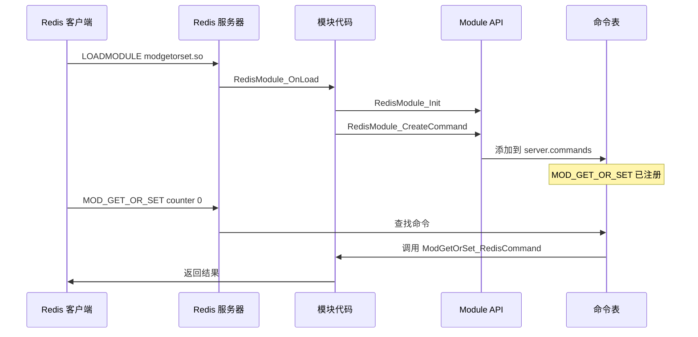

# Redis 模块自定义命令实现指南

## 概述

本文档详细说明如何通过 Redis Module 方式实现自定义命令 `MOD_GET_OR_SET`。这种方式无需修改 Redis 源码，可以动态加载和卸载。

### 命令功能

**命令:** `MOD_GET_OR_SET key default_value`

**行为:**
1. 当 key 存在时，返回 key 当前的值
2. 当 key 不存在时，将 `default_value` 设置为 key 的值，并返回新设置的值

**示例:**
```redis
> MOD_GET_OR_SET counter 0
"0"              # 键不存在，设置并返回 0

> MOD_GET_OR_SET counter Brooklyn
"0"              # 键存在，返回旧值

> INCR counter
(integer) 1

> MOD_GET_OR_SET counter 0
"1"              # 键存在，返回当前值
```

### 优点与缺点

**优点：**
- 无需修改 Redis 源码
- 可以动态加载/卸载
- 便于维护和分发
- 易于版本管理

**缺点：**
- 只能使用 Module API
- 可能有轻微性能开销

**适用场景：**
- 生产环境扩展 Redis 功能
- 需要灵活部署的场景
- 第三方扩展开发

---

## 实现步骤

### 步骤1: 创建模块目录结构

模块将以独立第三方模块的形式实现，推荐放在 `modules/modgetorset/` 目录下，结构类似于 Redis 官方推荐的组织方式。

**目录结构示例：**

```
modules/modgetorset/
├── modgetorset.c      # 模块源码
├── Makefile           # 构建脚本
└── README.md          # 文档说明
```

### 步骤2: 编写模块代码

**文件:** `modules/modgetorset/modgetorset.c`

```c
#include "redismodule.h"

/* MOD_GET_OR_SET key default_value
 *
 * 如果 key 存在，则返回当前值；
 * 如果 key 不存在，则将 default_value 赋值并返回该值。
 */
int ModGetOrSet_RedisCommand(RedisModuleCtx *ctx, RedisModuleString **argv, int argc) {
    // 参数校验
    if (argc != 3) {
        return RedisModule_WrongArity(ctx);
    }

    RedisModuleString *key = argv[1];
    RedisModuleString *default_value = argv[2];

    // 打开 key（读写模式）
    RedisModuleKey *keyobj = RedisModule_OpenKey(ctx, key, REDISMODULE_READ | REDISMODULE_WRITE);
    if (keyobj == NULL) {
        RedisModule_ReplyWithError(ctx, "ERR could not open key");
        return REDISMODULE_OK;
    }

    int type = RedisModule_KeyType(keyobj);

    if (type == REDISMODULE_KEYTYPE_EMPTY) {
        // 不存在，设置并返回 default_value
        if (RedisModule_StringSet(keyobj, default_value) != REDISMODULE_OK) {
            RedisModule_CloseKey(keyobj);
            RedisModule_ReplyWithError(ctx, "ERR failed to set value");
            return REDISMODULE_OK;
        }
        RedisModule_ReplyWithString(ctx, default_value);
    } else if (type == REDISMODULE_KEYTYPE_STRING) {
        // 存在，取现值
        size_t len;
        const char *val = RedisModule_StringDMA(keyobj, &len, REDISMODULE_READ);
        if (val) {
            RedisModule_ReplyWithStringBuffer(ctx, val, len);
        } else {
            // fallback
            RedisModuleString *current = RedisModule_CreateStringFromKey(keyobj);
            RedisModule_ReplyWithString(ctx, current);
            RedisModule_FreeString(ctx, current);
        }
    } else {
        RedisModule_CloseKey(keyobj);
        return RedisModule_ReplyWithError(ctx, "WRONGTYPE Operation against a key holding the wrong kind of value");
    }

    RedisModule_CloseKey(keyobj);
    return REDISMODULE_OK;
}

int RedisModule_OnLoad(RedisModuleCtx *ctx, RedisModuleString **argv, int argc) {
    if (RedisModule_Init(ctx, "modgetorset", 1, REDISMODULE_APIVER_1) == REDISMODULE_ERR) {
        return REDISMODULE_ERR;
    }
    if (RedisModule_CreateCommand(
            ctx,
            "MOD_GET_OR_SET",
            ModGetOrSet_RedisCommand,
            "write deny-oom",
            1, 1, 1) == REDISMODULE_ERR) {
        return REDISMODULE_ERR;
    }
    return REDISMODULE_OK;
}
```

### 步骤3: 准备和使用模块文件

模块源码(`modules/modgetorset/modgetorset.c`)、`Makefile`（推荐内容见下）、以及 `README.md` 已经准备好。下面是一个简单且修正过的 Makefile 示例：

**文件:** `modules/modgetorset/Makefile`
```makefile
# modgetorset - Redis Module for MOD_GET_OR_SET command

CC = cc
CFLAGS = -O2 -Wall -Wextra -g -std=c11
RM_INCLUDE = ../../src

modgetorset.so: modgetorset.c
	$(CC) $(CFLAGS) -I$(RM_INCLUDE) -fPIC -shared -o $@ $<

clean:
	rm -f modgetorset.so
```

确保 `Makefile` 和 `.c` 文件编码、缩进、注释一致，且可正常构建。构建方法：

```bash
cd modules/modgetorset
make
```

如需特殊编译选项（如地址/线程 sanitizer），可在 Makefile 下方扩展变量设置。详细教程可见 Redis 官方模块开发文档。


### 步骤3: 加载模块

**方式1: 启动时加载**

```bash
# 启动 Redis 并加载模块
redis-server --loadmodule ./modgetorset.so

# 或在 redis.conf 中配置, 路径需要绝对地址
# loadmodule /path/to/modgetorset.so


204:M 28 Oct 2025 17:36:36.990 # WARNING: The TCP backlog setting of 511 cannot be enforced because kern.ipc.somaxconn is set to the lower value of 128.
204:M 28 Oct 2025 17:36:36.991 - <vectorset> Successfully loaded default module configuration
204:M 28 Oct 2025 17:36:36.991 - <vectorset> Successfully loaded user module configuration
204:M 28 Oct 2025 17:36:37.654 * Module 'modgetorset' loaded from /Users/admin/Downloads/test/github/redis-unstable/modules/modgetorset/modgetorset.so
204:M 28 Oct 2025 17:36:37.655 * Server initialized
```

**方式2: 运行时加载**

```bash
# 连接 Redis
redis-cli

# 加载模块
> MODULE LOAD /path/to/modgetorset.so

# 查看已加载的模块
❯ redis-cli
127.0.0.1:6379> help MOD_GET_OR_SET

  MOD_GET_OR_SET (null)
  summary: (null)
  group: module

127.0.0.1:6379> get ma 
(nil)
127.0.0.1:6379> MOD_GET_OR_SET ma 1000
"1000"
127.0.0.1:6379> MODULE LIST
1) 1) "name"
   2) "modgetorset"
   3) "ver"
   4) (integer) 1
   5) "path"
   6) "/Users/admin/Downloads/test/github/redis-unstable/modules/modgetorset/modgetorset.so"
   7) "args"
   8) (empty array)
2) 1) "name"
   2) "vectorset"
   3) "ver"
   4) (integer) 1
   5) "path"
   6) ""
   7) "args"
   8) (empty array)
127.0.0.1:6379> 
```

### 步骤5: 测试命令

```bash
redis-cli
> MOD_GET_OR_SET counter 0
"0"

> MOD_GET_OR_SET counter 100
"0"

> INCR counter
(integer) 1

> MOD_GET_OR_SET counter 0
"1"
```

### 步骤6: 卸载模块（可选）

```bash
# 卸载模块
> MODULE UNLOAD modgetorset
OK
```

---

## 模块 API 说明

### 键操作

```c
// 打开键（读写模式）
RedisModuleKey *RedisModule_OpenKey(
    RedisModuleCtx *ctx,
    RedisModuleString *keyname,
    int mode  // REDISMODULE_READ | REDISMODULE_WRITE
);

// 获取键类型
int RedisModule_KeyType(RedisModuleKey *key);

// 键类型常量
#define REDISMODULE_KEYTYPE_EMPTY 0
#define REDISMODULE_KEYTYPE_STRING 1
#define REDISMODULE_KEYTYPE_LIST 2
#define REDISMODULE_KEYTYPE_SET 3
#define REDISMODULE_KEYTYPE_ZSET 4
#define REDISMODULE_KEYTYPE_HASH 5

// 设置字符串值
int RedisModule_StringSet(
    RedisModuleKey *key,
    RedisModuleString *str
);

// 从数据库获取字符串
RedisModuleString *RedisModule_DbStringGet(
    RedisModuleCtx *ctx,
    RedisModuleString *keyname
);

// 关闭键
void RedisModule_CloseKey(RedisModuleKey *key);
```

### 响应函数

```c
// 返回字符串
int RedisModule_ReplyWithString(RedisModuleCtx *ctx, RedisModuleString *str);

// 返回整数
int RedisModule_ReplyWithLongLong(RedisModuleCtx *ctx, long long ll);

// 返回数组
int RedisModule_ReplyWithArray(RedisModuleCtx *ctx, long len);

// 返回错误
int RedisModule_ReplyWithError(RedisModuleCtx *ctx, const char *errstr);

// 返回空回复
int RedisModule_ReplyWithNull(RedisModuleCtx *ctx);

// 检查参数个数
int RedisModule_WrongArity(RedisModuleCtx *ctx);
```

### 字符串管理

```c
// 创建字符串
RedisModuleString *RedisModule_CreateString(
    RedisModuleCtx *ctx,
    const char *ptr,
    size_t len
);

// 创建格式化字符串
RedisModuleString *RedisModule_CreateStringPrintf(
    RedisModuleCtx *ctx,
    const char *fmt,
    ...
);

// 获取字符串指针和长度
const char *RedisModule_StringPtrLen(
    RedisModuleString *str,
    size_t *len
);

// 获取字符串长度
size_t RedisModule_StringLen(RedisModuleString *str);

// 释放字符串
void RedisModule_FreeString(RedisModuleCtx *ctx, RedisModuleString *str);

// 保留字符串（防止自动释放）
void RedisModule_RetainString(RedisModuleCtx *ctx, RedisModuleString *str);
```

### 模块生命周期

```c
// 模块加载函数（必需）
int RedisModule_OnLoad(RedisModuleCtx *ctx, RedisModuleString **argv, int argc);

// 模块卸载函数（可选）
void RedisModule_OnUnload(RedisModuleCtx *ctx);

// 初始化模块
int RedisModule_Init(
    RedisModuleCtx *ctx,
    const char *name,  // 模块名称
    int ver,          // 模块版本
    int apiver        // API 版本
);
```

### 命令注册

```c
// 创建命令
int RedisModule_CreateCommand(
    RedisModuleCtx *ctx,
    const char *name,                    // 命令名
    RedisModuleCmdFunc cmdfunc,         // 命令处理函数
    const char *strflags,               // 命令标志字符串
    int firstkey,                       // 第一个键的位置
    int lastkey,                        // 最后一个键的位置
    int keystep                         // 键的步长
);

// 命令标志字符串说明
// "write": 写命令
// "readonly": 只读命令
// "deny-oom": 拒绝内存溢出时执行
// "fast": 快速命令
// "getkeys-api": 使用 getkeys API
// "no-cluster": 不支持集群
```

---

## 命令注册机制

### Redis 命令注册流程



### 命令结构体字段

```c
struct redisCommand {
    const char *declared_name;      // 命令名 "MOD_GET_OR_SET"
    redisCommandProc *proc;         // 函数指针 ModGetOrSet_RedisCommand
    int arity;                      // 参数个数 3
    uint64_t flags;                 // 标志 CMD_WRITE|CMD_DENYOOM
    uint64_t acl_categories;        // ACL类别 ACL_CATEGORY_STRING
    keySpec *key_specs;             // 键规格
    redisGetKeysProc *getkeys_proc; // 获取键的函数
    ...
};
```

---

## 测试

### 单元测试

**文件:** `tests/unit/modgetorset_module.tcl`

```tcl
start_server {tags {"modgetorset_module"}} {
    # 加载模块
    r MODULE LOAD /path/to/modgetorset.so
    
    test {MOD_GET_OR_SET sets value when key does not exist} {
        set result [r MOD_GET_OR_SET counter 0]
        assert_equal $result "0"
    }

    test {MOD_GET_OR_SET returns existing value} {
        r SET counter 10
        set result [r MOD_GET_OR_SET counter 0]
        assert_equal $result "10"
    }

    test {MOD_GET_OR_SET does not overwrite existing value} {
        r SET counter 42
        r MOD_GET_OR_SET counter 0
        assert_equal [r GET counter] "42"
    }
    
    # 卸载模块
    r MODULE UNLOAD modgetorset
}
```

### 运行测试

```bash
./runtest tests/unit/modgetorset_module.tcl
```

---

## 性能考虑

### 性能特性

| 操作 | 时间复杂度 | 说明 |
|------|-----------|------|
| 键不存在 | O(1) | 直接设置并返回 |
| 键存在 | O(1) | 从数据库查找并返回 |
| 模块调用开销 | ~1-2% | Module API 开销 |
| 内存管理 | O(N) | N为字符串长度 |

### 优化技巧

1. **使用原生 API**: 优先使用底层 API，减少 Module 转换
2. **减少字符串复制**: 使用引用计数
3. **批量操作**: 考虑使用管道
4. **错误处理**: 及时释放资源，避免内存泄漏

---

## 高级功能扩展

### 支持过期时间

```c
int ModGetOrSetEx_RedisCommand(RedisModuleCtx *ctx, RedisModuleString **argv, int argc) {
    if (argc != 4) {
        return RedisModule_WrongArity(ctx);
    }
    
    RedisModuleString *key = argv[1];
    RedisModuleString *value = argv[2];
    long long expire_ms;
    
    // 解析过期时间（毫秒）
    if (RedisModule_StringToLongLong(argv[3], &expire_ms) != REDISMODULE_OK) {
        return RedisModule_ReplyWithError(ctx, "ERR invalid expire time");
    }
    
    RedisModuleKey *key_obj = RedisModule_OpenKey(ctx, key, REDISMODULE_READ | REDISMODULE_WRITE);
    int key_type = RedisModule_KeyType(key_obj);
    
    if (key_type == REDISMODULE_KEYTYPE_EMPTY) {
        RedisModule_StringSet(key_obj, value);
        RedisModule_SetExpire(key_obj, expire_ms);
        RedisModule_ReplyWithString(ctx, value);
    } else if (key_type == REDISMODULE_KEYTYPE_STRING) {
        RedisModuleString *current = RedisModule_DbStringGet(ctx, key);
        RedisModule_ReplyWithString(ctx, current);
        RedisModule_FreeString(ctx, current);
    } else {
        RedisModule_CloseKey(key_obj);
        return RedisModule_ReplyWithError(ctx, "WRONGTYPE");
    }
    
    RedisModule_CloseKey(key_obj);
    return REDISMODULE_OK;
}
```

### 支持自定义数据类型

```c
typedef struct CustomType {
    int count;
    RedisModuleString **items;
} CustomType;

// 注册数据类型
int CustomType_Register(RedisModuleCtx *ctx) {
    RedisModuleTypeMethods tm = {
        .version = REDISMODULE_TYPE_METHOD_VERSION,
        .rdb_load = CustomType_RdbLoad,
        .rdb_save = CustomType_RdbSave,
        .aof_rewrite = CustomType_AofRewrite,
        .free = CustomType_Free,
        ...
    };
    
    CustomTypeType = RedisModule_CreateDataType(ctx, "CustomType", 0, &tm);
    return (CustomTypeType != NULL) ? REDISMODULE_OK : REDISMODULE_ERR;
}
```

---

## 调试

### 添加日志

```c
// Module 中使用日志
RedisModule_Log(ctx, REDISMODULE_LOGLEVEL_DEBUG, "MOD_GET_OR_SET: key=%s", key_str);

// 日志级别
#define REDISMODULE_LOGLEVEL_DEBUG 0
#define REDISMODULE_LOGLEVEL_VERBOSE 1
#define REDISMODULE_LOGLEVEL_NOTICE 2
#define REDISMODULE_LOGLEVEL_WARNING 3
```

### 使用 GDB

```bash
# 启动 Redis
gdb redis-server

# 设置断点
(gdb) break RedisModule_OnLoad

# 运行
(gdb) run --loadmodule ./modgetorset.so

# 查看模块状态
(gdb) print server.module_list
```

---

## 模块管理命令

```redis
# 列出已加载的模块
> MODULE LIST
1) 1) "name"
   2) "modgetorset"
   3) "ver"
   4) 1

# 加载模块
> MODULE LOAD /path/to/modgetorset.so
OK

# 卸载模块
> MODULE UNLOAD modgetorset
OK

# 重新加载模块
> MODULE LOADEX /path/to/modgetorset.so ARGV arg1 arg2
OK
```

---

## 常见问题

### 1. 模块编译错误

**问题**: `error: 'REDISMODULE_APIVER' undeclared`

**解决方案**: 确保包含了正确的头文件路径

```bash
gcc -I./src -I./deps/hiredis -I./deps/lua/src ...
```

### 2. 模块加载失败

**问题**: `Module ./modgetorset.so failed to load`

**解决方案**: 检查模块文件权限和依赖

```bash
# 检查文件
ls -l modgetorset.so

# 检查依赖
ldd modgetorset.so

# 查看 Redis 日志
tail -f /var/log/redis/redis-server.log
```

### 3. 命令未找到

**问题**: `(error) ERR unknown command 'MOD_GET_OR_SET'`

**解决方案**: 确认模块已正确加载

```bash
# 检查模块列表
> MODULE LIST

# 重新加载模块
> MODULE LOAD /path/to/modgetorset.so
```

---

## 总结

### Redis Module 方式

**优点：**
- 无需修改 Redis 源码
- 动态加载/卸载
- 便于维护和分发
- 易于版本管理

**缺点：**
- 只能使用 Module API
- 可能有轻微性能开销

**适用场景：**
- 生产环境扩展 Redis 功能
- 需要灵活部署的场景
- 第三方扩展开发

---

相关文档：
- [Redis 命令执行流程](redis_cli_cmd.md)
- [Redis 数据类型](redis-data-type.md)
- [Redis 自定义核心命令实现](redis-custom-command-core.md)
- [Redis Server 核心组件](redis_server.md)
- [Redis 调试指南](redis-debug.md)
