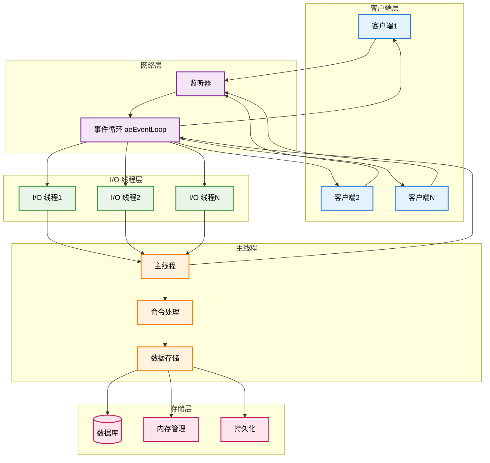
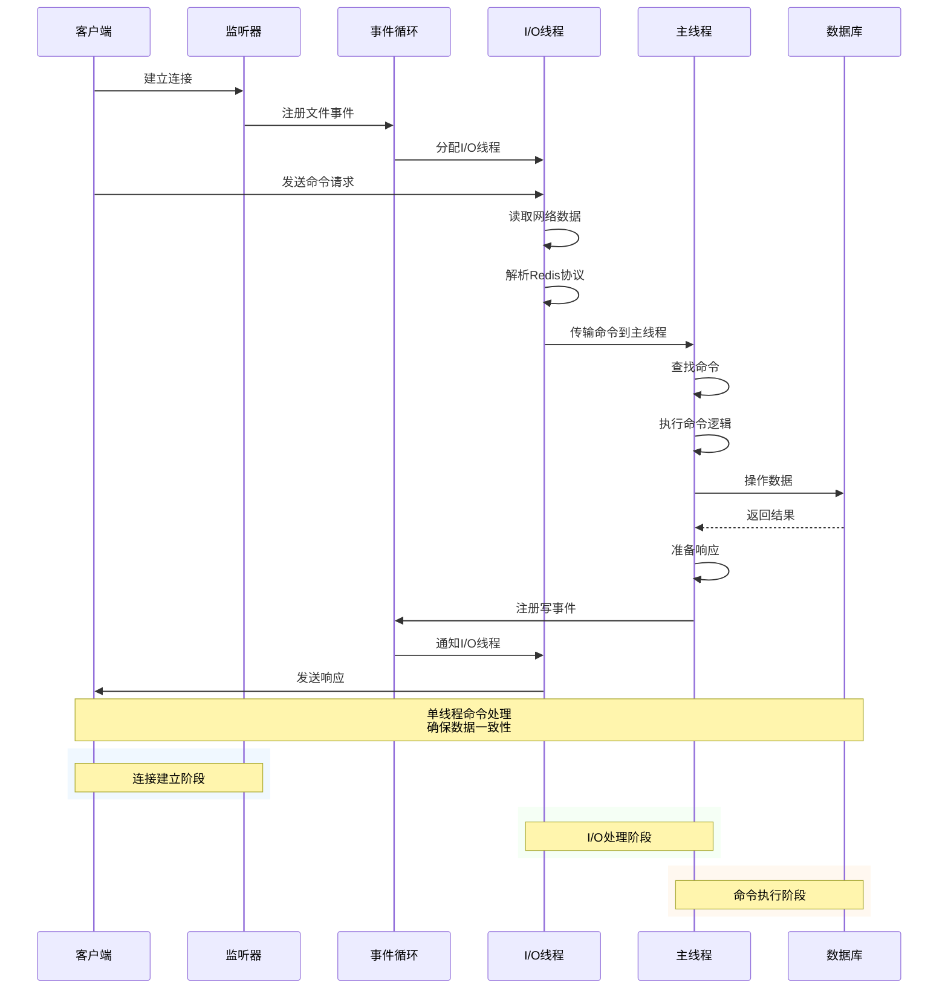
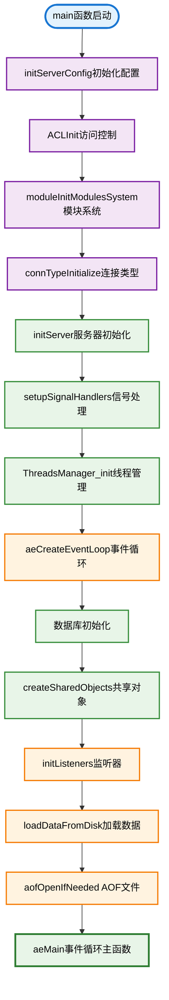
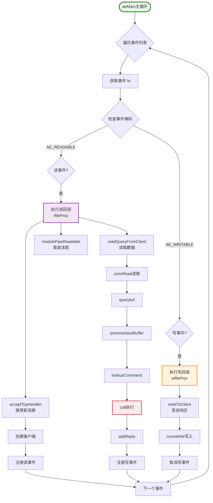
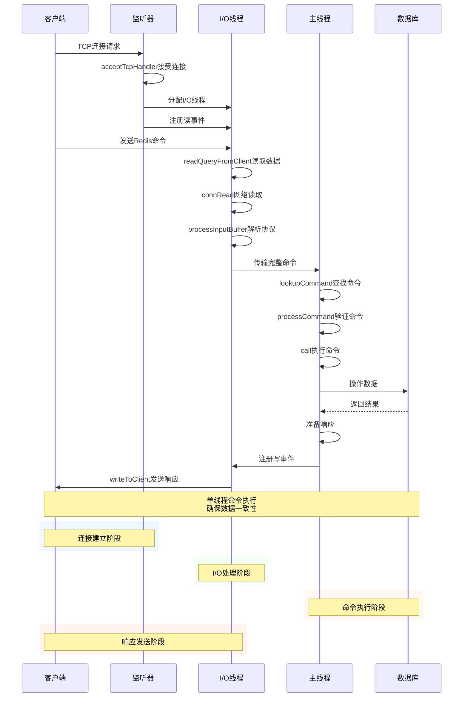
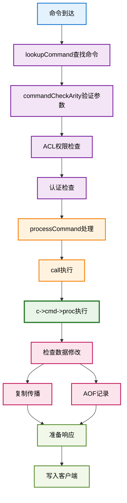
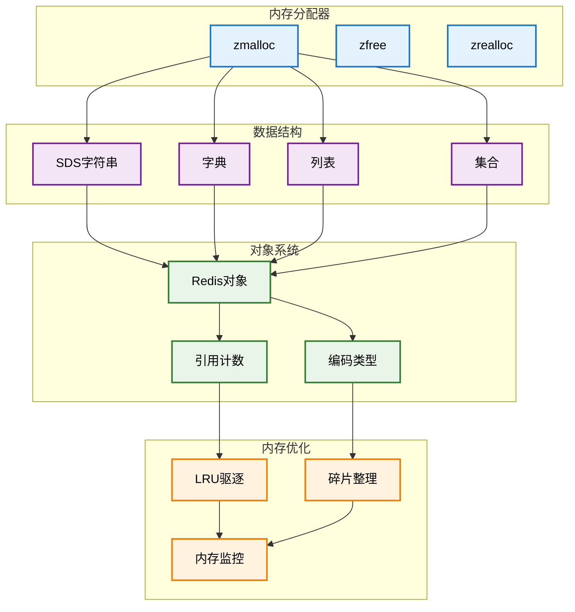
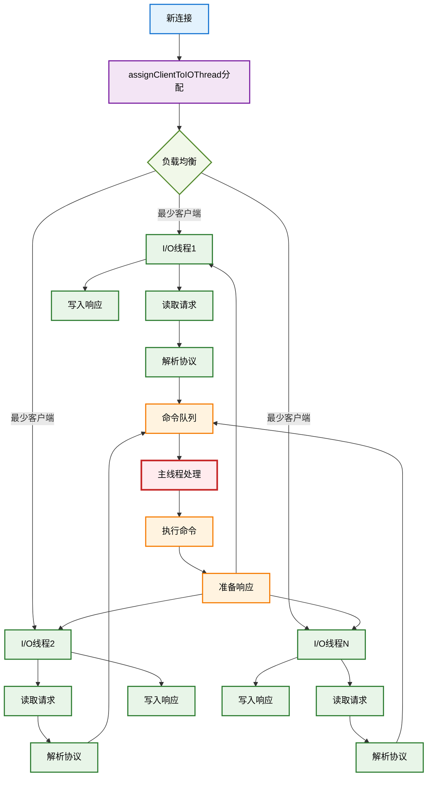
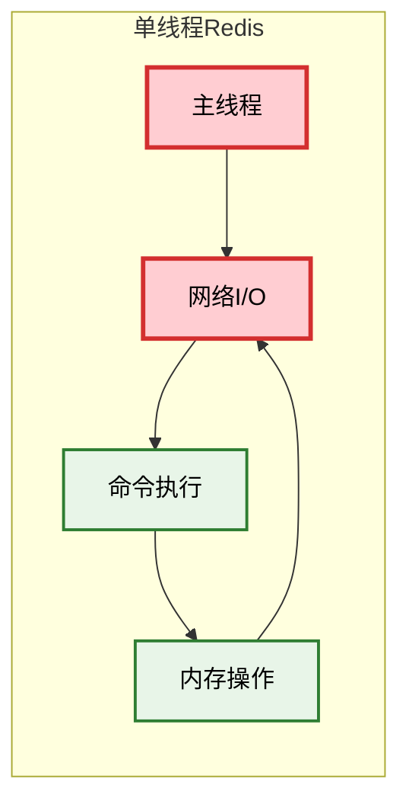
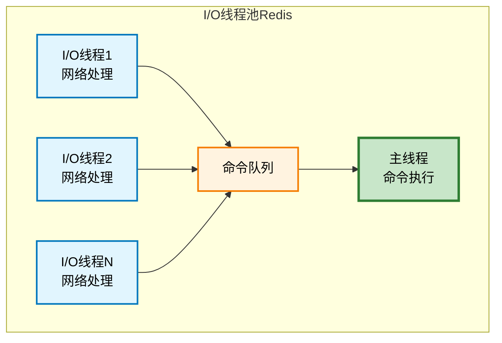

# Redis 服务器架构概览

> **相关文档**: 详细的网络架构和事件循环机制请参考 [Redis 网络架构与事件循环](redis_net_loop.md)

## 文档核心要点

### 设计哲学

Redis 的核心哲学是**在内存中提供极致性能的数据服务**。设计遵循以下原则：

- **单线程内核**：命令执行在单线程中串行化，避免锁竞争，保证原子性和线性一致性
- **事件驱动 I/O**：基于 epoll/kqueue 的异步非阻塞 I/O，支持高并发连接
- **内存优先**：所有数据驻留内存，基于 KISS 原则优化数据结构
- **渐进式演进**：从单线程到 I/O 多线程，保持向后兼容

### 核心机制

#### 1. 事件驱动架构 (`aeEventLoop`)
- **文件事件**：网络 I/O、客户端读写，支持 AE_READABLE/AE_WRITABLE
- **时间事件**：基于单链表的定时任务，由 `serverCron` 周期性执行
- **AE_BARRIER**：反转读写处理顺序，用于持久化场景
- **回调机制**：通过函数指针实现解耦和可扩展性

#### 2. 命令执行流水线
```
网络接收 → 协议解析( RESP ) → 命令查找( O(1)哈希 ) → ACL验证 → 
命令执行( 单线程原子 ) → 复制传播( RDB/AOF ) → 响应返回
```

#### 3. 内存管理策略
- **引用计数**：robj 的自动内存管理
- **内存编码优化**：intset、ziplist、embstr 等压缩编码
- **渐进式 rehash**：避免长时间阻塞
- **LRU/LFU 驱逐**：支持多种淘汰算法

#### 4. I/O 线程池 (Redis 6.0+)
- **设计目标**：突破单线程网络 I/O 瓶颈
- **实现方式**：I/O 线程并行处理网络读写，主线程串行执行命令
- **负载均衡**：按客户端数量动态分配到最少负载的 I/O 线程
- **批量传输**：`IO_THREAD_MAX_PENDING_CLIENTS=16` 减少线程间通信开销

### 关键数据结构

| 数据结构 | 用途 | 特点 |
|---------|------|------|
| `aeEventLoop` | 事件循环 | 支持多种 I/O 多路复用(epoll/kqueue/select) |
| `redisDb` | 数据库实例 | kvstore 键值存储 + expires 过期管理 |
| `client` | 客户端状态 | querybuf 缓冲区、argv 参数、reply 响应队列 |
| `redisCommand` | 命令元信息 | proc 函数指针、arity 参数校验、flags 标志位 |
| `IOThread` | I/O 线程 | 独立的 epoll 实例，处理客户端 I/O 事件 |

### 性能优化技巧

1. **网络 I/O**：
   - `IO_THREAD_MAX_PENDING_CLIENTS` 批量处理
   - 零拷贝优化（sendfile/splice）
   - 事件合并减少系统调用

2. **内存管理**：
   - SDS 预分配减少 realloc
   - 共享对象池（shared.crlf, shared.ok 等）
   - jemalloc 的内存对齐和 tcache

3. **数据结构**：
   - dict 的惰性 rehash
   - quicklist 的压缩节点
   - stream 的 radix tree 索引

### 实现细节

本文档深入剖析 Redis 源码实现，涵盖：
- **事件循环** (`ae.c`): `aeProcessEvents` 的核心逻辑和 AE_BARRIER 机制
- **网络层** (`networking.c`): 客户端的生命周期管理和 I/O 处理
- **命令系统** (`server.c`): `lookupCommand` 和 `call` 的实现细节
- **数据结构** (`dict.c`, `sds.c` 等): 底层数据结构的优化策略
- **线程模型** (`io_threads.c`): I/O 线程池的协作机制

## 架构流程图



## 核心处理流程



## 核心架构组件

### 1. 全局服务器状态 (`struct redisServer`)

`redisServer` 结构体是协调所有 Redis 子系统的中心：

```c
struct redisServer {
    /* 通用 */
    pid_t pid;                  /* 主进程 PID */
    pthread_t main_thread_id;   /* 主线程 ID */
    char *configfile;           /* 配置文件绝对路径 */
    
    /* 核心组件 */
    redisDb *db;                /* 数据库实例 */
    dict *commands;             /* 命令表 */
    aeEventLoop *el;            /* 事件循环 */
    
    /* 线程 */
    int io_threads_num;         /* I/O 线程数量 */
    int io_threads_active;      /* I/O 线程激活标志 */
    
    /* 客户端管理 */
    list *clients;              /* 已连接客户端 */
    list *clients_pending_write; /* 待写入客户端 */
    list *clients_pending_read;  /* 待读取客户端 */
    
    /* 内存和性能 */
    unsigned int lruclock;      /* LRU 驱逐时钟 */
    int activerehashing;        /* 增量重哈希标志 */
    size_t initial_memory_usage; /* 初始内存使用量 */
    
    /* 持久化 */
    int aof_state;             /* AOF 状态 */
    int rdb_child_pid;         /* RDB 子进程 PID */
    
    /* 复制 */
    list *slaves;              /* 从客户端 */
    int replication_allowed;    /* 复制允许标志 */
    
    /* 模块 */
    dict *moduleapi;           /* 模块 API */
    list *loadmodule_queue;    /* 待加载模块 */
    
    /* 错误处理 */
    rax *errors;               /* 错误统计 */
    int errors_enabled;         /* 错误跟踪启用 */
    
    /* 关闭管理 */
    redisAtomic int shutdown_asap; /* 立即关闭 */
    redisAtomic int crashing;      /* 服务器崩溃 */
    mstime_t shutdown_mstime;   /* 关闭时间戳 */
};
```

### 2. 事件驱动架构

Redis 使用围绕 `aeEventLoop` 构建的事件驱动架构：

```c
typedef struct aeEventLoop {
    int maxfd;                  /* 最高文件描述符 */
    int setsize;               /* 跟踪的最大文件描述符数 */
    aeFileEvent *events;       /* 已注册的文件事件 */
    aeFiredEvent *fired;       /* 已触发的事件 */
    aeTimeEvent *timeEventHead; /* 时间事件列表 */
    int stop;                  /* 停止标志 */
    void *apidata;             /* 轮询 API 特定数据 */
    aeBeforeSleepProc *beforesleep; /* 睡眠前回调 */
    aeBeforeSleepProc *aftersleep;  /* 睡眠后回调 */
} aeEventLoop;
```

**事件类型：**
- **文件事件**：网络 I/O、文件操作
- **时间事件**：周期性任务、超时
- **屏障事件**：写前读操作

### 3. 线程模型

#### 3.1 主线程（单线程命令处理）
- **主要角色**：命令执行和数据操作
- **职责**：
  - 解析和执行 Redis 命令
  - 管理数据结构和内存
  - 处理复制和持久化
  - 与 I/O 线程协调

#### 3.2 I/O 线程（可选多线程）
- **主要角色**：网络 I/O 操作
- **职责**：
  - 从网络读取客户端请求
  - 向客户端写入响应
  - 解析 Redis 协议
  - 为主线程预取命令

**I/O 线程配置：**
```c
#define IO_THREADS_MAX_NUM 128
#define IO_THREAD_MAX_PENDING_CLIENTS 16
#define IOTHREAD_MAIN_THREAD_ID 0
```

**客户端分配策略：**
- 新客户端分配给客户端数量最少的 I/O 线程
- 特殊客户端（副本、发布订阅、阻塞）由主线程处理
- 基于每线程客户端数量的负载均衡

### 4. 客户端管理

#### 4.1 客户端状态
```c
typedef struct client {
    int fd;                     /* 客户端套接字 */
    int tid;                   /* 线程 ID */
    int running_tid;           /* 当前运行线程 */
    int io_flags;              /* I/O 标志 */
    sds querybuf;              /* 查询缓冲区 */
    robj **argv;               /* 命令参数 */
    int argc;                  /* 参数数量 */
    struct redisCommand *cmd;  /* 要执行的命令 */
    list *reply;               /* 回复列表 */
    // ... 更多字段
} client;
```

#### 4.2 客户端处理流程
1. **接受**：接受新的客户端连接
2. **分配**：将客户端分配给 I/O 线程或主线程
3. **读取**：I/O 线程读取请求数据
4. **解析**：协议解析和命令查找
5. **传输**：命令传输到主线程
6. **执行**：主线程执行命令
7. **回复**：响应发送回客户端

### 5. 命令处理管道

#### 5.1 命令查找
```c
struct redisCommand *lookupCommand(robj **argv, int argc) {
    return lookupCommandLogic(server.commands, argv, argc, 0);
}
```

#### 5.2 命令执行
```c
void call(client *c, int flags) {
    struct redisCommand *real_cmd = c->realcmd;
    // 执行命令逻辑
    real_cmd->proc(c);
    // 处理复制、AOF 等
}
```

### 6. 内存管理

#### 6.1 内存分配
- **zmalloc**：内存感知分配
- **SDS**：动态字符串管理
- **对象系统**：Redis 对象的引用计数

#### 6.2 内存优化
- **LRU 驱逐**：最近最少使用驱逐
- **主动碎片整理**：内存压缩
- **内存使用跟踪**：实时监控

### 7. 持久化子系统

#### 7.1 RDB（Redis 数据库备份）
- **基于快照**：时间点备份
- **后台进程**：非阻塞保存
- **压缩**：空间高效存储

#### 7.2 AOF（仅追加文件）
- **基于日志**：命令日志记录
- **同步**：可配置的同步策略
- **重写**：日志压缩

### 8. 复制系统

#### 8.1 主从架构
- **异步复制**：非阻塞
- **部分重同步**：高效重连
- **复制延迟**：监控和优化

#### 8.2 复制流程
1. **握手**：初始连接设置
2. **同步**：完全或部分同步
3. **命令传播**：实时命令转发
4. **确认**：从服务器确认

### 9. 模块系统

#### 9.1 模块架构
- **动态加载**：运行时模块加载
- **API 接口**：标准化模块 API
- **事件钩子**：模块事件系统

#### 9.2 模块生命周期
1. **加载**：模块初始化
2. **配置**：参数设置
3. **执行**：命令处理
4. **卸载**：清理和拆卸

## 核心源码架构流程

### 1. 服务器启动流程



### 2. 事件循环核心流程

**源码位置**: `src/ae.c:360-468`



#### aeProcessEvents 源码核心流程

**关键代码** (`ae.c:409-461`):

```c
// 遍历所有触发的事件
for (j = 0; j < numevents; j++) {
    int fd = eventLoop->fired[j].fd;
    aeFileEvent *fe = &eventLoop->events[fd];
    int mask = eventLoop->fired[j].mask;
    int invert = fe->mask & AE_BARRIER;  // 检查是否反转顺序
    
    // 正常顺序: 先读后写
    if (!invert && fe->mask & mask & AE_READABLE) {
        fe->rfileProc(eventLoop, fd, fe->clientData, mask);  // ae.c:435
    }
    
    if (fe->mask & mask & AE_WRITABLE) {
        fe->wfileProc(eventLoop, fd, fe->clientData, mask);  // ae.c:443
    }
    
    // 反转顺序: 先写后读 (AE_BARRIER 模式)
    if (invert && fe->mask & mask & AE_READABLE) {
        fe->rfileProc(eventLoop, fd, fe->clientData, mask);  // LT:455
    }
    
    processed++;
}
```

#### AE_BARRIER 机制

**作用**: 控制读写事件处理顺序

**正常模式** (无 BARRIER):
```
读取命令 → 处理 → 发送响应
```

**BARRIER 模式**:
```
先发送缓冲区数据 → 再读取新数据
例如: 先同步文件 → 再读取命令
```

#### 事件回调函数

**读回调** (`rfileProc`):
- `acceptTcpHandler`: 接受新连接
- `readQueryFromClient`: 读取客户端命令
- `modulePipeReadable`: 模块管道数据

**写回调** (`wfileProc`):
- `sendReplyToClient`: 发送响应
- `modulePipeWritable`: 模块管道写入

### 3. 网络I/O处理流程



### 4. 命令处理核心流程



### 5. 内存管理架构



### 6. I/O线程协作流程



## 核心源码分析

### 1. 关键函数调用链

#### 1.1 服务器启动链
```c
main() 
  → initServerConfig()     // 初始化配置
  → ACLInit()              // 访问控制列表
  → moduleInitModulesSystem() // 模块系统
  → connTypeInitialize()   // 连接类型
  → initServer()           // 服务器初始化
    → setupSignalHandlers() // 信号处理
    → ThreadsManager_init() // 线程管理
    → aeCreateEventLoop()   // 创建事件循环
    → createSharedObjects() // 创建共享对象
  → initListeners()        // 初始化监听器
  → loadDataFromDisk()     // 加载数据
  → aeMain()              // 事件循环主函数
```

#### 1.2 网络架构初始化

**监听器初始化**（文件：`src/server.c:initListeners()`）

```c
void initListeners(void) {
    // 1. 配置 TCP/TLS/Unix Socket 监听器
    if (server.port != 0) {
        listener->bindaddr = server.bindaddr;
        listener->port = server.port;
        listener->ct = connectionByType(CONN_TYPE_SOCKET);
    }
    
    if (server.tls_port != 0) {
        listener->port = server.tls_port;
        listener->ct = connectionByType(CONN_TYPE_TLS);
    }
    
    if (server.unixsocket != NULL) {
        listener->ct = connectionByType(CONN_TYPE_UNIX);
    }
    
    // 2. 创建监听套接字并注册accept事件处理器
    for (int j = 0; j < CONN_TYPE_MAX; j++) {
        listener = &server.listeners[j];
        if (listener->ct == NULL) continue;
        
        // 监听端口
        connListen(listener);
        
        // 注册accept事件处理器
        createSocketAcceptHandler(listener, connAcceptHandler(listener->ct));
    }
}
```

**端口绑定**（文件：`src/server.c:listenToPort()`）

```c
int listenToPort(connListener *sfd) {
    for (j = 0; j < sfd->bindaddr_count; j++) {
        char* addr = bindaddr[j];
        
        if (strchr(addr,':')) {
            // IPv6 地址
            sfd->fd[sfd->count] = anetTcp6Server(port, addr, server.tcp_backlog);
        } else {
            // IPv4 地址
            sfd->fd[sfd->count] = anetTcpServer(port, addr, server.tcp_backlog);
        }
        
        // 设置为非阻塞
        anetNonBlock(NULL, sfd->fd[sfd->count]);
        anetCloexec(sfd->fd[sfd->count]); // close-on-exec
        
        sfd->count++;
    }
    return C_OK;
}
```

**接受连接**（文件：`src/socket.c:connSocketAcceptHandler()`）

```c
static void connSocketAcceptHandler(aeEventLoop *el, int fd, void *privdata, int mask) {
    int max = server.max_new_conns_per_cycle;
    
    while(max--) {
        // 接受连接
        cfd = anetTcpAccept(fd, cip, sizeof(cip), &cport);
        if (cfd == ANET_ERR) {
            if (errno == EWOULDBLOCK) return;
            continue;
        }
        
        // 创建客户端
        conn = connCreateAcceptedSocket(el, cfd, NULL);
        
        // 处理新连接
        acceptCommonHandler(conn, 0, cip);
    }
}
```

#### 1.3 事件处理链
```c
aeMain()
  → aeProcessEvents()
    → aeApiPoll()          // 轮询事件
    → processFileEvents()  // 处理文件事件
      → readQueryFromClient() // 读取客户端请求
        → processInputBuffer() // 解析输入缓冲区
          → processCommand()   // 处理命令
            → call()           // 执行命令
              → c->cmd->proc() // 命令处理函数
    → processTimeEvents()  // 处理时间事件
      → serverCron()       // 定时任务
```

#### 1.3 网络I/O处理链
```c
acceptTcpHandler()         // 接受连接
  → createClient()         // 创建客户端
    → connSetReadHandler() // 设置读处理器
      → readQueryFromClient() // 读取查询
        → connRead()       // 网络读取
        → processInputBuffer() // 解析缓冲区
          → processCommand() // 处理命令
```

### 2. 核心数据结构

#### 2.1 事件循环结构
```c
typedef struct aeEventLoop {
    int maxfd;              // 最高文件描述符
    int setsize;            // 最大文件描述符数
    aeFileEvent *events;    // 文件事件数组
    aeFiredEvent *fired;    // 已触发事件
    aeTimeEvent *timeEventHead; // 时间事件链表
    int stop;               // 停止标志
    void *apidata;          // 轮询API数据
    aeBeforeSleepProc *beforesleep; // 睡眠前回调
    aeBeforeSleepProc *aftersleep;  // 睡眠后回调
} aeEventLoop;
```

#### 2.2 客户端结构
```c
typedef struct client {
    connection *conn;       // 连接对象
    int fd;                 // 文件描述符
    int tid;                // 线程ID
    int running_tid;        // 运行线程ID
    sds querybuf;           // 查询缓冲区
    robj **argv;            // 命令参数
    int argc;               // 参数数量
    struct redisCommand *cmd; // 命令对象
    list *reply;            // 回复列表
    uint64_t flags;         // 客户端标志
    // ... 更多字段
} client;
```

#### 2.3 命令结构
```c
typedef struct redisCommand {
    char *name;             // 命令名称
    redisCommandProc *proc; // 命令处理函数
    int arity;              // 参数数量
    char *sflags;           // 字符串标志
    uint64_t flags;         // 命令标志
    int firstkey;           // 第一个键位置
    int lastkey;            // 最后一个键位置
    int keystep;            // 键步长
    long long microseconds; // 执行时间
    long long calls;        // 调用次数
    long long failed_calls; // 失败次数
    // ... 更多字段
} redisCommand;
```

### 3. 关键算法实现

#### 3.1 事件轮询算法
```c
int aeProcessEvents(aeEventLoop *eventLoop, int flags) {
    int processed = 0, numevents;
    
    // 计算超时时间
    if (flags & AE_TIME_EVENTS) {
        usUntilTimer = usUntilEarliestTimer(eventLoop);
        if (usUntilTimer >= 0) {
            tv.tv_sec = usUntilTimer / 1000000;
            tv.tv_usec = usUntilTimer % 1000000;
            tvp = &tv;
        }
    }
    
    // 轮询事件
    numevents = aeApiPoll(eventLoop, tvp);
    
    // 处理文件事件
    for (j = 0; j < numevents; j++) {
        aeFileEvent *fe = &eventLoop->events[eventLoop->fired[j].fd];
        int mask = eventLoop->fired[j].mask;
        
        if (fe->mask & mask & AE_READABLE) {
            fe->rfileProc(eventLoop,fd,fe->clientData,mask);
        }
        if (fe->mask & mask & AE_WRITABLE) {
            fe->wfileProc(eventLoop,fd,fe->clientData,mask);
        }
        processed++;
    }
    
    // 处理时间事件
    if (flags & AE_TIME_EVENTS)
        processed += processTimeEvents(eventLoop);
    
    return processed;
}
```

#### 3.2 命令查找算法
```c
struct redisCommand *lookupCommand(robj **argv, int argc) {
    return lookupCommandLogic(server.commands, argv, argc, 0);
}

struct redisCommand *lookupCommandLogic(dict *commands, robj **argv, int argc, int strict) {
    struct redisCommand *base_cmd = dictFetchValue(commands, argv[0]->ptr);
    
    if (base_cmd && base_cmd->subcommands) {
        // 处理子命令
        struct redisCommand *sub = lookupSubcommand(base_cmd, argv[1]->ptr);
        if (sub) return sub;
    }
    
    return base_cmd;
}
```

#### 3.3 客户端分配算法
```c
void assignClientToIOThread(client *c) {
    // 找到客户端数量最少的I/O线程
    int min_id = 0;
    int min = INT_MAX;
    for (int i = 1; i < server.io_threads_num; i++) {
        if (server.io_threads_clients_num[i] < min) {
            min = server.io_threads_clients_num[i];
            min_id = i;
        }
    }
    
    // 分配客户端到I/O线程
    server.io_threads_clients_num[c->tid]--;
    c->tid = min_id;
    c->running_tid = min_id;
    server.io_threads_clients_num[min_id]++;
    
    // 解绑主线程事件循环
    connUnbindEventLoop(c->conn);
    c->io_flags &= ~(CLIENT_IO_READ_ENABLED | CLIENT_IO_WRITE_ENABLED);
    listAddNodeTail(mainThreadPendingClientsToIOThreads[c->tid], c);
}
```

#### 3.4 BeforeSleep / AfterSleep 回调

**beforeSleep**（文件：`src/server.c:beforeSleep()`）

在主循环处理文件事件之前调用，用于批量处理待处理的任务：

```c
void beforeSleep(aeEventLoop *eventLoop) {
    // 1. 处理被阻塞的客户端
    handleClientsWithPendingReadsUsingThreads();
    
    // 2. 写入pending的写缓冲区
    handleClientsWithPendingWrites();
    
    // 3. 处理客户端挂起读
    handleClientsWithPendingReadsUsingThreads();
    
    // 4. 增加全局命令时间
    updateCachedTime(1);
    
    // 5. 自动过期清理
    evictionPoolPopulate(DICT_MAIN_KEYS);
    
    // 6. 更新统计
    trackInstantaneousMetric(STATS_METRIC_COMMAND, server.stat_numcommands);
}
```

**afterSleep**（文件：`src/server.c:afterSleep()`）

```c
void afterSleep(aeEventLoop *eventLoop) {
    /* Currently nothing. */
}
```

#### 3.5 多路复用机制

**支持的后端**

Redis 根据平台自动选择最优I/O多路复用：

- **Linux**: epoll
- **BSD/Mac**: kqueue  
- **Solaris**: evport
- **其他**: select（通用但性能较低）

**epoll 实现**（文件：`src/ae_epoll.c`）

```c
static int aeApiPoll(aeEventLoop *eventLoop, struct timeval *tvp) {
    aeApiState *state = eventLoop->apidata;
    int retval, numevents = 0;
    
    retval = epoll_wait(state->epfd, state->events, eventLoop->setsize,
                       tvp ? (tvp->tv_sec*1000 + tvp->tv_usec/1000) : -1);
    
    if (retval > 0) {
        int j;
        numevents = retval;
        
        for (j = 0; j < numevents; j++) {
            int mask = 0;
            struct epoll_event *e = state->events + j;
            
            if (e->events & EPOLLIN) mask |= AE_READABLE;
            if (e->events & EPOLLOUT) mask |= AE_WRITABLE;
            if (e->events & EPOLLERR) mask |= AE_READABLE | AE_WRITABLE;
            if (e->events & EPOLLHUP) mask |= AE_READABLE | AE_WRITABLE;
            
            eventLoop->fired[j].fd = e->data.fd;
            eventLoop->fired[j].mask = mask;
        }
    }
    
    return numevents;
}
```

### 4. 性能优化策略

#### 4.1 内存优化
- **SDS预分配**：使用`sdsMakeRoomFor`预分配内存
- **对象复用**：共享对象避免重复创建
- **内存对齐**：优化缓存行访问

#### 4.2 I/O优化
- **批量处理**：`IO_THREAD_MAX_PENDING_CLIENTS`批量传输
- **零拷贝**：避免不必要的内存拷贝
- **事件合并**：合并多个小事件

#### 4.3 算法优化
- **哈希表**：O(1)命令查找
- **跳表**：有序集合高效实现
- **压缩列表**：小数据高效存储

## Redis I/O线程池设计目的

### 1. 解决单线程性能瓶颈

#### 1.1 传统单线程模型的问题


**性能瓶颈：**
- **网络I/O阻塞**：读取客户端数据时阻塞命令执行
- **CPU利用率低**：单线程无法充分利用多核CPU
- **并发能力有限**：高并发时响应延迟增加
- **吞吐量受限**：网络I/O成为性能瓶颈

#### 1.2 I/O线程池解决方案


### 2. 核心设计目标

#### 2.1 性能提升
- **并行I/O处理**：多个I/O线程同时处理网络请求
- **CPU多核利用**：充分利用多核CPU资源
- **减少阻塞**：主线程专注于命令执行，不被I/O阻塞
- **提高吞吐量**：支持更高的并发连接数

#### 2.2 架构优化
- **职责分离**：I/O处理与命令执行分离
- **负载均衡**：客户端均匀分配到I/O线程
- **批量处理**：减少线程间通信开销
- **内存效率**：优化内存使用和缓存局部性

### 3. 设计原则

#### 3.1 保持数据一致性
```c
// 只有主线程执行命令，确保数据一致性
void call(client *c, int flags) {
    // 主线程执行命令，避免锁竞争
    c->cmd->proc(c);
}
```

#### 3.2 智能客户端分配
```c
void assignClientToIOThread(client *c) {
    // 找到客户端数量最少的I/O线程
    int min_id = 0;
    int min = INT_MAX;
    for (int i = 1; i < server.io_threads_num; i++) {
        if (server.io_threads_clients_num[i] < min) {
            min = server.io_threads_clients_num[i];
            min_id = i;
        }
    }
    // 负载均衡分配
}
```

#### 3.3 特殊客户端处理
```c
int isClientMustHandledByMainThread(client *c) {
    // 特殊客户端必须在主线程处理
    if (c->flags & (CLIENT_CLOSE_ASAP | CLIENT_MASTER | CLIENT_SLAVE |
                    CLIENT_PUBSUB | CLIENT_MONITOR | CLIENT_BLOCKED |
                    CLIENT_UNBLOCKED | CLIENT_TRACKING | CLIENT_LUA_DEBUG |
                    CLIENT_LUA_DEBUG_SYNC)) {
        return 1;
    }
    return 0;
}
```

### 4. 性能优化策略

#### 4.1 批量处理机制
```c
#define IO_THREAD_MAX_PENDING_CLIENTS 16

// 批量传输客户端到主线程
static inline void sendPendingClientsToMainThreadIfNeeded
    (IOThread *t, int check_size) {
    if (check_size == 0 || 
        listLength(t->clients_pending_read) >= IO_THREAD_MAX_PENDING_CLIENTS) {
        // 批量传输，减少线程间通信开销
    }
}
```

#### 4.2 内存预分配
```c
// I/O线程客户端需要预分配对象数组
c->deferred_objects = zmalloc(sizeof(robj*) * CLIENT_MAX_DEFERRED_OBJECTS);
```

#### 4.3 事件通知机制
```c
// 使用事件通知器进行线程间通信
static eventNotifier* mainThreadPendingClientsNotifiers[IO_THREADS_MAX_NUM];
```

### 5. 配置参数

#### 5.1 线程数量配置
```c
#define IO_THREADS_MAX_NUM 128  // 最大I/O线程数
int io_threads_num;             // 实际I/O线程数
int io_threads_active;          // I/O线程激活状态
```

#### 5.2 性能调优参数
```c
#define IO_THREAD_MAX_PENDING_CLIENTS 16  // 批量处理阈值
int io_threads_do_reads;                  // 是否在I/O线程读取
int prefetch_batch_max_size;              // 预取批次大小
```

### 6. 设计优势

#### 6.1 性能优势
- **高并发**：支持更多并发连接
- **低延迟**：减少网络I/O延迟
- **高吞吐**：提高整体吞吐量
- **多核利用**：充分利用CPU资源

#### 6.2 架构优势
- **可扩展**：易于调整线程数量
- **可维护**：清晰的职责分离
- **可监控**：丰富的性能指标
- **可配置**：灵活的配置选项

#### 6.3 兼容性优势
- **向后兼容**：单线程模式仍然支持
- **渐进式**：可以逐步启用I/O线程
- **故障隔离**：I/O线程故障不影响主线程
- **资源控制**：精确控制资源使用

### 7. 适用场景

#### 7.1 高并发场景
- **Web应用**：大量并发用户请求
- **游戏服务器**：实时游戏数据存储
- **消息队列**：高吞吐量消息处理
- **缓存服务**：大规模缓存访问

#### 7.2 网络密集型场景
- **大量小请求**：频繁的网络I/O操作
- **长连接服务**：维持大量持久连接
- **流式处理**：连续的数据流处理
- **实时应用**：低延迟要求的应用

Redis I/O线程池的设计目的是在保持单线程命令执行的数据一致性前提下，通过并行化网络I/O处理来突破单线程的性能瓶颈，实现更高的并发性能和吞吐量。

## 架构优势

### 1. 性能
- **单线程命令**：无锁开销
- **事件驱动 I/O**：高效网络处理
- **内存局部性**：缓存友好的数据访问

### 2. 可扩展性
- **I/O 线程**：并行网络处理
- **连接多路复用**：高并发
- **内存效率**：优化的数据结构

### 3. 可靠性
- **原子操作**：命令级原子性
- **错误处理**：全面的错误管理
- **优雅关闭**：清洁终止

### 4. 可维护性
- **模块化设计**：清晰的关注点分离
- **事件驱动**：组件间松散耦合
- **可扩展**：模块的插件架构

## 配置参数

### 网络配置

```bash
# 端口配置
port 6379                          # TCP端口
tls-port 6380                      # TLS端口
bind 0.0.0.0                       # 绑定地址
tcp-backlog 511                    # TCP backlog队列

# 连接配置
timeout 0                          # 客户端超时
tcp-keepalive 300                  # TCP keepalive
maxclients 10000                   # 最大客户端数
maxmemory 100mb                    # 最大内存

# I/O线程（Redis 6.0+）
io-threads 4                       # I/O线程数
io-threads-do-reads yes            # I/O线程处理读
```

### I/O 多线程配置详解

**io-threads 参数：**

```bash
# 配置示例（根据CPU核心数）
io-threads 1                       # 单线程（默认，仅主线程）
io-threads 4                       # 4核机器的推荐值（使用3个IO线程+主线程）
io-threads 8                       # 8核机器的推荐值（使用7个IO线程+主线程）

# 开启多线程读
io-threads-do-reads yes           # 使用IO线程处理读操作和协议解析
```

**配置原则：**

1. **最小核心数**：建议在至少有 4 个 CPU 核心的机器上启用
2. **预留核心**：至少保留一个空闲核心给主线程
3. **推荐配置**：
   - 4核机器：`io-threads 3`
   - 8核机器：`io-threads 7`
   - 16核机器：`io-threads 15`
4. **配置规则**：`io-threads` 最好等于 CPU 核数 - 1

**关键点：**
- **主线程职责**：接收连接、命令执行、数据库写入
- **IO线程职责**：读取数据、协议解析（RESP）、写入响应
- **线程安全**：命令执行和数据库操作仍为单线程，避免锁竞争
- **适用场景**：高并发网络I/O场景，能显著提升吞吐量

## 关键设计原则

1. **单线程命令处理**：确保数据一致性
2. **事件驱动架构**：高效的 I/O 处理
3. **内存优先设计**：针对内存使用优化
4. **模块化架构**：可扩展和可维护
5. **性能导向**：针对高吞吐量优化

这种架构使 Redis 能够实现高性能、可靠性和可扩展性，同时保持简单性和易用性。