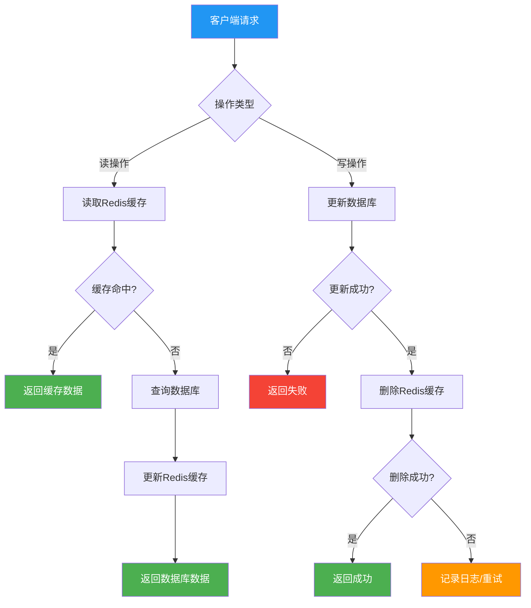
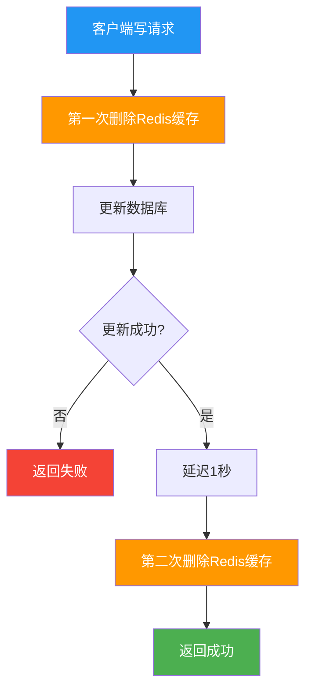
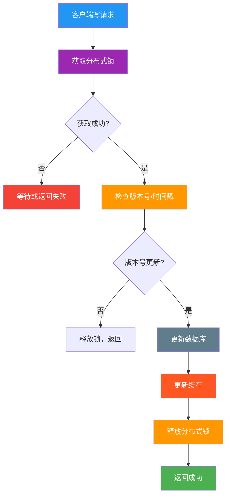
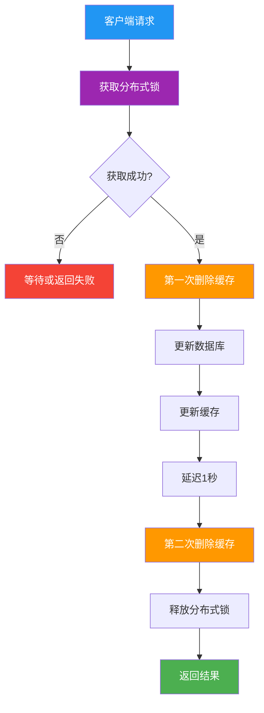
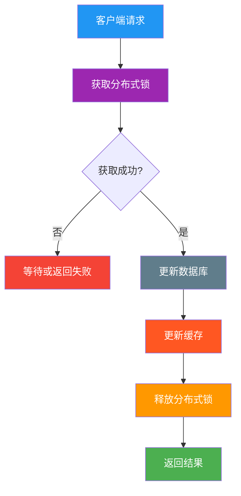
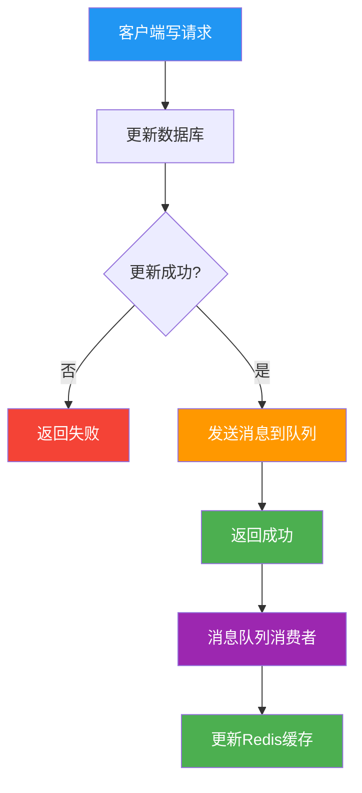
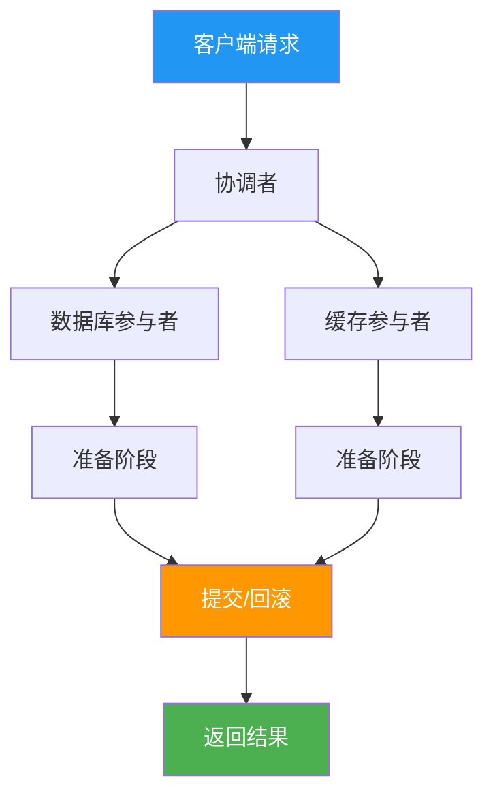
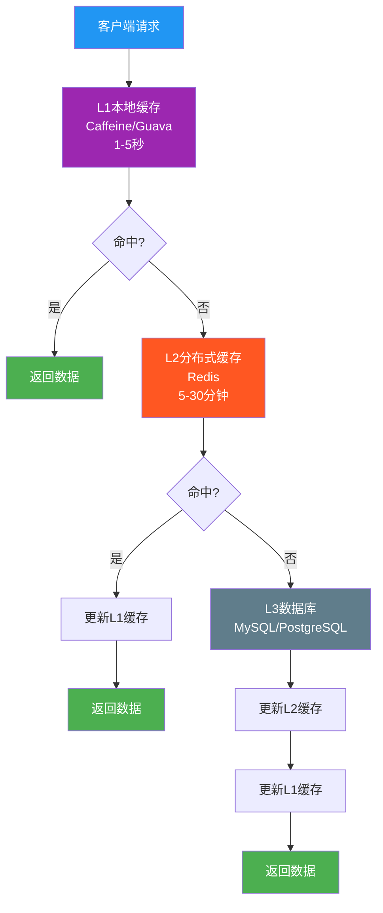
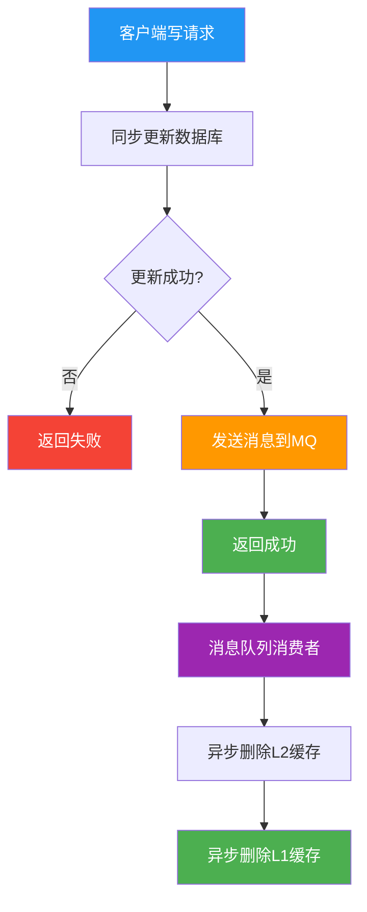
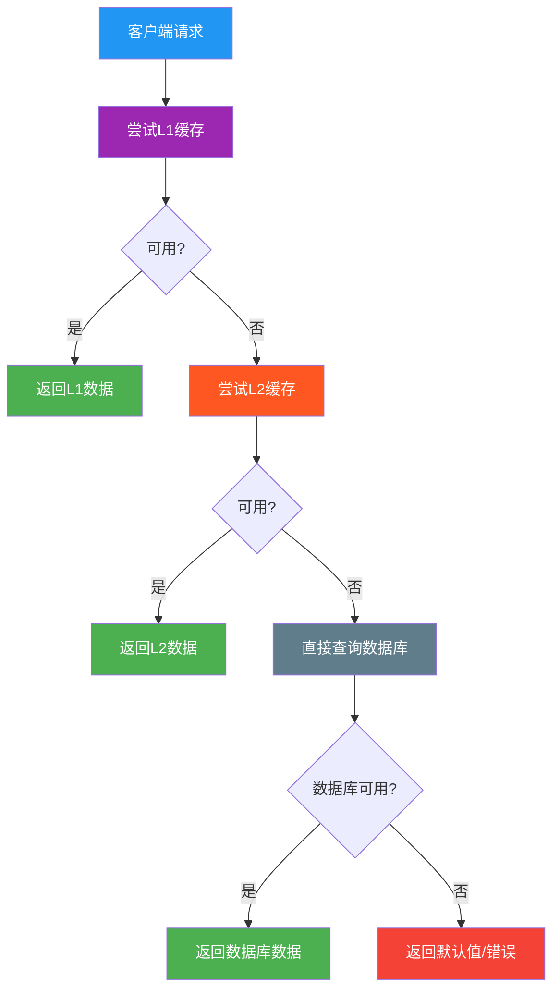

# Redis与数据库数据一致性 - 完整指南

## 目录
1. [问题分析](#1-问题分析)
2. [核心概念](#2-核心概念)
3. [解决方案](#3-解决方案)
4. [实现细节](#4-实现细节)
5. [并发场景深度分析](#5-并发场景深度分析)
6. [最佳实践](#6-最佳实践)
7. [面试要点](#7-面试要点)
8. [总结](#8-总结)

---

## 1. 问题分析

### 1.1 核心问题

**写数据库 + 写缓存无法保证原子性**

这是Redis缓存和数据库数据不一致的根本原因：

1. **跨系统操作**：数据库和缓存是两个独立的系统，无法使用同一个事务
2. **网络不可靠**：缓存写入可能失败、超时或丢包
3. **时序问题**：两个写操作无法保证严格的执行顺序
4. **并发竞态**：多个操作同时进行，可能出现部分成功、部分失败

### 1.2 原子性问题详解

#### 理想情况 vs 实际情况

```
理想情况：
T1: 开始事务
T2: 写数据库 ✅
T3: 写缓存 ✅
T4: 提交事务 ✅
结果：数据库和缓存都更新成功

实际情况：
T1: 开始事务
T2: 写数据库 ✅
T3: 写缓存 ❌ (网络故障)
T4: 提交事务 ✅
结果：数据库更新成功，缓存更新失败，数据不一致
```

### 1.3 具体场景分析

#### 场景1：并发写操作
```
时间线：
T1: 线程A读取缓存，得到旧值V1
T2: 线程B读取缓存，得到旧值V1  
T3: 线程A更新数据库为V2
T4: 线程B更新数据库为V3
T5: 线程A更新缓存为V2
T6: 线程B更新缓存为V3

结果：数据库是V3，缓存也是V3，但中间存在短暂不一致
```

#### 场景2：并发读场景
```
时间线：
T1: 线程A读取缓存，缓存未命中
T2: 线程B读取缓存，缓存未命中
T3: 线程A查询数据库，得到V1
T4: 线程B查询数据库，得到V1
T5: 线程A更新缓存为V1
T6: 线程B更新缓存为V1

结果：重复查询数据库，但最终一致
```

#### 场景3：并发读写场景（核心问题）
```
时间线：
T1: 线程A读取缓存，得到旧值V1
T2: 线程B更新数据库为V2
T3: 线程B删除缓存
T4: 线程A更新缓存为V1（基于旧值）

结果：数据库是V2，但缓存是V1，数据不一致 ❌
```

---

## 2. 核心概念

### 2.1 为什么删除缓存而不是更新缓存？

**核心原因**：

1. **避免并发竞态条件**：防止多个写操作导致缓存数据错乱
2. **简化失败处理**：删除失败时，下次读取会重新加载正确数据
3. **保证最终一致性**：通过删除强制下次读取时从数据库获取最新数据
4. **降低复杂度**：避免复杂的缓存更新逻辑和字段合并

**详细解释**：
```
场景：两个并发写操作
- 操作A：更新数据库 → 更新缓存（失败）
- 操作B：更新数据库 → 更新缓存（成功）
结果：数据库是最新数据，但缓存是旧数据 ❌

解决方案：删除缓存
- 操作A：更新数据库 → 删除缓存
- 操作B：更新数据库 → 删除缓存  
结果：下次读取时重新从数据库加载，保证一致性 ✅
```

### 2.2 一致性级别对比

| 一致性类型 | 说明 | 适用场景 |
|-----------|------|----------|
| **强一致性** | 缓存和数据库数据严格一致 | 金融、支付等对数据准确性要求极高的场景 |
| **最终一致性** | 允许短暂不一致，但最终会一致 | 互联网应用，允许短暂不一致但要求高性能 |

### 2.3 缓存三大问题

#### 缓存穿透
- **问题**：查询不存在的数据，绕过缓存直接访问数据库
- **解决**：布隆过滤器 + 缓存空对象

#### 缓存击穿
- **问题**：热点数据过期时大量请求直接访问数据库
- **解决**：分布式锁 + 缓存预热

#### 缓存雪崩
- **问题**：大量缓存同时过期导致数据库压力骤增
- **解决**：随机过期时间 + 多级缓存

---

## 3. 解决方案

### 3.1 解决方案对比表

| 方案 | 原子性 | 一致性 | 单调更新 | 性能 | 复杂度 | 适用场景 |
|------|--------|--------|----------|------|--------|----------|
| Cache Aside | ❌ | 最终一致性 | ❌ | ✅ | 低 | 读多写少 |
| 双删策略 | ❌ | 最终一致性 | ❌ | ✅ | 中 | 一般业务 |
| 分布式锁 | ✅ | 强一致性 | ✅ | ❌ | 高 | 强一致性要求 |
| 消息队列 | ❌ | 最终一致性 | ❌ | ✅ | 中 | 高并发场景 |
| 2PC事务 | ✅ | 强一致性 | ✅ | ❌ | 高 | 金融、支付 |

### 3.2 Cache Aside模式

#### 流程设计


#### 优点
1. **实现简单**：逻辑清晰，易于理解和实现
2. **性能良好**：读操作优先使用缓存，性能优秀
3. **容错性强**：缓存故障时自动降级到数据库

#### 缺点
1. **可能不一致**：在并发场景下可能出现短暂不一致
2. **缓存穿透**：大量请求同时查询不存在的数据
3. **缓存击穿**：热点数据过期时大量请求直接访问数据库

### 3.3 双删策略

#### 流程设计


#### 核心思想
**删除缓存 → 更新DB → 延迟删除缓存（延迟1s）**

1. **第一次删除**：防止写操作期间缓存被读取
2. **更新数据库**：确保数据持久化
3. **延迟删除**：清理读并发写入的脏数据
4. **TTL保证失效**：通过过期时间达到最终一致性

#### 解决的问题
- ✅ 避免缓存被读并发写入
- ✅ 通过TTL保证最终一致性
- ✅ 实现相对简单
- ❌ 无法解决并发写问题
- ❌ 无法保证单调更新
- ❌ 延迟时间难以确定

#### 无法解决的问题

**1. 并发写问题**
```
并发写场景：
T1: 线程A删除缓存
T2: 线程B删除缓存  
T3: 线程A更新数据库为V1
T4: 线程B更新数据库为V2
T5: 线程A延迟删除缓存
T6: 线程B延迟删除缓存

结果：数据库最终是V2，但中间存在短暂不一致
```

**2. 主从同步延迟问题**
```
主从同步延迟场景：
T1: 线程A更新主库 X = 2 (原值 X = 1)
T2: 线程A删除缓存
T3: 线程B查询缓存，没有命中，查询从库得到旧值 (从库 X = 1)
T4: 从库同步完成 (主从库 X = 2)
T5: 线程B将旧值写入缓存 (X = 1)

结果：缓存是旧值X=1，数据库是新值X=2，数据不一致

解决方案：延迟删除缓存的时间需要大于主从同步时间
```

### 3.4 分布式锁 + 单调写方案

#### 流程设计


#### 核心思想
**分布式锁保证更新DB+更新缓存的原子性**

1. **单调写**：确保写入操作按时间顺序递增，避免旧数据覆盖新数据
2. **分布式锁**：保证同一key的写操作串行化，避免并发竞态
3. **版本控制**：通过版本号或时间戳判断数据的新鲜度

#### 优点
1. **强一致性**：通过锁保证操作的原子性
2. **单调更新**：确保缓存数据按时间顺序更新
3. **解决并发问题**：避免竞态条件
4. **数据准确**：确保缓存和数据库完全一致

#### 缺点
1. **性能影响**：锁竞争影响系统性能
2. **复杂度高**：需要处理锁超时、死锁等问题
3. **可用性风险**：锁服务故障影响整个系统

#### 关键要点
- **锁粒度**：按key锁定，避免全局锁
- **超时处理**：设置合理的锁超时时间
- **避免死锁**：使用Redis Lua脚本保证原子性

### 3.5 分布式锁+双删的分析

#### 问题：冗余且有害


#### 为什么有问题？
1. **冗余操作**：锁已经串行化，不需要双删
2. **性能浪费**：延迟删除增加不必要的等待时间
3. **逻辑矛盾**：先更新缓存再删除缓存，没有意义
4. **复杂度增加**：增加了不必要的实现复杂度

#### 正确做法


### 3.6 消息队列异步更新

#### 流程设计


#### 优点
1. **解耦**：数据库更新和缓存更新分离
2. **可靠性**：消息队列保证消息不丢失
3. **性能**：异步处理不影响主流程

#### 缺点
1. **最终一致性**：存在短暂不一致
2. **复杂度**：需要消息队列基础设施
3. **延迟**：缓存更新有延迟

### 3.7 2PC分布式事务

#### 流程设计


#### 核心思想
**2PC来保证业务的一致性**

1. **准备阶段**：各参与者准备执行操作
2. **提交阶段**：所有参与者都准备好后提交
3. **回滚机制**：任一参与者失败则回滚
4. **强一致性**：保证所有操作要么全部成功，要么全部失败

#### 解决的问题
- ✅ 强一致性保证
- ✅ 原子性操作
- ✅ 事务完整性
- ❌ 性能差
- ❌ 复杂度高
- ❌ 可用性低

---

## 4. 实现细节

### 4.1 分布式锁实现

#### 锁实现方式
```java
public class DistributedLock {
    private RedisTemplate redisTemplate;
    
    public boolean tryLock(String key, String value, long expireTime) {
        // 使用SETNX + EXPIRE实现分布式锁
        return redisTemplate.opsForValue()
            .setIfAbsent(key, value, Duration.ofSeconds(expireTime));
    }
    
    public void unlock(String key, String value) {
        // 使用Lua脚本保证原子性
        String script = 
            "if redis.call('GET', KEYS[1]) == ARGV[1] then " +
            "    return redis.call('DEL', KEYS[1]) " +
            "else " +
            "    return 0 " +
            "end";
        
        redisTemplate.execute(
            RedisScript.of(script, Long.class),
            Collections.singletonList(key),
            value
        );
    }
}
```

### 4.2 版本号机制

#### 实现方式
```java
public class MonotonicCacheService {
    public boolean updateData(String key, Object newData, long timestamp) {
        String script = 
            "local current = redis.call('HGET', KEYS[1], 'timestamp') " +
            "if current == false or tonumber(ARGV[2]) > tonumber(current) then " +
            "    redis.call('HMSET', KEYS[1], 'data', ARGV[1], 'timestamp', ARGV[2]) " +
            "    return 1 " +
            "else " +
            "    return 0 " +
            "end";
        
        Long result = redisTemplate.execute(
            RedisScript.of(script, Long.class),
            Collections.singletonList(key),
            newData, timestamp
        );
        
        return result == 1;
    }
}
```

### 4.3 版本号选择

1. **时间戳**：简单易用，但可能存在时钟回拨问题
2. **递增序列号**：需要额外的序列号生成器（如Redis INCR）
3. **雪花算法ID**：全局唯一且单调递增
4. **混合方案**：时间戳 + 序列号，保证单调性

---

## 5. 并发场景深度分析

### 5.1 并发写操作场景

#### 问题描述
多个线程同时更新同一数据，可能导致缓存和数据库不一致。

#### 解决方案对比

| 方案 | 一致性级别 | 性能影响 | 实现复杂度 | 适用场景 |
|------|------------|----------|------------|----------|
| Cache Aside | 最终一致性 | 低 | 简单 | 读多写少 |
| 双删策略 | 最终一致性 | 中等 | 中等 | 一般业务 |
| 分布式锁 | 强一致性 | 高 | 复杂 | 强一致性要求 |
| 消息队列 | 最终一致性 | 低 | 复杂 | 高并发场景 |

### 5.2 并发读场景

#### 问题描述
多个线程同时读取同一数据，可能导致缓存穿透或重复查询数据库。

#### 解决方案
1. **缓存预热**：系统启动时加载热点数据
2. **布隆过滤器**：防止缓存穿透
3. **分布式锁**：防止重复查询数据库
4. **单实例本地缓存**：减少查询分布式缓存的压力

### 5.3 并发读写场景

#### 问题描述
读操作和写操作同时进行，可能导致读取到过期数据。

#### 解决方案
1. **双删策略**：延迟删除清理脏数据
2. **版本号机制**：通过版本号判断数据新鲜度
3. **读写分离**：读操作使用从库，写操作使用主库
4. **分布式锁**：保证读写操作的原子性

---

## 6. 最佳实践

### 6.1 分层缓存架构



### 6.2 异步更新策略



### 6.3 降级策略



### 6.4 实践要点

#### 缓存策略
1. **预热策略**：系统启动时加载热点数据
2. **更新策略**：主动更新 vs 被动更新
3. **过期策略**：TTL + LRU

#### 监控告警
1. **缓存命中率**：L1 > 80%，L2 > 60%
2. **响应时间**：P99 < 100ms
3. **可用性**：99.9%+
4. **数据一致性**：不一致率 < 0.1%

#### 容量规划
1. **数据量评估**：基于业务增长预测
2. **访问模式分析**：热点数据识别
3. **成本效益分析**：性能提升 vs 资源成本

---

## 7. 面试要点

### 7.1 常考问题

#### 问题1: 数据不一致的根本原因
**答案要点**：
1. 时序问题：缓存和数据库更新顺序不同
2. 并发问题：多线程同时操作导致竞态条件
3. 网络问题：缓存更新失败但数据库更新成功
4. 系统故障：部分系统宕机导致更新不完整

#### 问题2: 为什么要删除缓存而不是更新缓存？
**答案要点**：
1. 避免并发竞态条件
2. 简化失败处理
3. 保证最终一致性
4. 降低复杂度

#### 问题3: 双删策略能解决什么问题？
**答案要点**：
- ✅ 解决并发读写场景下的数据不一致
- ✅ 通过TTL保证最终一致性
- ❌ 无法解决并发写问题
- ❌ 延迟时间难以精确控制

#### 问题4: 分布式锁能解决什么问题？
**答案要点**：
- ✅ 保证串行执行
- ✅ 强一致性要求
- ✅ 避免并发冲突
- ✅ 解决并发写问题
- ❌ 性能影响（锁竞争）
- ❌ 复杂度高

### 7.2 回答技巧

1. **结构化回答**：先总后分，逻辑清晰
2. **举例说明**：结合实际项目经验
3. **深度分析**：不仅说是什么，更要说为什么
4. **权衡考虑**：分析方案的优缺点和适用场景

---

## 8. 总结

### 8.1 方案选择建议

1. **读多写少场景**：Cache Aside + 双删策略
2. **强一致性要求**：分布式锁 + 单调更新
3. **高并发场景**：消息队列 + 异步更新
4. **一般业务场景**：分层缓存 + 降级策略

### 8.2 选择原则

- **性能优先**：双删策略（解决读写并发）
- **一致性优先**：分布式锁（解决写写并发 + 原子性）
- **事务优先**：2PC（解决跨系统原子性）

### 8.3 关键指标

- **缓存命中率**：L1 > 80%，L2 > 60%
- **响应时间**：P99 < 100ms
- **可用性**：99.9%+
- **数据一致性**：不一致率 < 0.1%

### 8.4 核心要点总结

1. **问题本质**：写数据库 + 写缓存无法保证原子性
2. **解决思路**：
   - 最终一致性：双删策略 + TTL失效
   - 强一致性：分布式锁 + 单调更新
   - 事务一致性：2PC + 原子操作
3. **实现要点**：
   - 延迟时间：1秒左右，根据业务调整
   - 主从同步时间：延迟删除时间 > 主从同步时间
   - 锁粒度：按key锁定，避免全局锁
   - 超时处理：设置合理的锁超时时间
   - 监控告警：实时监控一致性指标

通过以上方案的综合应用，可以在保证数据一致性的同时，获得良好的系统性能和用户体验。
