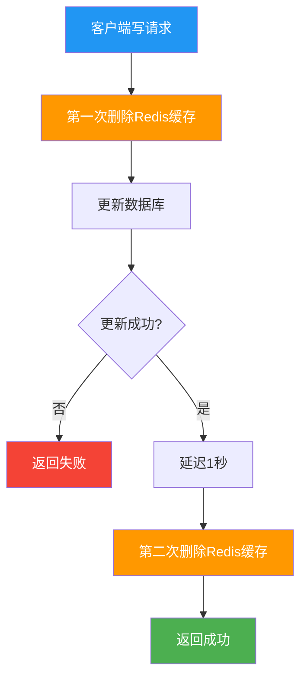
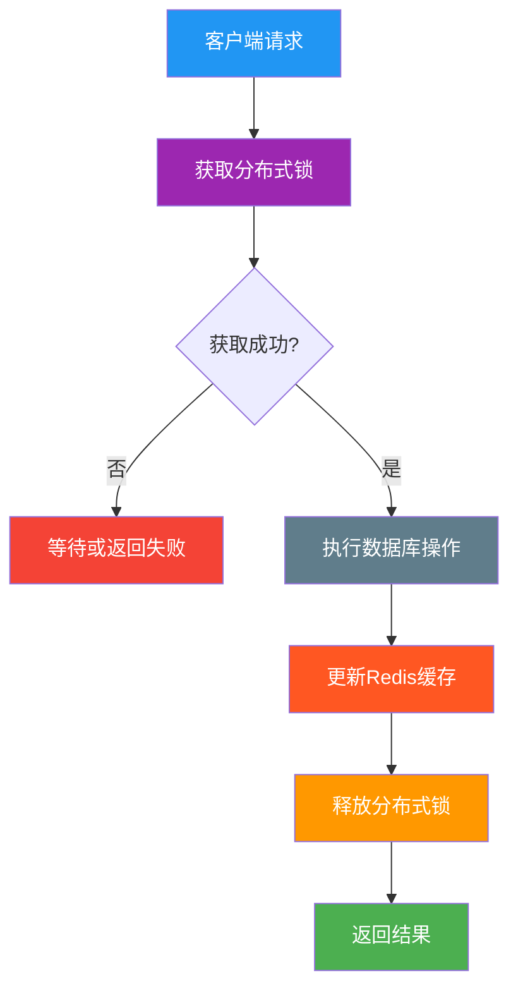
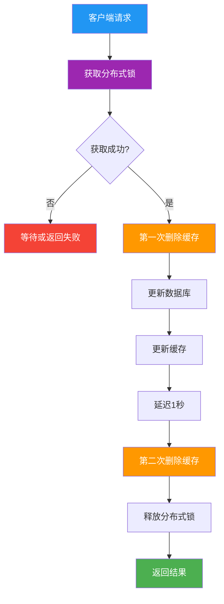
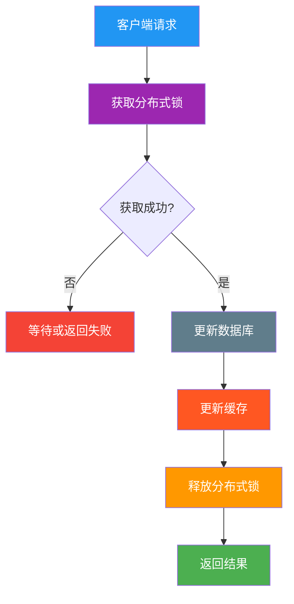
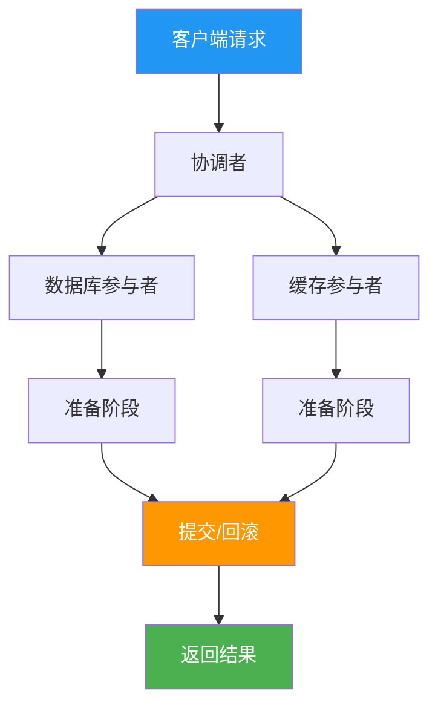

# Redis与数据库数据一致性 - 核心要点梳理

## 1. 并发场景分析

### 1.1 写并发场景
**问题**：多个线程同时更新同一数据
```
时间线：
T1: 线程A更新数据库为V1
T2: 线程B更新数据库为V2
T3: 线程A删除缓存
T4: 线程B删除缓存
T5: 线程A读取缓存，未命中，查询数据库得到V2
T6: 线程A更新缓存为V2
T7: 线程B读取缓存，命中，得到V2

结果：最终一致，但中间存在短暂不一致
```

### 1.2 读并发场景
**问题**：多个线程同时读取同一数据
```
时间线：
T1: 线程A读取缓存，未命中
T2: 线程B读取缓存，未命中
T3: 线程A查询数据库，得到V1
T4: 线程B查询数据库，得到V1
T5: 线程A更新缓存为V1
T6: 线程B更新缓存为V1

结果：重复查询数据库，但最终一致
```

### 1.3 读写并发场景
**问题**：读操作和写操作同时进行
```
时间线：
T1: 线程A读取缓存，得到旧值V1
T2: 线程B更新数据库为V2
T3: 线程B删除缓存
T4: 线程A更新缓存为V1（基于旧值）

结果：数据库是V2，但缓存是V1，数据不一致
```

---

## 2. 核心解决方案

### 2.1 双删策略（延迟删除）

#### 流程设计


#### 核心思想
**删除缓存-更新DB-删除缓存（延迟1s）**

1. **第一次删除**：防止写操作期间缓存被读取
2. **更新数据库**：确保数据持久化
3. **延迟删除**：避免读并发写入旧数据
4. **TTL保证失效**：通过过期时间达到最终一致性

#### 解决的问题
- ✅ 避免缓存被读并发写入
- ✅ 通过TTL保证最终一致性
- ✅ 实现相对简单
- ❌ 无法解决并发写问题
- ❌ 无法保证单调更新
- ❌ 无法保证串行执行

#### 无法解决的问题

**1. 并发写问题**
```
并发写场景：
T1: 线程A删除缓存
T2: 线程B删除缓存  
T3: 线程A更新数据库为V1
T4: 线程B更新数据库为V2
T5: 线程A延迟删除缓存
T6: 线程B延迟删除缓存

结果：数据库最终是V2，但中间存在短暂不一致
```

**2. 主从同步延迟问题**
```
主从同步延迟场景：
T1: 线程A更新主库 X = 2 (原值 X = 1)
T2: 线程A删除缓存
T3: 线程B查询缓存，没有命中，查询从库得到旧值 (从库 X = 1)
T4: 从库同步完成 (主从库 X = 2)
T5: 线程B将旧值写入缓存 (X = 1)

结果：缓存是旧值X=1，数据库是新值X=2，数据不一致
```

**解决方案**：延迟删除缓存的时间，需要大于主从同步时间

---

## 3. 强一致性方案

### 3.1 分布式锁方案

#### 流程设计


#### 核心思想
**分布式锁保证更新DB+更新缓存的原子性**

1. **串行化执行**：同一时间只有一个线程执行写操作
2. **原子性保证**：数据库和缓存更新在同一锁内完成
3. **避免竞态条件**：消除并发冲突
4. **强一致性**：确保数据完全一致
5. **解决并发写**：通过串行化避免写写冲突

#### 解决的问题
- ✅ 保证串行执行
- ✅ 强一致性要求
- ✅ 避免并发冲突
- ✅ 解决并发写问题
- ✅ 保证更新DB+更新缓存的原子性
- ❌ 性能影响（锁竞争）
- ❌ 复杂度高

### 3.2 分布式锁 + 双删方案分析

#### 问题：冗余且有害


#### 为什么有问题？
1. **冗余操作**：锁已经串行化，不需要双删
2. **性能浪费**：延迟删除增加不必要的等待时间
3. **逻辑矛盾**：先更新缓存再删除缓存，没有意义
4. **复杂度增加**：增加了不必要的实现复杂度

#### 正确做法


### 3.3 2PC分布式事务

#### 流程设计


#### 核心思想
**2PC来保证业务的一致性**

1. **准备阶段**：各参与者准备执行操作
2. **提交阶段**：所有参与者都准备好后提交
3. **回滚机制**：任一参与者失败则回滚
4. **强一致性**：保证所有操作要么全部成功，要么全部失败

#### 解决的问题
- ✅ 强一致性保证
- ✅ 原子性操作
- ✅ 事务完整性
- ❌ 性能差
- ❌ 复杂度高
- ❌ 可用性低

---

## 4. 方案对比

### 4.1 一致性级别对比

| 方案 | 一致性 | 单调更新 | 串行执行 | 性能 | 复杂度 | 适用场景 |
|------|--------|----------|----------|------|--------|----------|
| 双删策略 | 最终一致性 | ❌ | ❌ | ✅ | 低 | 读多写少 |
| 分布式锁 | 强一致性 | ✅ | ✅ | ❌ | 高 | 强一致性要求 |
| 分布式锁+双删 | 强一致性 | ✅ | ✅ | ❌ | 高 | ❌ 冗余方案 |
| 2PC事务 | 强一致性 | ✅ | ✅ | ❌ | 高 | 金融、支付 |

### 4.2 适用场景

#### 双删策略
- **适用**：读多写少，允许短暂不一致
- **不适用**：强一致性要求，单调更新需求

#### 分布式锁
- **适用**：强一致性要求，单调更新需求
- **不适用**：高并发性能要求
- **注意**：不要与双删策略结合使用，会造成冗余

#### 2PC事务
- **适用**：金融、支付等强一致性场景
- **不适用**：高并发、高可用场景

---

## 5. 核心要点总结

### 5.1 问题本质
**写数据库 + 写缓存无法保证原子性**

### 5.2 解决思路
1. **最终一致性**：双删策略 + TTL失效（解决读写并发）
2. **强一致性**：分布式锁 + 串行执行（解决写写并发 + 原子性）
3. **事务一致性**：2PC + 原子操作（解决跨系统原子性）

### 5.3 选择原则
- **性能优先**：双删策略（解决读写并发）
- **一致性优先**：分布式锁（解决写写并发 + 原子性）
- **事务优先**：2PC（解决跨系统原子性）

### 5.4 实现要点
- **延迟时间**：1秒左右，根据业务调整
- **主从同步时间**：延迟删除时间 > 主从同步时间
- **锁粒度**：按key锁定，避免全局锁
- **超时处理**：设置合理的锁超时时间
- **监控告警**：实时监控一致性指标

---

## 6. 最佳实践

### 6.1 分层架构
```
L1: 本地缓存（1-5秒）
L2: 分布式缓存（5-30分钟）
L3: 数据库（持久化）
```

### 6.2 降级策略
```
缓存故障 → 直连数据库
数据库故障 → 使用缓存数据
系统故障 → 返回默认值
```

### 6.3 监控指标
- **缓存命中率**：L1 > 80%，L2 > 60%
- **响应时间**：P99 < 100ms
- **可用性**：99.9%+
- **数据一致性**：不一致率 < 0.1%

通过以上方案的综合应用，可以在保证数据一致性的同时，获得良好的系统性能和用户体验。
