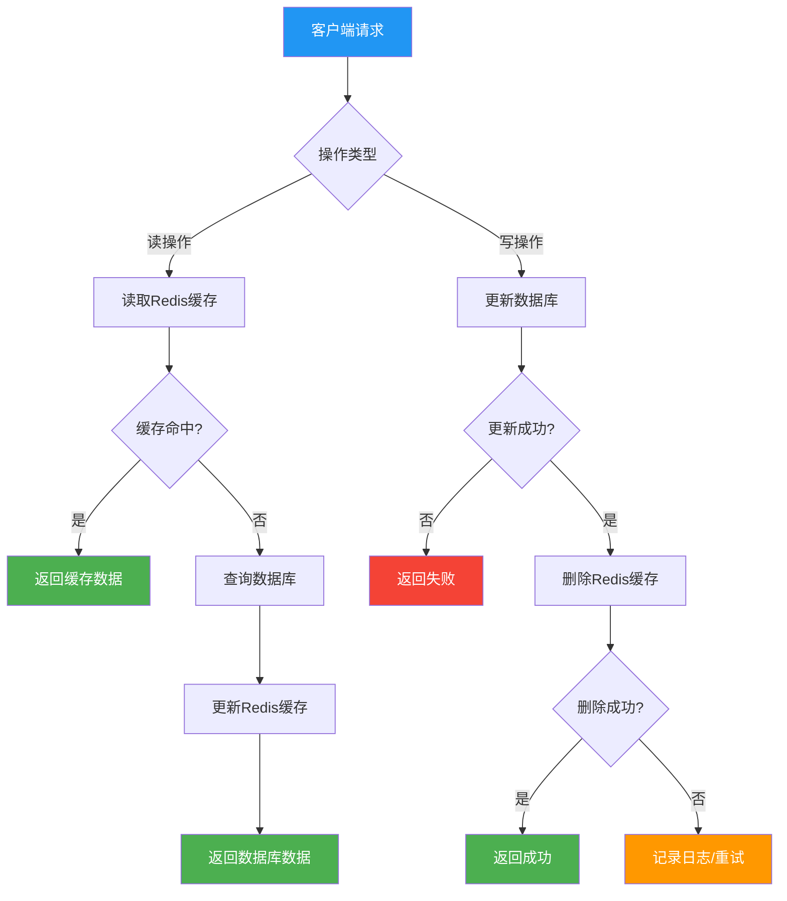
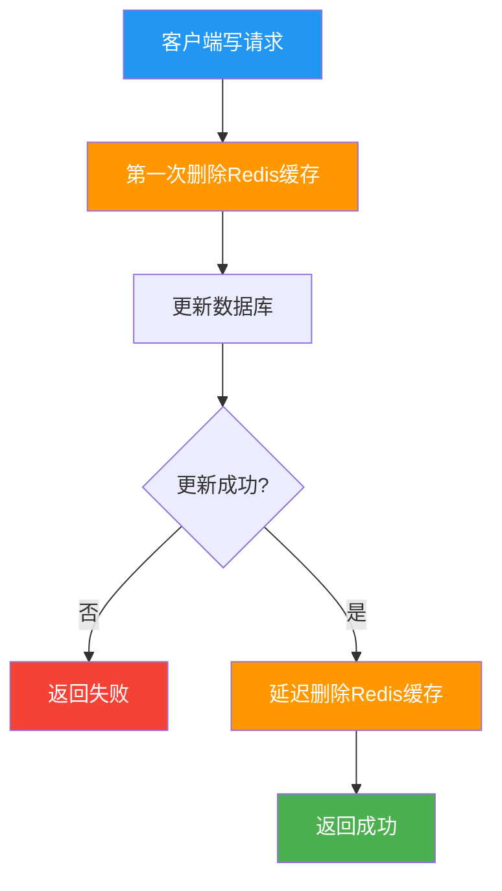
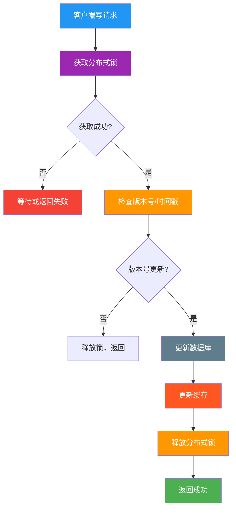
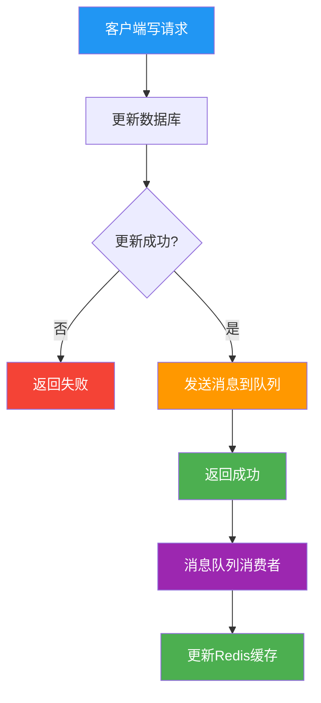
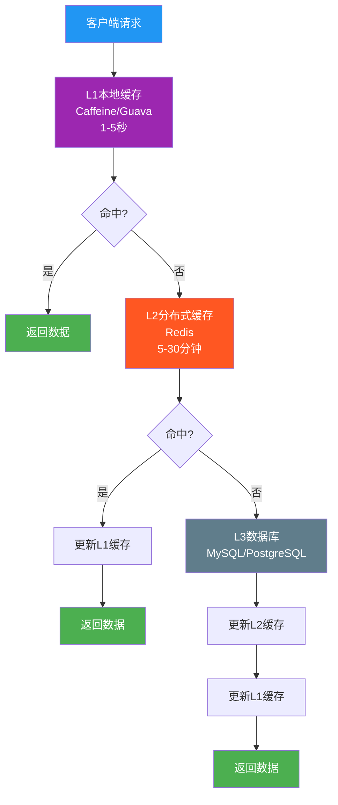
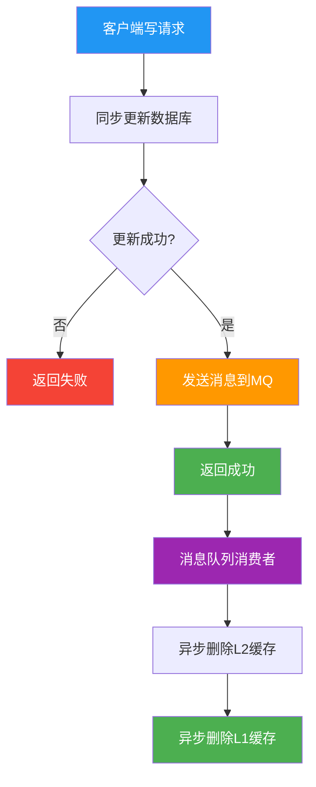
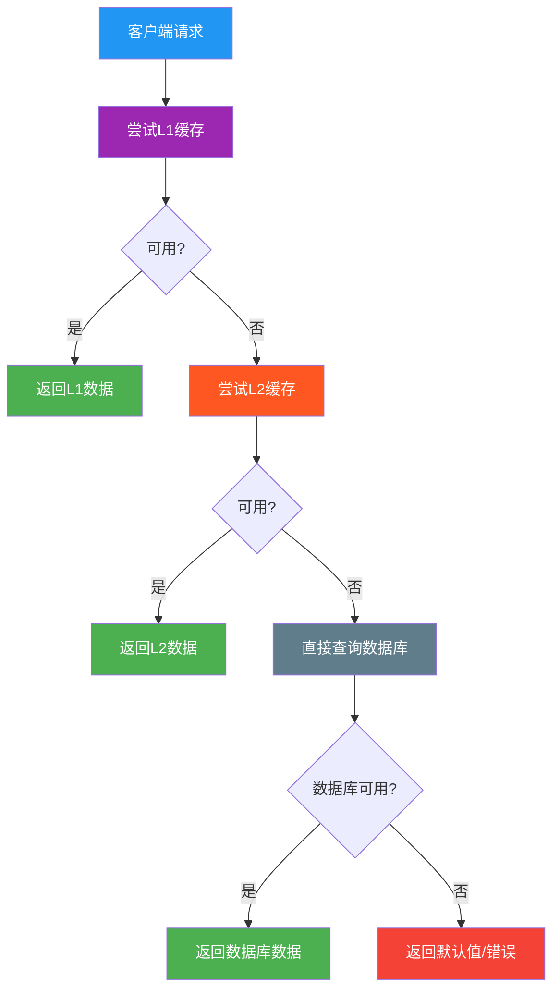

# Redis与数据库数据一致性 - 完整解决方案

## 1. 问题分析

### 1.1 核心问题
**写数据库 + 写缓存无法保证原子性**

这是Redis缓存和数据库数据不一致的根本原因：

1. **跨系统操作**：数据库和缓存是两个独立的系统，无法使用同一个事务
2. **网络不可靠**：缓存写入可能失败、超时或丢包
3. **时序问题**：两个写操作无法保证严格的执行顺序
4. **并发竞态**：多个操作同时进行，可能出现部分成功、部分失败

### 1.2 原子性问题详解

#### 理想情况 vs 实际情况
```
理想情况：
T1: 开始事务
T2: 写数据库 ✅
T3: 写缓存 ✅
T4: 提交事务 ✅
结果：数据库和缓存都更新成功

实际情况：
T1: 开始事务
T2: 写数据库 ✅
T3: 写缓存 ❌ (网络故障)
T4: 提交事务 ✅
结果：数据库更新成功，缓存更新失败，数据不一致
```

#### 并发场景问题
```
并发场景：
T1: 线程A写数据库为V1
T2: 线程B写数据库为V2
T3: 线程A写缓存为V1
T4: 线程B写缓存为V2
结果：数据库是V2，缓存也是V2，但中间存在短暂不一致
```

### 1.3 具体场景分析

#### 场景1：并发写操作
```
时间线：
T1: 线程A读取缓存，得到旧值V1
T2: 线程B读取缓存，得到旧值V1  
T3: 线程A更新数据库为V2
T4: 线程B更新数据库为V3
T5: 线程A更新缓存为V2
T6: 线程B更新缓存为V3

结果：数据库是V3，缓存也是V3，但中间存在短暂不一致
```

#### 场景2：并发读场景
```
时间线：
T1: 线程A读取缓存，缓存未命中
T2: 线程B读取缓存，缓存未命中
T3: 线程A查询数据库，得到V1
T4: 线程B查询数据库，得到V1
T5: 线程A更新缓存为V1
T6: 线程B更新缓存为V1

结果：重复查询数据库，但最终一致
```

#### 场景3：并发读写场景
```
时间线：
T1: 线程A读取缓存，得到旧值V1
T2: 线程B更新数据库为V2
T3: 线程B删除缓存
T4: 线程A更新缓存为V1（基于旧值）

结果：数据库是V2，但缓存是V1，数据不一致
```

---

## 2. 解决方案

### 2.0 解决原子性问题的核心思路

由于**写数据库 + 写缓存无法保证原子性**，我们需要采用以下策略：

1. **避免同时写两个系统**：只写数据库，缓存通过其他方式更新
2. **使用补偿机制**：写缓存失败时，通过重试或异步处理补偿
3. **接受最终一致性**：在大多数业务场景下，最终一致性比强一致性更实用
4. **使用分布式事务**：在强一致性要求的场景下，使用2PC/3PC等方案

### 2.1 方案对比表

| 方案 | 原子性 | 一致性 | 单调更新 | 性能 | 复杂度 | 适用场景 |
|------|--------|--------|----------|------|--------|----------|
| 分布式事务 | ✅ | 强一致性 | ✅ | ❌ | 高 | 金融、支付 |
| 分布式锁+单调写 | ✅ | 强一致性 | ✅ | ❌ | 高 | 强一致性要求 |
| 消息队列 | ❌ | 最终一致性 | ❌ | ✅ | 中 | 大多数业务 |
| 补偿机制 | ❌ | 最终一致性 | ❌ | ✅ | 低 | 一般业务 |
| 删除缓存 | ❌ | 最终一致性 | ❌ | ✅ | 低 | 读多写少 |

## 3. 具体解决方案

### 3.1 Cache Aside模式

#### 流程设计


#### 优点
1. **实现简单**：逻辑清晰，易于理解和实现
2. **性能良好**：读操作优先使用缓存，性能优秀
3. **容错性强**：缓存故障时自动降级到数据库

#### 缺点
1. **可能不一致**：在并发场景下可能出现短暂不一致
2. **缓存穿透**：大量请求同时查询不存在的数据
3. **缓存击穿**：热点数据过期时大量请求直接访问数据库

#### 解决的问题
- ✅ 基本的读写一致性
- ✅ 缓存故障时的降级处理
- ❌ 并发写操作的一致性
- ❌ 缓存穿透和击穿问题

---

### 3.2 双删策略

#### 流程设计


#### 双删解决的具体问题

**问题场景**：
```
时间线：
T1: 线程A读取缓存，得到旧值V1
T2: 线程B更新数据库为V2
T3: 线程B删除缓存
T4: 线程A更新缓存为V1（基于旧值）

结果：数据库是V2，但缓存是V1，数据不一致
```

**双删解决方案**：
```
时间线：
T1: 线程B第一次删除缓存
T2: 线程B更新数据库为V2
T3: 线程A读取缓存，缓存未命中
T4: 线程A查询数据库，得到V2
T5: 线程A更新缓存为V2
T6: 线程B延迟删除缓存（清理可能的脏数据）

结果：最终数据库和缓存都是V2，数据一致
```

#### 优点
1. **解决并发读写不一致**：通过延迟删除清理可能的脏数据
2. **保证最终一致性**：确保缓存最终与数据库一致
3. **实现相对简单**：在Cache Aside基础上增加延迟删除

#### 缺点
1. **延迟时间难以确定**：延迟太短可能清理不彻底，太长影响性能
2. **仍然可能不一致**：在延迟期间可能出现短暂不一致
3. **实现复杂**：需要定时任务或消息队列支持

#### 解决的问题
- ✅ 并发读写场景的一致性
- ✅ 最终一致性保证
- ❌ 强一致性要求
- ❌ 延迟时间的精确控制

---

### 3.3 分布式锁 + 单调写方案

#### 流程设计


#### 核心思想
**单调写 + 分布式锁 = 强一致性 + 单调更新**

1. **单调写**：确保写入操作按时间顺序递增，避免旧数据覆盖新数据
2. **分布式锁**：保证同一key的写操作串行化，避免并发竞态
3. **版本控制**：通过版本号或时间戳判断数据的新鲜度

#### 优点
1. **强一致性**：通过锁保证操作的原子性
2. **单调更新**：确保缓存数据按时间顺序更新
3. **解决并发问题**：避免竞态条件
4. **数据准确**：确保缓存和数据库完全一致
5. **版本控制**：防止旧数据覆盖新数据

#### 缺点
1. **性能影响**：锁竞争影响系统性能
2. **复杂度高**：需要处理锁超时、死锁等问题
3. **可用性风险**：锁服务故障影响整个系统
4. **实现复杂**：需要版本号管理和锁管理

#### 解决的问题
- ✅ 强一致性要求
- ✅ 单调更新保证
- ✅ 并发操作的安全性
- ✅ 数据版本控制
- ❌ 高并发性能
- ❌ 系统可用性

---

### 3.4 消息队列异步更新

#### 流程设计


#### 优点
1. **解耦**：数据库更新和缓存更新分离
2. **可靠性**：消息队列保证消息不丢失
3. **性能**：异步处理不影响主流程

#### 缺点
1. **最终一致性**：存在短暂不一致
2. **复杂度**：需要消息队列基础设施
3. **延迟**：缓存更新有延迟

#### 解决的问题
- ✅ 系统解耦
- ✅ 高可用性
- ✅ 最终一致性
- ❌ 强一致性

---

## 4. 单调更新实现细节

### 4.1 版本号机制

#### 实现方式
```java
// 伪代码示例
public class MonotonicCacheService {
    private RedisTemplate redisTemplate;
    private DatabaseService databaseService;
    private DistributedLockService lockService;
    
    public boolean updateData(String key, Object newData) {
        String lockKey = "lock:" + key;
        String versionKey = "version:" + key;
        
        // 1. 获取分布式锁
        if (!lockService.tryLock(lockKey, 30, TimeUnit.SECONDS)) {
            return false;
        }
        
        try {
            // 2. 获取当前版本号
            Long currentVersion = redisTemplate.opsForValue().get(versionKey);
            Long newVersion = System.currentTimeMillis(); // 使用时间戳作为版本号
            
            // 3. 检查版本号是否更新
            if (currentVersion != null && newVersion <= currentVersion) {
                return false; // 版本号没有更新，拒绝写入
            }
            
            // 4. 更新数据库
            databaseService.update(key, newData);
            
            // 5. 更新缓存
            redisTemplate.opsForValue().set(key, newData);
            redisTemplate.opsForValue().set(versionKey, newVersion);
            
            return true;
        } finally {
            // 6. 释放锁
            lockService.unlock(lockKey);
        }
    }
}
```

#### 版本号选择
1. **时间戳**：简单易用，但可能存在时钟回拨问题
2. **递增序列号**：需要额外的序列号生成器
3. **UUID**：全局唯一，但无法比较大小
4. **混合方案**：时间戳 + 序列号，保证单调性

### 4.2 时间戳方案

#### 实现细节
```java
public class TimestampBasedCache {
    public boolean updateWithTimestamp(String key, Object data) {
        long timestamp = System.currentTimeMillis();
        
        // 使用Redis的SET命令，只有当新值的时间戳更大时才更新
        String script = 
            "local current = redis.call('HGET', KEYS[1], 'timestamp') " +
            "if current == false or tonumber(ARGV[2]) > tonumber(current) then " +
            "    redis.call('HMSET', KEYS[1], 'data', ARGV[1], 'timestamp', ARGV[2]) " +
            "    return 1 " +
            "else " +
            "    return 0 " +
            "end";
        
        Long result = redisTemplate.execute(
            RedisScript.of(script, Long.class),
            Collections.singletonList(key),
            data, timestamp
        );
        
        return result == 1;
    }
}
```

### 4.3 分布式锁优化

#### 锁粒度优化
```java
public class OptimizedDistributedLock {
    // 细粒度锁：只锁定特定的key
    public boolean updateWithFineGrainedLock(String key, Object data) {
        String lockKey = "lock:" + key;
        
        // 使用Redis的SETNX实现分布式锁
        Boolean acquired = redisTemplate.opsForValue()
            .setIfAbsent(lockKey, "locked", Duration.ofSeconds(30));
        
        if (!acquired) {
            return false;
        }
        
        try {
            // 执行更新逻辑
            return performUpdate(key, data);
        } finally {
            // 释放锁
            redisTemplate.delete(lockKey);
        }
    }
}
```

#### 锁超时处理
```java
public class LockTimeoutHandler {
    public boolean updateWithTimeout(String key, Object data) {
        String lockKey = "lock:" + key;
        String lockValue = UUID.randomUUID().toString();
        
        // 设置锁的超时时间
        Boolean acquired = redisTemplate.opsForValue()
            .setIfAbsent(lockKey, lockValue, Duration.ofSeconds(30));
        
        if (!acquired) {
            return false;
        }
        
        try {
            // 执行更新逻辑
            return performUpdate(key, data);
        } finally {
            // 只有持有锁的线程才能释放锁
            String script = 
                "if redis.call('GET', KEYS[1]) == ARGV[1] then " +
                "    return redis.call('DEL', KEYS[1]) " +
                "else " +
                "    return 0 " +
                "end";
            
            redisTemplate.execute(
                RedisScript.of(script, Long.class),
                Collections.singletonList(lockKey),
                lockValue
            );
        }
    }
}
```

---

## 5. 并发场景深度分析

### 5.1 并发写操作场景

#### 问题描述
多个线程同时更新同一数据，可能导致缓存和数据库不一致。

#### 解决方案对比

| 方案 | 一致性级别 | 性能影响 | 实现复杂度 | 适用场景 |
|------|------------|----------|------------|----------|
| Cache Aside | 最终一致性 | 低 | 简单 | 读多写少 |
| 双删策略 | 最终一致性 | 中等 | 中等 | 一般业务 |
| 分布式锁 | 强一致性 | 高 | 复杂 | 强一致性要求 |
| 消息队列 | 最终一致性 | 低 | 复杂 | 高并发场景 |

### 5.2 并发读场景

#### 问题描述
多个线程同时读取同一数据，可能导致缓存穿透或重复查询数据库。

#### 解决方案
1. **缓存预热**：系统启动时加载热点数据
2. **布隆过滤器**：防止缓存穿透
3. **分布式锁**：防止重复查询数据库

### 5.3 并发读写场景

#### 问题描述
读操作和写操作同时进行，可能导致读取到过期数据。

#### 解决方案
1. **双删策略**：延迟删除清理脏数据
2. **版本号机制**：通过版本号判断数据新鲜度
3. **读写分离**：读操作使用从库，写操作使用主库

---

## 6. 最佳实践推荐

### 6.1 分层缓存架构



### 6.2 异步更新策略



### 6.3 降级策略



---

## 7. 总结

### 7.1 方案选择建议

1. **读多写少场景**：Cache Aside + 双删策略
2. **强一致性要求**：分布式锁 + 事务
3. **高并发场景**：消息队列 + 异步更新
4. **一般业务场景**：分层缓存 + 降级策略

### 7.2 关键指标

- **缓存命中率**：L1 > 80%，L2 > 60%
- **响应时间**：P99 < 100ms
- **可用性**：99.9%+
- **数据一致性**：不一致率 < 0.1%

### 7.3 监控告警

1. **缓存命中率监控**
2. **响应时间监控**
3. **数据一致性监控**
4. **系统可用性监控**

通过以上方案的综合应用，可以在保证数据一致性的同时，获得良好的系统性能和用户体验。
