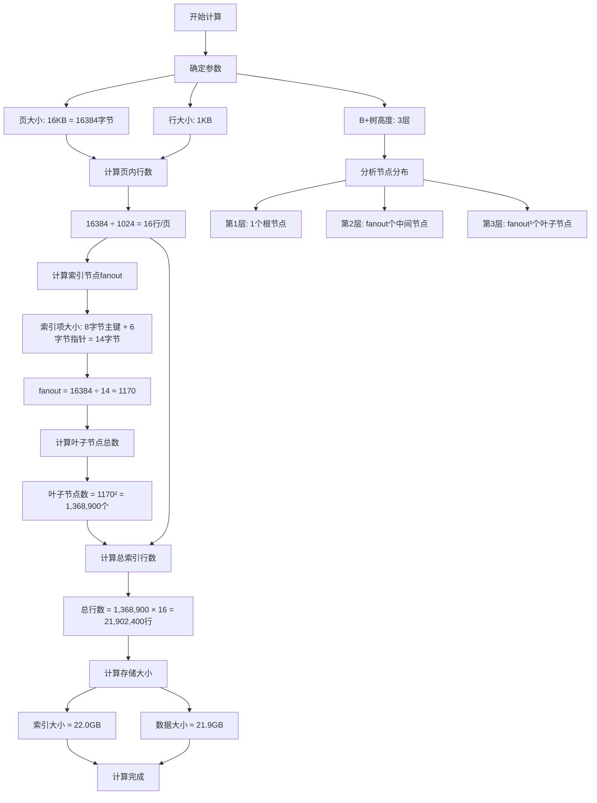
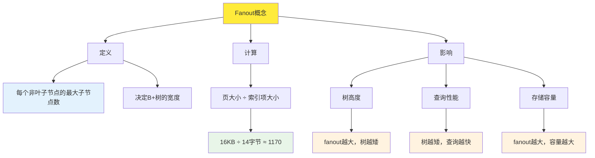
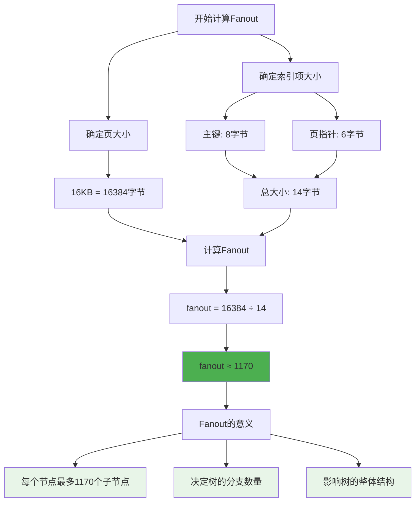
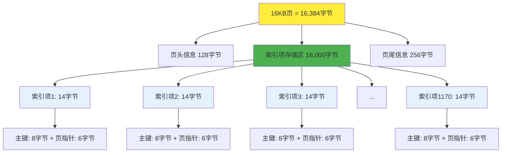
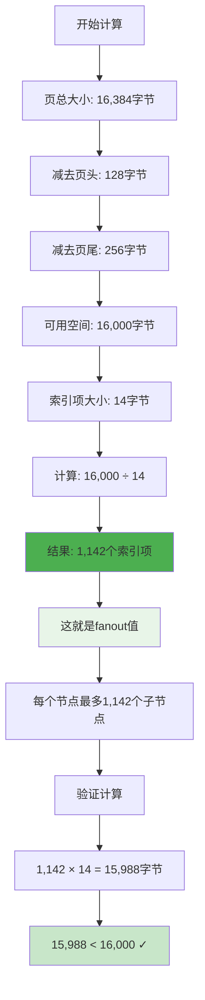

# InnoDB B+树高度为3时的索引行数计算

## 计算流程图



## 叶子节点计算专项流程图

```mermaid
flowchart TD
    A[叶子节点计算开始] --> B[确定B+树高度]
    B --> C[高度 = 3层]
    
    C --> D[计算fanout值]
    D --> E[页大小: 16KB]
    D --> F[索引项大小: 14字节]
    E --> G[fanout = 16384 ÷ 14 ≈ 1170]
    F --> G
    
    G --> H[应用叶子节点公式]
    H --> I[公式: fanout^(高度-1)]
    I --> J[计算: 1170^(3-1) = 1170²]
    J --> K[结果: 1,368,900个叶子节点]
    
    K --> L[验证计算]
    L --> M[每页16行数据]
    M --> N[总行数 = 1,368,900 × 16]
    N --> O[总行数 = 21,902,400行]
    
    O --> P[计算完成]
    
    style K fill:#e1f5fe
    style O fill:#e8f5e8
```

## Fanout概念图解



## Fanout计算流程图



## 详细计算过程

### 1. 基础参数
- **页大小**: 16 KB = 16,384 字节
- **行大小**: 1 KB = 1,024 字节
- **B+树高度**: 3 层

### 2. 页内行数计算
```
页内行数 = 页大小 ÷ 行大小
页内行数 = 16,384 ÷ 1,024 = 16 行/页
```

### 3. 节点分布分析
- **第1层（根节点）**: 1 个节点
- **第2层（中间节点）**: fanout 个节点
- **第3层（叶子节点）**: fanout² 个节点

### 4. 索引节点fanout计算
```
索引项大小 = 主键大小 + 页指针大小
索引项大小 = 8 字节 + 6 字节 = 14 字节

fanout = 页大小 ÷ 索引项大小
fanout = 16,384 ÷ 14 ≈ 1,170
```

### 5. 叶子节点总数
```
叶子节点数 = fanout² = 1,170² = 1,368,900 个
```

### 6. 总索引行数
```
总行数 = 叶子节点数 × 每页行数
总行数 = 1,368,900 × 16 = 21,902,400 行
```

### 7. 存储大小估算
```
总页数 = 1 + 1,170 + 1,368,900 = 1,370,071 页
索引大小 = 总页数 × 页大小 = 1,370,071 × 16 KB ≈ 22.0 GB
数据大小 = 总行数 × 行大小 = 21,902,400 × 1 KB ≈ 21.9 GB
```

## B+树叶子节点计算方法详解

### 叶子节点计算公式
```
叶子节点数 = fanout^(树高度-1)
```

其中：
- **fanout**: 每个节点的最大子节点数（扇出度）
- **树高度**: B+树的总层数

### 叶子节点计算步骤

#### 1. 确定fanout值
```
fanout = 页大小 ÷ 索引项大小
```

**索引项组成**：
- 主键值：8字节（假设bigint）
- 页指针：6字节（InnoDB页号）
- 总大小：14字节

**计算过程**：
```
fanout = 16,384字节 ÷ 14字节 ≈ 1,170
```

#### 2. 应用公式计算
对于3层B+树：
```
叶子节点数 = fanout^(3-1) = fanout² = 1,170² = 1,368,900个
```

### 不同高度的叶子节点数量对比

| 树高度 | 计算公式 | 叶子节点数 | 说明 |
|--------|----------|------------|------|
| 2层 | fanout¹ | 1,170个 | 只有根节点和叶子节点 |
| 3层 | fanout² | 1,368,900个 | 当前计算案例 |
| 4层 | fanout³ | 1,601,613,000个 | 约16亿个叶子节点 |

### 叶子节点的重要性
1. **数据存储**: 叶子节点存储实际的数据行
2. **范围查询**: 叶子节点通过指针连接，支持范围扫描
3. **性能影响**: 叶子节点数量直接影响索引的查询性能

### 验证计算
```
总行数 = 叶子节点数 × 每页行数
总行数 = 1,368,900 × 16 = 21,902,400行
```

### 具体计算示例

#### 示例1: 不同页大小的影响
假设页大小为8KB，其他参数不变：

```
fanout = 8,192 ÷ 14 ≈ 585
叶子节点数 = 585² = 342,225个
总行数 = 342,225 × 16 = 5,475,600行
```

#### 示例2: 不同索引项大小的影响
假设主键为varchar(50)，平均25字节：

```
索引项大小 = 25字节 + 6字节 = 31字节
fanout = 16,384 ÷ 31 ≈ 528
叶子节点数 = 528² = 278,784个
总行数 = 278,784 × 16 = 4,460,544行
```

#### 示例3: 4层B+树的叶子节点计算
```
叶子节点数 = fanout³ = 1,170³ = 1,601,613,000个
总行数 = 1,601,613,000 × 16 = 25,625,808,000行
```

### 叶子节点计算的关键点

1. **fanout是核心**: 叶子节点数量直接由fanout决定
2. **指数增长**: 每增加一层，叶子节点数乘以fanout
3. **实际应用**: 叶子节点数决定了索引能支持的最大数据量
4. **性能考虑**: 叶子节点越多，范围查询需要扫描的页数越多

## Fanout（扇出度）详解

### Fanout的定义
**Fanout**（扇出度）是指B+树中每个非叶子节点能够包含的最大子节点数量。

### Fanout的重要性
1. **决定树的高度**: fanout越大，树的高度越小
2. **影响查询性能**: 树高度越小，查询路径越短
3. **决定存储容量**: fanout直接影响叶子节点数量

### Fanout的计算公式
```
fanout = 页大小 ÷ 索引项大小
```

### 索引项组成
```
索引项大小 = 主键大小 + 页指针大小
```

**具体组成**：
- **主键值**: 8字节（bigint类型）
- **页指针**: 6字节（InnoDB页号）
- **总大小**: 14字节

### Fanout计算示例

#### 示例1: 标准InnoDB配置
```
页大小 = 16,384字节
索引项大小 = 14字节
fanout = 16,384 ÷ 14 ≈ 1,170
```

#### 示例2: 不同页大小的影响
```
页大小 = 8,192字节
索引项大小 = 14字节
fanout = 8,192 ÷ 14 ≈ 585
```

#### 示例3: 不同主键类型的影响
```
页大小 = 16,384字节
主键大小 = 4字节（int类型）
索引项大小 = 4 + 6 = 10字节
fanout = 16,384 ÷ 10 ≈ 1,638
```

### Fanout对B+树结构的影响

| Fanout值 | 2层树叶子节点 | 3层树叶子节点 | 4层树叶子节点 |
|----------|---------------|---------------|---------------|
| 585 | 585个 | 342,225个 | 200,201,625个 |
| 1,170 | 1,170个 | 1,368,900个 | 1,601,613,000个 |
| 1,638 | 1,638个 | 2,683,044个 | 4,394,826,072个 |

### Fanout的优化策略

1. **增大页大小**: 提高fanout，减少树高度
2. **减小主键大小**: 使用更小的主键类型
3. **压缩索引**: 使用索引压缩技术
4. **合理设计**: 平衡存储空间和查询性能

### Fanout的实际意义

- **高fanout**: 树更矮，查询更快，但需要更大的页
- **低fanout**: 树更高，查询较慢，但页更小
- **平衡点**: 根据实际应用场景选择合适的fanout

### Fanout的直观理解

#### 类比理解
把fanout想象成：
- **扇子的扇骨数量**: 扇骨越多，扇子展开得越宽
- **树的树枝数量**: 树枝越多，树冠越茂密
- **电梯的楼层数**: 楼层越多，电梯能到达的高度越高

#### 具体数值对比

| 场景 | Fanout值 | 3层树叶子节点 | 查询路径长度 |
|------|----------|---------------|--------------|
| 小页配置 | 585 | 342,225个 | 3次磁盘I/O |
| 标准配置 | 1,170 | 1,368,900个 | 3次磁盘I/O |
| 大页配置 | 1,638 | 2,683,044个 | 3次磁盘I/O |

#### Fanout的权衡

**优点**：
- 减少树高度，提高查询效率
- 增加存储容量
- 减少磁盘I/O次数

**缺点**：
- 需要更大的内存页
- 节点分裂/合并更复杂
- 缓存效率可能降低

### Fanout优化建议

1. **根据数据量选择**: 大数据量用高fanout
2. **考虑内存限制**: 内存充足时增大页大小
3. **平衡读写性能**: 避免过度优化某一方
4. **监控实际效果**: 通过性能测试验证优化效果

## 页大小 ÷ 索引项大小 的深层理解

### 公式含义解析
```
fanout = 页大小 ÷ 索引项大小
```

这个公式的本质是：**计算一个页能容纳多少个索引项**

### 直观理解
想象一个**容器**（页）和**物品**（索引项）的关系：

#### 类比1：盒子装球
- **盒子容量** = 16,384字节（页大小）
- **球的体积** = 14字节（索引项大小）
- **能装多少个球** = 16,384 ÷ 14 ≈ 1,170个

#### 类比2：停车场停车
- **停车场面积** = 16,384平方米（页大小）
- **每辆车占地** = 14平方米（索引项大小）
- **能停多少辆车** = 16,384 ÷ 14 ≈ 1,170辆

### 页内存储结构详解

#### 页的组成
```
页总大小 = 16,384字节
├── 页头信息：约128字节
├── 索引项存储区：约16,000字节
├── 页尾信息：约256字节
└── 可用空间：约16,000字节
```

#### 索引项在页中的排列
```
页内索引项排列：
[索引项1][索引项2][索引项3]...[索引项1170]
  14字节   14字节   14字节        14字节
```

### 具体计算过程

#### 步骤1：确定可用空间
```
页总大小 = 16,384字节
页头开销 = 128字节
页尾开销 = 256字节
可用空间 = 16,384 - 128 - 256 = 16,000字节
```

#### 步骤2：计算索引项数量
```
索引项大小 = 14字节
索引项数量 = 16,000 ÷ 14 ≈ 1,142个
```

#### 步骤3：考虑实际约束
```
实际fanout = 1,142个（考虑页头页尾）
理论fanout = 1,170个（不考虑开销）
```

### 为什么这样计算？

#### 1. 空间利用率
- 页大小固定，索引项大小固定
- 需要最大化利用页内空间
- 避免空间浪费

#### 2. 性能考虑
- 更多索引项 = 更高fanout
- 更高fanout = 更矮的树
- 更矮的树 = 更快的查询

#### 3. 存储效率
- 减少页的数量
- 减少磁盘I/O
- 提高缓存命中率

### 实际存储示例

#### 示例：存储主键1-1170的索引项
```
页内容：
[主键1,页指针1][主键2,页指针2][主键3,页指针3]...[主键1170,页指针1170]
    14字节          14字节          14字节               14字节
```

#### 内存布局
```
地址范围：0x0000 - 0x3FFF (16,384字节)
├── 0x0000-0x007F: 页头信息
├── 0x0080-0x3E7F: 索引项存储 (1,170 × 14 = 16,380字节)
└── 0x3E80-0x3FFF: 页尾信息
```

### 关键理解点

1. **除法运算**：计算能装多少个
2. **空间分配**：页内空间的有效利用
3. **性能优化**：通过增加fanout提高性能
4. **实际约束**：考虑页头页尾等开销

## 页内存储可视化图解



## 页大小÷索引项大小计算流程图



## 具体计算示例详解

### 示例1：简化计算（不考虑页头页尾）
```
页大小 = 16,384字节
索引项大小 = 14字节
fanout = 16,384 ÷ 14 = 1,170.28...
取整数部分 = 1,170个
```

### 示例2：实际计算（考虑页头页尾）
```
页总大小 = 16,384字节
页头信息 = 128字节
页尾信息 = 256字节
可用空间 = 16,384 - 128 - 256 = 16,000字节

索引项大小 = 14字节
fanout = 16,000 ÷ 14 = 1,142.85...
取整数部分 = 1,142个
```

### 示例3：验证计算正确性
```
fanout = 1,142个
索引项总大小 = 1,142 × 14 = 15,988字节
可用空间 = 16,000字节
剩余空间 = 16,000 - 15,988 = 12字节
验证：15,988 < 16,000 ✓
```

### 示例4：不同索引项大小的影响
```
场景1：主键为int（4字节）
索引项大小 = 4 + 6 = 10字节
fanout = 16,000 ÷ 10 = 1,600个

场景2：主键为bigint（8字节）
索引项大小 = 8 + 6 = 14字节
fanout = 16,000 ÷ 14 = 1,142个

场景3：主键为varchar(50)（平均25字节）
索引项大小 = 25 + 6 = 31字节
fanout = 16,000 ÷ 31 = 516个
```

### 示例5：页内存储的具体布局
```
页地址范围：0x0000 - 0x3FFF
├── 0x0000-0x007F: 页头信息（128字节）
├── 0x0080-0x3E7B: 索引项存储区（15,988字节）
│   ├── 0x0080-0x008D: 索引项1（14字节）
│   ├── 0x008E-0x009B: 索引项2（14字节）
│   ├── ...
│   └── 0x3E6E-0x3E7B: 索引项1142（14字节）
├── 0x3E7C-0x3E7F: 剩余空间（12字节）
└── 0x3E80-0x3FFF: 页尾信息（256字节）
```

### 关键理解要点

1. **除法本质**：计算容器能装多少个物品
2. **空间分配**：页内空间的有效利用
3. **实际约束**：考虑页头页尾等管理开销
4. **性能影响**：fanout越大，树越矮，查询越快
5. **存储效率**：通过优化fanout提高整体性能

## 总结
- **每一层节点数**: 根节点1个，中间节点1,170个，叶子节点1,368,900个
- **索引大小**: 约22.0 GB
- **数据大小**: 约21.9 GB
- **总索引行数**: 21,902,400 行
- **叶子节点计算公式**: fanout^(树高度-1)
- **Fanout定义**: 每个非叶子节点的最大子节点数量
- **Fanout计算公式**: 页大小 ÷ 索引项大小
