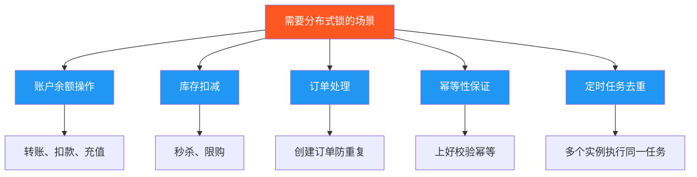

# 分布式锁业务场景分析

## 1. 概述

分布式锁是为了解决**分布式系统中多个进程/线程同时访问共享资源**的互斥问题。但并非所有场景都需要使用分布式锁，需要根据实际需求进行权衡。

根据 [Redis 官方文档](https://redis.io/docs/latest/develop/clients/patterns/distributed-locks/)，分布式锁应满足以下三个核心属性：

1. **安全性（Safety）**：互斥性，任何时候只有一个客户端能持有锁
2. **活跃性A（Liveness A）**：死锁释放，即使客户端崩溃，锁最终也会被释放
3. **活跃性B（Liveness B）**：容错性，只要大多数 Redis 节点正常运行，客户端就能获取和释放锁

## 2. 什么时候 **需要** 分布式锁？

### 2.1 需要强一致性的场景



#### ✅ 典型业务场景

1. **账户余额操作**
   ```
   问题：并发扣款导致余额不正确
   场景：用户同时发起多笔支付请求
   解决：使用分布式锁保证扣款操作的原子性
   ```

2. **库存扣减**
   ```
   问题：超卖（库存被减到负数）
   场景：秒杀活动、限时抢购
   解决：使用分布式锁串行化库存扣减
   ```

3. **订单防重复创建**
   ```
   问题：用户多次点击提交订单，创建多个订单
   场景：提交订单按钮被连续点击
   解决：使用订单ID作为锁key，保证同一订单只被创建一次
   ```

4. **定时任务去重**
   ```
   问题：多个应用实例同时执行同一个定时任务
   场景：分布式部署的定时任务（如数据同步）
   解决：使用分布式锁确保只有一个实例执行任务
   ```

5. **幂等性保证**
   ```
   问题：接口被重复调用导致重复处理
   场景：网络重试、用户重复操作
   解决：使用请求ID作为锁key
   ```

### 2.2 核心特征

如果需要分布式锁，你的场景通常具有以下特征：

- ✅ **需要强一致性**：不允许数据出现短暂不一致
- ✅ **有并发冲突**：多个线程/进程会同时修改同一个资源
- ✅ **业务不可逆**：出错后很难修复或影响财务
- ✅ **需要串行执行**：同一资源的操作必须顺序执行

## 3. 什么时候 **不需要** 分布式锁？

### 3.1 可以通过其他方案解决的场景

```mermaid
graph TD
    A[不需要分布式锁的场景] --> B[Redis原子操作]
    A --> C[数据库唯一约束]
    A --> D[乐观锁]
    A --> E[最终一致性]
    A --> F[消息队列]
    
    B --> B1[INCR、HINCRBY等]
    C --> C1[UNIQUE KEY]
    D --> D1[版本号机制]
    E --> E1[双删策略]
    F --> F1[异步处理]
    
    style A fill:#4CAF50,color:#fff
    style B fill:#9C27B0,color:#fff
    style C fill:#9C27B0,color:#fff
    style D fill:#9C27B0,color:#fff
    style E fill:#9C27B0,color:#fff
    style F也有一些场景不需要。例如:9C27B0,color:#fff
```

#### ❌ 典型不需要的场景

1. **使用 Redis 原子操作替代**
   ```python
   # ❌ 不必要：使用分布式锁实现计数器
   with distributed_lock("counter"):
       count = redis.get("counter")
       redis.set("counter", count + 1)
   
   # ✅ 推荐：使用原子操作
   redis.incr("counter")
   ```

2. **使用数据库唯一约束**
   ```python
   # ❌ 不必要：使用锁防止重复创建
   with distributed_lock(f"user_{user_id}"):
       if not exists_user(user_id):
           create_user(user_id)
   
   # ✅ 推荐：数据库唯一约束
   try:
       create_user(user_id)
   except DuplicateKeyError:
       pass  # 已存在，忽略
   ```

3. **缓存读写（允许短暂不一致）**
   ```python
   # ❌ 过度设计：为缓存操作加锁
   with distributed_lock(f"data_{key}"):
       data = db.query(key)
       redis.set(f"cache_{key}", data)
   
   # ✅ 推荐：双删策略或接受最终一致性
   redis.delete(f"cache_{key}")
   db.update(key, value)
   sleep(0.5)
   redis.delete(f"cache_{key}")
   ```

4. **只读操作**
   ```python
   # ❌ 完全没必要
   with distributed_lock(f"read_{key}"):
       data = cache.get(key)
   
   # ✅ 直接读取即可
   data = cache.get(key)
   ```

### 3.2 性能权衡

**分布式锁的成本：**

| 成本类型 | 影响 | 说明 |
|---------|------|------|
| 性能开销 | ⚠️ 高 | 锁竞争会导致请求等待，增加延迟 |
| 复杂度 | ⚠️ 中 | 需要处理超时、死锁、锁续期等问题 |
| 可用性 | ⚠️ 中 | Redis 故障会导致锁不可用 |
| 维护成本 | ⚠️ 中 | 需要监控锁的获取、释放、死锁等情况 |

## 4. 你代码的潜在问题

### 4.1 代码分析

```python
class DistributedLock:
    def __init__(self, name, expire=60, sleep=1, blocking=False, ...):
        # 问题1: 锁命名为 "lock:{name}"
        self.lock_name = f"lock:{name}"
        
    def __enter__(self):
        # 问题2: 在 __enter__ 中才尝试获取锁
        if self.lock.acquire():
            return self
        raise LockError(...)
```

### 4.2 关键问题

#### 问题 1: 不是标准的 Redlock 实现

你的代码使用了 `redis.lock.Lock` 类，这是基于**单 Redis 实例**的实现，**不具备容错性**。

```python
# 当前实现：单实例
lock = Lock(redis_client, "lock_name")

# 容错实现：Redlock（需要多个 Redis 实例）
redlock = Redlock([
    {"host": "localhost", "port": 6379, "db": 0},
    {"host": "localhost", "port": 6380, "db": 0},
    {"host": "localhost", "port": 6381, "db": 0},
])
```

**影响：** 如果 Redis 主节点故障，可能导致锁失效或死锁。

#### 问题 2: 缺少锁续期机制

```python
# 没有 lock.extend() 调用
def __enter__(self):
    if self.lock.acquire():
        # 如果业务执行时间 > expire，锁会过期
        # 其他进程可能获取到锁
        return self
```

**影响：** 如果业务处理时间超过 `expire` 时间，锁可能提前释放。

**解决：** 实现锁续期
```python
def __enter__(self):
    if self.lock.acquire():
        # 启动续期任务
        self.start_renewal_task()
        return self

def start_renewal_task(self):
    def renew():
        while self.lock.owned():
            time.sleep(self.expire / 3)  # 每隔 1/3 时间续期
            self.lock.extend(additional_time=self.expire)
    
    threading.Thread(target=renew, daemon=True).start()
```

#### 问题 3: 没有处理时钟漂移

根据 Redis 官方文档的警告：

> Redis 不使用单调时钟来实现 TTL 过期机制。时钟漂移可能导致多个进程同时获取锁。

**解决：** 使用 `time.monotonic()` 而不是 `time.time()`

#### 问题 4: 缺少 Fencing Token

官方文档建议实现 **Fencing Token（栅栏令牌）**：

```python
class OptimizedDistributedLock:
    def acquire(self):
        token = self.lock.acquire()
        # 记录当前 token
        if token:
            self.fencing_token = int(time.time() * 1000)
        return token
    
    def perform_critical_operation(self):
        # 在关键操作中使用 fencing_token
        db.execute(
            "UPDATE account SET balance = balance - 100 WHERE id = ? AND version = ?",
            params=(self.fencing_token, ...)
        )
```

### 4.3 改进建议

#### 方案 1: 对于容错要求不高的场景

```python
import time
from redis.lock import Lock
from redis.exceptions import LockError

class ImprovedDistributedLock:
    def __init__(self, name, expire=60, sleep=1, 
                 blocking=False, blocking_timeout=None, client=None, debug=False):
        self.lock_name = f"lock:{name}"
        self.sleep = sleep
        self.client = client
        self.debug = debug
        self.expire = expire
        
        self.lock = Lock(
            self.client,
            self.lock_name,
            timeout=expire,
            sleep=self.sleep,
            blocking=blocking,
            blocking_timeout=blocking_timeout,
        )
        
        # 添加续期线程
        self._renewal_thread = None
        self._should_renew = False
    
    def __enter__(self):
        start_time = time.monotonic()  # 使用单调时钟
        if self.lock.acquire():
            self.log(f"Lock acquired: {self.lock_name}, token: {self.lock.token()}")
            
            # 启动续期任务
            if self.expire > 10:  # 只在锁时间较长时续期
                self._should_renew = True
                self._renewal_thread = threading.Thread(
                    target=self._renew_lock, 
                    daemon=True
                )
                self._renewal_thread.start()
            
            return self
        
        # 锁获取失败
        elapsed = time.monotonic() - start_time
        lock_token = self.lock.lock_token()
        raise LockError(
            f"Failed to acquire lock {self.lock_name} "
            f"after {elapsed:.2f}s, existing_token: {lock_token}"
        )
    
    def __exit__(self, exc_type, exc_value, traceback):
        self._should_renew = False
        
        # 等待续期线程结束
        if self._renewal_thread:
            self._renewal_thread.join(timeout=1)
        
        token = self.lock.token()
        released = self.lock.release()
        self.log(f"Lock released: {self.lock_name}, token: {token}, success: {released}")
    
    def _renew_lock(self):
        """锁续期"""
        renew_interval = max(self.expire / 3, 1.0)
        while self._should_renew:
            time.sleep(renew_interval)
            if self._should_renew and self.lock.owned():
                self.lock.extend(additional_time=self.expire)
                self.log(f"Lock renewed: {self.lock_name}")
    
    def log(self, msg):
        if self.debug:
            logger.info(msg)
```

#### 方案 2: 对于容错要求高的场景

使用 Redlock 实现（Python 的 `redlock-py` 库）：

```python
from redlock import RedLock

class FaultTolerantDistributedLock:
    def __init__(self, name, servers, ttl=60000, retry_delay=200):
        self.lock_name = f"lock:{name}"
        self.redlock = RedLock(
            servers,  # 多个 Redis 实例配置
            ttl=ttl,  # 锁的 TTL（毫秒）
            retry_delay=retry_delay
        )
    
    def __enter__(self):
        lock = self.redlock.acquire(self.lock_name)
        if not lock:
            raise LockError(f"Failed to acquire lock {self.lock_name}")
        self._lock = lock
        return self
    
    def __exit__(self, exc_type, exc_value, traceback):
        self.redlock.release(self._lock)
```

## 5. 业务场景判断决策树

```mermaid
actors:
sequenceDiagram
    participant A as 业务需求分析
    participant B as 判断是否需要锁
    
    Note over A,B: 场景判断决策流程
    
    A->>B: 有多个进程/线程同时访问？
    alt 是
        B->>A: 使用 Redis 原子操作可以吗？
        alt 可以
            A->>B: 使用 INCR/HINCRBY 等
        else 不可以
            B->>A: 需要强一致性吗？
            alt 是
                A->>B: 使用分布式锁（Redlock）
            else 否
                B->>A: 使用最终一致性方案（双删、消息队列）
            end
        end
    else 否
        A->>B: 不需要锁，直接操作
    end
```

## 6. 实际案例分析

### 案例 1: 库存扣减（需要分布式锁）

```python
# ✅ 需要分布式锁
class InventoryService:
    def decrement_stock(self, product_id, quantity):
        lock_name = f"product_{product_id}"
        with DistributedLock(lock_name, expire=30, blocking=True, blocking_timeout=5):
            stock = self.get_stock(product_id)
            if stock < quantity:
                raise InsufficientStockError()
            self.update_stock(product_id, stock - quantity)
```

**原因：** 超卖会导致严重的业务问题，必须保证强一致性。

### 案例 2: 计数器（不需要分布式锁）

```python
# ❌ 不需要分布式锁
def increment_counter(key):
    # 直接使用原子操作
    return redis.incr(f"counter:{key}")

# 同样不需要锁的场景
redis.hincrby("user", "view_count", 1)
redis.zincrby("leaderboard", "user1", 1)
redis.sadd("unique_users", user_id)
```

**原因：** Redis 原子操作已经保证了并发安全。

### 案例 3: 缓存更新（不需要分布式锁）

```python
# ❌ 通常不需要分布式锁
class CacheService:
    def update_cache(self, key, data):
        # 方案 1: 直接更新（接受最终一致性）
        redis.set(f"cache:{key}", data, ex=3600)
        
        # 方案 2: 双删策略（已在文档中说明）
        redis.delete(f"cache:{key}")
        db.update(key, data)
        time.sleep(0.5)
        redis.delete(f"cache:{key}")
```

**原因：** 缓存通常只需要最终一致性，加锁会严重影响性能。

### 案例 4: 定时任务去重（需要分布式锁）

```python
# ✅ 需要分布式锁
class ScheduledTask:
    def sync_data(self):
        lock_name = "task:sync_data"
        
        # 尝试获取锁，不阻塞
        try:
            with DistributedLock(lock_name, expire=300, blocking=False):
                self.perform_sync()
        except LockError:
            print("Task is already running on another instance")
            return
```

**原因：** 多个实例部署时，需要确保同一任务只执行一次。

## 7. 总结建议

### 7.1 决策原则

| 场景特征 | 是否使用分布式锁 |
|---------|----------------|
| 需要强一致性 + 有并发 | ✅ **必须使用** |
| 数据出错影响财务 | ✅ **必须使用** |
| 可以使用 Redis 原子操作 | ❌ **不需要** |
| 只需要最终一致性 | ❌ **不需要** |
| 读多写少的高并发场景 | ❌ **谨慎使用** |

### 7.2 实施建议

1. **优先考虑简单方案**
   - 能用 Redis 原子操作就用原子操作
   - 能用数据库约束就用约束
   - 能用乐观锁就用乐观锁

2. **确需锁时注意**
   - 选择合适的锁粒度（按 key 锁定）
   - 设置合理的过期时间
   - 实现锁续期机制
   - 处理异常和超时情况
   - 添加监控和日志

3. **性能优化**
   - 减少锁持有时间
   - 使用 `blocking=False` 快速失败
   - 使用 Redis Pipeline 减少网络往返
   - 考虑使用本地锁（如果只有一个进程）

### 7.3 最佳实践清单

- [ ] 使用 Redlock 实现多实例容错（生产环境推荐）
- [ ] 实现锁续期机制（长任务场景）
- [ ] 记录 Fencing Token（关键业务）
- [ ] 使用单调时钟（避免时钟漂移）
- [ ] 添加详细的日志和监控
- [ ] 设置合理的超时和重试策略
- [ ] 处理锁释放失败的情况
- [ ] 考虑锁降级策略（锁不可用时的处理）

---

**参考文档：**
- [Redis 官方分布式锁文档](https://redis.io/docs/latest/develop/clients/patterns/distributed-locks/)
- 项目内文档：`redis_consistency_key_points.md`

