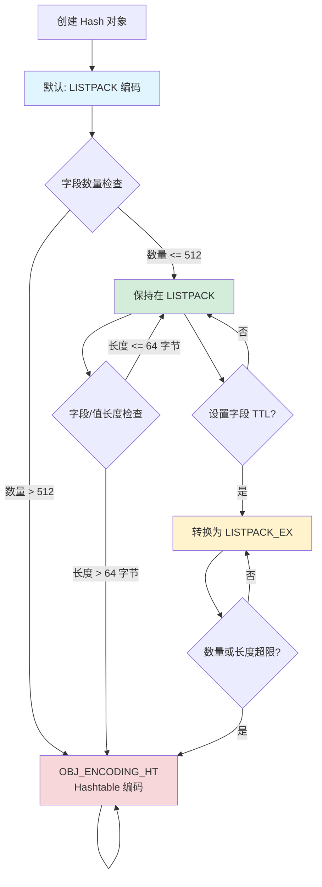
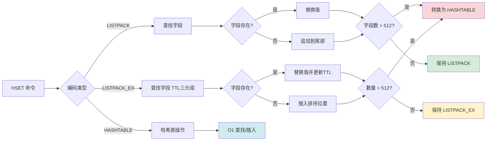
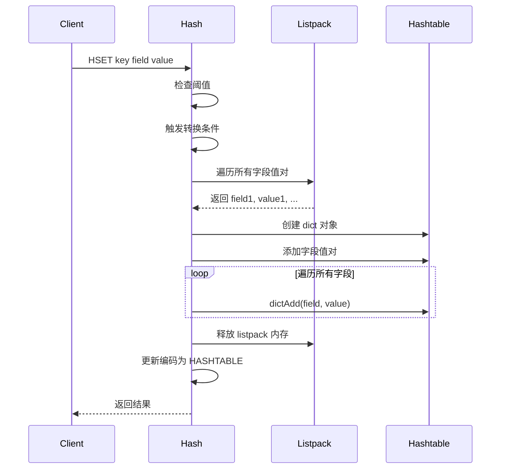
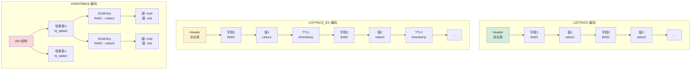
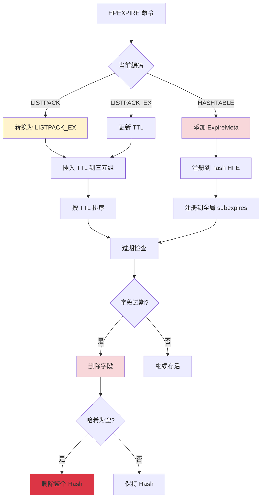
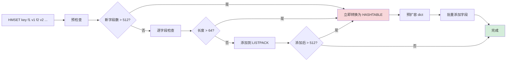
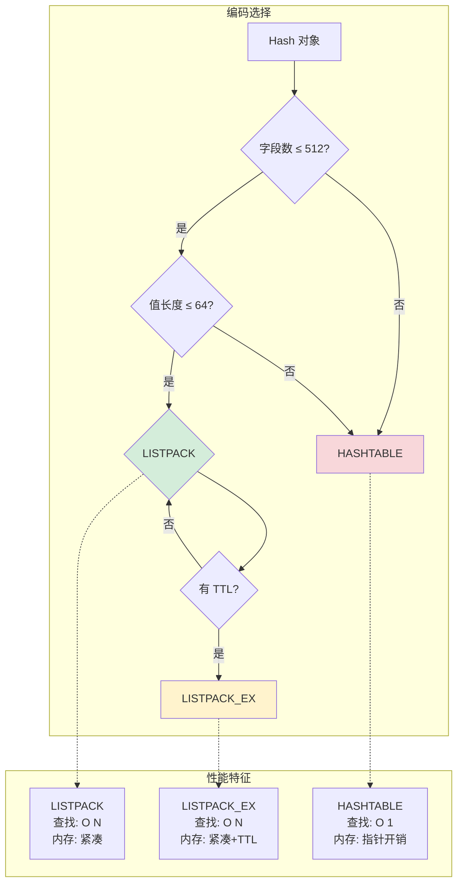

## Redis Hash 编码转换流程图

### Hash 对象编码生命周期

```mermaid
graph TD
    A[创建 Hash 对象] --> B[默认: LISTPACK 编码]
    B --> C{字段数量检查}
    C -->|数量 <= 512| D[保持在 LISTPACK]
    C -->|数量 > 512| E[转换为 HASHTABLE]
    
    D --> F{字段/值长度检查}
    F -->|长度 <= 64 字节| D
    F -->|长度 > 64 字节| E
    
    D --> G{设置字段 TTL?}
    G -->|是| H[转换为 LISTPACK_EX]
    G -->|否| D
    
    H --> I{数量或长度超限?}
    I -->|是| E
    I -->|否| H
    
    E[OBJ_ENCODING_HT<br/>Hashtable 编码] --> E
    
    style B fill:#e1f5ff
    style D fill:#d4edda
    style H fill:#fff3cd
    style E fill:#f8d7da
```

### Listpack 操作流程

```mermaid
graph LR
    A[HSET 命令] --> B{编码类型}
    B -->|LISTPACK| C[查找字段]
    C --> D{字段存在?}
    D -->|是| E[替换值]
    D -->|否| F[追加到尾部]
    E --> G{字段数 > 512?}
    F --> G
    G -->|是| H[转换为 HASHTABLE]
    G -->|否| I[保持 LISTPACK]
    
    B -->|LISTPACK_EX| J[查找字段 TTL三元组]
    J --> K{字段存在?}
    K -->|是| L[替换值并更新TTL]
    K -->|否| M[插入排序位置]
    L --> N{数量 > 512?}
    M --> N
    N -->|是| H
    N -->|否| O[保持 LISTPACK_EX]
    
    B -->|HASHTABLE| P[哈希表操作]
    P --> Q[O1 查找/插入]
    
    style H fill:#f8d7da
    style I fill:#d4edda
    style O fill:#fff3cd
    style Q fill:#d1ecf1
```

### Listpack → Hashtable 转换过程

```mermaid
sequenceDiagram
    participant Client
    participant Hash
    participant Listpack
    participant Hashtable
    
    Client->>Hash: HSET key field value
    Hash->>Hash: 检查阈值
    Hash->>Hash: 触发转换条件
    
    Hash->>Listpack: 遍历所有字段值对
    Listpack-->>Hash: 返回 field1, value1, ...
    
    Hash->>Hashtable: 创建 dict 对象
    Hash->>Hashtable: 添加字段值对
    
    loop 遍历所有字段
        Hash->>Hashtable: dictAdd(field, value)
    end
    
    Hash->>Listpack: 释放 listpack 内存
    Hash->>Hash: 更新编码为 HASHTABLE
    
    Hash-->>Client: 返回结果
```

### 内存布局对比

```mermaid
graph TB
    subgraph "LISTPACK 编码"
        A[Header<br/>总长度] --> B[字段1<br/>field1]
        B --> C[值1<br/>value1]
        C --> D[字段2<br/>field2]
        D --> E[值2<br/>value2]
        E --> F[...]
    end
    
    subgraph "LISTPACK_EX 编码"
        G[Header<br/>总长度] --> H[字段1<br/>field1]
        H --> I[值1<br/>value1]
        I --> J[TTL1<br/>timestamp]
        J --> K[字段2<br/>field2]
        K --> L[值2<br/>value2]
        L --> M[TTL2<br/>timestamp]
        M --> N[...]
    end
    
    subgraph "HASHTABLE 编码"
        O[dict 结构] --> P[哈希表0<br/>ht_table0]
        O --> Q[哈希表1<br/>ht_table1]
        P --> R[DictEntry<br/>field1→value1]
        P --> S[DictEntry<br/>field2→value2]
        R --> T[键: mstr<br/>值: sds]
        S --> U[键: mstr<br/>值: sds]
    end
    
    style A fill:#d4edda
    style G fill:#fff3cd
    style O fill:#f8d7da
```

### 字段过期处理流程

```mermaid
graph TD
    A[HPEXPIRE 命令] --> B{当前编码}
    B -->|LISTPACK| C[转换为 LISTPACK_EX]
    B -->|LISTPACK_EX| D[更新 TTL]
    B -->|HASHTABLE| E[添加 ExpireMeta]
    
    C --> F[插入 TTL 到三元组]
    D --> F
    E --> G[注册到 hash HFE]
    
    F --> H[按 TTL 排序]
    G --> I[注册到全局 subexpires]
    
    H --> J[过期检查]
    I --> J
    
    J --> K{字段过期?}
    K -->|是| L[删除字段]
    K -->|否| M[继续存活]
    
    L --> N{哈希为空?}
    N -->|是| O[删除整个 Hash]
    N -->|否| P[保持 Hash]
    
    style C fill:#fff3cd
    style E fill:#f8d7da
    style L fill:#f8d7da
    style O fill:#dc3545
```

### HMSET 批量设置优化

```mermaid
graph LR
    A[HMSET key f1 v1 f2 v2 ...] --> B[预检查]
    B --> C{新字段数 > 512?}
    C -->|是| D[立即转换为 HASHTABLE]
    C -->|否| E[逐字段检查]
    
    D --> F[预扩容 dict]
    F --> G[批量添加字段]
    
    E --> H{长度 > 64?}
    H -->|是| D
    H -->|否| I[添加到 LISTPACK]
    
    I --> J{添加后 > 512?}
    J -->|是| D
    J -->|否| K[完成]
    
    G --> K
    
    style D fill:#f8d7da
    style K fill:#d4edda
```

### 三种编码对比

```mermaid
graph TB
    subgraph "编码选择"
        A[Hash 对象] --> B{字段数 ≤ 512?}
        B -->|是| C{值长度 ≤ 64?}
        B -->|否| F[HASHTABLE]
        C -->|是| D{LISTPACK}
        C -->|否| F
        D --> E{有 TTL?}
        E -->|是| G[LISTPACK_EX]
        E -->|否| D
    end
    
    subgraph "性能特征"
        H[LISTPACK<br/>查找: O N<br/>内存: 紧凑]
        I[LISTPACK_EX<br/>查找: O N<br/>内存: 紧凑+TTL]
        J[HASHTABLE<br/>查找: O 1<br/>内存: 指针开销]
    end
    
    D -.-> H
    G -.-> I
    F -.-> J
    
    style D fill:#d4edda
    style G fill:#fff3cd
    style F fill:#f8d7da
```

