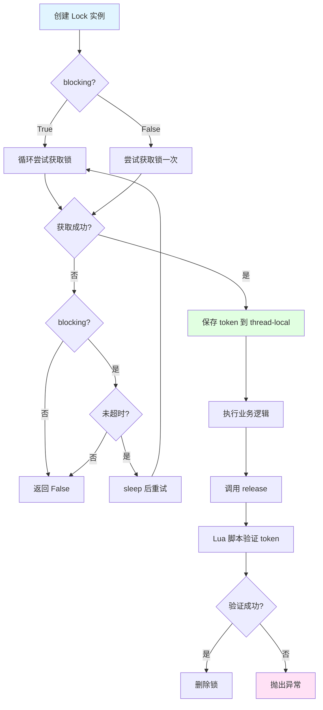
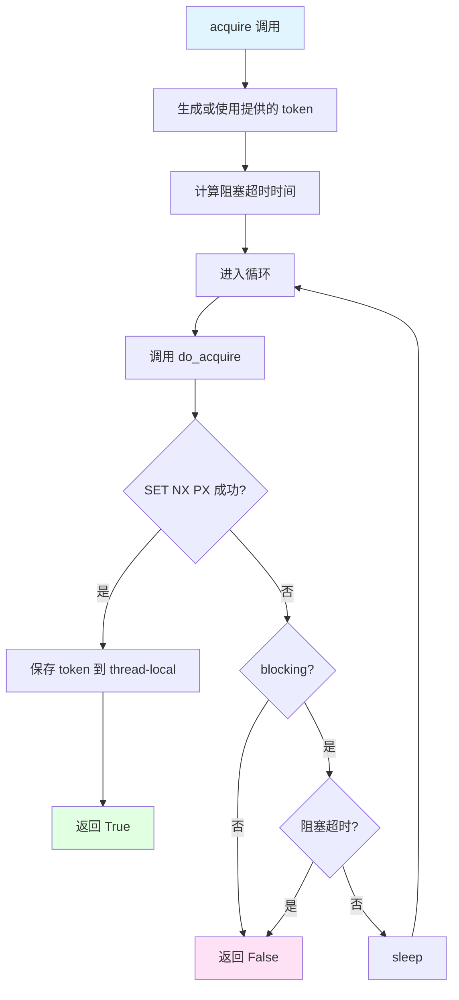
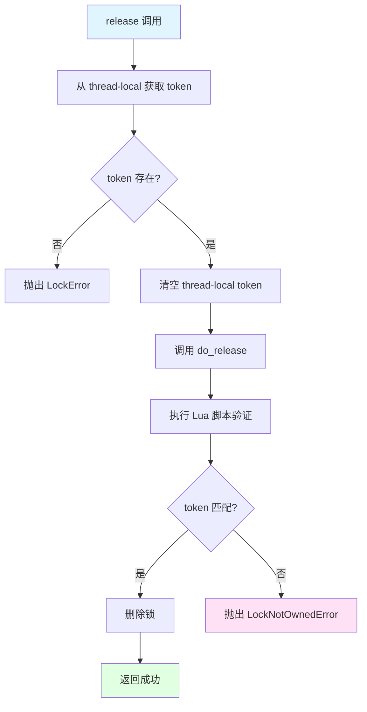
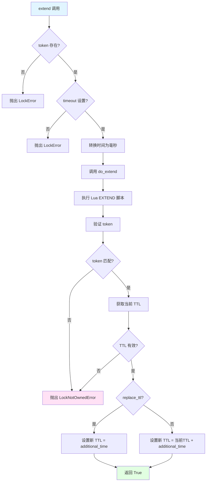

# redis-py Lock 实现：源码分析与设计文档

## 目录

**第一部分：理解概念（是什么、为什么）**
- [一、概述](#一概述)
- [二、核心设计理念](#二核心设计理念)
- [三、Lua 脚本设计分析](#三lua-脚本设计分析)
- [四、使用场景与限制](#四使用场景与限制)

**第二部分：理解使用（怎么用）**
- [五、API 设计和使用流程](#五api-设计和使用流程)
- [六、关键方法实现流程](#六关键方法实现流程)
- [七、完整使用示例](#七完整使用示例)

**第三部分：深入实现（如何实现）**
- [八、核心方法源码分析](#八核心方法源码分析)
- [九、设计模式和技巧](#九设计模式和技巧)
- [十、与 rueidis 对比](#十与-rueidis-对比)
- [十一、总结](#十一总结)

---

## 一、概述

redis-py 的 `Lock` 类是 Redis 官方 Python 客户端中实现的分布式锁，提供了基于 Redis 的线程安全、进程安全的分布式锁功能。

### 核心特点

- **原子性保证**：使用 Lua 脚本确保获取、释放、延长锁的原子性
- **唯一标识机制**：使用 UUID 作为锁的唯一标识，防止误释放
- **线程本地存储**：支持 thread-local 存储 token，避免多线程冲突
- **阻塞和非阻塞模式**：支持阻塞式获取锁和立即返回两种模式
- **锁续期机制**：支持延长锁的过期时间（extend）和重置过期时间（reacquire）
- **上下文管理器**：支持 Python 的 `with` 语句，自动管理锁的生命周期
- **脚本缓存优化**：使用类级别的脚本注册，避免重复加载脚本

### 在系统中的作用

`Lock` 类用于在分布式系统中实现资源互斥访问，确保同一时间只有一个进程或线程能够访问共享资源。

---

## 二、核心设计理念

### 2.1 安全性设计

#### 2.1.1 唯一标识（Token）机制

每个锁实例使用 UUID 作为唯一标识（token），确保只有持有锁的客户端才能释放锁。

```python
# 生成唯一标识
token = uuid.uuid1().hex.encode()
```

**设计原理：**
- 使用 UUID 保证全局唯一性
- 锁的值存储 token，而不是简单的标识
- 释放锁时验证 token 是否匹配

#### 2.1.2 原子性保证

所有关键操作都使用 Lua 脚本实现，保证原子性：

1. **获取锁**：使用 `SET NX PX` 单命令原子操作
2. **释放锁**：Lua 脚本验证 token 后删除
3. **延长锁**：Lua 脚本验证 token 后更新过期时间

### 2.2 线程安全设计

#### 2.2.1 Thread-Local 存储

```python
self.thread_local = bool(thread_local)
self.local = threading.local() if self.thread_local else SimpleNamespace()
self.local.token = None
```

**设计原理：**
- 默认使用 thread-local 存储 token
- 防止多线程共享同一个 Lock 实例时的冲突
- 支持禁用 thread-local（用于跨线程传递锁的场景）

**为什么需要 thread-local？**

考虑以下场景：
```
时间线：
T1: 线程1获取锁，token = "abc"
T2: 线程2尝试获取锁（阻塞）
T5: 锁过期，线程2获取锁，token = "xyz"
T6: 线程1释放锁
    - 如果没有 thread-local：线程1会看到 token = "xyz"，误释放线程2的锁
    - 使用 thread-local：线程1只能看到自己的 token = "abc"，无法释放线程2的锁
```

### 2.3 性能优化设计

#### 2.3.1 脚本缓存

```python
lua_release = None  # 类级别变量
lua_extend = None
lua_reacquire = None

def register_scripts(self) -> None:
    cls = self.__class__
    client = self.redis
    if cls.lua_release is None:
        cls.lua_release = client.register_script(cls.LUA_RELEASE_SCRIPT)
```

**优化原理：**
- 使用类级别变量缓存脚本
- 使用 `register_script` 注册脚本，后续使用 SHA 执行
- 避免每次实例化都重新加载脚本

#### 2.3.2 SET NX PX 单命令

```python
def do_acquire(self, token: str) -> bool:
    if self.timeout:
        timeout = int(self.timeout * 1000)
    else:
        timeout = None
    if self.redis.set(self.name, token, nx=True, px=timeout):
        return True
    return False
```

**优化原理：**
- 使用 Redis 2.6.12+ 的 `SET NX PX` 单命令
- 不需要 Lua 脚本（SET NX PX 已经是原子操作）
- 减少脚本执行开销

---

## 三、Lua 脚本设计分析

### 3.1 释放锁脚本（LUA_RELEASE_SCRIPT）

```python
LUA_RELEASE_SCRIPT = """
    local token = redis.call('get', KEYS[1])
    if not token or token ~= ARGV[1] then
        return 0
    end
    redis.call('del', KEYS[1])
    return 1
"""
```

**参数说明：**
- `KEYS[1]`: 锁的键名
- `ARGV[1]`: 期望的 token 值

**执行流程：**
1. 获取当前锁的 token
2. 验证 token 是否存在且与期望值匹配
3. 如果匹配，删除锁并返回 1
4. 如果不匹配或不存在，返回 0

**安全性：**
- ✅ 验证锁的所有者
- ✅ 原子性操作
- ✅ 防止误释放别人的锁

### 3.2 延长锁脚本（LUA_EXTEND_SCRIPT）

```python
LUA_EXTEND_SCRIPT = """
    local token = redis.call('get', KEYS[1])
    if not token or token ~= ARGV[1] then
        return 0
    end
    local expiration = redis.call('pttl', KEYS[1])
    if not expiration then
        expiration = 0
    end
    if expiration < 0 then
        return 0
    end

    local newttl = ARGV[2]
    if ARGV[3] == "0" then
        newttl = ARGV[2] + expiration
    end
    redis.call('pexpire', KEYS[1], newttl)
    return 1
"""
```

**参数说明：**
- `KEYS[1]`: 锁的键名
- `ARGV[1]`: token 值
- `ARGV[2]`: 额外时间（毫秒）
- `ARGV[3]`: "0" 表示累加，非 "0" 表示替换

**执行流程：**
1. 验证 token 是否匹配
2. 获取当前锁的剩余时间（PTTL）
3. 检查剩余时间是否有效（>= 0）
4. 根据 `replace_ttl` 参数决定是累加还是替换过期时间
5. 设置新的过期时间

**两种模式：**
- **累加模式** (`replace_ttl=False`): `新TTL = 当前TTL + 额外时间`
- **替换模式** (`replace_ttl=True`): `新TTL = 额外时间`

### 3.3 重新获取锁脚本（LUA_REACQUIRE_SCRIPT）

```python
LUA_REACQUIRE_SCRIPT = """
    local token = redis.call('get', KEYS[1])
    if not token or token ~= ARGV[1] then
        return 0
    end
    redis.call('pexpire', KEYS[1], ARGV[2])
    return 1
"""
```

**参数说明：**
- `KEYS[1]`: 锁的键名
- `ARGV[1]`: token 值
- `ARGV[2]`: 新的过期时间（毫秒）

**执行流程：**
1. 验证 token 是否匹配
2. 重置锁的过期时间为初始值

**使用场景：**
- 长时间运行的任务需要定期重置锁的过期时间
- 相比 `extend`，`reacquire` 总是重置为初始 timeout 值

---

## 四、使用场景与限制

### 4.1 适用场景

#### 4.1.1 基础场景

1. **单进程多线程锁**：同一进程内多个线程互斥访问
2. **多进程分布式锁**：跨进程的分布式锁
3. **资源保护**：保护共享资源，防止并发修改

#### 4.1.2 高级场景

1. **长任务锁续期**：使用 `extend()` 或 `reacquire()` 延长锁时间
2. **定时任务去重**：使用 `blocking=False` 实现非阻塞锁
3. **上下文管理**：使用 `with` 语句自动管理锁生命周期

### 4.2 性能特点

| 操作 | 时间复杂度 | 说明 |
|------|-----------|------|
| `acquire()` | O(1) | SET NX PX 单命令 |
| `release()` | O(1) | Lua 脚本执行 |
| `extend()` | O(1) | Lua 脚本执行 |
| `reacquire()` | O(1) | Lua 脚本执行 |
| `locked()` | O(1) | GET 命令 |
| `owned()` | O(1) | GET + 本地比较 |

### 4.3 限制和注意事项

#### 4.3.1 单实例限制

- **不支持多 Redis 实例**：这是单 Redis 实例的实现
- **不支持 Redlock**：容错性有限
- **Redis 故障影响**：Redis 故障会导致锁不可用

#### 4.3.2 时钟漂移问题

根据 Redis 官方文档警告：
> Redis 不使用单调时钟实现 TTL 过期机制。时钟漂移可能导致多个进程同时获取锁。

**建议：** 使用 `time.monotonic()` 而不是 `time.time()`

#### 4.3.3 线程安全考虑

- **默认 thread-local**：默认使用 thread-local 存储 token
- **跨线程传递**：如果需要在不同线程间传递锁，需要设置 `thread_local=False`
- **锁实例共享**：多个线程共享同一个 Lock 实例需要谨慎

---

## 五、API 设计和使用流程

### 5.1 构造函数参数

```python
def __init__(
    self,
    redis,                              # Redis 客户端实例
    name: str,                          # 锁的名称（键名）
    timeout: Optional[Number] = None,  # 锁的过期时间（秒），None 表示不过期
    sleep: Number = 0.1,                # 阻塞模式下的重试间隔（秒）
    blocking: bool = True,               # 是否阻塞获取锁
    blocking_timeout: Optional[Number] = None,  # 阻塞超时时间（秒）
    thread_local: bool = True,          # 是否使用 thread-local 存储 token
    raise_on_release_error: bool = True,  # 上下文退出时是否抛出异常
):
```

### 5.2 核心方法

| 方法 | 功能 | 返回值 |
|------|------|--------|
| `acquire()` | 获取锁 | `bool` |
| `release()` | 释放锁 | `None`（抛出异常） |
| `extend(additional_time, replace_ttl=False)` | 延长锁时间 | `bool` |
| `reacquire()` | 重置锁过期时间 | `bool` |
| `locked()` | 检查锁是否被占用（任意进程） | `bool` |
| `owned()` | 检查锁是否被当前实例持有 | `bool` |

### 5.3 使用流程图



---

## 六、关键方法实现流程

### 6.1 acquire() 方法流程



### 6.2 release() 方法流程



### 6.3 extend() 方法流程



---

## 七、完整使用示例

### 7.1 基础使用

```python
import redis
from redis.lock import Lock

# 创建 Redis 客户端
r = redis.Redis(host='localhost', port=6379, db=0)

# 创建锁实例
lock = Lock(r, "my_lock", timeout=10)

# 方式 1: 手动获取和释放
if lock.acquire():
    try:
        # 执行业务逻辑
        print("执行业务逻辑")
    finally:
        lock.release()

# 方式 2: 使用上下文管理器（推荐）
with Lock(r, "my_lock", timeout=10):
    # 执行业务逻辑
    print("执行业务逻辑")
    # 自动释放锁
```

### 7.2 非阻塞模式

```python
# 非阻塞获取锁
lock = Lock(r, "my_lock", timeout=10, blocking=False)
if lock.acquire():
    try:
        # 执行业务逻辑
        pass
    finally:
        lock.release()
else:
    print("获取锁失败")
```

### 7.3 阻塞模式（带超时）

```python
# 阻塞获取锁，最多等待 5 秒
lock = Lock(r, "my_lock", timeout=10, blocking=True, blocking_timeout=5)
if lock.acquire():
    try:
        # 执行业务逻辑
        pass
    finally:
        lock.release()
```

### 7.4 锁续期

```python
lock = Lock(r, "my_lock", timeout=10)

if lock.acquire():
    try:
        # 执行长时间任务
        for i in range(100):
            # 每 3 秒续期一次
            if i % 30 == 0:
                lock.extend(additional_time=10)  # 延长 10 秒
            # 执行业务逻辑
            time.sleep(0.1)
    finally:
        lock.release()
```

### 7.5 检查锁状态

```python
lock = Lock(r, "my_lock", timeout=10)

if lock.acquire():
    # 检查锁是否被占用（任意进程）
    if lock.locked():
        print("锁被占用")
    
    # 检查锁是否被当前实例持有
    if lock.owned():
        print("锁被我持有")
    
    lock.release()
```

---

## 八、核心方法源码分析

### 8.1 do_acquire() 方法

```python
def do_acquire(self, token: str) -> bool:
    if self.timeout:
        timeout = int(self.timeout * 1000)  # 转换为毫秒
    else:
        timeout = None
    if self.redis.set(self.name, token, nx=True, px=timeout):
        return True
    return False
```

**功能：** 尝试获取锁的核心逻辑

**实现原理：**
1. 将秒级 timeout 转换为毫秒
2. 使用 `SET NX PX` 命令原子性地设置锁
3. 如果成功（键不存在），返回 True
4. 如果失败（键已存在），返回 False

**要点：**
- 使用 Redis 2.6.12+ 的 `SET NX PX` 单命令
- 不需要 Lua 脚本（SET NX PX 已经是原子操作）
- 性能最优的实现方式

### 8.2 do_release() 方法

```python
def do_release(self, expected_token: str) -> None:
    if not bool(
        self.lua_release(keys=[self.name], args=[expected_token], client=self.redis)
    ):
        raise LockNotOwnedError(
            "Cannot release a lock that's no longer owned",
            lock_name=self.name,
        )
```

**功能：** 释放锁的核心逻辑

**实现原理：**
1. 调用缓存的 Lua 脚本 `lua_release`
2. 传入锁的键名和期望的 token
3. 脚本验证 token 匹配后删除锁
4. 如果验证失败，抛出异常

**要点：**
- 使用缓存的脚本（EVALSHA），避免重复加载
- 验证失败时抛出明确的异常
- 确保只有锁的所有者才能释放锁

### 8.3 do_extend() 方法

```python
def do_extend(self, additional_time: Number, replace_ttl: bool) -> bool:
    additional_time = int(additional_time * 1000)  # 转换为毫秒
    if not bool(
        self.lua_extend(
            keys=[self.name],
            args=[self.local.token, additional_time, "1" if replace_ttl else "0"],
            client=self.redis,
        )
    ):
        raise LockNotOwnedError(
            "Cannot extend a lock that's no longer owned",
            lock_name=self.name,
        )
    return True
```

**功能：** 延长锁过期时间的核心逻辑

**实现原理：**
1. 将秒级时间转换为毫秒
2. 调用缓存的 Lua 脚本 `lua_extend`
3. 传入 token、额外时间和替换标志
4. 脚本验证 token 后更新过期时间
5. 如果验证失败，抛出异常

**要点：**
- 支持两种模式：累加和替换
- 验证锁的所有权
- 自动处理时间转换

### 8.4 owned() 方法

```python
def owned(self) -> bool:
    stored_token = self.redis.get(self.name)
    # need to always compare bytes to bytes
    if stored_token and not isinstance(stored_token, bytes):
        encoder = self.redis.get_encoder()
        stored_token = encoder.encode(stored_token)
    return self.local.token is not None and stored_token == self.local.token
```

**功能：** 检查锁是否被当前实例持有

**实现原理：**
1. 从 Redis 获取锁的 token
2. 确保 token 是 bytes 类型（统一编码）
3. 比较本地存储的 token 和 Redis 中的 token
4. 只有两者都存在且匹配时，返回 True

**要点：**
- 处理编码问题（统一转为 bytes）
- 比较本地 token 和远程 token
- 用于判断锁的所有权

---

## 九、设计模式和技巧

### 9.1 脚本缓存模式

**模式：** 类级别变量 + 懒加载

```python
class Lock:
    lua_release = None  # 类级别变量
    
    def register_scripts(self) -> None:
        cls = self.__class__
        if cls.lua_release is None:
            cls.lua_release = client.register_script(cls.LUA_RELEASE_SCRIPT)
```

**优势：**
- 所有实例共享脚本缓存
- 避免重复加载脚本
- 提升性能

### 9.2 Thread-Local 存储模式

**模式：** 条件化 thread-local 存储

```python
self.thread_local = bool(thread_local)
self.local = threading.local() if self.thread_local else SimpleNamespace()
```

**优势：**
- 默认线程安全
- 支持跨线程传递（禁用 thread-local）
- 灵活配置

### 9.3 上下文管理器模式

**模式：** Python 上下文协议

```python
def __enter__(self) -> "Lock":
    if self.acquire():
        return self
    raise LockError(...)

def __exit__(self, exc_type, exc_value, traceback) -> None:
    try:
        self.release()
    except LockError:
        if self.raise_on_release_error:
            raise
```

**优势：**
- 自动管理锁生命周期
- 异常安全
- Pythonic 写法

### 9.4 双模式设计（阻塞/非阻塞）

**模式：** 通过参数控制行为

```python
def acquire(
    self,
    sleep: Optional[Number] = None,
    blocking: Optional[bool] = None,
    blocking_timeout: Optional[Number] = None,
):
    # 支持运行时覆盖构造函数设置
    if blocking is None:
        blocking = self.blocking
```

**优势：**
- 灵活的 API 设计
- 支持运行时调整行为
- 向后兼容

### 9.5 错误处理策略

**策略：** 明确的异常类型

```python
# 定义专门的异常类型
from redis.exceptions import LockError, LockNotOwnedError

# 不同错误使用不同异常
raise LockError("Cannot release a lock that's not owned")
raise LockNotOwnedError("Cannot release a lock that's no longer owned")
```

**优势：**
- 明确的错误类型
- 便于错误处理
- 提供上下文信息（lock_name）

---

## 十、与 rueidis 对比

### 10.1 Lua 脚本对比

| 功能 | redis-py | rueidis |
|------|----------|---------|
| **获取锁** | `SET NX PX`（单命令） | Lua 脚本 `SET NX PX` |
| **释放锁** | Lua 脚本验证 + DEL | Lua 脚本验证 + DEL |
| **延长锁** | Lua 脚本（支持累加/替换） | Lua 脚本（仅替换） |
| **重新获取** | Lua 脚本重置 TTL | 无对应功能 |

### 10.2 设计差异

| 特性 | redis-py | rueidis |
|------|----------|---------|
| **获取锁实现** | 直接使用 SET NX PX | 使用 Lua 脚本包装 |
| **脚本缓存** | 类级别缓存 | 库级别缓存 |
| **时间模式** | 仅支持相对时间 | 支持相对时间 + 绝对时间 |
| **扩展性** | 完整的高级 API | 基础 API，扩展在应用层 |
| **错误处理** | 抛出异常 | 返回错误值 |

### 10.3 功能对比

| 功能 | redis-py | rueidis |
|------|----------|---------|
| **基础获取锁** | ✅ | ✅ |
| **阻塞获取** | ✅ | 需要应用层实现 |
| **锁续期** | ✅ (extend/reacquire) | ✅ (extend) |
| **上下文管理** | ✅ (`with` 语句) | 需要应用层实现 |
| **强制获取** | ❌ | ✅ |
| **绝对时间** | ❌ | ✅ |

### 10.4 性能对比

| 操作 | redis-py | rueidis |
|------|----------|---------|
| **获取锁** | 单命令（最快） | Lua 脚本（稍慢） |
| **释放锁** | EVALSHA | EVALSHA |
| **延长锁** | EVALSHA | EVALSHA |

**结论：**
- redis-py 的获取锁性能更优（单命令）
- rueidis 提供了更多底层控制
- redis-py 提供了更高级的 API 封装

---

## 十一、总结

redis-py 的 `Lock` 实现是一个**设计精良、功能完整**的分布式锁实现，通过以下设计实现了高性能和易用性：

1. **原子性保证**：使用 Lua 脚本确保关键操作的原子性
2. **安全性设计**：使用 UUID token 机制防止误释放
3. **性能优化**：获取锁使用单命令，其他操作使用脚本缓存
4. **线程安全**：thread-local 存储避免多线程冲突
5. **易用性**：支持上下文管理器、阻塞/非阻塞模式
6. **灵活性**：支持锁续期、重新获取等多种场景

这种设计在**单 Redis 实例**场景下表现优秀，但在需要容错性的场景下，建议使用 Redlock 算法或专门的分布式锁库。

### 设计优势

- ✅ **简单易用**：清晰的 API 设计
- ✅ **性能优秀**：获取锁使用单命令
- ✅ **功能完整**：支持多种使用场景
- ✅ **线程安全**：默认 thread-local 存储
- ✅ **Pythonic**：支持上下文管理器

### 适用场景

- ✅ 单 Redis 实例的分布式锁
- ✅ 多线程/多进程资源保护
- ✅ 需要锁续期的长任务
- ✅ 定时任务去重

### 不适用场景

- ❌ 需要多 Redis 实例容错（应使用 Redlock）
- ❌ 对锁可靠性要求极高的金融场景
- ❌ Redis 故障不能接受的场景

---

**参考资源：**
- [redis-py Lock 源码](https://github.com/redis/redis-py/blob/master/redis/lock.py)
- [Redis 分布式锁官方文档](https://redis.io/docs/latest/develop/clients/patterns/distributed-locks/)

