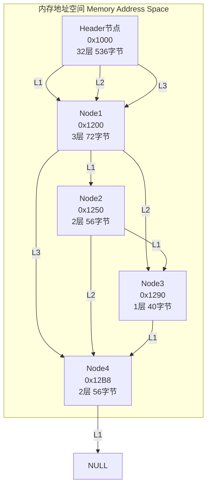

## Redis 跳跃表 (Skiplist) 设计与实现

### 概述
Redis 的跳跃表是一种基于概率的有序数据结构，用于实现有序集合（ZSET）。它在平均情况下提供 O(log N) 的时间复杂度，同时保持相对简单的实现。

### 设计目标
1. **双重索引**: `dict`（哈希表）提供 O(1) 查找 + `zskiplist`（跳跃表）提供 O(log N) 有序操作
2. **支持重复分数**: 允许多个元素拥有相同的 score
3. **排名查询**: 通过 span 机制实现 O(log N) 排名查询
4. **内存优化**: 柔性数组 + 动态层数减少内存开销

### 使用场景
- ZSET 内部实现（元素数量 > zset_max_listpack_entries）
- 需要按分数排序的集合
- 需要按排名查询的场景（ZRANK, ZRANGE）

### 文档结构
* 源码定义 - 数据结构和关键参数
* 分配与释放 - 内存管理机制
* 随机层数生成 - 概率算法和分布
* Span 机制 - 排名查询的核心
* 插入操作 - 7步插入流程详解
* 删除操作 - 节点删除和指针更新
* 查询操作 - 按排名查询和获取排名
* 范围查询操作 - 按分数和字典序查询
* 更新操作 - 分数更新优化
* ZSET 编码切换 - Listpack 和 Skiplist 转换
* 性能分析 - 时间和空间复杂度
* 与其他数据结构对比 - 选择跳跃表的原因
* 内存布局图示 - 详细的物理内存结构


## 定义

### 节点结构 (server.h:1548-1556)
```c
typedef struct zskiplistNode {
    sds ele;                              // 元素值（SDS字符串）
    double score;                         // 分数
    struct zskiplistNode *backward;       // 后向指针（L1层双向链表）
    struct zskiplistLevel {
        struct zskiplistNode *forward;    // 前向指针
        unsigned long span;               // 跨度（用于排名计算）
    } level[];                            // 柔性数组，动态层数
} zskiplistNode;
```

### 跳跃表结构 (server.h:1558-1562)
```c
typedef struct zskiplist {
    struct zskiplistNode *header, *tail;  // 头尾指针
    unsigned long length;                 // 节点数量
    int level;                            // 当前最大层数
} zskiplist;
```

### ZSET结构 (server.h:1564-1567)
```c
typedef struct zset {
    dict *dict;        // 哈希表：O(1)查找元素
    zskiplist *zsl;    // 跳跃表：O(log N)有序操作
} zset;
```

### 关键参数 (server.h:612-614)
```c
#define ZSKIPLIST_MAXLEVEL 32    // 最大层数
#define ZSKIPLIST_P 0.25         // 概率因子
#define ZSKIPLIST_MAX_SEARCH 10  // 最大搜索次数
```

## 分配与释放

### 创建节点 (t_zset.c:60-66)
```c
zskiplistNode *zslCreateNode(int level, double score, sds ele) {
    // 一次性分配：24字节（固定）+ level × 16字节（柔性数组）
    zskiplistNode *zn = zmalloc(sizeof(*zn) + level*sizeof(struct zskiplistLevel));
    zn->score = score;
    zn->ele = ele;
    return zn;
}
```

### 创建跳跃表 (t_zset.c:69-84)
```c
zskiplist *zslCreate(void) {
    zskiplist *zsl = zmalloc(sizeof(*zsl));
    zsl->level = 1;
    zsl->length = 0;
    // Header节点分配32层（536字节）
    zsl->header = zslCreateNode(ZSKIPLIST_MAXLEVEL, 0, NULL);
    for (j = 0; j < ZSKIPLIST_MAXLEVEL; j++) {
        zsl->header->level[j].forward = NULL;
        zsl->header->level[j].span = 0;
    }
    zsl->header->backward = NULL;
    zsl->tail = NULL;
    return zsl;
}
```

### 释放节点 (t_zset.c:89-92)
```c
void zslFreeNode(zskiplistNode *node) {
    sdsfree(node->ele);    // 释放SDS字符串
    zfree(node);           // 释放整个节点（包含所有层）
}
```

### 释放整个跳跃表 (t_zset.c:95-105)
```c
void zslFree(zskiplist *zsl) {
    zskiplistNode *node = zsl->header->level[0].forward, *next;
    
    zfree(zsl->header);    // 释放头节点
    while(node) {
        next = node->level[0].forward;  // 只遍历L1层
        zslFreeNode(node);              // 释放整个节点
        node = next;
    }
    zfree(zsl);
}
```

## 随机层数生成

### 算法解析

```c
#define ZSKIPLIST_MAXLEVEL 32    // 最大层数
#define ZSKIPLIST_P 0.25         // 概率因子（P = 1/4）

int zslRandomLevel(void) {
    static const int threshold = ZSKIPLIST_P * RAND_MAX;
    int level = 1;
    while (random() < threshold)
        level += 1;
    return (level < ZSKIPLIST_MAXLEVEL) ? level : ZSKIPLIST_MAXLEVEL;
}
```

### 逐行解析

```c
// 1. 初始化阈值
static const int threshold = ZSKIPLIST_P * RAND_MAX;
// threshold = 0.25 × RAND_MAX
// 示例：RAND_MAX = 2,147,483,647 (32位)
// threshold = 536,870,911.75 ≈ 536,870,912
```

**含义**: 将 [0, RAND_MAX] 区间分为两部分
- [0, threshold)：概率 25% → 继续增加层数
- [threshold, RAND_MAX]：概率 75% → 停止增加层数

```c
// 2. 初始层数
int level = 1;
// 每个节点至少是 L1
```

```c
// 3. 概率循环
while (random() < threshold)
    level += 1;
```

**执行流程**:
```
尝试1: random() < threshold (25%概率) → level = 2
   ↓ (75%概率停止)
尝试2: random() < threshold (25%概率) → level = 3
   ↓ (75%概率停止)
尝试3: random() < threshold (25%概率) → level = 4
   ↓ (75%概率停止)
...
```

**数学表达**:
- P(level = 1) = P(第1次尝试就失败) = 75%
- P(level = 2) = P(第1次成功) × P(第2次失败) = 25% × 75% = 18.75%
- P(level = 3) = P(前2次成功) × P(第3次失败) = 25%² × 75% = 4.69%
- P(level = k) = 0.25^(k-1) × 0.75

```c
// 4. 限制最大层数
return (level < ZSKIPLIST_MAXLEVEL) ? level : ZSKIPLIST_MAXLEVEL;
```

### 概率分布示例

| 层数 | 概率公式 | 概率值 | 说明 |
|------|---------|--------|------|
| 1 | 0.75 | 75% | 最可能 |
| 2 | 0.25 × 0.75 | 18.75% | 常见 |
| 3 | 0.25² × 0.75 | 4.69% | 较少 |
| 4 | 0.25³ × 0.75 | 1.17% | 稀有 |
| 5 | 0.25⁴ × 0.75 | 0.29% | 极稀有 |
| ... | ... | ... | ... |

### 为什么用 0.25？

**理论依据**: William Pugh 论文建议
- P = 0.5：层级过多，浪费内存
- P = 0.25：平衡内存与性能
- P = 0.1：层级过少，查找变慢

**Redis 选择 0.25 的原因**:
1. **内存友好**: 75% 节点只有 1 层，节省内存
2. **性能均衡**: 平均 1.33 层，查找效率合理
3. **经验验证**: 实际应用表现良好

### 期望层数计算

```
E[L] = Σ(k × P(level=k))
     = 1 × 0.75 + 2 × 0.1875 + 3 × 0.0469 + ...
     = 1.33
```

**几何级数推导**:
```
E[L] = Σ(k × P × (1-P)^(k-1))
     = 1/(1-P)
     = 1/0.75
     = 1.33
```

### 实际示例

假设生成 10000 个节点：

```
Level 1: 10000 × 75% = 7500 个
Level 2: 10000 × 18.75% = 1875 个
Level 3: 10000 × 4.69% = 469 个
Level 4: 10000 × 1.17% = 117 个
Level 5+: 39 个

总内存:
- Level 1: 7500 × 40 = 300KB
- Level 2: 1875 × 56 = 105KB
- Level 3: 469 × 72 = 34KB
- Level 4: 117 × 88 = 10KB
- Level 5+: 39 × 104 = 4KB
- Header: 536字节
总计: ≈ 453KB
```

平均节点大小: 453KB / 10000 ≈ 45.3 字节

## Span 机制详解

### Span 的作用
`span` 记录从当前节点到下一节点之间跨越的节点数量，用于实现 O(log N) 的排名查询。

### Span 的计算
```c
// 插入时更新span
x->level[i].span = update[i]->level[i].span - (rank[0] - rank[i]);
update[i]->level[i].span = (rank[0] - rank[i]) + 1;
```

### Span 示例
```
  Header          Node1        Node2        Node3        Node4
    │              │            │            │            │
    │ span=0       │ span=1     │ span=1     │ span=1     │
    └──────────────┼────────────┼────────────┼────────────┘
                   │            │            │
                   │ span=2     │ span=2     │
                   └────────────┼────────────┘
                                │
                                │ span=3
                                └────────────┘
```

**计算排名**: rank = 所有路径上的 span 之和

## 插入操作

### 插入步骤详解

#### 步骤1: 查找插入位置
自上而下遍历，记录每层的 update 节点和 rank 值

#### 步骤2: 随机生成层数
使用概率算法决定新节点的层数

#### 步骤3: 更新最大层数
如果新层数超过当前最大层数，扩展 update 数组

#### 步骤4: 创建新节点
分配内存空间并初始化节点

#### 步骤5: 更新指针和span
调整前向指针并重新计算 span

#### 步骤6: 更新未触及层
对高层（新节点没有的层）的 span 加1

#### 步骤7: 更新后向指针
维护双向链表结构

### 插入流程示例

```
初始状态:
  Header ──L1──→ Node1 ──L1──→ Node2 ──L1──→ Node3
          │L2       │L2
          └─────────┘

插入 NodeX (score=10):
  步骤1: update[0]=Node1, update[1]=Header
  步骤2: 随机层数=2
  步骤3: 更新 span
  步骤4: 更新指针

结果:
  Header ──L1──→ Node1 ──L1──→ NodeX ──L1──→ Node2 ──L1──→ Node3
          │L2       │L2          │L2
          └─────────┴─────────────┘
```

### 插入算法 (t_zset.c:122-177)
```c
zskiplistNode *zslInsert(zskiplist *zsl, double score, sds ele) {
    zskiplistNode *update[ZSKIPLIST_MAXLEVEL], *x;
    unsigned long rank[ZSKIPLIST_MAXLEVEL];
    
    // 步骤1：自上而下查找插入位置，记录update数组和rank
    x = zsl->header;
    for (i = zsl->level-1; i >= 0; i--) {
        rank[i] = i == (zsl->level-1) ? 0 : rank[i+1];
        while (x->level[i].forward &&
               (x->level[i].forward->score < score ||
                (x->level[i].forward->score == score &&
                 sdscmp(x->level[i].forward->ele, ele) < 0))) {
            rank[i] += x->level[i].span;
            x = x->level[i].forward;
        }
        update[i] = x;
    }
    
    // 步骤2：随机生成新节点层数
    level = zslRandomLevel();
    
    // 步骤3：如果新层数超过当前最大层数，更新zsl->level
    if (level > zsl->level) {
        for (i = zsl->level; i < level; i++) {
            rank[i] = 0;
            update[i] = zsl->header;
            update[i]->level[i].span = zsl->length;
        }
        zsl->level = level;
    }
    
    // 步骤4：创建新节点
    x = zslCreateNode(level, score, ele);
    
    // 步骤5：更新前向指针和span
    for (i = 0; i < level; i++) {
        x->level[i].forward = update[i]->level[i].forward;
        update[i]->level[i].forward = x;
        x->level[i].span = update[i]->level[i].span - (rank[0] - rank[i]);
        update[i]->level[i].span = (rank[0] - rank[i]) + 1;
    }
    
    // 步骤6：更新未触及层的span
    for (i = level; i < zsl->level; i++) {
        update[i]->level[i].span++;
    }
    
    // 步骤7：更新后向指针
    x->backward = (update[0] == zsl->header) ? NULL : update[0];
    if (x->level[0].forward)
        x->level[0].forward->backward = x;
    else
        zsl->tail = x;
    
    zsl->length++;
    return x;
}
```

## 删除操作

### 删除节点 (t_zset.c:209-236)
```c
int zslDelete(zskiplist *zsl, double score, sds ele, zskiplistNode **node) {
    zskiplistNode *update[ZSKIPLIST_MAXLEVEL], *x;
    
    // 步骤1：查找节点位置，记录update数组
    x = zsl->header;
    for (i = zsl->level-1; i >= 0; i--) {
        while (x->level[i].forward &&
               (x->level[i].forward->score < score ||
                (x->level[i].forward->score == score &&
                 sdscmp(x->level[i].forward->ele, ele) < 0))) {
            x = x->level[i].forward;
        }
        update[i] = x;
    }
    
    // 步骤2：定位到要删除的节点
    x = x->level[0].forward;
    if (x && score == x->score && sdscmp(x->ele, ele) == 0) {
        zslDeleteNode(zsl, x, update);  // 更新指针和span
        if (!node)
            zslFreeNode(x);             // 释放节点
        else
            *node = x;                  // 返回节点指针
        return 1;
    }
    return 0;
}
```

### 更新指针和span (t_zset.c:181-199)
```c
void zslDeleteNode(zskiplist *zsl, zskiplistNode *x, zskiplistNode **update) {
    for (i = 0; i < zsl->level; i++) {
        if (update[i]->level[i].forward == x) {
            update[i]->level[i].span += x->level[i].span - 1;
            update[i]->level[i].forward = x->level[i].forward;
        } else {
            update[i]->level[i].span -= 1;
        }
    }
    
    // 更新后向指针
    if (x->level[0].forward)
        x->level[0].forward->backward = x->backward;
    else
        zsl->tail = x->backward;
    
    // 降低空层数
    while(zsl->level > 1 && zsl->header->level[zsl->level-1].forward == NULL)
        zsl->level--;
    
    zsl->length--;
}
```

## 查询操作

### 按排名查询 (t_zset.c:537-539)
```c
zskiplistNode *zslGetElementByRank(zskiplist *zsl, unsigned long rank) {
    return zslGetElementByRankFromNode(zsl->header, zsl->level - 1, rank);
}
```

### 从指定节点查询 (t_zset.c:517-534)
```c
zskiplistNode *zslGetElementByRankFromNode(zskiplistNode *start_node, 
                                           int start_level, 
                                           unsigned long rank) {
    zskiplistNode *x;
    unsigned long traversed = 0;
    
    x = start_node;
    for (i = start_level; i >= 0; i--) {
        while (x->level[i].forward && (traversed + x->level[i].span) <= rank) {
            traversed += x->level[i].span;
            x = x->level[i].forward;
        }
        if (traversed == rank) {
            return x;
        }
    }
    return NULL;
}
```

### 获取排名 (t_zset.c:493-514)
```c
unsigned long zslGetRank(zskiplist *zsl, double score, sds ele) {
    zskiplistNode *x;
    unsigned long rank = 0;
    
    x = zsl->header;
    for (i = zsl->level-1; i >= 0; i--) {
        while (x->level[i].forward &&
               (x->level[i].forward->score < score ||
                (x->level[i].forward->score == score &&
                 sdscmp(x->level[i].forward->ele, ele) <= 0))) {
            rank += x->level[i].span;
            x = x->level[i].forward;
        }
        
        if (x->ele && x->score == score && sdscmp(x->ele, ele) == 0) {
            return rank;
        }
    }
    return 0;
}
```

## 范围查询操作

### 按分数范围查询 (t_zset.c:321-395)
```c
zskiplistNode *zslNthInRange(zskiplist *zsl, zrangespec *range, long n) {
    // 1. 先用高层快速跳过范围外的元素
    // 2. 再用低层精确定位第n个元素
    // 3. 支持正向和反向查询
}
```

### 按字典序范围查询 (t_zset.c:692-765)
```c
zskiplistNode *zslNthInLexRange(zskiplist *zsl, zlexrangespec *range, long n) {
    // 与按分数查询类似，但比较的是元素本身
}
```

## 更新操作

### 更新分数 (t_zset.c:249-291)
```c
zskiplistNode *zslUpdateScore(zskiplist *zsl, double curscore, sds ele, double newscore) {
    // 步骤1: 查找节点
    // 步骤2: 检查位置是否变化
    // 步骤3a: 位置不变 → 直接更新score
    // 步骤3b: 位置变化 → 删除+重新插入
}
```

**优化**: 如果新分数不影响排序位置，直接更新，避免删除+插入

## ZSET 编码切换

### Listpack → Skiplist (t_zset.c:1255-1300)
当满足以下条件之一时切换：
- 元素数量 > `zset_max_listpack_entries`
- 元素长度 > `zset_max_listpack_value`
- 总长度超过 listpack 安全限制

```c
void zsetConvertAndExpand(robj *zobj, int encoding, unsigned long cap) {
    // 1. 遍历 listpack，提取所有元素
    // 2. 创建 skiplist + dict
    // 3. 逐个插入元素
    // 4. 释放 listpack
}
```

### Skiplist → Listpack (t_zset.c:1301-1328)
当元素数量和长度都满足要求时切换：

```c
// 遍历 skiplist，插入到 listpack
while (node) {
    zl = zzlInsertAt(zl, NULL, node->ele, node->score);
    next = node->level[0].forward;
    zslFreeNode(node);
    node = next;
}
```

## 性能分析

### 时间复杂度
- **插入**: O(log N) - 最多遍历log N层
- **删除**: O(log N) - 查找 + 更新指针
- **查询**: O(log N) - 利用span实现O(log N)排名查询
- **范围查询**: O(log N + M) - M为结果数量
- **更新分数**: O(log N) - 最优情况下O(1)

### 空间复杂度
- **平均**: O(N) - 每个节点平均1.33层
- **Header节点**: 536字节（固定）
- **普通节点**: 40-88字节（取决于层数）

### 优化设计
1. **双重索引**: 哈希表O(1)查找 + 跳跃表O(log N)排序
2. **span机制**: 支持O(log N)排名查询
3. **柔性数组**: 动态层数，节省内存
4. **backward指针**: 只L1层支持反向遍历
5. **智能更新**: 分数更新时检查位置，避免不必要的删除+插入
6. **编码切换**: 小集合用 listpack，大集合用 skiplist

## 与其他数据结构的对比

| 特性 | 跳跃表 | 红黑树 | 平衡树 |
|------|--------|--------|--------|
| 查找复杂度 | O(log N) | O(log N) | O(log N) |
| 插入复杂度 | O(log N) | O(log N) | O(log N) |
| 实现难度 | 简单 | 复杂 | 复杂 |
| 并发友好 | 是 | 否 | 否 |
| 范围查询 | 高效 | 中等 | 中等 |
| 内存开销 | 中等 | 较低 | 较低 |

### Redis 选择跳跃表的原因
1. **实现简单**: 比红黑树、AVL树更容易实现和维护
2. **易于优化**: span 机制实现高效的排名查询
3. **并发友好**: 适合多线程环境
4. **范围查询**: 双向链表支持高效范围查询
5. **代码简洁**: C语言实现清晰易懂
```

## 跳跃表多层指针内存布局图示

### 1. 跳跃表结构

```
              ┌─────────────────────────────────────────────┐
              │  zskiplist (32 bytes)                       │
              │  header* → ▓▓▓                             │
              │  tail*   → ▓▓▓                             │
              │  length  = 4                               │
              │  level   = 3                                │
              └─────────────────────────────────────────────┘
                            │
                            ▼
```

### 2. Header 节点（32层，536字节）

```
        ┌──────────────────────────────────────────────────┐
        │  zskiplistNode #HEADER                           │
        │  ele = NULL (8)                                 │
        │  score = 0 (8)                                   │
        │  backward = NULL (8)                             │
        ├──────────────────────────────────────────────────┤
        │  level[0].forward → ──────────────────────────┐ │ ← L1
        │  level[0].span = 0                             │ │
        ├──────────────────────────────────────────────────┤
        │  level[1].forward → ──────────┐                │ │ ← L2
        │  level[1].span = 0             │                │ │
        ├──────────────────────────────────────────────────┤
        │  level[2].forward → ──┐                         │ │ ← L3
        │  level[2].span = 0     │                         │ │
        ├──────────────────────────────────────────────────┤
        │  level[3-31]...                                  │
        └──────────────────────────────────────────────────┘
                   │              │               │
                   │              │               │
        ┌──────────┘              │               │
        │                         │               │
        ▼                         ▼               ▼
```

### 3. 实际节点在内存中的布局



### 4. Node1 的详细内存布局（3层，72字节）

```
地址: 0x1200
┌─────────────────────────────────────────────────────────┐
│ ele (8字节) → 0xABCD "apple"                            │
│ score (8字节) = 5.0                                     │
│ backward (8字节) → NULL                                 │
├─────────────────────────────────────────────────────────┤
│ level[0].forward (8字节) → 0x1250 (Node2)             │ ← L1
│ level[0].span (8字节) = 1                               │
├─────────────────────────────────────────────────────────┤
│ level[1].forward (8字节) → 0x1290 (Node3)             │ ← L2
│ level[1].span (8字节) = 2                               │
├─────────────────────────────────────────────────────────┤
│ level[2].forward (8字节) → 0x12B8 (Node4)              │ ← L3
│ level[2].span (8字节) = 3                               │
└─────────────────────────────────────────────────────────┘
总计: 72字节 (24固定 + 3×16层数组)
```

### 5. 关键理解

```
Header节点               Node1               Node2               Node3               Node4
===========              =====               =====               =====               =====
ele: NULL               ele: "apple"        ele: "banana"       ele: "cherry"       ele: "date"
score: 0               score: 5.0          score: 10.0         score: 15.0         score: 20.0

level[0].forward ────→ level[0].forward ────→ level[0].forward ────→ level[0].forward ────→ NULL
level[0].span: 0      level[0].span: 1      level[0].span: 1      level[0].span: 1      (尾节点)

level[1].forward ────→ level[1].forward ──────────────→ level[1].forward ──────────────→ NULL
level[1].span: 0      level[1].span: 2      (Node1跳两层) level[1].span: 2      (Node3跳两层)

level[2].forward ────→ level[2].forward ────────────────────────────────────→ NULL
level[2].span: 0      level[2].span: 3      (Node1跳三层)                      (尾节点)

[3-31层]:              [无]                 [无]                 [无]                 [无]
(32层总共536字节)      (3层72字节)          (2层56字节)          (1层40字节)          (2层56字节)
```

### 6. 指针与分配示例

```
Header节点的内存:
┌────────────────────────────────────┐
│ 0x1000: ele = NULL                │
│ 0x1008: score = 0                 │
│ 0x1010: backward = NULL           │
│ 0x1018: level[0].forward = 0x1200│ ← 指向Node1的地址
│ 0x1020: level[0].span = 0          │
│ 0x1028: level[1].forward = 0x1200│ ← 也是指向Node1！
│ 0x1030: level[1].span = 0          │
│ 0x1038: level[2].forward = 0x1200│ ← 也是指向Node1！
│ 0x1040: level[2].span = 0          │
│ ...                                │
└────────────────────────────────────┘

Node1的内存:
┌────────────────────────────────────┐
│ 0x1200: ele = 0xABCD (SDS)        │
│ 0x1208: score = 5.0                │
│ 0x1210: backward = NULL           │
│ 0x1218: level[0].forward = 0x1250│ ← 指向Node2
│ 0x1220: level[0].span = 1          │
│ 0x1228: level[1].forward = 0x1290│ ← 跳两层，指向Node3
│ 0x1230: level[1].span = 2          │
│ 0x1238: level[2].forward = 0x12B8│ ← 跳三层，指向Node4
│ 0x1240: level[2].span = 3          │
└────────────────────────────────────┘
```

### 7. 重要提示

- 同一节点内不同层的 forward 可指向不同目标，通过 span 表示跨越距离。
- 指向 Node1 的是地址本身（0x1200），而非层次。
- 释放按第一层遍历，`zfree(node)` 会把节点（含所有层）一并释放。

### 8. 遍历示意

```
L1遍历（慢速）：Header → Node1 → Node2 → Node3 → Node4
L2遍历（快速）：Header → Node1 ---------→ Node3
L3遍历（极快）：Header → Node1 ---------------------→ Node4
```

### 9. 释放示例

```c
// 释放Header节点
zfree(header);  // 释放536字节，包含所有32层的指针

// 释放Node1
zfree(node1);   // 释放72字节，包含3层的所有指针
// level[0].forward = NULL (自动清理)
// level[1].forward = NULL (自动清理)  
// level[2].forward = NULL (自动清理)

// 释放Node2
zfree(node2);   // 释放56字节，包含2层的所有指针
```

结论：所有层指针存储在同一节点内，释放只需遍历第一层并 `zfree(node)` 一次即可。

## 总结

### 核心特点
1. **概率平衡**: 使用 P=0.25 的概率生成层数，平均 1.33 层
2. **双重索引**: dict + skiplist 同时维护，兼顾查找和排序
3. **Span 机制**: 实现 O(log N) 排名查询的关键
4. **智能编码**: 小集合用 listpack，大集合用 skiplist
5. **内存优化**: 柔性数组 + 动态层数，节省内存

### 关键设计决策
1. **为什么用柔性数组而不是分开存储**: 保证内存连续性，提升缓存效率
2. **为什么释放只遍历第一层**: 节点一次性分配，一次性释放
3. **为什么需要 dict**: 跳跃表不支持 O(1) 按元素查找
4. **为什么支持重复分数**: Redis ZSET 允许相同分数不同元素

### 适用场景
✅ **适合**:
- 需要排序的集合
- 需要排名查询
- 需要范围查询
- 中等规模的数据（数千到数百万）

❌ **不适合**:
- 非常小的集合（用 listpack 更省内存）
- 只需要简单查找（用 dict 即可）
- 对内存极度敏感（考虑其他方案）

### 最佳实践
1. **合理设置配置**: `zset_max_listpack_entries` 和 `zset_max_listpack_value`
2. **避免频繁切换**: 预先评估数据规模
3. **利用 dict**: 先查 dict 再查 skiplist
4. **批量操作**: 考虑使用 pipeline 减少往返

### 参考资料
- [William Pugh - Skip Lists: A Probabilistic Alternative to Balanced Trees](https://15721.courses.cs.cmu.edu/spring2018/papers/08-oltpindexes1/pugh-skiplists-cacm1990.pdf)
- Redis 源码: `src/t_zset.c`, `src/server.h`
- Redis 官方文档: [ZSET 命令](https://redis.io/commands/?group=sorted-set)