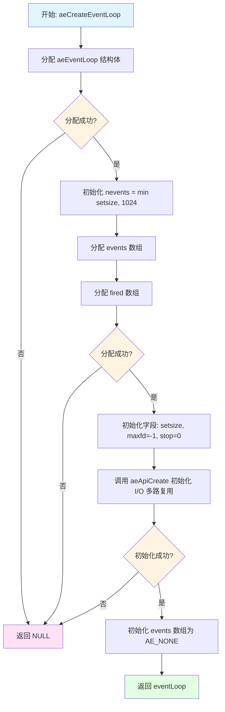
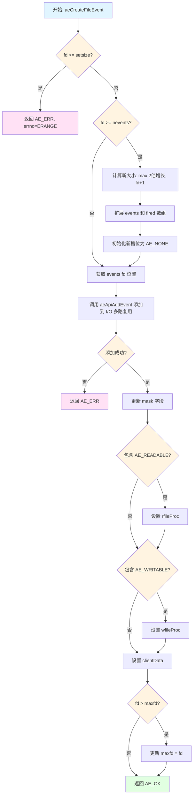
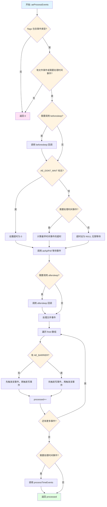
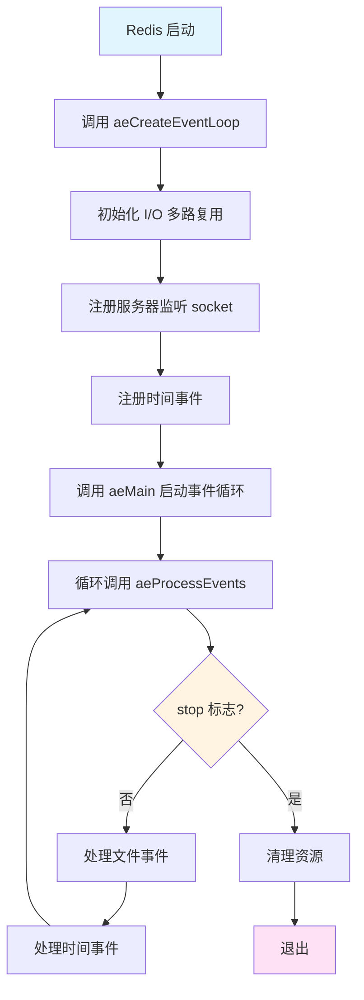
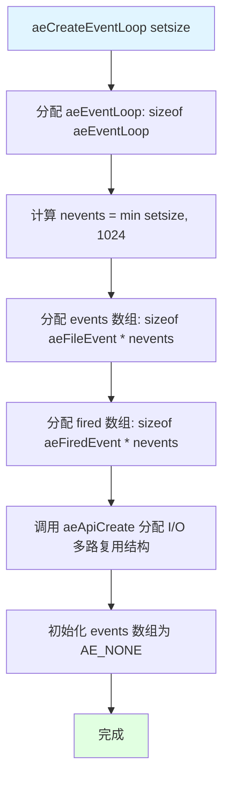
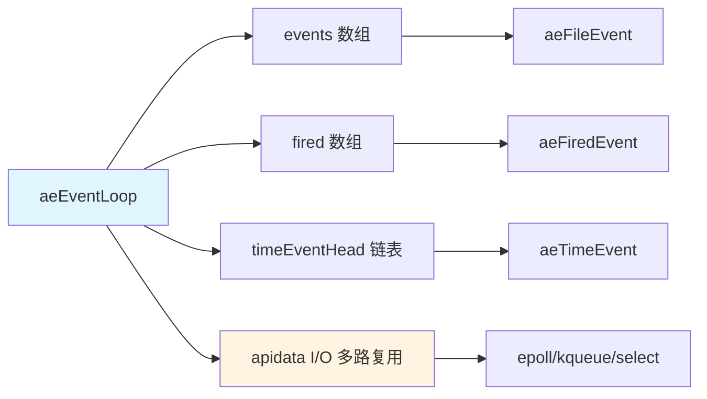
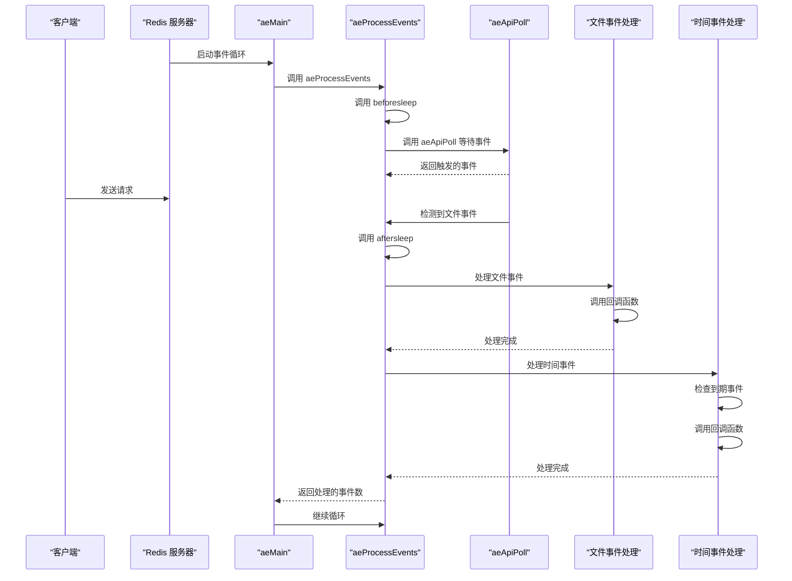

# Redis aeEventLoop: 源码分析

## 目录

**第一部分：理解概念（是什么、为什么）**
- [一、概述](#一概述)
- [二、数据结构定义](#二数据结构定义)
- [三、设计特点分析](#三设计特点分析)
- [四、使用场景与限制](#四使用场景与限制)

**第二部分：理解使用（怎么用）**
- [五、操作流程图](#五操作流程图)
- [六、示例代码理解](#六示例代码理解)
- [七、aeEventLoop 完整流程分析](#七aeeventloop-完整流程分析)

**第三部分：深入实现（如何实现）**
- [八、核心函数实现](#八核心函数实现)
- [九、源码关键点总结](#九源码关键点总结)
- [十、测试用例分析](#十测试用例分析)
- [十一、总结](#十一总结)

---

## 一、概述

`aeEventLoop` 是 Redis 的事件驱动编程库，是 Redis 单线程事件处理的核心数据结构。它封装了文件事件（I/O 事件）和时间事件（定时器事件）的处理，通过底层 I/O 多路复用机制（epoll、kqueue、evport、select）实现高效的事件监听和处理。

### 核心特点

- **统一的事件管理**：同时管理文件事件和时间事件，提供统一的事件处理接口
- **跨平台 I/O 多路复用**：自动选择最优的 I/O 多路复用机制（epoll > kqueue > evport > select）
- **可扩展的数组设计**：文件事件数组可动态扩展，初始大小为 1024，最大为 setsize
- **时间事件链表**：使用双向链表管理时间事件，支持精确的定时器功能
- **回调机制**：提供 beforeSleep 和 afterSleep 回调，支持在事件处理前后执行自定义逻辑

## 二、数据结构定义

### 2.1 aeEventLoop 结构体

```79:93:github/redis-unstable/src/ae.h
/* State of an event based program */
typedef struct aeEventLoop {
    int maxfd;   /* highest file descriptor currently registered */
    int setsize; /* max number of file descriptors tracked */
    long long timeEventNextId;
    int nevents; /* Size of Registered events */
    aeFileEvent *events; /* Registered events */
    aeFiredEvent *fired; /* Fired events */
    aeTimeEvent *timeEventHead;
    int stop;
    void *apidata; /* This is used for polling API specific data */
    aeBeforeSleepProc *beforesleep;
    aeBeforeSleepProc *aftersleep;
    int flags;
    void *privdata[2];
} aeEventLoop;
```

**字段说明：**

| 字段 | 类型 | 说明 | 备注 |
|------|------|------|------|
| maxfd | int | 当前注册的最高文件描述符 | -1 表示没有注册的文件描述符 |
| setsize | int | 最大可跟踪的文件描述符数量 | 由 aeCreateEventLoop 参数指定 |
| timeEventNextId | long long | 下一个时间事件的 ID | 自增，用于唯一标识时间事件 |
| nevents | int | 当前已分配的事件数组大小 | 可动态扩展，初始为 1024 |
| events | aeFileEvent* | 文件事件数组 | 以 fd 为索引，存储文件事件信息 |
| fired | aeFiredEvent* | 已触发的事件数组 | 存储从 I/O 多路复用返回的事件 |
| timeEventHead | aeTimeEvent* | 时间事件链表头 | 双向链表，按插入顺序排列 |
| stop | int | 事件循环停止标志 | 1 表示停止，0 表示运行 |
| apidata | void* | I/O 多路复用 API 特定数据 | 存储 epoll/kqueue/select 的结构体 |
| beforesleep | aeBeforeSleepProc* | 睡眠前回调函数 | 在等待事件前调用 |
| aftersleep | aeBeforeSleepProc* | 睡眠后回调函数 | 在等待事件后调用 |
| flags | int | 事件循环标志位 | AE_DONT_WAIT 等标志 |
| privdata | void*[2] | 私有数据数组 | 预留，可用于存储用户数据 |

### 2.2 aeFileEvent 结构体

```52:57:github/redis-unstable/src/ae.h
/* File event structure */
typedef struct aeFileEvent {
    int mask; /* one of AE_(READABLE|WRITABLE|BARRIER) */
    aeFileProc *rfileProc;
    aeFileProc *wfileProc;
    void *clientData;
} aeFileEvent;
```

**字段说明：**

| 字段 | 类型 | 说明 | 备注 |
|------|------|------|------|
| mask | int | 事件掩码 | AE_READABLE、AE_WRITABLE、AE_BARRIER 的组合 |
| rfileProc | aeFileProc* | 读事件回调函数 | 当文件描述符可读时调用 |
| wfileProc | aeFileProc* | 写事件回调函数 | 当文件描述符可写时调用 |
| clientData | void* | 客户端数据 | 传递给回调函数的用户数据 |

### 2.3 aeTimeEvent 结构体

```60:70:github/redis-unstable/src/ae.h
/* Time event structure */
typedef struct aeTimeEvent {
    long long id; /* time event identifier. */
    monotime when;
    aeTimeProc *timeProc;
    aeEventFinalizerProc *finalizerProc;
    void *clientData;
    struct aeTimeEvent *prev;
    struct aeTimeEvent *next;
    int refcount; /* refcount to prevent timer events from being
  		   * freed in recursive time event calls. */
} aeTimeEvent;
```

**字段说明：**

| 字段 | 类型 | 说明 | 备注 |
|------|------|------|------|
| id | long long | 时间事件唯一标识符 | 由 timeEventNextId 生成 |
| when | monotime | 触发时间（微秒） | 使用单调时钟，避免系统时间调整影响 |
| timeProc | aeTimeProc* | 时间事件处理函数 | 返回下次触发间隔（毫秒），-1 表示只执行一次 |
| finalizerProc | aeEventFinalizerProc* | 清理函数 | 删除时间事件时调用 |
| clientData | void* | 客户端数据 | 传递给回调函数的用户数据 |
| prev | aeTimeEvent* | 前驱节点 | 双向链表前驱 |
| next | aeTimeEvent* | 后继节点 | 双向链表后继 |
| refcount | int | 引用计数 | 防止递归调用时被释放 |

### 2.4 aeFiredEvent 结构体

```73:76:github/redis-unstable/src/ae.h
/* A fired event */
typedef struct aeFiredEvent {
    int fd;
    int mask;
} aeFiredEvent;
```

**字段说明：**

| 字段 | 类型 | 说明 | 备注 |
|------|------|------|------|
| fd | int | 文件描述符 | 触发事件的文件描述符 |
| mask | int | 事件掩码 | AE_READABLE 或 AE_WRITABLE |

### 2.5 事件类型定义

```21:28:github/redis-unstable/src/ae.h
#define AE_NONE 0       /* No events registered. */
#define AE_READABLE 1   /* Fire when descriptor is readable. */
#define AE_WRITABLE 2   /* Fire when descriptor is writable. */
#define AE_BARRIER 4    /* With WRITABLE, never fire the event if the
                           READABLE event already fired in the same event
                           loop iteration. Useful when you want to persist
                           things to disk before sending replies, and want
                           to do that in a group fashion. */
```

**事件类型说明：**

| 类型 | 值 | 说明 |
|------|-----|------|
| AE_NONE | 0 | 无事件 |
| AE_READABLE | 1 | 可读事件 |
| AE_WRITABLE | 2 | 可写事件 |
| AE_BARRIER | 4 | 屏障标志，用于控制事件触发顺序 |

## 三、设计特点分析

### 3.1 内存优化

**动态数组扩展：**
- 初始分配大小为 `INITIAL_EVENT`（1024）个文件事件
- 当 fd 超过当前数组大小时，动态扩展数组（2 倍增长或直接扩展到 fd+1）
- 扩展时使用 `zrealloc` 重新分配内存，保留原有数据

**内存布局：**
- `events` 数组以 fd 为索引，直接访问，O(1) 时间复杂度
- `fired` 数组存储触发的事件，由 I/O 多路复用填充
- 时间事件使用双向链表，按需分配，节省内存

**内存效率对比：**

| 数据结构 | 内存占用 | 访问复杂度 |
|---------|---------|-----------|
| events 数组 | O(setsize) | O(1) |
| fired 数组 | O(setsize) | O(1) |
| timeEventHead 链表 | O(时间事件数) | O(N) |

### 3.2 性能优化

**时间复杂度分析：**

| 操作 | 时间复杂度 | 说明 |
|------|-----------|------|
| 创建事件循环 | O(setsize) | 初始化数组 |
| 添加文件事件 | O(1) | 数组索引访问 |
| 删除文件事件 | O(1) | 数组索引访问 |
| 添加时间事件 | O(1) | 链表头插入 |
| 删除时间事件 | O(N) | 遍历链表查找 |
| 处理时间事件 | O(N) | 遍历链表查找最早事件 |
| 处理文件事件 | O(触发事件数) | 遍历 fired 数组 |

**快速路径设计：**
- 文件事件使用数组直接索引，避免哈希表开销
- 时间事件延迟删除（标记为 AE_DELETED_EVENT_ID），避免立即删除时的链表操作
- 使用引用计数（refcount）防止递归调用时时间事件被释放

**预分配策略：**
- 初始分配 1024 个文件事件槽位，减少频繁的内存分配
- 数组扩展采用 2 倍增长策略，平衡内存使用和扩展次数

### 3.3 特殊处理

**I/O 多路复用平台适配：**
- 自动选择最优的 I/O 多路复用机制：evport > epoll > kqueue > select
- 通过 `apidata` 存储平台特定的数据结构
- 提供统一的 API 接口（aeApiCreate、aeApiAddEvent、aeApiDelEvent、aeApiPoll）

**时间事件处理：**
- 使用单调时钟（monotonic clock）避免系统时间调整的影响
- 支持重复执行的时间事件（返回下次间隔）和单次执行（返回 AE_NOMORE）
- 延迟删除机制：标记为 AE_DELETED_EVENT_ID，在下次处理时清理

**事件触发顺序控制：**
- AE_BARRIER 标志控制读写事件的触发顺序
- 正常情况下先触发读事件，再触发写事件
- 设置了 AE_BARRIER 时，先触发写事件，再触发读事件（用于持久化场景）

**边界情况处理：**
- fd 范围检查：fd >= setsize 时返回错误
- 空事件处理：events 数组初始化为 AE_NONE
- 递归调用保护：使用 refcount 防止时间事件在递归调用中被释放

## 四、使用场景与限制

### 4.1 适用场景

**主要使用场景：**
- Redis 服务器的核心事件循环
- 单线程 I/O 事件处理
- 定时器任务调度
- 网络编程中的事件驱动模型

**优势场景：**
- 高并发连接处理（epoll 优势）
- 需要精确的定时器功能
- 需要统一管理 I/O 事件和时间事件

### 4.2 性能特点

**操作时间复杂度：**

| 操作 | 时间复杂度 | 说明 |
|------|-----------|------|
| aeCreateEventLoop | O(setsize) | 初始化事件循环 |
| aeCreateFileEvent | O(1) | 添加文件事件 |
| aeDeleteFileEvent | O(1) | 删除文件事件 |
| aeCreateTimeEvent | O(1) | 添加时间事件（链表头插入） |
| aeDeleteTimeEvent | O(N) | 删除时间事件（需遍历链表） |
| aeProcessEvents | O(触发事件数 + 时间事件数) | 处理所有事件 |
| aeMain | O(∞) | 事件循环主函数 |

**性能特征说明：**
- 文件事件处理效率高，O(1) 的添加和删除
- 时间事件查找为 O(N)，但 Redis 中时间事件数量较少，影响不大
- I/O 多路复用机制的选择对性能影响最大（epoll > kqueue > select）

### 4.3 转换条件

**设计限制：**
- 文件描述符数量受 `setsize` 限制
- 时间事件查找为 O(N)，不适合大量时间事件
- 单线程模型，不适合 CPU 密集型任务

**优化建议：**
- 对于大量时间事件，可考虑使用优先队列或跳表
- 文件描述符数量应根据实际需求设置，避免浪费内存

## 五、操作流程图

### 5.1 创建事件循环流程



### 5.2 添加文件事件流程



### 5.3 事件处理主流程



## 六、示例代码理解

### 6.1 基本操作示例

```c
// 创建事件循环
aeEventLoop *el = aeCreateEventLoop(1024);
if (el == NULL) {
    fprintf(stderr, "Failed to create event loop\n");
    exit(1);
}

// 添加文件事件（读事件）
int fd = socket(...);
aeCreateFileEvent(el, fd, AE_READABLE, readCallback, clientData);

// 添加时间事件（每秒执行一次）
long long id = aeCreateTimeEvent(el, 1000, timeCallback, clientData, NULL);

// 设置回调函数
aeSetBeforeSleepProc(el, beforeSleepCallback);
aeSetAfterSleepProc(el, afterSleepCallback);

// 启动事件循环
aeMain(el);

// 停止事件循环
aeStop(el);

// 清理
aeDeleteEventLoop(el);
```

### 6.2 内存布局示例

```
aeEventLoop 结构体内存布局:

地址偏移:  [0x00]  [0x04]  [0x08]  [0x10]  [0x18]  [0x20]  [0x28]  [0x30]
           |------|------|------|------|------|------|------|------|
字段:      |maxfd |setsize|timeEventNextId|nevents|events |fired |timeEventHead
           |------|------|------|------|------|------|------|------|
值:        |  -1  | 1024 |      0        | 1024  | ptr   | ptr   | NULL

地址偏移:  [0x38]  [0x3C]  [0x40]  [0x48]  [0x50]  [0x58]  [0x60]
           |------|------|------|------|------|------|------|
字段:      | stop |apidata|beforesleep|aftersleep|flags |privdata
           |------|------|------|------|------|------|------|
值:        |  0   | ptr   |   NULL     |  NULL    |  0   | [0,0]

events 数组布局（以 fd 为索引）:
fd:       [0]    [1]    [2]    ...    [1023]
          |------|------|------|------|------|
mask:     |NONE  |READ  |WRITE | ...  |NONE  |
rfileProc:|NULL  |func1 |NULL  | ...  |NULL  |
wfileProc:|NULL  |NULL  |func2 | ...  |NULL  |
clientData|NULL  |data1 |data2 | ...  |NULL  |
```

**关键点：**
- `events` 数组以 fd 为索引，实现 O(1) 访问
- 未使用的槽位 mask 为 AE_NONE，回调函数为 NULL
- `fired` 数组存储触发的事件，由 I/O 多路复用填充
- `timeEventHead` 指向时间事件双向链表的头节点

## 七、aeEventLoop 完整流程分析

### 7.1 调用流程



### 7.2 关键节点的内存分配

**内存分配流程图：**



**详细的内存分配步骤和大小计算：**

1. **分配 aeEventLoop 结构体**
   - 大小：`sizeof(aeEventLoop)` ≈ 88 字节（64 位系统）
   - 包含所有字段的基础内存

2. **分配 events 数组**
   - 大小：`sizeof(aeFileEvent) * nevents`
   - `aeFileEvent` 大小：24 字节（mask: 4, rfileProc: 8, wfileProc: 8, clientData: 8）
   - 初始 nevents = 1024，总计：24 * 1024 = 24KB

3. **分配 fired 数组**
   - 大小：`sizeof(aeFiredEvent) * nevents`
   - `aeFiredEvent` 大小：8 字节（fd: 4, mask: 4）
   - 初始 nevents = 1024，总计：8 * 1024 = 8KB

4. **分配 I/O 多路复用结构（apidata）**
   - epoll: `sizeof(struct aeApiState)` ≈ 16 字节 + epoll_fd
   - kqueue: `sizeof(struct aeApiState)` ≈ 16 字节 + kq
   - select: `sizeof(fd_set) * 2` ≈ 16KB（FD_SETSIZE=1024）

**内存布局图：**

```
内存布局（64 位系统）:

aeEventLoop (88 字节):
  +0x00: maxfd (4 bytes)
  +0x04: setsize (4 bytes)
  +0x08: timeEventNextId (8 bytes)
  +0x10: nevents (4 bytes)
  +0x18: events (8 bytes, 指针)
  +0x20: fired (8 bytes, 指针)
  +0x28: timeEventHead (8 bytes, 指针)
  +0x30: stop (4 bytes)
  +0x38: apidata (8 bytes, 指针)
  +0x40: beforesleep (8 bytes, 指针)
  +0x48: aftersleep (8 bytes, 指针)
  +0x50: flags (4 bytes)
  +0x58: privdata[2] (16 bytes)

events 数组 (24KB):
  [0]: aeFileEvent (24 bytes)
  [1]: aeFileEvent (24 bytes)
  ...
  [1023]: aeFileEvent (24 bytes)

fired 数组 (8KB):
  [0]: aeFiredEvent (8 bytes)
  [1]: aeFiredEvent (8 bytes)
  ...
  [1023]: aeFiredEvent (8 bytes)
```

### 7.3 对象封装和底层数据结构的结合使用

**关系图：**



**什么时候用对象封装：**
- 用户代码直接使用 `aeEventLoop` 结构体
- 通过函数接口（aeCreateFileEvent、aeProcessEvents）操作事件循环
- 不需要直接访问底层数组和链表

**什么时候操作底层数据结构：**
- 内部实现中直接访问 `events[fd]` 获取文件事件
- 直接遍历 `timeEventHead` 链表处理时间事件
- 直接访问 `fired` 数组处理触发的事件

**使用模式总结：**
- **对外接口**：使用函数封装，隐藏内部实现细节
- **内部实现**：直接操作底层数据结构，提高性能
- **数据结构选择**：文件事件用数组（O(1)），时间事件用链表（O(1) 插入）

### 7.4 完整执行时序图



### 7.5 内存分配总结

**执行命令的内存变化：**

| 操作 | 内存变化 | 说明 |
|------|---------|------|
| 创建事件循环 | +88 + 24KB + 8KB + I/O 结构 | 基础内存分配 |
| 添加文件事件 | 可能扩展数组 | fd >= nevents 时扩展 |
| 添加时间事件 | +sizeof(aeTimeEvent) | 每次添加约 64 字节 |
| 删除文件事件 | 无变化 | 只是清除标记 |
| 删除时间事件 | 延迟释放 | 标记为 AE_DELETED_EVENT_ID |

**内存效率对比：**

| 场景 | 内存占用 | 说明 |
|------|---------|------|
| 初始状态 | ~32KB | 88 + 24KB + 8KB |
| 1000 个文件事件 | ~32KB | 数组已预分配 |
| 1000 个时间事件 | ~64KB | 每个时间事件 64 字节 |
| 扩展后（2048） | ~64KB | events 和 fired 数组扩展 |

### 7.6 关键代码路径总结

**调用树：**

```
aeMain
  └─ aeProcessEvents
      ├─ beforesleep (回调)
      ├─ aeApiPoll
      │   └─ epoll_wait / kqueue / select
      ├─ aftersleep (回调)
      ├─ 处理文件事件
      │   ├─ rfileProc (读回调)
      │   └─ wfileProc (写回调)
      └─ processTimeEvents
          └─ timeProc (时间回调)
```

**函数调用关系：**

- `aeMain` → `aeProcessEvents`：主循环
- `aeProcessEvents` → `aeApiPoll`：I/O 多路复用
- `aeProcessEvents` → `processTimeEvents`：处理时间事件
- `aeCreateFileEvent` → `aeApiAddEvent`：添加文件事件到 I/O 多路复用
- `aeDeleteFileEvent` → `aeApiDelEvent`：从 I/O 多路复用删除文件事件

## 八、核心函数实现

### 8.1 aeCreateEventLoop

```47:81:github/redis-unstable/src/ae.c
aeEventLoop *aeCreateEventLoop(int setsize) {
    aeEventLoop *eventLoop;
    int i;

    monotonicInit();    /* just in case the calling app didn't initialize */

    if ((eventLoop = zmalloc(sizeof(*eventLoop))) == NULL) goto err;
    eventLoop->nevents = setsize < INITIAL_EVENT ? setsize : INITIAL_EVENT;
    eventLoop->events = zmalloc(sizeof(aeFileEvent)*eventLoop->nevents);
    eventLoop->fired = zmalloc(sizeof(aeFiredEvent)*eventLoop->nevents);
    if (eventLoop->events == NULL || eventLoop->fired == NULL) goto err;
    eventLoop->setsize = setsize;
    eventLoop->timeEventHead = NULL;
    eventLoop->timeEventNextId = 0;
    eventLoop->stop = 0;
    eventLoop->maxfd = -1;
    eventLoop->beforesleep = NULL;
    eventLoop->aftersleep = NULL;
    eventLoop->flags = 0;
    memset(eventLoop->privdata, 0, sizeof(eventLoop->privdata));
    if (aeApiCreate(eventLoop) == -1) goto err;
    /* Events with mask == AE_NONE are not set. So let's initialize the
     * vector with it. */
    for (i = 0; i < eventLoop->nevents; i++)
        eventLoop->events[i].mask = AE_NONE;
    return eventLoop;

err:
    if (eventLoop) {
        zfree(eventLoop->events);
        zfree(eventLoop->fired);
        zfree(eventLoop);
    }
    return NULL;
}
```

**功能：** 创建并初始化事件循环结构体

**实现原理：**
1. 初始化单调时钟（monotonicInit）
2. 分配 aeEventLoop 结构体内存
3. 计算初始事件数组大小（min(setsize, 1024)）
4. 分配 events 和 fired 数组
5. 初始化所有字段（setsize、maxfd、stop 等）
6. 调用 aeApiCreate 初始化 I/O 多路复用
7. 将所有 events 槽位初始化为 AE_NONE

**要点：**
- 使用 goto err 统一错误处理
- 初始 nevents 最小为 1024，避免频繁扩展
- 所有 events 槽位初始化为 AE_NONE，表示未使用

### 8.2 aeCreateFileEvent

```145:179:github/redis-unstable/src/ae.c
int aeCreateFileEvent(aeEventLoop *eventLoop, int fd, int mask,
        aeFileProc *proc, void *clientData)
{
    if (fd >= eventLoop->setsize) {
        errno = ERANGE;
        return AE_ERR;
    }

    /* Resize the events and fired arrays if the file
     * descriptor exceeds the current number of events. */
    if (unlikely(fd >= eventLoop->nevents)) {
        int newnevents = eventLoop->nevents;
        newnevents = (newnevents * 2 > fd + 1) ? newnevents * 2 : fd + 1;
        newnevents = (newnevents > eventLoop->setsize) ? eventLoop->setsize : newnevents;
        eventLoop->events = zrealloc(eventLoop->events, sizeof(aeFileEvent) * newnevents);
        eventLoop->fired = zrealloc(eventLoop->fired, sizeof(aeFiredEvent) * newnevents);

        /* Initialize new slots with an AE_NONE mask */
        for (int i = eventLoop->nevents; i < newnevents; i++)
            eventLoop->events[i].mask = AE_NONE;
        eventLoop->nevents = newnevents;
    }

    aeFileEvent *fe = &eventLoop->events[fd];

    if (aeApiAddEvent(eventLoop, fd, mask) == -1)
        return AE_ERR;
    fe->mask |= mask;
    if (mask & AE_READABLE) fe->rfileProc = proc;
    if (mask & AE_WRITABLE) fe->wfileProc = proc;
    fe->clientData = clientData;
    if (fd > eventLoop->maxfd)
        eventLoop->maxfd = fd;
    return AE_OK;
}
```

**功能：** 添加文件事件到事件循环

**实现原理：**
1. 检查 fd 是否超出 setsize 限制
2. 如果 fd >= nevents，动态扩展数组（2 倍增长或扩展到 fd+1）
3. 调用 aeApiAddEvent 添加到 I/O 多路复用
4. 更新 mask 字段（按位或）
5. 根据 mask 设置对应的回调函数（rfileProc 或 wfileProc）
6. 设置 clientData
7. 更新 maxfd

**要点：**
- 数组扩展策略：优先 2 倍增长，但不超过 setsize
- 新扩展的槽位初始化为 AE_NONE
- mask 使用按位或，支持同时设置 READABLE 和 WRITABLE

### 8.3 aeProcessEvents

```360:468:github/redis-unstable/src/ae.c
int aeProcessEvents(aeEventLoop *eventLoop, int flags)
{
    int processed = 0, numevents;

    /* Nothing to do? return ASAP */
    if (!(flags & AE_TIME_EVENTS) && !(flags & AE_FILE_EVENTS)) return 0;

    /* Note that we want to call aeApiPoll() even if there are no
     * file events to process as long as we want to process time
     * events, in order to sleep until the next time event is ready
     * to fire. */
    if (eventLoop->maxfd != -1 ||
        ((flags & AE_TIME_EVENTS) && !(flags & AE_DONT_WAIT))) {
        int j;
        struct timeval tv, *tvp = NULL; /* NULL means infinite wait. */
        int64_t usUntilTimer;

        if (eventLoop->beforesleep != NULL && (flags & AE_CALL_BEFORE_SLEEP))
            eventLoop->beforesleep(eventLoop);

        /* The eventLoop->flags may be changed inside beforesleep.
         * So we should check it after beforesleep be called. At the same time,
         * the parameter flags always should have the highest priority.
         * That is to say, once the parameter flag is set to AE_DONT_WAIT,
         * no matter what value eventLoop->flags is set to, we should ignore it. */
        if ((flags & AE_DONT_WAIT) || (eventLoop->flags & AE_DONT_WAIT)) {
            tv.tv_sec = tv.tv_usec = 0;
            tvp = &tv;
        } else if (flags & AE_TIME_EVENTS) {
            usUntilTimer = usUntilEarliestTimer(eventLoop);
            if (usUntilTimer >= 0) {
                tv.tv_sec = usUntilTimer / 1000000;
                tv.tv_usec = usUntilTimer % 1000000;
                tvp = &tv;
            }
        }
        /* Call the multiplexing API, will return only on timeout or when
         * some event fires. */
        numevents = aeApiPoll(eventLoop, tvp);

        /* Don't process file events if not requested. */
        if (!(flags & AE_FILE_EVENTS)) {
            numevents = 0;
        }

        /* After sleep callback. */
        if (eventLoop->aftersleep != NULL && flags & AE_CALL_AFTER_SLEEP)
            eventLoop->aftersleep(eventLoop);

        for (j = 0; j < numevents; j++) {
            int fd = eventLoop->fired[j].fd;
            aeFileEvent *fe = &eventLoop->events[fd];
            int mask = eventLoop->fired[j].mask;
            int fired = 0; /* Number of events fired for current fd. */

            /* Normally we execute the readable event first, and the writable
             * event later. This is useful as sometimes we may be able
             * to serve the reply of a query immediately after processing the
             * query.
             *
             * However if AE_BARRIER is set in the mask, our application is
             * asking us to do the reverse: never fire the writable event
             * after the readable. In such a case, we invert the calls.
             * This is useful when, for instance, we want to do things
             * in the beforeSleep() hook, like fsyncing a file to disk,
             * before replying to a client. */
            int invert = fe->mask & AE_BARRIER;

            /* Note the "fe->mask & mask & ..." code: maybe an already
             * processed event removed an element that fired and we still
             * didn't processed, so we check if the event is still valid.
             *
             * Fire the readable event if the call sequence is not
             * inverted. */
            if (!invert && fe->mask & mask & AE_READABLE) {
                fe->rfileProc(eventLoop,fd,fe->clientData,mask);
                fired++;
                fe = &eventLoop->events[fd]; /* Refresh in case of resize. */
            }

            /* Fire the writable event. */
            if (fe->mask & mask & AE_WRITABLE) {
                if (!fired || fe->wfileProc != fe->rfileProc) {
                    fe->wfileProc(eventLoop,fd,fe->clientData,mask);
                    fired++;
                }
            }

            /* If we have to invert the call, fire the readable event now
             * after the writable one. */
            if (invert) {
                fe = &eventLoop->events[fd]; /* Refresh in case of resize. */
                if ((fe->mask & mask & AE_READABLE) &&
                    (!fired || fe->wfileProc != fe->rfileProc))
                {
                    fe->rfileProc(eventLoop,fd,fe->clientData,mask);
                    fired++;
                }
            }

            processed++;
        }
    }
    /* Check time events */
    if (flags & AE_TIME_EVENTS)
        processed += processTimeEvents(eventLoop);

    return processed; /* return the number of processed file/time events */
}
```

**功能：** 处理所有待处理的事件（文件事件和时间事件）

**实现原理：**
1. 检查 flags，如果没有要处理的事件类型，直接返回
2. 如果有文件事件或需要处理时间事件，进入处理流程
3. 调用 beforesleep 回调（如果设置）
4. 计算超时时间：
   - AE_DONT_WAIT：超时为 0，立即返回
   - 有时间事件：计算最早时间事件的超时
   - 否则：无限等待
5. 调用 aeApiPoll 等待事件
6. 调用 aftersleep 回调（如果设置）
7. 处理文件事件：
   - 遍历 fired 数组
   - 根据 AE_BARRIER 标志决定触发顺序
   - 调用对应的回调函数
8. 处理时间事件（如果 flags 包含 AE_TIME_EVENTS）
9. 返回处理的事件总数

**要点：**
- AE_BARRIER 标志控制事件触发顺序（先写后读，用于持久化场景）
- 检查 `fe->mask & mask` 确保事件仍然有效（可能被删除）
- 处理完事件后刷新 fe 指针（数组可能被扩展）

### 8.4 processTimeEvents

```279:343:github/redis-unstable/src/ae.c
/* Process time events */
static int processTimeEvents(aeEventLoop *eventLoop) {
    int processed = 0;
    aeTimeEvent *te;
    long long maxId;

    te = eventLoop->timeEventHead;
    maxId = eventLoop->timeEventNextId-1;
    monotime now = getMonotonicUs();
    while(te) {
        long long id;

        /* Remove events scheduled for deletion. */
        if (te->id == AE_DELETED_EVENT_ID) {
            aeTimeEvent *next = te->next;
            /* If a reference exists for this timer event,
             * don't free it. This is currently incremented
             * for recursive timerProc calls */
            if (te->refcount) {
                te = next;
                continue;
            }
            if (te->prev)
                te->prev->next = te->next;
            else
                eventLoop->timeEventHead = te->next;
            if (te->next)
                te->next->prev = te->prev;
            if (te->finalizerProc) {
                te->finalizerProc(eventLoop, te->clientData);
                now = getMonotonicUs();
            }
            zfree(te);
            te = next;
            continue;
        }

        /* Make sure we don't process time events created by time events in
         * this iteration. Note that this check is currently useless: we always
         * add new timers on the head, however if we change the implementation
         * detail, this check may be useful again: we keep it here for future
         * defense. */
        if (te->id > maxId) {
            te = te->next;
            continue;
        }

        if (te->when <= now) {
            int retval;

            id = te->id;
            te->refcount++;
            retval = te->timeProc(eventLoop, id, te->clientData);
            te->refcount--;
            processed++;
            now = getMonotonicUs();
            if (retval != AE_NOMORE) {
                te->when = now + (monotime)retval * 1000;
            } else {
                te->id = AE_DELETED_EVENT_ID;
            }
        }
        te = te->next;
    }
    return processed;
}
```

**功能：** 处理所有到期的时间事件

**实现原理：**
1. 遍历时间事件链表
2. 删除标记为 AE_DELETED_EVENT_ID 的事件（延迟删除）
3. 跳过本次迭代中新创建的事件（id > maxId）
4. 检查事件是否到期（when <= now）
5. 增加 refcount，调用 timeProc 回调
6. 减少 refcount
7. 根据返回值更新下次触发时间或标记为删除

**要点：**
- 使用 refcount 防止递归调用时事件被释放
- 延迟删除机制：标记为 AE_DELETED_EVENT_ID，下次处理时删除
- 使用单调时钟避免系统时间调整的影响
- 返回值：毫秒数表示下次间隔，AE_NOMORE 表示只执行一次

### 8.5 aeMain

```492:499:github/redis-unstable/src/ae.c
void aeMain(aeEventLoop *eventLoop) {
    eventLoop->stop = 0;
    while (!eventLoop->stop) {
        aeProcessEvents(eventLoop, AE_ALL_EVENTS|
                                   AE_CALL_BEFORE_SLEEP|
                                   AE_CALL_AFTER_SLEEP);
    }
}
```

**功能：** 事件循环主函数，持续处理事件直到 stop 标志被设置

**实现原理：**
1. 初始化 stop 标志为 0
2. 循环调用 aeProcessEvents，直到 stop 为 1
3. 每次处理所有类型的事件，并调用回调函数

**要点：**
- 简单的循环结构，依赖 stop 标志退出
- 每次循环处理所有事件类型和回调

## 九、源码关键点总结

### 9.1 内存管理

- 使用 `zmalloc` / `zrealloc` / `zfree` 进行内存分配和释放
- events 和 fired 数组动态扩展，浪费最少内存
- 时间事件使用链表，按需分配
- 错误处理统一使用 goto err，确保资源正确释放

### 9.2 I/O 多路复用抽象

- 通过 `apidata` 存储平台特定的数据结构
- 提供统一的 API 接口（aeApiCreate、aeApiAddEvent、aeApiDelEvent、aeApiPoll）
- 自动选择最优的 I/O 多路复用机制（evport > epoll > kqueue > select）
- 编译时通过条件编译选择实现

### 9.3 时间事件处理

- 使用单调时钟（monotonic clock）避免系统时间调整的影响
- 延迟删除机制：标记为 AE_DELETED_EVENT_ID，在下次处理时删除
- 使用 refcount 防止递归调用时事件被释放
- 支持重复执行（返回间隔）和单次执行（返回 AE_NOMORE）

### 9.4 事件触发顺序控制

- AE_BARRIER 标志控制读写事件的触发顺序
- 正常情况下先读后写，适合立即响应场景
- 设置了 AE_BARRIER 时先写后读，适合持久化场景
- 检查 `fe->mask & mask` 确保事件仍然有效

### 9.5 数组动态扩展

- 初始大小为 1024，减少频繁扩展
- 扩展策略：优先 2 倍增长，但不超过 setsize
- 扩展时使用 zrealloc，保留原有数据
- 新扩展的槽位初始化为 AE_NONE

### 9.6 边界情况处理

- fd 范围检查：fd >= setsize 时返回错误
- 空事件处理：events 数组初始化为 AE_NONE
- 递归调用保护：使用 refcount 防止时间事件被释放
- 事件有效性检查：处理前检查 mask，避免处理已删除的事件

## 十、测试用例分析

源码测试涵盖：
- 事件循环的创建和销毁
- 文件事件的添加和删除
- 时间事件的添加和删除
- 事件处理流程
- I/O 多路复用的选择
- 边界情况处理（fd 超出范围、空事件等）

测试文件位置：`github/redis-unstable/tests/unit/` 目录下可能包含相关测试用例。

## 十一、总结

`aeEventLoop` 是一个精心设计的事件驱动编程库，通过以下设计实现了高效的事件处理：

1. **统一的事件管理**：同时管理文件事件和时间事件，提供统一的事件处理接口，简化了事件驱动的编程模型

2. **高效的 I/O 多路复用**：自动选择最优的 I/O 多路复用机制（epoll/kqueue/evport/select），充分利用操作系统特性，实现高性能的事件监听

3. **灵活的内存管理**：文件事件使用数组实现 O(1) 访问，动态扩展减少内存浪费；时间事件使用链表，按需分配内存

4. **精确的时间控制**：使用单调时钟避免系统时间调整的影响，支持重复执行和单次执行的时间事件，满足各种定时需求

5. **可控的事件顺序**：通过 AE_BARRIER 标志控制读写事件的触发顺序，支持不同的应用场景（立即响应 vs 持久化优先）

这种设计在 Redis 单线程事件处理中发挥了重要作用，为 Redis 的高性能奠定了基础。
