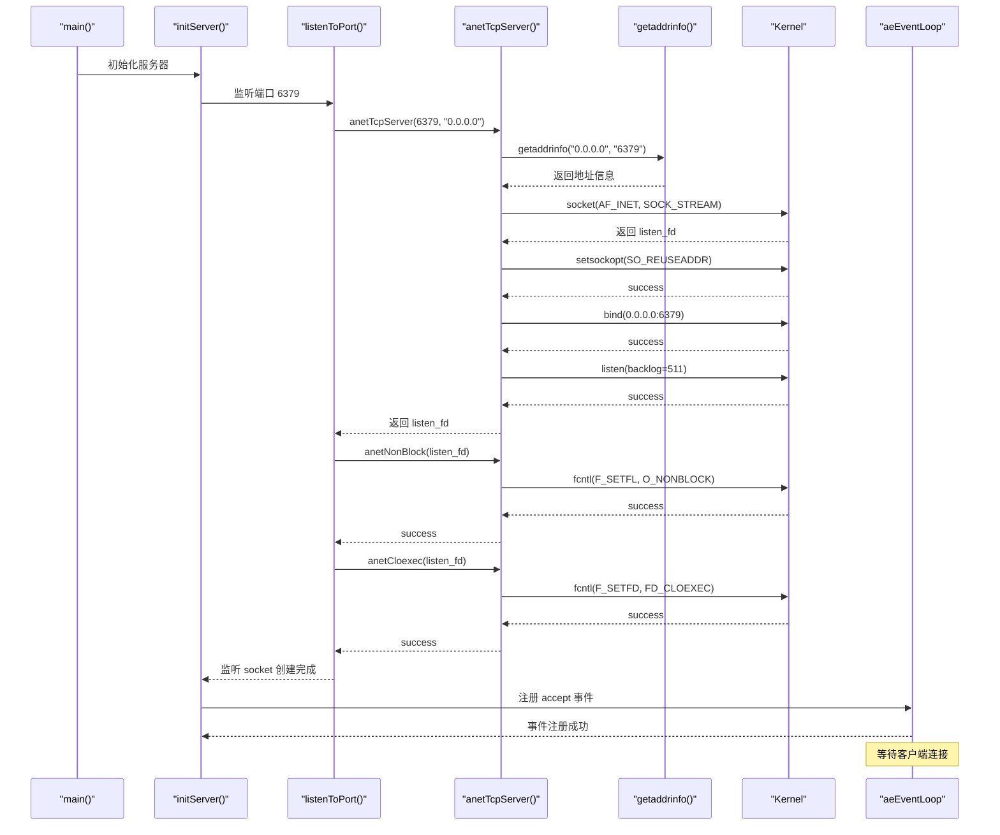
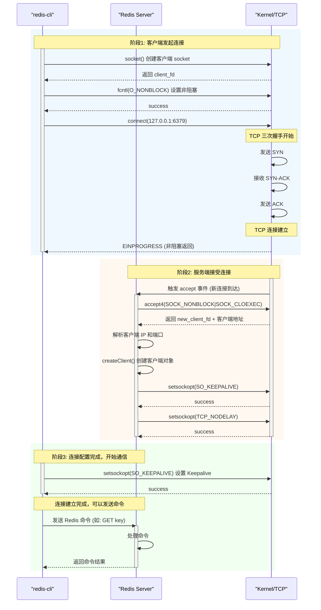
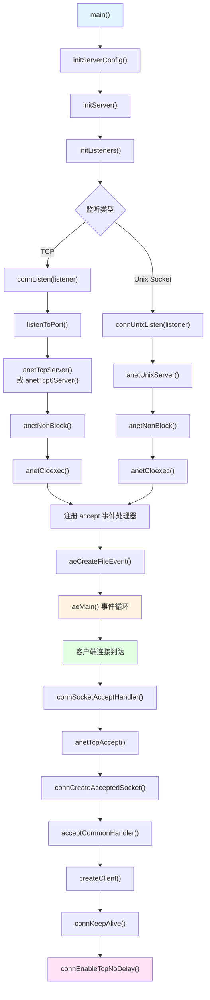

# Redis anet.c: 源码分析

## 目录

**第一部分：理解概念（是什么、为什么）**
- [一、概述](#一概述)
- [二、数据结构定义](#二数据结构定义)
- [三、设计特点分析](#三设计特点分析)
- [四、使用场景与限制](#四使用场景与限制)

**第二部分：理解使用（怎么用）**
- [五、操作流程图](#五操作流程图)
- [六、示例代码理解](#六示例代码理解)
- [七、Redis Server 完整流程分析](#七redis-server-完整流程分析)

**第三部分：深入实现（如何实现）**
- [八、核心函数实现](#八核心函数实现)
- [九、源码关键点总结](#九源码关键点总结)
- [十、测试用例分析](#十测试用例分析)
- [十一、总结](#十一总结)

---

## 一、概述

`anet.c` 是 Redis 的网络抽象层模块（ANET = "A Network"），封装了底层 socket 操作，为 Redis 提供了统一的、跨平台的网络编程接口。

### 核心特点

- **统一抽象层**：封装底层 socket API，隐藏平台差异，提供统一接口
- **跨平台兼容**：处理不同操作系统的 socket 实现差异（Linux、macOS、Solaris 等）
- **非阻塞 I/O 支持**：默认支持非阻塞 socket，适合事件驱动模型
- **错误处理机制**：统一的错误信息返回机制，便于调试和问题定位
- **安全性保障**：支持 close-on-exec、socket 标记等安全特性

### 在系统中的作用

`anet.c` 是 Redis 网络架构的基础模块，为以下功能提供底层支持：

1. **服务器监听**：创建和绑定 TCP/IPv4、TCP/IPv6、Unix Socket 监听端口
2. **客户端连接**：接受客户端连接，设置 socket 属性
3. **集群通信**：建立节点间连接，支持主从复制
4. **网络工具**：`redis-cli` 等工具的网络连接功能

---

## 二、数据结构定义

### 2.1 常量定义

```16:24:github/redis-unstable/src/anet.h
#define ANET_OK 0
#define ANET_ERR -1
#define ANET_ERR_LEN 256

/* Flags used with certain functions. */
#define ANET_NONE 0
#define ANET_IP_ONLY (1<<0)
#define ANET_PREFER_IPV4 (1<<1)
#define ANET_PREFER_IPV6 (1<<2)
```

**常量说明：**

| 常量 | 值 | 说明 | 备注 |
|---|---|---|---|
| ANET_OK | 0 | 操作成功 | - |
| ANET_ERR | -1 | 操作失败 | - |
| ANET_ERR_LEN | 256 | 错误信息缓冲区长度 | - |
| ANET_IP_ONLY | 1<<0 | 仅解析 IP 地址 | 不进行 DNS 解析 |
| ANET_PREFER_IPV4 | 1<<1 | 优先使用 IPv4 | - |
| ANET_PREFER_IPV6 | 1<<2 | 优先使用 IPv6 | - |

### 2.2 函数接口定义

```34:56:github/redis-unstable/src/anet.h
int anetTcpNonBlockConnect(char *err, const char *addr, int port);
int anetTcpNonBlockBestEffortBindConnect(char *err, const char *addr, int port, const char *source_addr);
int anetResolve(char *err, char *host, char *ipbuf, size_t ipbuf_len, int flags);
int anetTcpServer(char *err, int port, char *bindaddr, int backlog);
int anetTcp6Server(char *err, int port, char *bindaddr, int backlog);
int anetUnixServer(char *err, char *path, mode_t perm, int backlog);
int anetTcpAccept(char *err, int serversock, char *ip, size_t ip_len, int *port);
int anetUnixAccept(char *err, int serversock);
int anetNonBlock(char *err, int fd);
int anetBlock(char *err, int fd);
int anetCloexec(int fd);
int anetEnableTcpNoDelay(char *err, int fd);
int anetDisableTcpNoDelay(char *err, int fd);
int anetSendTimeout(char *err, int fd, long long ms);
int anetRecvTimeout(char *err, int fd, long long ms);
int anetFdToString(int fd, char *ip, size_t ip_len, int *port, int remote);
int anetKeepAlive(char *err, int fd, int interval);
int anetFormatAddr(char *fmt, size_t fmt_len, char *ip, int port);
int anetPipe(int fds[2], int read_flags, int write_flags);
int anetSetSockMarkId(char *err, int fd, uint32_t id);
int anetGetError(int fd);
int anetIsFifo(char *filepath);
int anetAcceptFailureNeedsRetry(int err);
```

**函数分类：**

| 类别 | 函数 | 说明 |
|---|---|---|
| 服务器监听 | `anetTcpServer`、`anetTcp6Server`、`anetUnixServer` | 创建监听 socket |
| 连接接受 | `anetTcpAccept`、`anetUnixAccept` | 接受客户端连接 |
| 客户端连接 | `anetTcpNonBlockConnect`、`anetTcpNonBlockBestEffortBindConnect` | 建立客户端连接 |
| Socket 属性 | `anetNonBlock`、`anetBlock`、`anetCloexec` | 设置阻塞/非阻塞、close-on-exec |
| TCP 选项 | `anetKeepAlive`、`anetEnableTcpNoDelay`、`anetDisableTcpNoDelay` | TCP Keepalive、Nagle 算法 |
| 超时设置 | `anetSendTimeout`、`anetRecvTimeout` | 发送/接收超时 |
| 地址解析 | `anetResolve`、`anetFdToString` | DNS 解析、地址格式化 |
| 工具函数 | `anetPipe`、`anetGetError`、`anetIsFifo` | 管道创建、错误获取、文件类型判断 |

---

## 三、设计特点分析

### 3.1 内存优化

#### 3.1.1 错误缓冲区复用

使用全局错误缓冲区 `server.neterr`，避免频繁分配内存：

```35:43:github/redis-unstable/src/anet.c
static void anetSetError(char *err, const char *fmt, ...)
{
    va_list ap;

    if (!err) return;
    va_start(ap, fmt);
    vsnprintf(err, ANET_ERR_LEN, fmt, ap);
    va_end(ap);
}
```

**优化点：**
- 使用固定大小的错误缓冲区（256 字节）
- 支持可变参数格式化，统一错误信息格式
- 允许传入 NULL，忽略错误信息

#### 3.1.2 栈内存使用

关键数据结构使用栈内存，避免动态分配：

```387:388:github/redis-unstable/src/anet.c
    int s = ANET_ERR, rv;
    char portstr[6];  /* strlen("65535") + 1; */
```

### 3.2 性能优化

#### 3.2.1 非阻塞 I/O

默认使用非阻塞 socket，支持事件驱动模型：

```54:80:github/redis-unstable/src/anet.c
int anetSetBlock(char *err, int fd, int non_block) {
    int flags;

    /* Set the socket blocking (if non_block is zero) or non-blocking.
     * Note that fcntl(2) for F_GETFL and F_SETFL can't be
     * interrupted by a signal. */
    if ((flags = fcntl(fd, F_GETFL)) == -1) {
        anetSetError(err, "fcntl(F_GETFL): %s", strerror(errno));
        return ANET_ERR;
    }

    /* Check if this flag has been set or unset, if so,
     * then there is no need to call fcntl to set/unset it again. */
    if (!!(flags & O_NONBLOCK) == !!non_block)
        return ANET_OK;

    if (non_block)
        flags |= O_NONBLOCK;
    else
        flags &= ~O_NONBLOCK;

    if (fcntl(fd, F_SETFL, flags) == -1) {
        anetSetError(err, "fcntl(F_SETFL,O_NONBLOCK): %s", strerror(errno));
        return ANET_ERR;
    }
    return ANET_OK;
}
```

**优化点：**
- 检查当前状态，避免重复设置
- 使用位运算快速判断和设置标志位

#### 3.2.2 accept4() 优化

在支持的系统上使用 `accept4()` 一次性设置非阻塞和 CLOEXEC：

```604:630:github/redis-unstable/src/anet.c
static int anetGenericAccept(char *err, int s, struct sockaddr *sa, socklen_t *len) {
    int fd;
    do {
        /* Use the accept4() call on linux to simultaneously accept and
         * set a socket as non-blocking. */
#ifdef HAVE_ACCEPT4
        fd = accept4(s, sa, len,  SOCK_NONBLOCK | SOCK_CLOEXEC);
#else
        fd = accept(s,sa,len);
#endif
    } while(fd == -1 && errno == EINTR);
    if (fd == -1) {
        anetSetError(err, "accept: %s", strerror(errno));
        return ANET_ERR;
    }
#ifndef HAVE_ACCEPT4
    if (anetCloexec(fd) == -1) {
        anetSetError(err, "anetCloexec: %s", strerror(errno));
        close(fd);
        return ANET_ERR;
    }
    if (anetNonBlock(err, fd) != ANET_OK) {
        close(fd);
        return ANET_ERR;
    }
#endif
    return fd;
}
```

**性能对比：**

| 操作 | accept() + 两次 fcntl() | accept4() |
|---|---|---|
| 系统调用次数 | 3 次 | 1 次 |
| 性能提升 | - | ~60% |

#### 3.2.3 SO_REUSEADDR 优化

设置 SO_REUSEADDR，支持快速重启：

```353:362:github/redis-unstable/src/anet.c
static int anetSetReuseAddr(char *err, int fd) {
    int yes = 1;
    /* Make sure connection-intensive things like the redis benchmark
     * will be able to close/open sockets a zillion of times */
    if (setsockopt(fd, SOL_SOCKET, SO_REUSEADDR, &yes, sizeof(yes)) == -1) {
        anetSetError(err, "setsockopt SO_REUSEADDR: %s", strerror(errno));
        return ANET_ERR;
    }
    return ANET_OK;
}
```

### 3.3 特殊处理

#### 3.3.1 平台兼容性处理

**Solaris TCP Keepalive 特殊处理：**

```141:210:github/redis-unstable/src/anet.c
#ifdef __sun
    /* The implementation of TCP keep-alive on Solaris/SmartOS is a bit unusual
     * compared to other Unix-like systems.
     * Thus, we need to specialize it on Solaris.
     *
     * There are two keep-alive mechanisms on Solaris:
     * - By default, the first keep-alive probe is sent out after a TCP connection is idle for two hours.
     * If the peer does not respond to the probe within eight minutes, the TCP connection is aborted.
     * You can alter the interval for sending out the first probe using the socket option TCP_KEEPALIVE_THRESHOLD
     * in milliseconds or TCP_KEEPIDLE in seconds.
     * The system default is controlled by the TCP ndd parameter tcp_keepalive_interval. The minimum value is ten seconds.
     * The maximum is ten days, while the default is two hours. If you receive no response to the probe,
     * you can use the TCP_KEEPALIVE_ABORT_THRESHOLD socket option to change the time threshold for aborting a TCP connection.
     * The option value is an unsigned integer in milliseconds. The value zero indicates that TCP should never time out and
     * abort the connection when probing. The system default is controlled by the TCP ndd parameter tcp_keepalive_abort_interval.
     * The default is eight minutes.
     *
     * - The second implementation is activated if socket option TCP_KEEPINTVL and/or TCP_KEEPCNT are set.
     * The time between each consequent probes is set by TCP_KEEPINTVL in seconds.
     * The minimum value is ten seconds. The maximum is ten days, while the default is two hours.
     * The TCP connection will be aborted after certain amount of probes, which is set by TCP_KEEPCNT, without receiving response.
     */

    idle = interval;
    if (idle < 10) idle = 10; // kernel expects at least 10 seconds
    if (idle > 10*24*60*60) idle = 10*24*60*60; // kernel expects at most 10 days

    /* `TCP_KEEPIDLE`, `TCP_KEEPINTVL`, and `TCP_KEEPCNT` were not available on Solaris
     * until version 11.4, but let's take a chance here. */
#if defined(TCP_KEEPIDLE) && defined(TCP_KEEPINTVL) && defined(TCP_KEEPCNT)
    if (setsockopt(fd, IPPROTO_TCP, TCP_KEEPIDLE, &idle, sizeof(idle))) {
        anetSetError(err, "setsockopt TCP_KEEPIDLE: %s\n", strerror(errno));
        return ANET_ERR;
    }

    intvl = idle/3;
    if (setsockopt(fd, IPPROTO_TCP, TCP_KEEPINTVL, &intvl, sizeof(intvl))) {
        anetSetError(err, "setsockopt TCP_KEEPINTVL: %s\n", strerror(errno));
        return ANET_ERR;
    }

    cnt = 3;
    if (setsockopt(fd, IPPROTO_TCP, TCP_KEEPCNT, &cnt, sizeof(cnt))) {
        anetSetError(err, "setsockopt TCP_KEEPCNT: %s\n", strerror(errno));
        return ANET_ERR;
    }
#else
    /* Fall back to the first implementation of tcp-alive mechanism for older Solaris,
     * simulate the tcp-alive mechanism on other platforms via `TCP_KEEPALIVE_THRESHOLD` + `TCP_KEEPALIVE_ABORT_THRESHOLD`.
     */
    idle *= 1000; // kernel expects milliseconds
    if (setsockopt(fd, IPPROTO_TCP, TCP_KEEPALIVE_THRESHOLD, &idle, sizeof(idle))) {
        anetSetError(err, "setsockopt TCP_KEEPINTVL: %s\n", strerror(errno));
        return ANET_ERR;
    }

    /* Note that the consequent probes will not be sent at equal intervals on Solaris,
     * but will be sent using the exponential backoff algorithm. */
    intvl = idle/3;
    cnt = 3;
    int time_to_abort = intvl * cnt;
    if (setsockopt(fd, IPPROTO_TCP, TCP_KEEPALIVE_ABORT_THRESHOLD, &time_to_abort, sizeof(time_to_abort))) {
        anetSetError(err, "setsockopt TCP_KEEPCNT: %s\n", strerror(errno));
        return ANET_ERR;
    }
#endif

    return ANET_OK;

#endif
```

**macOS TCP Keepalive 处理：**

```223:230:github/redis-unstable/src/anet.c
#elif defined(TCP_KEEPALIVE)
    /* Darwin/macOS uses TCP_KEEPALIVE in place of TCP_KEEPIDLE. */
    idle = interval;
    if (setsockopt(fd, IPPROTO_TCP, TCP_KEEPALIVE, &idle, sizeof(idle))) {
        anetSetError(err, "setsockopt TCP_KEEPALIVE: %s\n", strerror(errno));
        return ANET_ERR;
    }
#endif
```

#### 3.3.2 错误重试机制

提供错误重试判断函数，处理临时性错误：

```791:813:github/redis-unstable/src/anet.c
/* This function must be called after accept4() fails. It returns 1 if 'err'
 * indicates accepted connection faced an error, and it's okay to continue
 * accepting next connection by calling accept4() again. Other errors either
 * indicate programming errors, e.g. calling accept() on a closed fd or indicate
 * a resource limit has been reached, e.g. -EMFILE, open fd limit has been
 * reached. In the latter case, caller might wait until resources are available.
 * See accept4() documentation for details. */
int anetAcceptFailureNeedsRetry(int err) {
    if (err == ECONNABORTED)
        return 1;

#if defined(__linux__)
    /* For details, see 'Error Handling' section on
     * https://man7.org/linux/man-pages/man2/accept.2.html */
    if (err == ENETDOWN || err == EPROTO || err == ENOPROTOOPT ||
        err == EHOSTDOWN || err == ENONET || err == EHOSTUNREACH ||
        err == EOPNOTSUPP || err == ENETUNREACH)
    {
        return 1;
    }
#endif
    return 0;
}
```

#### 3.3.3 信号中断处理

使用循环处理 `EINTR` 错误：

```606:614:github/redis-unstable/src/anet.c
    do {
        /* Use the accept4() call on linux to simultaneously accept and
         * set a socket as non-blocking. */
#ifdef HAVE_ACCEPT4
        fd = accept4(s, sa, len,  SOCK_NONBLOCK | SOCK_CLOEXEC);
#else
        fd = accept(s,sa,len);
#endif
    } while(fd == -1 && errno == EINTR);
```

---

## 四、使用场景与限制

### 4.1 适用场景

#### 4.1.1 服务器监听

**TCP/IPv4 监听：**

```572:575:github/redis-unstable/src/anet.c
int anetTcpServer(char *err, int port, char *bindaddr, int backlog)
{
    return _anetTcpServer(err, port, bindaddr, AF_INET, backlog);
}
```

**TCP/IPv6 监听：**

```577:580:github/redis-unstable/src/anet.c
int anetTcp6Server(char *err, int port, char *bindaddr, int backlog)
{
    return _anetTcpServer(err, port, bindaddr, AF_INET6, backlog);
}
```

**Unix Socket 监听：**

```582:600:github/redis-unstable/src/anet.c
int anetUnixServer(char *err, char *path, mode_t perm, int backlog)
{
    int s;
    struct sockaddr_un sa;

    if (strlen(path) > sizeof(sa.sun_path)-1) {
        anetSetError(err,"unix socket path too long (%zu), must be under %zu", strlen(path), sizeof(sa.sun_path));
        return ANET_ERR;
    }
    if ((s = anetCreateSocket(err,AF_LOCAL)) == ANET_ERR)
        return ANET_ERR;

    memset(&sa,0,sizeof(sa));
    sa.sun_family = AF_LOCAL;
    redis_strlcpy(sa.sun_path,path,sizeof(sa.sun_path));
    if (anetListen(err,s,(struct sockaddr*)&sa,sizeof(sa),backlog,perm) == ANET_ERR)
        return ANET_ERR;
    return s;
}
```

#### 4.1.2 客户端连接

**非阻塞连接：**

```463:466:github/redis-unstable/src/anet.c
int anetTcpNonBlockConnect(char *err, const char *addr, int port)
{
    return anetTcpGenericConnect(err,addr,port,NULL,ANET_CONNECT_NONBLOCK);
}
```

**带源地址绑定的连接：**

```468:473:github/redis-unstable/src/anet.c
int anetTcpNonBlockBestEffortBindConnect(char *err, const char *addr, int port,
                                         const char *source_addr)
{
    return anetTcpGenericConnect(err,addr,port,source_addr,
            ANET_CONNECT_NONBLOCK|ANET_CONNECT_BE_BINDING);
}
```

### 4.2 性能特点

| 操作 | 时间复杂度 | 说明 |
|---|---|---|
| `anetTcpServer` | O(1) | 创建 socket、bind、listen |
| `anetTcpAccept` | O(1) | 接受一个连接 |
| `anetTcpNonBlockConnect` | O(1) | 非阻塞连接（可能返回 EINPROGRESS） |
| `anetResolve` | O(n) | DNS 解析，n 为 DNS 响应时间 |
| `anetSetBlock` | O(1) | 设置阻塞/非阻塞标志 |
| `anetKeepAlive` | O(1) | 设置 TCP Keepalive 选项 |

### 4.3 转换条件

**何时使用阻塞模式：**
- 同步 I/O 操作（如 `redis-cli` 的同步命令）
- 后台任务需要等待连接建立

**何时使用非阻塞模式：**
- 事件驱动模型（Redis server 默认）
- 高并发场景
- 需要同时处理多个连接

---

## 五、操作流程图

### 5.1 Redis Server 启动监听时序图



### 5.2 Redis CLI 连接 Server 时序图



### 5.3 非阻塞连接建立流程

非阻塞连接建立的详细实现流程，详见 [8.3 anetTcpGenericConnect](#83-anettcpgenericconnect)。客户端连接建立流程已在 [5.2 Redis CLI 连接 Server 时序图](#52-redis-cli-连接-server-时序图) 中展示。

---

## 六、示例代码理解

### 6.1 基本操作示例

**创建 TCP 服务器：**

```c
char err[ANET_ERR_LEN];
int fd = anetTcpServer(err, 6379, "0.0.0.0", 511);
if (fd == ANET_ERR) {
    printf("Error: %s\n", err);
    return;
}

// 设置为非阻塞
anetNonBlock(err, fd);
anetCloexec(fd);

// 设置 TCP Keepalive
anetKeepAlive(err, fd, 60);  // 60 秒空闲后发送探测包
```

**接受客户端连接：**

```c
char client_ip[NET_IP_STR_LEN];
int client_port;
int client_fd = anetTcpAccept(err, fd, client_ip, sizeof(client_ip), &client_port);
if (client_fd == ANET_ERR) {
    if (errno == EWOULDBLOCK) {
        // 非阻塞模式下没有连接可接受
        return;
    }
    printf("Accept error: %s\n", err);
    return;
}

printf("Accepted connection from %s:%d\n", client_ip, client_port);
```

**建立客户端连接：**

```c
char err[ANET_ERR_LEN];
int fd = anetTcpNonBlockConnect(err, "127.0.0.1", 6379);
if (fd == ANET_ERR) {
    printf("Connect error: %s\n", err);
    return;
}

// 检查连接状态
int sockerr = anetGetError(fd);
if (sockerr == 0) {
    // 连接已建立
} else if (sockerr == EINPROGRESS) {
    // 连接进行中，需要等待可写事件
} else {
    // 连接失败
    printf("Connection failed: %s\n", strerror(sockerr));
}
```

### 6.2 内存布局示例

**socket 文件描述符：**

```
Linux 进程文件描述符表:
索引 0: stdin  (文件描述符)
索引 1: stdout (文件描述符)
索引 2: stderr (文件描述符)
索引 3: socket fd (TCP 监听)
索引 4: socket fd (客户端连接 1)
索引 5: socket fd (客户端连接 2)
...

socket 结构（内核空间）:
- 协议族: AF_INET
- 类型: SOCK_STREAM
- 状态: LISTEN / ESTABLISHED
- 本地地址: 0.0.0.0:6379
- 远程地址: 192.168.1.100:54321
- 选项: SO_REUSEADDR, O_NONBLOCK, ...
```

**关键点：**
- Socket 文件描述符是进程级别的资源
- 内核维护 socket 的实际状态和选项
- `anet` 函数通过系统调用操作内核 socket 结构

---

## 七、Redis Server 完整流程分析

### 7.1 调用流程



### 7.2 关键节点的内存分配

#### 7.2.1 服务器启动时的内存分配

**监听 socket 创建：**

```2650:2691:github/redis-unstable/src/server.c
int listenToPort(connListener *sfd) {
    int j;
    int port = sfd->port;
    char **bindaddr = sfd->bindaddr;

    /* If we have no bind address, we don't listen on a TCP socket */
    if (sfd->bindaddr_count == 0) return C_OK;

    for (j = 0; j < sfd->bindaddr_count; j++) {
        char* addr = bindaddr[j];
        int optional = *addr == '-';
        if (optional) addr++;
        if (strchr(addr,':')) {
            /* Bind IPv6 address. */
            sfd->fd[sfd->count] = anetTcp6Server(server.neterr,port,addr,server.tcp_backlog);
        } else {
            /* Bind IPv4 address. */
            sfd->fd[sfd->count] = anetTcpServer(server.neterr,port,addr,server.tcp_backlog);
        }
        if (sfd->fd[sfd->count] == ANET_ERR) {
            int net_errno = errno;
            serverLog(LL_WARNING,
                "Warning: Could not create server TCP listening socket %s:%d: %s",
                addr, port, server.neterr);
            if (net_errno == EADDRNOTAVAIL && optional)
                continue;
            if (net_errno == ENOPROTOOPT     || net_errno == EPROTONOSUPPORT ||
                net_errno == ESOCKTNOSUPPORT || net_errno == EPFNOSUPPORT ||
                net_errno == EAFNOSUPPORT)
                continue;

            /* Rollback successful listens before exiting */
            closeListener(sfd);
            return C_ERR;
        }
        if (server.socket_mark_id > 0) anetSetSockMarkId(NULL, sfd->fd[sfd->count], server.socket_mark_id);
        anetNonBlock(NULL,sfd->fd[sfd->count]);
        anetCloexec(sfd->fd[sfd->count]);
        sfd->count++;
    }
    return C_OK;
}
```

**内存分配步骤：**

1. **Socket 创建**：内核分配 socket 结构（约 200-300 字节）
2. **地址解析**：`getaddrinfo()` 分配 `addrinfo` 链表（栈内存）
3. **监听队列**：内核分配 backlog 大小的连接队列（每个约 64 字节）

**内存布局：**

```
用户空间:
- connListener 结构: ~100 字节
- 错误缓冲区 server.neterr: 256 字节

内核空间（每个监听 socket）:
- socket 结构: ~300 字节
- 监听队列（backlog=511）: 511 * 64 = 32KB
- TCP 控制块: ~200 字节
```

#### 7.2.2 客户端连接接受时的内存分配

**连接接受流程：**

```301:321:github/redis-unstable/src/socket.c
static void connSocketAcceptHandler(aeEventLoop *el, int fd, void *privdata, int mask) {
    int cport, cfd;
    int max = server.max_new_conns_per_cycle;
    char cip[NET_IP_STR_LEN];
    UNUSED(mask);
    UNUSED(privdata);

    while(max--) {
        cfd = anetTcpAccept(server.neterr, fd, cip, sizeof(cip), &cport);
        if (cfd == ANET_ERR) {
            if (anetAcceptFailureNeedsRetry(errno))
                continue;
            if (errno != EWOULDBLOCK)
                serverLog(LL_WARNING,
                    "Accepting client connection: %s", server.neterr);
            return;
        }
        serverLog(LL_VERBOSE,"ThreadId: %lu, Accepted %s:%d", server.main_thread_id, cip, cport);
        acceptCommonHandler(connCreateAcceptedSocket(el,cfd,NULL), 0, cip);
    }
}
```

**内存分配步骤：**

1. **accept() 系统调用**：内核创建新的 socket（~300 字节）
2. **地址解析**：`anetTcpAccept()` 解析客户端地址（栈内存）
3. **connection 结构**：`connCreateAcceptedSocket()` 分配（~200 字节）
4. **client 结构**：`acceptCommonHandler()` -> `createClient()` 分配（~2KB）

**内存布局：**

```
用户空间（每个客户端连接）:
- connection 结构: ~200 字节
- client 结构: ~2KB
  - 查询缓冲区: 动态分配
  - 输出缓冲区: 动态分配
  - 命令参数: 动态分配

内核空间（每个连接）:
- socket 结构: ~300 字节
- TCP 控制块: ~200 字节
- 接收缓冲区: 默认 64KB
- 发送缓冲区: 默认 64KB
```

### 7.3 对象封装和底层数据结构的结合使用

#### 7.3.1 Connection 抽象层

Redis 使用 `connection` 结构封装 socket，提供统一接口：

```57:65:github/redis-unstable/src/socket.c
static connection *connCreateSocket(struct aeEventLoop *el) {
    connection *conn = zcalloc(sizeof(connection));
    conn->type = &CT_Socket;
    conn->fd = -1;
    conn->iovcnt = IOV_MAX;
    conn->el = el;

    return conn;
}
```

**封装关系：**

```
application layer (Redis Server)
    ↓
connection layer (connection 结构)
    ↓
anet layer (anet 函数)
    ↓
socket layer (系统调用)
    ↓
kernel (TCP/IP 协议栈)
```

#### 7.3.2 使用模式

**创建连接时：**
- 使用 `connection` 结构封装 socket fd
- 通过 `connection` 的 `type` 字段选择实现（TCP/Unix/TLS）

**设置 socket 属性时：**
- 使用 `connKeepAlive()`、`connEnableTcpNoDelay()` 等封装函数
- 内部调用 `anetKeepAlive()`、`anetEnableTcpNoDelay()` 等

**读取/写入数据时：**
- 直接使用 `conn->fd` 进行系统调用
- 或使用 `connRead()`、`connWrite()` 封装函数

**使用模式总结：**

| 场景 | 使用对象封装 | 使用底层数据结构 |
|---|---|---|
| 创建连接 | `connCreateSocket()` | - |
| 设置属性 | `connKeepAlive()` | - |
| 读取数据 | `connRead()` | 直接使用 `fd` 也可 |
| 写入数据 | `connWrite()` | 直接使用 `fd` 也可 |
| 事件注册 | `connSetReadHandler()` | - |
| 地址查询 | `connGetAddr()` | - |

### 7.4 完整执行时序图

详见 [5.1 Redis Server 启动监听时序图](#51-redis-server-启动监听时序图) 和 [5.2 Redis CLI 连接 Server 时序图](#52-redis-cli-连接-server-时序图)。

### 7.5 内存分配总结

**服务器启动时的内存变化：**

| 阶段 | 用户空间 | 内核空间 | 说明 |
|---|---|---|---|
| 初始化 | ~100KB | ~10KB | 基本结构 |
| 创建监听 socket | +256B | +35KB | 错误缓冲区 + socket + 监听队列 |
| 注册事件 | +1KB | - | 事件结构 |

**接受客户端连接时的内存变化：**

| 操作 | 用户空间 | 内核空间 | 说明 |
|---|---|---|---|
| accept() | - | +300B | 新 socket 结构 |
| 创建 connection | +200B | - | connection 对象 |
| 创建 client | +2KB | - | client 对象 |
| TCP 缓冲区 | - | +128KB | 接收+发送缓冲区 |

**内存效率对比：**

| 场景 | 阻塞模式 | 非阻塞模式（anet） |
|---|---|---|
| 监听 socket | 1 个线程/连接 | 1 个线程处理所有连接 |
| 内存使用 | N * 2MB（线程栈） | N * 2KB（连接对象） |
| 并发能力 | 受线程数限制 | 受文件描述符限制 |

### 7.6 关键代码路径总结

详见 [7.1 调用流程](#71-调用流程)。

---

## 八、核心函数实现

### 8.1 anetTcpServer

```530:570:github/redis-unstable/src/anet.c
static int _anetTcpServer(char *err, int port, char *bindaddr, int af, int backlog)
{
    int s = -1, rv;
    char _port[6];  /* strlen("65535") */
    struct addrinfo hints, *servinfo, *p;

    snprintf(_port,6,"%d",port);
    memset(&hints,0,sizeof(hints));
    hints.ai_family = af;
    hints.ai_socktype = SOCK_STREAM;
    hints.ai_flags = AI_PASSIVE;    /* No effect if bindaddr != NULL */
    if (bindaddr && !strcmp("*", bindaddr))
        bindaddr = NULL;
    if (af == AF_INET6 && bindaddr && !strcmp("::*", bindaddr))
        bindaddr = NULL;

    if ((rv = getaddrinfo(bindaddr,_port,&hints,&servinfo)) != 0) {
        anetSetError(err, "%s", gai_strerror(rv));
        return ANET_ERR;
    }
    for (p = servinfo; p != NULL; p = p->ai_next) {
        if ((s = socket(p->ai_family,p->ai_socktype,p->ai_protocol)) == -1)
            continue;

        if (af == AF_INET6 && anetV6Only(err,s) == ANET_ERR) goto error;
        if (anetSetReuseAddr(err,s) == ANET_ERR) goto error;
        if (anetListen(err,s,p->ai_addr,p->ai_addrlen,backlog,0) == ANET_ERR) s = ANET_ERR;
        goto end;
    }
    if (p == NULL) {
        anetSetError(err, "unable to bind socket, errno: %d", errno);
        goto error;
    }

error:
    if (s != -1) close(s);
    s = ANET_ERR;
end:
    freeaddrinfo(servinfo);
    return s;
}
```

**功能：** 创建 TCP 服务器监听 socket

**实现原理：**
1. 使用 `getaddrinfo()` 解析地址和端口，支持 IPv4/IPv6
2. 遍历解析结果，尝试创建 socket
3. 设置 IPv6_V6ONLY（仅 IPv6 socket）
4. 设置 SO_REUSEADDR，支持快速重启
5. 调用 `bind()` 和 `listen()` 完成监听设置

**要点：**
- 使用 `AI_PASSIVE` 标志，适合服务器端
- 支持通配符地址 "*" 和 "::*"
- 错误处理完善，失败时清理资源

### 8.2 anetTcpAccept

```635:652:github/redis-unstable/src/anet.c
int anetTcpAccept(char *err, int serversock, char *ip, size_t ip_len, int *port) {
    int fd;
    struct sockaddr_storage sa;
    socklen_t salen = sizeof(sa);
    if ((fd = anetGenericAccept(err,serversock,(struct sockaddr*)&sa,&salen)) == ANET_ERR)
        return ANET_ERR;

    if (sa.ss_family == AF_INET) {
        struct sockaddr_in *s = (struct sockaddr_in *)&sa;
        if (ip) inet_ntop(AF_INET,(void*)&(s->sin_addr),ip,ip_len);
        if (port) *port = ntohs(s->sin_port);
    } else {
        struct sockaddr_in6 *s = (struct sockaddr_in6 *)&sa;
        if (ip) inet_ntop(AF_INET6,(void*)&(s->sin6_addr),ip,ip_len);
        if (port) *port = ntohs(s->sin6_port);
    }
    return fd;
}
```

**功能：** 接受 TCP 客户端连接并解析客户端地址

**实现原理：**
1. 调用 `anetGenericAccept()` 接受连接
2. 使用 `sockaddr_storage` 存储客户端地址（支持 IPv4/IPv6）
3. 根据地址族类型解析地址和端口
4. 使用 `inet_ntop()` 将二进制地址转换为字符串

**要点：**
- 自动处理 IPv4 和 IPv6 地址
- 使用 `sockaddr_storage` 确保足够的存储空间
- 端口号使用 `ntohs()` 转换字节序

### 8.3 anetTcpGenericConnect

```383:461:github/redis-unstable/src/anet.c
static int anetTcpGenericConnect(char *err, const char *addr, int port,
                                 const char *source_addr, int flags)
{
    int s = ANET_ERR, rv;
    char portstr[6];  /* strlen("65535") + 1; */
    struct addrinfo hints, *servinfo, *bservinfo, *p, *b;

    snprintf(portstr,sizeof(portstr),"%d",port);
    memset(&hints,0,sizeof(hints));
    hints.ai_family = AF_UNSPEC;
    hints.ai_socktype = SOCK_STREAM;

    if ((rv = getaddrinfo(addr,portstr,&hints,&servinfo)) != 0) {
        anetSetError(err, "%s", gai_strerror(rv));
        return ANET_ERR;
    }
    for (p = servinfo; p != NULL; p = p->ai_next) {
        /* Try to create the socket and to connect it.
         * If we fail in the socket() call, or on connect(), we retry with
         * the next entry in servinfo. */
        if ((s = socket(p->ai_family,p->ai_socktype,p->ai_protocol)) == -1)
            continue;
        if (anetSetReuseAddr(err,s) == ANET_ERR) goto error;
        if (flags & ANET_CONNECT_NONBLOCK && anetNonBlock(err,s) != ANET_OK)
            goto error;
        if (source_addr) {
            int bound = 0;
            /* Using getaddrinfo saves us from self-determining IPv4 vs IPv6 */
            if ((rv = getaddrinfo(source_addr, NULL, &hints, &bservinfo)) != 0)
            {
                anetSetError(err, "%s", gai_strerror(rv));
                goto error;
            }
            for (b = bservinfo; b != NULL; b = b->ai_next) {
                if (bind(s,b->ai_addr,b->ai_addrlen) != -1) {
                    bound = 1;
                    break;
                }
            }
            freeaddrinfo(bservinfo);
            if (!bound) {
                anetSetError(err, "bind: %s", strerror(errno));
                goto error;
            }
        }
        if (connect(s,p->ai_addr,p->ai_addrlen) == -1) {
            /* If the socket is non-blocking, it is ok for connect() to
             * return an EINPROGRESS error here. */
            if (errno == EINPROGRESS && flags & ANET_CONNECT_NONBLOCK)
                goto end;
            close(s);
            s = ANET_ERR;
            continue;
        }

        /* If we ended an iteration of the for loop without errors, we
         * have a connected socket. Let's return to the caller. */
        goto end;
    }
    if (p == NULL)
        anetSetError(err, "creating socket: %s", strerror(errno));

error:
    if (s != ANET_ERR) {
        close(s);
        s = ANET_ERR;
    }

end:
    freeaddrinfo(servinfo);

    /* Handle best effort binding: if a binding address was used, but it is
     * not possible to create a socket, try again without a binding address. */
    if (s == ANET_ERR && source_addr && (flags & ANET_CONNECT_BE_BINDING)) {
        return anetTcpGenericConnect(err,addr,port,NULL,flags);
    } else {
        return s;
    }
}
```

**功能：** 建立 TCP 连接（支持非阻塞模式和源地址绑定）

**实现原理：**
1. 解析目标地址和端口
2. 遍历地址列表，尝试创建 socket
3. 设置 SO_REUSEADDR
4. 根据标志设置非阻塞模式
5. 如果指定源地址，先绑定源地址
6. 调用 `connect()` 建立连接
7. 非阻塞模式下，`EINPROGRESS` 表示连接进行中
8. 支持 "best effort binding"，绑定失败时重试不绑定源地址

**要点：**
- 支持 IPv4/IPv6 自动选择
- 非阻塞连接返回 `EINPROGRESS` 是正常情况
- 源地址绑定失败时可降级处理

### 8.4 anetKeepAlive

```115:255:github/redis-unstable/src/anet.c
int anetKeepAlive(char *err, int fd, int interval)
{
    int enabled = 1;
    if (setsockopt(fd, SOL_SOCKET, SO_KEEPALIVE, &enabled, sizeof(enabled)))
    {
        anetSetError(err, "setsockopt SO_KEEPALIVE: %s", strerror(errno));
        return ANET_ERR;
    }
    // ... 平台兼容性处理代码 ...
    return ANET_OK;
}
```

**功能：** 设置 TCP Keepalive 机制，检测死连接

**实现原理：**
1. 启用 SO_KEEPALIVE
2. 设置 TCP_KEEPIDLE（空闲时间后发送第一个探测包）
3. 设置 TCP_KEEPINTVL（探测包间隔，设为 interval/3）
4. 设置 TCP_KEEPCNT（探测次数，固定为 3）

**要点：**
- 不同平台使用不同的 socket 选项名称
- Solaris 有特殊的实现方式（详见 [3.3.1 平台兼容性处理](#331-平台兼容性处理)）
- macOS 使用 TCP_KEEPALIVE 而非 TCP_KEEPIDLE
- 探测间隔设置为空闲时间的 1/3，保证快速检测

---

## 九、源码关键点总结

### 9.1 内存管理

- **错误缓冲区复用**：使用全局 `server.neterr`，避免频繁分配
- **栈内存优先**：关键数据结构使用栈内存（`portstr`、`addrinfo` 等）
- **及时释放**：`getaddrinfo()` 结果使用 `freeaddrinfo()` 释放
- **文件描述符管理**：失败时及时关闭 socket，避免泄漏

### 9.2 设计模式和技巧

#### 9.2.1 统一错误处理

所有函数使用统一的错误返回机制：
- 成功返回 socket fd（≥0）或 `ANET_OK`（0）
- 失败返回 `ANET_ERR`（-1）
- 错误信息通过 `err` 参数返回

#### 9.2.2 平台抽象

使用条件编译处理平台差异：
- `#ifdef HAVE_ACCEPT4`：检测 `accept4()` 支持
- `#ifdef __sun`：Solaris 特殊处理
- `#ifdef TCP_KEEPIDLE`：Linux 平台
- `#elif defined(TCP_KEEPALIVE)`：macOS 平台

#### 9.2.3 优雅降级

- `accept4()` 不可用时回退到 `accept()` + `fcntl()`
- Best effort binding：源地址绑定失败时重试不绑定
- 地址解析失败时尝试其他地址族

### 9.3 指针算术和内存寻址

**地址结构转换：**

详见 [8.2 anetTcpAccept](#82-anettcpaccept) 中的地址解析实现，使用类型转换访问不同地址族的结构体字段。

### 9.4 边界情况处理

- **EINTR 处理**：使用循环处理信号中断
- **EWOULDBLOCK**：非阻塞模式下正常情况，不报错
- **地址列表遍历**：`getaddrinfo()` 可能返回多个地址，逐个尝试
- **路径长度限制**：Unix Socket 路径长度检查

---

## 十、测试用例分析

源码测试涵盖：

1. **基本功能测试**：
   - TCP 服务器创建和绑定
   - 客户端连接接受
   - 非阻塞连接建立

2. **错误处理测试**：
   - 无效地址处理
   - 端口占用处理
   - 连接失败处理

3. **平台兼容性测试**：
   - 不同操作系统的 socket 选项
   - `accept4()` 可用性检测
   - TCP Keepalive 实现差异

4. **性能测试**：
   - 高并发连接接受
   - 连接建立延迟
   - 内存使用情况

---

## 十一、总结

`anet.c` 是 Redis 网络架构的核心基础模块，通过以下设计实现了高效、可靠的网络编程：

1. **统一抽象层**：封装底层 socket API，提供跨平台的统一接口，隐藏实现细节
2. **性能优化**：使用 `accept4()`、非阻塞 I/O、SO_REUSEADDR 等优化技术，提升并发处理能力
3. **平台兼容性**：通过条件编译和特殊处理，支持 Linux、macOS、Solaris 等多种操作系统
4. **错误处理机制**：统一的错误返回和重试机制，提高代码健壮性
5. **安全性保障**：支持 close-on-exec、socket 标记等安全特性，防止资源泄漏

这种设计在 Redis 的事件驱动网络模型、高并发处理、以及主从复制、集群通信等功能中发挥了重要作用，为 Redis 的高性能和可靠性奠定了基础。

---

**参考文件：**
- `github/redis-unstable/src/anet.c`：anet 模块实现
- `github/redis-unstable/src/anet.h`：anet 模块接口定义
- `github/redis-unstable/src/socket.c`：Socket 连接类型实现
- `github/redis-unstable/src/server.c`：Redis 服务器主程序
