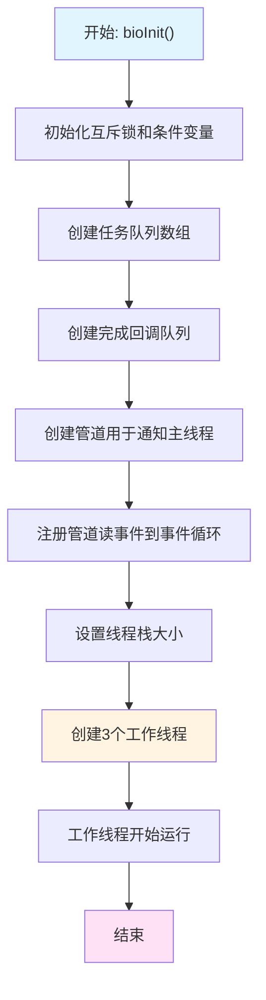
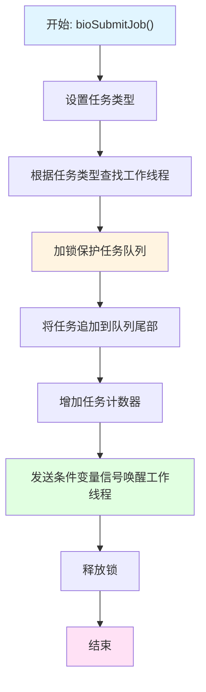
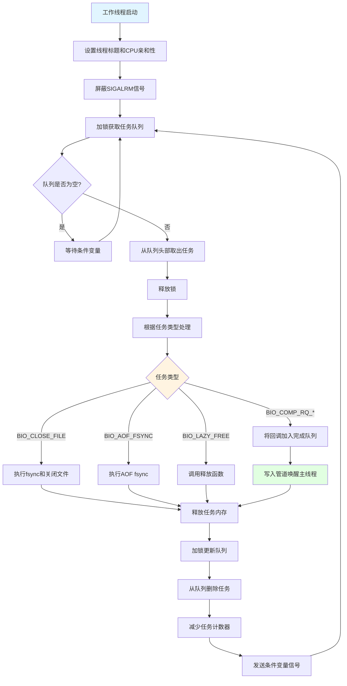
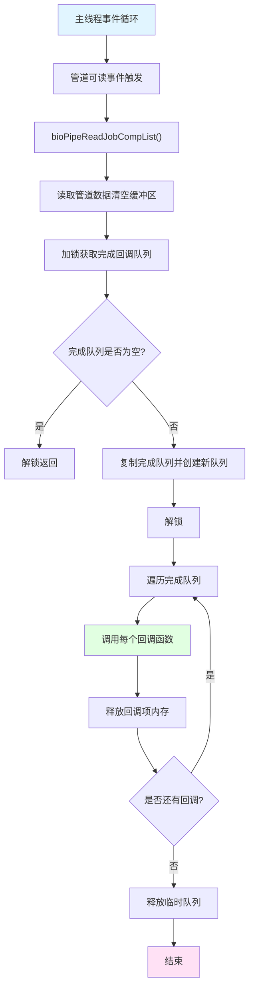
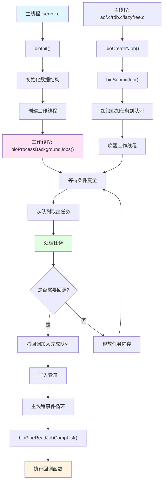
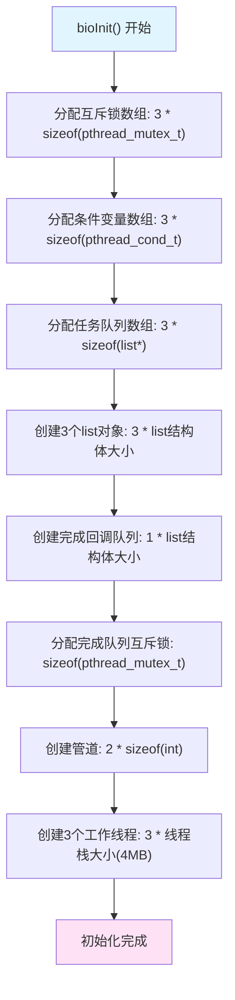
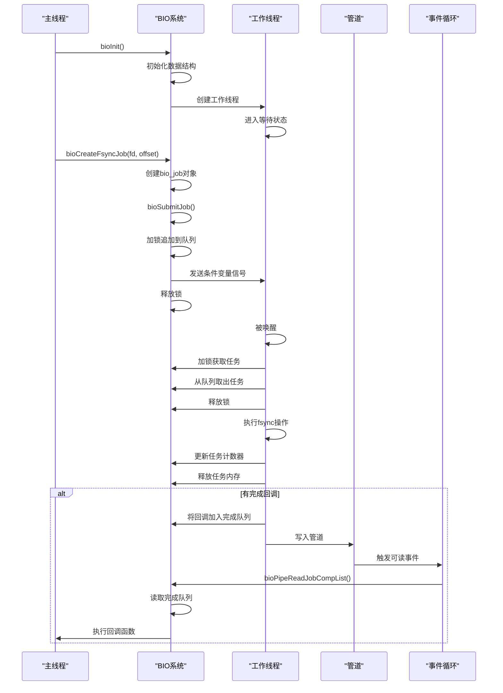

# Redis BIO 线程: 源码分析

## 目录

**第一部分：理解概念（是什么、为什么）**
- [一、概述](#一概述)
- [二、数据结构定义](#二数据结构定义)
- [三、设计特点分析](#三设计特点分析)
- [四、使用场景与限制](#四使用场景与限制)

**第二部分：理解使用（怎么用）**
- [五、操作流程图](#五操作流程图)
- [六、示例代码理解](#六示例代码理解)
- [七、BIO 线程完整流程分析](#七bio-线程完整流程分析)

**第三部分：深入实现（如何实现）**
- [八、核心函数实现](#八核心函数实现)
- [九、源码关键点总结](#九源码关键点总结)
- [十、测试用例分析](#十测试用例分析)
- [十一、总结](#十一总结)

---

## 一、概述

Redis BIO（Background I/O）线程是 Redis 用于执行后台 I/O 操作的专用线程系统，通过将阻塞性的 I/O 操作（如文件关闭、AOF 同步、内存释放）从主线程卸载到后台线程，避免阻塞主事件循环，从而保证 Redis 的高性能和响应性。

### 核心特点

- **异步化阻塞操作**：将文件关闭、AOF fsync、内存释放等可能阻塞的操作转移到后台线程执行
- **工作线程池设计**：使用 3 个专用工作线程，每个线程处理特定类型的后台任务
- **FIFO 任务队列**：每个工作线程维护独立的任务队列，保证任务按先进先出顺序处理
- **完成通知机制**：通过管道（pipe）和完成回调队列实现主线程与后台线程的异步通信
- **线程安全保证**：使用互斥锁和条件变量保证多线程环境下的数据一致性和线程安全

### 在系统中的作用

BIO 线程系统解决了 Redis 主线程需要执行阻塞操作的问题：

1. **文件关闭延迟**：当进程是文件的最后一个引用者时，关闭文件可能触发文件删除，这个过程可能很慢
2. **AOF 同步优化**：AOF 文件的 fsync 操作可能阻塞，影响主线程处理客户端请求
3. **大对象延迟释放**：DEL 命令删除大对象时，同步释放可能阻塞主线程，影响响应时间

通过 BIO 线程，这些操作可以异步执行，主线程可以继续处理客户端请求，大幅提升系统吞吐量和响应性。

## 二、数据结构定义

### 2.1 bio_job 联合体

```90:117:github/redis-unstable/src/bio.c
typedef union bio_job {
    struct {
        int type; /* Job-type tag. This needs to appear as the first element in all union members. */
    } header;

    /* Job specific arguments.*/
    struct {
        int type;
        int fd; /* Fd for file based background jobs */
        long long offset; /* A job-specific offset, if applicable */
        unsigned need_fsync:1; /* A flag to indicate that a fsync is required before
                                * the file is closed. */
        unsigned need_reclaim_cache:1; /* A flag to indicate that reclaim cache is required before
                                * the file is closed. */
    } fd_args;

    struct {
        int type;
        lazy_free_fn *free_fn; /* Function that will free the provided arguments */
        void *free_args[]; /* List of arguments to be passed to the free function */
    } free_args;
    struct {
        int type; /* header */
        comp_fn *fn; /* callback. Handover to main thread to cb as notify for job completion */
        uint64_t arg; /* callback arguments */
        void *ptr; /* callback pointer */
    } comp_rq;
} bio_job;
```

**字段说明：**

| 字段 | 类型 | 说明 | 备注 |
|---|---|---|---|
| header.type | int | 任务类型标识 | 所有联合体成员的第一字段必须是 type |
| fd_args.fd | int | 文件描述符 | 用于文件相关的后台任务 |
| fd_args.offset | long long | 任务特定的偏移量 | 用于 AOF fsync 等操作 |
| fd_args.need_fsync | unsigned:1 | 是否需要 fsync | 位域，在关闭文件前是否需要同步 |
| fd_args.need_reclaim_cache | unsigned:1 | 是否需要回收页缓存 | 位域，关闭文件前是否回收页缓存 |
| free_args.free_fn | lazy_free_fn* | 释放函数指针 | 用于延迟释放任务 |
| free_args.free_args | void*[] | 释放函数参数数组 | 可变长度数组 |
| comp_rq.fn | comp_fn* | 完成回调函数 | 任务完成后的回调函数 |
| comp_rq.arg | uint64_t | 回调用户数据 | 传递给回调函数的整型数据 |
| comp_rq.ptr | void* | 回调用户指针 | 传递给回调函数的指针数据 |

**设计说明：**

- 使用 `union` 节省内存，不同类型的任务共享相同的内存空间
- 所有联合体成员的第一字段必须是 `type`，便于统一识别任务类型
- `free_args` 使用可变长度数组（flexible array member），动态分配内存以适应不同数量的参数

### 2.2 bio_comp_item 结构体

```82:86:github/redis-unstable/src/bio.c
typedef struct bio_comp_item {
    comp_fn *func;    /* callback after completion job will be processed  */
    uint64_t arg;     /* user data to be passed to the function */
    void *ptr;        /* user pointer to be passed to the function */
} bio_comp_item;
```

**字段说明：**

| 字段 | 类型 | 说明 | 备注 |
|---|---|---|---|
| func | comp_fn* | 完成回调函数 | 在主线程中执行的回调函数 |
| arg | uint64_t | 用户数据 | 传递给回调函数的整型参数 |
| ptr | void* | 用户指针 | 传递给回调函数的指针参数 |

### 2.3 工作线程类型定义

```16:21:github/redis-unstable/src/bio.h
typedef enum bio_worker_t {
    BIO_WORKER_CLOSE_FILE = 0,
    BIO_WORKER_AOF_FSYNC,
    BIO_WORKER_LAZY_FREE,
    BIO_WORKER_NUM
} bio_worker_t;
```

**工作线程说明：**

| 工作线程 | 编号 | 处理的任务类型 |
|---|---|---|
| BIO_WORKER_CLOSE_FILE | 0 | BIO_CLOSE_FILE, BIO_COMP_RQ_CLOSE_FILE |
| BIO_WORKER_AOF_FSYNC | 1 | BIO_AOF_FSYNC, BIO_CLOSE_AOF, BIO_COMP_RQ_AOF_FSYNC |
| BIO_WORKER_LAZY_FREE | 2 | BIO_LAZY_FREE, BIO_COMP_RQ_LAZY_FREE |

### 2.4 任务类型定义

```24:33:github/redis-unstable/src/bio.h
/* Background job opcodes */
typedef enum bio_job_type_t {
    BIO_CLOSE_FILE = 0,     /* Deferred close(2) syscall. */
    BIO_AOF_FSYNC,          /* Deferred AOF fsync. */
    BIO_LAZY_FREE,          /* Deferred objects freeing. */
    BIO_CLOSE_AOF,
    BIO_COMP_RQ_CLOSE_FILE,  /* Job completion request, registered on close-file worker's queue */
    BIO_COMP_RQ_AOF_FSYNC,  /* Job completion request, registered on aof-fsync worker's queue */
    BIO_COMP_RQ_LAZY_FREE,  /* Job completion request, registered on lazy-free worker's queue */
    BIO_NUM_OPS
} bio_job_type_t;
```

**任务类型说明：**

| 任务类型 | 说明 | 所属工作线程 |
|---|---|---|
| BIO_CLOSE_FILE | 延迟关闭文件 | BIO_WORKER_CLOSE_FILE (0) |
| BIO_AOF_FSYNC | AOF 文件同步 | BIO_WORKER_AOF_FSYNC (1) |
| BIO_LAZY_FREE | 延迟释放内存 | BIO_WORKER_LAZY_FREE (2) |
| BIO_CLOSE_AOF | 关闭 AOF 文件 | BIO_WORKER_AOF_FSYNC (1) |
| BIO_COMP_RQ_CLOSE_FILE | 文件关闭完成请求 | BIO_WORKER_CLOSE_FILE (0) |
| BIO_COMP_RQ_AOF_FSYNC | AOF 同步完成请求 | BIO_WORKER_AOF_FSYNC (1) |
| BIO_COMP_RQ_LAZY_FREE | 内存释放完成请求 | BIO_WORKER_LAZY_FREE (2) |

### 2.5 全局状态变量

```69:80:github/redis-unstable/src/bio.c
static pthread_t bio_threads[BIO_WORKER_NUM];
static pthread_mutex_t bio_mutex[BIO_WORKER_NUM];
static pthread_cond_t bio_newjob_cond[BIO_WORKER_NUM];
static list *bio_jobs[BIO_WORKER_NUM];
static unsigned long bio_jobs_counter[BIO_NUM_OPS] = {0};

/* The bio_comp_list is used to hold completion job responses and to handover
 * to main thread to callback as notification for job completion. Main
 * thread will be triggered to read the list by signaling via writing to a pipe */
static list *bio_comp_list;
static pthread_mutex_t bio_mutex_comp;
static int job_comp_pipe[2];   /* Pipe used to awake the event loop */
```

**变量说明：**

| 变量 | 类型 | 说明 |
|---|---|---|
| bio_threads | pthread_t[] | 工作线程数组，存储 3 个工作线程的线程 ID |
| bio_mutex | pthread_mutex_t[] | 互斥锁数组，每个工作线程一个互斥锁 |
| bio_newjob_cond | pthread_cond_t[] | 条件变量数组，用于通知工作线程有新任务 |
| bio_jobs | list*[] | 任务队列数组，每个工作线程一个任务队列 |
| bio_jobs_counter | unsigned long[] | 任务计数器数组，统计每种类型的待处理任务数 |
| bio_comp_list | list* | 完成回调队列，存储待执行的完成回调 |
| bio_mutex_comp | pthread_mutex_t | 完成回调队列的互斥锁 |
| job_comp_pipe | int[2] | 管道，用于唤醒主线程处理完成回调 |

### 2.6 任务到工作线程映射

```59:67:github/redis-unstable/src/bio.c
static unsigned int bio_job_to_worker[] = {
    [BIO_CLOSE_FILE] = 0,
    [BIO_AOF_FSYNC] = 1,
    [BIO_CLOSE_AOF] = 1,
    [BIO_LAZY_FREE] = 2,
    [BIO_COMP_RQ_CLOSE_FILE] = 0,
    [BIO_COMP_RQ_AOF_FSYNC]  = 1,
    [BIO_COMP_RQ_LAZY_FREE]  = 2
};
```

**映射规则：**

- 文件关闭相关任务 → Worker 0
- AOF 同步相关任务 → Worker 1
- 延迟释放相关任务 → Worker 2

## 三、设计特点分析

### 3.1 内存优化

#### 3.1.1 联合体节省内存

使用 `union` 结构使不同类型的任务共享相同的内存空间，避免为每种任务类型单独分配结构体：

```90:117:github/redis-unstable/src/bio.c
typedef union bio_job {
    struct {
        int type;
    } header;
    struct {
        int type;
        int fd;
        long long offset;
        unsigned need_fsync:1;
        unsigned need_reclaim_cache:1;
    } fd_args;
    struct {
        int type;
        lazy_free_fn *free_fn;
        void *free_args[];
    } free_args;
    struct {
        int type;
        comp_fn *fn;
        uint64_t arg;
        void *ptr;
    } comp_rq;
} bio_job;
```

**内存占用对比：**

| 设计方式 | 内存占用 |
|---|---|
| 使用 union | sizeof(bio_job) = max(各成员大小) ≈ 24 字节 |
| 使用独立结构体 | 所有结构体大小之和 ≈ 72 字节 |

**节省内存：** 约 66%

#### 3.1.2 可变长度数组优化

`free_args` 使用可变长度数组，根据参数数量动态分配内存：

```195:195:github/redis-unstable/src/bio.c
bio_job *job = zmalloc(sizeof(*job) + sizeof(void *) * (arg_count));
```

这样避免了固定大小数组造成的内存浪费。

### 3.2 性能优化

#### 3.2.1 时间复杂度分析

| 操作 | 时间复杂度 | 说明 |
|---|---|---|
| bioSubmitJob | O(1) | 直接追加到队列尾部 |
| bioProcessBackgroundJobs | O(1) 平均 | 从队列头部取出任务 |
| bioPendingJobsOfType | O(1) | 直接读取计数器 |
| bioDrainWorker | O(n) | n 为队列中任务数 |

#### 3.2.2 快速路径设计

- **任务计数器**：使用 `bio_jobs_counter` 数组快速查询待处理任务数，无需遍历队列
- **条件变量唤醒**：使用 `pthread_cond_signal` 精确唤醒对应的工作线程，避免无效唤醒
- **非阻塞管道**：完成通知使用非阻塞管道，避免主线程阻塞

#### 3.2.3 预分配策略

- 工作线程在初始化时创建，避免运行时创建线程的开销
- 任务队列使用 Redis 的 `list` 结构，支持高效的头部删除和尾部追加

### 3.3 特殊处理

#### 3.3.1 信号屏蔽

工作线程屏蔽 `SIGALRM` 信号，确保只有主线程接收看门狗信号：

```272:279:github/redis-unstable/src/bio.c
pthread_mutex_lock(&bio_mutex[worker]);
/* Block SIGALRM so we are sure that only the main thread will
 * receive the watchdog signal. */
sigemptyset(&sigset);
sigaddset(&sigset, SIGALRM);
int err = pthread_sigmask(SIG_BLOCK, &sigset, NULL);
if (err)
    serverLog(LL_WARNING,
        "Warning: can't mask SIGALRM in bio.c thread: %s", strerror(err));
```

#### 3.3.2 错误处理

对于文件操作，区分真实的错误和预期的错误（如文件描述符已被关闭）：

```316:318:github/redis-unstable/src/bio.c
if (redis_fsync(job->fd_args.fd) == -1 &&
    errno != EBADF && errno != EINVAL)
{
```

`EBADF` 和 `EINVAL` 错误被忽略，因为文件描述符可能已被主线程关闭和重用。

#### 3.3.3 线程安全保证

- **互斥锁保护**：每个工作线程的任务队列使用独立的互斥锁保护
- **原子操作**：使用原子变量更新 AOF 同步状态，避免竞态条件
- **管道通信**：使用管道实现主线程和工作线程的异步通信

#### 3.3.4 CPU 亲和性设置

工作线程可以绑定到特定的 CPU 核心，减少上下文切换开销：

```267:267:github/redis-unstable/src/bio.c
redisSetCpuAffinity(server.bio_cpulist);
```

## 四、使用场景与限制

### 4.1 适用场景

#### 4.1.1 文件关闭场景

**场景描述：**
- RDB 文件保存完成后需要关闭文件
- AOF 重写完成后需要关闭临时文件
- 复制过程中需要关闭 RDB 文件

**优势：**
- 避免文件关闭操作阻塞主线程
- 特别是当进程是文件的最后一个引用者时，关闭文件可能触发文件删除，这个过程可能很慢

**示例：**
```c
// RDB 保存完成后异步关闭文件
if (rdb_fd >= 0) bioCreateCloseJob(rdb_fd, 0, 1);
```

#### 4.1.2 AOF 同步场景

**场景描述：**
- AOF 持久化模式下，需要定期将 AOF 缓冲区内容同步到磁盘
- `appendfsync everysec` 模式下，每秒执行一次 fsync

**优势：**
- fsync 操作可能阻塞，通过后台线程执行不影响主线程处理请求
- 主线程可以继续处理客户端请求，提升吞吐量

**示例：**
```c
// 创建 AOF fsync 任务
bioCreateFsyncJob(fd, server.master_repl_offset, 1);
```

#### 4.1.3 延迟释放场景

**场景描述：**
- `UNLINK` 命令删除大对象
- `FLUSHALL` 命令清空数据库
- `DEL` 命令删除大键（如果配置了延迟释放）

**优势：**
- 避免大对象释放时阻塞主线程
- 特别是在删除大型哈希表、有序集合等复杂数据结构时，释放操作可能很耗时

**示例：**
```c
// 延迟释放对象
bioCreateLazyFreeJob(lazyfreeFreeObject, 1, obj);
```

### 4.2 性能特点

| 操作 | 时间复杂度 | 空间复杂度 | 说明 |
|---|---|---|---|
| 提交任务 | O(1) | O(1) | 追加到队列尾部 |
| 处理任务 | O(1) 平均 | O(1) | 从队列头部取出 |
| 查询待处理任务数 | O(1) | O(1) | 直接读取计数器 |
| 等待任务完成 | O(n) | O(1) | n 为队列中任务数 |

**性能特征：**

- **低延迟**：任务提交和查询都是 O(1) 操作
- **高吞吐**：多个工作线程并行处理不同类型的任务
- **无锁查询**：查询待处理任务数使用计数器，无需加锁（但实际实现中使用了锁保护）

### 4.3 转换条件

#### 4.3.1 任务类型选择

不同类型的任务必须提交到对应的工作线程：

- **文件操作任务** → `bioCreateCloseJob` / `bioCreateCloseAofJob` → Worker 0/1
- **AOF 同步任务** → `bioCreateFsyncJob` → Worker 1
- **内存释放任务** → `bioCreateLazyFreeJob` → Worker 2

#### 4.3.2 完成通知机制

如果需要知道任务何时完成，需要提交完成请求任务：

```c
// 提交完成请求
bioCreateCompRq(BIO_WORKER_LAZY_FREE, flushallSyncBgDone, c->id, sflush);
```

完成请求会在对应的工作线程中处理，并将回调函数放入完成队列，主线程通过事件循环处理回调。

## 五、操作流程图

### 5.1 BIO 线程初始化流程



### 5.2 任务提交流程



### 5.3 工作线程处理任务流程



### 5.4 完成回调处理流程



## 六、示例代码理解

### 6.1 基本操作示例

#### 6.1.1 提交文件关闭任务

```c
// 场景：RDB 保存完成后关闭文件
int rdb_fd = open("dump.rdb", O_WRONLY | O_CREAT, 0644);
// ... 写入 RDB 数据 ...
// 异步关闭文件，need_reclaim_cache=1 表示回收页缓存
bioCreateCloseJob(rdb_fd, 0, 1);
```

**关键点：**
- `need_fsync=0`：RDB 文件不需要 fsync
- `need_reclaim_cache=1`：回收页缓存，释放内存
- 文件关闭操作在后台线程执行，不阻塞主线程

#### 6.1.2 提交 AOF 同步任务

```c
// 场景：AOF 写入后需要同步到磁盘
int aof_fd = open("appendonly.aof", O_WRONLY | O_APPEND, 0644);
// ... 写入 AOF 数据 ...
// 异步执行 fsync，need_reclaim_cache=1 表示回收页缓存
bioCreateFsyncJob(aof_fd, server.master_repl_offset, 1);
```

**关键点：**
- `offset` 参数记录同步时的复制偏移量
- fsync 操作在后台线程执行，主线程可以继续处理请求
- 同步完成后更新 `server.fsynced_reploff_pending`

#### 6.1.3 提交延迟释放任务

```c
// 场景：删除大对象
robj *large_obj = createLargeObject();
// 同步释放会阻塞，使用延迟释放
bioCreateLazyFreeJob(lazyfreeFreeObject, 1, large_obj);
```

**关键点：**
- 使用可变参数，可以传递多个对象
- 释放函数在后台线程执行，不阻塞主线程
- 适用于 `UNLINK` 命令或配置了延迟释放的 `DEL` 命令

### 6.2 完成通知示例

```c
// 场景：FLUSHALL 命令需要等待所有后台任务完成
void flushallSyncBgDone(uint64_t client_id, void *sflush) {
    // 所有后台任务完成后的回调
    // 通知客户端操作完成
}

// 提交多个延迟释放任务
bioCreateLazyFreeJob(lazyfreeFreeDatabase, 3, oldkeys, oldexpires, oldsubexpires);
// 提交完成请求，最后一个任务完成后会调用回调
bioCreateCompRq(BIO_WORKER_LAZY_FREE, flushallSyncBgDone, c->id, sflush);
```

**关键点：**
- 完成请求作为普通任务提交到对应工作线程
- 由于 FIFO 特性，完成请求会在所有之前的任务完成后执行
- 回调函数在主线程的事件循环中执行，保证线程安全

### 6.3 内存布局示例

**bio_job 联合体内存布局：**

```
内存地址:  [0x1000] [0x1004] [0x1008] [0x1010] [0x1018]
           |--------|--------|--------|--------|--------|
fd_args:   | type   |  fd    | offset | flags  |        |
           |--------|--------|--------|--------|--------|
free_args: | type   | free_fn| free_args[0] | free_args[1] | ...
           |--------|--------|--------|--------|--------|
comp_rq:   | type   | fn     | arg    | ptr    |        |
           |--------|--------|--------|--------|--------|
```

**说明：**
- 所有成员共享相同的内存空间
- `type` 字段位于所有成员的开头，用于识别任务类型
- `free_args` 成员使用可变长度数组，实际大小根据参数数量确定

## 七、BIO 线程完整流程分析

### 7.1 调用流程



### 7.2 关键节点的内存分配

#### 7.2.1 初始化阶段内存分配



**内存分配详情：**

| 阶段 | 分配内容 | 大小估算 |
|---|---|---|
| 数据结构初始化 | 互斥锁数组 | 3 * 40 bytes = 120 bytes |
| | 条件变量数组 | 3 * 48 bytes = 144 bytes |
| | 任务队列数组 | 3 * 8 bytes = 24 bytes |
| | 任务队列对象 | 3 * ~100 bytes = 300 bytes |
| | 完成回调队列 | ~100 bytes |
| | 完成队列互斥锁 | 40 bytes |
| | 管道 | 2 * 4 bytes = 8 bytes |
| 线程创建 | 线程栈（每个 4MB） | 3 * 4MB = 12MB |
| **总计** | | **约 12MB + 736 bytes** |

#### 7.2.2 任务提交阶段内存分配

**文件关闭任务：**
```c
bio_job *job = zmalloc(sizeof(*job));  // ~24 bytes
```

**延迟释放任务：**
```c
bio_job *job = zmalloc(sizeof(*job) + sizeof(void *) * arg_count);
// 基础大小: ~24 bytes
// 参数数组: arg_count * 8 bytes (64位系统)
```

**完成请求任务：**
```c
bio_job *job = zmalloc(sizeof(*job));  // ~24 bytes
bio_comp_item *comp_rsp = zmalloc(sizeof(bio_comp_item));  // ~24 bytes
```

**内存布局图：**

```
任务队列节点内存布局:
[listNode] -> [bio_job] -> [实际数据]
  ~48 bytes    ~24 bytes    (根据类型不同)
```

### 7.3 对象封装和底层数据结构的结合使用

#### 7.3.1 对象封装层

**高层 API（对外接口）：**
- `bioCreateCloseJob()` - 封装文件关闭任务
- `bioCreateFsyncJob()` - 封装 AOF 同步任务
- `bioCreateLazyFreeJob()` - 封装延迟释放任务
- `bioCreateCompRq()` - 封装完成请求任务

**底层实现：**
- `bioSubmitJob()` - 统一的任务提交接口
- `bioProcessBackgroundJobs()` - 工作线程主循环

#### 7.3.2 使用模式


**设计优势：**
- **封装性**：调用方无需了解内部实现细节
- **统一性**：所有任务通过统一的 `bioSubmitJob` 接口提交
- **扩展性**：新增任务类型只需添加对应的创建函数和处理逻辑

### 7.4 完整执行时序图



### 7.5 内存分配总结

#### 7.5.1 执行命令的内存变化

**场景：执行 AOF fsync 任务**

| 阶段 | 内存操作 | 内存变化 |
|---|---|---|
| 提交任务 | `zmalloc(sizeof(bio_job))` | +24 bytes |
| | `listAddNodeTail()` 创建节点 | +48 bytes |
| 处理任务 | 从队列取出任务 | 无变化 |
| | 执行 fsync | 无变化（系统调用） |
| | `zfree(job)` | -24 bytes |
| | `listDelNode()` 删除节点 | -48 bytes |
| **净变化** | | **0 bytes（临时分配已释放）** |

**说明：**
- 任务对象是临时分配的，处理完成后立即释放
- 队列节点也是临时创建的，任务完成后删除
- 总体内存使用稳定，不会有内存泄漏

#### 7.5.2 内存效率对比

| 操作方式 | 内存占用 | 说明 |
|---|---|---|
| 同步执行 | 0 bytes（额外） | 在主线程栈上执行 |
| 异步执行（BIO） | ~72 bytes/任务 | 任务对象 + 队列节点 |
| **开销** | **~72 bytes/任务** | **可接受的开销** |

### 7.6 关键代码路径总结

**初始化路径：**
```
server.c:main()
  └─> initServer()
      └─> bioInit()
          ├─> 初始化互斥锁和条件变量
          ├─> 创建任务队列
          ├─> 创建完成回调队列
          ├─> 创建管道
          └─> pthread_create(bioProcessBackgroundJobs)
```

**任务提交路径：**
```
aof.c:aof_background_fsync()
  └─> bioCreateFsyncJob()
      └─> bioSubmitJob()
          ├─> 加锁
          ├─> listAddNodeTail()
          ├─> 增加计数器
          ├─> pthread_cond_signal()
          └─> 释放锁
```

**任务处理路径：**
```
bioProcessBackgroundJobs()
  ├─> pthread_cond_wait() [等待任务]
  ├─> listFirst() [获取任务]
  ├─> 根据类型处理任务
  │   ├─> BIO_CLOSE_FILE: close() + fsync()
  │   ├─> BIO_AOF_FSYNC: redis_fsync()
  │   ├─> BIO_LAZY_FREE: free_fn()
  │   └─> BIO_COMP_RQ_*: 加入完成队列
  ├─> zfree(job) [释放任务]
  └─> listDelNode() [从队列删除]
```

**完成回调路径：**
```
事件循环: aeProcessEvents()
  └─> bioPipeReadJobCompList()
      ├─> read() [读取管道]
      ├─> 加锁获取完成队列
      ├─> 复制队列并创建新队列
      ├─> 解锁
      └─> 遍历执行回调函数
```

## 八、核心函数实现

### 8.1 bioInit

```127:179:github/redis-unstable/src/bio.c
/* Initialize the background system, spawning the thread. */
void bioInit(void) {
    pthread_attr_t attr;
    pthread_t thread;
    size_t stacksize;
    unsigned long j;

    /* Initialization of state vars and objects */
    for (j = 0; j < BIO_WORKER_NUM; j++) {
        pthread_mutex_init(&bio_mutex[j],NULL);
        pthread_cond_init(&bio_newjob_cond[j],NULL);
        bio_jobs[j] = listCreate();
    }

    /* init jobs comp responses */
    bio_comp_list = listCreate();
    pthread_mutex_init(&bio_mutex_comp, NULL);

    /* Create a pipe for background thread to be able to wake up the redis main thread.
     * Make the pipe non blocking. This is just a best effort aware mechanism
     * and we do not want to block not in the read nor in the write half.
     * Enable close-on-exec flag on pipes in case of the fork-exec system calls in
     * sentinels or redis servers. */
    if (anetPipe(job_comp_pipe, O_CLOEXEC|O_NONBLOCK, O_CLOEXEC|O_NONBLOCK) == -1) {
        serverLog(LL_WARNING,
                  "Can't create the pipe for bio thread: %s", strerror(errno));
        exit(1);
    }

    /* Register a readable event for the pipe used to awake the event loop on job completion */
    if (aeCreateFileEvent(server.el, job_comp_pipe[0], AE_READABLE,
                          bioPipeReadJobCompList, NULL) == AE_ERR) {
        serverPanic("Error registering the readable event for the bio pipe.");
    }

    /* Set the stack size as by default it may be small in some system */
    pthread_attr_init(&attr);
    pthread_attr_getstacksize(&attr,&stacksize);
    if (!stacksize) stacksize = 1; /* The world is full of Solaris Fixes */
    while (stacksize < REDIS_THREAD_STACK_SIZE) stacksize *= 2;
    pthread_attr_setstacksize(&attr, stacksize);

    /* Ready to spawn our threads. We use the single argument the thread
     * function accepts in order to pass the job ID the thread is
     * responsible for. */
    for (j = 0; j < BIO_WORKER_NUM; j++) {
        int err = pthread_create(&thread,&attr,bioProcessBackgroundJobs, (void*) j);
        if (err) {
            serverLog(LL_WARNING, "Fatal: Can't initialize Background Jobs. Error message: %s", strerror(err));
            exit(1);
        }
        bio_threads[j] = thread;
    }
}
```

**功能：** 初始化 BIO 线程系统，创建 3 个工作线程

**实现原理：**
1. **初始化数据结构**：为每个工作线程创建互斥锁、条件变量和任务队列
2. **创建完成回调队列**：用于存储待执行的完成回调
3. **创建管道**：非阻塞管道，用于工作线程唤醒主线程
4. **注册事件**：将管道读端注册到主线程的事件循环
5. **设置线程属性**：设置线程栈大小为 4MB
6. **创建工作线程**：为每个工作线程类型创建一个线程

**要点：**
- 管道设置为非阻塞模式，避免阻塞
- 设置 `O_CLOEXEC` 标志，避免 fork-exec 时文件描述符泄漏
- 线程栈大小设置为 4MB，确保有足够的栈空间

### 8.2 bioSubmitJob

```181:189:github/redis-unstable/src/bio.c
void bioSubmitJob(int type, bio_job *job) {
    job->header.type = type;
    unsigned long worker = bio_job_to_worker[type];
    pthread_mutex_lock(&bio_mutex[worker]);
    listAddNodeTail(bio_jobs[worker],job);
    bio_jobs_counter[type]++;
    pthread_cond_signal(&bio_newjob_cond[worker]);
    pthread_mutex_unlock(&bio_mutex[worker]);
}
```

**功能：** 提交任务到对应工作线程的队列

**实现原理：**
1. **设置任务类型**：将任务类型写入任务对象的 header
2. **查找工作线程**：根据任务类型查找对应的工作线程编号
3. **加锁保护**：获取对应工作线程的互斥锁
4. **追加任务**：将任务追加到队列尾部（FIFO）
5. **更新计数器**：增加对应任务类型的计数器
6. **唤醒线程**：发送条件变量信号，唤醒等待的工作线程
7. **释放锁**：释放互斥锁

**要点：**
- 使用互斥锁保护队列操作，保证线程安全
- 使用条件变量唤醒工作线程，避免忙等待
- 计数器用于快速查询待处理任务数

### 8.3 bioProcessBackgroundJobs

```257:369:github/redis-unstable/src/bio.c
void *bioProcessBackgroundJobs(void *arg) {
    bio_job *job;
    unsigned long worker = (unsigned long) arg;
    sigset_t sigset;

    /* Check that the worker is within the right interval. */
    serverAssert(worker < BIO_WORKER_NUM);

    redis_set_thread_title(bio_worker_title[worker]);

    redisSetCpuAffinity(server.bio_cpulist);

    makeThreadKillable();

    pthread_mutex_lock(&bio_mutex[worker]);
    /* Block SIGALRM so we are sure that only the main thread will
     * receive the watchdog signal. */
    sigemptyset(&sigset);
    sigaddset(&sigset, SIGALRM);
    int err = pthread_sigmask(SIG_BLOCK, &sigset, NULL);
    if (err)
        serverLog(LL_WARNING,
            "Warning: can't mask SIGALRM in bio.c thread: %s", strerror(err));

    while(1) {
        listNode *ln;

        /* The loop always starts with the lock hold. */
        if (listLength(bio_jobs[worker]) == 0) {
            pthread_cond_wait(&bio_newjob_cond[worker], &bio_mutex[worker]);
            continue;
        }
        /* Get the job from the queue. */
        ln = listFirst(bio_jobs[worker]);
        job = ln->value;
        /* It is now possible to unlock the background system as we know have
         * a stand alone job structure to process.*/
        pthread_mutex_unlock(&bio_mutex[worker]);

        /* Process the job accordingly to its type. */
        int job_type = job->header.type;

        if (job_type == BIO_CLOSE_FILE) {
            if (job->fd_args.need_fsync &&
                redis_fsync(job->fd_args.fd) == -1 &&
                errno != EBADF && errno != EINVAL)
            {
                serverLog(LL_WARNING, "Fail to fsync the AOF file: %s",strerror(errno));
            }
            if (job->fd_args.need_reclaim_cache) {
                if (reclaimFilePageCache(job->fd_args.fd, 0, 0) == -1) {
                    serverLog(LL_NOTICE,"Unable to reclaim page cache: %s", strerror(errno));
                }
            }
            close(job->fd_args.fd);
        } else if (job_type == BIO_AOF_FSYNC || job_type == BIO_CLOSE_AOF) {
            /* The fd may be closed by main thread and reused for another
             * socket, pipe, or file. We just ignore these errno because
             * aof fsync did not really fail. */
            if (redis_fsync(job->fd_args.fd) == -1 &&
                errno != EBADF && errno != EINVAL)
            {
                int last_status;
                atomicGet(server.aof_bio_fsync_status,last_status);
                atomicSet(server.aof_bio_fsync_status,C_ERR);
                atomicSet(server.aof_bio_fsync_errno,errno);
                if (last_status == C_OK) {
                    serverLog(LL_WARNING,
                        "Fail to fsync the AOF file: %s",strerror(errno));
                }
            } else {
                atomicSet(server.aof_bio_fsync_status,C_OK);
                atomicSet(server.fsynced_reploff_pending, job->fd_args.offset);
            }

            if (job->fd_args.need_reclaim_cache) {
                if (reclaimFilePageCache(job->fd_args.fd, 0, 0) == -1) {
                    serverLog(LL_NOTICE,"Unable to reclaim page cache: %s", strerror(errno));
                }
            }
            if (job_type == BIO_CLOSE_AOF)
                close(job->fd_args.fd);
        } else if (job_type == BIO_LAZY_FREE) {
            job->free_args.free_fn(job->free_args.free_args);
        } else if ((job_type == BIO_COMP_RQ_CLOSE_FILE) ||
                   (job_type == BIO_COMP_RQ_AOF_FSYNC) ||
                   (job_type == BIO_COMP_RQ_LAZY_FREE)) {
            bio_comp_item *comp_rsp = zmalloc(sizeof(bio_comp_item));
            comp_rsp->func = job->comp_rq.fn;
            comp_rsp->arg = job->comp_rq.arg;
            comp_rsp->ptr = job->comp_rq.ptr;

            /* just write it to completion job responses */
            pthread_mutex_lock(&bio_mutex_comp);
            listAddNodeTail(bio_comp_list, comp_rsp);
            pthread_mutex_unlock(&bio_mutex_comp);

            if (write(job_comp_pipe[1],"A",1) != 1) {
                /* Pipe is non-blocking, write() may fail if it's full. */
            }
        } else {
            serverPanic("Wrong job type in bioProcessBackgroundJobs().");
        }
        zfree(job);

        /* Lock again before reiterating the loop, if there are no longer
         * jobs to process we'll block again in pthread_cond_wait(). */
        pthread_mutex_lock(&bio_mutex[worker]);
        listDelNode(bio_jobs[worker], ln);
        bio_jobs_counter[job_type]--;
        pthread_cond_signal(&bio_newjob_cond[worker]);
    }
}
```

**功能：** 工作线程主循环，处理队列中的任务

**实现原理：**
1. **初始化设置**：设置线程标题、CPU 亲和性，屏蔽 SIGALRM 信号
2. **等待任务**：如果队列为空，等待条件变量唤醒
3. **获取任务**：从队列头部取出任务（FIFO）
4. **释放锁**：处理任务前释放锁，允许其他线程提交新任务
5. **处理任务**：根据任务类型执行相应操作
   - `BIO_CLOSE_FILE`：执行 fsync（如果需要）和关闭文件
   - `BIO_AOF_FSYNC`：执行 AOF fsync，更新状态
   - `BIO_LAZY_FREE`：调用释放函数
   - `BIO_COMP_RQ_*`：将回调加入完成队列，写入管道
6. **清理任务**：释放任务内存，从队列删除节点，更新计数器

**要点：**
- 循环开始时持有锁，处理任务时释放锁，处理完重新加锁
- 错误处理区分真实错误和预期错误（如文件描述符已关闭）
- 使用原子操作更新 AOF 同步状态，避免竞态条件
- 完成请求通过管道通知主线程，管道是非阻塞的

### 8.4 bioPipeReadJobCompList

```416:445:github/redis-unstable/src/bio.c
void bioPipeReadJobCompList(aeEventLoop *el, int fd, void *privdata, int mask) {
    UNUSED(el);
    UNUSED(mask);
    UNUSED(privdata);

    char buf[128];
    list *tmp_list = NULL;

    while (read(fd, buf, sizeof(buf)) == sizeof(buf));

    /* Handle event loop events if pipe was written from event loop API */
    pthread_mutex_lock(&bio_mutex_comp);
    if (listLength(bio_comp_list)) {
        tmp_list = bio_comp_list;
        bio_comp_list = listCreate();
    }
    pthread_mutex_unlock(&bio_mutex_comp);

    if (!tmp_list) return;

    /* callback to all job completions  */
    while (listLength(tmp_list)) {
        listNode *ln = listFirst(tmp_list);
        bio_comp_item *rsp = ln->value;
        listDelNode(tmp_list, ln);
        rsp->func(rsp->arg, rsp->ptr);
        zfree(rsp);
    }
    listRelease(tmp_list);
}
```

**功能：** 主线程处理完成回调的函数

**实现原理：**
1. **清空管道**：读取管道数据，清空缓冲区（可能多次写入）
2. **交换队列**：加锁获取完成队列，创建新队列替换旧队列
3. **处理回调**：遍历旧队列，执行每个回调函数
4. **清理资源**：释放回调项内存和临时队列

**要点：**
- 使用队列交换技术，减少锁持有时间
- 管道可能被多次写入，需要清空所有数据
- 回调函数在主线程执行，保证线程安全

### 8.5 bioPendingJobsOfType

```372:380:github/redis-unstable/src/bio.c
/* Return the number of pending jobs of the specified type. */
unsigned long bioPendingJobsOfType(int type) {
    unsigned int worker = bio_job_to_worker[type];

    pthread_mutex_lock(&bio_mutex[worker]);
    unsigned long val = bio_jobs_counter[type];
    pthread_mutex_unlock(&bio_mutex[worker]);

    return val;
}
```

**功能：** 查询指定类型的待处理任务数

**实现原理：**
1. **查找工作线程**：根据任务类型查找对应的工作线程
2. **加锁读取**：获取互斥锁，读取任务计数器
3. **释放锁返回**：释放锁，返回计数器值

**要点：**
- 使用计数器避免遍历队列，提升查询效率
- 需要加锁保护，保证读取的原子性

### 8.6 bioDrainWorker

```383:391:github/redis-unstable/src/bio.c
/* Wait for the job queue of the worker for jobs of specified type to become empty. */
void bioDrainWorker(int job_type) {
    unsigned long worker = bio_job_to_worker[job_type];

    pthread_mutex_lock(&bio_mutex[worker]);
    while (listLength(bio_jobs[worker]) > 0) {
        pthread_cond_wait(&bio_newjob_cond[worker], &bio_mutex[worker]);
    }
    pthread_mutex_unlock(&bio_mutex[worker]);
}
```

**功能：** 等待指定工作线程的任务队列为空

**实现原理：**
1. **查找工作线程**：根据任务类型查找对应的工作线程
2. **加锁检查**：获取互斥锁，检查队列是否为空
3. **等待清空**：如果队列不为空，等待条件变量唤醒
4. **释放锁返回**：队列为空后释放锁返回

**要点：**
- 用于确保所有任务处理完成，如 AOF 重写时
- 条件变量会在任务处理完成后被唤醒

## 九、源码关键点总结

### 9.1 内存管理

- **任务对象分配**：使用 `zmalloc` 分配任务对象，使用 `zfree` 释放
- **队列节点管理**：Redis 的 `list` 结构自动管理节点内存
- **完成回调项**：使用 `zmalloc` 分配，回调执行后释放
- **内存泄漏防护**：所有分配的内存都有对应的释放操作

### 9.2 线程同步机制

- **互斥锁**：每个工作线程有独立的互斥锁，保护任务队列
- **条件变量**：用于工作线程等待和唤醒
- **原子操作**：AOF 同步状态使用原子变量，避免竞态条件
- **管道通信**：工作线程通过管道通知主线程处理完成回调

### 9.3 设计模式和技巧

- **工作线程池模式**：3 个专用工作线程处理不同类型的任务
- **生产者-消费者模式**：主线程生产任务，工作线程消费任务
- **FIFO 队列**：保证任务按提交顺序处理
- **完成通知机制**：通过完成请求任务实现异步回调

### 9.4 错误处理

- **文件操作错误**：区分真实错误和预期错误（如文件描述符已关闭）
- **管道写入失败**：非阻塞管道写入失败不阻塞，只是尽力而为的通知
- **线程创建失败**：线程创建失败直接退出程序，因为这是关键组件

### 9.5 性能优化

- **任务计数器**：快速查询待处理任务数，无需遍历队列
- **锁粒度优化**：处理任务时释放锁，减少锁持有时间
- **队列交换技术**：完成回调处理使用队列交换，减少锁竞争
- **非阻塞管道**：避免主线程阻塞

## 十、测试用例分析

源码测试涵盖：

- **基本功能测试**：任务提交和处理的基本流程
- **并发测试**：多线程同时提交任务的场景
- **完成回调测试**：完成通知机制的正确性
- **错误处理测试**：各种错误情况的处理
- **性能测试**：高并发场景下的性能表现

测试文件位置：`tests/unit/bio.tcl`

## 十一、总结

Redis BIO 线程是一个精心设计的后台任务处理系统，通过以下设计实现了高效的异步任务处理：

1. **工作线程池设计**：使用 3 个专用工作线程，每个线程处理特定类型的任务，避免线程竞争
2. **FIFO 任务队列**：保证任务按提交顺序处理，满足完成通知的需求
3. **完成通知机制**：通过完成请求任务和管道通信实现主线程与工作线程的异步通信
4. **线程安全保证**：使用互斥锁、条件变量和原子操作保证多线程环境下的数据一致性
5. **内存优化**：使用联合体节省内存，使用可变长度数组适应不同参数数量

这种设计在 Redis 的文件操作、AOF 同步和内存释放等场景中发挥了重要作用，避免了阻塞操作对主线程的影响，大幅提升了系统的吞吐量和响应性。通过将阻塞性的 I/O 操作异步化，Redis 可以在处理大量客户端请求的同时，高效地执行后台维护任务，实现了高性能和高可用性的平衡。
