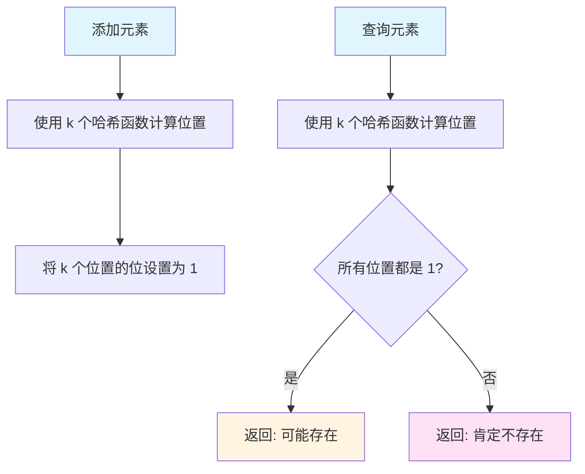
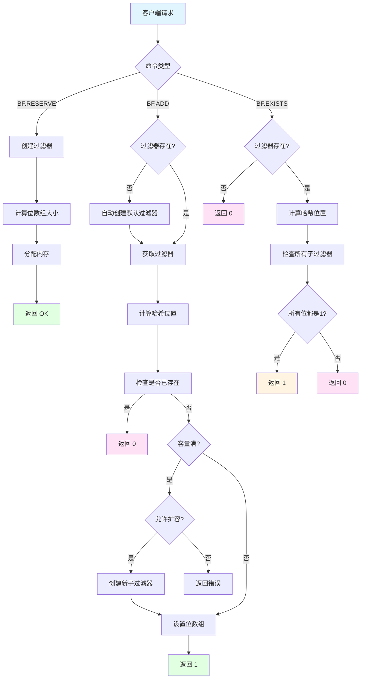

# Redis Bloom Filter: 原理与应用

## 目录

- [一、概述](#一概述)
- [二、Bloom Filter 基本原理](#二bloom-filter-基本原理)
- [三、Redis Bloom Filter 实现特点](#三redis-bloom-filter-实现特点)
- [四、Redis Bloom Filter 命令详解](#四redis-bloom-filter-命令详解)
- [五、使用场景与应用示例](#五使用场景与应用示例)
- [六、性能与内存分析](#六性能与内存分析)
- [七、最佳实践](#七最佳实践)
- [八、常见问题](#八常见问题)
- [九、总结](#九总结)

---

## 一、概述

Bloom Filter（布隆过滤器）是一种空间高效的概率性数据结构，用于判断一个元素是否**可能**存在于集合中。Redis Bloom Filter 是 RedisBloom 模块提供的实现，提供了完整的布隆过滤器功能。

### 核心特点

- **空间高效**：使用位数组存储，比存储完整数据节省大量内存
- **查询快速**：时间复杂度为 O(k)，k 为哈希函数数量（通常 5-10）
- **假阳性可能**：可能误判不存在的元素为存在，但**不会漏判存在的元素**
- **不支持删除**：传统布隆过滤器不支持删除操作（Redis 有 Cuckoo Filter 支持删除）
- **可扩展架构**：基于 Scalable Bloom Filter，支持动态扩容

### 在 Redis 中的实现

Redis Bloom Filter 作为 **Redis 模块**实现，需要加载 `RedisBloom` 模块后才能使用。它提供了完整的命令接口、持久化支持和集群兼容性。

---

## 二、Bloom Filter 基本原理

### 2.1 数据结构

Bloom Filter 由两部分组成：

1. **位数组（Bit Array）**：长度为 m 的二进制数组，初始值全为 0
2. **k 个哈希函数**：将任意元素映射到 k 个不同的位置（范围：0 到 m-1）

```
位数组示例（m=16, k=3）：
┌─────────────────────────────────┐
│ 0 0 0 0 0 0 0 0 0 0 0 0 0 0 0 0 │ 初始状态
└─────────────────────────────────┘
```

### 2.2 添加元素（ADD）

添加元素时，使用 k 个哈希函数计算出 k 个位置，将这些位置的位设置为 1：

```
添加元素 "apple"：
1. 哈希函数1 → 位置 2
2. 哈希函数2 → 位置 7
3. 哈希函数3 → 位置 13

结果：
┌─────────────────────────────────┐
│ 0 0 1 0 0 0 0 1 0 0 0 0 0 1 0 0 │
└─────────────────────────────────┘
     ↑       ↑               ↑
   位2     位7            位13
```

### 2.3 查询元素（EXISTS）

查询元素时，同样计算 k 个位置，检查这些位置是否都为 1：

- **如果所有位置都是 1** → 元素**可能存在**（可能是假阳性）
- **如果任意位置是 0** → 元素**肯定不存在**

```
查询 "apple"：
位2=1, 位7=1, 位13=1 → 返回 1（存在）

查询 "banana"：
假设：位5=0 → 返回 0（不存在）
```

### 2.4 假阳性原理

假阳性（False Positive）发生的场景：

```
初始状态：添加了 "apple"
┌─────────────────────────────────┐
│ 0 0 1 0 0 0 0 1 0 0 0 0 0 1 0 0 │
└─────────────────────────────────┘

查询 "orange"：
假设哈希结果：位2=1（被apple占用）, 位7=1（被apple占用）, 位11=1
但位11实际未被任何元素设置为1 → 返回 0（正确）

查询 "berry"：
假设哈希结果：位2=1（被apple占用）, 位7=1（被apple占用）, 位13=1（被apple占用）
所有位都是1 → 返回 1（假阳性！"berry"实际不存在）
```

**关键理解：**
- ✅ **假阴性（False Negative）不可能**：如果元素存在，它的所有位都已被设置为 1
- ⚠️ **假阳性可能发生**：其他元素可能恰好覆盖了相同的位组合

### 2.5 数学原理

#### 2.5.1 参数计算公式

给定以下参数：
- **n**：预期元素数量
- **p**：目标错误率（假阳性率）
- **m**：位数组大小
- **k**：哈希函数数量

计算公式：

```
位数组大小：m = -n × ln(p) / (ln(2)²)
哈希函数数：k = (m/n) × ln(2) ≈ 0.693 × (m/n)
实际错误率：p ≈ (1 - e^(-kn/m))^k
```

#### 2.5.2 计算示例

假设需要存储 100 万个元素，错误率 1%：

```
m = -1,000,000 × ln(0.01) / (ln(2)²)
  = -1,000,000 × (-4.605) / 0.480
  ≈ 9,588,000 位
  ≈ 1.14 MB

k = ceil(0.693 × 9.588) ≈ 7 个哈希函数
```

**内存对比：**
- 存储 100 万个字符串（平均 20 字节）→ 约 20 MB
- Bloom Filter → 约 1.14 MB
- **节省约 94% 内存！**

### 2.6 流程图



---

## 三、Redis Bloom Filter 实现特点

### 3.1 Scalable Bloom Filter 架构

RedisBloom 使用 **Scalable Bloom Filter** 设计，支持动态扩容：

```
传统 Bloom Filter：
┌─────────────────┐
│  固定大小位数组  │  ← 容量固定，无法扩容
└─────────────────┘

Scalable Bloom Filter：
┌─────────────────┐
│  子过滤器 1      │  ← 容量 10K，错误率 0.01
├─────────────────┤
│  子过滤器 2      │  ← 容量 20K，错误率 0.005
├─────────────────┤
│  子过滤器 3      │  ← 容量 40K，错误率 0.0025
└─────────────────┘
```

**优势：**
- ✅ 不需要准确估计初始容量
- ✅ 自动扩容，无需手动管理
- ✅ 整体错误率可控（通过错误率递减机制）

### 3.2 错误率控制机制

每次扩容时，新子过滤器的错误率按 **0.5 倍递减**：

```
初始：子过滤器1（错误率 0.01）
扩容：子过滤器2（错误率 0.005 = 0.01 × 0.5）
扩容：子过滤器3（错误率 0.0025 = 0.005 × 0.5）
```

**为什么有效？**
- 元素在不同子过滤器中的分布不均
- 新元素主要在最新子过滤器中
- 错误率递减保证整体错误率 ≤ 初始设定值

### 3.3 双重哈希优化

RedisBloom 使用 **双重哈希技术**生成多个哈希位置：

```
传统方式：需要 k 个独立的哈希函数
├─ hash1(element) → 位置1
├─ hash2(element) → 位置2
├─ hash3(element) → 位置3
└─ ...

RedisBloom 方式：使用 2 个哈希函数生成 k 个位置
├─ h1 = hash1(element)
├─ h2 = hash2(element)
└─ 通过线性组合生成 k 个位置：
   position[i] = (h1 + i × h2) % m
```

**优势：**
- 只需计算 2 次哈希（而非 k 次）
- 性能更优，内存访问更少

### 3.4 内存优化策略

#### 3.4.1 2 的幂次方优化

默认情况下，位数组大小向上取整到 **2 的幂**（如 32, 64, 128...）：

- **优点**：使用位运算 `x & (m-1)` 替代 `x % m`，性能提升约 30%
- **缺点**：可能浪费一些内存（最多 2 倍）

#### 3.4.2 精确内存模式

使用 `NONSCALING` 或精确计算模式：

- **优点**：精确计算所需位数，节省内存（约 40%）
- **缺点**：需要使用除法取模，性能稍慢

### 3.5 Redis 模块特性

- **持久化支持**：自动支持 Redis RDB/AOF
- **集群兼容**：支持 Redis Cluster
- **命令接口**：提供完整的 Redis 命令
- **类型系统**：作为特殊类型存储在 Redis key space

---

## 四、Redis Bloom Filter 命令详解

### 4.1 安装与加载

#### 安装 RedisBloom 模块

```bash
# 方式1：使用 Docker（推荐）
docker pull redislabs/rebloom
docker run -p 6379:6379 redislabs/rebloom

# 方式2：从源码编译
git clone https://github.com/RedisBloom/RedisBloom.git
cd RedisBloom
make
```

#### 加载模块

```bash
# 方式1：启动时加载
redis-server --loadmodule /path/to/redisbloom.so

# 方式2：配置文件中加载
# redis.conf
loadmodule /path/to/redisbloom.so
```

### 4.2 核心命令

#### 4.2.1 BF.RESERVE - 创建过滤器

**语法：**
```redis
BF.RESERVE key error_rate capacity [EXPANSION expansion] [NONSCALING]
```

**参数说明：**

| 参数 | 类型 | 说明 | 示例 |
|------|------|------|------|
| key | string | 过滤器键名 | myfilter |
| error_rate | double | 错误率（0 < error_rate < 1） | 0.01 |
| capacity | integer | 预期元素数量 | 10000 |
| EXPANSION | integer | 扩容倍数（默认 2） | 2 |
| NONSCALING | flag | 禁止自动扩容 | - |

**示例：**

```redis
# 创建容量 10000、错误率 1% 的过滤器
BF.RESERVE users 0.01 10000

# 创建禁用自动扩容的过滤器
BF.RESERVE fixed_filter 0.01 1000 NONSCALING

# 创建扩容倍数为 4 的过滤器
BF.RESERVE large_filter 0.01 100000 EXPANSION 4
```

**返回：**
- `OK`：创建成功
- 错误：参数无效或 key 已存在

#### 4.2.2 BF.ADD - 添加元素

**语法：**
```redis
BF.ADD key item
```

**参数说明：**

| 参数 | 类型 | 说明 |
|------|------|------|
| key | string | 过滤器键名 |
| item | string | 要添加的元素 |

**返回值：**
- `1`：元素是新添加的（之前不存在）
- `0`：元素已存在（或假阳性）

**示例：**

```redis
BF.ADD users "user123"
# (integer) 1

BF.ADD users "user123"
# (integer) 0

BF.ADD users "user456"
# (integer) 1
```

**注意：**
- 如果过滤器不存在，会自动创建（使用默认参数）
- 自动创建的过滤器使用默认错误率 0.01 和默认容量

#### 4.2.3 BF.EXISTS - 查询元素

**语法：**
```redis
BF.EXISTS key item
```

**返回值：**
- `1`：元素可能存在
- `0`：元素肯定不存在

**示例：**

```redis
BF.EXISTS users "user123"
# (integer) 1

BF.EXISTS users "user999"
# (integer) 0
```

#### 4.2.4 BF.MADD - 批量添加

**语法：**
```redis
BF.MADD key item [item ...]
```

**返回值：** 数组，每个元素对应添加结果（1 或 0）

**示例：**

```redis
BF.MADD users "user1" "user2" "user3"
# 1) (integer) 1
# 2) (integer) 1
# 3) (integer) 1
```

#### 4.2.5 BF.MEXISTS - 批量查询

**语法：**
```redis
BF.MEXISTS key item [item ...]
```

**返回值：** 数组，每个元素对应查询结果（1 或 0）

**示例：**

```redis
BF.MEXISTS users "user1" "user999" "user2"
# 1) (integer) 1
# 2) (integer) 0
# 3) (integer) 1
```

#### 4.2.6 BF.INSERT - 批量插入（可选创建）

**语法：**
```redis
BF.INSERT key [CAPACITY capacity] [ERROR error_rate] 
    [EXPANSION expansion] [NONSCALING] 
    ITEMS item [item ...]
```

**示例：**

```redis
# 如果不存在则创建，并批量添加元素
BF.INSERT new_filter CAPACITY 1000 ERROR 0.01 ITEMS "item1" "item2" "item3"
```

#### 4.2.7 BF.INFO - 查询过滤器信息

**语法：**
```redis
BF.INFO key
```

**返回信息：**

| 字段 | 说明 |
|------|------|
| Capacity | 初始容量 |
| Size | 当前元素数量 |
| Number of filters | 子过滤器数量 |
| Number of items inserted | 已插入元素总数 |
| Expansion rate | 扩容倍数 |

**示例：**

```redis
BF.INFO users
# 1) Capacity
# 2) (integer) 10000
# 3) Size
# 4) (integer) 2500
# 5) Number of filters
# 6) (integer) 1
# 7) Number of items inserted
# 8) (integer) 2500
# 9) Expansion rate
# 10) (integer) 2
```

### 4.3 命令流程图



---

## 五、使用场景与应用示例

### 5.1 缓存穿透防护

**问题场景：**
- 恶意请求大量不存在的 key
- 导致大量无效数据库查询
- 数据库压力过大

**解决方案：**
使用 Bloom Filter 作为第一层防护，先检查 key 是否存在：

```python
import redis

r = redis.Redis(host='localhost', port=6379, db=0)

def get_user(user_id):
    # 1. 先检查布隆过滤器
    if not r.execute_command('BF.EXISTS', 'user_ids', user_id):
        return None  # 肯定不存在，直接返回
    
    # 2. 检查缓存
    cache_key = f"user:{user_id}"
    user = r.get(cache_key)
    if user:
        return json.loads(user)
    
    # 3. 查询数据库
    user = db.query_user(user_id)
    if user:
        # 缓存结果并添加到布隆过滤器
        r.set(cache_key, json.dumps(user), ex=3600)
        r.execute_command('BF.ADD', 'user_ids', user_id)
        return user
    
    return None
```

**优势：**
- 过滤掉 99% 的不存在请求
- 减少数据库查询压力
- 内存开销小（1000万用户ID只需约 11.4 MB）

### 5.2 去重判断

**场景：** 爬虫去重、日志去重、消息去重

```python
def is_url_visited(url):
    """检查 URL 是否已访问"""
    exists = r.execute_command('BF.EXISTS', 'visited_urls', url)
    return exists == 1

def mark_url_visited(url):
    """标记 URL 为已访问"""
    r.execute_command('BF.ADD', 'visited_urls', url)

# 使用示例
url = "https://example.com/page1"
if not is_url_visited(url):
    crawl(url)
    mark_url_visited(url)
else:
    print(f"URL {url} 已访问过")
```

**注意事项：**
- 假阳性意味着可能重复处理少量 URL
- 根据业务需求选择合适的错误率

### 5.3 推荐系统去重

**场景：** 避免向用户重复推荐已浏览内容

```python
# 为每个用户创建独立的布隆过滤器
user_id = "user123"
filter_key = f"recommendations:{user_id}"

# 初始化（假设每个用户最多推荐 10000 条内容）
r.execute_command('BF.RESERVE', filter_key, 0.01, 10000)

# 检查是否已推荐
content_id = "content456"
if r.execute_command('BF.EXISTS', filter_key, content_id) == 0:
    # 推荐内容
    recommend_content(user_id, content_id)
    # 标记为已推荐
    r.execute_command('BF.ADD', filter_key, content_id)
```

### 5.4 邮件/消息过滤

**场景：** 过滤重复邮件、垃圾邮件判断

```redis
# 创建邮件过滤器
BF.RESERVE emails 0.001 1000000

# 检查邮件是否已处理
BF.EXISTS emails "email_hash_12345"

# 标记邮件为已处理
BF.ADD emails "email_hash_12345"
```

### 5.5 完整应用示例：URL 短链服务

```python
import redis
import hashlib
import json

class ShortURLService:
    def __init__(self):
        self.r = redis.Redis(host='localhost', port=6379, db=0)
        self.bf_key = 'short_urls'
        
        # 初始化布隆过滤器（预期 1000 万短链）
        try:
            self.r.execute_command('BF.INFO', self.bf_key)
        except:
            self.r.execute_command('BF.RESERVE', self.bf_key, 0.01, 10000000)
    
    def generate_short_url(self, long_url):
        """生成短链"""
        # 1. 计算 URL 哈希
        url_hash = hashlib.md5(long_url.encode()).hexdigest()[:8]
        
        # 2. 检查是否已存在（布隆过滤器）
        if self.r.execute_command('BF.EXISTS', self.bf_key, url_hash):
            # 可能已存在，查询数据库确认
            existing = self.r.get(f"url:{url_hash}")
            if existing:
                return json.loads(existing)['short_url']
        
        # 3. 生成新短链
        short_url = f"https://short.ly/{url_hash}"
        data = {'short_url': short_url, 'long_url': long_url}
        
        # 4. 存储到 Redis 和布隆过滤器
        self.r.set(f"url:{url_hash}", json.dumps(data), ex=86400*30)
        self.r.execute_command('BF.ADD', self.bf_key, url_hash)
        
        return short_url
    
    def get_long_url(self, short_url_hash):
        """获取原始 URL"""
        # 1. 先检查布隆过滤器
        if not self.r.execute_command('BF.EXISTS', self.bf_key, short_url_hash):
            return None  # 肯定不存在
        
        # 2. 查询 Redis
        data = self.r.get(f"url:{short_url_hash}")
        if data:
            return json.loads(data)['long_url']
        
        return None

# 使用示例
service = ShortURLService()
short_url = service.generate_short_url("https://www.example.com/very/long/url")
print(f"短链: {short_url}")
```

---

## 六、性能与内存分析

### 6.1 时间复杂度

| 操作 | 时间复杂度 | 说明 |
|------|-----------|------|
| BF.RESERVE | O(1) | 创建过滤器，内存分配 |
| BF.ADD | O(k) | k 为哈希函数数（通常 5-10） |
| BF.EXISTS | O(k × m) | m 为子过滤器数量（通常 1-3） |
| BF.MADD | O(k × n) | n 为元素数量 |
| BF.INFO | O(1) | 返回元数据 |

**实际性能：**
- 单次 ADD：约 1-5 微秒（取决于哈希函数数）
- 单次 EXISTS：约 1-10 微秒（取决于子过滤器数量）
- 吞吐量：每秒可处理 10万-100万次操作（取决于硬件）

### 6.2 内存使用分析

#### 6.2.1 内存计算公式

```
内存大小（字节）= ceil(-n × ln(p) / (ln(2)²) / 8)

其中：
- n: 元素数量
- p: 错误率
```

#### 6.2.2 内存使用示例

| 元素数量 | 错误率 | 内存大小 | 说明 |
|---------|--------|---------|------|
| 10,000 | 0.01 (1%) | ~12 KB | 小规模应用 |
| 100,000 | 0.01 | ~120 KB | 中等规模 |
| 1,000,000 | 0.01 | ~1.14 MB | 大规模应用 |
| 10,000,000 | 0.01 | ~11.4 MB | 超大规模 |
| 100,000,000 | 0.01 | ~114 MB | 极大规模 |

**对比传统存储：**
- 存储 1000 万个用户 ID（每个 8 字节）→ 约 80 MB
- Bloom Filter（错误率 1%）→ 约 11.4 MB
- **节省 85% 内存**

### 6.3 错误率与内存权衡

```
错误率越低，所需内存越多：

100万元素的内存需求：
- 错误率 10% → 约 0.48 MB
- 错误率 1%  → 约 1.14 MB  （推荐）
- 错误率 0.1% → 约 1.72 MB
- 错误率 0.01% → 约 2.29 MB
```

**推荐错误率：**
- **通用场景**：1%（0.01）→ 内存与准确性平衡
- **高精度场景**：0.1%（0.001）→ 需要更高准确性
- **内存敏感场景**：5%（0.05）→ 可接受较高错误率

### 6.4 Scalable Bloom Filter 内存增长

```
初始：10K 元素，错误率 1%
├─ 子过滤器1：1.14 MB

扩容到 20K：
├─ 子过滤器1：1.14 MB
└─ 子过滤器2：2.29 MB（错误率 0.5%）
总内存：3.43 MB

扩容到 40K：
├─ 子过滤器1：1.14 MB
├─ 子过滤器2：2.29 MB
└─ 子过滤器3：4.58 MB（错误率 0.25%）
总内存：8.01 MB
```

**特点：**
- 内存随容量线性增长
- 但整体错误率仍然可控
- 比固定大小过滤器更灵活

---

## 七、最佳实践

### 7.1 参数选择建议

#### 容量（Capacity）
- **准确估计**：尽量准确估计元素数量，避免频繁扩容
- **留有余量**：可以设置为预估值的 1.2-1.5 倍
- **监控扩容**：使用 `BF.INFO` 监控子过滤器数量

#### 错误率（Error Rate）
- **通用场景**：1%（0.01）是最佳平衡点
- **高精度需求**：0.1%（0.001）
- **内存受限**：可以提高到 5%（0.05）

#### 扩容倍数（Expansion）
- **默认值**：2（推荐）
- **快速增长场景**：可以设置为 4，减少扩容次数
- **稳定增长场景**：保持默认值 2

### 7.2 使用模式

#### 模式1：预先创建

```python
# 应用启动时创建过滤器
def init_app():
    try:
        r.execute_command('BF.RESERVE', 'user_ids', 0.01, 1000000)
    except redis.exceptions.ResponseError:
        pass  # 已存在
```

**优点：** 可控的参数，避免自动创建的默认值

#### 模式2：按需创建

```python
# 直接使用，不存在时自动创建
r.execute_command('BF.ADD', 'user_ids', user_id)
```

**优点：** 简单方便，适合快速原型

**缺点：** 使用默认参数（错误率 0.01，初始容量较小）

### 7.3 错误处理

```python
def safe_bf_add(key, item):
    """安全添加元素，处理各种异常"""
    try:
        return r.execute_command('BF.ADD', key, item)
    except redis.exceptions.ResponseError as e:
        if 'NONSCALING' in str(e):
            # 容量已满且不允许扩容
            logger.warning(f"Filter {key} is full")
            return -1
        raise

def safe_bf_exists(key, item):
    """安全查询元素"""
    try:
        return r.execute_command('BF.EXISTS', key, item) == 1
    except redis.exceptions.ResponseError:
        # 过滤器不存在，返回 False
        return False
```

### 7.4 监控与维护

```python
def monitor_bloom_filter(key):
    """监控布隆过滤器状态"""
    info = r.execute_command('BF.INFO', key)
    
    # 解析信息
    info_dict = {}
    for i in range(0, len(info), 2):
        info_dict[info[i].decode()] = info[i+1]
    
    capacity = info_dict['Capacity']
    size = info_dict['Number of items inserted']
    nfilters = info_dict['Number of filters']
    
    # 计算使用率
    usage = size / capacity * 100
    
    # 告警：使用率超过 80%
    if usage > 80:
        logger.warning(f"Filter {key} usage: {usage:.2f}%")
    
    # 告警：子过滤器过多（可能容量估计不准）
    if nfilters > 5:
        logger.warning(f"Filter {key} has {nfilters} sub-filters")
    
    return info_dict
```

### 7.5 性能优化建议

1. **批量操作**：使用 `BF.MADD` 和 `BF.MEXISTS` 替代多次单独调用
2. **Pipeline**：使用 Redis Pipeline 批量执行命令
3. **连接池**：使用连接池管理 Redis 连接
4. **合理设置容量**：避免频繁扩容

```python
# 优化前：多次单独调用
for item in items:
    r.execute_command('BF.ADD', key, item)

# 优化后：批量操作
r.execute_command('BF.MADD', key, *items)

# 进一步优化：使用 Pipeline
pipe = r.pipeline()
for item in items:
    pipe.execute_command('BF.ADD', key, item)
pipe.execute()
```

### 7.6 注意事项

1. **不支持删除**：传统 Bloom Filter 不支持删除操作
2. **假阳性处理**：业务逻辑需要考虑假阳性的影响
3. **持久化**：确保 Redis 开启了持久化（RDB/AOF）
4. **集群模式**：Redis Cluster 中，key 必须在同一 slot（使用 hash tag）

---

## 八、常见问题

### 8.1 Bloom Filter 可以删除元素吗？

**答：** 传统 Bloom Filter **不支持删除**。因为删除一个元素需要将对应位置设置为 0，但这可能影响其他元素（多个元素可能共享相同的位）。

**解决方案：**
- 使用 **Cuckoo Filter**（RedisBloom 模块也提供）
- 使用 **Counting Bloom Filter**（每个位存储计数而非布尔值）
- 重建过滤器（适用于低频删除场景）

### 8.2 假阳性率会累积吗？

**答：** RedisBloom 使用 Scalable Bloom Filter，通过错误率递减机制（每次扩容时新子过滤器错误率减半）保证**整体错误率不会超过初始设定值**。

### 8.3 如何选择错误率？

**答：** 
- **1%（0.01）**：推荐值，内存与准确性平衡
- **0.1%（0.001）**：需要高精度场景
- **5%（0.05）**：内存敏感场景，可接受较高错误率

### 8.4 容量估算不准会怎样？

**答：** 如果容量估算过小：
- Scalable Bloom Filter 会自动扩容
- 内存会增长，但功能正常
- 建议监控子过滤器数量，如果过多则重建过滤器

### 8.5 可以修改已创建过滤器的参数吗？

**答：** **不可以**。参数（错误率、容量）在创建时确定，无法修改。

**解决方案：**
1. 创建新过滤器并迁移数据
2. 使用 `SCANDUMP` 和 `LOADCHUNK` 导出/导入（如果支持）

### 8.6 集群模式下如何使用？

**答：** 在 Redis Cluster 中使用时：
- 确保相关 key 在同一 slot（使用 hash tag）
- 例如：`{user}:filter1` 和 `{user}:filter2` 会映射到同一 slot

```redis
# 确保在同一个 slot
BF.ADD {user}:visited "url1"
BF.EXISTS {user}:visited "url1"
```

### 8.7 内存占用过大怎么办？

**答：** 
1. **提高错误率**：从 0.01 提高到 0.05，内存减少约 40%
2. **使用 NONSCALING 模式**：禁止自动扩容，控制内存上限
3. **分片策略**：将大过滤器拆分为多个小过滤器
4. **定期重建**：删除旧过滤器，创建新的（如果数据可以重新生成）

---

## 九、总结

### 9.1 核心要点

1. **Bloom Filter 原理**：
   - 使用位数组和多个哈希函数
   - 空间高效，查询快速
   - 可能有假阳性，但不会有假阴性

2. **Redis 实现特点**：
   - 基于 Scalable Bloom Filter，支持动态扩容
   - 使用双重哈希优化性能
   - 提供完整的命令接口和持久化支持

3. **应用场景**：
   - 缓存穿透防护
   - 去重判断
   - 推荐系统
   - 大规模集合成员判断

4. **最佳实践**：
   - 错误率选择 1% 作为通用值
   - 合理估计容量，避免频繁扩容
   - 使用批量操作提升性能
   - 做好监控和维护

### 9.2 优势与限制

**优势：**
- ✅ 内存高效（节省 80-95% 内存）
- ✅ 查询快速（O(k) 时间复杂度）
- ✅ 支持动态扩容
- ✅ 简单易用

**限制：**
- ❌ 不支持删除操作
- ❌ 有假阳性可能
- ❌ 参数创建后无法修改
- ❌ 需要额外加载模块

### 9.3 选择建议

**使用 Bloom Filter，当：**
- ✅ 需要判断元素是否存在
- ✅ 可以接受少量假阳性
- ✅ 内存受限
- ✅ 查询频率高

**不使用 Bloom Filter，当：**
- ❌ 需要精确判断（不能有假阳性）
- ❌ 需要删除元素
- ❌ 数据量很小（直接存储更简单）

---

**Bloom Filter 是一个强大的概率性数据结构，在合适的场景下可以大幅提升性能并节省内存。理解其原理和特点，合理选择参数，可以让它在你的应用中发挥最大价值。**