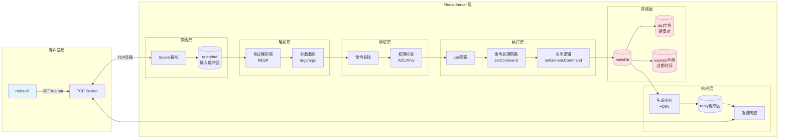
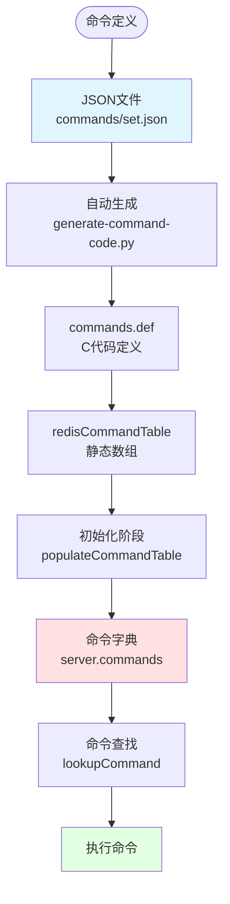
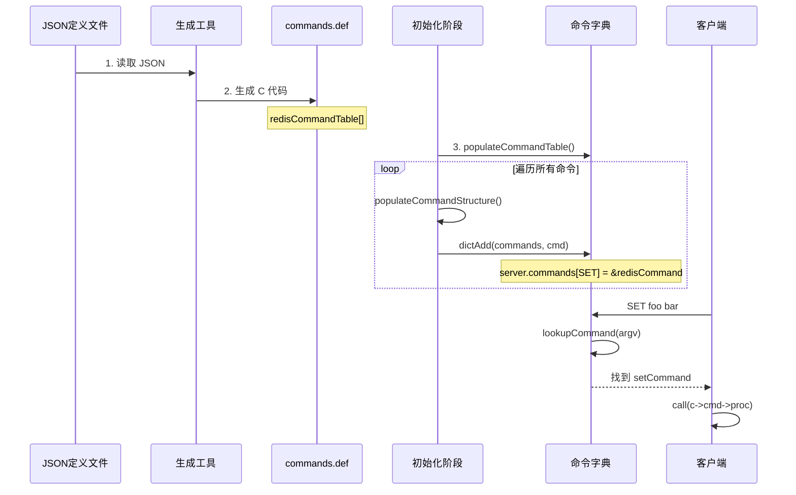

# Redis 命令执行流程详解

## Redis Server 架构

### 事件循环（Event Loop）

Redis 使用单线程事件循环处理所有网络事件和命令执行。

```c
// 文件：src/ae.c
void aeMain(aeEventLoop *eventLoop) {
    eventLoop->stop = 0;
    while (!eventLoop->stop) {
        aeProcessEvents(eventLoop, AE_ALL_EVENTS|
                                   AE_CALL_BEFORE_SLEEP|
                                   AE_CALL_AFTER_SLEEP);
    }
}
```

**关键点：**
- 主线程循环处理所有事件
- `io-threads 1` 表示命令在主线程执行
- 事件包括：文件事件（网络I/O）、时间事件（定时任务）

## Redis CLI

### 客户端连接
1. **建立TCP连接**：连接到服务器端口（默认6379）
2. **发送命令**：将命令序列化为Redis协议格式
3. **接收响应**：解析服务器返回的结果

## 命令执行完整流程

### 流程图概览

```mermaid
flowchart TD
    Start([客户端发送命令<br/>SET foo bar]) --> EventLoop[事件循环<br/>aeMain / aeProcessEvents]
    
    EventLoop --> ReceiveData[1. 接收数据<br/>readQueryFromClient<br/>networking.c]
    ReceiveData --> QueryBuf[(querybuf 缓冲区<br/>RESP协议数据)]
    
    QueryBuf --> Parse[2. 解析命令<br/>processInputBuffer<br/>networking.c:2892]
    Parse --> ParseResult[解析结果<br/>argv: SET foo bar<br/>argc: 3]
    
    ParseResult --> FindCmd[3. 查找与验证<br/>processCommand<br/>server.c:4073]
    FindCmd --> CmdLookup{命令存在?}
    CmdLookup -->|否| Reject[返回错误<br/>unknown command]
    CmdLookup -->|是| CheckArity{检查参数}
    CheckArity -->|失败| Reject
    CheckArity -->|成功| CheckACL{检查ACL权限}
    CheckACL -->|失败| Reject
    CheckACL -->|成功| CheckOther[检查其他条件<br/>内存/集群/暂停等]
    
    CheckOther --> Execute[4. 执行命令<br/>call<br/>server.c:3712]
    Execute --> SetCmd[5. SET命令实现<br/>setCommand<br/>t_string.c:382]
    
    SetCmd --> ParseArgs[解析扩展参数<br/>NX/XX/EX/GET/IFEQ等]
    ParseArgs --> SetGeneric[6. 通用设置<br/>setGenericCommand<br/>t_string.c:82]
    
    SetGeneric --> CheckCondition{条件检查<br/>NX/XX/IFEQ等}
    CheckCondition -->|失败| ReturnNil[返回 nil]
    CheckCondition -->|成功| WriteDB[7. 写入数据库<br/>setKeyByLink<br/>db.c]
    
    WriteDB --> DictUpdate[更新 dict 字典<br/>key:foo  value:bar]
    DictUpdate --> MarkDirty[标记 dirty = 1<br/>server.dirty增加]
    MarkDirty --> Notify[发送键空间通知<br/>notifyKeyspaceEvent]
    
    Notify --> SendReply[8. 发送响应<br/>addReply<br/>networking.c]
    SendReply --> ReplyBuf[(回复缓冲区<br/>+OK)]
    ReplyBuf --> End([返回客户端<br/>显示 OK])
    
    ReturnNil --> SendReply
    
    style Start fill:#e1f5ff
    style End fill:#e1f5ff
    style EventLoop fill:#fff4e1
    style Execute fill:#ffe1e1
    style WriteDB fill:#e1ffe1
    style Reject fill:#ffcccc
    style ReturnNil fill:#ffcccc
```



---

### 数据流图



---

## 详细步骤分解

### 步骤1: 事件循环接收（Event Loop）

**文件:** `src/ae.c:492`

事件循环处理网络可读事件，触发连接处理器。

```c
// 伪代码流程
aeMain() 
  → aeProcessEvents()
    → 检测到client fd可读
      → 调用 acceptTcpHandler() 或 readQueryFromClient()
```

---

### 步骤2: 接收客户端数据

**文件:** `src/networking.c` (readQueryFromClient)

```c
// 伪代码
void readQueryFromClient(connection *conn) {
    nread = connRead(...);              // 从socket读取数据
    c->querybuf = sdscatlen(c->querybuf, buf, nread);
    processInputBuffer(c);              // 处理缓冲区数据
}
```

**关键变量：**
- `c->querybuf`: 客户端输入缓冲区
- `nread`: 读取的字节数

---

### 步骤3: 解析命令缓冲区

**文件:** `src/networking.c:2892`

```c
int processInputBuffer(client *c) {
    while(c->qb_pos < sdslen(c->querybuf)) {
        // 1. 检测协议类型
        if (!c->reqtype) {
            if (c->querybuf[c->qb_pos] == '*') {
                c->reqtype = PROTO_REQ_MULTIBULK;  // RESP协议
            } else {
                c->reqtype = PROTO_REQ_INLINE;     // 行协议
            }
        }
        
        // 2. 解析命令
        if (c->reqtype == PROTO_REQ_MULTIBULK) {
            if (processMultibulkBuffer(c) != C_OK) {
                break;
            }
        } else {
            processInlineBuffer(c);
        }
        
        // 3. 调用命令处理
        if (c->argc == 0) {
            resetClient(c);
        } else {
            processCommand(c);  // ← 进入命令处理
        }
    }
}
```

**解析结果：**
```c
c->argv[0] = "SET"   // 命令名
c->argv[1] = "foo"   // 键
c->argv[2] = "bar"   // 值
c->argc = 3           // 参数个数
```

---

### 步骤4: 命令查找与验证

**文件:** `src/server.c:4073`

```c
int processCommand(client *c) {
    // 1. 查找命令
    c->realcmd = c->cmd = lookupCommand(c->argv, c->argc);
    
    // 2. 验证命令是否存在
    if (!c->cmd) {
        rejectCommandFormat(c, "unknown command '%s'", ...);
        return C_OK;
    }
    
    // 3. 检查参数个数（arity）
    if (!commandCheckArity(c->cmd, c->argc, &err)) {
        rejectCommand(c, err);
        return C_OK;
    }
    
    // 4. 检查ACL权限
    if (aclCheckCommandPerm(c, c->cmd, &acl_errmsg) != ACL_OK) {
        rejectCommandAuth(c, acl_errmsg);
        return C_OK;
    }
    
    // 5. 检查是否是写命令 + 只读副本
    if (is_write_command && is_master) {
        // 副本不能写
        rejectCommand(c, shared.roslaveerr);
        return C_OK;
    }
    
    // 6. 检查内存限制
    if (is_may_replicate_command && ...) {
        // 检查是否超过 maxmemory
    }
    
    // 7. 执行命令
    if (c->flags & CLIENT_MULTI) {
        queueMultiCommand(c);  // 事务模式：加入队列
    } else {
        call(c, CMD_CALL_FULL);  // ← 调用命令执行
    }
    
    return C_OK;
}
```

**关键函数：**
- `lookupCommand()`: 从命令字典中查找命令
- `commandCheckArity()`: 检查参数个数
- `aclCheckCommandPerm()`: 权限检查

---

###  modifying命令执行核心

**文件:** `src/server.c:3712`

```c
void call(client *c, int flags) {
    // 1. 保存状态
    long long dirty = server.dirty;
    c->flags &= ~(CLIENT_FORCE_AOF|CLIENT_FORCE_REPL|CLIENT_PREVENT_PROP);
    
    // 2. 记录执行时间
    const long long call_timer = ustime();
    enterExecutionUnit(1, call_timer);
    
    // 3. 调用具体的命令函数
    c->realcmd->proc(c);  // ← 执行命令实现
    // 对于 SET 命令：c->realcmd->proc = setCommand
    
    // 4. 检查数据是否被修改
    dirty = server.dirty - dirty;
    
    // 5. 记录慢日志
    if (slowlog_enabled) {
        slowlogPushEntryIfNeeded(c, c->argv, c->argc, duration);
    }
    
    // 6. 命令统计
    if (update_command_stats) {
        incrCommandStats(c->realcmd, dirty);
    }
    
    // 7. 传播到 AOF 和副本
    if (flags & CMD_CALL_PROPAGATE) {
        propagateToAOF(c->argv, c->argc, c->db->id, ...);
        if (dirty) {
            replicationFeedSlaves(...);
        }
    }
    
    exitExecutionUnit(1, call_timer);
}
```

**关键变量：**
- `dirty`: 数据是否被修改
- `call_timer`: 执行时间
- `flags`: 传播标志（AOF、REPL）

---

### 步骤6: SET命令实现

**文件:** `src/t_string.c:382`

```c
void setCommand(client *c) {
    robj *expire = NULL;
    robj *match_value = NULL;
    int unit = UNIT_SECONDS;
    int flags = OBJ_NO_FLAGS;
    
    // 1. 解析扩展参数 (NX, XX, EX, PX, GET, IFEQ等)
    if (parseExtendedStringArgumentsOrReply(c,&flags,&unit,&expire,&match_value,COMMAND_SET) != C_OK) {
        return;
    }
    
    // 2. 尝试编码优化（int/embstr编码）
    c->argv[2] = tryObjectEncoding(c->argv[2]);
    
    // 3. 调用通用设置函数
    setGenericCommand(c,flags,c->argv[1],&(c->argv[2]),expire,unit,match_value,NULL,NULL);
}
```

**参数解析示例：**
```c
// "SET foo bar NX EX 100"
flags = OBJ_SET_NX
unit = UNIT_SECONDS
expire->ptr = "100"
match_value = NULL
```

---

### 步骤7: 通用设置逻辑

**文件:** `src/t_string.c:82`

```c
void setGenericCommand(client *c, int flags, robj *key, robj **valref, 
                       robj *expire, int unit, robj *match_value, 
                       robj *ok_reply, robj *abort_reply) {
    long long milliseconds = 0;
    int found = 0;
    int setkey_flags = 0;
    
    // 1. 处理过期时间
    if (expire && getExpireMillisecondsOrReply(c, expire, flags, unit, &milliseconds) != C_OK) {
        return;
    }
    
    // 2. 处理 GET 选项
    if (flags & OBJ_SET_GET) {
        if (getGenericCommand(c) == C_ERR) return;
    }
    
    // 3. 查找 key 是否存在
    dictEntryLink link = NULL;
    found = (lookupKeyWriteWithLink(c->db, key, &link) != NULL);
    
    // 4. 条件检查
    if ((flags & OBJ_SET_NX && found) ||           // NX: 存在则失败
        (flags & (OBJ_SET_XX | OBJ_SET_IFEQ | OBJ_SET_IFDEQ) && !found) ||  // XX: 不存在则失败
        ...条件不满足...) {
        if (!(flags & OBJ_SET_GET)) {
            addReply(c, shared.null);  // 返回 nil
        }
        return;
    }
    
    // 5. 条件匹配检查 (IFEQ, IFNE, IFDEQ, IFDNE)
    if (found && (flags & (OBJ_SET_IFEQ | OBJ_SET_IFNE | OBJ_SET_IFDEQ | OBJ_SET_IFDNE))) {
        kvobj *o = lookupKeyRead(c->db, key);
        if (!checkConditionalValue(c, flags, o, match_value)) {
            if (!(flags & OBJ_SET_GET)) {
                addReply(c, shared.null);
            }
            return;
        }
    }
    
    // 6. 准备设置标志
    setkey_flags |= ((flags & OBJ_KEEPTTL) || expire) ? SETKEY_KEEPTTL : 0;
    setkey_flags |= found ? SETKEY_ALREADY_EXIST : SETKEY_DOESNT_EXIST;
    
    // 7. 设置新值（自动处理旧键的删除）
    setKeyByLink(c, c->db, key, valref, setkey_flags, &link);
    
    // 8. 设置过期时间
    if (expire) {
        *valref = setExpireByLink(c, c->db, key->ptr, milliseconds, link);
    }
    
    // 9. 增加引用计数（确保DB和client都持有有效引用）
    incrRefCount(*valref);
    
    // 10. 标记数据已修改
    server.dirty++;
    
    // 11. 发送键空间通知
    notifyKeyspaceEvent(NOTIFY_STRING, "set", key, c->db->id);
    if (expire) {
        notifyKeyspaceEvent(NOTIFY_GENERIC, "expire", key, c->db->id);
    }
    
    // 12. 发送响应
    if (!(flags & OBJ_SET_GET)) {
        addReply(c, ok_reply ? ok_reply : shared.ok);
    }
}
```

**关键操作：**
- `lookupKeyWriteWithLink()`: 查找键（写模式）
- `setKeyByLink()`: 写入数据库（使用link优化）
- `setExpireByLink()`: 设置过期时间
- `incrRefCount()`: 增加引用计数
- `server.dirty++`: 标记数据修改

---

### 步骤8: 写入数据库

**文件:** `src/db.c`

```c
void setKey(redisDb *db, robj *key, robj *val) {
    // 1. 查找key是否存在
    if (lookupKeyWrite(db, key) == NULL) {
        signalModifiedKey(db, key);
    }
    
    // 2. 添加到键空间字典
    dbAdd(db, key, val);
    
    // 3. 触发键空间通知
    signalModifiedKey(db, key);
    
    // 4. 触发模块事件
    moduleNotifyKeyspaceEvent(NOTIFY_GENERIC, "set", key, db->id);
}
```

**数据结构：**
```c
typedef struct redisDb {
    dict *dict;              // 键空间：存储所有键值对
    dict *expires;           // 过期字典：存储过期时间
    dict *blocking_keys;     // 阻塞字典
    dict *ready_keys;        // 就绪键
    ...
} redisDb;
```

---

### 步骤9: 发送响应

**文件:** `src/networking.c`

```c
void addReply(client *c, robj *obj) {
    // 1. 准备响应缓冲区
    if (!prepareClientToWrite(c)) return;
    
    // 2. 序列化响应
    if (c->resp == 2) {
        // RESP2 协议
        addReplyBulk(c, obj);
    } else {
        // RESP3 协议
        addReplyBulkOBJ(c, obj);
    }
    
    // 3. 将客户端加入待写入队列
    _addReplyToBuffer(c);
    putClientInPendingWriteQueue(c);
}
```

**响应格式（RESP2）：**
```
对于 "SET foo bar" 成功：
+OK\r\n

对于 "GET foo"：
$3\r\n
bar\r\n
```

---

## 执行时间线（示例）

假设执行 `SET foo bar`：

| 时间点 | 操作 | 函数 | 关键变量 |
|--------|------|------|----------|
| T1 | CLI发送 | TCP Socket | "SET foo bar\r\n" |
| T2 | 事件循环 | aeProcessEvents() | 文件事件触发 |
| T3 | 接收数据 | readQueryFromClient() | querybuf += data |
| T4 | 解析命令 | processInputBuffer() | argv[3] = ["SET","foo","bar"] |
| T5 | 查找命令 | processCommand() | c->cmd = setCommand |
| T6 | 执行命令 | call() | dirty = 1 |
| T7 | 解析参数 | setCommand() | flags=0, expire=NULL |
| T8 | 写入DB | setGenericCommand() | db->dict["foo"] = "bar" |
| T9 | 返回结果 | addReply() | "+OK\r\n" |
| T10 | CLI接收 | TCP Socket | 显示 OK |

**总耗时：** 通常 < 1ms

---

## 关键数据结构

### client 结构
```c
typedef struct client {
    int fd;                    // 套接字
    robj **argv;               // 命令参数数组
    int argc;                  // 参数个数
    sds querybuf;              // 查询缓冲区
    struct redisCommand *cmd;  // 当前命令
    redisDb *db;               // 当前数据库
    int flags;                 // 客户端标志
    char *buf;                 // 回复缓冲区
    ...
} client;
```

### redisCommand 结构
```c
struct redisCommand {
    char *name;                    // 命令名 "SET"
    redisCommandProc *proc;        // 函数指针 setCommand
    int arity;                     // 参数个数 -3
    int flags;                     // 命令标志 WRITE
    uint64_t calls;                // 调用次数
    uint64_t microseconds;         // 总耗时
    ...
};
```

---

## 性能相关

### 为什么 Redis 快？

1. **单线程处理命令**：避免锁竞争、上下文切换
2. **内存操作**：读写都在内存中完成
3. **优化数据结构**：
   - 小字符串使用 embstr 编码
   - 整数使用 int 编码
   - 避免复制大对象
4. **I/O多路复用**：epoll/kqueue 高效处理网络事件
5. **渐进式rehash**：避免一次性大迁移

### 耗时分布

```
SET foo bar 耗时分解：

网络I/O:      ~0.1-0.5ms  (取决于延迟)
命令解析:     ~0.01ms
命令查找:     O(1) 哈希查找
命令执行:     ~0.01-0.1ms
写入DB:       ~0.01ms (内存操作)
响应返回:     ~0.1-0.5ms
─────────────────────────────
总计:           < 1ms
```

---

## 调试技巧

详细的调试指南请参考：[Redis 调试指南](./redis-debug.md)

---

## 总结

Redis 命令执行的核心流程：

1. **事件循环** → 检测网络可读事件
2. **数据接收** → 读取socket数据到buffer
3. **协议解析** → 将buffer解析为命令参数
4. **命令查找** → 从命令表找到对应处理函数
5. **权限验证** → 检查ACL、参数个数等
6. **执行命令** → 调用具体命令实现
7. **修改数据** → 更新数据库字典
8. **发送响应** → 返回结果给客户端

**特性：**
- 单线程执行保证原子性
- 内存操作保证速度
- 事件驱动保证并发
- 渐进式rehash保证平滑扩容

---

## 命令注册流程

### Redis 命令注册机制

Redis 的命令注册经历了以下几个阶段：



### 步骤1: 命令定义（JSON文件）

**文件:** `src/commands/set.json`

```json
{
    "SET": {
        "summary": "Sets the string value of a key...",
        "complexity": "O(1)",
        "group": "string",
        "since": "1.0.0",
        "arity": -3,
        "function": "setCommand",           // ← 指向实现函数
        "command_flags": ["WRITE", "DENYOOM"],
        "acl_categories": ["STRING"],
        "key_specs": [...],
        "arguments": [...]
    }
}
```

### 步骤2: 自动生成C代码

**工具:** `utils/generate-command-code.py`

从 JSON 文件生成 `commands.def`：

```c
// src/commands.def (自动生成)
/********** SET ********************/
commandHistory SET_History[] = {
    {"2.6.12","Added the EX, PX, NX and XX options."},
    {"6.0.0","Added the KEEPTTL option."},
    ...
};

keySpec SET_Keyspecs[1] = {
    {"RW and ACCESS...", CMD_KEY_RW|CMD_KEY_ACCESS|..., ...}
};

struct COMMAND_ARG SET_Args[] = {
    {MAKE_ARG("key", ARG_TYPE_KEY, 0, ...)},
    {MAKE_ARG("value", ARG_TYPE_STRING, -1, ...)},
    ...
};

struct COMMAND_STRUCT redisCommandTable[] = {
    ...
    {MAKE_CMD("set", "Sets the string value...", "O(1)", "1.0.0", 
              ..., setCommand, -3, CMD_WRITE|CMD_DENYOOM, 
              ACL_CATEGORY_STRING, SET_Keyspecs, 1, setGetKeys, 5),
     .args=SET_Args},
    ...
};
```

### 步骤3: 初始化命令表

**文件:** `src/server.c:3258`

```c
void populateCommandTable(void) {
    int j;
    struct redisCommand *c;

    // 遍历 redisCommandTable 数组
    for (j = 0;; j++) {
        c = redisCommandTable + j;
        if (c->declared_name == NULL)
            break;
        
        // 设置完整名称
        c->fullname = sdsnew(c->declared_name);
        
        // 填充命令结构
        if (populateCommandStructure(c) == C_ERR)
            continue;

        // 添加到命令字典
        dictAdd(server.commands, sdsdup(c->fullname), c);  // ← 注册！
        dictAdd(server.orig_commands, sdsdup(c->fullname), c);
    }
}
```

### 步骤4: 命令查找

**文件:** `src/server.c:4073` (processCommand)

```c
int processCommand(client *c) {
    // 查找命令
    c->realcmd = c->cmd = lookupCommand(c->argv, c->argc);  // ← 查找命令
    
    if (!c->cmd) {
        rejectCommandFormat(c, "unknown command '%s'", ...);
        return C_OK;
    }
    
    // 执行命令
    call(c, CMD_CALL_FULL);
    return C_OK;
}
```

### 完整的注册流程图



---

## 实现自定义命令

详细的命令实现指南请参考：[Redis 自定义命令实现指南](redis-custom-command.md)

