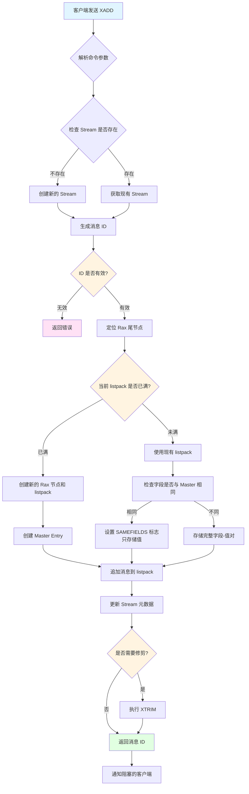
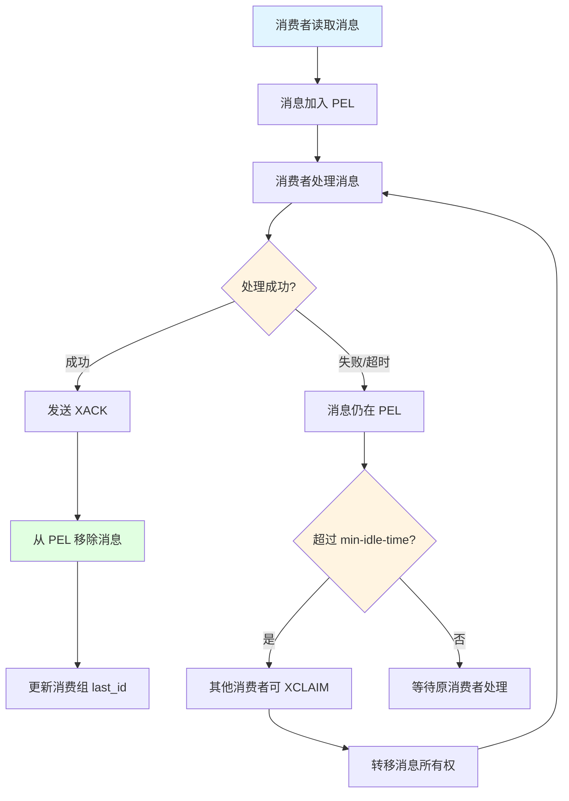
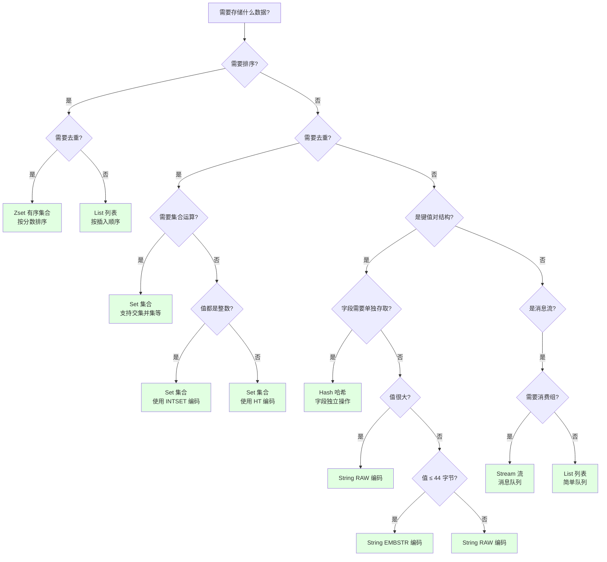

# Redis 对外数据结构

```bash
# 启动 Redis Stack（包含 RedisInsight 可视化工具和 Redis 模块）
docker run -d \
  --name redis-stack \
  -p 6379:6379 \
  -p 8001:8001 \
  redis/redis-stack:latest

# 访问 RedisInsight: http://localhost:8001
# Redis 连接地址: localhost:6379
```

## 目录

- [一、概述](#一概述)
- [二、String（字符串）](#二string字符串)
- [三、List（列表）](#三list列表)
- [四、Set（集合）](#四set集合)
- [五、Zset（有序集合）](#五zset有序集合)
- [六、Hash（哈希）](#六hash哈希)
- [七、Stream（流）](#七stream流)
- [八、Module（模块）](#八module模块)
- [九、数据结构选择指南](#九数据结构选择指南)

---

## 一、概述

Redis 提供了 7 种基本数据结构类型，每种类型都有其特定的特点和适用场景。这些数据结构类型定义在 `src/server.h` 中：

```802:821:github/redis-unstable/src/server.h
#define OBJ_STRING 0    /* String object. */
#define OBJ_LIST 1      /* List object. */
#define OBJ_SET 2       /* Set object. */
#define OBJ_ZSET 3      /* Sorted set object. */
#define OBJ_HASH 4      /* Hash object. */
#define OBJ_MODULE 5    /* Module object. */
#define OBJ_STREAM 6    /* Stream object. */
```

### 数据结构概览

| 类型 | 命令前缀 | 底层编码 | 特点 |
|------|---------|---------|------|
| **String** | SET/GET | INT/EMBSTR/RAW | 最基础类型，支持多种编码优化 |
| **List** | LPUSH/RPOP | QUICKLIST/LISTPACK | 有序列表，支持两端操作 |
| **Set** | SADD/SMEMBERS | INTSET/HT/LISTPACK | 无序集合，自动去重 |
| **Zset** | ZADD/ZRANGE | LISTPACK/SKIPLIST | 有序集合，支持分数排序 |
| **Hash** | HSET/HGET | LISTPACK/HT | 键值对集合，类似对象属性 |
| **Stream** | XADD/XREAD | STREAM | 消息流，支持消费组 |
| **Module** | 自定义 | 自定义 | 扩展类型，通过模块实现 |

---

## 二、String（字符串）

### 特点

**1. 三种编码方式**

```330:335:github/redis-unstable/src/object.c
robj *createStringObject(const char *ptr, size_t len) {
    if (len <= OBJ_ENCODING_EMBSTR_SIZE_LIMIT)
        return createEmbeddedStringObject(ptr,len);
    else
        return createRawStringObject(ptr,len);
}
```

| 编码 | 说明 | 使用条件 |
|------|------|----------|
| **OBJ_ENCODING_INT** | 整数编码 | 值为整数且可能被转换为整数 |
| **OBJ_ENCODING_EMBSTR** | 嵌入式字符串 | 长度 ≤ 44 字节 |
| **OBJ_ENCODING_RAW** | 原始字符串 | 长度 > 44 字节 |

**2. 核心特性**

- **二进制安全**：可以存储任意二进制数据，包括 `\0`
- **内存优化**：小字符串使用 EMBSTR，大字符串使用 RAW
- **整数优化**：0-9999 的小整数使用共享对象池
- **高效操作**：O(1) 获取长度，支持原子操作（INCR/DECR）

**3. 性能特点**

| 操作 | 时间复杂度 | 说明 |
|------|-----------|------|
| GET/SET | O(1) | 直接键值操作 |
| APPEND | O(1) 平均 | 可能需要扩容 |
| INCR/DECR | O(1) | 原子增减操作 |
| STRLEN | O(1) | SDS 结构直接返回长度 |

### 适用场景

**1. 缓存数据**

```bash
# 缓存用户信息
SET user:1001 "{\"name\":\"Alice\",\"age\":25}"
GET user:1001

# 设置过期时间
SET session:abc123 "user_data" EX 3600
```

**适用原因**：
- 快速读写，O(1) 时间复杂度
- 支持过期时间，自动淘汰
- 二进制安全，可存储 JSON、序列化对象等

**2. 计数器**

```bash
# 页面访问量
INCR page:view:20240101

# 库存计数
INCRBY product:1001:stock -1
```

**适用原因**：
- 原子操作，线程安全
- 支持 INCR、INCRBY、DECR 等
- INT 编码优化，内存占用小

**3. 分布式锁**

```bash
# 简单的分布式锁实现
SET lock:resource "unique_id" NX EX 10
```

**适用原因**：
- NX 参数实现互斥
- EX 参数设置过期时间
- 操作简单，性能高

**4. 存储序列化对象**

```bash
# 存储 JSON 字符串
SET user:1001:profile '{"name":"Bob","email":"bob@example.com"}'

# 存储序列化数据
SET cached:data "<serialized_binary_data>"
```

**适用原因**：
- 二进制安全，可存储任意数据
- 适合存储 JSON、Protocol Buffers、MessagePack 等格式

**5. 位图操作（Bitmaps）**

```bash
# 使用字符串作为位图
# 命令格式：SETBIT key offset value
# 参数说明：
#   - key: 键名
#   - offset: 位偏移量（从 0 开始）
#   - value: 位的值（0 或 1）
SETBIT user:1001:login 100 1  # 记录第 100 天登录
(integer) 0

# 命令格式：GETBIT key offset
# 参数说明：
#   - key: 键名
#   - offset: 位偏移量
127.0.0.1:6379> GETBIT user:1001:login 100  # 第100天查询是否登陆
(integer) 1

# 统计登录天数
# 命令格式：BITCOUNT key [start end]
# 参数说明：
#   - key: 键名
#   - start end: 可选，字节范围（不是位范围）
127.0.0.1:6379> BITCOUNT user:1001:login   
(integer) 1
127.0.0.1:6379> SETBIT user:1001:login 102 1
(integer) 0
127.0.0.1:6379> BITCOUNT user:1001:login   
(integer) 2
127.0.0.1:6379> 
```

**适用原因**：
- 支持位操作（SETBIT、GETBIT、BITOP）
- 内存效率高，1 个 bit 存储一个布尔值
- 适合统计、签到等场景

**不适用场景**：
- ❌ 需要按字段单独更新的结构化数据（应使用 Hash）
- ❌ 需要排序的数据（应使用 Zset）
- ❌ 需要去重的集合数据（应使用 Set）

---

## 三、List（列表）

### 特点

**1. 底层编码**

| 编码 | 说明 | 使用场景 |
|------|------|----------|
| **OBJ_ENCODING_QUICKLIST** | 快速列表 | 默认编码，双向链表 + listpack |
| **OBJ_ENCODING_LISTPACK** | 紧凑列表 | Redis 7.0+ 优化，用于小列表 |

**2. 核心特性**

- **有序性**：元素按插入顺序排列
- **双端操作**：支持 LPUSH/RPUSH（左/右插入）、LPOP/RPOP（左/右弹出）
- **索引访问**：支持 LINDEX 按索引访问（O(N)）
- **阻塞操作**：支持 BLPOP/BRPOP 阻塞式弹出
- **内存优化**：Quicklist 结合链表和压缩列表的优点

**3. 性能特点**

| 操作 | 时间复杂度 | 说明 |
|------|-----------|------|
| LPUSH/RPUSH | O(1) | 两端插入 |
| LPOP/RPOP | O(1) | 两端弹出 |
| LINDEX | O(N) | 按索引访问 |
| LRANGE | O(S+N) | S 为起始偏移，N 为元素数量 |
| LLEN | O(1) | 获取长度 |

### 适用场景

**1. 消息队列**

```bash
# 生产者：右端推入
# 命令格式：RPUSH key element [element ...]
# 参数说明：
#   - key: 键名
#   - element: 要推入的元素，可以多个
RPUSH queue:task "task1"
RPUSH queue:task "task2"

# 消费者：左端弹出
# 命令格式：LPOP key [count]
# 参数说明：
#   - key: 键名
#   - count: 可选，弹出元素的数量（Redis 6.2+）
LPOP queue:task
```

**适用原因**：
- FIFO（先进先出）队列模式
- 支持阻塞操作（BLPOP），避免轮询
- 支持多消费者（多个 BLPOP）

**2. 最新动态列表**

```bash
# 记录用户最新动态
# 命令格式：LPUSH key element [element ...]
# 参数说明：
#   - key: 键名
#   - element: 要推入的元素，可以多个（从左侧推入）
LPUSH user:1001:timeline "Post:12345"
LPUSH user:1001:timeline "Post:12346"

# 获取最新 10 条
# 命令格式：LRANGE key start stop
# 参数说明：
#   - key: 键名
#   - start: 起始索引（0 表示第一个元素，-1 表示最后一个元素）
#   - stop: 结束索引（包含）
127.0.0.1:6379> LRANGE user:1001:timeline 0 9
1) "Post:12346"
2) "Post:12345"
```

**适用原因**：
- 天然的时间顺序（新数据在前）
- LRANGE 高效获取列表片段
- 可结合 LTRIM 限制列表长度

**3. 文章列表分页**

```bash
# 存储文章 ID 列表
LPUSH articles:list "article:1001"
LPUSH articles:list "article:1002"

# 分页查询
LRANGE articles:list 0 9   # 第 1 页
LRANGE articles:list 10 19 # 第 2 页
```

**适用原因**：
- 有序存储，便于分页
- LRANGE 支持范围查询
- 性能好，适合高频访问

**4. 任务调度**

```bash
# 延迟任务（使用有序集合更合适，但 List 也可用）
LPUSH task:urgent "task1"
LPUSH task:normal "task2"

# 优先级队列
LPUSH task:high "task_high_priority"
LPUSH task:low "task_low_priority"
```

**适用原因**：
- 支持优先级（多个 List 实现）
- 阻塞弹出，适合任务调度
- 简单易用

**5. 栈结构**

```bash
# 使用 List 实现栈（LIFO）
LPUSH stack "item1"
LPUSH stack "item2"
LPOP stack  # 弹出 "item2"
```

**适用原因**：
- 左端插入和弹出，实现后进先出
- 简单高效

**不适用场景**：
- ❌ 需要根据值快速查找（应使用 Set）
- ❌ 需要按分数排序（应使用 Zset）
- ❌ 需要去重（应使用 Set）

---

## 四、Set（集合）

### 特点

**1. 底层编码**

| 编码 | 说明 | 使用条件 |
|------|------|----------|
| **OBJ_ENCODING_INTSET** | 整数集合 | 所有元素都是整数且数量较少 |
| **OBJ_ENCODING_HT** | 哈希表 | 包含非整数或数量较大 |
| **OBJ_ENCODING_LISTPACK** | 紧凑列表 | Redis 7.0+ 优化 |

**2. 核心特性**

- **唯一性**：自动去重，不允许重复元素
- **无序性**：元素存储顺序不确定
- **集合运算**：支持交集（SINTER）、并集（SUNION）、差集（SDIFF）
- **高效查找**：O(1) 平均时间复杂度判断元素是否存在
- **内存优化**：整数集合使用连续内存，节省空间

**3. 性能特点**

| 操作 | 时间复杂度 | 说明 |
|------|-----------|------|
| SADD | O(1) 平均 | 添加元素 |
| SREM | O(1) 平均 | 删除元素 |
| SISMEMBER | O(1) 平均 | 判断成员是否存在 |
| SMEMBERS | O(N) | 获取所有成员 |
| SINTER | O(N*M) | N 为最小集合大小，M 为集合数量 |

### 适用场景

**1. 标签系统**

```bash
# 用户标签
# 命令格式：SADD key member [member ...]
# 参数说明：
#   - key: 键名
#   - member: 要添加的成员，可以多个
SADD user:1001:tags "programmer" "redis" "python"
SADD user:1002:tags "designer" "ui" "redis"

# 查找共同标签
# 命令格式：SINTER key [key ...]
# 参数说明：
#   - key: 键名，可以多个集合（返回所有集合的交集）
SINTER user:1001:tags user:1002:tags  # 返回: "redis"

# 推荐相似用户（基于标签交集）
```

**适用原因**：
- 自动去重，避免重复标签
- 集合运算，快速找共同点
- 高效查找，O(1) 判断标签是否存在

**2. 好友关系**

```bash
# 添加好友
# 命令格式：SADD key member [member ...]
SADD user:1001:friends "user:1002" "user:1003"
SADD user:1002:friends "user:1003" "user:1004"

# 判断是否为好友
# 命令格式：SISMEMBER key member
# 参数说明：
#   - key: 键名
#   - member: 要检查的成员
# 返回值：1 表示存在，0 表示不存在
127.0.0.1:6379> SISMEMBER user:1001:friends "user:1002"
(integer) 1
# 共同好友
# 命令格式：SINTER key [key ...]
127.0.0.1:6379> SINTER user:1001:friends user:1002:friends
1) "user:1003"
```

**适用原因**：
- 去重，避免重复添加
- 集合运算，快速找共同好友
- 支持大量好友关系（哈希表编码）

**3. 黑名单/白名单**

```bash
# 黑名单
# 命令格式：SADD key member [member ...]
SADD blacklist:ip "192.168.1.100"
SADD blacklist:ip "10.0.0.50"

# 检查是否在黑名单
# 命令格式：SISMEMBER key member
127.0.0.1:6379> SISMEMBER blacklist:ip "192.168.1.100"
(integer) 1

# 白名单
SADD whitelist:users "user:1001" "user:1002"
```

**适用原因**：
- O(1) 快速判断
- 自动去重
- 支持批量操作

**4. 抽奖/随机选择**

```bash
# 参与抽奖的用户
# 命令格式：SADD key member [member ...]
SADD lottery:20240101:participants "user:1001" "user:1002" "user:1003"

# 随机抽取 1 个
# 命令格式：SRANDMEMBER key [count]
# 参数说明：
#   - key: 键名
#   - count: 可选，抽取数量（正数表示不重复，负数表示可重复）
SRANDMEMBER lottery:20240101:participants

# 随机抽取 2 个（不重复）
127.0.0.1:6379> SRANDMEMBER lottery:20240101:participants 2
1) "user:1001"
2) "user:1003"
127.0.0.1:6379> 
```

**适用原因**：
- SRANDMEMBER 随机选择，支持不重复
- 自动去重，避免重复中奖
- 性能好，适合大量参与者

**5. 唯一访问记录**

```bash
# 记录唯一访问者
SADD page:view:unique "user:1001"
SADD page:view:unique "user:1002"

# 统计唯一访问数
SCARD page:view:unique

# 判断是否访问过
SISMEMBER page:view:unique "user:1001"
```

**适用原因**：
- 自动去重，统计唯一值
- 内存高效（整数集合编码）
- 快速判断

**6. 数据去重**

```bash
# 对列表去重（转换为 Set）
SADD unique:list "item1" "item2" "item1"
SMEMBERS unique:list  # 返回去重后的结果
```

**适用原因**：
- 自动去重
- 简单高效

**不适用场景**：
- ❌ 需要排序（应使用 Zset）
- ❌ 需要重复元素（应使用 List）
- ❌ 需要按分数排序（应使用 Zset）

---

## 五、Zset（有序集合）

### 特点

**1. 底层编码**

| 编码 | 说明 | 使用条件 |
|------|------|----------|
| **OBJ_ENCODING_LISTPACK** | 紧凑列表 | 元素数量少且值较小 |
| **OBJ_ENCODING_SKIPLIST** | 跳表 + 哈希表 | 元素数量多或值较大 |

**2. 核心特性**

- **有序性**：元素按分数（score）排序
- **唯一性**：成员（member）唯一，分数可重复
- **范围查询**：支持按分数范围（ZRANGEBYSCORE）和排名范围（ZRANGE）查询
- **高效查找**：O(log N) 查找，O(1) 获取分数
- **排名操作**：支持获取排名（ZRANK）、反向排名（ZREVRANK）

**3. 性能特点**

| 操作 | 时间复杂度 | 说明 |
|------|-----------|------|
| ZADD | O(log N) | 添加元素 |
| ZREM | O(log N) | 删除元素 |
| ZSCORE | O(1) | 获取分数 |
| ZRANK | O(log N) | 获取排名 |
| ZRANGE | O(log N + M) | M 为返回元素数量 |
| ZRANGEBYSCORE | O(log N + M) | 按分数范围查询 |

### 适用场景

**1. 排行榜**

```bash
# 游戏排行榜
# 命令格式：ZADD key [NX|XX] [CH] [INCR] score member [score member ...]
# 参数说明：
#   - key: 键名
#   - score: 分数（浮点数）
#   - member: 成员（唯一）
#   - NX: 仅当成员不存在时添加
#   - XX: 仅当成员存在时更新
#   - CH: 返回变更数量（包括新增和更新）
ZADD leaderboard:game1 1000 "player1"
ZADD leaderboard:game1 1500 "player2"
ZADD leaderboard:game1 800 "player3"

# 获取前 10 名
# 命令格式：ZREVRANGE key start stop [WITHSCORES]
# 参数说明：
#   - key: 键名
#   - start: 起始排名（0 表示第一名）
#   - stop: 结束排名（包含）
#   - WITHSCORES: 同时返回分数
ZREVRANGE leaderboard:game1 0 9 WITHSCORES
1) "player2"
2) "1500"
3) "player1"
4) "1000"
5) "player3"
6) "800"

# 获取玩家排名
# 命令格式：ZREVRANK key member
# 参数说明：
#   - key: 键名
#   - member: 成员
# 返回值：排名（从 0 开始，nil 表示成员不存在）
127.0.0.1:6379> ZREVRANK leaderboard:game1 "player1"
(integer) 1
127.0.0.1:6379> ZREVRANK leaderboard:game1 "player3"
(integer) 2
127.0.0.1:6379> ZREVRANK leaderboard:game1 "player0"
(nil)
127.0.0.1:6379> ZREVRANK leaderboard:game1 "player1"
(integer) 1
127.0.0.1:6379> 

# 获取玩家分数
# 命令格式：ZSCORE key member
# 参数说明：
#   - key: 键名
#   - member: 成员
127.0.0.1:6379> ZSCORE leaderboard:game1 "player1"
"1000"
127.0.0.1:6379> 
```

**适用原因**：
- 自动排序，维护有序性
- 支持范围查询，获取 Top N
- 高效获取排名和分数

**2. 延时队列**

```bash
# 使用时间戳作为分数
ZADD delay:queue 1704067200 "task1"  # 2024-01-01 00:00:00
ZADD delay:queue 1704070800 "task2"  # 2024-01-01 01:00:00

# 获取到期的任务
ZRANGEBYSCORE delay:queue 0 $(date +%s) LIMIT 0 10
ZREM delay:queue "task1"  # 消费后删除
```

**适用原因**：
- 按时间排序，自动维护顺序
- 范围查询，快速获取到期任务
- 支持精确时间控制

**3. 范围查找**

```bash
# 商品价格索引
ZADD price:index 99.99 "product:1001"
ZADD price:index 199.99 "product:1002"
ZADD price:index 299.99 "product:1003"

# 查找 100-200 价格区间的商品
ZRANGEBYSCORE price:index 100 200
```

**适用原因**：
- 按数值范围查询
- O(log N + M) 时间复杂度
- 支持多种范围查询模式

**4. 时间线排序**

```bash
# 用户动态时间线（按时间戳）
ZADD user:1001:timeline 1704067200 "post:12345"
ZADD user:1001:timeline 1704067300 "post:12346"

# 获取最新动态（按时间倒序）
ZREVRANGE user:1001:timeline 0 9
```

**适用原因**：
- 自动按时间排序
- 支持正序和倒序查询
- 支持分页

**5. 权重队列**

```bash
# 任务优先级队列（分数越小优先级越高）
ZADD task:queue 1 "urgent_task1"
ZADD task:queue 5 "normal_task1"
ZADD task:queue 10 "low_task1"

# 获取优先级最高的任务
ZRANGE task:queue 0 0  # 获取第一个（分数最小）
```

**适用原因**：
- 按权重排序
- 支持动态调整优先级（更新分数）
- 高效获取最高优先级任务

**6. 统计区间数据**

```bash
# 用户积分统计
ZADD user:scores 1000 "user:1001"
ZADD user:scores 2000 "user:1002"
ZADD user:scores 1500 "user:1003"

# 统计 1000-2000 分区间的人数
ZCOUNT user:scores 1000 2000
```

**适用原因**：
- ZCOUNT 快速统计区间数量
- 支持范围查询
- 适合数据分析

**不适用场景**：
- ❌ 不需要排序的数据（应使用 Set）
- ❌ 需要重复元素（应使用 List）
- ❌ 简单的键值对（应使用 Hash）

---

## 六、Hash（哈希）

### 特点

**1. 底层编码**

| 编码 | 说明 | 使用条件 |
|------|------|----------|
| **OBJ_ENCODING_LISTPACK** | 紧凑列表 | 字段数量少且值较小（默认） |
| **OBJ_ENCODING_LISTPACK_EX** | 带过期元数据 | 需要字段级别过期时间 |
| **OBJ_ENCODING_HT** | 哈希表 | 字段数量多或值较大 |

**2. 核心特性**

- **字段独立**：每个字段可以单独存取，无需读取整个对象
- **内存高效**：小哈希使用 listpack，节省内存
- **部分更新**：支持单独更新某个字段，不影响其他字段
- **字段过期**：Redis 7.0+ 支持字段级别 TTL
- **渐进转换**：根据阈值自动从 listpack 升级到 hashtable

**3. 性能特点**

| 操作 | 时间复杂度 | 说明 |
|------|-----------|------|
| HSET/HGET | O(1) 平均 | 设置/获取字段 |
| HDEL | O(1) 平均 | 删除字段 |
| HGETALL | O(N) | 获取所有字段 |
| HLEN | O(1) | 获取字段数量 |
| HINCRBY | O(1) 平均 | 字段值增减 |

### 适用场景

**1. 对象属性存储**

```bash
# 用户信息
# 命令格式：HSET key field value [field value ...]
# 参数说明：
#   - key: 键名
#   - field: 字段名
#   - value: 字段值
#   - 可以设置多个字段（成对出现）
HSET user:1001 name "Alice" age 25 email "alice@example.com"

# 命令格式：HGET key field
# 参数说明：
#   - key: 键名
#   - field: 字段名
HGET user:1001 name  # 只获取 name 字段

# 命令格式：HGETALL key
# 参数说明：
#   - key: 键名
# 返回值：交替返回字段名和值（field1, value1, field2, value2, ...）
HGETALL user:1001    # 获取所有字段

# 部分更新
# 命令格式：HSET key field value
HSET user:1001 age 26  # 只更新 age，不影响其他字段
```

**适用原因**：
- 字段独立存取，无需读取整个对象
- 节省内存，避免重复存储对象元数据
- 支持部分更新，提高效率

**2. 缓存关联数据**

```bash
# 商品详情
127.0.0.1:6379> HSET product:1001 title "iPhone 15" price 5999 stock 100 category "phone"
(integer) 4
127.0.0.1:6379> HGET product:1001 price # 只获取价格
"5999"  

# 相比多个 String key 的优势：
# String: product:1001:title, product:1001:price, ...
# Hash: 只需一个 key，字段作为子键
```

**适用原因**：
- 减少 key 数量，降低键空间占用
- 原子操作，字段更新一致性好
- 便于管理，相关数据聚合在一起

**3. 计数器集合**

```bash
# 用户统计
# 命令格式：HINCRBY key field increment
# 参数说明：
#   - key: 键名
#   - field: 字段名
#   - increment: 增量（整数）
# 返回值：增量后的值
127.0.0.1:6379> HINCRBY user:1001:stats view_count 1
(integer) 1
127.0.0.1:6379> HINCRBY user:1001:stats like_count 1
(integer) 1
127.0.0.1:6379> HINCRBY user:1001:stats comment_count 1
(integer) 1
# 获取所有统计
# 命令格式：HGETALL key
127.0.0.1:6379> HGETALL user:1001:stats
1) "view_count"
2) "1"
3) "like_count"
4) "1"
5) "comment_count"
6) "1"
```

**适用原因**：
- HINCRBY 原子操作，线程安全
- 多个计数器聚合在一个 key 中
- 便于管理和查询

**4. 配置管理**

```bash
# 应用配置
127.0.0.1:6379> HSET app:config db_host "localhost" db_port 3306 timeout 30
(integer) 3
127.0.0.1:6379> HGET app:config db_host
"localhost"
# 动态更新配置
127.0.0.1:6379> HSET app:config timeout 60
(integer) 0
```

**适用原因**：
- 配置项聚合存储
- 支持动态更新单个配置项
- 便于版本管理和回滚

**5. 购物车**

```bash
# 购物车商品（field 是商品ID，value 是数量）
127.0.0.1:6379> HSET cart:user:1001 product:1001 2
(integer) 1
127.0.0.1:6379> HSET cart:user:1001 product:1002 1
(integer) 1

# 更新数量
127.0.0.1:6379> HINCRBY cart:user:1001 product:1001 1
(integer) 3

# 获取所有商品
127.0.0.1:6379> HGETALL cart:user:1001
1) "product:1001"
2) "3"
3) "product:1002"
4) "1"
```

**适用原因**：
- 字段即商品 ID，值为数量
- 支持增量更新
- 便于统计和计算

**6. 字段过期（Redis 7.0+）**

```bash
# 带过期时间的字段
HSET user:1001 session_token "abc123" EX 3600
HGET user:1001 session_token

# 字段自动过期后，HGET 返回 nil
```

**适用原因**：
- 字段级别 TTL，精细控制
- 适合临时数据存储
- 自动清理，无需手动删除

**不适用场景**：
- ❌ 需要排序的数据（应使用 Zset）
- ❌ 需要去重的集合（应使用 Set）
- ❌ 简单的单一值（应使用 String）

---

## 七、Stream（流）

### 特点

**1. 底层实现**

Stream 使用 **Rax（基数树） + Listpack** 实现：

```16:27:github/redis-unstable/src/stream.h
typedef struct stream {
    rax *rax;               /* The radix tree holding the stream. */
    uint64_t length;        /* Current number of elements inside this stream. */
    streamID last_id;       /* Zero if there are yet no items. */
    streamID first_id;      /* The first non-tombstone entry, zero if empty. */
    streamID max_deleted_entry_id;  /* The maximal ID that was deleted. */
    uint64_t entries_added; /* All time count of elements added. */
    rax *cgroups;           /* Consumer groups dictionary: name -> streamCG */
    rax *cgroups_ref;       /* Index mapping message IDs to their consumer groups. */
    streamID min_cgroup_last_id;  /* The minimum ID of consume group. */
    unsigned int min_cgroup_last_id_valid: 1;
} stream;
```

**数据结构说明：**

| 字段 | 类型 | 说明 |
|------|------|------|
| `rax` | `rax *` | 基数树，存储 Stream 的所有消息节点。每个节点包含一个 listpack |
| `length` | `uint64_t` | Stream 中当前有效的消息数量 |
| `last_id` | `streamID` | 最后一条消息的 ID，用于生成新消息 ID |
| `first_id` | `streamID` | 第一条非墓碑消息的 ID |
| `max_deleted_entry_id` | `streamID` | 已删除消息的最大 ID |
| `entries_added` | `uint64_t` | 历史总消息数（包括已删除的） |
| `cgroups` | `rax *` | 消费组字典，key 为消费组名称 |
| `cgroups_ref` | `rax *` | 消息 ID 到消费组的索引映射 |

**Stream ID 结构：**

```11:14:github/redis-unstable/src/stream.h
typedef struct streamID {
    uint64_t ms;        /* Unix time in milliseconds. */
    uint64_t seq;       /* Sequence number. */
} streamID;
```

Stream ID 是 128 位数字，由两部分组成：
- **ms**：毫秒级 Unix 时间戳
- **seq**：序列号，同一毫秒内的消息递增

ID 格式：`<毫秒>-<序列号>`，例如：`1704067200000-0`

**基数树（Radix Tree）简介：**

基数树（Radix Tree，也称为压缩前缀树）是一种高效的数据结构，在 Redis Stream 中用于组织消息节点。

**核心特点：**
- **压缩存储**：相同前缀的键共享路径，节省内存
- **有序遍历**：支持按字典序遍历，便于范围查询
- **高效查找**：查找时间复杂度 O(k)，k 为键的长度
- **灵活键值**：键可以是任意字节序列，支持二进制数据

**在 Stream 中的应用：**
- **Key**：Stream ID 的 128 位编码（大端序），作为基数树的键
- **Value**：Listpack，存储该节点下的多条消息
- **优势**：时间相近的消息 ID 有相同前缀，基数树可以高效压缩存储

**示例结构：**
```
基数树节点结构：
Key: [StreamID 的 128 位编码]
  └── Value: Listpack（包含多条消息）
       ├── Master Entry（主条目，包含字段定义）
       └── Entry 1, Entry 2, ...（实际消息）
```

**2. 核心特性**

- **消息流**：类似日志结构，按时间顺序追加消息
- **消费组**：支持多个消费组独立消费
- **ACK 机制**：消费者确认机制，保证消息不丢失
- **范围查询**：支持按 ID 范围查询消息
- **阻塞消费**：支持阻塞式读取新消息
- **自动 ID**：支持自动生成时间戳 ID 或手动指定
- **内存压缩**：使用 Master Entry 机制压缩相同字段名的消息

**3. 消费组机制**

消费组（Consumer Group）是 Stream 的核心特性，允许多个消费者协同处理消息：

```57:81:github/redis-unstable/src/stream.h
/* Consumer group. */
typedef struct streamCG {
    streamID last_id;       /* Last delivered (not acknowledged) ID for this
                               group. Consumers that will just ask for more
                               messages will served with IDs > than this. */
    long long entries_read; /* In a perfect world (CG starts at 0-0, no dels, no
                               XGROUP SETID, ...), this is the total number of
                               group reads. In the real world, the reasoning behind
                               this value is detailed at the top comment of
                               streamEstimateDistanceFromFirstEverEntry(). */
    rax *pel;               /* Pending entries list. This is a radix tree that
                               has every message delivered to consumers (without
                               the NOACK option) that was yet not acknowledged
                               as processed. The key of the radix tree is the
                               ID as a 64 bit big endian number, while the
                               associated value is a streamNACK structure.*/
    rax *pel_by_time;       /* A radix tree mapping delivery time to pending
                               entries, so that we can query faster PEL entries
                               by time. The key is a pelTimeKey structure containing
                               both delivery_time and stream ID. All information is
                               in the key; no value is stored. */
    rax *consumers;         /* A radix tree representing the consumers by name
                               and their associated representation in the form
                               of streamConsumer structures. */
} streamCG;
```

**消费组核心概念：**

- **PEL（Pending Entries List）**：待确认消息列表，存储已发送但未 ACK 的消息
- **Consumer**：消费者，消费组中的具体消费实例
- **last_id**：消费组最后读取的位置，新消息从 `last_id + 1` 开始
- **消息分发**：同一消费组内的消息只被一个消费者处理（负载均衡）

**4. 性能特点**

| 操作 | 时间复杂度 | 说明 |
|------|-----------|------|
| XADD | O(1) | 添加消息 |
| XREAD | O(N) | N 为返回消息数量 |
| XRANGE | O(N) | N 为范围内消息数量 |
| XACK | O(1) | 确认消息 |
| XGROUP | O(1) | 创建消费组 |
| XREADGROUP | O(M) | M 为返回消息数量 |

### 适用场景

**1. 消息队列**

```bash
# 生产者：添加消息
# 命令格式：XADD key [NOMKSTREAM] [MAXLEN|MINID [=|~] threshold [LIMIT count]] *|ID field value [field value ...]
# 参数说明：
#   - key: Stream 的键名
#   - *: 自动生成消息 ID（格式：毫秒时间戳-序列号）
#   - field value: 消息的字段名和值，可以多个字段
127.0.0.1:6379> XADD orders:stream * order_id 1001 amount 99.99
"1762224848404-0"

# 消费者：读取消息
# 命令格式：XREAD [COUNT count] [BLOCK milliseconds] STREAMS key [key ...] id [id ...]
# 参数说明：
#   - COUNT count: 返回的最大消息数量
#   - BLOCK milliseconds: 阻塞等待时间（毫秒），0 表示不阻塞
#   - STREAMS: 关键字，标识后面是 Stream key 和 ID
#   - key: Stream 的键名
#   - id: 起始消息 ID，0 表示从开始读取，$ 表示只读新消息
127.0.0.1:6379> XREAD COUNT 10 STREAMS orders:stream 0
1) 1) "orders:stream"
   2) 1) 1) "1762158836067-0"
         2) 1) "order_id"
            2) "1001"
            3) "amount"
            4) "99.99"
      2) 1) "1762224848404-0"
         2) 1) "order_id"
            2) "1001"
            3) "amount"
            4) "99.99"
127.0.0.1:6379> 

# 消费组模式
# 命令格式：XGROUP CREATE key groupname id|$ [MKSTREAM]
# 参数说明：
#   - key: Stream 的键名
#   - groupname: 消费组名称
#   - id|$: 起始消息 ID，$ 表示从最新消息开始
#   - MKSTREAM: 如果 Stream 不存在则创建
XGROUP CREATE orders:stream order_processors $ MKSTREAM

# 命令格式：XREADGROUP GROUP group consumer [COUNT count] [BLOCK milliseconds] [NOACK] STREAMS key [key ...] id [id ...]
# 参数说明：
#   - GROUP group consumer: 消费组名称和消费者名称
#   - COUNT count: 返回的最大消息数量
#   - BLOCK milliseconds: 阻塞等待时间
#   - STREAMS: 关键字
#   - key: Stream 的键名
#   - id: > 表示读取未消费的新消息，0 或其他 ID 表示从指定位置读取
XREADGROUP GROUP order_processors consumer1 COUNT 10 STREAMS orders:stream >
```

**适用原因**：
- 支持消费组，多消费者负载均衡
- ACK 机制，保证消息不丢失
- 阻塞读取，实时消费新消息
- 比 List 更适合消息队列场景

**2. 事件溯源**

```bash
# 记录用户操作事件
# 命令格式：XADD key *|ID field value [field value ...]
127.0.0.1:6379> XADD user:1001:events * action "login" timestamp 1704067200
"1762225439314-0"
127.0.0.1:6379> XADD user:1001:events * action "purchase" order_id "1001"
"1762225445088-0"
127.0.0.1:6379> XADD user:1001:events * action "logout" timestamp 1704070800
"1762225449967-0"
127.0.0.1:6379> 

# 查询历史事件
# 命令格式：XRANGE key start end [COUNT count]
# 参数说明：
#   - key: Stream 的键名
#   - start: 起始消息 ID，- 表示最早的消息
#   - end: 结束消息 ID，+ 表示最新的消息
#   - COUNT: 可选，限制返回数量
127.0.0.1:6379> XRANGE user:1001:events - + COUNT 100
1) 1) "1762159036992-0"
   2) 1) "action"
      2) "login"
      3) "timestamp"
      4) "1704067200"
2) 1) "1762159036995-0"
   2) 1) "action"
      2) "purchase"
      3) "order_id"
      4) "1001"
3) 1) "1762159037002-0"
   2) 1) "action"
      2) "logout"
      3) "timestamp"
      4) "1704070800"
4) 1) "1762225439314-0"
   2) 1) "action"
      2) "login"
      3) "timestamp"
      4) "1704067200"
5) 1) "1762225445088-0"
   2) 1) "action"
      2) "purchase"
      3) "order_id"
      4) "1001"
6) 1) "1762225449967-0"
   2) 1) "action"
      2) "logout"
      3) "timestamp"
      4) "1704070800"
127.0.0.1:6379> 
```

**适用原因**：
- 不可变日志，所有事件按顺序记录
- 支持时间范围查询
- 适合审计和回放

**3. 日志收集**

```bash
# 应用日志
# 命令格式：XADD key *|ID field value [field value ...]
127.0.0.1:6379> XADD app:logs * level "error" message "Database connection failed" service "api"
"1762225523594-0"

# 按时间范围查询
# 命令格式：XRANGE key start end [COUNT count]
# 参数说明：
#   - start/end: 消息 ID，格式为 毫秒时间戳-序列号
127.0.0.1:6379> XRANGE app:logs 1762225523594-0 1762225529999-0
1) 1) "1762225523594-0"
   2) 1) "level"
      2) "error"
      3) "message"
      4) "Database connection failed"
      5) "service"
      6) "api"
127.0.0.1:6379> 
```

**适用原因**：
- 自动时间戳，便于排序和查询
- 支持结构化数据（field-value）
- 高效的范围查询

**4. 实时数据流**

```bash
# 传感器数据流
XADD sensor:temperature * value "25.5" unit "celsius" timestamp 1704067200

# 消费组处理数据
XREADGROUP GROUP data_processors processor1 STREAMS sensor:temperature >
```

**适用原因**：
- 实时追加数据
- 消费组保证数据不丢失
- 支持多个处理者并行处理

**5. 聊天消息**

```bash
# 聊天室消息
127.0.0.1:6379> XADD chat:room:1001 * user "alice" message "Hello" timestamp 1704067200
"1762225632710-0"
127.0.0.1:6379> XADD chat:room:1001 * user "bob" message "Hi there" timestamp 1704067201
"1762225637808-0"


# 获取最新消息
127.0.0.1:6379> XREVRANGE chat:room:1001 + - COUNT 50
1) 1) "1762225637808-0"
   2) 1) "user"
      2) "bob"
      3) "message"
      4) "Hi there"
      5) "timestamp"
      6) "1704067201"
2) 1) "1762225632710-0"
   2) 1) "user"
      2) "alice"
      3) "message"
      4) "Hello"
      5) "timestamp"
      6) "1704067200"
127.0.0.1:6379> 
```

**适用原因**：
- 消息按时间顺序
- 支持范围查询历史消息
- 支持多用户并发写入

**不适用场景**：
- ❌ 简单的队列（List 更简单）
- ❌ 不需要持久化的临时数据（内存浪费）
- ❌ 需要复杂查询的数据（应使用数据库）

### Stream 工作原理详解

**1. 消息存储结构（Rax + Listpack）**

Stream 使用两层结构存储消息：

```
Stream
  └── Rax（基数树）
       └── Key: StreamID 的 128 位编码（大端序）
            └── Value: Listpack（包含多条消息）
                 ├── Master Entry（主条目）
                 │    ├── count: 消息数量
                 │    ├── deleted: 已删除数量
                 │    ├── num-fields: 字段数量
                 │    └── field_1, field_2, ... field_N（字段名列表）
                 └── Entries（实际消息）
                      ├── flags（标志位）
                      ├── ms-diff（相对 master 的毫秒差）
                      ├── seq-diff（相对 master 的序列差）
                      └── field-value pairs（字段值对）
```

**为什么使用这种结构？**

- **Rax**：快速定位包含指定 ID 范围的节点，支持范围查询
- **Listpack**：紧凑存储，适合存储多条消息
- **Master Entry**：压缩相同字段名的消息，节省内存

**2. XADD 操作流程**



**3. XREADGROUP 操作流程**

```mermaid
flowchart TD
    A[客户端发送 XREADGROUP] --> B[解析 GROUP 参数]
    B --> C{消费组是否存在?}
    C -->|不存在| D[返回错误]
    C -->|存在| E[获取消费组]
    E --> F[解析 ID 参数]
    F --> G{ID 是 ">"?}
    G -->|是| H[读取新消息<br/>从 last_id+1 开始]
    G -->|否| I[读取历史消息<br/>或 PEL 中的消息]
    H --> J{有新的消息?}
    J -->|有| K[分发消息给消费者]
    J -->|无| L{设置了 BLOCK?}
    L -->|是| M[阻塞等待新消息]
    L -->|否| N[返回空结果]
    K --> O[将消息加入消费者 PEL]
    O --> P[更新 delivery_time]
    P --> Q[返回消息给客户端]
    I --> R[从 PEL 读取待确认消息]
    R --> Q
    M --> S[新消息到达]
    S --> K
    
    style A fill:#e1f5ff
    style Q fill:#e1ffe1
    style D fill:#ffe1f5
    style C fill:#fff4e1
    style G fill:#fff4e1
    style J fill:#fff4e1
    style L fill:#fff4e1
```

**4. ACK 机制**

ACK（Acknowledgment）机制保证消息可靠处理：



**关键点：**
- 消息发送给消费者后，会加入 **PEL（Pending Entries List）**
- 消费者处理完成后调用 **XACK** 确认
- 未 ACK 的消息会一直保留在 PEL 中
- 可以通过 **XCLAIM** 将超时未处理的消息转移给其他消费者

**5. 消息编码优化（Master Entry）**

为了节省内存，Stream 使用了 Master Entry 机制：

```616:629:github/redis-unstable/src/t_stream.c
    /* Populate the listpack with the new entry. We use the following
     * encoding:
     *
     * +-----+--------+----------+-------+-------+-/-+-------+-------+--------+
     * |flags|entry-id|num-fields|field-1|value-1|...|field-N|value-N|lp-count|
     * +-----+--------+----------+-------+-------+-/-+-------+-------+--------+
     *
     * However if the SAMEFIELD flag is set, we have just to populate
     * the entry with the values, so it becomes:
     *
     * +-----+--------+-------+-/-+-------+--------+
     * |flags|entry-id|value-1|...|value-N|lp-count|
     * +-----+--------+-------+-/-+-------+--------+
     *
     * The entry-id field is actually two separated fields: the ms
     * and seq difference compared to the master entry.
     *
     * The lp-count field is a number that states the number of listpack pieces
     * that compose the entry, so that it's possible to travel the entry
     * in reverse order: we can just start from the end of the listpack, read
     * the entry, and jump back N times to seek the "flags" field to read
     * the stream full entry. */
```

**优化原理：**
- **Master Entry**：存储字段名列表（如：`order_id`, `amount`, `status`）
- **普通 Entry**：如果字段名与 Master 相同，只存储值，字段名省略
- **Delta 编码**：Entry ID 存储为相对于 Master Entry ID 的差值

**示例：**

```
Listpack 内容：
├── Master Entry
│   ├── count: 3
│   ├── deleted: 0
│   ├── num-fields: 2
│   ├── "order_id"
│   ├── "amount"
│   └── 0
├── Entry 1 (SAMEFIELDS 标志)
│   ├── flags: SAMEFIELDS
│   ├── ms-diff: 0
│   ├── seq-diff: 0
│   ├── "1001"        ← 只有值，字段名来自 Master
│   ├── "99.99"
│   └── lp-count: 5
└── Entry 2 (SAMEFIELDS 标志)
    ├── flags: SAMEFIELDS
    ├── ms-diff: 0
    ├── seq-diff: 1
    ├── "1002"        ← 只有值
    ├── "149.99"
    └── lp-count: 5
```

**6. 完整示例：消息队列场景**

```bash
# 1. 创建消费组
# 命令格式：XGROUP CREATE key groupname id|$ [MKSTREAM]
XGROUP CREATE orders:stream order_processors $ MKSTREAM

# 2. 生产者添加消息
# 命令格式：XADD key *|ID field value [field value ...]
127.0.0.1:6379> XADD orders:stream * order_id "1001" amount "99.99" status "pending"
"1762225953324-0"
127.0.0.1:6379> XADD orders:stream * order_id "1002" amount "149.99" status "pending"
"1762225958091-0"
127.0.0.1:6379> 

# 3. 消费者 1 读取消息
# 命令格式：XREADGROUP GROUP group consumer [COUNT count] [BLOCK milliseconds] [NOACK] STREAMS key [key ...] id [id ...]
# 参数说明：id 为 > 表示读取未消费的新消息
XREADGROUP GROUP order_processors consumer1 COUNT 1 STREAMS orders:stream >
1) 1) "orders:stream"
   2) 1) 1) "1762225953324-0"
         2) 1) "order_id"
            2) "1001"
            3) "amount"
            4) "99.99"
            5) "status"
            6) "pending"
127.0.0.1:6379> 
# 返回: 消息 1001

# 4. 消费者 2 读取消息
XREADGROUP GROUP order_processors consumer2 COUNT 1 STREAMS orders:stream >
1) 1) "orders:stream"
   2) 1) 1) "1762225958091-0"
         2) 1) "order_id"
            2) "1002"
            3) "amount"
            4) "149.99"
            5) "status"
            6) "pending"
127.0.0.1:6379> 
# 返回: 消息 1002（负载均衡，不同消费者获取不同消息）

# 5. 查看待确认消息
# 命令格式：XPENDING key group [start end count] [consumer]
# 参数说明：
#   - key: Stream 的键名
#   - group: 消费组名称
#   - start/end/count: 可选，限制返回范围和数量
#   - consumer: 可选，只查看指定消费者的待确认消息
XPENDING orders:stream order_processors
127.0.0.1:6379> XPENDING orders:stream order_processors
1) (integer) 4
2) "1762224848404-0"
3) "1762225958091-0"
4) 1) 1) "consumer1"
      2) "3"
   2) 1) "consumer2"
      2) "1"
127.0.0.1:6379> 
# 返回: 2 条消息在 PEL 中

# 6. 消费者 1 确认消息
# 命令格式：XACK key group id [id ...]
# 参数说明：
#   - key: Stream 的键名
#   - group: 消费组名称
#   - id: 消息 ID，可以多个
XACK orders:stream order_processors <message-id-1>
127.0.0.1:6379> XACK orders:stream order_processors 1762225958091-0
(integer) 1
# PEL 中消息 1002 被移除
127.0.0.1:6379> XPENDING orders:stream order_processors
1) (integer) 3
2) "1762224848404-0"
3) "1762225953324-0"
4) 1) 1) "consumer1"
      2) "3"
127.0.0.1:6379> 

# 7. 如果消费者 1 崩溃，消息 1001 仍在 PEL 中
# 其他消费者可以通过 XCLAIM 接管该消息
# 命令格式：XCLAIM key group consumer min-idle-time id [id ...] [IDLE ms] [TIME ms-unix-time] [RETRYCOUNT count] [FORCE] [JUSTID]
```

**7. 关键代码实现**

**生成消息 ID：**

```127:140:github/redis-unstable/src/t_stream.c
/* Generate the next stream item ID given the previous one. If the current
 * milliseconds Unix time is greater than the previous one, just use this
 * as time part and start with sequence part of zero. Otherwise we use the
 * previous time (and never go backward) and increment the sequence. */
void streamNextID(streamID *last_id, streamID *new_id) {
    uint64_t ms = commandTimeSnapshot();
    if (ms > last_id->ms) {
        new_id->ms = ms;
        new_id->seq = 0;
    } else {
        *new_id = *last_id;
        streamIncrID(new_id);
    }
}
```

**添加消息到 Stream：**

```2284:2372:github/redis-unstable/src/t_stream.c
void xaddCommand(client *c) {
    /* Parse options. */
    streamAddTrimArgs parsed_args;
    int idpos = streamParseAddOrTrimArgsOrReply(c, &parsed_args, 1);
    if (idpos < 0)
        return; /* streamParseAddOrTrimArgsOrReply already replied. */
    int field_pos = idpos+1; /* The ID is always one argument before the first field */

    /* Check arity. */
    if ((c->argc - field_pos) < 2 || ((c->argc-field_pos) % 2) == 1) {
        addReplyErrorArity(c);
        return;
    }

    /* Return ASAP if minimal ID (0-0) was given so we avoid possibly creating
     * a new stream and have streamAppendItem fail, leaving an empty key in the
     * database. */
    if (parsed_args.id_given && parsed_args.seq_given &&
        parsed_args.id.ms == 0 && parsed_args.id.seq == 0)
    {
        addReplyError(c,"The ID specified in XADD must be greater than 0-0");
        return;
    }

    /* Lookup the stream at key. */
    kvobj *kv;
    stream *s;
    if ((kv = streamTypeLookupWriteOrCreate(c,c->argv[1],parsed_args.no_mkstream)) == NULL) return;
    s = kv->ptr;

    /* Return ASAP if the stream has reached the last possible ID */
    if (s->last_id.ms == UINT64_MAX && s->last_id.seq == UINT64_MAX) {
        addReplyError(c,"The stream has exhausted the last possible ID, "
                        "unable to add more items");
        return;
    }

    /* Append using the low level function and return the ID. */
    errno = 0;
    streamID id;
    if (streamAppendItem(s,c->argv+field_pos,(c->argc-field_pos)/2,
        &id,parsed_args.id_given ? &parsed_args.id : NULL,parsed_args.seq_given) == C_ERR)
    {
        serverAssert(errno != 0);
        if (errno == EDOM)
            addReplyError(c,"The ID specified in XADD is equal or smaller than "
                            "the target stream top item");
        else
            addReplyError(c,"Elements are too large to be stored");
        return;
    }
    sds replyid = createStreamIDString(&id);
    addReplyBulkCBuffer(c, replyid, sdslen(replyid));

    notifyKeyspaceEvent(NOTIFY_STREAM,"xadd",c->argv[1],c->db->id);
    server.dirty++;

    /* Trim if needed. */
    if (parsed_args.trim_strategy != TRIM_STRATEGY_NONE) {
        if (streamTrim(s, &parsed_args)) {
            notifyKeyspaceEvent(NOTIFY_STREAM,"xtrim",c->argv[1],c->db->id);
        }
        if (parsed_args.approx_trim) {
            /* In case our trimming was limited (by LIMIT or by ~) we must
             * re-write the relevant trim argument to make sure there will be
             * no inconsistencies in AOF loading or in the replica.
             * It's enough to check only args->approx because there is no
             * way LIMIT is given without the ~ option. */
            streamRewriteApproxSpecifier(c,parsed_args.trim_strategy_arg_idx-1);
            streamRewriteTrimArgument(c,s,parsed_args.trim_strategy,parsed_args.trim_strategy_arg_idx);
        }
    }

    signalModifiedKey(c,c->db,c->argv[1]);

    /* Let's rewrite the ID argument with the one actually generated for
     * AOF/replication propagation. */
    if (!parsed_args.id_given || !parsed_args.seq_given) {
        robj *idarg = createObject(OBJ_STRING, replyid);
        rewriteClientCommandArgument(c, idpos, idarg);
        decrRefCount(idarg);
    } else {
        sdsfree(replyid);
    }

    /* We need to signal to blocked clients that there is new data on this
     * stream. */
    signalKeyAsReady(c->db, c->argv[1], OBJ_STREAM);
}
```

**核心流程：**
1. 解析命令参数（包括可选的 ID、修剪策略等）
2. 查找或创建 Stream 对象
3. 调用 `streamAppendItem` 添加消息
4. 如果需要，执行修剪操作
5. 通知阻塞的客户端有新消息

---

## 八、Module（模块）

### 特点

**1. 扩展机制**

Module 是 Redis 的扩展机制，允许通过 C 语言编写自定义数据类型和命令：

- **自定义类型**：实现新的数据结构类型
- **自定义命令**：添加新的 Redis 命令
- **动态加载**：运行时加载模块，无需重启
- **完整 API**：提供丰富的 API 接口

**2. 核心特性**

- **灵活性**：可以实现任意复杂的数据结构
- **性能**：C 语言实现，性能接近原生类型
- **生态**：丰富的第三方模块（如 RedisBloom、RedisTimeSeries）
- **隔离性**：模块错误不影响 Redis 主进程

### 适用场景

**1. 布隆过滤器**

```bash
# 使用 RedisBloom 模块
BF.ADD bloom:filter "item1"
BF.EXISTS bloom:filter "item1"  # 返回 1
BF.EXISTS bloom:filter "item2"  # 返回 0（可能误判）
```

**适用原因**：
- 空间效率高，判断元素是否存在
- 适合大规模数据去重
- 支持误判率控制

**2. 时间序列数据**

```bash
# 使用 RedisTimeSeries 模块
TS.CREATE sensor:temperature RETENTION 86400000
TS.ADD sensor:temperature 1704067200 25.5
TS.RANGE sensor:temperature 1704067200 1704070800
```

**适用原因**：
- 专门优化时间序列数据
- 压缩存储，节省内存
- 支持聚合查询

**3. 全文搜索**

```bash
# 使用 RediSearch 模块
FT.CREATE idx:products ON HASH PREFIX 1 product: SCHEMA title TEXT
FT.SEARCH idx:products "iPhone"
```

**适用原因**：
- 全文索引和搜索
- 支持复杂查询
- 高性能搜索

**4. 图数据库**

```bash
# 使用 RedisGraph 模块
GRAPH.QUERY social "CREATE (:Person {name: 'Alice'})"
GRAPH.QUERY social "MATCH (p:Person) RETURN p"
```

**适用原因**：
- 图数据结构
- 支持图查询语言
- 适合关系分析

**不适用场景**：
- ❌ 可以用原生类型实现的场景（优先使用原生类型）
- ❌ 需要修改 Redis 核心的场景（考虑 fork Redis）

---

## 九、数据结构选择指南

### 选择流程图



### 快速对比表

| 需求 | 推荐类型 | 原因 |
|------|---------|------|
| **简单键值对** | String | 最基础，性能最好 |
| **对象属性** | Hash | 字段独立存取，节省内存 |
| **有序列表** | List | 支持双端操作，适合队列 |
| **去重集合** | Set | 自动去重，支持集合运算 |
| **排行榜** | Zset | 按分数排序，支持范围查询 |
| **消息队列** | Stream | 消费组、ACK 机制完善 |
| **计数器** | String | INCR 原子操作，性能高 |
| **标签系统** | Set | 去重，集合运算 |
| **时间序列** | Module (TimeSeries) | 专门优化时间序列 |

### 性能优化建议

**1. 小数据优化**

- String：长度 ≤ 44 字节使用 EMBSTR 编码
- Hash：字段少使用 LISTPACK 编码
- Set：全整数使用 INTSET 编码
- Zset：元素少使用 LISTPACK 编码

**2. 内存优化**

- 使用合适的编码方式
- 避免存储冗余数据
- 利用过期时间自动清理
- 考虑数据压缩（如 MessagePack）

**3. 操作优化**

- 批量操作（MSET、MGET、HMSET）
- 管道操作（Pipeline）减少网络往返
- 使用合适的索引结构（Zset 用于排序，Hash 用于查找）

### 常见错误场景

| 错误用法 | 问题 | 正确方案 |
|---------|------|---------|
| 使用 String 存储对象 | 无法部分更新 | 使用 Hash |
| 使用 List 实现排行榜 | 无法按分数排序 | 使用 Zset |
| 使用 Set 存储有序数据 | 无序，无法排序 | 使用 Zset |
| 使用 List 作为消息队列 | 不支持消费组 | 使用 Stream |
| 使用多个 String 存储对象 | 键空间占用大 | 使用 Hash |

---

## 总结

Redis 提供了 7 种基本数据结构，每种都有其特定的应用场景：

1. **String**：最通用，适合缓存、计数器、简单键值对
2. **List**：有序列表，适合队列、栈、最新动态
3. **Set**：无序集合，适合标签、好友关系、去重
4. **Zset**：有序集合，适合排行榜、延时队列、范围查询
5. **Hash**：键值对集合，适合对象属性、配置管理
6. **Stream**：消息流，适合消息队列、事件溯源、日志收集
7. **Module**：扩展机制，适合特殊需求（布隆过滤器、时间序列等）

**选择原则**：
- 根据数据特性选择（是否需要排序、去重、独立存取）
- 根据操作需求选择（范围查询、集合运算、消息队列）
- 根据性能需求选择（内存效率、时间复杂度）
- 优先使用原生类型，特殊场景考虑 Module

合理选择数据结构，可以充分发挥 Redis 的性能优势，提高应用效率和用户体验。
