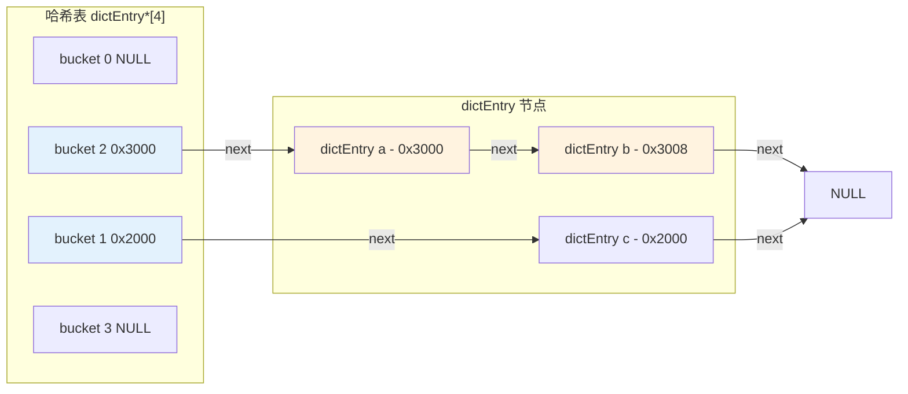
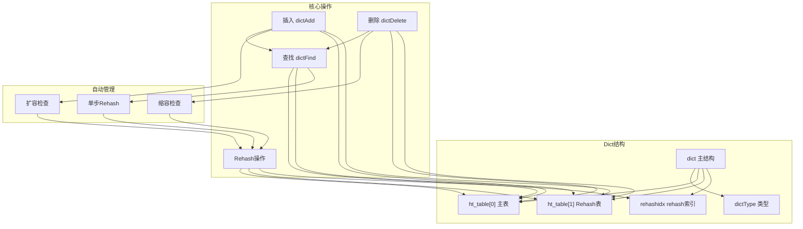
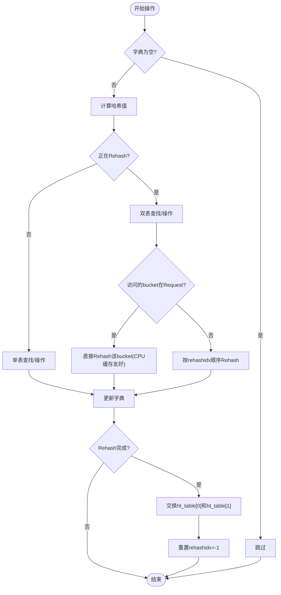
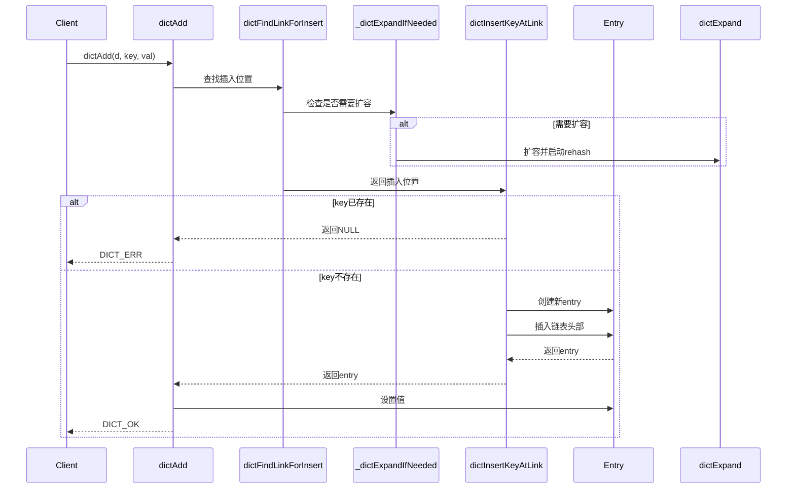
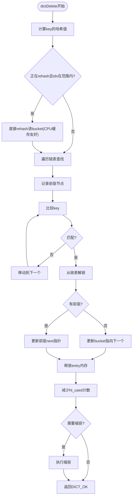
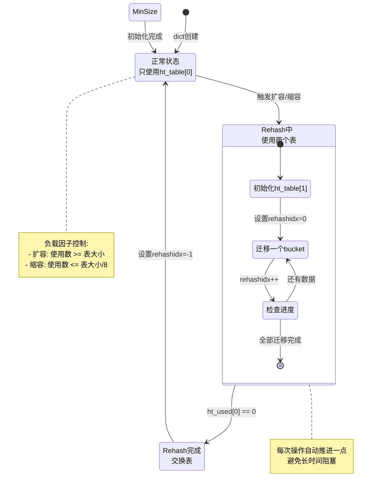
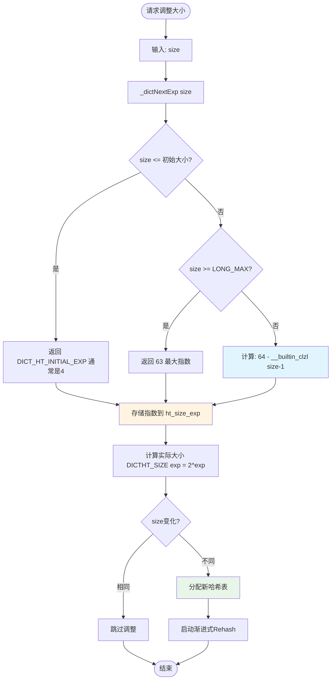

# Redis dict.c 源码讲解 - 核心流程和架构

## 📋 目录
1. [核心数据结构](#核心数据结构)
2. [架构设计](#架构设计)
3. [核心操作流程](#核心操作流程)
4. [渐进式Rehash机制](#渐进式rehash机制)
5. [性能优化技巧](#性能优化技巧)
6. [流程图](#流程图)

---

## 核心数据结构

### 1. dictEntry - 哈希表节点

```c
struct dictEntry {
    struct dictEntry *next;  /* 指向下一个节点，用于链表法解决冲突 */
    void *key;               /* 键指针 */
    union {
        void *val;           /* 值指针 */
        uint64_t u64;        /* 无符号整数值 */
        int64_t s64;         /* 有符号整数值 */
        double d;            /* 双精度浮点数值 */
    } v;
};
```

**特点：**
- 支持多种值类型（指针、整数、浮点数）
- 使用拉链法处理哈希冲突
- 优化：支持 `dictEntryNoValue` 用于无值场景

#### dict 完整内存布局示例

**场景：** 存储3个键值对
```
SET a "value1"  // hash % 4 = 2
SET b "value2"  // hash % 4 = 2 (冲突)
SET c "value3"  // hash % 4 = 1
```

```
┌─────────────────────────────────────────────────────────────┐
│ dict 主结构 (dict)                                          │
├─────────────────────────────────────────────────────────────┤
│ type: 0x7fff80012345                                        │
│ ht_table[0]: 0x1000    ← 主哈希表                          │
│ ht_table[1]: NULL                                            │
│ ht_size_exp[0]: 2 (表示 2^2 = 4 buckets)                    │
│ ht_used[0]: 3 (有3个key)                                    │
│ rehashidx: -1 (未在rehash)                                  │
└─────────────────────────────────────────────────────────────┘
                ↓
┌─────────────────────────────────────────────────────────────┐
│ 哈希表数组 dictEntry*[4]  (在堆上，地址: 0x1000)            │
├──────┬──────┬──────┬──────┤
│ [0]  │ [1]  │ [2]  │ [3]  │  ← bucket索引
│ NULL │ 0x2000│ 0x3000│ NULL│  ← 存储的是dictEntry指针
└──────┴──┬───┴──┬───┴──────┘
          │      │
          ↓      ↓
    ┌─────────┐ ┌─────────────┐
    │entry c  │ │ entry链表   │
    │key: c   │ │(bucket[2])  │
    │val: v3  │ │            │
    └─────────┘ └────┬────────┘
                     │
                     ↓
            ┌─────────────────┐
            │ entry a (头)   │ ← bucket[2]
            │ next → 0x3008 │
            │ key → "a"    │
            │ val → "value1"│
            └───────┬───────┘
                    │ next指针
                    ↓
            ┌───────────────┐
            │ entry b       │
            │ next → NULL   │ ← 链表结束
            │ key → "b"    │
            │ val → "value2"│
            └───────────────┘
```

**详细内存地址示例：**

```
哈希表结构 (dict)
┌────────────────────────────────────┐
│ 地址  │ 字段         │ 值          │
├───────┼──────────────┼─────────────┤
│ 0x0000│ ht_table[0]  │ 0x1000     │ → 指向哈希表数组
│ 0x0008│ ht_used[0]   │ 3          │
│ 0x0010│ ht_size_exp[0]│ 2         │ → size = 2^2 = 4
│ 0x0011│ rehashidx    │ -1         │
└────────────────────────────────────┘

哈希表数组 dictEntry*[4] (地址: 0x1000)
┌──────────┬─────────────┐
│ 索引     │ dictEntry*  │
├──────────┼─────────────┤
│ [0]      │ NULL        │
│ [1]      │ 0x2000      │ → entry c
│ [2]      │ 0x3000      │ → entry a (链表头)
│ [3]      │ NULL        │
└──────────┴─────────────┘

dictEntry c (地址: 0x2000)
┌──────────┬─────────────┐
│ 字段     │ 值          │
├──────────┼─────────────┤
│ next     │ NULL        │
│ key      │ 0x2010      │ → 指向 "c\0"
│ v.val    │ 0x2012      │ → 指向 "value3\0"
└──────────┴─────────────┘

dictEntry a (地址: 0x3000)
┌──────────┬─────────────┐
│ 字段     │ 值          │
├──────────┼─────────────┤
│ next     │ 0x3008      │ → 指向 entry b
│ key      │ 0x3010      │ → 指向 "a\0"
│ v.val    │ 0x3012      │ → 指向 "value1\0"
└──────────┴─────────────┘

dictEntry b (地址: 0x3008)
┌──────────┬─────────────┐
│ 字段     │ 值          │
├──────────┼─────────────┤
│ next     │ NULL        │ → 链表结束
│ key      │ 0x3020      │ → 指向 "b\0"
│ v.val    │ 0x3022      │ → 指向 "value2\0"
└──────────┴─────────────┘
```

**可视化链表连接：**



**关键点：**
- 哈希表数组存储的是 `dictEntry*` 指针（8字节）
- 哈希冲突时，多个entry通过next指针连接成链表
- 每个dictEntry包含：next指针(8字节) + key指针(8字节) + value(8字节) = 24字节
- 索引计算：`idx = hash(key) & (size - 1)`，例如 `hash % 4`

#### Hash函数详解

##### 1. Redis使用的Hash算法：SipHash

Redis 使用 **SipHash** 算法作为默认的哈希函数（在 `siphash.c` 中实现）：

```c
// dict.c 第120行
uint64_t dictGenHashFunction(const void *key, size_t len) {
    return siphash(key, len, dict_hash_function_seed);
}
```

**为什么选择SipHash？**

| 特性 | 说明 | 重要性 |
|-----|------|--------|
| **安全性** | 抗Hash-Flooding攻击 | ⭐⭐⭐⭐⭐ |
| **性能** | 速度快，适合短键 | ⭐⭐⭐⭐⭐ |
| **分布性** | 哈希值分布均匀 | ⭐⭐⭐⭐ |
| **确定性** | 相同输入产生相同输出 | ⭐⭐⭐⭐⭐ |

**安全性对比：**

```
❌ 简单Hash函数（如djb2）:
   所有字符串 → 相同hash值 → 所有数据聚在一个bucket
   → 链表退化，查询O(n) → Hash-Flooding攻击 ✅

✅ SipHash:
   随机种子 → 输出随机分布 → 即使恶意输入也能均匀分布
   → 查询O(1) → 抗攻击 ✅
```

**示例：**
```c
// 相同的key总是得到相同的hash值
key = "user:1234:name"
hash1 = siphash(key, strlen(key), seed);  // 假设输出: 0x8a3f2b1c
hash2 = siphash(key, strlen(key), seed);  // 输出: 0x8a3f2b1c (相同)

// 不同key得到不同的hash值
key1 = "user:1234:name"
key2 = "user:1234:email"
hash1 = siphash(key1, ...);  // 0x8a3f2b1c
hash2 = siphash(key2, ...);  // 0x3f2b1c8a (不同)
```

##### 2. 哈希索引计算

**核心公式：**
```c
// 计算索引
idx = hash(key) & (size - 1);

// 等价于 (当size是2的幂时)
idx = hash(key) % size;
```

**为什么可以用位运算 `&` 代替取模 `%`？**

当 `size` 是2的幂时：
```
size = 16 = 0b00010000
mask = size - 1 = 15 = 0b00001111

hash值   = 0b010101010101  // 任意hash值
mask     = 0b000000001111  // size - 1
result   = 0b000000000101  // 只保留低4位

效果等同于: hash % 16
```

**性能对比：**
```c
// 慢：取模运算
idx = hash % size;  // ~10 CPU周期

// 快：位运算
idx = hash & (size - 1);  // ~1 CPU周期

// 性能提升: 约10倍！
```

##### 3. 负载因子（Load Factor）

**定义：** 负载因子 = 已使用buckets / 总buckets

```
负载因子 = ht_used / ht_size

示例：
- 16个buckets，使用了12个 → 负载因子 = 12/16 = 0.75
- 16个buckets，使用了8个  → 负载因子 = 8/16 = 0.5
```

**Redis的负载因子策略：**

```
扩容触发：
- DICT_RESIZE_ENABLE:  负载因子 >= 1.0 (100%)
- 强制扩容模式:       负载因子 >= 4.0 (400%)

缩容触发：
- DICT_RESIZE_ENABLE:  负载因子 <= 0.125 (12.5%)
- 强制缩容模式:       负载因子 <= 0.03125 (3.125%)
```

**为什么需要控制负载因子？**

```
负载因子过高的后果：
┌─────────┬──────────────┬──────────┐
│ 负载因子 │ 平均查找时间 │ 性能     │
├─────────┼──────────────┼──────────┤
│ 0.5     │ ~1.5次       │ 优秀 ✅  │
│ 1.0     │ ~2.0次       │ 良好 ✅  │
│ 2.0     │ ~3.5次       │ 可接受 ⚠️│
│ 4.0     │ ~7.5次       │ 较差 ❌  │
│ 8.0     │ ~15次        │ 很差 ❌  │
└─────────┴──────────────┴──────────┘
```

#### 哈希冲突解决：拉链法（Separate Chaining）

##### 1. 冲突产生的原因

**定义：** 不同的key经过hash函数计算后得到相同的索引

```
示例：
keys = ["apple", "banana", "orange"]
size = 4  (4个buckets)

hash("apple")  = 12345 → 12345 % 4 = 1
hash("banana") = 23456 → 23456 % 4 = 0  
hash("orange") = 12349 → 12349 % 4 = 1  ← 冲突！与apple同在bucket[1]
```

**冲突概率（生日悖论）：**
```
如果有 n 个元素放在 m 个桶中：

冲突概率 ≈ 1 - e^(-n²/2m)

示例：16个buckets，20个元素
P(冲突) ≈ 1 - e^(-400/32) ≈ 0.99997

结论：哈希冲突是正常的，必须处理！
```

##### 2. 拉链法实现

**基本思想：** 每个bucket存储一个链表，冲突的key放在同一个链表中

```c
// dict.c 第48-57行
struct dictEntry {
    struct dictEntry *next;  // 指向链表下一个节点
    void *key;
    union {
        void *val;
        uint64_t u64;
        int64_t s64;
        double d;
    } v;
};
```

**冲突处理示例：**

```
初始状态：
bucket[1] → NULL

插入 "apple" (hash=1):
bucket[1] → [apple: value1] → NULL

插入 "orange" (hash=1，冲突):
bucket[1] → [apple: value1] → [orange: value2] → NULL

插入 "grape" (hash=0):
bucket[0] → [grape: value3] → NULL
bucket[1] → [apple: value1] → [orange: value2] → NULL
```

##### 3. 查找过程详解

```c
dictEntry *dictFind(dict *d, const void *key) {
    // 1. 计算hash值
    uint64_t hash = dictHashKey(d, key, ...);
    
    // 2. 计算bucket索引
    uint64_t idx = hash & DICTHT_SIZE_MASK(d->ht_size_exp[0]);
    
    // 3. 获取链表头
    dictEntry *entry = d->ht_table[0][idx];
    
    // 4. 遍历链表查找
    while (entry) {
        if (key == entry->key ||  // 快速比较（指针相同）
            cmpFunc(&cache, key, entry->key)) {  // 深度比较
            return entry;  // 找到！
        }
        entry = entry->next;  // 检查下一个节点
    }
    return NULL;  // 未找到
}
```

**时间复杂度分析：**

```
理想情况（无冲突）：
bucket[1] → [apple] → NULL
查找次数: 1次
时间复杂度: O(1)

有冲突的情况：
bucket[1] → [apple] → [orange] → [banana] → NULL
- 查找 "apple":  1次
- 查找 "orange": 2次  
- 查找 "banana": 3次
平均: 2次
时间复杂度: O(k)，k为链表长度

最坏情况（所有key冲突）：
bucket[1] → [key1] → [key2] → ... → [keyN] → NULL
查找次数: 平均 N/2 次
时间复杂度: O(n)  → 这就是Hash-Flooding攻击！
```

##### 4. 插入过程详解

```c
int dictAdd(dict *d, void *key, void *val) {
    // 1. 查找是否已存在
    dictEntry *entry = dictFindLinkForInsert(d, key, &existing);
    if (existing) return DICT_ERR;  // 已存在
    
    // 2. 创建新节点
    entry = zmalloc(sizeof(dictEntry));
    entry->key = key;
    entry->v.val = val;
    
    // 3. 插入链表头部（头插法）
    entry->next = bucket[idx];  // 新节点指向原链表头
    bucket[idx] = entry;  // 更新bucket为新的头
    
    return DICT_OK;
}
```

**为什么用头插法（不是尾插）？**

```
✅ 头插法优点：
- 插入快：无需遍历链表找尾部
- 时间复杂度: O(1)
- 实现简单

❌ 尾插法缺点：
- 插入慢：需要遍历链表
- 时间复杂度: O(k)
- 实现复杂
```

**示例：头插法插入**

```
初始：
bucket[1] → [apple] → NULL

插入 orange：
1. 创建新节点 entry
2. entry->next = bucket[1]  // entry → apple
3. bucket[1] = entry        // bucket → orange

结果：
bucket[1] → [orange] → [apple] → NULL

注意：新插入的键在链表头部！
```

##### 5. 冲突对性能的影响

**均匀分布 vs 不均匀分布：**

```
理想情况（均匀分布）：
┌─────┬─────┬─────┬─────┐
│ b0  │ b1  │ b2  │ b3  │
│ 1   │ 1   │ 1   │ 1   │  每个bucket1个entry
└─────┴─────┴─────┴─────┘
平均查找时间: 1次 ✅

实际情况（略有冲突）：
┌─────┬─────┬─────┬─────┐
│ b0  │ b1  │ b2  │ b3  │
│ 1   │ 2   │ 1   │ 0   │  
└─────┴─────┴─────┴─────┘
平均查找时间: (1+2+1)/4 = 1.5次 ✅

最坏情况（严重冲突）：
┌─────┬─────┬─────┬─────┐
│ b0  │ b1  │ b2  │ b3  │
│ 0   │ 4   │ 0   │ 0   │  所有key集中在b1
└─────┴─────┴─────┴─────┘
平均查找时间: (0+1+2+3+4)/5 = 2次 ⚠️

极坏情况（Hash-Flooding攻击）：
┌─────┬─────┬─────┬─────┐
│ b0  │ b1  │ b2  │ b3  │
│ 0   │ 100000│ 0 │ 0   │  
└─────┴─────┴─────┴─────┘
平均查找时间: 50000次 ❌ 性能灾难！
```

**Redis如何避免Hash-Flooding？**

1. **使用SipHash**：随机种子使恶意输入无法预测hash值
2. **控制负载因子**：及时扩容，保持bucket数量充足
3. **渐进式Rehash**：分散迁移成本，避免长时间阻塞

##### 6. 冲突解决策略对比

| 策略 | 优点 | 缺点 | Redis使用 |
|-----|------|------|----------|
| **开放寻址** | 缓存友好 | 删除复杂，容易聚集 | ❌ |
| **拉链法** | 简单高效 | 需要额外指针内存 | ✅ |
| **再哈希** | 分布更均匀 | 计算开销大 | ❌ |
| **双重散列** | 复杂度适中 | 实现复杂 | ❌ |

**为什么Redis选择拉链法？**

```
✅ 优势：
1. 实现简单：只需一个next指针
2. 删除容易：只需调整链表指针
3. 内存明确：每个entry多8字节
4. 扩容友好：rehash时方便迁移

❌ 开放寻址的问题：
1. 删除困难：需要标记deleted，占用空间
2. 容易聚集：连续冲突导致性能下降
3. 扩容成本：所有entry需要重新分布
```

### 2. dict - 哈希表结构

```c
struct dict {
    dictType *type;                    /* 类型特定函数 */
    
    dictEntry **ht_table[2];           /* 双哈希表，用于渐进式rehash */
    unsigned long ht_used[2];          /* 已使用节点数 */
    signed char ht_size_exp[2];        /* 哈希表大小指数 (size = 1<<exp) */
    
    long rehashidx;                    /* rehash进度，-1表示未进行 */
    
    unsigned pauserehash : 15;         /* 暂停rehash标志 */
    unsigned useStoredKeyApi : 1;      /* 使用存储键API标志 */
    int16_t pauseAutoResize;           /* 暂停自动调整大小 */
    
    void *metadata[];                  /* 元数据 */
};
```

**核心设计：**
- 使用两个哈希表（`ht_table[0]` 和 `ht_table[1]`）实现渐进式rehash
- 大小以2的幂存储（节省内存，位运算更快）
- 元数据扩展支持

---

## 架构设计

### 双哈希表架构

Redis 的 dict 使用**双哈希表**设计，主要目的：

1. **渐进式Rehash**：避免一次性rehash导致的长时间阻塞
2. **查找优化**：查找时同时检查两个表
3. **平滑扩容**：在后台逐步迁移数据

```
正常状态：
┌─────────────┐
│ ht_table[0] │  ← 主要使用
│ ht_table[1] │  ← NULL
└─────────────┘

Rehash状态：
┌─────────────┐
│ ht_table[0] │  ← 旧数据（逐步迁移）
│ ht_table[ Ek│  ← 新数据（逐步增长）
│ 0-3 已迁移  │
│ 4-7 待迁移  │
└─────────────┘
```

### 内存布局优化

**指针编码技巧**（低3位存储元数据）：
```c
#define ENTRY_PTR_NORMAL      0 /* 正常节点 */
#define ENTRY_PTR_IS_ODD_KEY  1 /* 奇数地址键 */
#define ENTRY_PTR_IS_EVEN_KEY 2 /* 偶数地址键 */

// 示例：直接将键存为指针（节省内存）
entry = (dictEntry*)((uintptr_t)key | ENTRY_PTR_IS_ODD_KEY);
```

---

## 核心操作流程

### 1. 查找操作 (dictFind)

**流程：**

```c
dictEntry *dictFind(dict *d, const void *key)
├─ 计算哈希值
├─ 如果正在rehash：
│  ├─ 先进行一次rehash步骤
│  └─ 同时查找两个表
├─ 访问bucket
├─ 遍历链表
└─ 比较键值
```

**关键函数：** `dictFindLinkInternal()` (行761-804)

### 2. 插入操作 (dictAdd)

**流程：**

```c
int dictAdd(dict *d, void *key, void *val)
├─ dictAddRaw() 查找插入位置
│  ├─ dictFindLinkForInsert() 找到bucket
│  ├─ 如果key已存在 → 返回NULL
│  └─ 如果key不存在 → 返回插入位置
├─ 申请新entry
├─ 插入链表头部
└─ 设置值
```

**关键函数：** 
- `dictFindLinkForInsert()` (行1739-1774)
- `dictInsertKeyAtLink()` (行537-575)

### 3. 删除操作 (dictDelete)

**流程：**

```c
int dictDelete(dict *ht, const void *key)
├─ dictGenericDelete()
│  ├─ 计算哈希值
│  ├─ 如果正在rehash → rehash当前bucket
│  ├─ 遍历链表查找
│  ├─ 更新链表
│  └─ 释放entry
└─ 检查是否需要缩容
```

**关键函数：** `dictGenericDelete()` (行622-665)

---

## 渐进式Rehash机制

### Rehash触发条件

**扩容触发**（行1644-1668）：
```c
// 负载因子 >= 1.0（DICT_RESIZE_ENABLE）
// 或负载因子 >= 4.0（强制扩容）
if (d->ht_used[0] >= DICTHT_SIZE(d->ht_size_exp[0]))
    dictExpand(...)
```

**缩容触发**（行1681-1701）：
```c
// 负载因子 <= 1/8（DICT_RESIZE_ENABLE）
// 或负载因子 <= 1/32（强制缩容）
if (d->ht_used[0] * 8 <= DICTHT_SIZE(...))
    dictShrink(...)
```

### Rehash完整过程详解

#### 为什么要渐进式Rehash？

假设我们有 100 万个键值对需要 rehash：

```
❌ 一次性Rehash（阻塞式）:
1. 分配新表（100万×8字节 = 8MB）
2. 逐个迁移所有entry（耗时）
3. 释放旧表
→ 用户等待 100ms+，Redis卡顿！❌

✅ 渐进式Rehash（非阻塞）:
1. 分配新表
2. 每次操作迁移1个bucket（约0.1ms）
3. 在后台慢慢完成
→ 用户无感知！✅
```

#### Rehash状态变化

```
阶段1: 正常状态
┌─────────────────┐
│ ht_table[0]     │ → 有16个buckets，存放数据
│ ht_table[1]     │ → NULL
│ rehashidx       │ → -1 (不在rehash)
└─────────────────┘

阶段2: 开始扩容
┌─────────────────┐
│ ht_table[0]     │ → 有16个buckets，所有数据都在这里
│ ht_table[1]     │ → 新建64个buckets，空的
│ rehashidx       │ → 0 (从索引0开始迁移)
└─────────────────┘

阶段3: Rehash进行中
┌─────────────────┐
│ ht_table[0]     │ → 部分bucket已迁移(0-3已空)，部分还有数据(4-15)
│ ht_table[1]     │ → 部分bucket已有数据(迁移自0-3)，其余待写入
│ rehashidx       │ → 4 (下一个要迁移的bucket索引)
└─────────────────┘

阶段4: Rehash完成
┌─────────────────┐
│ ht_table[0]     │ → 释放旧表
│ ht_table[1]     │ → 所有数据都在这里
│ rehashidx       │ → -1 (不在rehash)
└─────────────────┘

阶段5: 交换表
┌─────────────────┐
│ ht_table[0]     │ → 原ht_table[1]的数据
│ ht_table[1]     │ → NULL
│ rehashidx       │ → -1
└─────────────────┘
```

#### 详细步骤演示

**初始状态：** 有7个键值对，需要从4个bucket扩容到8个bucket

```
┌──────────────────────────────────────────────────────────┐
│ BEFORE: 旧哈希表 ht_table[0] (4 buckets, size_exp=2)   │
├──────┬──────┬──────┬──────┤
│ [0]  │ [1]  │ [2]  │ [3]  │
│ a→A  │ c→C  │ e→E  │ NULL │
│ b→B  │ d→D  │      │      │
│      │ f→F  │      │      │
│      │ g→G  │      │      │
└──────┴──────┴──────┴──────┘
  已用: 7       已用: 0
```

**步骤1：分配新表并初始化**

```c
// 调用 dictExpand(d, 8)
ht_table[1] = zcalloc(8 * sizeof(dictEntry*));  // 分配8个bucket
ht_size_exp[1] = 3;  // 2^3 = 8
rehashidx = 0;       // 从索引0开始迁移
```

```
┌──────────────────────────────────────────────────────────┐
│ 旧表 ht_table[0] (4 buckets)          │ 新表 ht_table[1] (8 buckets)│
├──────┬──────┬──────┬──────┤            ├──────┬──────┬──────┬──────┤
│ [0]  │ [1]  │ [2]  │ [3]  │            │ [0]  │ [1]  │ ...  │ [7]  │
│ a→A  │ c→C  │ e→E  │ NULL │            │ NULL │ NULL │ NULL │ NULL │
│ b→B  │ d→D  │      │      │            │      │      │      │      │
└──────┴──────┴──────┴──────┘            └──────┴──────┴──────┴──────┘
rehashidx = 0 →                               准备迁移bucket[0]
```

**步骤2：第一次rehash（迁移bucket[0]）**

在某个操作时触发：`_dictRehashStepIfNeeded(d, 0)`

```c
// 取出bucket[0]的链表头
entry = ht_table[0][0];  // entry = a→A

// 重新计算在新表中的位置
new_hash = hash("a");
new_idx = new_hash & (8-1);  // new_idx = 0

// 迁移到新表
ht_table[1][0] = a→A;  // 新表的bucket[0]指向a
ht_table[0][0] = b→B;  // 旧表bucket[0]指向下一个entry

// 继续迁移b
new_idx = hash("b") & 7;  // 假设 new_idx = 1
ht_table[1][1] = b→B;  // 新表bucket[1]指向b
ht_table[0][0] = NULL;  // 旧表bucket[0]清空

rehashidx++;  // rehashidx = 1
```

```
┌──────────────────────────────────────────────────────────┐
│ 旧表 ht_table[0]          │ 新表 ht_table[1]          │
├──────┬──────┬──────┬──────┤    ├──────┬──────┬──────┬──────┤
│ [0]  │ [1]  │ [2]  │ [3]  │    │ [0]  │ [1]  │ ...  │ [7]  │
│ NULL │ c→C  │ e→E  │ NULL │    │ a→A  │ b→B  │ NULL │ NULL │
│      │ d→D  │      │      │    │      │      │      │      │
│      │ f→F  │      │      │    │      │      │      │      │
│      │ g→G  │      │      │    │      │      │      │      │
└──────┴──────┴──────┴──────┘    └──────┴──────┴──────┴──────┘
         ↑                               已迁移: 2
    rehashidx=1                           待迁移: 5
```

**步骤3：继续迁移bucket[1]**

在下一次操作时触发：`_dictRehashStepIfNeeded(d, 1)`

```c
// 处理bucket[1]中的所有entry: c→C, d→D, f→F, g→G
entry = ht_table[0][1];  // 取出c→C

// 对每个entry重新计算哈希
new_idx_c = hash("c") & 7;  // 假设 = 2
new_idx_d = hash("d") & 7;  // 假设 = 3
new_idx_f = hash("f") & 7;  // 假设 = 3 (和d冲突)
new_idx_g = hash("g") & 7;  // 假设 = 3 (和d,f冲突)

// 迁移到新表
ht_table[1][2] = c→C;
ht_table[1][3] = d→D;
  d→D.next → f→F;
  f→F.next → g→G;
  g→G.next → NULL;

ht_table[0][1] = NULL;
rehashidx++;  // rehashidx = 2
```

```
┌──────────────────────────────────────────────────────────┐
│ 旧表 ht_table[0]          │ 新表 ht_table[1]          │
├──────┬──────┬──────┬──────┤    ├──────┬──────┬──────┬──────┤
│ [0]  │ [1]  │ [2]  │ [3]  │    │ [0]  │ [1]  │ [2]  │ [3]  │
│ NULL │ NULL │ e→E  │ NULL │    │ a→A  │ b→B  │ c→C  │ d→D  │
│      │      │      │      │    │      │      │      │ f→F  │
│      │      │      │      │    │      │      │      │ g→G  │
└──────┴──────┴──────┴──────┘    └──────┴──────┴──────┴──────┘
              ↑                                     已迁移: 6
         rehashidx=2                                待迁移: 1
```

**步骤4：迁移最后一个bucket[2]**

```c
entry = ht_table[0][2];  // e→E
new_idx_e = hash("e") & 7;  // 假设 = 5
ht_table[1][5] = e→E;
ht_table[0][2] = NULL;

ht_used[0] = 0;  // 旧表已清空！
rehashidx++;  // rehashidx = 3
```

**步骤5：检测rehash完成并交换表**

```c
// 在 dictRehash() 中检查
if (d->ht_used[0] == 0) {
    // 释放旧表
    zfree(d->ht_table[0]);
    
    // 交换表
    d->ht_table[0] = d->ht_table[1];
    d->ht_size_exp[0] = d->ht_size_exp[1];
    d->ht_used[0] = d->ht_used[1];
    
    // 清空新表
    d->ht_table[1] = NULL;
    d->ht_size_exp[1] = -1;
    d->ht_used[1] = 0;
    
    rehashidx = -1;  // rehash完成
}
```

```
┌──────────────────────────────────────────────────────────┐
│ AFTER: 新哈希表 ht_table[0] (8 buckets, size_exp=3)    │
├──────┬──────┬──────┬──────┬──────┬──────┬──────┬──────┤
│ [0]  │ [1]  │ [2]  │ [3]  │ [4]  │ [5]  │ [6]  │ [7]  │
│ a→A  │ b→B  │ c→C  │ d→D  │ NULL │ e→E  │ NULL │ NULL │
│      │      │      │ f→F  │      │      │      │      │
│      │      │      │ g→G  │      │      │      │      │
└──────┴──────┴──────┴──────┴──────┴──────┴──────┴──────┘
  已用: 7        rehashidx = -1 (已完成)
```

#### 查找操作在Rehash时的处理

**重要：** 在rehash期间，查找需要同时查找两个表！

```c
dictEntry *dictFind(dict *d, const void *key) {
    uint64_t h = hash(key);
    
    // 在rehash时，需要检查两个表
    for (table = 0; table <= 1; table++) {
        idx = h & mask[table];
        
        // 跳过已经rehash过的bucket（在表0中）
        if (table == 0 && idx < rehashidx) {
            continue;  // 这个bucket已经迁移到表1了
        }
        
        // 在表0或表1中查找
        entry = ht_table[table][idx];
        while (entry) {
            if (compare(key, entry->key)) {
                return entry;
            }
            entry = entry->next;
        }
        
        if (!dictIsRehashing(d)) break;  // 不在rehash，只查表0
    }
    return NULL;
}
```

**示例：** 查找 key="c"，rehashidx=2

```
表0: bucket[2] 之后未迁移，可能还有"c"
表1: bucket[2] 是已迁移的数据，"c"可能在这里

查找顺序：
1. 检查表0的bucket[2] → 未找到
2. 检查表1的bucket[2] → 找到！✅
```

#### 插入操作在Rehash时的处理

```c
// 插入时，始终插入到新表（表1），如果存在的话
if (dictIsRehashing(d)) {
    target_table = 1;  // 插入到新表
} else {
    target_table = 0;  // 插入到旧表
}
```

### 关键优势总结

| 特性 | 说明 | 效果 |
|-----|------|------|
| **非阻塞** | 每次只迁移1个bucket | 用户无感知延迟 |
| **分散成本** | 在正常操作中逐步完成 | 避免集中耗时 |
| **双表并存** | 查找时检查两个表 | 数据不丢失 |
| **智能触发** | 操作时顺便迁移 | 充分利用CPU时间 |

### 自动推进机制

**单次操作推进：**
```c
// 每次查找/插入/删除时
_dictRehashStepIfNeeded(d, idx);
// → 只迁移1个bucket（0.1ms内完成）
```

**空闲时间推进：**
```c
// 服务器空闲时
dictRehashMicroseconds(d, 1000);
// → 持续rehash最多1ms，迁移多个bucket
```

---

## 性能优化技巧

### 1. 大小存储为2的幂指数

```c
// 节省内存：用指数替代实际大小
signed char ht_size_exp[2];  // size = 1 << exp

// 位运算快速计算
#define DICTHT_SIZE(exp) (1ULL << (exp))
#define DICTHT_SIZE_MASK(exp) (DICTHT_SIZE(exp) - 1)
```

### 2. 无值模式优化 (no_value)

```c
// 优化：不分配entry，直接将key存入bucket
if (d->type->no_value && !bucket[0]) {
    entry = (dictEntry*)((uintptr_t)key | ENTRY_PTR_IS_ODD_KEY);
}
```

### 3. Prefetch优化

```c
// 预取下一个entry，提高缓存命中率
redis_prefetch_read(dictGetNext(*link));
```

### 4. 批量采样优化

使用 **Reservoir Sampling** 算法进行随机采样（行1344-1360）：

```c
// 从链表中均匀采样
if (stored < count) {
    des[stored] = he;
} else {
    unsigned long r = randomULong() % (stored + 1);
    if (r < count) des[r] = he;
}
```

---

## 流程图

### 全局架构流程图



### Rehash流程详细图



### 插入操作流程图



### 查找操作流程图

```mermaid
flowchart TD
    Start([dictFind开始]) --> Empty{字典为空?}
    Empty -->|是| ReturnNull[返回 NULL]
    Empty -->|否| Hash[计算key的哈希值]
    
    Hash --> RehashCheck{正在<br/>Rehash?}
    RehashCheck -->|是| DoRehash[执行一次short rehash]
    RehashCheck -->|否| FindTable0
    
    DoRehash --> FindTable0[在ht_table[0]查找]
    FindTable0 --> RehashIdx{idx < rehashidx?}
    RehashIdx -->|是| Skip0[跳过ht_table[0]]
    RehashIdx -->|否| Search0[在ht_table[0]搜索]
    
    Skip0 --> FindTable1
    Search0 --> Found0{找到?}
    Found0 -->|是| Return[返回entry]
    Found0 -->|否| FindTable1[在ht_table[1]查找]
    
    FindTable1 --> Search1[在ht_table[1]搜索]
    Search1 --> Found1{找到?}
    Found1 -->|是| Return
    Found1 -->|否| ReturnNull
    
    ReturnNull --> End([结束])
    Return --> End
```

### 删除操作流程图



### 渐进式Rehash机制



---

## 关键代码段说明

### 0. 哈希表大小计算优化（重点讲解）

**代码位置：** `dict.c` 第241行

```c
signed char new_ht_size_exp = _dictNextExp(size);
```

#### 为什么存储"指数"而不是直接存储大小？

Redis 使用了一个**非常聪明的优化**：

##### 1. 内存节省

```c
// ❌ 传统方式：直接存储大小
struct dict {
    unsigned long ht_size[2];  // 8字节 × 2 = 16字节
    // ...
};

// ✅ Redis优化：存储2的幂指数
struct dict {
    signed char ht_size_exp[2];  // 1字节 × 2 = 2字节
    // ... 节省了 14字节！
};

// 计算实际大小
size = 1 << ht_size_exp;  // 位运算，速度极快
```

##### 2. `_dictNextExp()` 函数详解

```c
static signed char _dictNextExp(unsigned long size)
{
    // 最小值：返回初始大小指数（通常是4，即2^4=16）
    if (size <= DICT_HT_INITIAL_SIZE) return DICT_HT_INITIAL_EXP;
    
    // 最大值：防止溢出，返回long类型的最大指数
    if (size >= LONG_MAX) return (8*sizeof(long)-1);
    
    // 核心算法：计算大于等于size的最小2的幂
    // 例如：size=100 → exp=7 (2^7=128)
    return 8*sizeof(long) - __builtin_clzl(size-1);
}
```

**`__builtin_clzl()`** 函数说明：
- 作用：计算 `long` 类型数字中**前导零**的个数（Leading Zeros Left）
- 示例：
  ```c
  __builtin_clzl(100-1) = __builtin_clzl(99)
  // 99 in binary: 0b01100011
  // 前导零: 1 个
  // 所以: 64 - 1 - 1 = 62（不是这个）
  
  // 正确理解：计算需要多少位来表示这个数
  // 99需要7位（2^6=64 < 99 < 2^7=128）
  ```

**实际计算示例：**

| 期望大小 | 二进制表示 | 前导零 | 计算结果 | 实际大小(2^exp) |
|---------|-----------|--------|---------|----------------|
| 50      | 0b110010  | 58     | 6       | 64             |
| 100     | 0b1100100 | 57     | 7       | 128            |
| 256     | 0b100000000| 55    | 9       | 512            |

##### 3. 为什么使用2的幂？

**性能优势：**

```c
// 哈希映射：hash(key) % size
// 如果size是2的幂：

// 慢：取模运算
idx = hash % size;

// 快：位运算（size-1的二进制全是1）
idx = hash & (size - 1);
```

**示例对比：**
```c
// size = 16 (2^4)
size_mask = 15 = 0b1111

// 位运算
hash = 0b10110101
idx = hash & mask = 0b10110101 & 0b1111 = 0b0101 = 5

// 等价于取模
idx = hash % 16 = 181 % 16 = 5
```

##### 4. 完整扩容流程中的使用

```c
int _dictResize(dict *d, unsigned long size, int* malloc_failed)
{
    // 第241行：计算新表的大小指数
    signed char new_ht_size_exp = _dictNextExp(size);
    
    // 计算实际大小并检测溢出
    size_t newsize = DICTHT_SIZE(new_ht_size_exp);
    // DICTHT_SIZE(exp) = 1 << exp
    
    // 检查是否需要调整（避免重复resize）
    if (new_ht_size_exp == d->ht_size_exp[0]) 
        return DICT_ERR;
    
    // 分配新表（实际使用newsize个bucket）
    new_ht_table = zcalloc(newsize * sizeof(dictEntry*));
    
    // 保存指数（而不是实际大小）
    d->ht_size_exp[1] = new_ht_size_exp;
    
    // ...
}
```

##### 5. 内存和性能对比

**传统方式：**
```c
struct dict {
    unsigned long ht_size[2];  // 8字节 × 2
    unsigned long ht_used[2];  // 8字节 × 2
    // 数组指针、rehashidx等...
};
// 总大小：约 80 字节
```

**Redis方式：**
```c
struct dict {
    signed char ht_size_exp[2];  // 1字节 × 2
    // ... 其他字段
};
// 总大小：约 68 字节（节省15%）

// 运算速度：位运算比取模快5-10倍
idx = hash & (size - 1);  // ~1 CPU周期
idx = hash % size;        // ~10 CPU周期
```

##### 6. 实际运行示例

```c
// 初始状态
ht_size_exp[0] = -1  // 未初始化

// 添加第1个元素，触发初始化
_dictResize(d, 1, NULL);
// new_ht_size_exp = _dictNextExp(1) = 4
// 实际大小 = 2^4 = 16

// 添加第16个元素，触发扩容
_dictResize(d, 16, NULL);
// new_ht_size_exp = _dictNextExp(16) = 5
// 实际大小 = 2^5 = 32

// 删除元素，触发缩容
_dictResize(d, 2, NULL);
// new_ht_size_exp = _dictNextExp(2) = 4
// 实际大小 = 2^4 = 16
```

##### 7. 设计权衡

**优势：**
- ✅ 节省内存：1字节 vs 8字节
- ✅ 位运算更快：`&` 比 `%` 快
- ✅ 大小对齐：2的幂对CPU缓存友好

**限制：**
- ⚠️ 大小必须是2的幂（可能浪费一点空间）
- ⚠️ 最大大小受限于 `signed char`（127位，即2^127）

**空间浪费分析：**
```
期望大小: 100
实际大小: 128 (浪费28%，但可以接受)

期望大小: 1亿
实际大小: 134,217,728 (浪费34%，在可接受范围)
```

#### 可视化流程



### 1. 渐进式Rehash关键函数

```c
// 每次操作前检查是否需要rehash
static void _dictRehashStepIfNeeded(dict *d, uint64_t visitedIdx) {
    if (!dictIsRehashing(d) || d->pauserehash != 0)
        return;
    
    // 如果访问的bucket正好在rehash进度中，优先rehash它（缓存友好）
    if ((long)visitedIdx >= d->rehashidx && d->ht_table[0][visitedIdx]) {
        _dictBucketRehash(d, visitedIdx);
    } else {
        // 否则按顺序rehash
        dictRehash(d, 1);
    }
}
```

### 2. 查找插入位置

```c
dictEntryLink dictFindLinkForInsert(dict *d, const void *key, dictEntry **existing) {
    // 计算哈希
    uint64_t hash = dictHashKey(d, key, d->useStoredKeyApi);
    idx = hash & DICTHT_SIZE_MASK(d->ht_size_exp[0]);
    
    // 检查rehash
    _dictRehashStepIfNeeded(d, idx);
    
    // 检查扩容
    _dictExpandIfNeeded(d);
    
    // 查找key
    for (table = 0; table <= 1; table++) {
        he = d->ht_table[table][idx];
        while(he) {
            void *he_key = dictGetKey(he);
            if (key == he_key || cmpFunc(&cmpCache, key, he_key)) {
                if (existing) *existing = he;
                return NULL;  // key已存在
            }
            he = dictGetNext(he);
        }
        if (!dictIsRehashing(d)) break;
    }
    
    // 返回插入位置
    return &d->ht_table[dictIsRehashing(d) ? 1 : 0][idx];
}
```

### 3. 无值模式优化

```c
static inline dictEntry *createEntryNoValue(void *key, dictEntry *next) {
    dictEntryNoValue *entry = zmalloc(sizeof(dictEntryNoValue));  // 更小的结构体
    entry->key = key;
    entry->next = next;
    return (dictEntry *)entry;
}

// 进一步优化：直接存储key指针
if (!bucket[0]) {
    if (d->type->keys_are_odd)
        entry = key;  // 奇数地址本身就是标志位
    else
        entry = encodeMaskedPtr(key, ENTRY_PTR_IS_EVEN_KEY);
}
```

---

## 总结

### 核心设计思想

1. **渐进式Rehash**：避免一次性rehash造成长时间阻塞
2. **双表架构**：平滑过渡，查找时同时检查两个表
3. **内存优化**：用指数存储大小，支持无值模式
4. **性能优化**：Prefetch、缓存友好的rehash、批量采样

### 适用场景

- Redis的所有键值对存储
- 所有哈希数据类型（hash）
- 集合类型（set）作为无值模式使用
- 需要快速查找的数据结构

### 关键特性

- 时间复杂度：平均 O(1)，最坏 O(n)
- 负载因子：自动保持在合理范围
- 线程安全：单线程模型，无需锁
- 内存效率：多种优化减少内存占用

---

## 参考资料

- `dict.c` - Redis哈希表实现（2346行）
- `dict.h` - 类型定义和API声明
- Redis源码注释和文档
