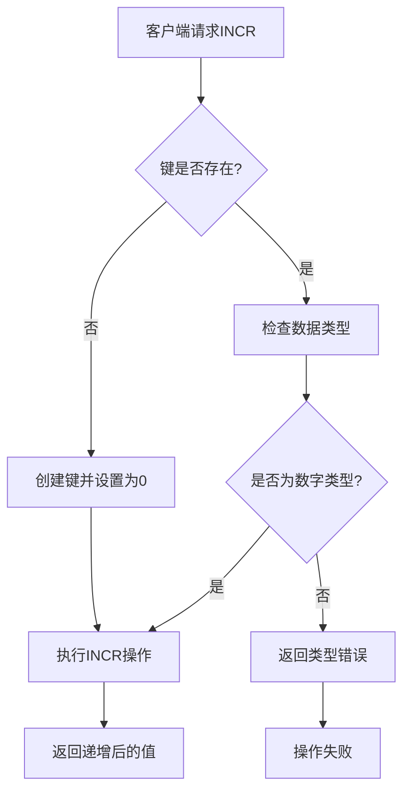
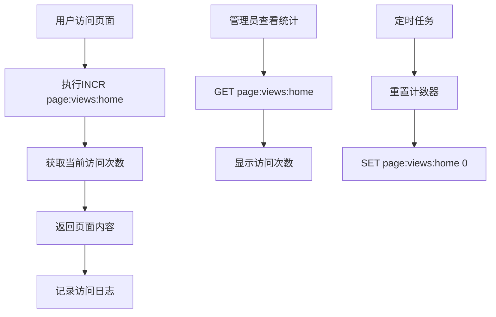
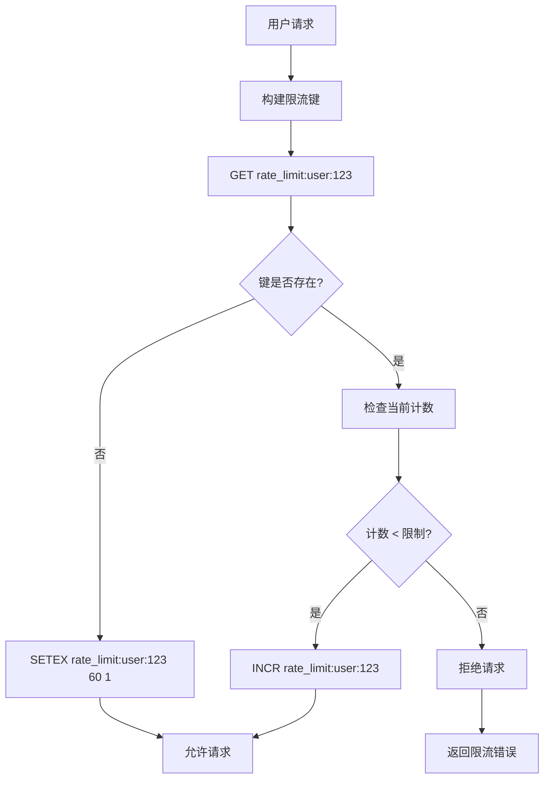
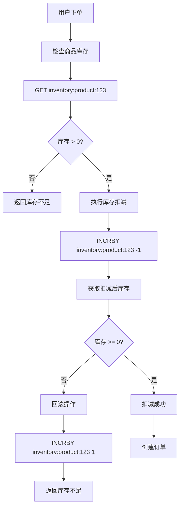
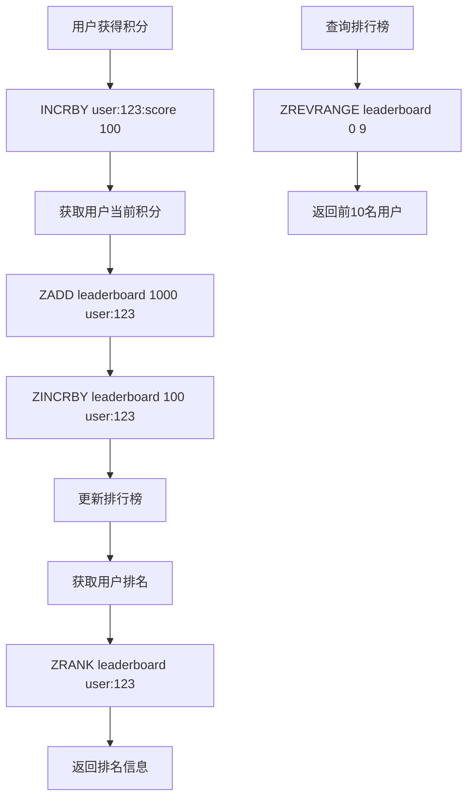
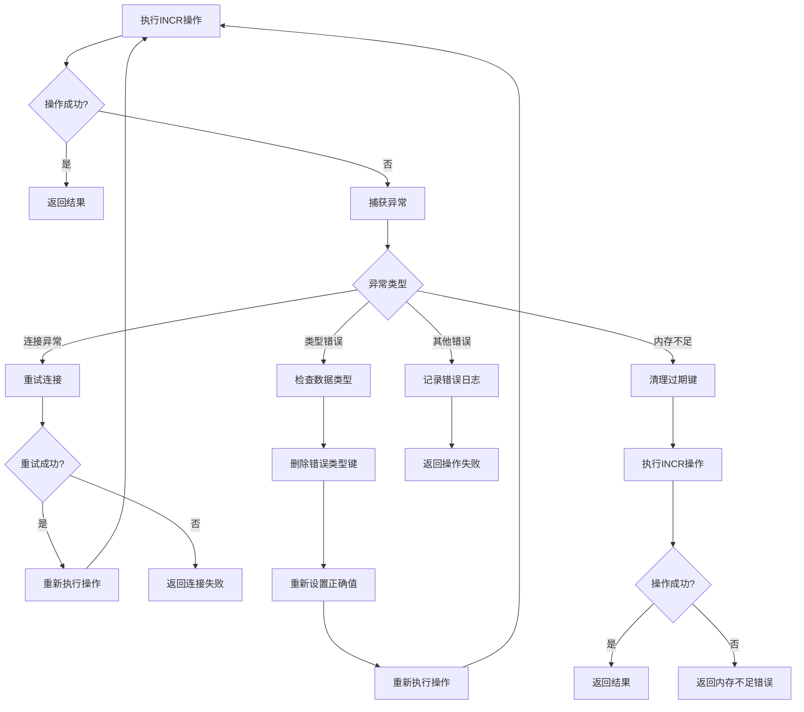

# Redis INCR 使用指南

## 1. Redis INCR 概述

Redis INCR 是 Redis 提供的一组原子性递增操作命令，用于对存储在 Redis 中的数值进行原子性的增加操作。这些命令是线程安全的，在高并发环境下非常有用。

### 1.1 主要特点

- **原子性**：操作是原子性的，不会出现竞态条件
- **高性能**：内存操作，响应速度快
- **线程安全**：支持高并发访问
- **自动初始化**：如果键不存在，会自动初始化为0后执行操作

## 2. INCR 命令族

### 2.1 INCR

**语法**：`INCR key`

**功能**：将 key 中存储的数字值增一

**返回值**：执行 INCR 命令之后 key 的值

**示例**：
```redis
redis> SET mykey 10
OK
redis> INCR mykey
(integer) 11
redis> GET mykey
"11"
```

### 2.2 INCRBY

**语法**：`INCRBY key increment`

**功能**：将 key 中存储的数字值增加指定的增量

**参数**：
- `key`：要操作的键
- `increment`：增量值（可以是负数）

**返回值**：执行 INCRBY 命令之后 key 的值

**示例**：
```redis
redis> SET mykey 10
OK
redis> INCRBY mykey 5
(integer) 15
redis> INCRBY mykey -3
(integer) 12
redis> GET mykey
"12"
```

### 2.3 INCRBYFLOAT

**语法**：`INCRBYFLOAT key increment`

**功能**：为 key 中存储的数字值加上指定的浮点数增量

**参数**：
- `key`：要操作的键
- `increment`：浮点数增量值

**返回值**：执行 INCRBYFLOAT 命令之后 key 的值

**示例**：
```redis
redis> SET mykey 10.50
OK
redis> INCRBYFLOAT mykey 0.1
"10.6"
redis> INCRBYFLOAT mykey -5
"5.6"
redis> GET mykey
"5.6"
```

### 2.4 DECR

**语法**：`DECR key`

**功能**：将 key 中存储的数字值减一

**返回值**：执行 DECR 命令之后 key 的值

**示例**：
```redis
redis> SET mykey 10
OK
redis> DECR mykey
(integer) 9
redis> GET mykey
"9"
```

### 2.5 DECRBY

**语法**：`DECRBY key decrement`

**功能**：将 key 中存储的数字值减少指定的减量

**参数**：
- `key`：要操作的键
- `decrement`：减量值

**返回值**：执行 DECRBY 命令之后 key 的值

**示例**：
```redis
redis> SET mykey 10
OK
redis> DECRBY mykey 3
(integer) 7
redis> GET mykey
"7"
```

## 3. 实际应用场景

### 3.1 计数器

**场景**：网站访问量统计、用户行为统计

**实现**：
```redis
# 页面访问计数
INCR page:views:home
INCR page:views:about

# 用户行为统计
INCR user:123:login_count
INCR user:123:click_count
```

### 3.2 限流器

**场景**：API 限流、用户操作频率限制

**实现**：
```redis
# 基于滑动窗口的限流
# 用户每分钟最多发送10条消息
MULTI
INCR user:123:messages:minute
EXPIRE user:123:messages:minute 60
EXEC

# 检查是否超过限制
GET user:123:messages:minute
```

### 3.3 分布式锁

**场景**：分布式系统中的互斥访问

**实现**：
```redis
# 简单的分布式锁实现
SET lock:resource "locked" EX 10 NX
# 如果返回 OK，表示获取锁成功
# 如果返回 nil，表示锁已被其他进程持有
```

### 3.4 库存管理

**场景**：商品库存扣减、票务系统

**实现**：
```redis
# 商品库存扣减
INCRBY product:123:stock -1

# 检查库存是否充足
GET product:123:stock
```

### 3.5 排行榜

**场景**：游戏积分、用户评分

**实现**：
```redis
# 用户积分增加
INCRBY user:123:score 100

# 使用有序集合维护排行榜
ZADD leaderboard 1000 user:123
ZINCRBY leaderboard 100 user:123
```

## 4. 代码示例

### 4.1 Python 示例

```python
import redis
import time

# 连接Redis
r = redis.Redis(host='localhost', port=6379, db=0)

# 计数器示例
def increment_counter(key):
    """递增计数器"""
    return r.incr(key)

# 限流器示例
def rate_limiter(user_id, limit=10, window=60):
    """简单的限流器"""
    key = f"rate_limit:{user_id}"
    
    # 获取当前计数
    current = r.get(key)
    if current is None:
        # 第一次访问，设置计数为1，过期时间为窗口大小
        r.setex(key, window, 1)
        return True
    elif int(current) < limit:
        # 未超过限制，递增计数
        r.incr(key)
        return True
    else:
        # 超过限制
        return False

# 库存扣减示例
def deduct_inventory(product_id, quantity=1):
    """扣减库存"""
    key = f"inventory:{product_id}"
    
    # 使用管道确保原子性
    pipe = r.pipeline()
    pipe.get(key)
    pipe.incrby(key, -quantity)
    results = pipe.execute()
    
    current_stock = int(results[0]) if results[0] else 0
    new_stock = results[1]
    
    if new_stock < 0:
        # 库存不足，回滚
        r.incrby(key, quantity)
        return False, "库存不足"
    
    return True, f"扣减成功，剩余库存：{new_stock}"

# 使用示例
if __name__ == "__main__":
    # 计数器测试
    print("计数器测试：")
    for i in range(5):
        count = increment_counter("test_counter")
        print(f"当前计数：{count}")
    
    # 限流器测试
    print("\n限流器测试：")
    user_id = "user_123"
    for i in range(15):
        allowed = rate_limiter(user_id, limit=10, window=60)
        print(f"请求 {i+1}: {'允许' if allowed else '拒绝'}")
    
    # 库存管理测试
    print("\n库存管理测试：")
    product_id = "product_456"
    r.set(f"inventory:{product_id}", 10)  # 设置初始库存
    
    for i in range(12):
        success, message = deduct_inventory(product_id)
        print(f"扣减 {i+1}: {message}")
```

### 4.2 Java 示例

```java
import redis.clients.jedis.Jedis;
import redis.clients.jedis.Pipeline;
import java.util.List;

public class RedisIncrExample {
    private Jedis jedis;
    
    public RedisIncrExample() {
        this.jedis = new Jedis("localhost", 6379);
    }
    
    // 计数器
    public long incrementCounter(String key) {
        return jedis.incr(key);
    }
    
    // 限流器
    public boolean rateLimiter(String userId, int limit, int window) {
        String key = "rate_limit:" + userId;
        
        // 使用Lua脚本确保原子性
        String script = 
            "local current = redis.call('GET', KEYS[1]) " +
            "if current == false then " +
            "    redis.call('SETEX', KEYS[1], ARGV[2], 1) " +
            "    return 1 " +
            "else " +
            "    local count = tonumber(current) " +
            "    if count < tonumber(ARGV[1]) then " +
            "        return redis.call('INCR', KEYS[1]) " +
            "    else " +
            "        return -1 " +
            "    end " +
            "end";
        
        Long result = (Long) jedis.eval(script, 1, key, String.valueOf(limit), String.valueOf(window));
        return result > 0;
    }
    
    // 库存扣减
    public boolean deductInventory(String productId, int quantity) {
        String key = "inventory:" + productId;
        
        // 使用管道
        Pipeline pipeline = jedis.pipelined();
        pipeline.get(key);
        pipeline.incrBy(key, -quantity);
        List<Object> results = pipeline.syncAndReturnAll();
        
        String currentStockStr = (String) results.get(0);
        long currentStock = currentStockStr != null ? Long.parseLong(currentStockStr) : 0;
        long newStock = (Long) results.get(1);
        
        if (newStock < 0) {
            // 库存不足，回滚
            jedis.incrBy(key, quantity);
            return false;
        }
        
        return true;
    }
    
    public void close() {
        jedis.close();
    }
    
    public static void main(String[] args) {
        RedisIncrExample example = new RedisIncrExample();
        
        // 计数器测试
        System.out.println("计数器测试：");
        for (int i = 0; i < 5; i++) {
            long count = example.incrementCounter("test_counter");
            System.out.println("当前计数：" + count);
        }
        
        // 限流器测试
        System.out.println("\n限流器测试：");
        String userId = "user_123";
        for (int i = 0; i < 15; i++) {
            boolean allowed = example.rateLimiter(userId, 10, 60);
            System.out.println("请求 " + (i+1) + ": " + (allowed ? "允许" : "拒绝"));
        }
        
        example.close();
    }
}
```

### 4.3 Node.js 示例

```javascript
const redis = require('redis');
const client = redis.createClient();

// 计数器
async function incrementCounter(key) {
    return await client.incr(key);
}

// 限流器
async function rateLimiter(userId, limit = 10, window = 60) {
    const key = `rate_limit:${userId}`;
    
    const script = `
        local current = redis.call('GET', KEYS[1])
        if current == false then
            redis.call('SETEX', KEYS[1], ARGV[2], 1)
            return 1
        else
            local count = tonumber(current)
            if count < tonumber(ARGV[1]) then
                return redis.call('INCR', KEYS[1])
            else
                return -1
            end
        end
    `;
    
    const result = await client.eval(script, 1, key, limit, window);
    return result > 0;
}

// 库存扣减
async function deductInventory(productId, quantity = 1) {
    const key = `inventory:${productId}`;
    
    const multi = client.multi();
    multi.get(key);
    multi.incrby(key, -quantity);
    const results = await multi.exec();
    
    const currentStock = results[0] ? parseInt(results[0]) : 0;
    const newStock = results[1];
    
    if (newStock < 0) {
        // 库存不足，回滚
        await client.incrby(key, quantity);
        return { success: false, message: '库存不足' };
    }
    
    return { success: true, message: `扣减成功，剩余库存：${newStock}` };
}

// 使用示例
async function main() {
    await client.connect();
    
    // 计数器测试
    console.log('计数器测试：');
    for (let i = 0; i < 5; i++) {
        const count = await incrementCounter('test_counter');
        console.log(`当前计数：${count}`);
    }
    
    // 限流器测试
    console.log('\n限流器测试：');
    const userId = 'user_123';
    for (let i = 0; i < 15; i++) {
        const allowed = await rateLimiter(userId, 10, 60);
        console.log(`请求 ${i+1}: ${allowed ? '允许' : '拒绝'}`);
    }
    
    await client.quit();
}

main().catch(console.error);
```

## 5. 最佳实践

### 5.1 性能优化

1. **使用管道**：批量操作时使用管道提高性能
2. **Lua脚本**：复杂逻辑使用Lua脚本保证原子性
3. **连接池**：使用连接池管理Redis连接
4. **键设计**：合理设计键名，避免键冲突

### 5.2 错误处理

1. **异常捕获**：正确处理Redis连接异常
2. **重试机制**：网络异常时实现重试
3. **降级策略**：Redis不可用时使用降级方案
4. **监控告警**：监控Redis性能和错误率

### 5.3 数据一致性

1. **原子操作**：使用INCR等原子操作
2. **事务处理**：复杂操作使用MULTI/EXEC
3. **Lua脚本**：确保操作的原子性
4. **回滚机制**：操作失败时实现回滚

### 5.4 安全考虑

1. **键名规范**：使用有意义的键名
2. **权限控制**：限制Redis访问权限
3. **数据加密**：敏感数据加密存储
4. **审计日志**：记录重要操作日志

## 6. 常见问题

### 6.1 数据类型错误

**问题**：对非数字类型的值执行INCR操作

**解决方案**：
```redis
# 检查数据类型
TYPE mykey

# 如果类型不是string，先删除再设置
DEL mykey
SET mykey 0
INCR mykey
```

### 6.2 精度问题

**问题**：浮点数精度丢失

**解决方案**：
```redis
# 使用INCRBYFLOAT处理浮点数
SET price 10.5
INCRBYFLOAT price 0.1
# 结果：10.6
```

### 6.3 并发问题

**问题**：高并发下的竞态条件

**解决方案**：
```redis
# 使用Lua脚本确保原子性
EVAL "
local current = redis.call('GET', KEYS[1])
if current == false then
    redis.call('SET', KEYS[1], 1)
    return 1
else
    return redis.call('INCR', KEYS[1])
end
" 1 mykey
```

## 7. Redis INCR 使用流程图

### 7.1 基本INCR操作流程图



### 7.2 计数器应用流程图



### 7.3 限流器实现流程图



### 7.4 库存扣减流程图



### 7.5 分布式锁流程图

```mermaid
graph TD
    A[进程A请求锁] --> B[SET lock:resource "A" EX 10 NX]
    B --> C{返回OK?}
    C -->|是| D[获取锁成功]
    C -->|否| E[锁已被占用]
    D --> F[执行业务逻辑]
    F --> G[DEL lock:resource]
    G --> H[释放锁]
    
    I[进程B请求锁] --> J[SET lock:resource "B" EX 10 NX]
    J --> K{返回OK?}
    K -->|是| L[获取锁成功]
    K -->|否| M[等待或重试]
    M --> N[检查锁是否过期]
    N --> O{锁已过期?}
    O -->|是| P[重新尝试获取锁]
    O -->|否| Q[继续等待]
    P --> J
```

### 7.6 排行榜更新流程图



### 7.7 错误处理流程图



## 8. 总结

Redis INCR 命令是构建高性能计数器和限流器的重要工具。通过合理使用这些命令，可以实现：

- **高性能**：内存操作，响应速度快
- **原子性**：避免竞态条件
- **可扩展性**：支持分布式环境
- **灵活性**：支持整数和浮点数操作

在实际应用中，要根据具体业务场景选择合适的命令和实现方案，并注意性能优化、错误处理和数据一致性等问题。

### 8.1 关键要点

1. **选择合适的命令**：根据需求选择INCR、INCRBY或INCRBYFLOAT
2. **处理并发问题**：使用Lua脚本或事务确保原子性
3. **错误处理**：实现完善的异常处理和重试机制
4. **性能优化**：使用管道和连接池提高性能
5. **监控告警**：监控Redis性能和错误率

### 8.2 使用建议

- 对于简单计数器，直接使用INCR
- 对于限流器，结合EXPIRE使用
- 对于库存管理，使用事务或Lua脚本
- 对于排行榜，结合有序集合使用
- 对于分布式锁，使用SET NX EX模式
