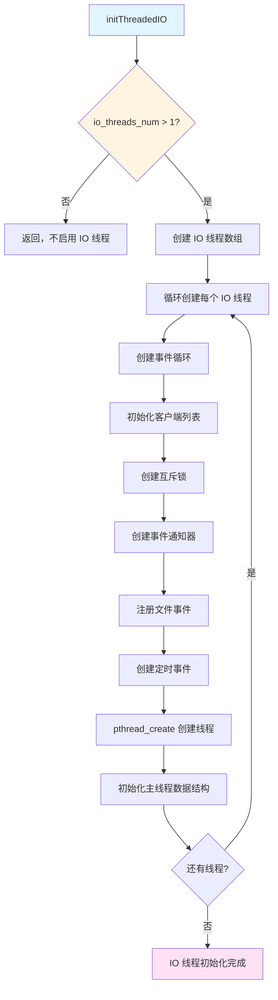
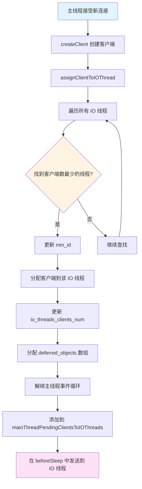
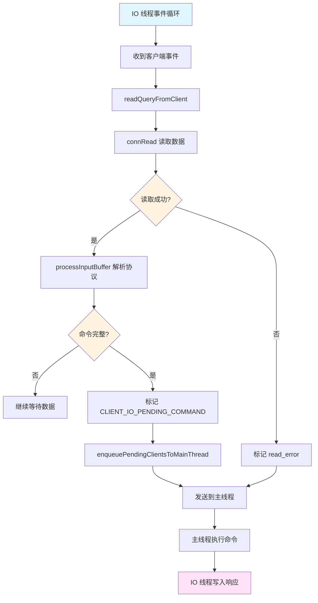
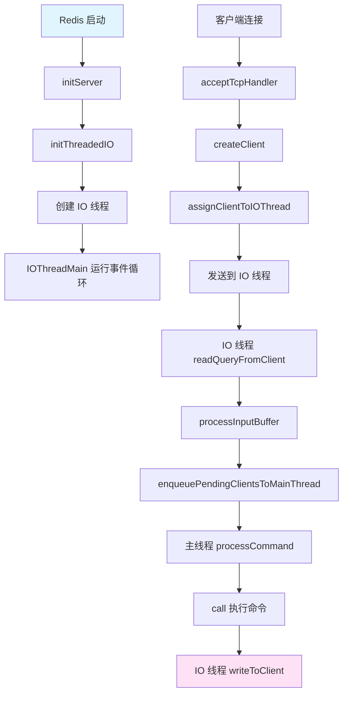
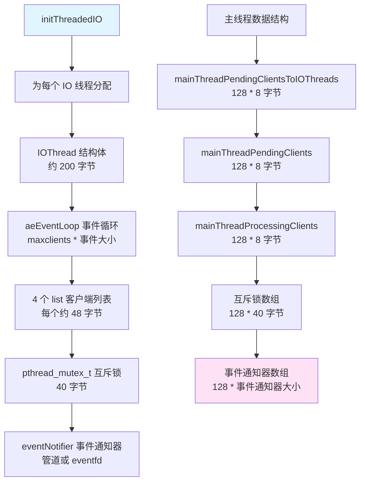
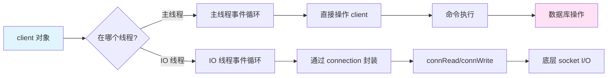
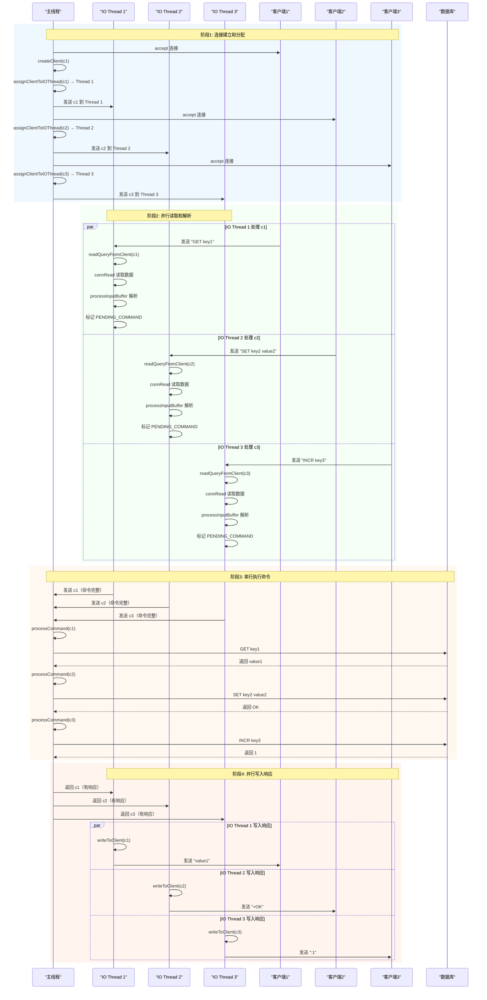

# Redis IO 线程多核利用: 源码分析

## 目录

**第一部分：理解概念（是什么、为什么）**
- [一、概述](#一概述)
- [二、数据结构定义](#二数据结构定义)
- [三、设计特点分析](#三设计特点分析)
- [四、使用场景与限制](#四使用场景与限制)

**第二部分：理解使用（怎么用）**
- [五、操作流程图](#五操作流程图)
- [六、示例代码理解](#六示例代码理解)
- [七、IO 线程完整流程分析](#七io-线程完整流程分析)

**第三部分：深入实现（如何实现）**
- [八、核心函数实现](#八核心函数实现)
- [九、源码关键点总结](#九源码关键点总结)
- [十、测试用例分析](#十测试用例分析)
- [十一、总结](#十一总结)

---

## 一、概述

Redis IO 线程（IO Threads）是 Redis 6.0+ 引入的多线程网络 I/O 处理机制，通过将网络 I/O 操作（读取数据、协议解析、写入响应）从主线程卸载到多个后台线程，实现多核 CPU 的并行利用，从而提升高并发场景下的吞吐量。

### 核心特点

- **并行网络 I/O**：多个 IO 线程并行处理不同客户端的网络读写操作，充分利用多核 CPU
- **单线程命令执行**：命令执行和数据库操作仍由主线程串行执行，保证数据一致性和原子性
- **智能负载均衡**：主线程根据各 IO 线程的客户端数量动态分配新连接，实现负载均衡
- **批量处理优化**：通过批量传输客户端减少线程间通信开销，提升整体性能
- **线程安全机制**：使用互斥锁、原子变量和事件通知器实现线程间安全通信

### 多核利用原理

Redis IO 线程通过以下方式利用多核 CPU：

1. **独立事件循环**：每个 IO 线程运行独立的事件循环（`aeEventLoop`），处理分配给它的客户端集合
2. **操作系统调度**：操作系统自动将不同线程调度到不同 CPU 核心上并行执行
3. **CPU 亲和性**：可选地将 IO 线程绑定到特定 CPU 核心，减少上下文切换开销
4. **并行处理**：多个 IO 线程同时读取、解析和写入，主线程并行接收处理完成的客户端

## 二、数据结构定义

### 2.1 IOThread 结构体

```1474:1487:github/redis-unstable/src/server.h
typedef struct __attribute__((aligned(CACHE_LINE_SIZE))) {
    uint8_t id;                                 /* The unique ID assigned, if IO_THREADS_MAX_NUM is more
                                                 * than 256, we should also promote the data type. */
    pthread_t tid;                              /* Pthread ID */
    redisAtomic int paused;                     /* Paused status for the io thread. */
    redisAtomic int running;                    /* Running if true, main thread can send clients directly. */
    aeEventLoop *el;                            /* Main event loop of io thread. */
    list *pending_clients;                      /* List of clients with pending writes. */
    list *processing_clients;                   /* List of clients being processed. */
    eventNotifier *pending_clients_notifier;    /* Used to wake up the loop when write should be performed. */
    pthread_mutex_t pending_clients_mutex;      /* Mutex for pending write list */
    list *pending_clients_to_main_thread;       /* Clients that are waiting to be executed by the main thread. */
    list *clients;                              /* IO thread managed clients. */
} IOThread;
```

**字段说明：**

| 字段 | 类型 | 说明 | 备注 |
|---|---|---|---|
| id | uint8_t | IO 线程唯一标识符 | 范围 1-127 |
| tid | pthread_t | POSIX 线程 ID | 用于线程管理 |
| paused | redisAtomic int | 暂停状态 | 原子变量，主线程可以暂停 IO 线程 |
| running | redisAtomic int | 运行状态 | 原子变量，表示 IO 线程是否在运行 |
| el | aeEventLoop* | IO 线程的事件循环 | 独立的事件循环，处理客户端 I/O |
| pending_clients | list* | 待处理的客户端列表 | 从主线程接收的客户端 |
| processing_clients | list* | 正在处理的客户端列表 | 当前正在处理的客户端 |
| pending_clients_notifier | eventNotifier* | 客户端事件通知器 | 用于唤醒 IO 线程 |
| pending_clients_mutex | pthread_mutex_t | 客户端列表互斥锁 | 保护 pending_clients 列表 |
| pending_clients_to_main_thread | list* | 待发送给主线程的客户端列表 | 已完成 I/O 的客户端 |
| clients | list* | IO 线程管理的客户端列表 | 所有由该 IO 线程管理的客户端 |

**内存对齐优化：**

使用 `__attribute__((aligned(CACHE_LINE_SIZE)))` 确保 IOThread 结构体按缓存行对齐，避免 false sharing（伪共享）问题，提升多核性能。

### 2.2 主线程管理的客户端列表

```16:21:github/redis-unstable/src/iothread.c
/* For main thread */
static list *mainThreadPendingClientsToIOThreads[IO_THREADS_MAX_NUM]; /* Clients to IO threads */
static list *mainThreadProcessingClients[IO_THREADS_MAX_NUM]; /* Clients in processing */
static list *mainThreadPendingClients[IO_THREADS_MAX_NUM]; /* Pending clients from IO threads */
static pthread_mutex_t mainThreadPendingClientsMutexes[IO_THREADS_MAX_NUM]; /* Mutex for pending clients */
static eventNotifier* mainThreadPendingClientsNotifiers[IO_THREADS_MAX_NUM]; /* Notifier for pending clients */
```

**字段说明：**

| 字段 | 类型 | 说明 |
|---|---|---|
| mainThreadPendingClientsToIOThreads | list*[] | 主线程待发送给各 IO 线程的客户端列表 |
| mainThreadProcessingClients | list*[] | 主线程正在处理的客户端列表（来自 IO 线程） |
| mainThreadPendingClients | list*[] | IO 线程待发送给主线程的客户端列表 |
| mainThreadPendingClientsMutexes | pthread_mutex_t[] | 保护 pending_clients 列表的互斥锁 |
| mainThreadPendingClientsNotifiers | eventNotifier*[] | IO 线程通知主线程的事件通知器 |

### 2.3 常量定义

```217:221:github/redis-unstable/src/server.h
#define IO_THREADS_MAX_NUM 128

/* To make IO threads and main thread run in parallel, we will transfer clients
 * between them if the number of clients in the pending list reaches this value. */
#define IO_THREAD_MAX_PENDING_CLIENTS 16
```

**常量说明：**

| 常量 | 值 | 说明 |
|---|---|---|
| IO_THREADS_MAX_NUM | 128 | 最大 IO 线程数 |
| IO_THREAD_MAX_PENDING_CLIENTS | 16 | 批量传输阈值，达到此数量时批量传输客户端 |

## 三、设计特点分析

### 3.1 内存优化

#### 3.1.1 缓存行对齐

IOThread 结构体使用 `__attribute__((aligned(CACHE_LINE_SIZE)))` 按缓存行对齐，避免多个 IO 线程同时访问相邻内存区域时的 false sharing 问题。

**内存布局：**

```
缓存行边界: |----|----|----|----|
IOThread 1: | id | tid | paused | running | ... |
IOThread 2: | id | tid | paused | running | ... |
```

#### 3.1.2 批量传输机制

通过 `IO_THREAD_MAX_PENDING_CLIENTS` 阈值控制批量传输，减少线程间通信频率和开销。

### 3.2 性能优化

#### 3.2.1 并行处理策略

| 操作 | 执行线程 | 并行度 | 时间复杂度 |
|---|---|---|---|
| 网络读取 | IO 线程 | N（N 个 IO 线程） | O(1) 每个客户端 |
| 协议解析 | IO 线程 | N | O(M) M 为命令长度 |
| 命令执行 | 主线程 | 1（串行） | O(1) |
| 响应写入 | IO 线程 | N | O(M) M 为响应长度 |

#### 3.2.2 负载均衡策略

主线程通过 `assignClientToIOThread` 函数找到客户端数量最少的 IO 线程，实现动态负载均衡。

#### 3.2.3 CPU 亲和性

IO 线程可以通过 `redisSetCpuAffinity` 绑定到特定 CPU 核心，减少上下文切换。

### 3.3 特殊处理

#### 3.3.1 线程安全机制

- **互斥锁**：保护共享数据结构（客户端列表）
- **原子变量**：无锁的状态标志（paused、running）
- **事件通知器**：高效的线程间通信机制

#### 3.3.2 特殊客户端处理

某些客户端必须在主线程处理，避免数据竞争：

```145:154:github/redis-unstable/src/iothread.c
int isClientMustHandledByMainThread(client *c) {
    if (c->flags & (CLIENT_CLOSE_ASAP | CLIENT_MASTER | CLIENT_SLAVE |
                    CLIENT_PUBSUB | CLIENT_MONITOR | CLIENT_BLOCKED |
                    CLIENT_UNBLOCKED | CLIENT_TRACKING | CLIENT_LUA_DEBUG |
                    CLIENT_LUA_DEBUG_SYNC))
    {
        return 1;
    }
    return 0;
}
```

**特殊客户端类型：**

| 客户端类型 | 原因 |
|---|---|
| CLIENT_CLOSE_ASAP | 需要释放客户端，涉及服务器数据结构 |
| CLIENT_MASTER/SLAVE | 主从复制相关，需要主线程协调 |
| CLIENT_PUBSUB | 发布订阅，主线程可能直接写入响应 |
| CLIENT_MONITOR | 监控客户端，需要主线程管理 |
| CLIENT_BLOCKED | 阻塞客户端，需要主线程处理 |

## 四、使用场景与限制

### 4.1 适用场景

#### 4.1.1 高并发网络 I/O

- **场景**：大量客户端同时连接，频繁发送命令
- **优势**：多个 IO 线程并行处理网络 I/O，显著提升吞吐量
- **示例**：缓存服务、会话存储、实时统计

#### 4.1.2 多核 CPU 环境

- **场景**：4 核及以上 CPU
- **配置**：`io-threads 3`（4 核）或 `io-threads 7`（8 核）
- **原理**：每个 IO 线程运行在不同 CPU 核心上

### 4.2 性能特点

| 操作 | 单线程模式 | IO 线程模式 | 提升 |
|---|---|---|---|
| 网络读取 | 串行 | 并行（N 线程） | N 倍 |
| 协议解析 | 串行 | 并行（N 线程） | N 倍 |
| 命令执行 | 串行 | 串行 | 1 倍（保证一致性） |
| 响应写入 | 串行 | 并行（N 线程） | N 倍 |

**注意**：实际提升取决于：
- CPU 核心数
- 网络 I/O 占命令处理总时间的比例
- 客户端数量和并发度

### 4.3 转换条件

#### 4.3.1 启用 IO 线程

**条件：**
- `io-threads > 1`
- `io-threads-do-reads yes`（可选，启用读操作并行化）

**效果：**
- 新客户端自动分配到 IO 线程
- 现有客户端保持主线程管理（直到重新连接）

#### 4.3.2 禁用 IO 线程

**条件：**
- `io-threads = 1`

**效果：**
- 所有客户端由主线程管理
- IO 线程退出（调用 `killIOThreads`）

## 五、操作流程图

### 5.1 IO 线程初始化流程



### 5.2 客户端分配流程



### 5.3 IO 线程处理客户端流程



## 六、示例代码理解

### 6.1 基本操作示例

**场景：** 4 核 CPU，配置 `io-threads 4`（1 个主线程 + 3 个 IO 线程）

```c
// 1. 初始化 IO 线程
initThreadedIO();
// 创建 3 个 IO 线程（id: 1, 2, 3）

// 2. 主线程接受新连接
client *c = createClient(conn);
// c->tid = 0 (主线程)

// 3. 分配到 IO 线程
assignClientToIOThread(c);
// 假设 Thread 1 客户端数最少
// c->tid = 1
// server.io_threads_clients_num[1]++

// 4. IO 线程 1 处理该客户端
// 在 IO Thread 1 的事件循环中：
readQueryFromClient(c);
processInputBuffer(c);
// 解析命令："GET key1"

// 5. 发送到主线程
enqueuePendingClientsToMainThread(c, 0);
// 添加到 pending_clients_to_main_thread

// 6. 主线程执行命令
processCommand(c);
call(c);
// 执行 GET 命令

// 7. IO 线程写入响应
writeToClient(c, 0);
// 发送响应给客户端
```

### 6.2 多核并行处理示例

**时间线：** 3 个 IO 线程同时处理不同客户端

```
时刻 T1: 并行读取
━━━━━━━━━━━━━━━━━━━━━━━━━━━━━━━━━━━━━━━━━━━━━━━━━━━

CPU Core 1 (IO Thread 1)          CPU Core 2 (IO Thread 2)          CPU Core 3 (IO Thread 3)
├─ readQueryFromClient(c1)        ├─ readQueryFromClient(c1001)     ├─ readQueryFromClient(c2001)
├─ connRead(c1)                    ├─ connRead(c1001)                ├─ connRead(c2001)
└─ 读取 "GET key1"                  └─ 读取 "SET key2 value2"          └─ 读取 "INCR key3"

时刻 T2: 并行解析
━━━━━━━━━━━━━━━━━━━━━━━━━━━━━━━━━━━━━━━━━━━━━━━━━━━

CPU Core 1                          CPU Core 2                          CPU Core 3
├─ processInputBuffer(c1)          ├─ processInputBuffer(c1001)       ├─ processInputBuffer(c2001)
│  └─ 解析 "GET key1"                │  └─ 解析 "SET key2 value2"        │  └─ 解析 "INCR key3"
└─ 标记 PENDING_COMMAND              └─ 标记 PENDING_COMMAND            └─ 标记 PENDING_COMMAND

时刻 T3: 发送到主线程（串行执行命令）
━━━━━━━━━━━━━━━━━━━━━━━━━━━━━━━━━━━━━━━━━━━━━━━━━━━

CPU Core 0 (Main Thread)
├─ processCommand(c1)    → GET key1
├─ processCommand(c1001) → SET key2 value2
└─ processCommand(c2001) → INCR key3

时刻 T4: 并行写入响应
━━━━━━━━━━━━━━━━━━━━━━━━━━━━━━━━━━━━━━━━━━━━━━━━━━━

CPU Core 1                          CPU Core 2                          CPU Core 3
├─ writeToClient(c1)                ├─ writeToClient(c1001)            ├─ writeToClient(c2001)
│  └─ 写入 "value1"                   │  └─ 写入 "+OK"                   │  └─ 写入 ":1"
└─ connWrite 发送数据                 └─ connWrite 发送数据              └─ connWrite 发送数据
```

**关键点：**
- T1-T2：IO 线程并行工作，充分利用多核
- T3：主线程串行执行命令，保证一致性
- T4：IO 线程并行写入响应，提升吞吐量

## 七、IO 线程完整流程分析

### 7.1 调用流程



### 7.2 关键节点的内存分配

#### 7.2.1 IO 线程初始化内存分配



**内存分配详情：**

| 组件 | 大小 | 说明 |
|---|---|---|
| IOThread 结构体 | ~200 字节 | 对齐到缓存行 |
| aeEventLoop | maxclients * 事件大小 | 事件循环数据结构 |
| 客户端列表（4 个） | 4 * 48 字节 | pending_clients, processing_clients 等 |
| 互斥锁 | 40 字节 | pthread_mutex_t |
| 事件通知器 | 管道/eventfd | 线程间通信 |

**总内存估算（3 个 IO 线程）：**
- IO 线程：3 * (200 + maxclients * 事件大小 + 192 + 40 + 事件通知器大小)
- 主线程：128 * (8 + 8 + 8 + 40 + 事件通知器大小)
- 总计：约几 KB 到几十 KB（取决于 maxclients）

### 7.3 对象封装和底层数据结构的结合使用



**使用模式：**

| 场景 | 使用对象封装 | 操作底层数据结构 |
|---|---|---|
| 网络 I/O | connection API | socket fd |
| 命令执行 | client API | 直接访问 client 字段 |
| 线程间传递 | client 指针 | 通过列表传递 |
| 事件注册 | aeEventLoop API | 事件循环内部结构 |

### 7.4 完整执行时序图



### 7.5 内存分配总结

**执行命令的内存变化：**

| 阶段 | 内存操作 | 大小 |
|---|---|---|
| 客户端分配 | 分配 deferred_objects | CLIENT_MAX_DEFERRED_OBJECTS * 8 字节 |
| 读取数据 | 扩展 querybuf | 动态增长 |
| 解析命令 | 分配 argv 数组 | argc * 8 字节 |
| 执行命令 | 分配响应缓冲区 | 动态增长 |
| 写入响应 | 使用现有缓冲区 | 无额外分配 |

**内存效率对比：**

| 模式 | 内存使用 | 说明 |
|---|---|---|
| 单线程 | 每个客户端 ~1-2 KB | 所有客户端在主线程 |
| IO 线程 | 每个客户端 ~1-2 KB | 客户端分散到多个 IO 线程，但总内存相同 |

**注意**：IO 线程模式不会增加内存使用，只是将客户端分散到不同线程管理。

### 7.6 关键代码路径总结

```
客户端连接处理：
acceptTcpHandler()
  → createClient()
    → assignClientToIOThread()
      → 添加到 mainThreadPendingClientsToIOThreads[]
        → sendPendingClientsToIOThreads() (在 beforeSleep)
          → 发送到 IO 线程

IO 线程处理：
IOThreadMain()
  → aeMain(el)
    → aeProcessEvents()
      → readQueryFromClient()
        → connRead()
        → processInputBuffer()
          → enqueuePendingClientsToMainThread()
            → 发送到主线程

主线程执行命令：
beforeSleep()
  → processClientsOfAllIOThreads()
    → processClientsFromIOThread()
      → processPendingCommandAndInputBuffer()
        → processCommand()
          → call()
            → c->cmd->proc()

IO 线程写入响应：
processClientsFromMainThread()
  → writeToClient()
    → connWrite()
```

## 八、核心函数实现

### 8.1 initThreadedIO - IO 线程初始化

```721:790:github/redis-unstable/src/iothread.c
/* Initialize the data structures needed for threaded I/O. */
void initThreadedIO(void) {
    if (server.io_threads_num <= 1) return;

    server.io_threads_active = 1;

    if (server.io_threads_num > IO_THREADS_MAX_NUM) {
        serverLog(LL_WARNING,"Fatal: too many I/O threads configured. "
                             "The maximum number is %d.", IO_THREADS_MAX_NUM);
        exit(1);
    }

    prefetchCommandsBatchInit();

    /* Spawn and initialize the I/O threads. */
    for (int i = 1; i < server.io_threads_num; i++) {
        IOThread *t = &IOThreads[i];
        t->id = i;
        t->el = aeCreateEventLoop(server.maxclients+CONFIG_FDSET_INCR);
        t->el->privdata[0] = t;
        t->pending_clients = listCreate();
        t->processing_clients = listCreate();
        t->pending_clients_to_main_thread = listCreate();
        t->clients = listCreate();
        atomicSetWithSync(t->paused, IO_THREAD_UNPAUSED);
        atomicSetWithSync(t->running, 0);

        pthread_mutexattr_t *attr = NULL;
        #if defined(__linux__) && defined(__GLIBC__)
        attr = zmalloc(sizeof(pthread_mutexattr_t));
        pthread_mutexattr_init(attr);
        pthread_mutexattr_settype(attr, PTHREAD_MUTEX_ADAPTIVE_NP);
        #endif
        pthread_mutex_init(&t->pending_clients_mutex, attr);

        t->pending_clients_notifier = createEventNotifier();
        if (aeCreateFileEvent(t->el, getReadEventFd(t->pending_clients_notifier),
                              AE_READABLE, handleClientsFromMainThread, t) != AE_OK)
        {
            serverLog(LL_WARNING, "Fatal: Can't register file event for IO thread notifications.");
            exit(1);
        }

        /* This is the timer callback of the IO thread, used to gradually handle 
         * some background operations, such as clients cron. */
        if (aeCreateTimeEvent(t->el, 1, IOThreadCron, t, NULL) == AE_ERR) {
            serverLog(LL_WARNING, "Fatal: Can't create event loop timers in IO thread.");
            exit(1);
        }

        /* Create IO thread */
        if (pthread_create(&t->tid, NULL, IOThreadMain, (void*)t) != 0) {
            serverLog(LL_WARNING, "Fatal: Can't initialize IO thread.");
            exit(1);
        }

        /* For main thread */
        mainThreadPendingClientsToIOThreads[i] = listCreate();
        mainThreadPendingClients[i] = listCreate();
        mainThreadProcessingClients[i] = listCreate();
        pthread_mutex_init(&mainThreadPendingClientsMutexes[i], attr);
        mainThreadPendingClientsNotifiers[i] = createEventNotifier();
        if (aeCreateFileEvent(server.el, getReadEventFd(mainThreadPendingClientsNotifiers[i]),
                              AE_READABLE, handleClientsFromIOThread, t) != AE_OK)
        {
            serverLog(LL_WARNING, "Fatal: Can't register file event for main thread notifications.");
            exit(1);
        }
        if (attr) zfree(attr);
    }
}
```

**功能：** 初始化 IO 线程系统，创建指定数量的 IO 线程和相关的数据结构。

**实现原理：**
1. **检查配置**：验证 `io_threads_num` 是否有效（1 < num <= 128）
2. **创建事件循环**：为每个 IO 线程创建独立的事件循环
3. **初始化数据结构**：创建客户端列表、互斥锁、事件通知器
4. **注册事件**：在 IO 线程事件循环中注册文件事件和定时事件
5. **创建线程**：使用 `pthread_create` 创建 IO 线程
6. **主线程数据结构**：为主线程创建对应的客户端列表和事件通知器

**要点：**
- 使用自适应互斥锁（`PTHREAD_MUTEX_ADAPTIVE_NP`）提升性能
- 事件通知器用于线程间高效通信
- 定时事件用于周期性任务（如客户端 cron）

### 8.2 IOThreadMain - IO 线程主函数

```707:718:github/redis-unstable/src/iothread.c
/* The main function of IO thread, it will run an event loop. The mian thread
 * and IO thread will communicate through event notifier. */
void *IOThreadMain(void *ptr) {
    IOThread *t = ptr;
    char thdname[16];
    snprintf(thdname, sizeof(thdname), "io_thd_%d", t->id);
    redis_set_thread_title(thdname);
    redisSetCpuAffinity(server.server_cpulist);
    makeThreadKillable();
    aeSetBeforeSleepProc(t->el, IOThreadBeforeSleep);
    aeSetAfterSleepProc(t->el, IOThreadAfterSleep);
    aeMain(t->el);
    return NULL;
}
```

**功能：** IO 线程的入口函数，运行独立的事件循环处理客户端 I/O。

**实现原理：**
1. **设置线程名称**：便于调试和监控
2. **CPU 亲和性**：可选绑定到特定 CPU 核心
3. **设置回调**：注册 beforeSleep 和 afterSleep 回调
4. **运行事件循环**：调用 `aeMain` 进入事件循环

**要点：**
- `redisSetCpuAffinity` 可以将线程绑定到特定 CPU，减少上下文切换
- `makeThreadKillable` 确保线程可以被安全终止
- 事件循环会一直运行直到服务器关闭

### 8.3 assignClientToIOThread - 客户端分配

```158:185:github/redis-unstable/src/iothread.c
/* When the main thread accepts a new client or transfers clients to IO threads,
 * it assigns the client to the IO thread with the fewest clients. */
void assignClientToIOThread(client *c) {
    serverAssert(c->tid == IOTHREAD_MAIN_THREAD_ID);
    /* Find the IO thread with the fewest clients. */
    int min_id = 0;
    int min = INT_MAX;
    for (int i = 1; i < server.io_threads_num; i++) {
        if (server.io_threads_clients_num[i] < min) {
            min = server.io_threads_clients_num[i];
            min_id = i;
        }
    }

    /* Assign the client to the IO thread. */
    server.io_threads_clients_num[c->tid]--;
    c->tid = min_id;
    c->running_tid = min_id;
    server.io_threads_clients_num[min_id]++;

    /* The client running in IO thread needs to have deferred objects array. */
    c->deferred_objects = zmalloc(sizeof(robj*) * CLIENT_MAX_DEFERRED_OBJECTS);

    /* Unbind connection of client from main thread event loop, disable read and
     * write, and then put it in the list, main thread will send these clients
     * to IO thread in beforeSleep. */
    connUnbindEventLoop(c->conn);
    c->io_flags &= ~(CLIENT_IO_READ_ENABLED | CLIENT_IO_WRITE_ENABLED);
    listAddNodeTail(mainThreadPendingClientsToIOThreads[c->tid], c);
}
```

**功能：** 将客户端分配到负载最少的 IO 线程，实现负载均衡。

**实现原理：**
1. **查找最少负载线程**：遍历所有 IO 线程，找到客户端数量最少的
2. **更新统计**：更新客户端计数
3. **分配客户端**：设置客户端的 `tid` 和 `running_tid`
4. **分配内存**：为 IO 线程客户端分配 `deferred_objects` 数组
5. **解绑事件循环**：从主线程事件循环解绑
6. **添加到待发送列表**：添加到 `mainThreadPendingClientsToIOThreads`

**要点：**
- 负载均衡策略简单高效（O(N) 时间复杂度）
- `deferred_objects` 用于延迟释放对象，避免跨线程访问问题
- 客户端不会立即发送到 IO 线程，而是在 `beforeSleep` 中批量发送

### 8.4 processClientsFromIOThread - 主线程处理 IO 线程传来的客户端

```409:511:github/redis-unstable/src/iothread.c
/* The main thread processes the clients from IO threads, these clients may have
 * a complete command to execute or need to be freed. Note that IO threads never
 * free client since this operation access much server data.
 *
 * Please notice that this function may be called reentrantly, i,e, the same goes
 * for handleClientsFromIOThread and processClientsOfAllIOThreads. For example,
 * when processing script command, it may call processEventsWhileBlocked to
 * process new events, if the clients with fired events from the same io thread,
 * it may call this function reentrantly. */
int processClientsFromIOThread(IOThread *t) {
    /* Get the list of clients to process. */
    pthread_mutex_lock(&mainThreadPendingClientsMutexes[t->id]);
    listJoin(mainThreadProcessingClients[t->id], mainThreadPendingClients[t->id]);
    pthread_mutex_unlock(&mainThreadPendingClientsMutexes[t->id]);
    size_t processed = listLength(mainThreadProcessingClients[t->id]);
    if (processed == 0) return 0;

    int prefetch_clients = 0;
    /* We may call processClientsFromIOThread reentrantly, so we need to
     * reset the prefetching batch, besides, users may change the config
     * of prefetch batch size, so we need to reset the prefetching batch. */
    resetCommandsBatch();

    listNode *node = NULL;
    while (listLength(mainThreadProcessingClients[t->id])) {
        /* Prefetch the commands if no clients in the batch. */
        if (prefetch_clients <= 0) prefetch_clients = prefetchIOThreadCommands(t);
        /* Reset the prefetching batch if we have processed all clients. */
        if (--prefetch_clients <= 0) resetCommandsBatch();

        /* Each time we pop up only the first client to process to guarantee
         * reentrancy safety. */
        if (node) zfree(node);
        node = listFirst(mainThreadProcessingClients[t->id]);
        listUnlinkNode(mainThreadProcessingClients[t->id], node);
        client *c = listNodeValue(node);

        /* Make sure the client is neither readable nor writable in io thread to
         * avoid data race. */
        serverAssert(!(c->io_flags & (CLIENT_IO_READ_ENABLED | CLIENT_IO_WRITE_ENABLED)));
        serverAssert(!(c->flags & CLIENT_CLOSE_ASAP));

        /* Let main thread to run it, set running thread id first. */
        c->running_tid = IOTHREAD_MAIN_THREAD_ID;

        /* If a read error occurs, handle it in the main thread first, since we
         * want to print logs about client information before freeing. */
        if (c->read_error) handleClientReadError(c);

        /* The client is asked to close in IO thread. */
        if (c->io_flags & CLIENT_IO_CLOSE_ASAP) {
            freeClient(c);
            continue;
        }

        /* Run cron task for the client per second or it is marked as pending cron. */
        if (c->last_cron_check_time + 1000 <= server.mstime ||
            c->io_flags & CLIENT_IO_PENDING_CRON)
        {
            c->last_cron_check_time = server.mstime;
            if (clientsCronRunClient(c)) continue;
        } else {
            /* Update the client in the mem usage if clientsCronRunClient is not
             * being called, since that function already performs the update. */
            updateClientMemUsageAndBucket(c);
        }

        /* Process the pending command and input buffer. */
        if (!c->read_error && c->io_flags & CLIENT_IO_PENDING_COMMAND) {
            c->flags |= CLIENT_PENDING_COMMAND;
            if (processPendingCommandAndInputBuffer(c) == C_ERR) {
                /* If the client is no longer valid, it must be freed safely. */
                continue;
            }
        }

        /* We may have pending replies if io thread may not finish writing
         * reply to client, so we did not put the client in pending write
         * queue. And we should do that first since we may keep the client
         * in main thread instead of returning to io threads. */
        if (!(c->flags & CLIENT_PENDING_WRITE) && clientHasPendingReplies(c))
            putClientInPendingWriteQueue(c);

        /* The client only can be processed in the main thread, otherwise data
         * race will happen, since we may touch client's data in main thread. */
        if (isClientMustHandledByMainThread(c)) {
            keepClientInMainThread(c);
            continue;
        }

        /* Remove this client from pending write clients queue of main thread,
         * And some clients may do not have reply if CLIENT REPLY OFF/SKIP. */
        if (c->flags & CLIENT_PENDING_WRITE) {
            c->flags &= ~CLIENT_PENDING_WRITE;
            listUnlinkNode(server.clients_pending_write, &c->clients_pending_write_node);
        }
        c->running_tid = c->tid;
        listLinkNodeHead(mainThreadPendingClientsToIOThreads[c->tid], node);
        node = NULL;
    
        /* If there are several clients to process, let io thread handle them ASAP. */
        sendPendingClientsToIOThreadIfNeeded(t, 1);
    }
    if (node) zfree(node);

    /* Send the clients to io thread without pending size check, since main thread
     * may process clients from other io threads, so we need to send them to the
     * io thread to process in prallel. */
    sendPendingClientsToIOThreadIfNeeded(t, 0);

    return processed;
}
```

**功能：** 主线程处理从 IO 线程传来的客户端，执行命令并准备响应。

**实现原理：**
1. **获取客户端列表**：从 `mainThreadPendingClients` 移动到 `mainThreadProcessingClients`
2. **命令预取**：批量预取命令的键，提升缓存命中率
3. **处理每个客户端**：
   - 设置 `running_tid` 为主线程
   - 处理读取错误
   - 运行客户端 cron 任务
   - 处理待执行的命令
   - 检查是否需要主线程处理
4. **返回客户端**：处理完成后返回给 IO 线程写入响应

**要点：**
- 支持重入调用（处理脚本命令时可能重入）
- 命令预取优化提升性能
- 特殊客户端会留在主线程处理

### 8.5 processClientsFromMainThread - IO 线程处理主线程传来的客户端

```572:626:github/redis-unstable/src/iothread.c
/* Processing clients that have finished executing commands from the main thread.
 * If the client is not binded to the event loop, we should bind it first and
 * install read handler. If the client still has query buffer, we should process
 * the input buffer. If the client has pending reply, we just reply to client,
 * and then install write handler if needed. */
int processClientsFromMainThread(IOThread *t) {
    pthread_mutex_lock(&t->pending_clients_mutex);
    listJoin(t->processing_clients, t->pending_clients);
    pthread_mutex_unlock(&t->pending_clients_mutex);
    size_t processed = listLength(t->processing_clients);
    if (processed == 0) return 0;

    listIter li;
    listNode *ln;
    listRewind(t->processing_clients, &li);
    while((ln = listNext(&li))) {
        client *c = listNodeValue(ln);
        serverAssert(!(c->io_flags & (CLIENT_IO_READ_ENABLED | CLIENT_IO_WRITE_ENABLED)));
        /* Main thread must handle clients with CLIENT_CLOSE_ASAP flag, since
         * we only set io_flags when clients in io thread are freed ASAP. */
        serverAssert(!(c->flags & CLIENT_CLOSE_ASAP));

        /* Link client in IO thread clients list first. */
        serverAssert(c->io_thread_client_list_node == NULL);
        listUnlinkNode(t->processing_clients, ln);
        listLinkNodeTail(t->clients, ln);
        c->io_thread_client_list_node = listLast(t->clients);

        /* The client now is in the IO thread, let's free deferred objects. */
        freeClientDeferredObjects(c, 0);

        /* The client is asked to close, we just let main thread free it. */
        if (c->io_flags & CLIENT_IO_CLOSE_ASAP) {
            enqueuePendingClientsToMainThread(c, 1);
            continue;
        }

        /* Enable read and write and reset some flags. */
        c->io_flags |= CLIENT_IO_READ_ENABLED | CLIENT_IO_WRITE_ENABLED;
        c->io_flags &= ~(CLIENT_IO_PENDING_COMMAND | CLIENT_IO_PENDING_CRON);

        /* Only bind once, we never remove read handler unless freeing client. */
        if (!connHasEventLoop(c->conn)) {
            connRebindEventLoop(c->conn, t->el);
            serverAssert(!connHasReadHandler(c->conn));
            connSetReadHandler(c->conn, readQueryFromClient);
        }

        /* If the client has pending replies, write replies to client. */
        if (clientHasPendingReplies(c)) {
            writeToClient(c, 0);
            if (!(c->io_flags & CLIENT_IO_CLOSE_ASAP) && clientHasPendingReplies(c)) {
                connSetWriteHandler(c->conn, sendReplyToClient);
            }
        }
    }
    /* All clients must are processed. */
    serverAssert(listLength(t->processing_clients) == 0);
    return processed;
}
```

**功能：** IO 线程处理从主线程传来的客户端，绑定到事件循环并处理 I/O。

**实现原理：**
1. **获取客户端列表**：从 `pending_clients` 移动到 `processing_clients`
2. **处理每个客户端**：
   - 添加到 IO 线程的客户端列表
   - 释放延迟对象（deferred objects）
   - 绑定到 IO 线程的事件循环
   - 注册读处理器
   - 写入待发送的响应
3. **设置标志**：启用读写标志，清除待处理标志

**要点：**
- 客户端首次绑定到 IO 线程事件循环
- 立即写入响应（如果有）
- 延迟对象在 IO 线程中释放，避免跨线程访问

## 九、源码关键点总结

### 9.1 内存管理

- **使用 `zmalloc` 分配内存**：统一的内存分配接口，支持内存统计
- **延迟对象释放**：IO 线程客户端使用 `deferred_objects` 数组延迟释放对象，避免跨线程访问
- **批量传输优化**：通过 `IO_THREAD_MAX_PENDING_CLIENTS` 阈值控制批量传输，减少内存分配频率

### 9.2 线程同步机制

- **互斥锁**：保护共享数据结构（客户端列表）
- **原子变量**：无锁的状态标志（`paused`、`running`）
- **事件通知器**：高效的线程间通信（管道或 eventfd）

### 9.3 多核利用策略

- **独立事件循环**：每个 IO 线程运行独立的事件循环，操作系统自动调度到不同 CPU 核心
- **CPU 亲和性**：可选绑定到特定 CPU 核心，减少上下文切换
- **负载均衡**：动态分配客户端到负载最少的 IO 线程

### 9.4 设计模式和技巧

- **生产者-消费者模式**：主线程和 IO 线程通过队列传递客户端
- **事件驱动架构**：基于事件循环的异步 I/O 处理
- **批量处理**：减少线程间通信开销
- **延迟释放**：避免跨线程访问共享数据

## 十、测试用例分析

源码测试涵盖：
- IO 线程初始化和销毁
- 客户端分配和负载均衡
- 网络 I/O 并行处理
- 命令执行和数据一致性
- 线程间通信和同步
- 特殊客户端处理
- 错误处理和资源清理

## 十一、总结

Redis IO 线程是一个精心设计的多线程网络 I/O 处理机制，通过以下设计实现了高效的多核利用和性能提升：

1. **并行网络 I/O**：多个 IO 线程并行处理不同客户端的网络读写操作，充分利用多核 CPU，显著提升高并发场景下的吞吐量

2. **单线程命令执行**：命令执行和数据库操作仍由主线程串行执行，保证数据一致性和原子性，避免复杂的锁机制

3. **智能负载均衡**：主线程根据各 IO 线程的客户端数量动态分配新连接，实现负载均衡，确保各线程工作负载均衡

4. **批量处理优化**：通过批量传输客户端减少线程间通信开销，提升整体性能，降低系统调用频率

5. **线程安全机制**：使用互斥锁、原子变量和事件通知器实现线程间安全通信，确保数据一致性和正确性

这种设计在**高并发网络 I/O 场景**中发挥了重要作用，通过并行化网络 I/O 操作充分利用多核 CPU，同时保持单线程命令执行的简单性和数据一致性保证，是性能优化和代码复杂度的最佳平衡。

