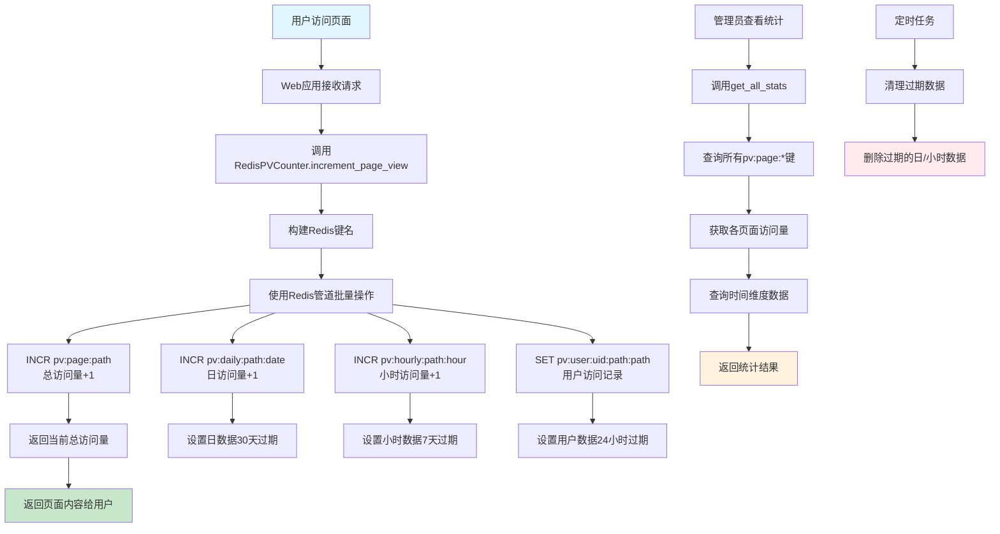
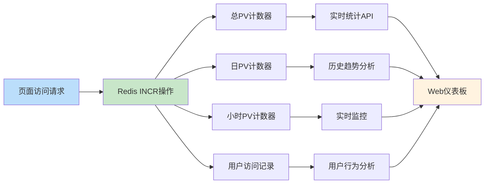
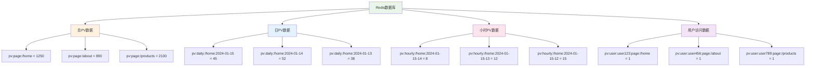
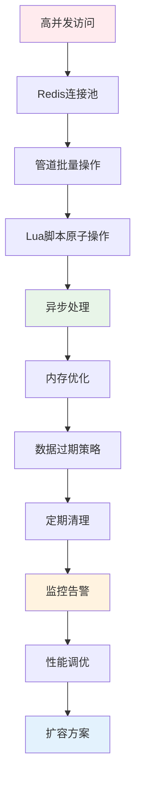

# Redis PV统计系统流程图

## 系统架构流程图

```mermaid
graph TD
    A[用户访问页面] --> B[Web应用接收请求]
    B --> C[调用RedisPVCounter.increment_page_view]
    C --> D[构建Redis键名]
    D --> E[使用Redis管道批量操作]
    
    E --> F[INCR pv:page:path<br/>总访问量+1]
    E --> G[INCR pv:daily:path:date<br/>日访问量+1]
    E --> H[INCR pv:hourly:path:hour<br/>小时访问量+1]
    E --> I[SET pv:user:uid:path:path<br/>用户访问记录]
    
    F --> J[返回当前总访问量]
    G --> K[设置日数据30天过期]
    H --> L[设置小时数据7天过期]
    I --> M[设置用户数据24小时过期]
    
    J --> N[返回页面内容给用户]
    
    O[管理员查看统计] --> P[调用get_all_stats]
    P --> Q[查询所有pv:page:*键]
    Q --> R[获取各页面访问量]
    R --> S[查询时间维度数据]
    S --> T[返回统计结果]
    
    U[定时任务] --> V[清理过期数据]
    V --> W[删除过期的日/小时数据]
    
    style A fill:#e1f5fe
    style N fill:#c8e6c9
    style T fill:#fff3e0
    style W fill:#ffebee
```

## 数据流图

```mermaid
graph LR
    A[页面访问请求] --> B[Redis INCR操作]
    B --> C[总PV计数器]
    B --> D[日PV计数器]
    B --> E[小时PV计数器]
    B --> F[用户访问记录]
    
    C --> G[实时统计API]
    D --> H[历史趋势分析]
    E --> I[实时监控]
    F --> J[用户行为分析]
    
    G --> K[Web仪表板]
    H --> K
    I --> K
    J --> K
    
    style A fill:#bbdefb
    style B fill:#c8e6c9
    style K fill:#fff3e0
```

## Redis数据结构图

```mermaid
graph TD
    A[Redis数据库] --> B[总PV数据]
    A --> C[日PV数据]
    A --> D[小时PV数据]
    A --> E[用户访问数据]
    
    B --> B1["pv:page:/home = 1250"]
    B --> B2["pv:page:/about = 890"]
    B --> B3["pv:page:/products = 2100"]
    
    C --> C1["pv:daily:/home:2024-01-15 = 45"]
    C --> C2["pv:daily:/home:2024-01-14 = 52"]
    C --> C3["pv:daily:/home:2024-01-13 = 38"]
    
    D --> D1["pv:hourly:/home:2024-01-15-14 = 8"]
    D --> D2["pv:hourly:/home:2024-01-15-13 = 12"]
    D --> D3["pv:hourly:/home:2024-01-15-12 = 15"]
    
    E --> E1["pv:user:user123:page:/home = 1"]
    E --> E2["pv:user:user456:page:/about = 1"]
    E --> E3["pv:user:user789:page:/products = 1"]
    
    style A fill:#e8f5e8
    style B fill:#fff3e0
    style C fill:#e3f2fd
    style D fill:#fce4ec
    style E fill:#f3e5f5
```

## 性能优化流程图

```mermaid
graph TD
    A[高并发访问] --> B[Redis连接池]
    B --> C[管道批量操作]
    C --> D[Lua脚本原子操作]
    D --> E[异步处理]
    
    E --> F[内存优化]
    F --> G[数据过期策略]
    G --> H[定期清理]
    
    H --> I[监控告警]
    I --> J[性能调优]
    J --> K[扩容方案]
    
    style A fill:#ffebee
    style E fill:#e8f5e8
    style I fill:#fff3e0
    style K fill:#e3f2fd
```