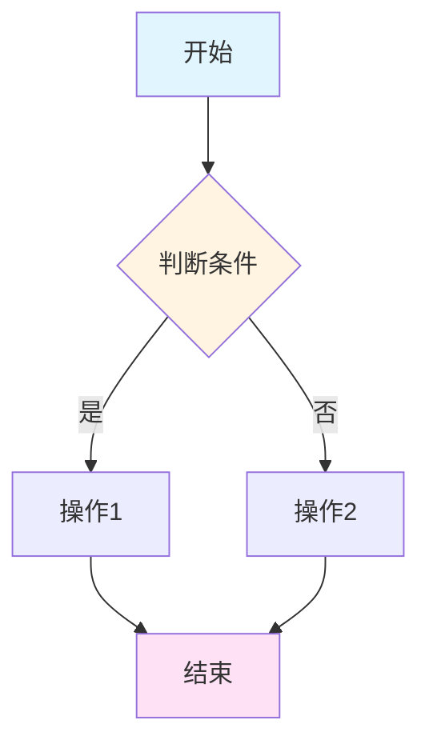
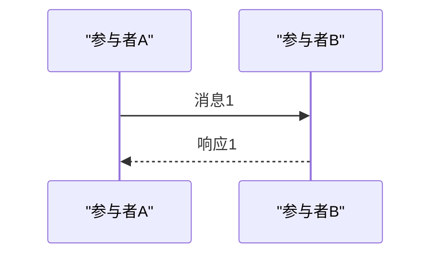

# Redis 技术文档编写规则

> 本文档定义了编写 Redis 源码分析技术文档的标准规则和最佳实践。

---

## 一、文档结构规则

### 1.1 三部分结构（必须遵循）

文档必须按照以下顺序组织，符合从概念到使用的学习路径：

```
第一部分：理解概念（是什么、为什么）
├─ 一、概述（核心特点）
├─ 二、数据结构定义
├─ 三、设计特点分析
└─ 四、使用场景与限制

第二部分：理解使用（怎么用）
├─ 五、操作流程图
├─ 六、示例代码理解
└─ 七、[命令名称] 命令完整流程分析

第三部分：深入实现（如何实现）
├─ 八、核心函数实现
├─ 九、源码关键点总结
├─ 十、测试用例分析
└─ 十一、总结
```

**规则：** 源码分析放在最后，概念和使用放在前面。

---

## 二、章节内容规则

### 2.1 一、概述

**必须包含：**
- 数据结构的定义和用途
- 核心特点（3-5 个要点）
- 在 Redis 中的作用

**格式：**
```markdown
## 一、概述

[数据结构名称] 是 Redis [用途说明]，[主要功能描述]。

### 核心特点

- **特点1**：[说明]
- **特点2**：[说明]
- **特点3**：[说明]
```

---

### 2.2 二、数据结构定义

**必须包含：**
- 结构体完整定义（引用源码）
- 字段说明表格
- 类型/编码定义
- 类型选择策略（如果有多种）

**格式：**
```markdown
## 二、数据结构定义

### 2.1 [结构体名称] 结构体

```行号:行号:文件路径
// 结构体定义
```

**字段说明：**

| 字段 | 类型 | 说明 | 备注 |
|------|------|------|------|
| field1 | type | 说明 | - |

### 2.2 [类型定义]

[类型选择策略说明]
```

**规则：** 所有源码引用必须包含文件路径和行号。

---

### 2.3 三、设计特点分析

**必须包含三个子章节：**

#### 3.1 内存优化
- 自适应编码/类型策略
- 内存布局优化
- 内存效率对比

#### 3.2 性能优化
- 时间复杂度分析（表格）
- 快速路径设计
- 预分配策略

#### 3.3 特殊处理
- 字节序处理
- 二进制安全
- 边界情况处理
- 其他特殊机制

**格式：**
```markdown
### 3.1 内存优化

**自适应编码：**
- [策略说明]
- [优势说明]

**内存布局：**
- [布局特点]
- [优化效果]
```

---

### 2.4 四、使用场景与限制

**必须包含：**

#### 4.1 适用场景
- 使用该数据结构的场景
- 优势场景

#### 4.2 性能特点
- 操作时间复杂度表格
- 性能特征说明

#### 4.3 转换条件
- 何时转换为其他数据结构
- 转换阈值和条件

**规则：** 性能特点必须用表格展示。

---

### 2.5 五、操作流程图

**必须包含：**
- 主要操作的流程图（Mermaid flowchart）
- 至少 3 个核心流程
- 关键判断点和操作步骤

**格式要求：**
```markdown
### 5.1 [操作名称] 流程


```

**重要规则：**
- ❌ 禁止在节点标签中使用 `s[-1]`、`array[index]` 等数组访问语法
- ✅ 使用引号包裹：`"设置 flags: s减1位置 = type"`
- ✅ 或改写为描述性文字：`"设置 flags 字段"`
- ✅ 确保所有节点 ID 唯一

---

### 2.6 六、示例代码理解

**必须包含：**
- 基本操作示例代码
- 内存布局 ASCII 图表
- 关键点说明

**格式：**
```markdown
### 6.1 基本操作示例

```c
// 代码示例
```

### 6.2 内存布局示例

```
内存地址:  [0x1000] [0x1001] [0x1002] ...
内容:      | field1 | field2 | field3 |
含义:      说明1    说明2    说明3
```

**关键点：**
- [要点1]
- [要点2]
```

---

### 2.7 七、[命令名称] 命令完整流程分析

**必须包含 6 个子章节：**

#### 7.1 调用流程
- 完整调用链（Mermaid flowchart）
- 关键函数说明

#### 7.2 关键节点的内存分配
- 内存分配流程图
- 详细的内存分配步骤和大小计算
- 内存布局图

#### 7.3 robj 和 [数据结构] 的结合使用
- robj 与数据结构的关系图
- 什么时候用 robj
- 什么时候操作底层数据结构
- 使用模式总结

#### 7.4 完整执行时序图
- Mermaid sequenceDiagram
- 参与者包括：Client、Server、Command、Create、DataStructure、DB

#### 7.5 内存分配总结
- 执行命令的内存变化
- 内存效率对比

#### 7.6 关键代码路径总结
- 文本格式的调用树
- 函数调用关系

**规则：** 必须提供完整的内存分配分析和 robj 结合使用说明。

---

### 2.8 八、核心函数实现

**必须包含：**
- 关键函数的完整实现（引用源码）
- 函数功能说明
- 实现原理分析
- 关键步骤说明
- 内存寻址说明（如果需要）

**格式：**
```markdown
### 8.1 [函数名称]

```行号:行号:文件路径
/* 函数实现 */
```

**功能：** [功能说明]

**实现原理：**
1. [步骤1]
2. [步骤2]

**要点：** [关键点说明]
```

**规则：** 
- 按功能重要性排序
- 每个函数都要有功能说明和实现原理
- 复杂的内存操作要详细解释

---

### 2.9 九、源码关键点总结

**必须包含：**
- 内存管理方式
- 设计模式和技巧
- 指针算术和内存寻址
- 边界情况处理

**格式：**
```markdown
### 9.1 内存管理

- 使用 `zmalloc` / `zrealloc` 进行内存分配
- [其他要点]

### 9.2 [关键点名称]

- [要点1]
- [要点2]
```

---

### 2.10 十、测试用例分析

**格式：**
```markdown
## 十、测试用例分析

源码测试涵盖：[测试覆盖范围]
```

---

### 2.11 十一、总结

**必须包含：**
- 设计核心要点（3-5 个）
- 设计优势总结
- 应用场景总结

**格式：**
```markdown
## 十一、总结

[数据结构名称] 是一个精心设计的数据结构，通过以下设计实现了高效的内存使用和性能：

1. **[要点1]**：[说明]
2. **[要点2]**：[说明]
3. **[要点3]**：[说明]

这种设计在 [应用场景] 中发挥了重要作用。
```

---

## 三、格式规范规则

### 3.1 源码引用格式

**标准格式：**
```markdown
```行号:行号:文件路径
// 代码内容
```
```

**示例：**
```markdown
```68:71:github/redis-unstable/src/sds.h
static inline unsigned char sdsType(const sds s) {
    unsigned char flags = s[-1];
    return flags & SDS_TYPE_MASK;
}
```
```

**规则：** 
- 必须包含起始行号和结束行号
- 文件路径必须准确
- 代码块前后必须有空行

---

### 3.2 表格格式

**用于：**
- 字段说明
- 性能对比
- 类型定义
- 内存分配详情

**格式：**
```markdown
| 列1 | 列2 | 列3 |
|-----|-----|-----|
| 值1 | 值2 | 值3 |
```

**规则：** 表格前后必须有空行。

---

### 3.3 Mermaid 流程图规则

#### flowchart（流程图）
```markdown
```mermaid
flowchart TD
    A[节点A] --> B{判断节点}
    B -->|是| C[节点C]
    B -->|否| D[节点D]
    
    style A fill:#e1f5ff  # 开始节点：浅蓝色
    style B fill:#fff4e1  # 判断节点：浅黄色
    style C fill:#e1ffe1  # 操作节点：浅绿色
    style D fill:#ffe1f5  # 结束节点：浅粉色
```
```

**规则：**
- 节点 ID 必须唯一
- 使用中文描述
- 关键判断使用菱形节点 `{}`
- 避免特殊字符，使用引号包裹

#### sequenceDiagram（时序图）
```markdown

```

**规则：**
- 参与者别名使用引号包裹
- 使用有意义的别名，避免关键字冲突

---

### 3.4 内存布局图规则

**格式：**
```markdown
```
内存地址:  [0x1000] [0x1001] [0x1002] [0x1003]
           |-------|-------|-------|-------|
内容:      | field1 | field2 | field3 | field4 |
           |-------|-------|-------|-------|
含义:      说明1    说明2    说明3    说明4
```
```

**规则：**
- 使用 ASCII 字符绘制
- 标注地址、内容、含义
- 清晰的视觉分隔

---

### 3.5 内部链接规则

**格式：**
```markdown
详见 [章节名称](#章节锚点)
```

**规则：**
- 避免重复内容，使用链接引用
- 锚点使用小写，特殊字符用连字符
- 测试所有链接可正常跳转

---

## 四、内容质量规则

### 4.1 避免重复

**规则：**
- ✅ 同一概念在不同章节出现时，使用"详见 X.X 节"引用
- ✅ 代码示例不要重复，使用链接引用
- ✅ 流程图和文字说明要互补，不要完全重复
- ❌ 禁止复制粘贴相同内容

---

### 4.2 代码示例

**规则：**
- ✅ 提供完整可运行的示例
- ✅ 标注关键参数和返回值
- ✅ 说明执行结果
- ❌ 避免过于简化的伪代码

---

### 4.3 内存分析

**规则：**
- ✅ 详细计算每个步骤的内存大小
- ✅ 提供内存布局图
- ✅ 对比不同编码/类型的内存效率
- ✅ 说明内存分配函数和时机

---

### 4.4 流程图质量

**规则：**
- ✅ 流程完整，包含所有关键步骤
- ✅ 判断条件清晰
- ✅ 错误处理路径明确
- ✅ 使用颜色区分节点类型
- ❌ 避免过于复杂的流程图（超过 20 个节点可拆分）

---

## 五、编写流程规则

### 5.1 准备工作

1. **阅读源码**
   - 理解数据结构设计
   - 识别核心函数
   - 追踪命令调用链

2. **绘制草图**
   - 数据结构内存布局
   - 操作流程图
   - 调用关系图

---

### 5.2 编写顺序

**第一步：创建目录结构**
- 确定所有章节标题
- 建立章节链接
- 标注占位符

**第二步：补充第一部分**
- 概述和核心特点
- 数据结构定义
- 设计特点分析
- 使用场景与限制

**第三步：补充第二部分**
- 操作流程图
- 示例代码理解
- 命令完整流程分析

**第四步：补充第三部分**
- 核心函数实现
- 源码关键点总结
- 测试用例分析
- 总结

---

### 5.3 检查清单

**结构检查：**
- [ ] 三部分结构完整
- [ ] 所有章节都有内容
- [ ] 目录链接正确

**内容检查：**
- [ ] 源码引用格式正确
- [ ] 行号准确
- [ ] 表格数据准确
- [ ] 流程图语法正确

**格式检查：**
- [ ] Mermaid 图表可正常渲染
- [ ] 内存布局图清晰
- [ ] 内部链接可跳转
- [ ] 代码块格式正确

**质量检查：**
- [ ] 没有重复内容
- [ ] 章节顺序合理
- [ ] 概念解释清晰
- [ ] 总结提炼到位

---

## 六、常见问题规则

### 6.1 Mermaid 解析错误

**问题：** 节点标签包含特殊字符导致解析失败

**解决：**
- ❌ `s[-1] = type`
- ✅ `"设置 flags: s减1位置 = type"`
- ✅ `"设置 flags 字段"`

---

### 6.2 源码引用错误

**问题：** 行号不准确或文件路径错误

**解决：**
- 始终使用实际源码文件路径
- 确认行号范围准确
- 跨文件引用要说明

---

### 6.3 内存计算错误

**问题：** 内存大小计算不准确

**解决：**
- 详细列出每个字段的大小
- 考虑对齐和填充
- 验证计算过程

---

### 6.4 流程图过于复杂

**问题：** 单个流程图节点过多

**解决：**
- 拆分为多个子流程
- 使用子图（subgraph）
- 提取关键步骤

---

## 七、最佳实践

### 7.1 学习路径优化

- ✅ 先看概述，建立整体概念
- ✅ 再看流程图，理解操作流程
- ✅ 再看示例，理解用法
- ✅ 最后看源码，深入实现

---

### 7.2 可视化优先

- ✅ 多用图表（流程图、时序图、内存布局图）
- ✅ 图表和文字互补
- ✅ 关键信息用表格展示

---

### 7.3 代码追踪

- ✅ 提供完整的调用链
- ✅ 标注关键函数的位置
- ✅ 说明函数间的关系

---

### 7.4 内存分析

- ✅ 详细计算内存分配
- ✅ 对比不同场景的内存使用
- ✅ 说明内存优化策略

---

## 八、示例检查点

### 8.1 章节完整性

- [ ] 每个章节都有实际内容
- [ ] 没有"将在后续补充"的占位符
- [ ] 所有链接都有效

### 8.2 源码准确性

- [ ] 所有源码引用格式正确
- [ ] 行号范围准确
- [ ] 文件路径正确

### 8.3 图表质量

- [ ] 流程图语法正确
- [ ] 时序图参与者清晰
- [ ] 内存布局图易懂

### 8.4 内容质量

- [ ] 没有重复内容
- [ ] 概念解释清晰
- [ ] 示例代码完整
- [ ] 总结到位

---

## 九、模板使用

编写新文档时，复制以下模板：

```markdown
# Redis [数据结构/命令名称]: 源码分析

## 目录

**第一部分：理解概念（是什么、为什么）**
- [一、概述](#一概述)
- [二、数据结构定义](#二数据结构定义)
- [三、设计特点分析](#三设计特点分析)
- [四、使用场景与限制](#四使用场景与限制)

**第二部分：理解使用（怎么用）**
- [五、操作流程图](#五操作流程图)
- [六、示例代码理解](#六示例代码理解)
- [七、[命令名称] 命令完整流程分析](#七命令名称-命令完整流程分析)

**第三部分：深入实现（如何实现）**
- [八、核心函数实现](#八核心函数实现)
- [九、源码关键点总结](#九源码关键点总结)
- [十、测试用例分析](#十测试用例分析)
- [十一、总结](#十一总结)

---

## 一、概述

[开始编写...]
```

---

## 十、更新日志

- 2024-12-XX：创建初始版本
- 基于 `redis_set_intset.md` 和 `redis_string.md` 的编写经验总结

---

**遵循这些规则，可以确保 Redis 技术文档的质量和一致性。**

