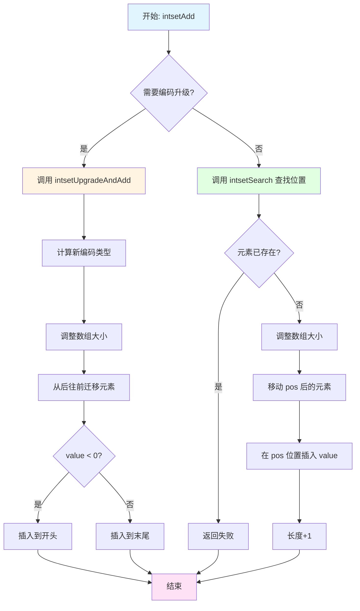
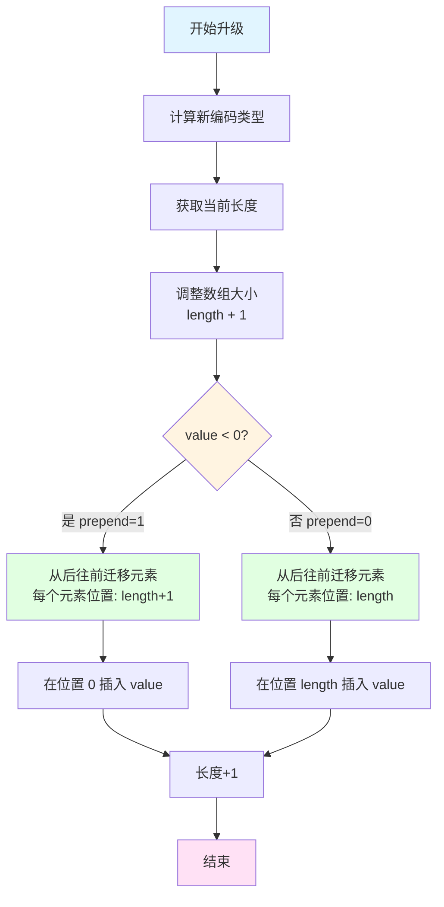
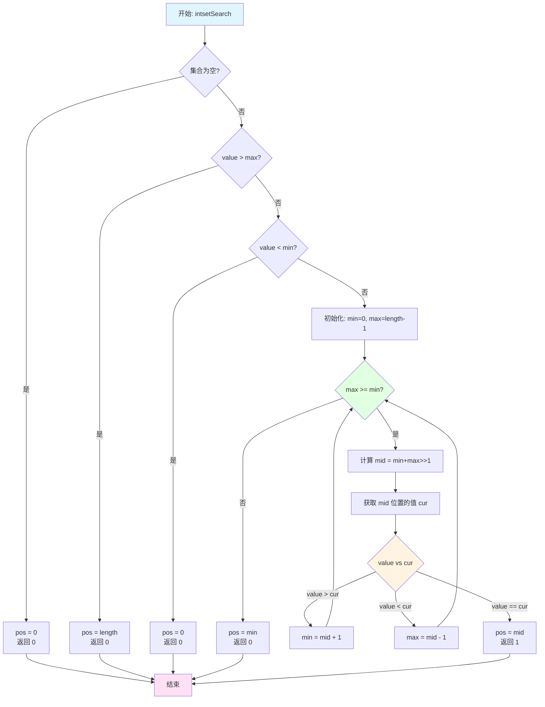
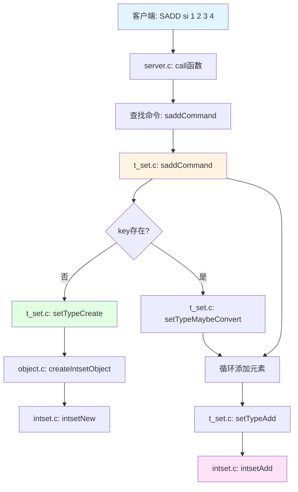
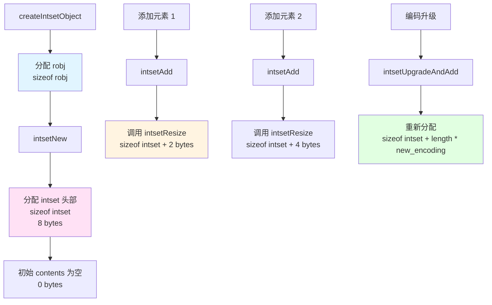
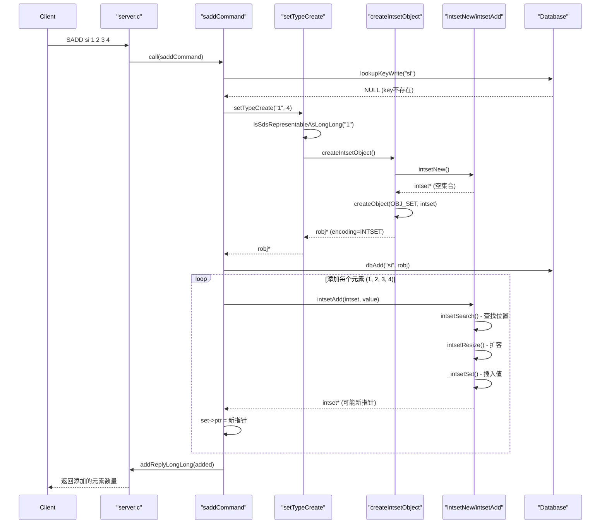

# Redis Set: Intset 源码分析
* 理解概念
* 理解使用
* 深入源码分析

## 目录

**第一部分：理解概念（是什么、为什么）**
- [一、概述](#一概述)
  - [核心特点](#核心特点)
- [二、数据结构定义](#二数据结构定义)
  - [2.1 Intset 结构体](#21-intset-结构体)
  - [2.2 编码类型定义](#22-编码类型定义)
- [三、设计特点分析](#三设计特点分析)
  - [3.1 内存优化](#31-内存优化)
  - [3.2 性能优化](#32-性能优化)
  - [3.3 字节序处理](#33-字节序处理)
- [四、使用场景与限制](#四使用场景与限制)
  - [4.1 适用场景](#41-适用场景)
  - [4.2 性能特点](#42-性能特点)
  - [4.3 转换条件](#43-转换条件)

**第二部分：理解使用（怎么用）**
- [五、操作流程图](#五操作流程图)
  - [5.1 添加元素流程](#51-添加元素流程)
  - [5.2 编码升级流程](#52-编码升级流程)
  - [5.3 二分查找流程](#53-二分查找流程)
- [六、示例代码理解](#六示例代码理解)
  - [6.1 创建并添加元素](#61-创建并添加元素)
  - [6.2 编码升级说明](#62-编码升级说明)
- [七、SADD 命令完整流程分析](#七sadd-命令完整流程分析)
  - [7.1 调用流程](#71-调用流程)
  - [7.2 关键节点的内存分配](#72-关键节点的内存分配)
  - [7.3 robj 和 intset 的结合使用](#73-robj-和-intset-的结合使用)
  - [7.4 完整执行时序图](#74-完整执行时序图)
  - [7.5 内存分配总结](#75-内存分配总结)
  - [7.6 关键代码路径总结](#76-关键代码路径总结)

**第三部分：深入实现（如何实现）**
- [八、核心函数实现](#八核心函数实现)
  - [8.1 编码判断函数](#81-编码判断函数)
  - [8.2 值读取函数](#82-值读取函数)
  - [8.3 值设置函数](#83-值设置函数)
  - [8.4 创建新集合](#84-创建新集合)
  - [8.5 二分查找](#85-二分查找)
  - [8.6 编码升级并插入](#86-编码升级并插入)
  - [8.7 添加元素](#87-添加元素)
  - [8.8 删除元素](#88-删除元素)
  - [8.9 查找元素](#89-查找元素)
- [九、源码关键点总结](#九源码关键点总结)
  - [9.1 内存管理](#91-内存管理)
  - [9.2 字节序处理](#92-字节序处理)
  - [9.3 有序性维护](#93-有序性维护)
  - [9.4 边界情况处理](#94-边界情况处理)
- [十、测试用例分析](#十测试用例分析)
- [十一、总结](#十一总结)

---

## 一、概述

Intset（整数集合）是 Redis 中 Set 类型的一种底层编码实现，专门用于存储整数值的有序集合。当 Redis Set 对象的所有元素都是整数时，Redis 会使用 intset 来存储，以获得更好的内存效率和性能。

### 核心特点

- **有序数组**：元素按值大小有序存储
- **自适应编码**：根据元素值大小自动选择 16/32/64 位编码
- **内存连续**：所有元素存储在连续内存中，提高缓存命中率
- **二分查找**：利用有序性实现 O(log N) 的查找时间复杂度
- **编码升级**：当插入超出当前编码范围的值时，自动升级编码

---

## 二、数据结构定义

### 2.1 Intset 结构体

```35:39:github/redis-unstable/src/intset.h
typedef struct intset {
    uint32_t encoding;
    uint32_t length;
    int8_t contents[];
} intset;
```

**字段说明：**

- `encoding`：编码类型（INTSET_ENC_INT16/INT32/INT64）
- `length`：集合中元素的数量
- `contents`：柔性数组，实际存储元素值的有序数组

### 2.2 编码类型定义

```39:43:github/redis-unstable/src/intset.c
/* Note that these encodings are ordered, so:
 * INTSET_ENC_INT16 < INTSET_ENC_INT32 < INTSET_ENC_INT64. */
#define INTSET_ENC_INT16 (sizeof(int16_t))
#define INTSET_ENC_INT32 (sizeof(int32_t))
#define INTSET_ENC_INT64 (sizeof(int64_t))
```

**编码类型：**

| 编码类型 | 值 | 范围 | 字节数 |
|---------|-----|------|--------|
| `INTSET_ENC_INT16` | 2 | -32,768 ~ 32,767 | 2 |
| `INTSET_ENC_INT32` | 4 | -2,147,483,648 ~ 2,147,483,647 | 4 |
| `INTSET_ENC_INT64` | 8 | -9,223,372,036,854,775,808 ~ 9,223,372,036,854,775,807 | 8 |

**内存布局：**

```
+------------+------------+-------------------+
| encoding   | length     | contents[]        |
| (4 bytes)  | (4 bytes)  | (flexible array)  |
+------------+------------+-------------------+
```

---

## 三、设计特点分析

### 3.1 内存优化

**自适应编码：**
- 初始使用最小编码（INT16）
- 根据插入的最大值自动升级
- **注意**：只升级，不降级（避免频繁重分配）

**内存连续：**
- 所有元素存储在连续内存中
- 提高 CPU 缓存命中率
- 减少内存碎片

### 3.2 性能优化

**有序性保证：**
- 元素按值有序存储
- 支持 O(log N) 二分查找
- 支持 O(1) 获取最大/最小值

**快速路径：**
- 空集合快速判断
- 边界值快速定位插入位置
- 编码升级时的智能插入（正数末尾，负数开头）

### 3.3 字节序处理

使用 `intrev32ifbe` / `memrev*ifbe` 系列函数确保跨平台一致性（详见 [9.2 字节序处理](#92-字节序处理)）

---

## 四、使用场景与限制

### 4.1 适用场景

- **纯整数集合**：所有元素都是整数
- **元素数量较少**：大量元素时哈希表性能更好
- **需要有序遍历**：利用有序性进行范围操作

### 4.2 性能特点

| 操作 | 时间复杂度 | 说明 |
|------|-----------|------|
| 查找 | O(log N) | 二分查找 |
| 插入 | O(N) | 需要移动元素 + 可能的编码升级 |
| 删除 | O(N) | 需要移动元素 |
| 随机获取 | O(1) | 直接索引访问 |
| 最大/最小值 | O(1) | 首尾元素 |

### 4.3 转换条件

Redis Set 会在以下情况从 intset 转换为 hashtable：

1. **元素数量超过阈值**：`set-max-intset-entries`（默认 512）
2. **插入非整数元素**：出现字符串等其他类型

---

## 五、操作流程图

> **提示：** 建议先浏览流程图，建立整体概念，再深入函数实现细节。

### 5.1 添加元素流程



### 5.2 编码升级流程



### 5.3 二分查找流程



---

## 六、示例代码理解

### 6.1 创建并添加元素

```c
intset *is = intsetNew();           // encoding=INT16, length=0
is = intsetAdd(is, 5, NULL);        // [5]
is = intsetAdd(is, 3, NULL);        // [3, 5] (有序)
is = intsetAdd(is, 7, NULL);        // [3, 5, 7]
is = intsetAdd(is, 65536, NULL);    // [3, 5, 7, 65536] (升级为 INT32)
```

### 6.2 编码升级说明

编码升级时从后往前迁移元素，避免覆盖（详见 [8.6 编码升级并插入](#86-编码升级并插入)）

---

## 七、SADD 命令完整流程分析

以命令 `SADD si 1 2 3 4` 为例，分析完整的执行流程。

### 7.1 调用流程

#### 完整调用链



**关键流程：**
- `lookupKeyWriteWithLink`：查找 key "si"（不存在返回 NULL）
- `setTypeCreate`：创建新 Set 对象（见下方说明）
- `setTypeAdd`：循环添加每个元素（内部调用 `intsetAdd`，见 [8.7 添加元素](#87-添加元素)）

**3. 编码选择 (`t_set.c:31`)**

```31:42:github/redis-unstable/src/t_set.c
robj *setTypeCreate(sds value, size_t size_hint) {
    if (isSdsRepresentableAsLongLong(value,NULL) == C_OK) {
        return createIntsetObject();
    } else {
        return createSetObject();
    }
}
```

**判断条件：**
- ✅ 第一个元素 `"1"` 可转换为整数
- ✅ `size_hint = 4` ≤ `set_max_intset_entries`（默认 512）
- **返回 `createIntsetObject()`**（见 [8.4 创建新集合](#84-创建新集合)）

---

### 7.2 关键节点的内存分配

#### 内存分配流程图



#### 具体内存分配

**1. 创建 robj 对象**

```87:96:github/redis-unstable/src/object.c
robj *createObject(int type, void *ptr) {
    robj *o = zmalloc(sizeof(*o));
    o->type = type;
    o->encoding = OBJ_ENCODING_RAW;
    o->ptr = ptr;
    o->refcount = 1;
    o->lru = 0;
    o->iskvobj = 0;
    o->expirable = 0;
    return o;
}
```

**内存分配详情：**

| 步骤 | 操作 | 内存大小 | 说明 |
|------|------|---------|------|
| 1 | 创建 robj | 16 bytes | `sizeof(robj)` 包含所有字段 |
| 2 | 创建空 intset | 8 bytes | 仅头部（encoding + length） |
| 3 | 添加元素 1 | +2 bytes | INT16 编码，`intsetResize(is, 1)` |
| 4 | 添加元素 2 | +2 bytes | `intsetResize(is, 2)` |
| 5 | 添加元素 3 | +2 bytes | `intsetResize(is, 3)` |
| 6 | 添加元素 4 | +2 bytes | `intsetResize(is, 4)` |

**内存布局（添加 4 个元素后）：**

```
robj (16 bytes)
├─ type: OBJ_SET
├─ encoding: OBJ_ENCODING_INTSET
├─ ptr: ──────────┐
└─ ...            │
                  ▼
              intset (8 + 8 = 16 bytes)
              ├─ encoding: INTSET_ENC_INT16 (2)
              ├─ length: 4
              └─ contents: [1][2][3][4]
                  (2 bytes × 4 = 8 bytes)
```

**内存分配函数：** 使用 `zmalloc`/`zrealloc`（见 [9.1 内存管理](#91-内存管理)）

**编码升级：** 当插入超出当前编码范围的值时，会触发编码升级（见 [8.6 编码升级并插入](#86-编码升级并插入)），此时使用 `zrealloc` 重新分配内存

---

### 7.3 robj 和 intset 的结合使用

#### robj 与 intset 的关系

**robj 结构体：** Redis 对象的统一包装（见源码 `server.h:1043`）

**关系图：**

```mermaid
flowchart LR
    A[robj<br/>Redis对象包装] -->|ptr指针| B[intset<br/>实际数据结构]
    
    A1[type: OBJ_SET] --> A
    A2[encoding: OBJ_ENCODING_INTSET] --> A
    A3[refcount: 引用计数] --> A
    A4[ptr: ────>] --> B
    
    B1[encoding: INTSET_ENC_INT16] --> B
    B2[length: 4] --> B
    B3[contents: [1][2][3][4]] --> B
    
    style A fill:#e1f5ff
    style B fill:#ffe1f5
```

#### 什么时候用 robj？

**1. 对象创建和管理：**

```115:120:github/redis-unstable/src/object.c
robj *createIntsetObject(void) {
    intset *is = intsetNew();
    robj *o = createObject(OBJ_SET,is);
    o->encoding = OBJ_ENCODING_INTSET;
    return o;
}
```

- `createObject`：创建 `robj` 对象，设置 `type`、`encoding`、`refcount` 等
- `robj->ptr`：指向底层 `intset` 结构
- `robj->encoding`：标识底层编码类型（`OBJ_ENCODING_INTSET`）

**2. 对象查找和类型检查：**

```c
robj *set = lookupKeyWrite(c->db, key);
if (checkType(c, set, OBJ_SET)) return;  // 检查类型
```

#### 什么时候操作 intset？

**实际的数据操作：**

通过 `robj->ptr` 获取 `intset*` 指针，调用底层函数（见 [八、核心函数实现](#八核心函数实现)）：
- `intsetAdd`：添加元素（见 [8.7 添加元素](#87-添加元素)）
- `intsetRemove`：删除元素（见 [8.8 删除元素](#88-删除元素)）
- `intsetFind`：查找元素（见 [8.9 查找元素](#89-查找元素)）
- `intsetLen`：获取大小

**⚠️ 注意：** `intsetAdd` 可能返回新指针，需更新 `robj->ptr`

#### 使用模式总结

**创建流程：**
1. `createIntsetObject()` → `intsetNew()` + `createObject()`
2. 返回 `robj*`，`robj->ptr` 指向 `intset*`

**操作流程：**
1. 通过 `robj->ptr` 获取 `intset*`
2. 调用 `intset*` 函数（如 `intsetAdd`）
3. 如果返回新指针，更新 `robj->ptr`

**关键：** `intsetAdd` 可能返回新指针，必须更新 `robj->ptr`；`robj->ptr` 需转换为 `intset*`；robj 管理引用计数和生命周期

---

### 7.4 完整执行时序图



---

### 7.5 内存分配总结

**执行 `SADD si 1 2 3 4` 的内存变化：**（详细计算见 [7.2 关键节点的内存分配](#72-关键节点的内存分配)）

- 初始分配：16 bytes (robj) + 8 bytes (intset) = 24 bytes
- 添加 4 个元素：每次 +2 bytes（INT16 编码）
- **最终总内存：32 bytes**

**内存效率对比：**
- Intset：32 bytes
- 哈希表：约 200+ bytes（包含 dict 结构、dictEntry、sds 等）
- **节省约 85% 内存**

---

### 7.6 关键代码路径总结

```
SADD si 1 2 3 4
│
├─ server.c:3758  call() → c->cmd->proc(c)
│
└─ t_set.c:590  saddCommand()
   ├─ lookupKeyWriteWithLink()     // 查找 key
   ├─ setTypeCreate()               // 创建新集合
   │  └─ createIntsetObject()       // → intsetNew() + createObject()
   │
   └─ setTypeAdd() × 4               // 循环添加元素
      └─ intsetAdd()                 // 见 8.7 节
         ├─ intsetSearch()           // 见 8.5 节
         ├─ intsetResize()           // 内存扩容
         ├─ intsetMoveTail()         // 移动元素
         └─ _intsetSet()             // 设置值
```

**总结：** Redis 通过 `robj` 统一管理对象元数据，通过 `intset` 等底层结构实现高效存储。详细函数实现见 [八、核心函数实现](#八核心函数实现)章节。

---

## 八、核心函数实现

### 8.1 编码判断函数

```45:53:github/redis-unstable/src/intset.c
/* Return the required encoding for the provided value. */
static uint8_t _intsetValueEncoding(int64_t v) {
    if (v < INT32_MIN || v > INT32_MAX)
        return INTSET_ENC_INT64;
    else if (v < INT16_MIN || v > INT16_MAX)
        return INTSET_ENC_INT32;
    else
        return INTSET_ENC_INT16;
}
```

**功能：** 根据值的大小返回所需的最小编码类型

**逻辑：**
1. 超出 32 位范围 → INT64
2. 超出 16 位范围 → INT32
3. 否则 → INT16

### 8.2 值读取函数

```55:74:github/redis-unstable/src/intset.c
/* Return the value at pos, given an encoding. */
static int64_t _intsetGetEncoded(intset *is, int pos, uint8_t enc) {
    int64_t v64;
    int32_t v32;
    int16_t v16;

    if (enc == INTSET_ENC_INT64) {
        memcpy(&v64,((int64_t*)is->contents)+pos,sizeof(v64));
        memrev64ifbe(&v64);
        return v64;
    } else if (enc == INTSET_ENC_INT32) {
        memcpy(&v32,((int32_t*)is->contents)+pos,sizeof(v32));
        memrev32ifbe(&v32);
        return v32;
    } else {
        memcpy(&v16,((int16_t*)is->contents)+pos,sizeof(v16));
        memrev16ifbe(&v16);
        return v16;
    }
}
```

**内存寻址详解（以 INT64 编码为例）：**

```c
memcpy(&v64, ((int64_t*)is->contents)+pos, sizeof(v64));
```

**寻址过程：**
1. `is->contents`：柔性数组起始地址（`int8_t*`）
2. `(int64_t*)is->contents`：类型转换，改变指针算术单位
3. `+pos`：指针算术，`地址 = 基址 + pos × sizeof(int64_t)`
4. `memcpy`：从计算后的地址拷贝 8 字节到局部变量

**对比：** `is->contents + pos` 只移动 `pos` 字节；`((int64_t*)is->contents) + pos` 移动 `pos × 8` 字节

**内存布局示例（INT64 编码，pos=2）：**

```
地址      内容              计算
0x1000    [元素0: 8字节]    ((int64_t*)contents) + 0
0x1008    [元素1: 8字节]    ((int64_t*)contents) + 1
0x1010    [元素2: 8字节]    ((int64_t*)contents) + 2  ← pos=2
0x1018    [元素3: 8字节]    ((int64_t*)contents) + 3

地址计算：0x1000 + 2 × 8 = 0x1010
```

**要点：** 类型转换改变指针算术单位；`pos` 是元素索引，地址 = 基址 + pos × sizeof(元素类型)

### 8.3 值设置函数

```81:95:github/redis-unstable/src/intset.c
/* Set the value at pos, using the configured encoding. */
static void _intsetSet(intset *is, int pos, int64_t value) {
    uint32_t encoding = intrev32ifbe(is->encoding);

    if (encoding == INTSET_ENC_INT64) {
        ((int64_t*)is->contents)[pos] = value;
        memrev64ifbe(((int64_t*)is->contents)+pos);
    } else if (encoding == INTSET_ENC_INT32) {
        ((int32_t*)is->contents)[pos] = value;
        memrev32ifbe(((int32_t*)is->contents)+pos);
    } else {
        ((int16_t*)is->contents)[pos] = value;
        memrev16ifbe(((int16_t*)is->contents)+pos);
    }
}
```

**内存寻址详解（以 INT64 编码为例）：**

```c
((int64_t*)is->contents)[pos] = value;
memrev64ifbe(((int64_t*)is->contents)+pos);
```

**写入过程：** 类型转换 → 数组索引访问（等价于指针解引用）→ 字节序转换

**优化：** 先写入值，再在原位置转换字节序，避免临时变量

**要点：** `array[pos]` 等价于 `*(array + pos)`；写入后立即转换字节序，避免临时变量

### 8.4 创建新集合

```97:103:github/redis-unstable/src/intset.c
/* Create an empty intset. */
intset *intsetNew(void) {
    intset *is = zmalloc(sizeof(intset));
    is->encoding = intrev32ifbe(INTSET_ENC_INT16);
    is->length = 0;
    return is;
}
```

**特点：**
- 初始编码为 INT16（最小编码）
- 使用 `zmalloc` 分配内存（Redis 的内存分配器）
- `intrev32ifbe` 确保字节序正确

### 8.5 二分查找

```113:156:github/redis-unstable/src/intset.c
/* Search for the position of "value". Return 1 when the value was found and
 * sets "pos" to the position of the value within the intset. Return 0 when
 * the value is not present in the intset and sets "pos" to the position
 * where "value" can be inserted. */
static uint8_t intsetSearch(intset *is, int64_t value, uint32_t *pos) {
    int min = 0, max = intrev32ifbe(is->length)-1, mid = -1;
    int64_t cur = -1;

    /* The value can never be found when the set is empty */
    if (intrev32ifbe(is->length) == 0) {
        if (pos) *pos = 0;
        return 0;
    } else {
        /* Check for the case where we know we cannot find the value,
         * but do know the insert position. */
        if (value > _intsetGet(is,max)) {
            if (pos) *pos = intrev32ifbe(is->length);
            return 0;
        } else if (value < _intsetGet(is,0)) {
            if (pos) *pos = 0;
            return 0;
        }
    }

    while(max >= min) {
        mid = ((unsigned int)min + (unsigned int)max) >> 1;
        cur = _intsetGet(is,mid);
        if (value > cur) {
            min = mid+1;
        } else if (value < cur) {
            max = mid-1;
        } else {
            break;
        }
    }

    if (value == cur) {
        if (pos) *pos = mid;
        return 1;
    } else {
        if (pos) *pos = min;
        return 0;
    }
}
```

**算法：** 标准二分查找；空集合和边界值快速判断

#### 为什么使用索引值（min/max）而不是指针（start/end）？

在二分查找中，`min` 和 `max` 是**索引值**（数组下标），而不是指针。这是重要的设计选择：

**1. 变长编码的特性**

Intset 使用**变长编码**（2/4/8 字节），元素大小不固定：

```c
// INT16 编码：每个元素 2 字节
contents: [int16][int16][int16]...  // 索引 0, 1, 2, ...

// INT32 编码：每个元素 4 字节  
contents: [int32][int32][int32]...  // 索引 0, 1, 2, ...

// INT64 编码：每个元素 8 字节
contents: [int64][int64][int64]...  // 索引 0, 1, 2, ...
```

如果使用指针，需要根据编码类型计算步长：

```c
// 假设使用指针的方式（不推荐）
void *start, *end, *mid;
uint8_t encoding = intrev32ifbe(is->encoding);

if (encoding == INTSET_ENC_INT16) {
    start = (int16_t*)is->contents;  // 指针指向第一个元素
    end = start + intrev32ifbe(is->length);  // 指针指向末尾后
    // 每次移动需要类型转换
} else if (encoding == INTSET_ENC_INT32) {
    start = (int32_t*)is->contents;
    end = start + intrev32ifbe(is->length);
    // ...
}
```

**2. 统一的访问接口**

使用索引值配合 `_intsetGet()` 统一处理不同编码，内部自动处理类型转换和字节序。

**3. 代码简洁性**

索引值：代码简洁，无需循环中判断编码类型；指针：需要多次类型转换，指针算术复杂。

**4. 返回值需求**

函数返回位置索引值（数组下标），而非指针地址，符合后续插入操作需求。

**总结：** 索引值（min/max）统一处理变长编码，代码简洁，且符合返回值需求（返回数组下标而非指针）

### 8.6 编码升级并插入

```158:182:github/redis-unstable/src/intset.c
/* Upgrades the intset to a larger encoding and inserts the given integer. */
static intset *intsetUpgradeAndAdd(intset *is, int64_t value) {
    uint8_t curenc = intrev32ifbe(is->encoding);
    uint8_t newenc = _intsetValueEncoding(value);
    int length = intrev32ifbe(is->length);
    int prepend = value < 0 ? 1 : 0;

    /* First set new encoding and resize */
    is->encoding = intrev32ifbe(newenc);
    is = intsetResize(is,intrev32ifbe(is->length)+1);

    /* Upgrade back-to-front so we don't overwrite values.
     * Note that the "prepend" variable is used to make sure we have an empty
     * space at either the beginning or the end of the intset. */
    while(length--)
        _intsetSet(is,length+prepend,_intsetGetEncoded(is,length,curenc));

    /* Set the value at the beginning or the end. */
    if (prepend)
        _intsetSet(is,0,value);
    else
        _intsetSet(is,intrev32ifbe(is->length),value);
    is->length = intrev32ifbe(intrev32ifbe(is->length)+1);
    return is;
}
```

**升级策略：** 确定新编码 → 预留空间 → 从后往前迁移（避免覆盖）→ 插入新值（负数开头，正数末尾）

**从后往前原因：** 从前往后会覆盖后续元素，从后往前可安全迁移

### 8.7 添加元素

```205:233:github/redis-unstable/src/intset.c
/* Insert an integer in the intset */
intset *intsetAdd(intset *is, int64_t value, uint8_t *success) {
    uint8_t valenc = _intsetValueEncoding(value);
    uint32_t pos;
    if (success) *success = 1;

    /* Upgrade encoding if necessary. If we need to upgrade, we know that
     * this value should be either appended (if > 0) or prepended (if < 0),
     * because it lies outside the range of existing values. */
    if (valenc > intrev32ifbe(is->encoding)) {
        /* This always succeeds, so we don't need to curry *success. */
        return intsetUpgradeAndAdd(is,value);
    } else {
        /* Abort if the value is already present in the set.
         * This call will populate "pos" with the right position to insert
         * the value when it cannot be found. */
        if (intsetSearch(is,value,&pos)) {
            if (success) *success = 0;
            return is;
        }

        is = intsetResize(is,intrev32ifbe(is->length)+1);
        if (pos < intrev32ifbe(is->length)) intsetMoveTail(is,pos,pos+1);
    }

    _intsetSet(is,pos,value);
    is->length = intrev32ifbe(intrev32ifbe(is->length)+1);
    return is;
}
```

**流程：** 检查编码升级 → 检查重复 → 扩容 → 移动尾部 → 插入值

### 8.8 删除元素

```235:253:github/redis-unstable/src/intset.c
/* Delete integer from intset */
intset *intsetRemove(intset *is, int64_t value, int *success) {
    uint8_t valenc = _intsetValueEncoding(value);
    uint32_t pos;
    if (success) *success = 0;

    if (valenc <= intrev32ifbe(is->encoding) && intsetSearch(is,value,&pos)) {
        uint32_t len = intrev32ifbe(is->length);

        /* We know we can delete */
        if (success) *success = 1;

        /* Overwrite value with tail and update length */
        if (pos < (len-1)) intsetMoveTail(is,pos+1,pos);
        is = intsetResize(is,len-1);
        is->length = intrev32ifbe(len-1);
    }
    return is;
}
```

**流程：** 检查编码兼容性 → 二分查找定位 → 移动尾部元素前移 → 缩容 → 更新长度

### 8.9 查找元素

```255:259:github/redis-unstable/src/intset.c
/* Determine whether a value belongs to this set */
uint8_t intsetFind(intset *is, int64_t value) {
    uint8_t valenc = _intsetValueEncoding(value);
    return valenc <= intrev32ifbe(is->encoding) && intsetSearch(is,value,NULL);
}
```

**条件：** 编码兼容且元素存在（调用 `intsetSearch`）

---

## 九、源码关键点总结

### 9.1 内存管理

- 使用 `zmalloc` / `zrealloc` 进行内存分配
- 柔性数组 `contents[]` 实现变长数组
- 编码升级时需要重新分配内存

### 9.2 字节序处理

- `intrev32ifbe`：处理 32 位整数（encoding、length 字段）
- `memrev16ifbe` / `memrev32ifbe` / `memrev64ifbe`：处理 contents 数组中的元素
- 确保跨平台数据一致性

### 9.3 有序性维护

插入/删除操作维护有序性，支持 O(log N) 二分查找和 O(1) 获取最大/最小值。

### 9.4 边界情况处理

空集合快速返回；边界值快速判断；编码兼容性检查（详见 [8.5 二分查找](#85-二分查找)）

---

## 十、测试用例分析

源码测试涵盖：编码判断、基本操作（增删查）、编码升级（INT16→INT32→INT64）、压力测试（大量随机操作）

---

## 十一、总结

Redis intset 是一个精心设计的数据结构，通过以下设计实现了高效的内存使用和性能：

1. **自适应编码**：根据值范围选择最小编码
2. **有序存储**：利用有序性实现高效查找
3. **内存连续**：提高缓存命中率
4. **智能升级**：编码升级时保证数据一致性

这种设计在 Redis Set 存储纯整数时，相比哈希表能够节省大量内存，同时保持较好的查找性能。

