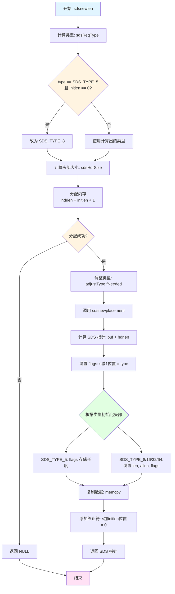
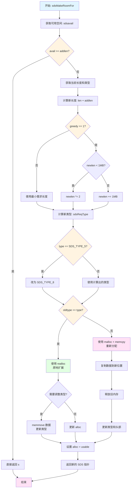
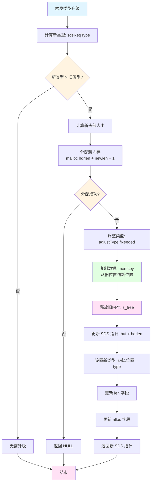
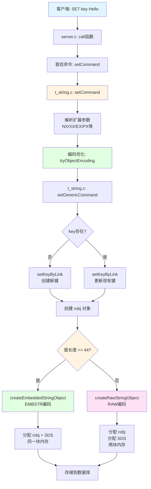
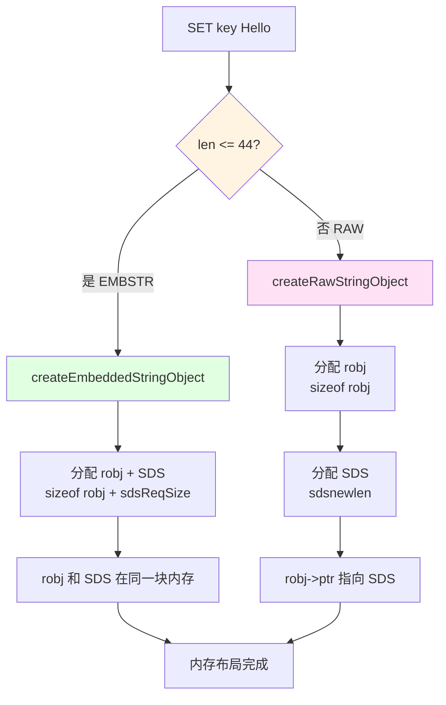
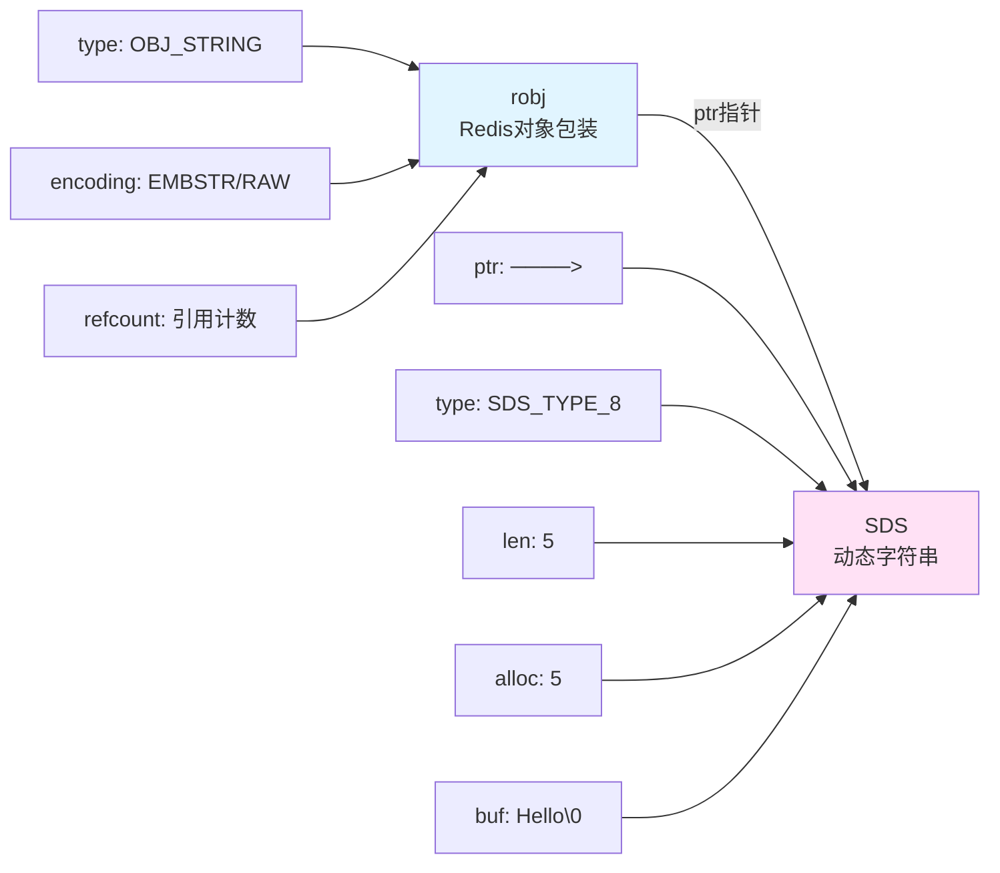
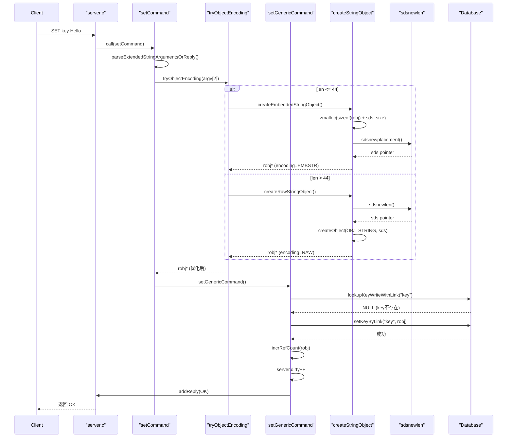

# Redis String: 源码分析

## 目录

**第一部分：理解概念（是什么、为什么）**
- [一、概述](#一概述)
  - [核心特点](#核心特点)
- [二、数据结构定义](#二数据结构定义)
  - [2.1 SDS 类型定义](#21-sds-类型定义)
  - [2.2 五种 SDS 结构体](#22-五种-sds-结构体)
  - [2.3 类型选择策略](#23-类型选择策略)
- [三、设计特点分析](#三设计特点分析)
  - [3.1 内存优化](#31-内存优化)
  - [3.2 性能优化](#32-性能优化)
  - [3.3 二进制安全](#33-二进制安全)
- [四、使用场景与限制](#四使用场景与限制)
  - [4.1 适用场景](#41-适用场景)
  - [4.2 性能特点](#42-性能特点)
  - [4.3 类型转换](#43-类型转换)

**第二部分：理解使用（怎么用）**
- [五、操作流程图](#五操作流程图)
  - [5.1 创建 SDS 流程](#51-创建-sds-流程)
  - [5.2 扩容流程](#52-扩容流程)
  - [5.3 类型升级流程](#53-类型升级流程)
- [六、示例代码理解](#六示例代码理解)
  - [6.1 基本操作示例](#61-基本操作示例)
  - [6.2 内存布局示例](#62-内存布局示例)
- [七、SET 命令完整流程分析](#七set-命令完整流程分析)
  - [7.1 调用流程](#71-调用流程)
  - [7.2 关键节点的内存分配](#72-关键节点的内存分配)
  - [7.3 robj 和 SDS 的结合使用](#73-robj-和-sds-的结合使用)
  - [7.4 完整执行时序图](#74-完整执行时序图)
  - [7.5 内存分配总结](#75-内存分配总结)
  - [7.6 关键代码路径总结](#76-关键代码路径总结)

**第三部分：深入实现（如何实现）**
- [八、核心函数实现](#八核心函数实现)
  - [8.1 类型判断函数](#81-类型判断函数)
  - [8.2 长度获取函数](#82-长度获取函数)
  - [8.3 创建 SDS 函数](#83-创建-sds-函数)
  - [8.4 扩容函数](#84-扩容函数)
  - [8.5 拼接函数](#85-拼接函数)
  - [8.6 类型升级函数](#86-类型升级函数)
  - [8.7 内存释放函数](#87-内存释放函数)
- [九、源码关键点总结](#九源码关键点总结)
  - [9.1 内存管理](#91-内存管理)
  - [9.2 柔性数组设计](#92-柔性数组设计)
  - [9.3 指针算术](#93-指针算术)
  - [9.4 类型标识](#94-类型标识)
- [十、测试用例分析](#十测试用例分析)
- [十一、总结](#十一总结)

---

## 一、概述

SDS（Simple Dynamic String）是 Redis 实现的动态字符串库，用于替代 C 标准库的字符串实现。SDS 是 Redis String 类型的底层实现，提供了 O(1) 时间复杂度获取长度、二进制安全、内存预分配等特性。

### 核心特点

- **O(1) 获取长度**：通过 `len` 字段直接获取，无需遍历
- **二进制安全**：可以存储任意二进制数据，不以 `\0` 作为字符串结束标志
- **内存预分配**：减少内存重分配次数，提高性能
- **五种类型优化**：根据字符串长度选择最合适的 SDS 类型，节省内存
- **兼容 C 字符串**：SDS 的 `buf` 以 `\0` 结尾，可直接使用 C 字符串函数

---

## 二、数据结构定义

### 2.1 SDS 类型定义

```24:24:github/redis-unstable/src/sds.h
typedef char *sds;
```

**要点：** `sds` 是 `char*` 的别名，指向 `buf[]` 数组的起始地址

### 2.2 五种 SDS 结构体

```28:55:github/redis-unstable/src/sds.h
struct __attribute__ ((__packed__)) sdshdr5 {
    unsigned char flags; /* 3 lsb of type, and 5 msb of string length */
    char buf[];
};
struct __attribute__ ((__packed__)) sdshdr8 {
    uint8_t len; /* used */
    uint8_t alloc; /* excluding the header and null terminator */
    unsigned char flags; /* 3 lsb of type, 5 unused bits */
    char buf[];
};
struct __attribute__ ((__packed__)) sdshdr16 {
    uint16_t len; /* used */
    uint16_t alloc; /* excluding the header and null terminator */
    unsigned char flags; /* 3 lsb of type, 5 unused bits */
    char buf[];
};
struct __attribute__ ((__packed__)) sdshdr32 {
    uint32_t len; /* used */
    uint32_t alloc; /* excluding the header and null terminator */
    unsigned char flags; /* 3 lsb of type, 5 unused bits */
    char buf[];
};
struct __attribute__ ((__packed__)) sdshdr64 {
    uint64_t len; /* used */
    uint64_t alloc; /* excluding the header and null terminator */
    unsigned char flags; /* 3 lsb of type, 5 unused bits */
    char buf[];
};
```

**字段说明：**

| 字段 | 说明 | 备注 |
|------|------|------|
| `len` | 已使用的字节数 | 不包括 `\0` |
| `alloc` | 已分配的字节数 | 不包括头部和 `\0` |
| `flags` | 类型标识 | 低 3 位标识类型 |
| `buf[]` | 柔性数组 | 存储实际字符串数据 |

**类型范围：**

| 类型 | 值 | len 范围 | alloc 范围 | 头部大小 |
|------|-----|---------|-----------|---------|
| `SDS_TYPE_5` | 0 | 0-31 | 等于 len | 1 字节 |
| `SDS_TYPE_8` | 1 | 0-255 | 0-255 | 3 字节 |
| `SDS_TYPE_16` | 2 | 0-65535 | 0-65535 | 5 字节 |
| `SDS_TYPE_32` | 3 | 0-4GB | 0-4GB | 9 字节 |
| `SDS_TYPE_64` | 4 | 0-16EB | 0-16EB | 17 字节 |

**注意：** `sdshdr5` 不使用 `len` 和 `alloc` 字段，长度存储在 `flags` 的高 5 位

### 2.3 类型选择策略

```265:265:github/redis-unstable/src/sds.h
char sdsReqType(size_t string_size);
```

**选择逻辑：**
- 0-31 字节 → `SDS_TYPE_5`
- 32-255 字节 → `SDS_TYPE_8`
- 256-65535 字节 → `SDS_TYPE_16`
- 65536-4GB → `SDS_TYPE_32`
- >4GB → `SDS_TYPE_64`

---

## 三、设计特点分析

### 3.1 内存优化

**自适应类型：**
- 根据字符串长度选择最小编码
- 小字符串使用更小的头部，节省内存
- **注意：** 只升级，不降级（避免频繁重分配）

**内存布局：**
- 头部和字符串数据在同一块连续内存中
- 提高 CPU 缓存命中率
- 减少内存碎片

### 3.2 性能优化

**O(1) 长度获取：**
- 通过 `len` 字段直接获取，无需遍历字符串
- 相比 C 字符串的 O(N) 有明显优势

**内存预分配：**
- 扩容时预分配额外空间（最多 1MB）
- 减少内存重分配次数
- 使用 `SDS_MAX_PREALLOC`（1MB）限制预分配大小

**惰性释放：**
- 缩短字符串时不立即释放内存
- 保留内存用于后续可能的扩展

### 3.3 二进制安全

- 不以 `\0` 作为字符串结束标志
- `len` 字段记录实际长度
- 可以存储任意二进制数据（包括 `\0`）
- `buf[len] = '\0'` 确保兼容 C 字符串函数

---

## 四、使用场景与限制

### 4.1 适用场景

- **Redis String 类型**：所有 String 类型的底层实现
- **Key 存储**：Redis 的所有 key 都使用 SDS
- **动态字符串**：需要频繁修改长度的情况
- **二进制数据**：需要存储二进制数据的场景

### 4.2 性能特点

| 操作 | 时间复杂度 | 说明 |
|------|-----------|------|
| 获取长度 | O(1) | 直接读取 `len` 字段 |
| 拼接 | O(N) | N 为新字符串长度 |
| 扩容 | O(N) | 可能需要类型升级和内存重分配 |
| 截取 | O(1) | 只需修改 `len` 字段 |
| 比较 | O(N) | N 为较短字符串长度 |

### 4.3 类型转换

SDS 类型会在以下情况自动升级：

1. **扩容时**：如果新长度超出当前类型范围，升级到更大类型
2. **拼接时**：如果拼接后长度超出当前类型范围，升级到更大类型

**注意：** SDS 不进行类型降级，避免频繁的内存重分配

---

## 五、操作流程图

> **提示：** 建议先浏览流程图，建立整体概念，再深入函数实现细节。

### 5.1 创建 SDS 流程



### 5.2 扩容流程



### 5.3 类型升级流程



---

## 六、示例代码理解

### 6.1 基本操作示例

```c
// 创建 SDS
sds s = sdsnew("Hello");
// len = 5, alloc = 5, type = SDS_TYPE_8

// 拼接字符串
s = sdscat(s, " World");
// len = 11, alloc = 11, type = SDS_TYPE_8

// 获取长度
size_t len = sdslen(s);  // O(1) 操作
```

### 6.2 内存布局示例

```
内存地址:  [0x1000] [0x1001] [0x1002] [0x1003] [0x1004] [0x1005] [0x1006] [0x1007] [0x1008] [0x1009] [0x100A] [0x100B] [0x100C] [0x100D] [0x100E] [0x100F]
           |-------|-------|-------|-------|-------|-------|-------|-------|-------|-------|-------|-------|-------|-------|-------|
内容:      |  len  | alloc | flags |  'H'  |  'e'  |  'l'  |  'l'  |  'o'  |  '\0' |       |       |       |       |       |       |
           |-------|-------|-------|-------|-------|-------|-------|-------|-------|-------|-------|-------|-------|-------|-------|
含义:      头部信息 (sdshdr8)                    柔性数组buf[]存储实际字符串数据
           5       |  5    |   1   |  'H'  |  'e'  |  'l'  |  'l'  |  'o'  |  '\0' |
```

**关键点：**
- `sds` 指针指向 `buf[]` 的起始地址（0x1003）
- 头部信息在 `buf[]` 之前
- `buf[len] = '\0'` 确保字符串安全

---

## 七、SET 命令完整流程分析

以命令 `SET key "Hello"` 为例，分析完整的执行流程。

### 7.1 调用流程

#### 完整调用链



**关键流程：**
- `parseExtendedStringArgumentsOrReply`：解析 NX、XX、EX、PX 等扩展参数
- `tryObjectEncoding`：尝试将字符串编码为 INT 或 EMBSTR（见下方说明）
- `setGenericCommand`：通用设置逻辑，处理条件检查和键设置
- `setKeyByLink`：将键值对存储到数据库

**编码选择逻辑 (`object.c:330`)：**

```330:335:github/redis-unstable/src/object.c
robj *createStringObject(const char *ptr, size_t len) {
    if (len <= OBJ_ENCODING_EMBSTR_SIZE_LIMIT)
        return createEmbeddedStringObject(ptr,len);
    else
        return createRawStringObject(ptr,len);
}
```

**判断条件：**
- ✅ `len <= 44` → `OBJ_ENCODING_EMBSTR`（嵌入式字符串）
- ✅ `len > 44` → `OBJ_ENCODING_RAW`（原始字符串）

**编码优化 (`tryObjectEncoding`)：**
- 如果值可以表示为整数 → `OBJ_ENCODING_INT`
- 如果长度 ≤ 44 → `OBJ_ENCODING_EMBSTR`
- 否则 → `OBJ_ENCODING_RAW`

---

### 7.2 关键节点的内存分配

#### 内存分配流程图



#### 具体内存分配

**1. EMBSTR 编码（len ≤ 44）**

```209:231:github/redis-unstable/src/object.c
robj *createEmbeddedStringObject(const char *val_ptr, size_t val_len) {
    /* Calculate size for embedded value (always SDS_TYPE_8) */
    size_t val_sds_size = sdsReqSize(val_len, SDS_TYPE_8);
    
    /* Allocate object memory */
    size_t bufsize = 0;
    robj *o = zmalloc_usable(sizeof(robj) + val_sds_size, &bufsize);
    o->type = OBJ_STRING;
    o->encoding = OBJ_ENCODING_EMBSTR;
    o->refcount = 1;
    o->lru = 0;
    o->expirable = 0;
    o->iskvobj = 0;

    /* The memory after the struct where we embedded data. */
    char *data = (char *)(o + 1);
    
    /* Copy embedded value (EMBSTR) always as SDS TYPE 8. Account for unused
     * memory in the SDS alloc field. */
    size_t remaining_size = bufsize - (data - (char *)(void *)o);
    o->ptr = sdsnewplacement(data, remaining_size, SDS_TYPE_8, val_ptr, val_len);
    return o;
}
```

**内存分配详情（`SET key "Hello"`，len=5）：**

| 步骤 | 操作 | 内存大小 | 说明 |
|------|------|---------|------|
| 1 | 分配 robj + SDS | 16 + 8 = 24 bytes | `sizeof(robj) + sdsReqSize(5, SDS_TYPE_8)` |
| 2 | robj 字段 | 16 bytes | `type`, `encoding`, `ptr`, `refcount` 等 |
| 3 | SDS 头部 | 3 bytes | `len=5`, `alloc=5`, `flags=1` |
| 4 | SDS 数据 | 6 bytes | `"Hello\0"` |

**内存布局（EMBSTR）：**

```
robj (16 bytes) + SDS (8 bytes)
+-----------+----------------+
| robj      | sdshdr8         |
+-----------+----------------+
| type=STR  | len=5           |
| enc=EMBSTR| alloc=5         |
| ptr ──────> flags=1          |
| refcount=1| "Hello\0"       |
+-----------+----------------+
```

**2. RAW 编码（len > 44）**

```131:133:github/redis-unstable/src/object.c
robj *createRawStringObject(const char *ptr, size_t len) {
    return createObject(OBJ_STRING, sdsnewlen(ptr,len));
}
```

**内存分配详情（假设 `SET key "VeryLongString..."`，len=100）：**

| 步骤 | 操作 | 内存大小 | 说明 |
|------|------|---------|------|
| 1 | 分配 robj | 16 bytes | `createObject(OBJ_STRING, sds)` |
| 2 | 分配 SDS | 3 + 101 = 104 bytes | `sdsnewlen` 分配头部 + 数据 |
| 3 | SDS 头部 | 3 bytes | `len=100`, `alloc=100`, `flags=1` |
| 4 | SDS 数据 | 101 bytes | 字符串数据 + `\0` |

**内存布局（RAW）：**

```
robj (16 bytes)              SDS (104 bytes)
+-----------+              +----------------+
| robj      |              | sdshdr8        |
+-----------+              +----------------+
| type=STR  |              | len=100        |
| enc=RAW   |              | alloc=100      |
| ptr ──────┼─────────────>| flags=1        |
| refcount=1|              | "VeryLong..."  |
+-----------+              +----------------+
```

**内存分配函数：** 使用 `zmalloc`/`zmalloc_usable`（Redis 的内存分配器）

**编码优势：**
- **EMBSTR**：robj 和 SDS 在同一块内存，提高缓存命中率，减少一次内存分配
- **RAW**：适合大字符串，内存可以独立释放

---

### 7.3 robj 和 SDS 的结合使用

#### robj 与 SDS 的关系

**robj 结构体：** Redis 对象的统一包装（见源码 `server.h:1043`）

**关系图：**



#### 什么时候用 robj？

**1. 对象创建和管理：**

```330:335:github/redis-unstable/src/object.c
robj *createStringObject(const char *ptr, size_t len) {
    if (len <= OBJ_ENCODING_EMBSTR_SIZE_LIMIT)
        return createEmbeddedStringObject(ptr,len);
    else
        return createRawStringObject(ptr,len);
}
```

- `createObject`：创建 `robj` 对象，设置 `type`、`encoding`、`refcount` 等
- `robj->ptr`：指向底层 `SDS` 结构
- `robj->encoding`：标识底层编码类型（`OBJ_ENCODING_EMBSTR` 或 `OBJ_ENCODING_RAW`）

**2. 对象查找和类型检查：**

```c
robj *val = lookupKeyRead(c->db, key);
if (checkType(c, val, OBJ_STRING)) return;  // 检查类型
```

#### 什么时候操作 SDS？

**实际的数据操作：**

通过 `robj->ptr` 获取 `sds` 指针，调用底层函数（见 [八、核心函数实现](#八核心函数实现)）：
- `sdslen`：获取长度（见 [8.2 长度获取函数](#82-长度获取函数)）
- `sdscat`：拼接字符串（见 [8.5 拼接函数](#85-拼接函数)）
- `sdsMakeRoomFor`：扩容（见 [8.4 扩容函数](#84-扩容函数)）
- `sdsfree`：释放内存（见 [8.7 内存释放函数](#87-内存释放函数)）

**⚠️ 注意：** `sdscat`、`sdsMakeRoomFor` 等函数可能返回新指针，需更新 `robj->ptr`

#### 使用模式总结

**创建流程：**
1. `createStringObject()` → 根据长度选择 `createEmbeddedStringObject()` 或 `createRawStringObject()`
2. 返回 `robj*`，`robj->ptr` 指向 `sds`

**操作流程：**
1. 通过 `robj->ptr` 获取 `sds` 指针
2. 调用 `sds` 函数（如 `sdscat`）
3. 如果返回新指针，更新 `robj->ptr`

**关键：** `sds` 操作函数可能返回新指针，必须更新 `robj->ptr`；`robj->ptr` 需转换为 `sds`；robj 管理引用计数和生命周期

---

### 7.4 完整执行时序图



---

### 7.5 内存分配总结

**执行 `SET key "Hello"` 的内存变化：**

- **EMBSTR 编码**：16 bytes (robj) + 8 bytes (SDS) = **24 bytes**
- **RAW 编码**（如果 len > 44）：16 bytes (robj) + 3 bytes (SDS头部) + len+1 bytes (数据) = **20 + len bytes**

**内存效率对比：**

| 编码 | len=5 | len=50 | len=100 |
|------|-------|--------|---------|
| EMBSTR | 24 bytes | 24 bytes | - |
| RAW | - | 69 bytes | 119 bytes |

**优势：**
- EMBSTR：小字符串节省内存，robj 和 SDS 在同一块内存
- RAW：大字符串时避免 EMBSTR 的内存浪费

---

### 7.6 关键代码路径总结

```
SET key Hello
│
├─ server.c:3758  call() → c->cmd->proc(c)
│
└─ t_string.c:382  setCommand()
   ├─ parseExtendedStringArgumentsOrReply()  // 解析 NX/XX/EX/PX 等
   ├─ tryObjectEncoding()                     // 编码优化
   │  └─ createStringObject()                // 见 7.2 节
   │     ├─ createEmbeddedStringObject()      // len <= 44
   │     │  └─ sdsnewplacement()             // 见 8.3 节
   │     └─ createRawStringObject()           // len > 44
   │        └─ sdsnewlen()                    // 见 8.3 节
   │
   └─ setGenericCommand()
      ├─ lookupKeyWriteWithLink()             // 查找 key
      ├─ setKeyByLink()                       // 设置键值对
      ├─ setExpireByLink()                    // 设置过期时间（如果有）
      └─ incrRefCount()                       // 增加引用计数
```

**总结：** Redis 通过 `robj` 统一管理对象元数据，通过 `SDS` 实现高效的字符串操作。EMBSTR 编码优化了小字符串的内存使用，RAW 编码适用于大字符串。详细函数实现见 [八、核心函数实现](#八核心函数实现)章节。

---

## 八、核心函数实现

### 8.1 类型判断函数

```68:71:github/redis-unstable/src/sds.h
static inline unsigned char sdsType(const sds s) {
    unsigned char flags = s[-1];
    return flags & SDS_TYPE_MASK;
}
```

**功能：** 获取 SDS 的类型

**实现原理：**
- `s[-1]` 访问 `flags` 字段（SDS 指针前一个字节）
- `SDS_TYPE_MASK = 7`（二进制 `111`）提取低 3 位

**要点：** 通过指针算术访问头部字段

### 8.2 长度获取函数

```73:86:github/redis-unstable/src/sds.h
static inline size_t sdslen(const sds s) {
    switch (sdsType(s)) {
        case SDS_TYPE_5: return SDS_TYPE_5_LEN(s);
        case SDS_TYPE_8:
            return SDS_HDR(8,s)->len;
        case SDS_TYPE_16:
            return SDS_HDR(16,s)->len;
        case SDS_TYPE_32:
            return SDS_HDR(32,s)->len;
        case SDS_TYPE_64:
            return SDS_HDR(64,s)->len;
    }
    return 0;
}
```

**功能：** O(1) 时间复杂度获取字符串长度

**实现原理：**
- 根据类型获取对应的头部指针
- 直接读取 `len` 字段
- `SDS_TYPE_5` 从 `flags` 字段提取长度

### 8.3 创建 SDS 函数

```98:116:github/redis-unstable/src/sds.c
sds _sdsnewlen(const void *init, size_t initlen, int trymalloc) {
    void *sh;

    char type = sdsReqType(initlen);
    /* Empty strings are usually created in order to append. Use type 8
     * since type 5 is not good at this. */
    if (type == SDS_TYPE_5 && initlen == 0) type = SDS_TYPE_8;
    int hdrlen = sdsHdrSize(type);
    size_t bufsize;

    assert(initlen + hdrlen + 1 > initlen); /* Catch size_t overflow */
    sh = trymalloc?
        s_trymalloc_usable(hdrlen+initlen+1, &bufsize) :
        s_malloc_usable(hdrlen+initlen+1, &bufsize);
    if (sh == NULL) return NULL;

    adjustTypeIfNeeded(&type, &hdrlen, bufsize);
    return sdsnewplacement(sh, bufsize, type, init, initlen);
}
```

**功能：** 创建新的 SDS 字符串

**流程：**
1. 根据长度选择类型：`sdsReqType(initlen)`
2. 空字符串使用 `SDS_TYPE_8`（便于后续追加）
3. 分配内存：`hdrlen + initlen + 1`（头部 + 数据 + `\0`）
4. 调整类型：如果分配器返回更大内存，可能升级类型
5. 调用 `sdsnewplacement` 初始化

**要点：** `trymalloc` 参数控制分配失败时的行为（返回 NULL vs 崩溃）

**sdsnewplacement 函数：**

```132:186:github/redis-unstable/src/sds.c
sds sdsnewplacement(char *buf, size_t bufsize, char type, const char *init, size_t initlen) {
    assert(bufsize >= sdsReqSize(initlen, type));
    int hdrlen = sdsHdrSize(type);
    size_t usable = bufsize - hdrlen - 1;
    sds s = buf + hdrlen;
    unsigned char *fp = ((unsigned char *)s) - 1; /* flags pointer. */

    switch(type) {
        case SDS_TYPE_5: {
            *fp = type | (initlen << SDS_TYPE_BITS);
            break;
        }
        case SDS_TYPE_8: {
            SDS_HDR_VAR(8,s);
            sh->len = initlen;
            debugAssert(usable <= sdsTypeMaxSize(type));
            sh->alloc = usable;
            *fp = type;
            break;
        }
        case SDS_TYPE_16: {
            SDS_HDR_VAR(16,s);
            sh->len = initlen;
            debugAssert(usable <= sdsTypeMaxSize(type));
            sh->alloc = usable;
            *fp = type;
            break;
        }
        case SDS_TYPE_32: {
            SDS_HDR_VAR(32,s);
            sh->len = initlen;
            debugAssert(usable <= sdsTypeMaxSize(type));
            sh->alloc = usable;
            *fp = type;
            break;
        }
        case SDS_TYPE_64: {
            SDS_HDR_VAR(64,s);
            sh->len = initlen;
            debugAssert(usable <= sdsTypeMaxSize(type));
            sh->alloc = usable;
            *fp = type;
            break;
        }
    }
    if (init == SDS_NOINIT)
        init = NULL;
    else if (!init)
        memset(s, 0, initlen);
    else if (initlen) 
        memcpy(s, init, initlen);

    s[initlen] = '\0';
    return s;
}
```

**功能：** 在预分配缓冲区中初始化 SDS

**关键步骤：**
1. **计算 SDS 指针**：`s = buf + hdrlen`（跳过头部）
2. **设置 flags**：`fp = s - 1`，存储类型标识
3. **初始化头部**：根据类型设置 `len`、`alloc`、`flags`
4. **复制数据**：`memcpy(s, init, initlen)`
5. **添加终止符**：`s[initlen] = '\0'`

**要点：** `sds` 指向 `buf[]`，头部在 `buf[]` 之前；`SDS_TYPE_5` 的长度存储在 `flags` 高 5 位

### 8.4 扩容函数

```264:323:github/redis-unstable/src/sds.c
sds _sdsMakeRoomFor(sds s, size_t addlen, int greedy) {
    void *sh, *newsh;
    size_t avail = sdsavail(s);
    size_t len, newlen, reqlen;
    char type, oldtype = sdsType(s);
    int hdrlen;
    size_t bufsize, usable;
    int use_realloc;

    /* Return ASAP if there is enough space left. */
    if (avail >= addlen) return s;

    len = sdslen(s);
    sh = (char*)s-sdsHdrSize(oldtype);
    reqlen = newlen = (len+addlen);
    assert(newlen > len);   /* Catch size_t overflow */
    if (greedy == 1) {
        if (newlen < SDS_MAX_PREALLOC)
            newlen *= 2;
        else
            newlen += SDS_MAX_PREALLOC;
    }

    type = sdsReqType(newlen);

    /* Don't use type 5: the user is appending to the string and type 5 is
     * not able to remember empty space, so sdsMakeRoomFor() must be called
     * at every appending operation. */
    if (type == SDS_TYPE_5) type = SDS_TYPE_8;

    hdrlen = sdsHdrSize(type);
    assert(hdrlen + newlen + 1 > reqlen);  /* Catch size_t overflow */
    use_realloc = (oldtype == type);
    if (use_realloc) {
        newsh = s_realloc_usable(sh, hdrlen + newlen + 1, &bufsize);
        if (newsh == NULL) return NULL;
        s = (char*)newsh + hdrlen;
        if (adjustTypeIfNeeded(&type, &hdrlen, bufsize)) {
            memmove((char *)newsh + hdrlen, s, len + 1);
            s = (char *)newsh + hdrlen;
            s[-1] = type;
            sdssetlen(s, len);
        }
    } else {
        /* Since the header size changes, need to move the string forward,
         * and can't use realloc */
        newsh = s_malloc_usable(hdrlen + newlen + 1, &bufsize);
        if (newsh == NULL) return NULL;
        adjustTypeIfNeeded(&type, &hdrlen, bufsize);
        memcpy((char*)newsh+hdrlen, s, len+1);
        s_free(sh);
        s = (char*)newsh+hdrlen;
        s[-1] = type;
        sdssetlen(s, len);
    }
    usable = bufsize - hdrlen - 1;
    assert(type == SDS_TYPE_5 || usable <= sdsTypeMaxSize(type));
    sdssetalloc(s, usable);
    return s;
}
```

**功能：** 为 SDS 字符串扩容，确保有足够空间添加 `addlen` 字节

**流程：**
1. **快速返回**：如果 `avail >= addlen`，直接返回
2. **计算新长度**：
   - `reqlen = len + addlen`（最小需求）
   - `greedy == 1`：预分配更多空间（`newlen *= 2` 或 `+= 1MB`）
3. **选择类型**：`sdsReqType(newlen)`，避免使用 `SDS_TYPE_5`
4. **内存重分配**：
   - **相同类型**：使用 `realloc`（原地扩展）
   - **不同类型**：使用 `malloc` + `memcpy`（需要移动数据）
5. **更新头部**：设置新的 `len`、`alloc`、`flags`

**要点：** `greedy` 参数控制预分配策略；类型升级时必须重新分配内存

### 8.5 拼接函数

```423:448:github/redis-unstable/src/sds.c
sds sdscatlen(sds s, const void *t, size_t len) {
    size_t curlen = sdslen(s);

    s = sdsMakeRoomFor(s,len);
    if (s == NULL) return NULL;
    memcpy(s+curlen, t, len);
    sdssetlen(s, curlen+len);
    s[curlen+len] = '\0';
    return s;
}
```

**功能：** 将长度为 `len` 的数据追加到 SDS 字符串

**流程：**
1. 获取当前长度：`curlen = sdslen(s)`
2. 扩容：`sdsMakeRoomFor(s, len)`
3. 复制数据：`memcpy(s+curlen, t, len)`
4. 更新长度：`sdssetlen(s, curlen+len)`
5. 添加终止符：`s[curlen+len] = '\0'`

**要点：** 返回的 SDS 指针可能改变（扩容后），调用者需更新引用

### 8.6 类型升级函数

类型升级在扩容函数 `_sdsMakeRoomFor` 中自动处理：

**升级条件：**
- 新长度超出当前类型范围
- 分配器返回的内存支持更大类型

**升级流程：**
1. 计算新类型：`type = sdsReqType(newlen)`
2. 如果 `type > oldtype`，触发升级
3. 重新分配内存（使用 `malloc`，不能用 `realloc`）
4. 复制数据到新位置
5. 更新类型标识和头部字段

### 8.7 内存释放函数

```214:217:github/redis-unstable/src/sds.c
void sdsfree(sds s) {
    if (s == NULL) return;
    s_free((char*)s-sdsHdrSize(s[-1]));
}
```

**功能：** 释放 SDS 字符串内存

**实现原理：**
1. 获取类型：`s[-1]` 读取 `flags` 字段
2. 计算头部大小：`sdsHdrSize(s[-1])`
3. 计算起始地址：`(char*)s - hdrlen`
4. 释放内存：`s_free(sh)`

**要点：** 需要从 `sds` 指针回退到头部起始地址才能正确释放

---

## 九、源码关键点总结

### 9.1 内存管理

- 使用 `sds_malloc` / `sds_realloc` / `sds_free` 进行内存分配
- 柔性数组 `buf[]` 实现变长数组
- 扩容时需要重新分配内存

### 9.2 柔性数组设计

- `buf[]` 是柔性数组成员，位于结构体末尾
- 头部和字符串数据在同一块连续内存中
- 通过指针算术访问头部字段

### 9.3 指针算术

- `s[-1]` 访问 `flags` 字段
- `SDS_HDR(T,s)` 计算头部指针：`(s) - sizeof(struct sdshdr##T)`
- `sds` 指向 `buf[]`，头部在 `buf[]` 之前

### 9.4 类型标识

- `flags` 字段的低 3 位存储类型
- `SDS_TYPE_5` 的高 5 位存储长度
- 通过位运算提取类型和长度信息

---

## 十、测试用例分析

源码测试涵盖：类型判断、基本操作（创建、拼接、截取）、类型升级、内存管理、边界情况处理

---

## 十一、总结

Redis SDS 是一个精心设计的动态字符串库，通过以下设计实现了高效的内存使用和性能：

1. **自适应类型**：根据字符串长度选择最合适的 SDS 类型
2. **O(1) 长度获取**：通过 `len` 字段直接获取，无需遍历
3. **二进制安全**：可以存储任意二进制数据
4. **内存预分配**：减少内存重分配次数，提高性能

这种设计使 SDS 成为 Redis 高性能字符串操作的基础，在 Redis String 类型、Key 存储等场景中发挥重要作用。
