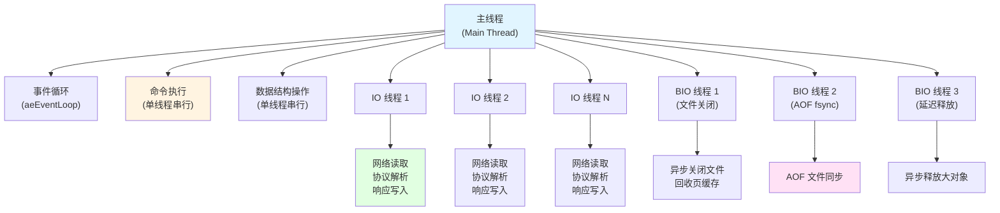
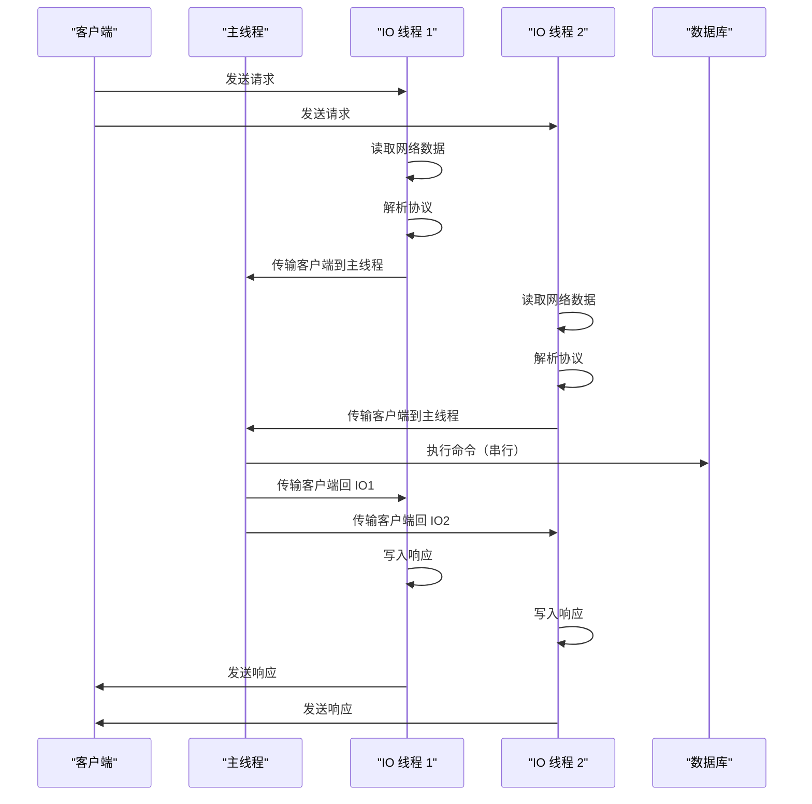

# Redis 多线程场景总结

## 目录

- [一、概述](#一概述)
- [二、Redis 多线程架构](#二redis-多线程架构)
- [三、BIO 线程（Background I/O Threads）](#三bio-线程background-io-threads)
- [四、IO 线程（I/O Threads）](#四io-线程io-threads)
- [五、其他线程场景](#五其他线程场景)
- [六、线程初始化顺序](#六线程初始化顺序)
- [七、配置说明](#七配置说明)
- [八、性能优化建议](#八性能优化建议)
- [九、总结](#九总结)

---

## 一、概述

Redis 作为单线程内存数据库，其命令执行核心仍保持单线程模型以保证数据一致性。但在某些特定场景下，Redis 通过引入多线程来提升性能和响应性：

1. **BIO 线程**：处理后台阻塞性 I/O 操作（文件关闭、AOF 同步、内存释放）
2. **IO 线程**：处理网络 I/O 操作，实现多核 CPU 并行利用（Redis 6.0+）
3. **jemalloc 后台线程**：内存分配器的后台线程
4. **模块线程**：Redis 模块可以创建自己的线程

**核心原则**：**命令执行仍由主线程串行执行，多线程仅用于 I/O 操作**，确保数据一致性和原子性。

### 1.1 重要概念说明：为什么说 Redis 是"单线程"而不是"单进程"？

> **Tips：理解 Redis 的线程模型**

**问题**：为什么说 Redis 是"单线程"而不是"单进程"？

**回答**：

1. **概念区别**：
   - **单进程（Single Process）**：Redis 运行在一个进程中，这是架构层面的描述
   - **单线程（Single Threaded）**：命令执行在单个线程中串行进行，这是执行模型层面的描述

2. **为什么强调"单线程"**：
   - "单线程"强调的是一种**执行模型**：所有命令在一个线程中顺序执行，保证了数据一致性
   - "单进程"是显而易见的（Redis 只有一个主进程），不需要特别强调
   - 便于与其他架构对比：
     - 单线程 vs 多线程并发模型
     - 单进程多线程 vs 多进程架构（如 Nginx）

3. **准确描述**：
   - ✅ Redis 是**单进程**程序（通常只有一个 redis-server 进程）
   - ✅ Redis 的**命令执行核心是单线程的**（所有命令在主线程中串行执行）
   - ✅ Redis 有**辅助线程**（BIO 线程、IO 线程等）处理后台任务和 I/O 操作

4. **官方出处**：
   Redis 官方配置文件 `redis.conf` 中明确说明：
   ```conf
   # Redis is mostly single threaded, however there are certain threaded
   # operations such as UNLINK, slow I/O accesses and other things that are
   # performed on side threads.
   ```
   翻译：Redis 主要是单线程的，但有一些线程化操作（如 UNLINK、慢 I/O 访问等）在侧线程中执行。

**完整表述**：**Redis 是一个单进程、命令执行核心为单线程的内存数据库**。

- **架构层面**：单进程架构
- **执行模型**：命令执行单线程模型（主线程串行执行所有命令）
- **扩展机制**：使用辅助线程处理 I/O 和后台任务

## 二、Redis 多线程架构

### 2.1 线程架构图



### 2.2 线程职责划分

| 线程类型 | 职责 | 线程数 | 是否必需 |
|---|---|---|---|
| **主线程** | 命令执行、数据结构操作、事件循环协调 | 1 | 是 |
| **IO 线程** | 网络 I/O 读写、协议解析 | 0-N（可配置） | 可选 |
| **BIO 线程** | 后台 I/O 操作（文件关闭、AOF 同步、延迟释放） | 3（固定） | 是 |
| **jemalloc 线程** | 内存分配器后台操作 | 0-N（可配置） | 可选 |

## 三、BIO 线程（Background I/O Threads）

### 3.1 概述

BIO 线程是 Redis 用于执行后台阻塞性 I/O 操作的专用线程系统，确保这些操作不会阻塞主线程的事件循环。

**设计目标**：将文件关闭、AOF fsync、内存释放等可能阻塞的操作从主线程卸载。

### 3.2 工作线程类型

BIO 线程系统包含 **3 个固定工作线程**：

| 工作线程 | 编号 | 处理的任务类型 | 使用场景 |
|---|---|---|---|
| **BIO_WORKER_CLOSE_FILE** | 0 | `BIO_CLOSE_FILE` | RDB 保存后关闭文件、复制过程中关闭文件 |
| **BIO_WORKER_AOF_FSYNC** | 1 | `BIO_AOF_FSYNC`、`BIO_CLOSE_AOF` | AOF 文件同步、AOF 重写后关闭文件 |
| **BIO_WORKER_LAZY_FREE** | 2 | `BIO_LAZY_FREE` | `UNLINK` 命令、`FLUSHALL` 命令、大对象删除 |

### 3.3 使用方式

#### 3.3.1 初始化

BIO 线程在服务器启动时自动初始化：

```3064:3068:github/redis-unstable/src/server.c
void InitServerLast(void) {
    bioInit();
    initThreadedIO();
    set_jemalloc_bg_thread(server.jemalloc_bg_thread);
    server.initial_memory_usage = zmalloc_used_memory();
}
```

#### 3.3.2 提交文件关闭任务

```c
// RDB 保存完成后关闭文件
bioCreateCloseJob(rdb_fd, 0, 1);
// 参数: fd, need_fsync, need_reclaim_cache
```

**使用场景**：
- RDB 后台保存完成后
- RDB 复制过程中
- AOF 重写临时文件

#### 3.3.3 提交 AOF 同步任务

```c
// AOF 写入后需要同步到磁盘
bioCreateFsyncJob(aof_fd, server.master_repl_offset, 1);
// 参数: fd, offset, need_reclaim_cache
```

**使用场景**：
- `appendfsync everysec` 模式下每秒同步
- AOF 重写后需要同步

#### 3.3.4 提交延迟释放任务

```c
// 延迟释放大对象
bioCreateLazyFreeJob(lazyfreeFreeObject, 1, large_obj);

// 延迟释放数据库
bioCreateLazyFreeJob(lazyfreeFreeDatabase, 3, oldkeys, oldexpires, oldsubexpires);
```

**使用场景**：
- `UNLINK` 命令删除键
- `FLUSHALL` 命令清空数据库
- `DEL` 命令删除大键（配置了延迟释放）

#### 3.3.5 完成通知机制

如果需要知道任务何时完成，可以提交完成请求：

```c
// 提交完成请求，所有之前的任务完成后会调用回调
bioCreateCompRq(BIO_WORKER_LAZY_FREE, flushallSyncBgDone, c->id, sflush);
```

### 3.4 核心 API

| API 函数 | 功能 | 参数 |
|---|---|---|
| `bioInit()` | 初始化 BIO 线程系统 | 无 |
| `bioCreateCloseJob()` | 创建文件关闭任务 | `fd, need_fsync, need_reclaim_cache` |
| `bioCreateFsyncJob()` | 创建 AOF 同步任务 | `fd, offset, need_reclaim_cache` |
| `bioCreateLazyFreeJob()` | 创建延迟释放任务 | `free_fn, arg_count, ...` |
| `bioPendingJobsOfType()` | 查询待处理任务数 | `type` |
| `bioDrainWorker()` | 等待工作线程队列清空 | `job_type` |

### 3.5 设计特点

- **FIFO 队列**：每个工作线程维护独立的任务队列，保证任务按提交顺序处理
- **完成通知**：通过管道和回调队列实现主线程与工作线程的异步通信
- **线程安全**：使用互斥锁和条件变量保证多线程环境下的数据一致性

**详细分析**：详见 [Redis BIO 线程源码分析](./redis_bio_thread.md)

## 四、IO 线程（I/O Threads）

### 4.1 概述

IO 线程是 Redis 6.0+ 引入的多线程网络 I/O 处理机制，通过将网络 I/O 操作从主线程卸载到多个后台线程，实现多核 CPU 的并行利用。

**设计目标**：在网络 I/O 密集的场景下，充分利用多核 CPU 提升吞吐量。

### 4.2 工作原理



### 4.3 使用方式

#### 4.3.1 配置

在 `redis.conf` 中配置：

```conf
# 启用 IO 线程（默认 1，即单线程模式）
io-threads 4

# 是否启用读操作的并行化（默认 no）
io-threads-do-reads yes
```

**线程数建议**：
- **4 核 CPU**：`io-threads 3-4`
- **8 核 CPU**：`io-threads 7`
- **16 核 CPU**：`io-threads 15`

**注意**：IO 线程数应该小于 CPU 核心数，保留核心给主线程和其他用途。

#### 4.3.2 初始化

IO 线程在服务器启动时初始化：

```656:722:github/redis-unstable/src/iothread.c
void initThreadedIO(void) {
    if (server.io_threads_num <= 1) return;

    server.io_threads_active = 1;

    if (server.io_threads_num > IO_THREADS_MAX_NUM) {
        serverLog(LL_WARNING,"Fatal: too many I/O threads configured. "
                             "The maximum number is %d.", IO_THREADS_MAX_NUM);
        exit(1);
    }

    prefetchCommandsBatchInit();

    /* Spawn and initialize the I/O threads. */
    for (int i = 1; i < server.io_threads_num; i++) {
        IOThread *t = &IOThreads[i];
        t->id = i;
        t->el = aeCreateEventLoop(server.maxclients+CONFIG_FDSET_INCR);
        t->el->privdata[0] = t;
        t->pending_clients = listCreate();
        t->processing_clients = listCreate();
        t->pending_clients_to_main_thread = listCreate();
        t->clients = listCreate();
        atomicSetWithSync(t->paused, IO_THREAD_UNPAUSED);
        atomicSetWithSync(t->running, 0);

        pthread_mutexattr_t *attr = NULL;
        #if defined(__linux__) && defined(__GLIBC__)
        attr = zmalloc(sizeof(pthread_mutexattr_t));
        pthread_mutexattr_init(attr);
        pthread_mutexattr_settype(attr, PTHREAD_MUTEX_ADAPTIVE_NP);
        #endif
        pthread_mutex_init(&t->pending_clients_mutex, attr);

        t->pending_clients_notifier = createEventNotifier();
        if (aeCreateFileEvent(t->el, getReadEventFd(t->pending_clients_notifier),
                              AE_READABLE, handleClientsFromMainThread, t) != AE_OK)
        {
            serverLog(LL_WARNING, "Fatal: Can't register file event for IO thread notifications.");
            exit(1);
        }

        /* This is the timer callback of the IO thread, used to gradually handle 
         * some background operations, such as clients cron. */
        if (aeCreateTimeEvent(t->el, 1, IOThreadCron, t, NULL) == AE_ERR) {
            serverLog(LL_WARNING, "Fatal: Can't create event loop timers in IO thread.");
            exit(1);
        }

        /* Create IO thread */
        if (pthread_create(&t->tid, NULL, IOThreadMain, (void*)t) != 0) {
```

### 4.4 客户端分配策略

#### 4.4.1 新客户端分配

新客户端分配给客户端数量最少的 IO 线程：

```157:176:github/redis-unstable/src/iothread.c
void assignClientToIOThread(client *c, int id) {
    int tid = id;
    if (tid == IOTHREAD_MAIN_THREAD_ID) {
        c->tid = tid;
        return;
    }
    if (tid == -1) {
        int min = server.io_threads_clients_num[1];
        int min_id = 1;

        for (int i = 1; i < server.io_threads_num; i++) {
            if (server.io_threads_clients_num[i] < min) {
                min = server.io_threads_clients_num[i];
                min_id = i;
            }
        }
        tid = min_id;
    }
    c->tid = tid;
    server.io_threads_clients_num[tid]++;
}
```

#### 4.4.2 特殊客户端处理

某些客户端必须在主线程处理：

```145:186:github/redis-unstable/src/iothread.c
int isClientMustHandledByMainThread(client *c) {
    if (c->flags & (CLIENT_CLOSE_ASAP | CLIENT_MASTER | CLIENT_SLAVE |
                    CLIENT_PUBSUB | CLIENT_MONITOR | CLIENT_BLOCKED |
                    CLIENT_UNBLOCKED | CLIENT_TRACKING | CLIENT_LUA_DEBUG |
                    CLIENT_LUA_DEBUG_SYNC))
    {
        return 1;
    }
    return 0;
}
```

**特殊客户端类型**：
- `CLIENT_MASTER/SLAVE`：主从复制相关
- `CLIENT_PUBSUB`：发布订阅
- `CLIENT_BLOCKED`：阻塞客户端
- `CLIENT_MONITOR`：监控客户端

### 4.5 适用场景

#### 4.5.1 高并发网络 I/O

- **场景**：大量客户端同时连接，频繁发送命令
- **优势**：多个 IO 线程并行处理网络 I/O，显著提升吞吐量
- **示例**：缓存服务、会话存储、实时统计

#### 4.5.2 多核 CPU 环境

- **场景**：4 核及以上 CPU
- **配置**：`io-threads 3`（4 核）或 `io-threads 7`（8 核）
- **原理**：每个 IO 线程运行在不同 CPU 核心上

### 4.6 性能提升

| 操作 | 单线程模式 | IO 线程模式 | 提升 |
|---|---|---|---|
| 网络读取 | 串行 | 并行（N 线程） | N 倍 |
| 协议解析 | 串行 | 并行（N 线程） | N 倍 |
| 命令执行 | 串行 | 串行 | 1 倍（保证一致性） |
| 响应写入 | 串行 | 并行（N 线程） | N 倍 |

**注意**：实际提升取决于：
- CPU 核心数
- 网络 I/O 占命令处理总时间的比例
- 客户端数量和并发度

**详细分析**：详见 [Redis IO 线程源码分析](./redis_io_thread.md)

## 五、其他线程场景

### 5.1 jemalloc 后台线程

jemalloc 是 Redis 可选的内存分配器，可以配置后台线程进行内存管理：

**配置**：
```conf
# 启用 jemalloc 后台线程
jemalloc-bg-thread yes
```

**作用**：
- 后台执行内存分配器的维护任务
- 减少内存分配时的延迟
- 优化内存碎片整理

### 5.2 Redis 模块线程

Redis 模块可以通过 `RedisModule_BlockClient` API 创建阻塞客户端，然后在后台线程中执行长时间运行的操作。

**示例**：
```c
// 模块创建后台线程处理耗时操作
RedisModuleBlockedClient *bc = RedisModule_BlockClient(ctx, ...);
pthread_t tid;
pthread_create(&tid, NULL, background_worker, bc);
```

**注意事项**：
- 模块线程不能直接访问 Redis 数据结构
- 需要通过 Redis 模块 API 与主线程通信
- 模块负责线程的生命周期管理

## 六、线程初始化顺序

Redis 线程系统的初始化顺序如下：

```3064:3068:github/redis-unstable/src/server.c
void InitServerLast(void) {
    bioInit();                                    // 1. 初始化 BIO 线程
    initThreadedIO();                            // 2. 初始化 IO 线程
    set_jemalloc_bg_thread(server.jemalloc_bg_thread);  // 3. 设置 jemalloc 线程
    server.initial_memory_usage = zmalloc_used_memory();
}
```

**初始化顺序说明**：

1. **BIO 线程**：首先初始化，因为文件操作和 AOF 同步可能在服务器启动早期就需要
2. **IO 线程**：然后初始化，用于处理网络 I/O
3. **jemalloc 线程**：最后设置，内存分配器在运行时才需要

## 七、配置说明

### 7.1 完整配置示例

```conf
# ===================================
# IO 线程配置
# ===================================

# IO 线程数量（1 = 单线程模式，建议设置为 CPU 核心数 - 1）
io-threads 4

# 是否启用读操作的并行化（默认 no，仅在高并发读场景下启用）
io-threads-do-reads yes

# ===================================
# CPU 亲和性配置（可选）
# ===================================

# 服务器线程（主线程和 IO 线程）的 CPU 亲和性
# 格式：0,2,4 或 0-3:2（0-3，步长 2）
server-cpulist 0,2,4

# BIO 线程的 CPU 亲和性
bio-cpulist 1,3

# RDB 后台保存的 CPU 亲和性
bgsave-cpulist 6

# AOF 重写的 CPU 亲和性
aof-rewrite-cpulist 7

# ===================================
# jemalloc 配置
# ===================================

# 启用 jemalloc 后台线程
jemalloc-bg-thread yes
```

### 7.2 配置建议

#### 7.2.1 IO 线程数

| CPU 核心数 | 推荐 IO 线程数 | 说明 |
|---|---|---|
| 1-2 核 | 1（不启用） | 单核/双核性能提升有限 |
| 4 核 | 2-3 | 保留 1-2 核给主线程和其他进程 |
| 8 核 | 4-6 | 保留 2-4 核给主线程 |
| 16 核 | 8-12 | 保留 4-8 核给主线程 |

#### 7.2.2 CPU 亲和性

**适用场景**：
- 多核服务器
- 需要确定性性能的场景
- NUMA 架构服务器

**配置原则**：
- 主线程和 IO 线程分配到不同 CPU 核心
- BIO 线程可以与 IO 线程共享核心（低负载）
- RDB/AOF 后台任务使用独立核心，避免影响主服务

## 八、性能优化建议

### 8.1 IO 线程优化

1. **合理设置线程数**：
   - 不要超过 CPU 核心数
   - 保留至少 1-2 核给主线程
   - 在高并发场景下适当增加线程数

2. **启用读操作并行化**：
   - 仅在读操作占比高的场景启用
   - `io-threads-do-reads yes` 会增加线程同步开销

3. **监控线程负载**：
   ```bash
   # 查看线程状态
   redis-cli INFO stats | grep io_threads
   
   # 查看线程 CPU 使用率
   top -H -p $(pgrep redis-server)
   ```

### 8.2 BIO 线程优化

1. **监控任务队列**：
   ```bash
   # 查看待处理任务数
   redis-cli INFO stats | grep bio
   ```

2. **AOF 同步优化**：
   - `appendfsync everysec`：平衡性能和持久性
   - `appendfsync no`：最佳性能，但可能丢失 1 秒数据

3. **延迟释放优化**：
   - 大对象删除使用 `UNLINK` 而非 `DEL`
   - `FLUSHALL` 会自动使用延迟释放

### 8.3 CPU 亲和性优化

1. **NUMA 架构**：
   - 将线程绑定到本地 NUMA 节点
   - 减少跨节点内存访问

2. **隔离关键线程**：
   - 主线程使用独立核心
   - IO 线程使用专用核心池

3. **动态调整**：
   - 根据实际负载调整 CPU 绑定
   - 避免过度绑定导致调度不灵活

## 九、总结

### 9.1 Redis 多线程设计原则

1. **命令执行单线程**：保证数据一致性和原子性
2. **I/O 操作多线程**：充分利用多核 CPU，提升吞吐量
3. **异步化阻塞操作**：避免阻塞主事件循环

### 9.2 线程使用场景总结

| 场景 | 线程类型 | 线程数 | 目的 |
|---|---|---|---|
| **网络 I/O 处理** | IO 线程 | 可配置（1-N） | 多核并行处理网络读写 |
| **文件关闭** | BIO 线程 | 1（固定） | 异步关闭文件，避免阻塞 |
| **AOF 同步** | BIO 线程 | 1（固定） | 异步 fsync，避免阻塞 |
| **内存释放** | BIO 线程 | 1（固定） | 异步释放大对象，避免阻塞 |
| **内存管理** | jemalloc 线程 | 可配置 | 内存分配器后台任务 |

### 9.3 性能提升效果

- **IO 线程**：在高并发场景下，吞吐量可提升 **2-4 倍**（取决于 CPU 核心数和网络 I/O 占比）
- **BIO 线程**：避免主线程阻塞，**响应延迟降低 50-90%**（特别是在文件操作和 AOF 同步时）
- **CPU 亲和性**：在 NUMA 架构下，性能可提升 **10-20%**

### 9.4 最佳实践

1. **合理配置线程数**：根据 CPU 核心数和负载情况调整
2. **启用 BIO 线程**：始终启用（默认开启），无需配置
3. **按需启用 IO 线程**：在高并发网络 I/O 场景下启用
4. **监控线程状态**：定期检查线程负载和任务队列长度
5. **优化 CPU 亲和性**：在 NUMA 架构或多核服务器上考虑使用

### 9.5 相关文档

- [Redis BIO 线程源码分析](./redis_bio_thread.md) - BIO 线程详细实现
- [Redis IO 线程源码分析](./redis_io_thread.md) - IO 线程详细实现
- [Redis 事件循环](./redis_ae.md) - 事件循环机制
- [Redis 网络循环](./redis_net_loop.md) - 网络 I/O 处理

---

**总结**：Redis 通过 BIO 线程和 IO 线程实现了高效的异步 I/O 处理，在保持单线程命令执行模型的同时，充分利用多核 CPU 提升了系统吞吐量和响应性。合理配置和使用这些线程特性，可以显著提升 Redis 在高并发场景下的性能表现。

