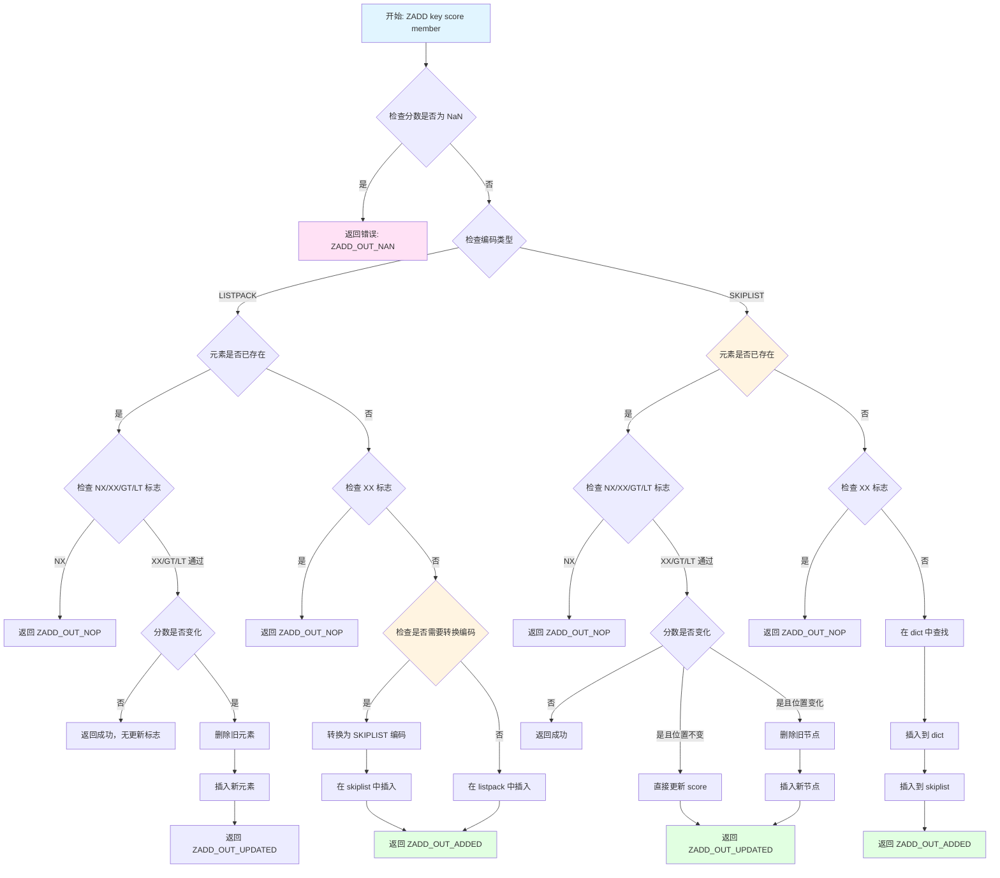
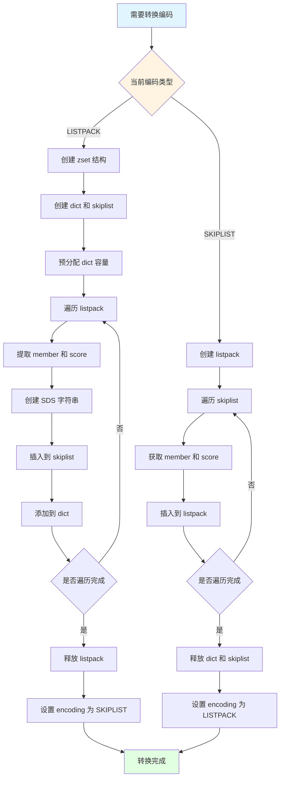
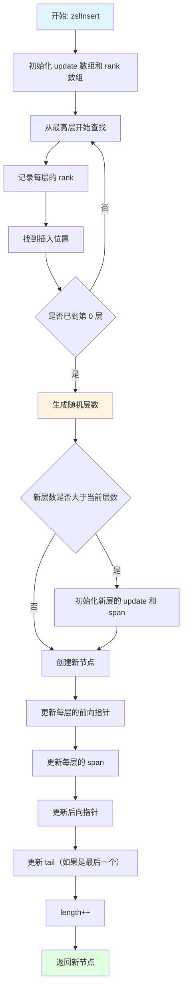
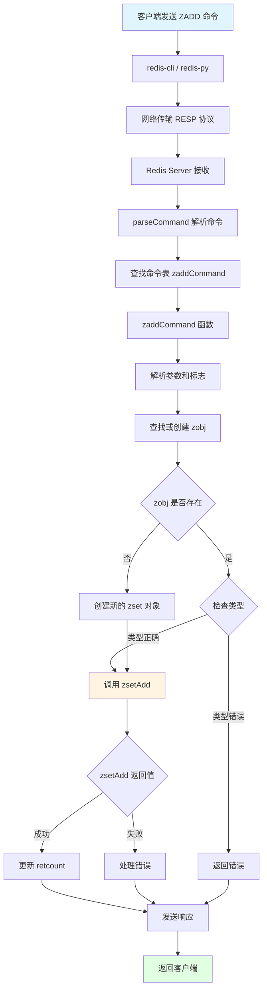
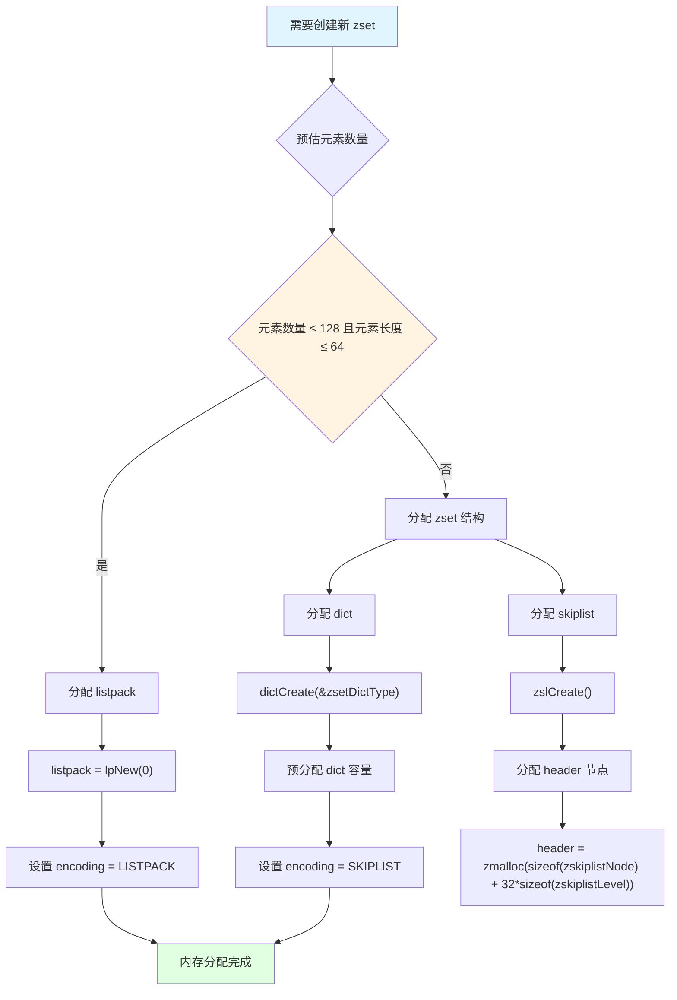
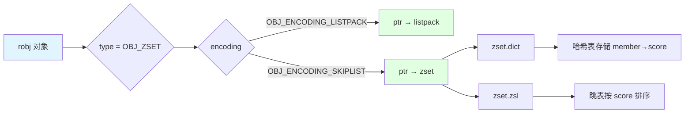
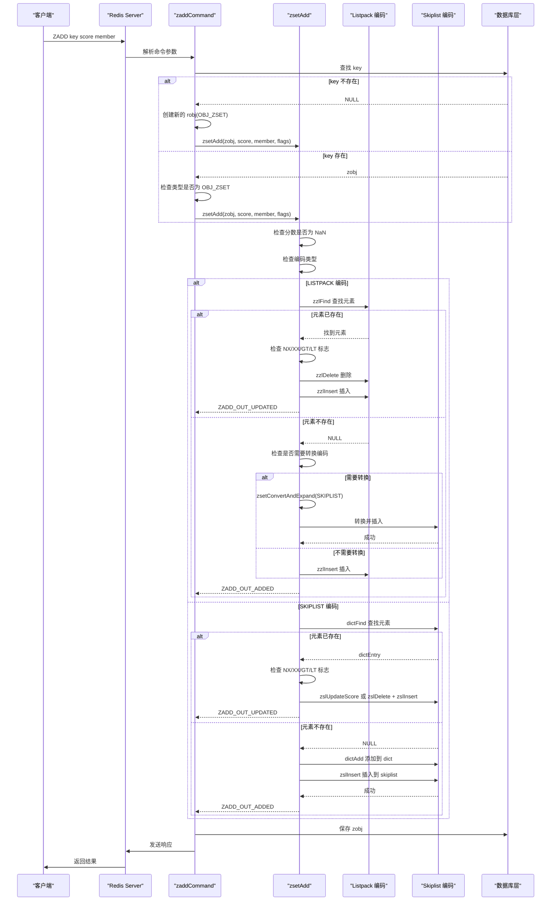

# Redis ZSet: 源码分析

## 目录

**第一部分：理解概念（是什么、为什么）**
- [一、概述](#一概述)
- [二、数据结构定义](#二数据结构定义)
- [三、设计特点分析](#三设计特点分析)
- [四、使用场景与限制](#四使用场景与限制)

**第二部分：理解使用（怎么用）**
- [五、操作流程图](#五操作流程图)
- [六、示例代码理解](#六示例代码理解)
- [七、ZADD 命令完整流程分析](#七zadd-命令完整流程分析)

**第三部分：深入实现（如何实现）**
- [八、核心函数实现](#八核心函数实现)
- [九、源码关键点总结](#九源码关键点总结)
- [十、测试用例分析](#十测试用例分析)
- [十一、总结](#十一总结)

---

## 一、概述

ZSet（Sorted Set，有序集合）是 Redis 中一个重要的数据结构，它结合了集合（Set）和有序列表的特点，能够按照分数（score）对成员（member）进行排序。每个成员都有唯一的字符串标识，并且关联一个浮点型分数。

### 核心特点

- **双数据结构设计**：同时使用跳表（Skiplist）和哈希表（Dict）来维护成员和分数的关系，实现 O(1) 查找和 O(log N) 有序操作
- **自适应编码**：小规模数据使用 listpack 编码以节省内存，大规模数据自动转换为 skiplist 编码以提升性能
- **排序支持**：支持按分数排序，分数相同时按成员字典序排序
- **范围查询**：高效支持按分数范围、按字典序范围、按排名范围等多种查询方式
- **共享内存优化**：跳表和哈希表共享同一个 SDS 字符串，避免重复存储

详见 [二、数据结构定义](#二数据结构定义) 和 [三、设计特点分析](#三设计特点分析)

## 二、数据结构定义

### 2.1 zset 结构体

ZSet 使用两种编码方式：`OBJ_ENCODING_LISTPACK` 和 `OBJ_ENCODING_SKIPLIST`。

#### 2.1.1 LISTPACK 编码

小规模数据使用 listpack 编码，直接存储在 `robj->ptr` 中：

```
listpack: [member1, score1, member2, score2, ...]
```

元素按 score 升序排列，score 相同时按 member 字典序排列。

#### 2.1.2 SKIPLIST 编码

大规模数据使用 skiplist 编码，通过 `zset` 结构体存储：

```1547:1567:github/redis-unstable/src/server.h
/* ZSETs use a specialized version of Skiplists */
typedef struct zskiplistNode {
    sds ele;
    double score;
    struct zskiplistNode *backward;
    struct zskiplistLevel {
        struct zskiplistNode *forward;
        unsigned long span;
    } level[];
} zskiplistNode;

typedef struct zskiplist {
    struct zskiplistNode *header, *tail;
    unsigned long length;
    int level;
} zskiplist;

typedef struct zset {
    dict *dict;
    zskiplist *zsl;
} zset;
```

**字段说明：**

| 结构体 | 字段 | 类型 | 说明 | 备注 |
|---|---|---|---|---|
| zset | dict | dict* | 哈希表，用于 O(1) 查找成员 | key 为 member (sds)，value 为 score (double*) |
| zset | zsl | zskiplist* | 跳表，用于按分数排序 | 支持 O(log N) 插入和范围查询 |
| zskiplist | header | zskiplistNode* | 跳表头节点 | 包含 ZSKIPLIST_MAXLEVEL 层 |
| zskiplist | tail | zskiplistNode* | 跳表尾节点 | 用于反向遍历 |
| zskiplist | length | unsigned long | 跳表节点数量 | 等于集合元素数量 |
| zskiplist | level | int | 跳表当前最大层数 | 1 ≤ level ≤ ZSKIPLIST_MAXLEVEL |
| zskiplistNode | ele | sds | 成员字符串 | 与 dict 中的 key 共享 |
| zskiplistNode | score | double | 分数 | 用于排序 |
| zskiplistNode | backward | zskiplistNode* | 后向指针 | 仅在第 0 层，支持反向遍历 |
| zskiplistLevel | forward | zskiplistNode* | 前向指针 | 指向同层下一个节点 |
| zskiplistLevel | span | unsigned long | 跨度 | 记录到下一个节点的距离 |

### 2.2 编码选择策略

ZSet 使用自适应编码策略：

```1330:1343:github/redis-unstable/src/t_zset.c
/* Convert the sorted set object into a listpack if it is not already a listpack
 * and if the number of elements and the maximum element size and total elements size
 * are within the expected ranges. */
void zsetConvertToListpackIfNeeded(robj *zobj, size_t maxelelen, size_t totelelen) {
    if (zobj->encoding == OBJ_ENCODING_LISTPACK) return;
    zset *zset = zobj->ptr;

    if (zset->zsl->length <= server.zset_max_listpack_entries &&
        maxelelen <= server.zset_max_listpack_value &&
        lpSafeToAdd(NULL, totelelen))
    {
        zsetConvert(zobj,OBJ_ENCODING_LISTPACK);
    }
}
```

**转换条件：**

| 编码方式 | 使用条件 | 默认配置 |
|---|---|---|
| LISTPACK | 元素数量 ≤ `zset_max_listpack_entries` 且最大元素长度 ≤ `zset_max_listpack_value` | entries ≤ 128, value ≤ 64 bytes |
| SKIPLIST | 不满足 listpack 条件时 | - |

**常量定义：**

```612:612:github/redis-unstable/src/server.h
#define ZSKIPLIST_MAXLEVEL 32 /* Should be enough for 2^64 elements */
```

跳表最大层数为 32，足以支持 2^64 个元素。

## 三、设计特点分析

### 3.1 内存优化

#### 3.1.1 共享 SDS 字符串

ZSet 的跳表和哈希表共享同一个 SDS 字符串，避免重复存储：

```20:33:github/redis-unstable/src/t_zset.c
/* ZSETs are ordered sets using two data structures to hold the same elements
 * in order to get O(log(N)) INSERT and REMOVE operations into a sorted
 * data structure.
 *
 * The elements are added to a hash table mapping Redis objects to scores.
 * At the same time the elements are added to a skip list mapping scores
 * to Redis objects (so objects are sorted by scores in this "view").
 *
 * Note that the SDS string representing the element is the same in both
 * the hash table and skiplist in order to save memory. What we do in order
 * to manage the shared SDS string more easily is to free the SDS string
 * only in zslFreeNode(). The dictionary has no value free method set.
 * So we should always remove an element from the dictionary, and later from
 * the skiplist.
```

**内存管理策略：**
- 哈希表的 dict 不设置 value 释放函数
- SDS 字符串只在 `zslFreeNode()` 中释放
- 删除元素时先删除 dict，再删除 skiplist

#### 3.1.2 自适应编码优化

小规模数据使用 listpack 编码，节省内存：

- **Listpack 编码**：元素和分数紧凑存储，无额外指针开销
- **Skiplist 编码**：需要维护 dict 和 skiplist 两套结构，但支持高效范围查询

**内存效率对比（假设每个 member 8 bytes，score 8 bytes）：**

| 元素数量 | Listpack 编码 | Skiplist 编码 | 节省比例 |
|---|---|---|---|
| 100 | ~1.6 KB | ~4.8 KB | 66% |
| 1000 | ~16 KB | ~48 KB | 66% |
| 10000 | - | ~480 KB | - |

当元素数量超过阈值时，自动转换为 skiplist 编码以支持高效操作。

### 3.2 性能优化

#### 3.2.1 时间复杂度分析

| 操作 | LISTPACK 编码 | SKIPLIST 编码 | 说明 |
|---|---|---|---|
| 查找成员 | O(N) | O(1) | skiplist 使用 dict 查找 |
| 插入元素 | O(N) | O(log N) | skiplist 使用跳表插入 |
| 删除元素 | O(N) | O(log N) | skiplist 先 O(1) 查 dict，再 O(log N) 删 skiplist |
| 按排名查询 | O(N) | O(log N) | skiplist 使用 span 字段快速定位 |
| 按分数范围查询 | O(N) | O(log N + M) | skiplist M 为范围内元素数 |
| 按字典序范围查询 | O(N) | O(N) | 两种编码都需要遍历 |

#### 3.2.2 快速路径设计

**1. 分数更新优化**

当更新分数后节点位置不变时，直接更新 score，无需删除和重新插入：

```249:291:github/redis-unstable/src/t_zset.c
zskiplistNode *zslUpdateScore(zskiplist *zsl, double curscore, sds ele, double newscore) {
    zskiplistNode *update[ZSKIPLIST_MAXLEVEL], *x;
    int i;

    /* We need to seek to element to update to start: this is useful anyway,
     * we'll have to update or remove it. */
    x = zsl->header;
    for (i = zsl->level-1; i >= 0; i--) {
        while (x->level[i].forward &&
                (x->level[i].forward->score < curscore ||
                    (x->level[i].forward->score == curscore &&
                     sdscmp(x->level[i].forward->ele,ele) < 0)))
        {
            x = x->level[i].forward;
        }
        update[i] = x;
    }

    /* Jump to our element: note that this function assumes that the
     * element with the matching score exists. */
    x = x->level[0].forward;
    serverAssert(x && curscore == x->score && sdscmp(x->ele,ele) == 0);

    /* If the node, after the score update, would be still exactly
     * at the same position, we can just update the score without
     * actually removing and re-inserting the element in the skiplist. */
    if ((x->backward == NULL || x->backward->score < newscore) &&
        (x->level[0].forward == NULL || x->level[0].forward->score > newscore))
    {
        x->score = newscore;
        return x;
    }

    /* No way to reuse the old node: we need to remove and insert a new
     * one at a different place. */
    zslDeleteNode(zsl, x, update);
    zskiplistNode *newnode = zslInsert(zsl,newscore,x->ele);
    /* We reused the old node x->ele SDS string, free the node now
     * since zslInsert created a new one. */
    x->ele = NULL;
    zslFreeNode(x);
    return newnode;
}
```

**2. 预分配策略**

转换编码时预分配 dict 容量，避免频繁 rehash：

```1276:1277:github/redis-unstable/src/t_zset.c
        /* Presize the dict to avoid rehashing */
        dictExpand(zs->dict, cap);
```

### 3.3 特殊处理

#### 3.3.1 相同分数处理

当多个成员具有相同分数时，按成员字典序排序：

```132:136:github/redis-unstable/src/t_zset.c
        while (x->level[i].forward &&
                (x->level[i].forward->score < score ||
                    (x->level[i].forward->score == score &&
                    sdscmp(x->level[i].forward->ele,ele) < 0)))
```

#### 3.3.2 NaN 处理

分数不能为 NaN，插入前会检查并返回错误：

```1420:1424:github/redis-unstable/src/t_zset.c
    /* NaN as input is an error regardless of all the other parameters. */
    if (isnan(score)) {
        *out_flags = ZADD_OUT_NAN;
        return 0;
    }
```

#### 3.3.3 边界情况处理

**空集合处理：**
- Listpack 编码：空 listpack
- Skiplist 编码：header 指向 NULL，tail 为 NULL，length 为 0

**删除最后一个元素后：**
- 检查是否满足转换为 listpack 的条件，如果满足则转换以节省内存

## 四、使用场景与限制

### 4.1 适用场景

ZSet 适用于以下场景：

1. **排行榜系统**
   - 游戏积分榜、用户活跃度排行
   - 实时更新分数，按排名查询

2. **延时队列**
   - 使用分数存储时间戳，定时扫描到期任务
   - 使用 `ZREMRANGEBYRANK` 批量删除已完成任务

3. **权重排序**
   - 按优先级、权重对元素排序
   - 支持动态更新权重

4. **范围统计**
   - 统计某个分数范围内的元素数量
   - 获取指定排名范围的元素

5. **去重排序**
   - 需要去重且需要排序的场景

### 4.2 性能特点

| 操作 | 时间复杂度 | 说明 |
|---|---|---|
| ZADD | O(log N) | 插入新成员 |
| ZREM | O(log N) | 删除成员 |
| ZSCORE | O(1) | 获取成员分数（skiplist）或 O(N)（listpack） |
| ZRANK | O(log N) | 获取成员排名 |
| ZRANGE | O(log N + M) | 获取排名范围内的成员，M 为返回数量 |
| ZRANGEBYSCORE | O(log N + M) | 获取分数范围内的成员 |
| ZCOUNT | O(log N + M) | 统计分数范围内的成员数量 |

**性能优化建议：**
- 小规模数据（< 128 元素）自动使用 listpack，内存效率高
- 大规模数据自动使用 skiplist，查询效率高
- 批量操作时考虑使用 pipeline

### 4.3 转换条件

**Listpack → Skiplist 转换条件：**

```1464:1468:github/redis-unstable/src/t_zset.c
            if (zzlLength(zobj->ptr)+1 > server.zset_max_listpack_entries ||
                sdslen(ele) > server.zset_max_listpack_value ||
                !lpSafeToAdd(zobj->ptr, sdslen(ele)))
            {
                zsetConvertAndExpand(zobj, OBJ_ENCODING_SKIPLIST, zsetLength(zobj) + 1);
```

触发条件：
1. 元素数量超过 `zset_max_listpack_entries`（默认 128）
2. 新元素长度超过 `zset_max_listpack_value`（默认 64 bytes）
3. listpack 无法安全添加新元素

**Skiplist → Listpack 转换条件：**

转换发生在删除元素后，当满足以下条件时自动转换：
1. 元素数量 ≤ `zset_max_listpack_entries`
2. 最大元素长度 ≤ `zset_max_listpack_value`
3. listpack 可以安全存储所有元素

## 五、操作流程图

### 5.1 ZADD 添加元素流程



### 5.2 编码转换流程



### 5.3 跳表插入流程



## 六、示例代码理解

### 6.1 基本操作示例

```python
import redis

# 连接 Redis
r = redis.Redis(host='localhost', port=6379, db=0)

# 添加元素到有序集合
r.zadd('leaderboard', {'player1': 100.0, 'player2': 200.0, 'player3': 150.0})

# 获取排名（从低到高，0 开始）
rank = r.zrank('leaderboard', 'player1')  # 返回 0

# 获取排名范围
top_players = r.zrange('leaderboard', 0, 2, withscores=True)
# 返回: [(b'player1', 100.0), (b'player3', 150.0), (b'player2', 200.0)]

# 更新分数
r.zincrby('leaderboard', 50.0, 'player1')  # player1 分数变为 150.0

# 按分数范围查询
players_in_range = r.zrangebyscore('leaderboard', 100, 200, withscores=True)
# 返回分数在 [100, 200] 范围内的所有玩家

# 删除元素
r.zrem('leaderboard', 'player3')

# 获取集合大小
size = r.zcard('leaderboard')  # 返回剩余元素数量
```

### 6.2 内存布局示例

#### 6.2.1 LISTPACK 编码内存布局

假设有 3 个元素：`("player1", 100.0)`, `("player2", 200.0)`, `("player3", 150.0)`

```
listpack 内存布局:
[总字节数] [元素数量] [player1] [100.0] [player3] [150.0] [player2] [200.0] [结束标记]
```

元素按 score 升序存储，score 相同时按 member 字典序存储。

#### 6.2.2 SKIPLIST 编码内存布局

```
zset 结构:
┌─────────────────┐
│ zset            │
│  dict *dict     │───┐
│  zskiplist *zsl │───┤
└─────────────────┘   │
                       │
        ┌──────────────┘
        │
        ▼
┌─────────────────┐         ┌─────────────────┐
│ dict            │         │ zskiplist       │
│ 哈希表存储       │         │  header ────────┼──┐
│ key: member     │         │  tail           │  │
│ val: &score     │         │  length: 3      │  │
└─────────────────┘         │  level: 2       │  │
                             └─────────────────┘  │
                                    │             │
                                    ▼             │
┌─────────────────────────────────────────────────┐
│ zskiplistNode (header, level=2)                │
│  score: 0                                       │
│  ele: NULL                                      │
│  backward: NULL                                 │
│  level[0]: forward ─────────────────────────────┼──┐
│           span: 1                               │  │
│  level[1]: forward ─────────────────────────────┼──┤
│           span: 2                               │  │
└─────────────────────────────────────────────────┘  │
         │                                           │
         ▼                                           │
┌─────────────────────────────────────────────────┐ │
│ zskiplistNode (player1, score=100.0, level=1)  │ │
│  score: 100.0                                   │ │
│  ele: "player1" (共享 SDS)                     │ │
│  backward: NULL                                 │ │
│  level[0]: forward ─────────────────────────────┼─┤
│           span: 1                               │ │
└─────────────────────────────────────────────────┘ │
         │                                           │
         ▼                                           │
┌─────────────────────────────────────────────────┐ │
│ zskiplistNode (player3, score=150.0, level=2)  │ │
│  score: 150.0                                   │ │
│  ele: "player3" (共享 SDS)                     │ │
│  backward: → player1                            │ │
│  level[0]: forward ─────────────────────────────┼─┤
│           span: 1                               │ │
│  level[1]: forward ─────────────────────────────┼─┘
│           span: 1                               │
└─────────────────────────────────────────────────┘
         │
         ▼
┌─────────────────────────────────────────────────┐
│ zskiplistNode (player2, score=200.0, level=1)  │
│  score: 200.0                                   │
│  ele: "player2" (共享 SDS)                     │
│  backward: → player3                            │
│  level[0]: forward: NULL                        │
│           span: 0                               │
└─────────────────────────────────────────────────┘
```

**关键点：**
- dict 的 key 和 skiplist 的 ele 指向同一个 SDS 字符串，节省内存
- skiplist 的 level 数组使用柔性数组，不同节点层数不同
- span 字段记录到下一个节点的距离，用于快速计算排名

## 七、ZADD 命令完整流程分析

### 7.1 调用流程



### 7.2 关键节点的内存分配

#### 7.2.1 创建新 ZSet 对象



**内存分配详情：**

| 编码 | 分配内容 | 大小计算 | 说明 |
|---|---|---|---|
| LISTPACK | listpack 结构 | 初始 ~32 bytes | 动态增长 |
| SKIPLIST | zset 结构 | 16 bytes (2 指针) | dict + zskiplist |
| SKIPLIST | dict 结构 | ~96 bytes | 哈希表初始结构 |
| SKIPLIST | zskiplist 结构 | 24 bytes | header + tail + length + level |
| SKIPLIST | header 节点 | 8 + 8 + 8 + 32*16 = 528 bytes | ele + score + backward + level[32] |

#### 7.2.2 添加元素时的内存分配

**LISTPACK 编码：**
- 插入新元素：`member_size + score_size + overhead`
- listpack 动态扩容，可能需要 realloc

**SKIPLIST 编码：**
- 创建新节点：`sizeof(zskiplistNode) + level * sizeof(zskiplistLevel)`
- dict 插入：可能需要 rehash，重新分配桶数组

#### 7.2.3 编码转换时的内存分配

```1255:1328:github/redis-unstable/src/t_zset.c
void zsetConvertAndExpand(robj *zobj, int encoding, unsigned long cap) {
    zset *zs;
    zskiplistNode *node, *next;
    sds ele;
    double score;

    if (zobj->encoding == encoding) return;
    if (zobj->encoding == OBJ_ENCODING_LISTPACK) {
        unsigned char *zl = zobj->ptr;
        unsigned char *eptr, *sptr;
        unsigned char *vstr;
        unsigned int vlen;
        long long vlong;

        if (encoding != OBJ_ENCODING_SKIPLIST)
            serverPanic("Unknown target encoding");

        zs = zmalloc(sizeof(*zs));
        zs->dict = dictCreate(&zsetDictType);
        zs->zsl = zslCreate();

        /* Presize the dict to avoid rehashing */
        dictExpand(zs->dict, cap);

        eptr = lpSeek(zl,0);
        if (eptr != NULL) {
            sptr = lpNext(zl,eptr);
            serverAssertWithInfo(NULL,zobj,sptr != NULL);
        }

        while (eptr != NULL) {
            score = zzlGetScore(sptr);
            vstr = lpGetValue(eptr,&vlen,&vlong);
            if (vstr == NULL)
                ele = sdsfromlonglong(vlong);
            else
                ele = sdsnewlen((char*)vstr,vlen);

            node = zslInsert(zs->zsl,score,ele);
            serverAssert(dictAdd(zs->dict,ele,&node->score) == DICT_OK);
            zzlNext(zl,&eptr,&sptr);
        }

        zfree(zobj->ptr);
        zobj->ptr = zs;
        zobj->encoding = OBJ_ENCODING_SKIPLIST;
    } else if (zobj->encoding == OBJ_ENCODING_SKIPLIST) {
        unsigned char *zl = lpNew(0);

        if (encoding != OBJ_ENCODING_LISTPACK)
            serverPanic("Unknown target encoding");

        /* Approach similar to zslFree(), since we want to free the skiplist at
         * the same time as creating the listpack. */
        zs = zobj->ptr;
        dictRelease(zs->dict);
        node = zs->zsl->header->level[0].forward;
        zfree(zs->zsl->header);
        zfree(zs->zsl);

        while (node) {
            zl = zzlInsertAt(zl,NULL,node->ele,node->score);
            next = node->level[0].forward;
            zslFreeNode(node);
            node = next;
        }

        zfree(zs);
        zobj->ptr = zl;
        zobj->encoding = OBJ_ENCODING_LISTPACK;
    } else {
        serverPanic("Unknown sorted set encoding");
    }
}
```

**转换内存变化：**

| 转换方向 | 释放内存 | 分配内存 | 净变化 |
|---|---|---|---|
| LISTPACK → SKIPLIST | listpack | zset + dict + skiplist + N 个节点 | 增加 ~(节点开销 - listpack 紧凑性) |
| SKIPLIST → LISTPACK | zset + dict + skiplist + N 个节点 | listpack | 减少 ~(节点开销 - listpack 紧凑性) |

### 7.3 robj 和底层数据结构的结合使用

#### 7.3.1 对象封装



#### 7.3.2 使用模式

**什么时候用对象封装（robj）：**
- 命令接口层：所有命令操作都通过 robj
- 内存管理：通过 robj 的引用计数管理生命周期
- 类型检查：通过 robj->type 检查类型

**什么时候直接操作底层数据结构：**
- 内部实现：zsetAdd、zsetRemove 等内部函数直接操作底层结构
- 性能优化：避免不必要的类型检查
- 编码转换：转换时需要直接操作底层结构

**示例：**

```1410:1410:github/redis-unstable/src/t_zset.c
int zsetAdd(robj *zobj, double score, sds ele, int in_flags, int *out_flags, double *newscore) {
```

`zsetAdd` 接收 robj，但根据 `zobj->encoding` 直接操作底层数据结构（listpack 或 zset）。

### 7.4 完整执行时序图



### 7.5 内存分配总结

**执行 ZADD 命令的内存变化：**

| 场景 | 初始内存 | 操作后内存 | 内存变化 |
|---|---|---|---|
| 创建新 zset (listpack) | 0 | ~32 bytes (listpack) + member + score | +member + score + overhead |
| 创建新 zset (skiplist) | 0 | ~640 bytes (结构) + N*(节点大小) | +结构开销 + N*节点 |
| 添加元素 (listpack) | M bytes | M + member + score + overhead | +member + score + overhead |
| 添加元素 (skiplist) | M bytes | M + 节点大小 + dict 可能 rehash | +节点 + 可能的 rehash |
| 编码转换 LISTPACK→SKIPLIST | L bytes | ~640 + N*节点大小 | +结构开销 |
| 编码转换 SKIPLIST→LISTPACK | S bytes | listpack 大小 | 通常减少 |

**内存效率对比：**

- **小规模（< 128 元素）**：listpack 更节省内存，约节省 60-70%
- **大规模（> 128 元素）**：skiplist 虽然内存开销大，但查询性能更好

### 7.6 关键代码路径总结

```
ZADD 命令执行路径：

1. 客户端 → Server
   redis-cli / redis-py → RESP 协议传输

2. Server → 命令处理
   processInputBuffer → processCommand → zaddCommand

3. 参数解析
   zaddCommand → 解析 key, score, member, flags (NX/XX/GT/LT/CH/INCR)

4. 对象查找/创建
   lookupKeyWrite → dbAdd (如果不存在)

5. 添加元素
   zaddCommand → zsetAdd
   
6. 编码处理 (LISTPACK)
   zsetAdd → zzlFind (查找)
   zsetAdd → zzlDelete + zzlInsert (更新)
   zsetAdd → zzlInsert (新增)
   zsetAdd → zsetConvertAndExpand (转换)

7. 编码处理 (SKIPLIST)
   zsetAdd → dictFind (查找)
   zsetAdd → zslUpdateScore / zslDelete + zslInsert (更新)
   zsetAdd → dictAdd + zslInsert (新增)

8. 响应返回
   addReply → 发送结果给客户端
```

## 八、核心函数实现

### 8.1 zsetAdd 函数

`zsetAdd` 是 ZSet 最核心的函数，负责添加或更新元素：

```1410:1545:github/redis-unstable/src/t_zset.c
int zsetAdd(robj *zobj, double score, sds ele, int in_flags, int *out_flags, double *newscore) {
    /* Turn options into simple to check vars. */
    int incr = (in_flags & ZADD_IN_INCR) != 0;
    int nx = (in_flags & ZADD_IN_NX) != 0;
    int xx = (in_flags & ZADD_IN_XX) != 0;
    int gt = (in_flags & ZADD_IN_GT) != 0;
    int lt = (in_flags & ZADD_IN_LT) != 0;
    *out_flags = 0; /* We'll return our response flags. */
    double curscore;

    /* NaN as input is an error regardless of all the other parameters. */
    if (isnan(score)) {
        *out_flags = ZADD_OUT_NAN;
        return 0;
    }

    /* Update the sorted set according to its encoding. */
    if (zobj->encoding == OBJ_ENCODING_LISTPACK) {
        unsigned char *eptr;

        if ((eptr = zzlFind(zobj->ptr,ele,&curscore)) != NULL) {
            /* NX? Return, same element already exists. */
            if (nx) {
                *out_flags |= ZADD_OUT_NOP;
                return 1;
            }

            /* Prepare the score for the increment if needed. */
            if (incr) {
                score += curscore;
                if (isnan(score)) {
                    *out_flags |= ZADD_OUT_NAN;
                    return 0;
                }
            }

            /* GT/LT? Only update if score is greater/less than current. */
            if ((lt && score >= curscore) || (gt && score <= curscore)) {
                *out_flags |= ZADD_OUT_NOP;
                return 1;
            }

            if (newscore) *newscore = score;

            /* Remove and re-insert when score changed. */
            if (score != curscore) {
                zobj->ptr = zzlDelete(zobj->ptr,eptr);
                zobj->ptr = zzlInsert(zobj->ptr,ele,score);
                *out_flags |= ZADD_OUT_UPDATED;
            }
            return 1;
        } else if (!xx) {
            /* check if the element is too large or the list
             * becomes too long *before* executing zzlInsert. */
            if (zzlLength(zobj->ptr)+1 > server.zset_max_listpack_entries ||
                sdslen(ele) > server.zset_max_listpack_value ||
                !lpSafeToAdd(zobj->ptr, sdslen(ele)))
            {
                zsetConvertAndExpand(zobj, OBJ_ENCODING_SKIPLIST, zsetLength(zobj) + 1);
            } else {
                zobj->ptr = zzlInsert(zobj->ptr,ele,score);
                if (newscore) *newscore = score;
                *out_flags |= ZADD_OUT_ADDED;
                return 1;
            }
        } else {
            *out_flags |= ZADD_OUT_NOP;
            return 1;
        }
    }

    /* Note that the above block handling listpack would have either returned or
     * converted the key to skiplist. */
    if (zobj->encoding == OBJ_ENCODING_SKIPLIST) {
        zset *zs = zobj->ptr;
        zskiplistNode *znode;
        dictEntry *de;

        de = dictFind(zs->dict,ele);
        if (de != NULL) {
            /* NX? Return, same element already exists. */
            if (nx) {
                *out_flags |= ZADD_OUT_NOP;
                return 1;
            }

            curscore = *(double*)dictGetVal(de);

            /* Prepare the score for the increment if needed. */
            if (incr) {
                score += curscore;
                if (isnan(score)) {
                    *out_flags |= ZADD_OUT_NAN;
                    return 0;
                }
            }

            /* GT/LT? Only update if score is greater/less than current. */
            if ((lt && score >= curscore) || (gt && score <= curscore)) {
                *out_flags |= ZADD_OUT_NOP;
                return 1;
            }

            if (newscore) *newscore = score;

            /* Remove and re-insert when score changed. */
            if (score != curscore) {
                znode = zslUpdateScore(zs->zsl,curscore,ele,score);
                /* Note that we did not removed the original element from
                 * the hash table representing the sorted set, so we just
                 * update the score. */
                serverAssert(!de); /* The element must exist, so rehashing must not happen. */
                dictSetVal(zs->dict,de,&znode->score); /* Update the score in the hash table. */
                *out_flags |= ZADD_OUT_UPDATED;
            }
            return 1;
        } else if (!xx) {
            sds ele_to_add;
            znode = zslInsert(zs->zsl,score,ele);
            /* We took ownership of 'ele', so we don't need to free it here,
             * but we will have to if the dictAdd below fails for any reason. */
            serverAssert(znode->ele == ele);
            if (dictAdd(zs->dict,ele,&znode->score) == DICT_ERR) {
                /* Ooops, there was already an element with the same element
                 * in the sorted set, but not in the dictionary? This should
                 * never happen. Let's be safe and remove it from skiplist. */
                zslDelete(zs->zsl,score,ele,NULL);
                zfree(ele);
                *out_flags |= ZADD_OUT_NOP;
                return 1;
            }
            ele_to_add = znode->ele; /* May be different from 'ele' if there was already a same element. */
            if (newscore) *newscore = score;
            *out_flags |= ZADD_OUT_ADDED;
            return 1;
        } else {
            *out_flags |= ZADD_OUT_NOP;
            return 1;
        }
    } else {
        serverPanic("Unknown sorted set encoding");
    }
}
```

**功能：** 添加或更新有序集合中的元素

**实现原理：**
1. **参数解析**：解析输入标志（NX、XX、GT、LT、INCR）
2. **NaN 检查**：分数不能为 NaN
3. **编码分支**：根据编码类型分别处理
4. **LISTPACK 处理**：
   - 查找元素：O(N) 遍历
   - 更新：删除 + 插入
   - 新增：检查转换条件，满足则转换编码
5. **SKIPLIST 处理**：
   - 查找元素：O(1) dict 查找
   - 更新：调用 `zslUpdateScore`，位置不变则直接更新
   - 新增：先插入 skiplist，再添加到 dict

**要点：**
- 标志处理：NX（不存在才添加）、XX（存在才更新）、GT（大于才更新）、LT（小于才更新）
- 内存共享：skiplist 插入时，dict 的 value 指向 skiplist 节点的 score
- 转换时机：listpack 编码在添加新元素前检查是否需要转换

### 8.2 zslInsert 函数

跳表插入函数，实现 O(log N) 插入：

```122:177:github/redis-unstable/src/t_zset.c
zskiplistNode *zslInsert(zskiplist *zsl, double score, sds ele) {
    zskiplistNode *update[ZSKIPLIST_MAXLEVEL], *x;
    unsigned long rank[ZSKIPLIST_MAXLEVEL];
    int i, level;

    serverAssert(!isnan(score));
    x = zsl->header;
    for (i = zsl->level-1; i >= 0; i--) {
        /* store rank that is crossed to reach the insert position */
        rank[i] = i == (zsl->level-1) ? 0 : rank[i+1];
        while (x->level[i].forward &&
                (x->level[i].forward->score < score ||
                    (x->level[i].forward->score == score &&
                    sdscmp(x->level[i].forward->ele,ele) < 0)))
        {
            rank[i] += x->level[i].span;
            x = x->level[i].forward;
        }
        update[i] = x;
    }
    /* we assume the element is not already inside, since we allow duplicated
     * scores, reinserting the same element should never happen since the
     * caller of zslInsert() should test in the hash table if the element is
     * already inside or not. */
    level = zslRandomLevel();
    if (level > zsl->level) {
        for (i = zsl->level; i < level; i++) {
            rank[i] = 0;
            update[i] = zsl->header;
            update[i]->level[i].span = zsl->length;
        }
        zsl->level = level;
    }
    x = zslCreateNode(level,score,ele);
    for (i = 0; i < level; i++) {
        x->level[i].forward = update[i]->level[i].forward;
        update[i]->level[i].forward = x;

        /* update span covered by update[i] as x is inserted here */
        x->level[i].span = update[i]->level[i].span - (rank[0] - rank[i]);
        update[i]->level[i].span = (rank[0] - rank[i]) + 1;
    }

    /* increment span for untouched levels */
    for (i = level; i < zsl->level; i++) {
        update[i]->level[i].span++;
    }

    x->backward = (update[0] == zsl->header) ? NULL : update[0];
    if (x->level[0].forward)
        x->level[0].forward->backward = x;
    else
        zsl->tail = x;
    zsl->length++;
    return x;
}
```

**功能：** 在跳表中插入新节点，保持按 score 和 ele 排序

**实现原理：**
1. **查找插入位置**：从最高层向下遍历，记录每层的 update 节点和 rank
2. **生成随机层数**：使用 `zslRandomLevel()` 生成 1-32 的随机层数
3. **处理新层**：如果新层数大于当前层数，初始化新层的 update 和 span
4. **创建节点**：分配内存创建新节点
5. **更新指针**：更新每层的前向指针和 span
6. **更新后向指针**：更新双向链表的后向指针
7. **更新长度**：length++

**要点：**
- rank 数组用于快速计算排名，span 用于记录距离
- 相同分数时按 ele 字典序排序
- 新节点会"拥有"传入的 ele SDS，调用者不再需要释放

### 8.3 zsetConvertAndExpand 函数

编码转换函数，在 listpack 和 skiplist 之间转换：

```1255:1328:github/redis-unstable/src/t_zset.c
void zsetConvertAndExpand(robj *zobj, int encoding, unsigned long cap) {
    zset *zs;
    zskiplistNode *node, *next;
    sds ele;
    double score;

    if (zobj->encoding == encoding) return;
    if (zobj->encoding == OBJ_ENCODING_LISTPACK) {
        unsigned char *zl = zobj->ptr;
        unsigned char *eptr, *sptr;
        unsigned char *vstr;
        unsigned int vlen;
        long long vlong;

        if (encoding != OBJ_ENCODING_SKIPLIST)
            serverPanic("Unknown target encoding");

        zs = zmalloc(sizeof(*zs));
        zs->dict = dictCreate(&zsetDictType);
        zs->zsl = zslCreate();

        /* Presize the dict to avoid rehashing */
        dictExpand(zs->dict, cap);

        eptr = lpSeek(zl,0);
        if (eptr != NULL) {
            sptr = lpNext(zl,eptr);
            serverAssertWithInfo(NULL,zobj,sptr != NULL);
        }

        while (eptr != NULL) {
            score = zzlGetScore(sptr);
            vstr = lpGetValue(eptr,&vlen,&vlong);
            if (vstr == NULL)
                ele = sdsfromlonglong(vlong);
            else
                ele = sdsnewlen((char*)vstr,vlen);

            node = zslInsert(zs->zsl,score,ele);
            serverAssert(dictAdd(zs->dict,ele,&node->score) == DICT_OK);
            zzlNext(zl,&eptr,&sptr);
        }

        zfree(zobj->ptr);
        zobj->ptr = zs;
        zobj->encoding = OBJ_ENCODING_SKIPLIST;
    } else if (zobj->encoding == OBJ_ENCODING_SKIPLIST) {
        unsigned char *zl = lpNew(0);

        if (encoding != OBJ_ENCODING_LISTPACK)
            serverPanic("Unknown target encoding");

        /* Approach similar to zslFree(), since we want to free the skiplist at
         * the same time as creating the listpack. */
        zs = zobj->ptr;
        dictRelease(zs->dict);
        node = zs->zsl->header->level[0].forward;
        zfree(zs->zsl->header);
        zfree(zs->zsl);

        while (node) {
            zl = zzlInsertAt(zl,NULL,node->ele,node->score);
            next = node->level[0].forward;
            zslFreeNode(node);
            node = next;
        }

        zfree(zs);
        zobj->ptr = zl;
        zobj->encoding = OBJ_ENCODING_LISTPACK;
    } else {
        serverPanic("Unknown sorted set encoding");
    }
}
```

**功能：** 在 listpack 和 skiplist 编码之间转换

**实现原理：**

**LISTPACK → SKIPLIST：**
1. 创建 zset 结构（dict + skiplist）
2. 预分配 dict 容量，避免 rehash
3. 遍历 listpack，提取每个 member 和 score
4. 创建 SDS 字符串
5. 插入到 skiplist 和 dict
6. 释放 listpack，更新 encoding

**SKIPLIST → LISTPACK：**
1. 创建新的 listpack
2. 释放 dict
3. 遍历 skiplist 第 0 层（有序链表）
4. 将每个节点的 ele 和 score 插入 listpack
5. 释放 skiplist 节点
6. 释放 zset 结构，更新 encoding

**要点：**
- 转换过程中所有数据都会复制，不会丢失
- dict 的 value 指向 skiplist 节点的 score，实现内存共享
- 从 skiplist 转换时，按第 0 层遍历保证有序

### 8.4 zslRandomLevel 函数

生成跳表节点的随机层数，使用幂律分布：

```107:117:github/redis-unstable/src/t_zset.c
/* Returns a random level for the new skiplist node we are going to create.
 * The return value of this function is between 1 and ZSKIPLIST_MAXLEVEL
 * (both inclusive), with a powerlaw-alike distribution where higher
 * levels are less likely to be returned. */
int zslRandomLevel(void) {
    static const int threshold = ZSKIPLIST_P*RAND_MAX;
    int level = 1;
    while (random() < threshold)
        level += 1;
    return (level<ZSKIPLIST_MAXLEVEL) ? level : ZSKIPLIST_MAXLEVEL;
}
```

**常量定义：**

```612:613:github/redis-unstable/src/server.h
#define ZSKIPLIST_MAXLEVEL 32 /* Should be enough for 2^64 elements */
#define ZSKIPLIST_P 0.25      /* Skiplist P = 1/4 */
```

**功能：** 生成 1-32 之间的随机层数，符合幂律分布

**实现原理：**
1. 每次有 25% 的概率增加一层
2. 层数越高，概率越低
3. 最大层数限制为 32

**层数分布：**
- Level 1: 100%
- Level 2: 25%
- Level 3: 6.25%
- Level 4: 1.56%
- ...

**要点：**
- 使用幂律分布保证跳表的高效性
- 期望层数为 1/(1-P) = 1.33 层
- 大部分节点只有 1-2 层，节省内存

### 8.5 zslDelete 函数

删除跳表中的节点：

```209:236:github/redis-unstable/src/t_zset.c
int zslDelete(zskiplist *zsl, double score, sds ele, zskiplistNode **node) {
    zskiplistNode *update[ZSKIPLIST_MAXLEVEL], *x;
    int i;

    x = zsl->header;
    for (i = zsl->level-1; i >= 0; i--) {
        while (x->level[i].forward &&
                (x->level[i].forward->score < score ||
                    (x->level[i].forward->score == score &&
                     sdscmp(x->level[i].forward->ele,ele) < 0)))
        {
            x = x->level[i].forward;
        }
        update[i] = x;
    }
    /* We may have multiple elements with the same score, what we need
     * is to find the element with both the right score and object. */
    x = x->level[0].forward;
    if (x && score == x->score && sdscmp(x->ele,ele) == 0) {
        zslDeleteNode(zsl, x, update);
        if (!node)
            zslFreeNode(x);
        else
            *node = x;
        return 1;
    }
    return 0; /* not found */
}
```

**功能：** 从跳表中删除指定 score 和 ele 的节点

**实现原理：**
1. **查找节点**：从最高层向下遍历，记录每层的 update 节点
2. **定位节点**：在第 0 层找到目标节点
3. **验证匹配**：检查 score 和 ele 是否都匹配
4. **删除节点**：调用 `zslDeleteNode` 更新所有层的指针和 span
5. **释放内存**：如果 `node` 为 NULL，释放节点；否则返回节点给调用者

**要点：**
- 时间复杂度：O(log N)
- 需要同时匹配 score 和 ele，因为允许相同分数
- 支持节点复用，通过 `node` 参数返回节点指针

### 8.6 zsetLength 函数

获取 ZSet 的元素数量：

```1204:1214:github/redis-unstable/src/t_zset.c
unsigned long zsetLength(const robj *zobj) {
    unsigned long length = 0;
    if (zobj->encoding == OBJ_ENCODING_LISTPACK) {
        length = zzlLength(zobj->ptr);
    } else if (zobj->encoding == OBJ_ENCODING_SKIPLIST) {
        length = ((const zset*)zobj->ptr)->zsl->length;
    } else {
        serverPanic("Unknown sorted set encoding");
    }
    return length;
}
```

**功能：** 根据编码类型返回 ZSet 的元素数量

**实现原理：**
- **LISTPACK 编码**：调用 `zzlLength` 遍历计算元素数量（O(N)）
- **SKIPLIST 编码**：直接返回 `zsl->length`（O(1)）

**要点：**
- skiplist 编码的长度是 O(1) 操作
- listpack 编码需要遍历，但通常元素数量较少

### 8.7 zzlInsert 函数

在 listpack 编码的 ZSet 中插入元素：

```1104:1137:github/redis-unstable/src/t_zset.c
/* Insert (element,score) pair in listpack. This function assumes the element is
 * not yet present in the list. */
unsigned char *zzlInsert(unsigned char *zl, sds ele, double score) {
    unsigned char *eptr = lpSeek(zl,0), *sptr;
    double s;

    while (eptr != NULL) {
        sptr = lpNext(zl,eptr);
        serverAssert(sptr != NULL);
        s = zzlGetScore(sptr);

        if (s > score) {
            /* First element with score larger than score for element to be
             * inserted. This means we should take its spot in the list to
             * maintain ordering. */
            zl = zzlInsertAt(zl,eptr,ele,score);
            break;
        } else if (s == score) {
            /* Ensure lexicographical ordering for elements. */
            if (zzlCompareElements(eptr,(unsigned char*)ele,sdslen(ele)) > 0) {
                zl = zzlInsertAt(zl,eptr,ele,score);
                break;
            }
        }

        /* Move to next element. */
        eptr = lpNext(zl,sptr);
    }

    /* Push on tail of list when it was not yet inserted. */
    if (eptr == NULL)
        zl = zzlInsertAt(zl,NULL,ele,score);
    return zl;
}
```

**功能：** 在 listpack 中按顺序插入元素，保持按 score 和 ele 排序

**实现原理：**
1. **遍历查找位置**：从第一个元素开始遍历
2. **比较分数**：如果当前元素分数大于新元素，插入到当前位置
3. **比较成员**：如果分数相同，按成员字典序比较
4. **插入元素**：调用 `zzlInsertAt` 插入到合适位置
5. **尾部插入**：如果遍历到末尾仍未插入，插入到尾部

**要点：**
- 时间复杂度：O(N)，需要遍历找到插入位置
- 保持有序性：按 score 升序，score 相同时按 ele 字典序
- 返回新的 listpack 指针（可能 realloc）

## 九、源码关键点总结

### 9.1 内存管理

- **共享 SDS 字符串**：跳表和哈希表共享同一个 SDS 字符串，节省内存。删除时只在 `zslFreeNode()` 中释放 SDS
- **自适应编码**：小规模数据使用 listpack 编码，大规模数据使用 skiplist 编码，在内存和性能之间取得平衡
- **内存预分配**：编码转换时预分配 dict 容量，避免频繁 rehash
- **柔性数组**：跳表节点使用柔性数组存储 level 数组，不同节点层数不同，节省内存

**内存释放顺序：**
```
删除元素时：
1. 从 dict 中删除（不释放 SDS）
2. 从 skiplist 中删除（在 zslFreeNode 中释放 SDS）
```

### 9.2 设计模式和技巧

#### 9.2.1 双数据结构设计

ZSet 同时使用 dict 和 skiplist 两种数据结构：
- **Dict**：提供 O(1) 的成员查找
- **Skiplist**：提供 O(log N) 的有序操作

这种设计在查找和排序之间取得了平衡。

#### 9.2.2 幂律分布随机层数

跳表使用幂律分布生成随机层数：
- 大部分节点只有 1-2 层，节省内存
- 少量节点有多层，保证查询效率
- 期望层数为 1/(1-P) = 1.33 层

#### 9.2.3 快速路径优化

**分数更新优化：**
- 如果更新分数后节点位置不变，直接更新 score，无需删除和重新插入
- 减少不必要的内存分配和指针更新

**编码转换时机：**
- 添加元素前检查是否需要转换编码
- 删除元素后检查是否可以转换回 listpack 编码

### 9.3 指针算术和内存寻址

**跳表节点内存布局：**
```
zskiplistNode:
[score: 8 bytes]
[ele: 8 bytes (指针)]
[backward: 8 bytes]
[level[0]: 16 bytes (forward + span)]
[level[1]: 16 bytes]
...
[level[n-1]: 16 bytes]
```

**柔性数组使用：**
```60:66:github/redis-unstable/src/t_zset.c
zskiplistNode *zslCreateNode(int level, double score, sds ele) {
    zskiplistNode *zn =
        zmalloc(sizeof(*zn)+level*sizeof(struct zskiplistLevel));
    zn->score = score;
    zn->ele = ele;
    return zn;
}
```

节点大小 = 基础结构大小 + level * sizeof(zskiplistLevel)

### 9.4 边界情况处理

#### 9.4.1 空集合处理
- **Listpack 编码**：空 listpack，长度为 0
- **Skiplist 编码**：header->level[0].forward 为 NULL，tail 为 NULL，length 为 0

#### 9.4.2 NaN 处理
- 分数不能为 NaN，插入前检查并返回错误
- 增量操作后如果结果为 NaN，也返回错误

#### 9.4.3 相同分数处理
- 多个成员可以具有相同分数
- 相同分数时按成员字典序排序
- 插入和查询时都需要同时比较 score 和 ele

#### 9.4.4 编码转换边界
- 转换发生在添加元素前和删除元素后
- 转换条件严格检查，避免频繁转换

## 十、测试用例分析

源码测试涵盖以下场景：

1. **基本操作测试**：
   - ZADD 添加单个和多个元素
   - ZREM 删除元素
   - ZSCORE 获取分数
   - ZRANK/ZREVRANK 获取排名

2. **范围查询测试**：
   - ZRANGE 按排名范围查询
   - ZRANGEBYSCORE 按分数范围查询
   - ZRANGEBYLEX 按字典序范围查询
   - ZCOUNT 统计范围内元素数量

3. **编码转换测试**：
   - 测试从 listpack 转换为 skiplist 的触发条件
   - 测试从 skiplist 转换回 listpack 的条件
   - 验证转换后数据完整性

4. **边界情况测试**：
   - 空集合操作
   - 相同分数处理
   - NaN 分数处理
   - 超大元素处理

5. **性能测试**：
   - 大规模数据插入性能
   - 范围查询性能
   - 内存使用效率

**测试文件位置：**
- `tests/unit/sort.tcl`：基本排序和范围查询测试
- `tests/unit/zset.tcl`：ZSet 相关命令测试

## 十一、总结

ZSet 是 Redis 中一个精心设计的数据结构，通过以下设计实现了高效的内存使用和性能：

1. **双数据结构设计**：同时使用 dict 和 skiplist，在 O(1) 查找和 O(log N) 有序操作之间取得平衡。dict 和 skiplist 共享同一个 SDS 字符串，避免重复存储。

2. **自适应编码策略**：小规模数据使用 listpack 编码节省内存，大规模数据自动转换为 skiplist 编码提升性能。转换条件严格，避免频繁转换。

3. **跳表优化**：使用幂律分布生成随机层数，大部分节点只有 1-2 层，节省内存；少量高层节点保证查询效率。支持 span 字段快速计算排名。

4. **快速路径优化**：分数更新时如果位置不变，直接更新 score，无需删除和重新插入。预分配 dict 容量，避免频繁 rehash。

5. **灵活的标志支持**：支持 NX（不存在才添加）、XX（存在才更新）、GT（大于才更新）、LT（小于才更新）、INCR（增量更新）等多种标志，满足不同场景需求。

这种设计在**排行榜系统**、**延时队列**、**权重排序**、**范围统计**等场景中发挥了重要作用，是 Redis 中最常用的数据结构之一。