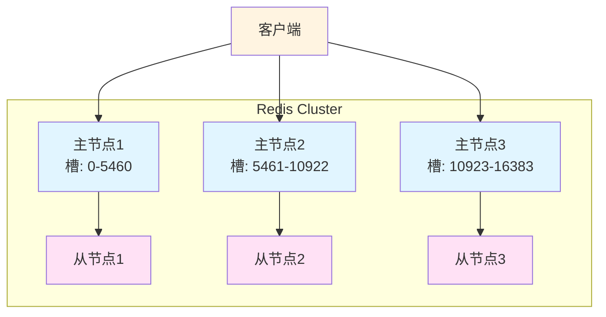
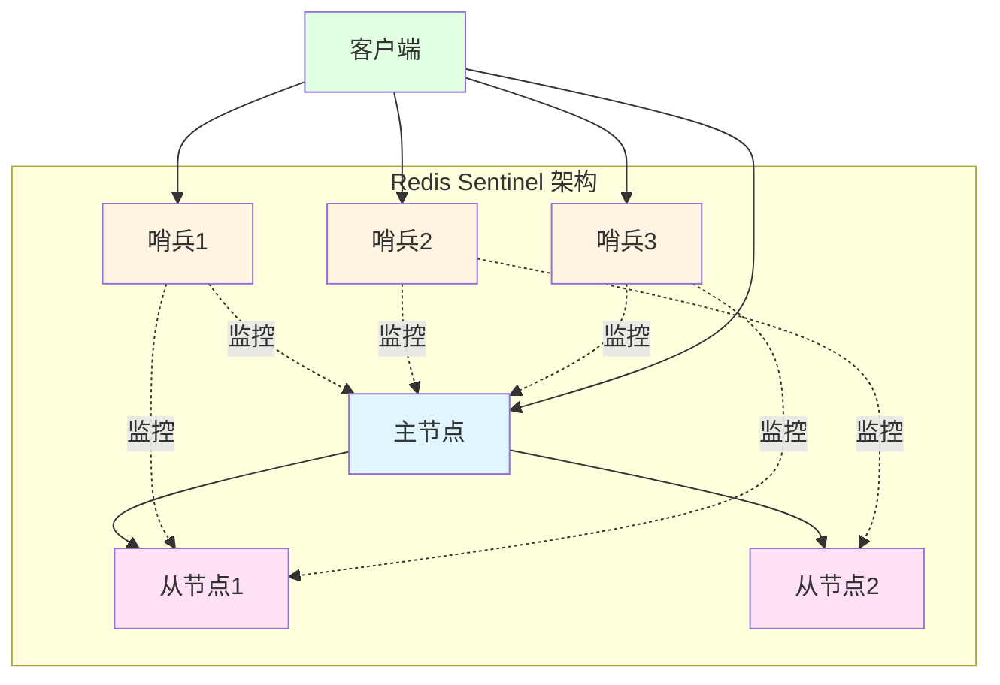
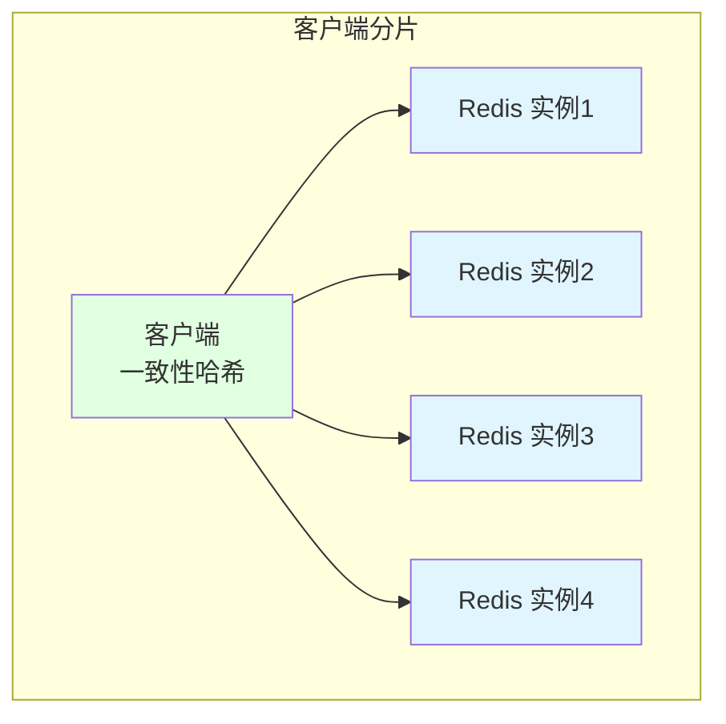
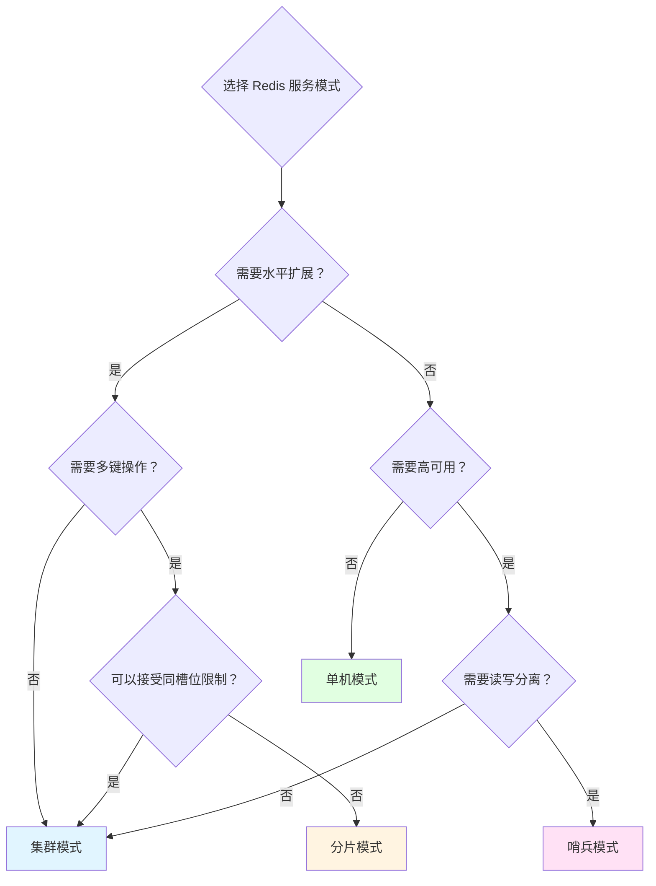
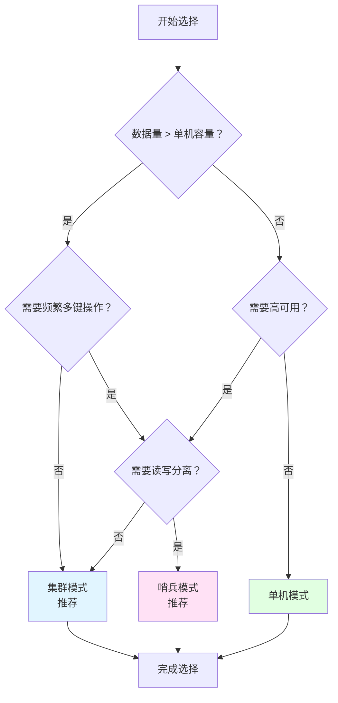

# Redis 服务模式对比

go-redis 客户端实现了三种主要的 Redis 服务模式：
* **集群模式**（Cluster）
* **哨兵模式**（Sentinel）
* **分片模式**（Sharding）

本文档详细介绍每种模式的特点、使用场景和对比分析。

## 目录

- [一、概述](#一概述)
- [二、集群模式（Cluster）](#二集群模式cluster)
- [三、哨兵模式（Sentinel）](#三哨兵模式sentinel)
- [四、分片模式（Sharding）](#四分片模式sharding)
- [五、模式对比](#五模式对比)
- [六、选择建议](#六选择建议)
- [七、配置示例](#七配置示例)

---

## 一、概述

Redis 作为高性能的内存数据库，在不同的业务场景下需要不同的部署架构。go-redis 客户端支持三种主要的服务模式，每种模式都有其特定的使用场景和特点。

### 核心特点

- **集群模式**：Redis 官方的分布式方案，支持数据分片和自动故障转移
- **哨兵模式**：高可用方案，通过哨兵节点监控主从节点，实现自动故障转移
- **分片模式**：客户端分片方案，通过一致性哈希在多个 Redis 实例间分布数据

---

## 二、集群模式（Cluster）

### 2.1 基本概念

Redis 集群模式是 Redis 官方提供的分布式解决方案，通过将数据分片到多个节点上，实现数据的水平扩展。

### 2.2 核心特点

- **数据分片**：使用哈希槽（Hash Slot）将数据分布到 16384 个槽位中
- **高可用**：每个主节点可以有多个从节点，主节点故障时自动故障转移
- **无中心化**：所有节点对等，没有中心节点
- **自动重定向**：客户端连接时会获取集群拓扑信息，自动路由到正确的节点
- **支持扩缩容**：支持在线添加或删除节点

### 2.3 架构特点



### 2.4 工作原理

1. **哈希槽分配**：每个键通过 `CRC16(key) % 16384` 计算槽位
2. **节点通信**：节点间通过 Gossip 协议交换信息
3. **故障检测**：节点通过心跳检测其他节点状态
4. **故障转移**：主节点故障时，从节点自动升级为主节点

### 2.5 适用场景

#### 2.5.1 高并发读写
- 单机 Redis 无法满足性能需求
- 需要将数据分布到多个节点以提升吞吐量

#### 2.5.2 大数据量存储
- 数据量超过单机 Redis 内存限制
- 需要水平扩展存储容量

#### 2.5.3 高可用要求
- 需要自动故障转移
- 可以容忍短暂的写入中断（故障转移期间）

### 2.6 限制与注意事项

- **多键操作限制**：只有同一个槽位的键才能进行多键操作（如 MSET、MGET）
- **事务限制**：多键事务必须保证所有键在同一个槽位
- **Lua 脚本限制**：Lua 脚本中的键必须在同一个槽位
- **最少节点数**：至少需要 3 个主节点才能正常工作（生产环境建议至少 6 个节点：3 主 3 从）

---

## 三、哨兵模式（Sentinel）

### 3.1 基本概念

Redis 哨兵模式是一个高可用解决方案，通过独立的哨兵进程监控主从节点的健康状态，当主节点故障时自动进行故障转移。

### 3.2 核心特点

- **自动故障转移**：主节点故障时，自动选举新的主节点
- **配置提供者**：客户端可以从哨兵获取当前主节点地址
- **通知机制**：哨兵可以通知客户端主从切换事件
- **监控功能**：持续监控主从节点的健康状态
- **最少 3 个哨兵**：保证哨兵高可用，避免脑裂

### 3.3 架构特点



### 3.4 工作原理

1. **监控阶段**：哨兵每秒向主从节点发送 PING 命令检查健康状态
2. **故障检测**：主节点无响应时，哨兵标记为"主观下线"；多个哨兵都认为下线时标记为"客观下线"
3. **故障转移**：
   - 选举领头哨兵
   - 选择最优从节点
   - 将从节点升级为主节点
   - 通知其他从节点切换主节点
4. **配置更新**：通知客户端新的主节点地址

### 3.5 适用场景

#### 3.5.1 主从高可用
- 需要主从复制保证数据冗余
- 需要自动故障转移，减少人工干预

#### 3.5.2 读写分离
- 主节点负责写操作
- 从节点负责读操作，提升读性能

#### 3.5.3 单机扩展场景
- 数据量在单机 Redis 可承受范围内
- 主要是为了高可用，而非扩展性能

### 3.6 限制与注意事项

- **单点写入**：只有主节点可写，写性能受限于单机
- **数据同步延迟**：从节点数据可能有延迟，读从节点可能读到旧数据
- **哨兵数量**：建议至少 3 个哨兵（最好是奇数个）以避免脑裂
- **配置复杂度**：需要同时管理 Redis 节点和哨兵节点

---

## 四、分片模式（Sharding）

### 4.1 基本概念

分片模式是客户端层面的数据分片方案，通过一致性哈希算法将数据分布到多个独立的 Redis 实例上。

### 4.2 核心特点

- **客户端分片**：分片逻辑在客户端实现，Redis 服务器本身不感知
- **一致性哈希**：使用一致性哈希算法分布数据，节点增减时最小化数据迁移
- **灵活配置**：可以混合使用不同模式的 Redis（集群、哨兵、单机）
- **无额外组件**：不需要额外的集群或哨兵组件

### 4.3 架构特点



### 4.4 工作原理

1. **键计算**：对键进行哈希运算得到哈希值
2. **节点选择**：根据哈希值在一致性哈希环上找到对应的节点
3. **请求路由**：将请求发送到对应的 Redis 实例
4. **故障处理**：节点故障时需要客户端处理重试或跳过

### 4.5 适用场景

#### 4.5.1 混合场景
- 需要连接不同类型的 Redis 实例（集群、哨兵、单机混合）
- 业务逻辑要求灵活的数据分布策略

#### 4.5.2 渐进式扩展
- 从小规模开始，逐步增加 Redis 实例
- 不希望在服务端做复杂的集群配置

#### 4.5.3 多租户场景
- 不同租户数据分布到不同 Redis 实例
- 需要逻辑隔离和资源隔离

### 4.6 限制与注意事项

- **客户端复杂度**：分片逻辑在客户端，增加客户端实现复杂度
- **多键操作困难**：涉及多个键的操作需要客户端拆分处理
- **故障处理**：节点故障时，客户端需要自己处理路由和重试
- **数据分布不均**：一致性哈希在某些情况下可能导致数据分布不均

---

## 五、模式对比

### 5.1 特性对比表

| 特性 | 集群模式 | 哨兵模式 | 分片模式 |
|------|---------|---------|---------|
| **数据分片** | ✅ 服务端自动分片 | ❌ 无分片 | ✅ 客户端分片 |
| **水平扩展** | ✅ 支持 | ❌ 不支持 | ✅ 支持 |
| **高可用** | ✅ 自动故障转移 | ✅ 自动故障转移 | ⚠️ 需要客户端处理 |
| **读写分离** | ❌ 不支持 | ✅ 支持 | ⚠️ 客户端实现 |
| **多键操作** | ⚠️ 同槽位限制 | ✅ 完全支持 | ⚠️ 跨节点困难 |
| **事务支持** | ⚠️ 同槽位限制 | ✅ 完全支持 | ⚠️ 跨节点不支持 |
| **Lua 脚本** | ⚠️ 同槽位限制 | ✅ 完全支持 | ⚠️ 跨节点不支持 |
| **部署复杂度** | ⚠️ 中等 | ⚠️ 中等 | ✅ 简单 |
| **客户端复杂度** | ✅ 简单 | ✅ 简单 | ⚠️ 复杂 |
| **最少节点数** | 3 主（建议 6 节点） | 1 主 1 从 3 哨兵 | 2+ 实例 |

### 5.2 性能对比

| 场景 | 集群模式 | 哨兵模式 | 分片模式 |
|------|---------|---------|---------|
| **读性能** | ⭐⭐⭐⭐⭐ | ⭐⭐⭐⭐ | ⭐⭐⭐⭐⭐ |
| **写性能** | ⭐⭐⭐⭐⭐ | ⭐⭐⭐ | ⭐⭐⭐⭐⭐ |
| **故障恢复时间** | ~1-3 秒 | ~10-30 秒 | 需要客户端处理 |
| **数据一致性** | ⭐⭐⭐⭐⭐ | ⭐⭐⭐⭐ | ⭐⭐⭐⭐ |

### 5.3 适用场景对比



---

## 六、选择建议

### 6.1 集群模式选择条件

✅ **选择集群模式，如果你需要：**
- 数据量超过单机 Redis 内存限制
- 需要水平扩展读写性能
- 需要自动故障转移
- 可以接受多键操作的限制
- 有足够的节点资源（至少 3 主 3 从）

### 6.2 哨兵模式选择条件

✅ **选择哨兵模式，如果你需要：**
- 主从高可用架构
- 读写分离提升读性能
- 完整的多键操作和事务支持
- 数据量在单机可承受范围
- 相对简单的部署和管理

### 6.3 分片模式选择条件

✅ **选择分片模式，如果你需要：**
- 连接不同类型的 Redis 实例
- 灵活的数据分布策略
- 渐进式扩展
- 多租户隔离
- 不希望依赖服务端集群功能

### 6.4 决策流程图



---

## 七、配置示例

### 7.1 集群模式配置

```go
// go-redis 集群模式配置
rdb := redis.NewClusterClient(&redis.ClusterOptions{
    Addrs: []string{
        "127.0.0.1:7000",
        "127.0.0.1:7001",
        "127.0.0.1:7002",
        "127.0.0.1:7003",
        "127.0.0.1:7004",
        "127.0.0.1:7005",
    },
    Password: "your-password",
    PoolSize: 10,
})
```

**关键配置说明：**
- `Addrs`：集群中任意节点的地址（客户端会自动发现所有节点）
- `Password`：如果集群启用了密码
- `PoolSize`：每个节点的连接池大小

### 7.2 哨兵模式配置

```go
// go-redis 哨兵模式配置
rdb := redis.NewFailoverClient(&redis.FailoverOptions{
    MasterName:    "mymaster",
    SentinelAddrs: []string{
        "127.0.0.1:26379",
        "127.0.0.1:26380",
        "127.0.0.1:26381",
    },
    Password: "your-password",
    DB:       0,
})
```

**关键配置说明：**
- `MasterName`：主节点的名称（在哨兵配置中定义）
- `SentinelAddrs`：哨兵节点地址列表
- `Password`：Redis 密码
- `DB`：数据库编号（通常使用 0）

### 7.3 分片模式配置

```go
// go-redis 分片模式配置
// 方式1：使用多个客户端实例手动分片
clients := []*redis.Client{
    redis.NewClient(&redis.Options{Addr: "127.0.0.1:6379"}),
    redis.NewClient(&redis.Options{Addr: "127.0.0.1:6380"}),
    redis.NewClient(&redis.Options{Addr: "127.0.0.1:6381"}),
}

// 方式2：使用环一致性哈希
ring := redis.NewRing(&redis.RingOptions{
    Addrs: map[string]string{
        "server1": "127.0.0.1:6379",
        "server2": "127.0.0.1:6380",
        "server3": "127.0.0.1:6381",
    },
})
```

**关键配置说明：**
- `Addrs`：Redis 实例地址映射（key 为服务器标识，value 为地址）
- 一致性哈希会自动将键分布到不同的实例

### 7.4 混合模式配置

```go
// 分片模式下可以混合不同类型的 Redis
ring := redis.NewRing(&redis.RingOptions{
    Addrs: map[string]string{
        "cluster1":  "redis+cluster://127.0.0.1:7000",
        "sentinel1": "redis+sentinel://127.0.0.1:26379?master=mymaster",
        "standalone": "127.0.0.1:6379",
    },
})
```

---

## 八、总结

### 8.1 核心要点

1. **集群模式**：适合大规模数据和高并发场景，但有多键操作限制
2. **哨兵模式**：适合高可用和读写分离场景，功能完整但写性能受限于单机
3. **分片模式**：适合灵活的数据分布需求，但增加客户端复杂度

### 8.2 选择原则

- **数据量大 + 需要扩展** → 集群模式
- **高可用 + 读写分离** → 哨兵模式
- **灵活分片 + 混合架构** → 分片模式

### 8.3 最佳实践

- 生产环境建议至少 3 个哨兵或 6 个集群节点
- 根据实际业务场景选择，不要过度设计
- 考虑运维成本和复杂度
- 做好监控和告警

---

**选择合适的 Redis 服务模式是架构设计的关键决策，需要综合考虑数据量、性能要求、可用性需求和运维成本。**
