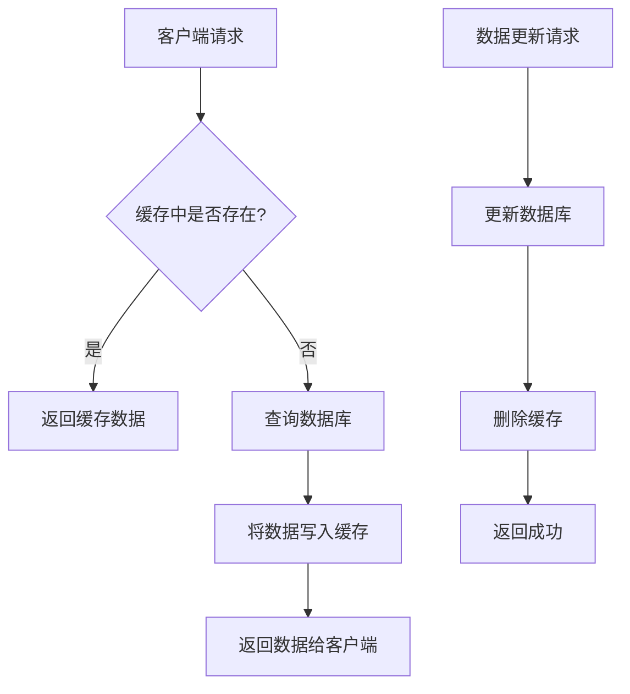
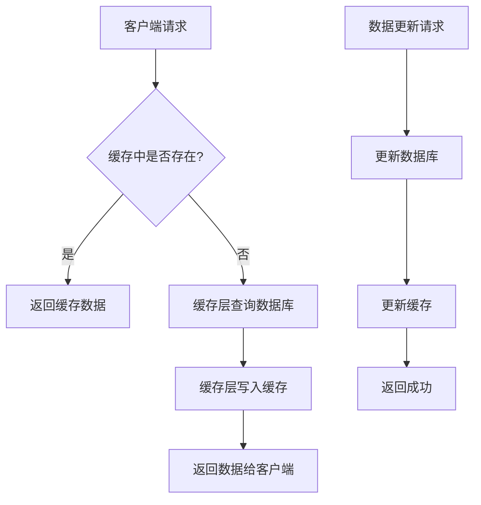
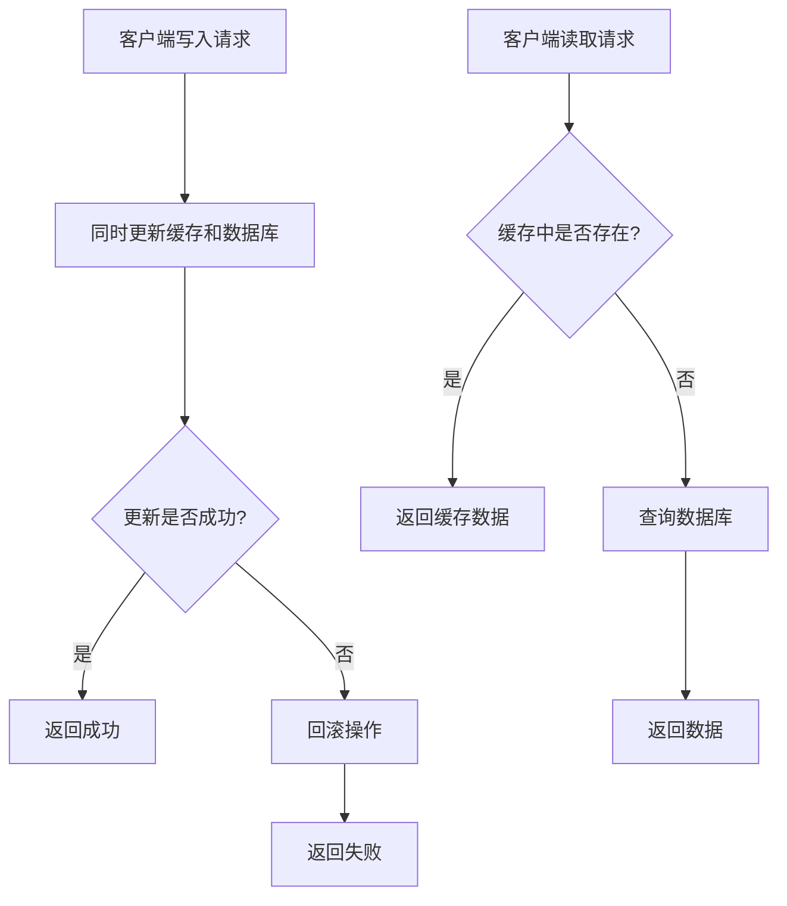
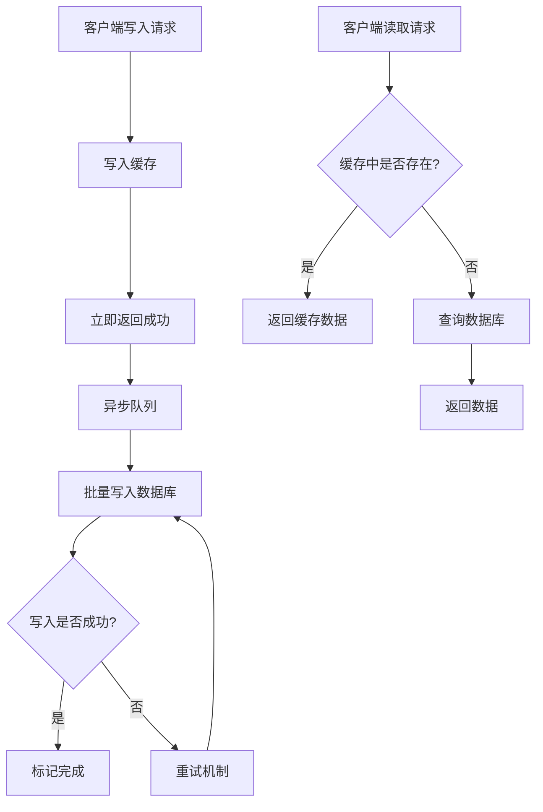
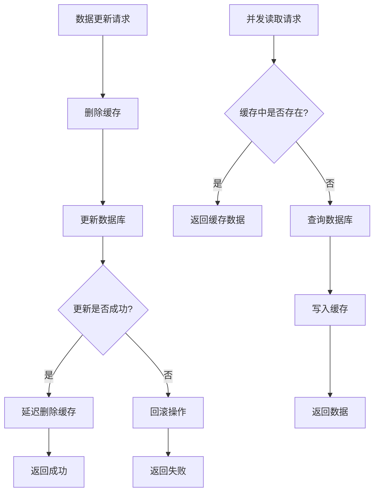
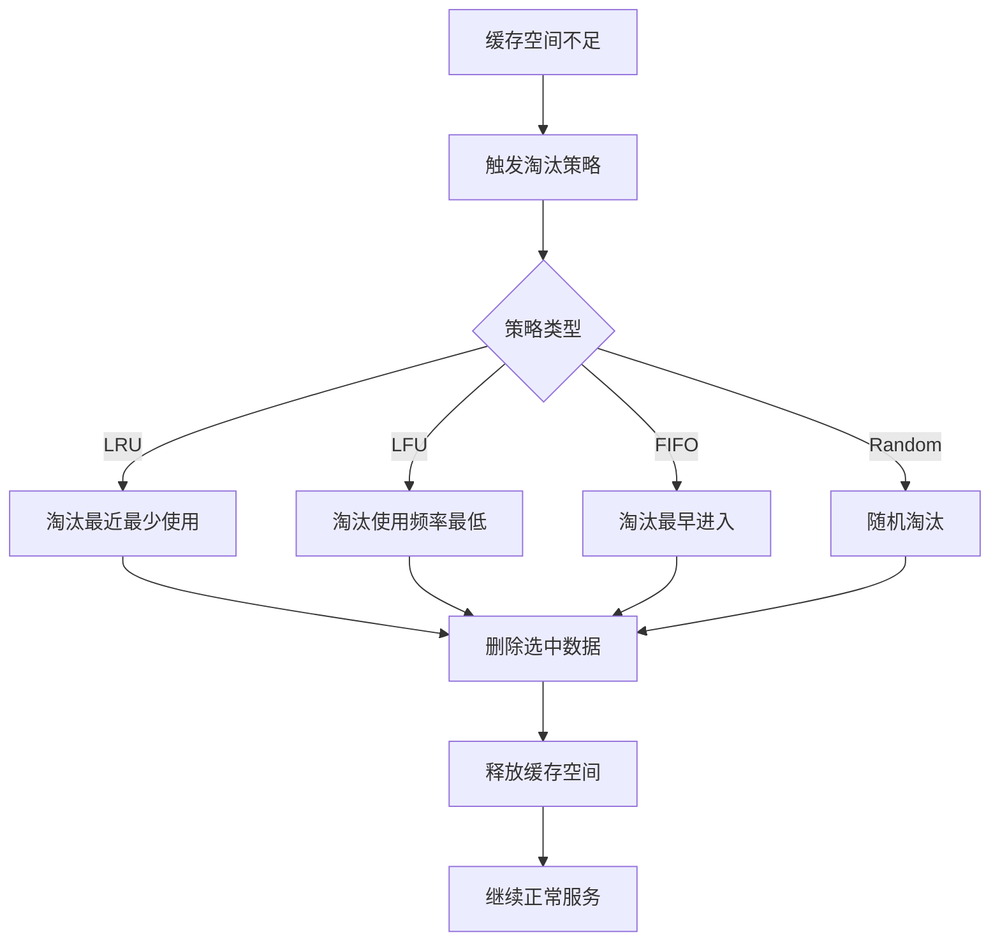

# 缓存策略详解

## 1. 缓存策略概述

缓存策略是计算机系统中提高性能的重要技术，通过在高速存储设备中保存频繁访问的数据，减少对慢速存储设备的访问次数，从而提升系统整体性能。

### 1.1 缓存的基本概念

- **缓存命中（Cache Hit）**：请求的数据在缓存中找到
- **缓存未命中（Cache Miss）**：请求的数据不在缓存中
- **缓存穿透（Cache Penetration）**：查询不存在的数据
- **缓存雪崩（Cache Avalanche）**：大量缓存同时失效
- **缓存击穿（Cache Breakdown）**：热点数据过期导致大量请求直接访问数据库

## 2. 主要缓存模式

### 2.1 Cache-Aside（旁路缓存）

**工作原理**：
- 应用程序直接管理缓存
- 读取时先查缓存，未命中则查数据库并写入缓存
- 写入时先更新数据库，再删除缓存

**优点**：
- 实现简单
- 缓存和数据库解耦
- 灵活性高

**缺点**：
- 可能出现数据不一致
- 需要处理缓存失效逻辑

### 2.2 Read-Through（读穿透）

**工作原理**：
- 缓存作为数据库的代理
- 读取时缓存自动从数据库加载数据
- 对应用程序透明

**优点**：
- 应用程序逻辑简单
- 缓存自动管理

**缺点**：
- 缓存实现复杂
- 首次访问延迟

### 2.3 Write-Through（写穿透）

**工作原理**：
- 写入时同时更新缓存和数据库
- 保证数据一致性

**优点**：
- 数据一致性好
- 写入后立即可读

**缺点**：
- 写入延迟较高
- 缓存利用率可能较低

### 2.4 Write-Behind（写回）

**工作原理**：
- 写入时只更新缓存
- 异步批量写入数据库
- 提高写入性能

**优点**：
- 写入性能高
- 减少数据库压力

**缺点**：
- 数据可能丢失
- 实现复杂
- 一致性风险

## 3. 缓存淘汰策略

### 3.1 LRU（Least Recently Used）

**原理**：淘汰最近最少使用的数据

**适用场景**：
- 时间局部性强的访问模式
- 大多数缓存系统

**实现**：使用双向链表 + 哈希表

### 3.2 LFU（Least Frequently Used）

**原理**：淘汰使用频率最低的数据

**适用场景**：
- 访问频率差异明显的场景
- 长期运行的系统

**实现**：使用最小堆 + 哈希表

### 3.3 FIFO（First In First Out）

**原理**：淘汰最早进入的数据

**适用场景**：
- 简单场景
- 对性能要求不高

**实现**：使用队列

### 3.4 Random

**原理**：随机淘汰数据

**适用场景**：
- 测试环境
- 特殊需求

## 4. 缓存一致性问题

### 4.1 最终一致性

**策略**：
- 设置合理的过期时间
- 异步更新缓存
- 接受短暂的不一致

### 4.2 强一致性

**策略**：
- 分布式锁
- 两阶段提交
- 事务性缓存

### 4.3 解决方案

#### 4.3.1 双删策略
```
1. 删除缓存
2. 更新数据库
3. 延迟删除缓存（防止并发问题）
```

#### 4.3.2 延时双删
```
1. 删除缓存
2. 更新数据库
3. 延时删除缓存
4. 再次延时删除缓存
```

#### 4.3.3 缓存版本号
```
1. 为缓存数据添加版本号
2. 更新时递增版本号
3. 读取时比较版本号
```

## 5. 缓存优化技巧

### 5.1 预热策略

**方法**：
- 系统启动时加载热点数据
- 定时任务预热
- 用户行为预测

### 5.2 缓存分层

**结构**：
- L1缓存：CPU缓存
- L2缓存：内存缓存
- L3缓存：分布式缓存
- L4缓存：CDN缓存

### 5.3 缓存压缩

**技术**：
- 数据压缩
- 序列化优化
- 去重技术

### 5.4 缓存监控

**指标**：
- 命中率
- 响应时间
- 内存使用率
- 淘汰频率

## 6. 最佳实践

### 6.1 缓存设计原则

1. **数据选择**：选择热点数据缓存
2. **过期策略**：设置合理的过期时间
3. **容量规划**：根据业务量设计缓存容量
4. **监控告警**：建立完善的监控体系

### 6.2 常见问题处理

#### 6.2.1 缓存穿透
- 布隆过滤器
- 缓存空值
- 参数校验

#### 6.2.2 缓存雪崩
- 随机过期时间
- 多级缓存
- 熔断降级

#### 6.2.3 缓存击穿
- 互斥锁
- 热点数据永不过期
- 多级缓存

### 6.3 性能优化

1. **批量操作**：减少网络往返
2. **异步更新**：提高响应速度
3. **连接池**：复用连接
4. **压缩传输**：减少网络开销

## 7. 技术选型

### 7.1 内存缓存
- **Redis**：功能丰富，性能优秀
- **Memcached**：简单高效
- **Hazelcast**：分布式缓存

### 7.2 本地缓存
- **Caffeine**：Java高性能缓存
- **Guava Cache**：Google缓存库
- **Ehcache**：企业级缓存

### 7.3 CDN缓存
- **CloudFlare**：全球CDN
- **AWS CloudFront**：AWS CDN
- **阿里云CDN**：国内CDN

## 8. 缓存策略流程图

### 8.1 Cache-Aside 模式流程图



### 8.2 Read-Through 模式流程图



### 8.3 Write-Through 模式流程图



### 8.4 Write-Behind 模式流程图



### 8.5 缓存一致性处理流程图



### 8.6 缓存淘汰策略流程图



## 9. 总结

缓存策略是提升系统性能的重要手段，需要根据具体业务场景选择合适的缓存模式、淘汰策略和一致性方案。在实际应用中，要综合考虑性能、一致性、复杂度和维护成本，选择最适合的缓存策略。

关键要点：
- 选择合适的缓存模式
- 设计合理的淘汰策略
- 处理缓存一致性问题
- 建立完善的监控体系
- 持续优化缓存性能
