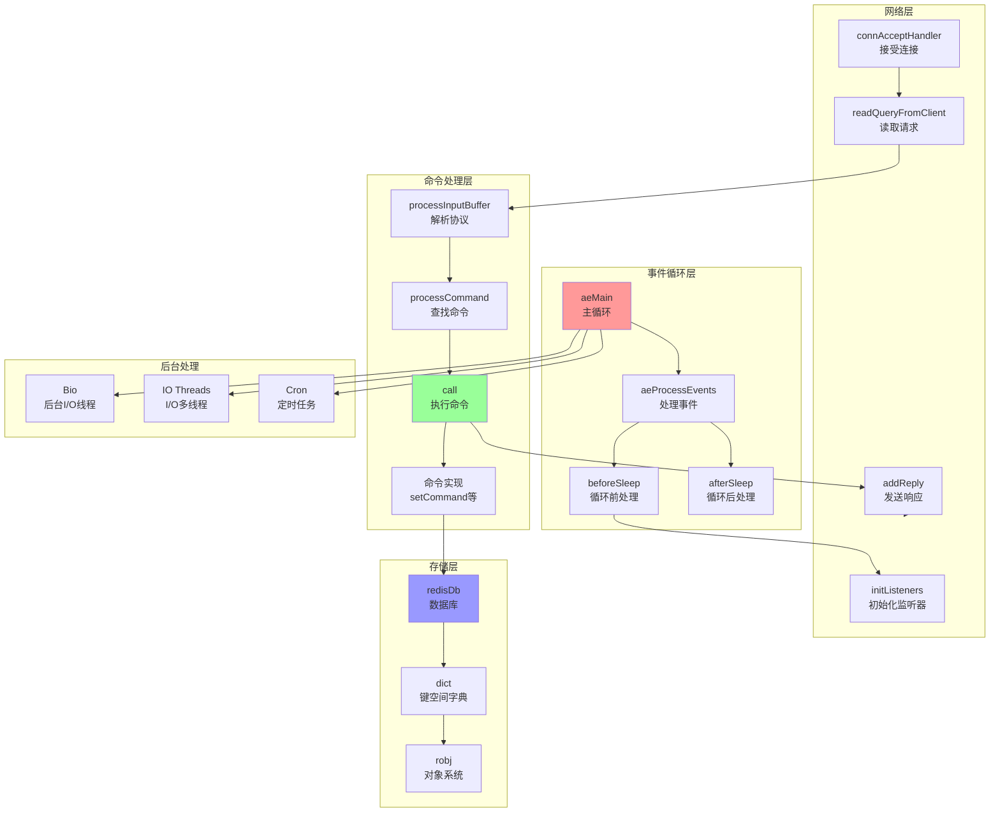
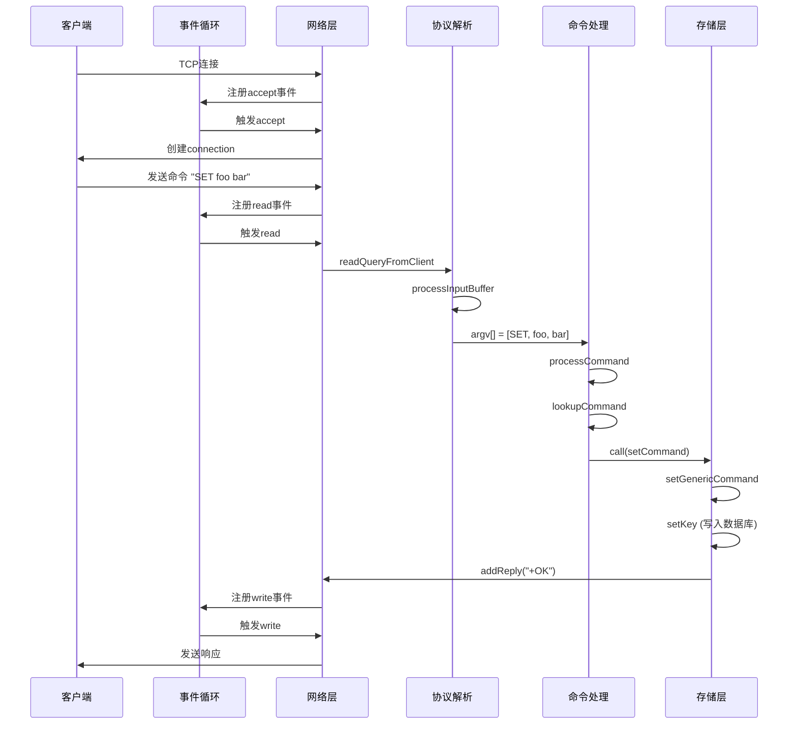

# Redis 网络架构与事件循环

## 概述

Redis 基于事件驱动的单线程服务器（主线程执行命令）。本文档详细分析网络架构、事件循环机制和多路复用实现。

---

## 网络架构

### 监听器初始化

**文件:** `src/server.c:initListeners()`

```c
void initListeners(void) {
    // 1. 配置 TCP/TLS/Unix Socket 监听器
    if (server.port != 0) {
        listener->bindaddr = server.bindaddr;
        listener->port = server.port;
        listener->ct = connectionByType(CONN_TYPE_SOCKET);
    }
    
    if (server.tls_port != 0) {
        listener->port = server.tls_port;
        listener->ct = connectionByType(CONN_TYPE_TLS);
    }
    
    if (server.unixsocket != NULL) {
        listener->ct = connectionByType(CONN_TYPE_UNIX);
    }
    
    // 2. 创建监听套接字并注册accept事件处理器
    for (int j = 0; j < CONN_TYPE_MAX; j++) {
        listener = &server.listeners[j];
        if (listener->ct == NULL) continue;
        
        // 监听端口
        connListen(listener);
        
        // 注册accept事件处理器
        createSocketAcceptHandler(listener, connAcceptHandler(listener->ct));
    }
}
```

### 端口绑定

**文件:** `src/server.c:listenToPort()`

```c
int listenToPort(connListener *sfd) {
    for (j = 0; j < sfd->bindaddr_count; j++) {
        char* addr = bindaddr[j];
        
        if (strchr(addr,':')) {
            // IPv6 地址
            sfd->fd[sfd->count] = anetTcp6Server(port, addr, server.tcp_backlog);
        } else {
            // IPv4 地址
            sfd->fd[sfd->count] = anetTcpServer(port, addr, server.tcp_backlog);
        }
        
        // 设置为非阻塞
        anetNonBlock(NULL, sfd->fd[sfd->count]);
        anetCloexec(sfd->fd[sfd->count]); // close-on-exec
        
        sfd->count++;
    }
    return C_OK;
}
```

### 接受连接

**文件:** `src/socket.c:connSocketAcceptHandler()`

```c
static void connSocketAcceptHandler(aeEventLoop *el, int fd, void *privdata, int mask) {
    int max = server.max_new_conns_per_cycle;
    
    while(max--) {
        // 接受连接
        cfd = anetTcpAccept(fd, cip, sizeof(cip), &cport);
        if (cfd == ANET_ERR) {
            if (errno == EWOULDBLOCK) return;
            continue;
        }
        
        // 创建客户端
        conn = connCreateAcceptedSocket(el, cfd, NULL);
        
        // 处理新连接
        acceptCommonHandler(conn, 0, cip);
    }
}
```

---

## 事件循环

### 事件循环初始化

**文件:** `src/server.c:initServer()`

```c
void initServer(void) {
    // 创建事件循环
    server.el = aeCreateEventLoop(server.maxclients + CONFIG_FDSET_INCR);
    
    // 设置before/after sleep回调
    server.el->beforesleep = beforeSleep;
    server.el->aftersleep = afterSleep;
}

// InitServerLast 中初始化IO线程
void InitServerLast(void) {
    bioInit();
    initThreadedIO();  // ← 初始化IO线程池
    set_jemalloc_bg_thread(server.jemalloc_bg_thread);
}
```

### 主事件循环

**文件:** `src/ae.c:aeMain()`

```c
void aeMain(aeEventLoop *eventLoop) {
    eventLoop->stop = 0;
    
    while (!eventLoop->stop) {
        // 处理就绪事件
        aeProcessEvents(eventLoop, AE_ALL_EVENTS|
                                   AE_CALL_BEFORE_SLEEP|
                                   AE_CALL_AFTER_SLEEP);
    }
}
```

### 事件处理

**文件:** `src/ae.c:aeProcessEvents()`

```c
int aeProcessEvents(aeEventLoop *eventLoop, int flags) {
    int processed = 0;
    
    // 1. 计算时间事件超时
    if (flags & AE_TIME_EVENTS && !(flags & AE_DONT_WAIT)) {
        aeTimeEvent *shortest = aeSearchNearestTimer(eventLoop);
        if (shortest) {
            long now_sec, now_ms;
            aeGetTime(&now_sec, &now_ms);
            struct timeval tv;
            long long ms = (shortest->when_sec - now_sec)*1000 +
                           (shortest->when_ms - now_ms);
            
            if (ms > 0) {
                tv.tv_sec = ms/1000;
                tv.tv_usec = (ms % 1000)*1000;
            } else {
                tv.tv_sec = 0;
                tv.tv_usec = 0;
            }
        }
    }
    
    // 2. 调用 beforeSleep
    if (eventLoop->beforesleep != NULL && flags & AE_CALL_BEFORE_SLEEP)
        eventLoop->beforesleep(eventLoop);
    
    // 3. 处理文件事件（网络I/O）
    int numevents = aeApiPoll(eventLoop, tvp);
    
    for (j = 0; j < numevents; j++) {
        aeFileEvent *fe = &eventLoop->events[eventLoop->fired[j].fd];
        int mask = eventLoop->fired[j].mask;
        int fd = eventLoop->fired[j].fd;
        
        // 可读事件
        if (fe->mask & mask & AE_READABLE) {
            rfired = 1;
            fe->rfileProc(eventLoop, fd, fe->clientData, mask);
        }
        
        // 可写事件
        if (fe->mask & mask & AE_WRITABLE) {
            if (!rfired || fe->wfileProc != fe->rfileProc)
                fe->wfileProc(eventLoop, fd, fe->clientData, mask);
        }
        
        processed++;
    }
    
    // 4. 调用 afterSleep
    if (eventLoop->aftersleep != NULL && flags & AE_CALL_AFTER_SLEEP)
        eventLoop->aftersleep(eventLoop);
    
    // 5. 处理时间事件
    if (flags & AE_TIME_EVENTS)
        processed += processTimeEvents(eventLoop);
    
    return processed;
}
```

---

## BeforeSleep / AfterSleep

### beforeSleep

**文件:** `src/server.c:beforeSleep()`

```c
void beforeSleep(aeEventLoop *eventLoop) {
    // 1. 处理被阻塞的客户端
    handleClientsWithPendingReadsUsingThreads();
    
    // 2. 写入pending的写缓冲区
    handleClientsWithPendingWrites();
    
    // 3. 处理客户端挂起读
    handleClientsWithPendingReadsUsingThreads();
    
    // 4. 增加全局命令时间
    updateCachedTime(1);
    
    // 5. 自动过期清理
    evictionPoolPopulate(DICT_MAIN_KEYS);
    
    // 6. 更新统计
    trackInstantaneousMetric(STATS_METRIC_COMMAND, server.stat_numcommands);
}
```

### afterSleep

**文件:** `src/server.c:afterSleep()`

```c
void afterSleep(aeEventLoop *eventLoop) {
    /* Currently nothing. */
}
```

---

## 多路复用机制

### 支持的后端

Redis 根据平台自动选择最优I/O多路复用：

- **Linux**: epoll（高性能）
- **BSD/Mac**: kqueue（高性能）
- **Solaris**: evport（高性能）
- **其他**: select（通用但性能较低）

### epoll 实现

**文件:** `src/ae_epoll.c`

```c
static int aeApiPoll(aeEventLoop *eventLoop, struct timeval *tvp) {
    aeApiState *state = eventLoop->apidata;
    int retval, numevents = 0;
    
    retval = epoll_wait(state->epfd, state->events, eventLoop->setsize,
                       tvp ? (tvp->tv_sec*1000 + tvp->tv_usec/1000) : -1);
    
    if (retval > 0) {
        int j;
        numevents = retval;
        
        for (j = 0; j < numevents; j++) {
            int mask = 0;
            struct epoll_event *e = state->events + j;
            
            if (e->events & EPOLLIN) mask |= AE_READABLE;
            if (e->events & EPOLLOUT) mask |= AE_WRITABLE;
            if (e->events & EPOLLERR) mask |= AE_READABLE | AE_WRITABLE;
            if (e->events & EPOLLHUP) mask |= AE_READABLE | AE_WRITABLE;
            
            eventLoop->fired[j].fd = e->data.fd;
            eventLoop->fired[j].mask = mask;
        }
    }
    
    return numevents;
}
```

---

## 服务器组件架构

### 核心组件流程图



### 模块依赖关系

```
Event Loop (ae.c)
    ↓
Network Layer (networking.c, socket.c)
    ↓
Command Layer (server.c:processCommand)
    ↓
Object Layer (object.c, t_*.c)
    ↓
Data Structure (dict.c, sds.c, listpack.c)
    ↓
Memory Management (zmalloc.c)
```

---

## 命令处理完整流程



---

## 性能优化

### 1. I/O 多路复用
- 使用 epoll/kqueue 减少系统调用
- 单线程避免锁竞争
- 非阻塞I/O

### 2. I/O 多线程（Redis 6.0+）
- **主线程**：执行命令、操作数据库（单线程保证原子性）
- **IO线程池**：处理网络读写、协议解析
- **读操作**：`io-threads-do-reads yes` 后，IO线程处理读取和解析
- **写操作**：响应写入由IO线程池并发处理

**优势：**
- 利用多核CPU，提升网络I/O吞吐量
- 命令执行仍单线程，无锁竞争
- 适合高并发场景（如缓存、session存储）

### 3. 事件驱动
- 按需注册/注销事件
- 批量处理就绪事件
- 时间事件与文件事件分离

### 4. 批处理
- 一次 `accept` 接受多个连接
- `beforeSleep` 批量处理pending操作
- 批量写入响应

### 5. 零拷贝
- 使用 writev 合并写
- 减少内存复制
- 延迟释放大对象

---

## 总结

Redis 的事件驱动架构特点：

1. **单线程主循环**: 命令执行在主线程，保证原子性
2. **异步I/O**: 通过多路复用实现高并发
3. **事件驱动**: 文件事件+时间事件统一处理
4. **批处理优化**: beforeSleep 处理pending任务
5. **模块化设计**: 清晰的层次划分

相关文档：
- [Redis 服务器架构](redis-server.md)
- [Redis 命令执行流程](redis_cli_cmd.md)
- [Redis 数据类型](redis-data-type.md)
- [Redis 调试指南](redis-debug.md)

