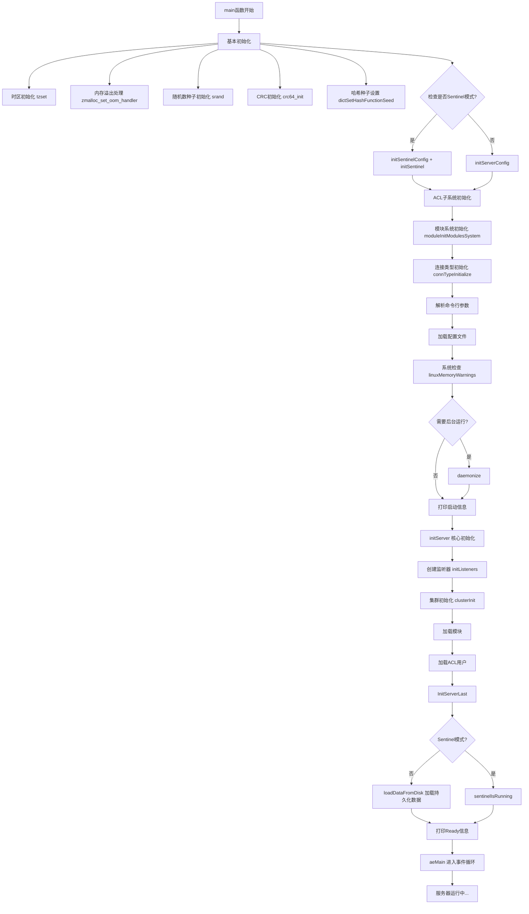

## Redis Server 启动流程详解

### 一、概述

Redis Server 的启动是一个复杂的过程，涉及配置解析、数据结构初始化、持久化数据加载、网络监听设置等。本文档详细分析了 `server.c` 中 `main()` 函数的执行流程。

### 二、启动流程图



### 三、详细步骤分析

#### 阶段 1: 基础环境初始化 (lines 7418-7441)

```c
// 关键代码
tzset();                                    // 设置时区
zmalloc_set_oom_handler(redisOutOfMemoryHandler); // 注册OOM处理函数
gettimeofday(&tv,NULL);
srand(time(NULL)^getpid()^tv.tv_usec);      // 随机数种子
srandom(time(NULL)^getpid()^tv.tv_usec);
init_genrand64(...);                        // MT64随机数生成器初始化
crc64_init();                               // CRC64哈希初始化
dictSetHashFunctionSeed(hashseed);          // 字典哈希种子
```

**作用**：
- 初始化系统随机数生成器（防止哈希碰撞攻击）
- 设置内存溢出处理回调
- 初始化各种哈希算法

#### 阶段 2: 配置初始化 (lines 7443-7465)

```c
server.sentinel_mode = checkForSentinelMode(argc,argv, exec_name);
initServerConfig();                         // 初始化服务器配置
ACLInit();                                  // ACL子系统
moduleInitModulesSystem();                  // 模块系统
connTypeInitialize();                       // 连接类型初始化

if (server.sentinel_mode) {
    initSentinelConfig();
    initSentinel();
}
```

**`initServerConfig()` 关键初始化**：
- 设置默认端口、数据库数量
- 初始化命令表 `populateCommandTable()`
- 设置默认保存策略
- 初始化复制相关变量

#### 阶段 3: 命令行参数解析 (lines 7475-7592)

```c
loadServerConfig(server.configfile, config_from_stdin, options);
```

**支持的参数格式**：
- `redis-server /path/to/config.conf`
- `redis-server --port 6380`
- `redis-server --port 6380 --requirepass xxx`
- `redis-server -` (从stdin读取配置)

**优先级**：配置文件 < stdin < 命令行参数（最后者生效）

#### 阶段 4: 系统检查 (lines 7597-7625)

```c
#ifdef __linux__
    linuxMemoryWarnings();              // Linux内存警告检查
    checkXenClocksource(&err_msg);     // 检查时钟源
    checkLinuxMadvFreeForkBug(&err_msg); // ARM64 Copy-on-Write bug检查
#endif
```

**可能退出的情况**：
- ARM64平台检测到内核bug且未配置忽略警告

#### 阶段 5: 后台运行 (lines 7622-7646)

```c
if (background) daemonize();           // 守护进程化
serverLog(LL_NOTICE, "oO0OoO0OoO0Oo Redis is starting oO0OoO0Oo");
redisAsciiArt();                       // 打印ASCII艺术字
```

#### 阶段 6: 服务器核心初始化 (line 7642)

**`initServer()` 详细过程**：

```c
void initServer(void) {
    // 1. 信号处理
    setupSignalHandlers();              // 注册SIGHUP/SIGTERM等信号处理
    
    // 2. 线程管理
    ThreadsManager_init();              // 初始化线程管理器
    makeThreadKillable();              // 设置线程可被杀死
    
    // 3. 数据结构初始化
    server.clients = listCreate();      // 客户端列表
    server.slaves = listCreate();       // 从库列表
    server.clients_pending_write = listCreate();
    
    // 4. 数据库初始化
    for (j = 0; j < server.dbnum; j++) {
        server.db[j].keys = kvstoreCreate(...);      // 键值存储
        server.db[j].expires = kvstoreCreate(...);   // 过期字典
        server.db[j].blocking_keys = dictCreate(...);
        server.db[j].watched_keys = dictCreate(...);
    }
    
    // 5. 事件循环创建
    server.el = aeCreateEventLoop(server.maxclients+CONFIG_FDSET_INCR);
    
    // 6. 定时器注册
    aeCreateTimeEvent(server.el, 1, serverCron, NULL, NULL);
    
    // 7. 脚本系统
    scriptingInit(1);                   // Lua脚本初始化
    functionsInit();                    // 函数功能初始化
    
    // 8. 其他子系统
    slowlogInit();                      // 慢查询日志
    latencyMonitorInit();               // 延迟监控
}
```

**关键数据结构**：
- `server.db[]`: Redis数据库数组♆（默认16个）
- `server.el`: 事件循环（基于epoll/kqueue/select）
- `serverCron`: 定时任务（每毫秒执行一次）

#### 阶段 7: 监听器初始化 (lines 7657, 2992-3062)

**`initListeners()` 过程**：

```c
void initListeners(void) {
    // 1. 配置TCP监听器
    if (server.port != 0) {
        listener->port = server.port;
        listener->ct = connectionByType(CONN_TYPE_SOCKET);
    }
    
    // 2. TLS监听器
    if (server.tls_port != 0) {
        listener->port = server.tls_port;
        listener->ct = connectionByType(CONN_TYPE_TLS);
    }
    
    // 3. Unix Socket监听器
    if (server.unixsocket != NULL) {
        listener->ct = connectionByType(CONN_TYPE_UNIX);
    }
    
    // 4. 创建监听并注册事件处理器
    for (int j = 0; j < CONN_TYPE_MAX; j++) {
        connListen(listener);                              // 监听端口
        createSocketAcceptHandler(listener, accept_handler); // 注册接受连接处理器
    }
}
```

**监听器类型**：
- TCP Socket: 常规网络连接
- TLS Socket: 加密网络连接
- Unix Socket: 本地域套接字

#### 阶段 8: 集群和模块初始化 (lines 7647-7660)

```c
if (server.cluster_enabled) {
    clusterInit();                  // 初始化集群功能
}

if (!server.sentinel_mode) {
    moduleLoadInternalModules();    // 加载内部模块
    moduleLoadFromQueue();         // 加载配置中指定的模块
}
```

#### 阶段 9: 最终初始化 (lines 7657-7661)

**为什么单独最后初始化？**
- 避免ld.so的竞态条件bug：Thread Local Storage初始化与dlopen冲突
- 详见: https://sourceware.org/bugzilla/show_bug.cgi?id=19329

**`InitServerLast()` 详细实现**：

```c
void InitServerLast(void) {
    bioInit();                                    // 后台I/O线程初始化
    initThreadedIO();                            // 多线程I/O初始化
    set_jemalloc_bg_thread(server.jemalloc_bg_thread);  // jemalloc后台线程
    server.initial_memory_usage = zmalloc_used_memory(); // 记录初始内存
}
```

##### 1. bioInit() - 后台I/O线程系统

**功能**：创建3个专用后台线程处理耗时操作，避免阻塞主事件循环。

**三个工作线程**：

| 线程 | 职责 | 处理任务 |
|------|------|---------|
| **bio_close_file** | 异步关闭文件 | 关闭RDB文件、AOF文件等（避免unlink阻塞） |
| **bio_aof** | AOF fsync | AOF日志的磁盘同步操作 |
| **bio_lazy_free** | 延迟释放内存 | 大对象删除、FLUSHDB等内存释放操作 |

**实现机制**：

```c
void bioInit(void) {
    // 1. 为每个worker创建互斥锁和条件变量
    for (j = 0; j < 3; j++) {
        pthread_mutex_init(&bio_mutex[j], NULL);
        pthread_cond_init(&bio_newjob_cond[j], NULL);
        bio_jobs[j] = listCreate();  // 任务队列
    }
    
    // 2. 创建通知管道
    anetPipe(job_comp_pipe, ...);  // 后台线程通知主线程
    
    // 3. 注册到事件循环
    aeCreateFileEvent(server.el, job_comp_pipe[0], AE_READABLE, 
                      bioPipeReadJobCompList, NULL);
    
    // 4. 设置线程栈大小（至少REDIS_THREAD_STACK_SIZE）
    pthread_attr_setstacksize(&attr, stacksize);
    
    // 5. 创建3个工作线程
    for (j = 0; j < 3; j++)
        pthread_create(&thread, &attr, bioProcessBackgroundJobs, (void*)j);
}
```

**使用场景示例**：

```c
// AOF fsync - 不阻塞主线程
bioCreateFsyncJob(server.aof_fd);

// 延迟删除大键 - 避免服务器卡顿
bioCreateLazyFreeJob(lazyfreeDatabase, 1, db);

// 异步关闭文件 - 避免unlink阻塞
bioCreateCloseJob(fd, async_close_file, 0, NULL, NULL);
```

##### 2. initThreadedIO() - 多线程I/O

**功能**：创建I/O线程池，在多个线程中并行处理客户端的读写操作。

**工作机制**：

```
配置: io-threads 4 (1个主线程 + 3个IO线程)

主线程职责：
  - 接受新连接
  - 命令解析（协议解析）
  - 命令执行（单线程保证数据一致性）
  - 结果写回（读就绪客户端）

IO线程职责：
  - 读取客户端请求数据（read()）
  - 发送客户端响应数据（write()）
```

**初始化过程**：

```c
void initThreadedIO(void) {
    if (server.io_threads_num <= 1) return;  // 单线程模式直接返回
    
    for (int i = 1; i < server.io_threads_num; i++) {
        IOThread *t = &IOThreads[i];
        
        // 每个IO线程创建独立的事件循环
        t->el = aeCreateEventLoop(...);
        
        // 创建任务队列
        t->pending_clients = listCreate();
        t->processing_clients = listCreate();
        
        // 创建事件通知器（用于主线程与IO线程通信）
        t->pending_clients_notifier = createEventNotifier();
        
        // 注册事件处理器
        aeCreateFileEvent(t->el, ...);
        
        // 创建IO线程
        pthread_create(&t->tid, NULL, IOThreadMain, t);
    }
}
```

**性能收益**：
- 读写分离：主线程处理逻辑，IO线程处理数据拷贝
- 多核利用：充分利用多核CPU处理并发I/O
- 吞吐提升：高并发场景下可提升2-3倍吞吐量

**限制**：
- 最多128个IO线程：`IO_THREADS_MAX_NUM = 128`
- 命令执行仍单线程：保证数据一致性
- 默认禁用：`io-threads 1`

##### 3. set_jemalloc_bg_thread() - jemalloc后台线程

**功能**：控制jemalloc内存分配器的后台线程行为。

**jemalloc后台线程作用**：
- 后台purge：清理不再使用的内存页
- 预分配优化：为下次分配预取内存
- 碎片整理：减少内存碎片

**配置选项**：
```c
set_jemalloc_bg_thread(1);  // 启用后台线程（默认）
set_jemalloc_bg_thread(0);  // 禁用（减少CPU占用，但可能增加内存使用）
```

##### 4. 记录初始内存使用量

```c
server.initial_memory_usage = zmalloc_used_memory();
```

**用途**：
- 监控服务器启动后的内存增长
- 诊断内存泄漏
- `INFO memory` 命令中的 `used_memory_human` 展示

**查看方式**：
```bash
redis-cli INFO memory | grep initial_memory_usage
```

#### 阶段 10: 加载持久化数据 (lines 7663-7678)

**`loadDataFromDisk()` 流程**：

```c
void loadDataFromDisk(void) {
    if (server.aof_state == AOF_ON) {
        // 优先加载AOF文件
        loadAppendOnlyFiles(server.aof_manifest);
    } else {
        // 否则加载RDB文件
        rdbLoad(server.rdb_filename, &rsi, rdb_flags);
    }
}
```

**加载策略**：
1. 如果AOF开启 → 加载AOF
2. 否则加载RDB
3. Master节点创建复制积压缓冲区
4. 恢复复制ID和偏移量

#### 阶段 11: 进入事件循环 (line 7711)

**`aeMain()` 主循环**：

```c
void aeMain(aeEventLoop *eventLoop) {
    eventLoop->stop = 0;
    while (!eventLoop->stop) {
        aeProcessEvents(eventLoop, AE_ALL_EVENTS|
                                   AE_CALL_BEFORE_SLEEP|
                                   AE_CALL_AFTER_SLEEP);
    }
}
```

**事件处理循环**：

```
while (!stop) {
    1. beforeSleep() {                    // 处理客户端的待写数据
         - 处理命令
         - 处理阻塞命令
         - 处理慢查询日志
     }
     
    2. aeApiPoll() {                      // 等待I/O事件
         - 等待文件描述符就绪
         - 返回就绪的文件描述符列表
     }
     
    3. afterSleep() {                     // 处理写后事件
         - 模块后置处理
     }
     
    4. 处理文件事件 {
         - 读取事件: 读取客户端命令
         - 写入事件: 发送客户端响应
     }
     
    5. 处理时间事件 {
         - serverCron(): 执行后台任务
           * 过期键清理
           * 内存淘汰
           * RDB/AOF持久化
           * 统计信息更新
           * 客户端超时检查
     }
}
```

### 四、关键函数说明

#### 4.1 initServerConfig()

**位置**: `src/server.c:2206-2338`

初始化服务器默认配置：
- 端口：6379
- 数据库数量：16
- RDB保存策略：默认3个（1小时1个改动、5分钟100个改动、1分钟10000个改动）
- 命令表：调用 `populateCommandTable()` 注册所有Redis命令

#### 4.2 initServer()

**位置**: `src/server.c:2775-2990`

核心服务器初始化，包括：
- 信号处理注册
- 数据结构创建（客户端列表、数据库字典等）
- 事件循环创建
- 注册定时器（`serverCron`）
- Lua脚本系统初始化

#### 4.3 loadDataFromDisk()

**位置**: `src/server.c:7089-7159`

从磁盘加载数据：
- AOF优先：如果配置了AOF，加载AOF日志
- RDB备选：否则加载RDB快照
- 恢复复制状态：从RDB中恢复复制ID和偏移量

#### 4.4 aeMain()

**位置**: `src/ae.c:492-499`

事件循环主函数：
- 无限循环处理文件事件和时间事件
- 调用 `aeProcessEvents()` 处理所有事件
- 在 `beforeSleep` 和 `afterSleep` 回调中处理额外逻辑

### 五、初始化顺序总结

```
1. 基础环境
   ↓
2. 配置初始化 (initServerConfig)
   ↓
3. 模块/ACL初始化
   ↓
4. 参数解析和配置加载
   ↓
5. 系统检查
   ↓
6. 后台运行 (可选)
   ↓
7. 服务器核心初始化 (initServer)
   ↓
8. 创建监听器 (initListeners)
   ↓
9. 集群初始化 (clusterInit)
   ↓
10. 加载模块
    ↓
11. 最终线程初始化 (InitServerLast)
    ↓
12. 加载持久化数据 (loadDataFromDisk)
    ↓
13. 进入事件循环 (aeMain)
    ↓
14. Ready to accept connections!
```

### 六、重要日志输出

启动过程中的关键日志：

```
oO0OoO0OoO0Oo Redis is starting oO0OoO0OoO0Oo
Redis version=..., bits=64, commit=..., modified=0, pid=..., just started
monotonic clock: POSIX clock_gettime
Server initialized
DB loaded from disk: X.XXX seconds
Ready to accept connections tcp
```

### 七、调试技巧

在CLion中调试启动流程：

1. **在main()函数入口设置断点** (line 7370)
2. **在initServerConfig()设置断点** (line 2206)
3. **在initServer()设置断点** (line 2775)
4. **在loadDataFromDisk()设置断点** (line 7089)
5. **在aeMain()设置断点** (line 492 in ae.c)

通过单步执行可以完整跟踪Redis的启动过程。

### 八、参考资料

- [Redis源码注释](https://github.com/redis/redis)
- [ld.so Thread Local Storage bug](https://sourceware.org/bugzilla/show_bug.cgi?id=19329)
- [Redis事件循环详解](./ae-event-loop.md)
